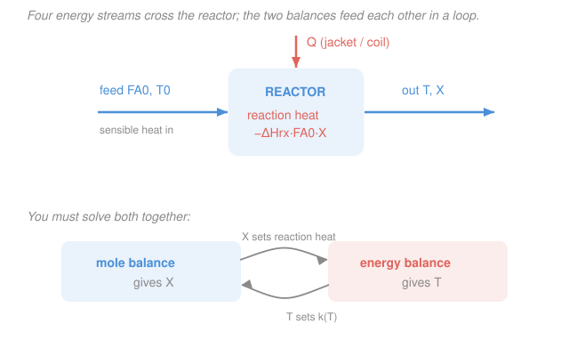

# Chemical Reaction Engineering · Lesson 3.1: The reactor energy balance

> ⏱ ~15 min · Module 3: Nonisothermal Reactors & the Energy Balance · Builds on: [1.5 The CSTR](01-05-cstr.md), [1.6 The PFR & packed-bed reactor](01-06-pfr-packed-bed.md), [2.1 Conversion & the design equations](02-01-conversion-design-equations.md), [`engineering-thermodynamics` 2.3 (energy balance on a control volume)](../../engineering-thermodynamics/lessons/02-03-mass-energy-balance-control-volumes.md), [`engineering-thermodynamics` 3.1 (sign conventions)](../../engineering-thermodynamics/lessons/03-01-second-law-carnot-limit.md) · Unlocks: [3.2 Adiabatic operation](03-02-adiabatic-operation.md) and every later Module-3 lesson

## Why this matters

Every reactor you sized in Modules 1–2 was a lie of convenience: we held the temperature fixed and read $k$ off as a constant. But real reactions **move the temperature**. An exothermic reaction dumps heat into its own mixture; an endothermic one steals heat and cools down. And from [1.2](01-02-arrhenius-temperature-dependence.md) you know $k = A\,e^{-E/(RT)}$ is *exponentially* sensitive to $T$ — a 10-degree swing can double the rate. So the moment heat is in play, the mole balance and the temperature stop being separate problems: **$T$ changes $k$, which changes the rate, which changes $X$, which changes how much heat is released, which changes $T$ again.** You cannot solve one without the other. This lesson writes down the second equation — the energy balance — that closes the loop. It is also where the two great dangers of Module 3 are born: thermal runaway and multiple steady states.

## The idea

Think of the reactor as a bank account for energy. Energy walks in with the cold feed, energy is added or removed through the wall (a jacket or cooling coil), the reaction itself either deposits or withdraws heat, and energy walks out with the hot product. At steady state the account doesn't drift — everything in balances everything out. That single "no drift" statement, written for energy instead of moles, is the whole lesson.

There are exactly two places energy goes as the stream passes through:

1. **Heating the feed up to reaction temperature.** The feed enters cold (at $T_0$) and leaves at $T$. Warming every mole of it from $T_0$ to $T$ costs sensible heat — that's the $\sum \Theta_i C_{p,i}(T - T_0)$ term.
2. **The reaction itself.** Breaking and forming bonds releases heat (exothermic) or absorbs it (endothermic). How much depends on the **heat of reaction** $\Delta H_{rx}$ and on how far the reaction has run, i.e. the conversion $X$.

The reactor wall can top up or drain the account with an external heat duty $\dot Q$. Set deposits equal to withdrawals and you have one equation linking $\dot Q$, $T$, and $X$. Pair it with the mole balance (which links $V$, $T$, and $X$) and the system is finally closed.

## The formal version

For a **steady-flow reactor** (batch is a variant we'll note), the energy balance is

$$\boxed{\;\dot Q - \dot W_s - F_{A0}\sum_i \Theta_i C_{p,i}\,(T - T_0) - \Delta H_{rx}(T)\,F_{A0}X = 0\;}$$

*In words: (heat added through the wall) minus (shaft work done by the fluid) minus (sensible heat to warm the feed from $T_0$ to $T$) minus (heat consumed by the reaction) equals zero — the account doesn't drift.* Term by term, with units:

- $\dot Q$ — rate of heat added through the wall, in watts ($\mathrm{J\,s^{-1}}$). Positive = heat **into** the reactor (heating); negative = heat removed (cooling). A jacket carrying cold water gives $\dot Q < 0$.
- $\dot W_s$ — shaft work rate done *by* the fluid (W); a stirrer does work *on* the fluid, so $\dot W_s < 0$ there. In most reactors it is small — **we drop it from here on** unless a lesson says otherwise.
- $F_{A0}$ — molar feed rate of the limiting reactant $A$ ($\mathrm{mol\,s^{-1}}$), $F_{A0} = C_{A0}v_0$ as always.
- $\Theta_i = F_{i0}/F_{A0}$ — moles of species $i$ fed per mole of $A$ fed (dimensionless), the same $\Theta_i$ from the stoichiometric table in [2.3](02-03-stoichiometry-concentration-conversion.md).
- $C_{p,i}$ — molar heat capacity of species $i$ ($\mathrm{J\,mol^{-1}\,K^{-1}}$). The bundle $\sum_i \Theta_i C_{p,i}$ is the **total heat capacity of the feed per mole of $A$** — one number, call it $C_{p0}$, telling you how much energy it takes to warm the whole feed stream by one degree, counted per mole of $A$.
- $T,\ T_0$ — reactor (exit) temperature and feed inlet temperature (K).
- $\Delta H_{rx}(T)$ — **heat of reaction** per mole of $A$ reacted ($\mathrm{J\,mol^{-1}}$), evaluated at the reaction temperature $T$. **Sign convention (same as `engineering-thermodynamics`): $\Delta H_{rx} < 0$ is exothermic (releases heat), $\Delta H_{rx} > 0$ is endothermic.** For $aA \to bB$, $\Delta H_{rx} = \frac{b}{a}H_B - H_A$ per mole of $A$.
- $X$ — conversion of $A$ (dimensionless). The product $F_{A0}X$ is the **molar rate at which $A$ is consumed** ($\mathrm{mol\,s^{-1}}$), so $\Delta H_{rx}\,F_{A0}X$ is the reaction's heat load (W).

**The heat released by an exothermic reaction** is worth isolating. Since $\Delta H_{rx}<0$ for exothermic, the *rate of heat liberated* is the positive quantity

$$\dot Q_{rxn} = (-\Delta H_{rx})\,F_{A0}X \qquad (\mathrm{W}).$$

*In words: how exothermic the reaction is, times how fast $A$ is being consumed.* This is heat the surroundings must carry away if you want to hold the temperature down.

**The coupling, made explicit.** The energy balance above has two unknowns, $T$ and $X$. So does the mole balance — e.g. for a CSTR, $V = \dfrac{F_{A0}X}{-r_A}$ with $-r_A = k(T)\,C_A(X)$. Neither closes alone:

$$\underbrace{T \;\longrightarrow\; k(T) = A\,e^{-E/RT}}_{\text{energy balance feeds the mole balance}} \qquad\qquad \underbrace{X \;\longrightarrow\; \Delta H_{rx}F_{A0}X}_{\text{mole balance feeds the energy balance}}$$

You solve them **simultaneously**. The next lessons walk the standard cases — adiabatic ($\dot Q = 0$, [3.2](03-02-adiabatic-operation.md)), then heat exchange ([3.3](03-03-reactors-with-heat-exchange.md)) — but the two-equation structure is always this.

**Note (batch reactor).** With no flow, the same bookkeeping gives $N_{A0}\sum\Theta_i C_{p,i}\frac{dT}{dt} = \dot Q - \dot W_s + (-\Delta H_{rx})(-r_A V)$ — the reaction heat now *accumulates* in the vessel over time instead of leaving with a product stream. Same physics, transient form.

## Picture

## Worked examples

**Example 1 (how much heat, and can the jacket take it?).** A liquid-phase exothermic reaction $A \to B$ runs with $\Delta H_{rx} = -50\ \mathrm{kJ\,mol^{-1}}$, a feed of $F_{A0} = 100\ \mathrm{mol\,min^{-1}}$, and reaches $X = 0.60$. How much heat does the reaction release, and what must a cooling jacket remove to hold the reactor at its feed temperature?

Rate of heat liberated:

$$\dot Q_{rxn} = (-\Delta H_{rx})\,F_{A0}X = (50{,}000\ \mathrm{J\,mol^{-1}})\left(\frac{100}{60}\ \mathrm{mol\,s^{-1}}\right)(0.60) = 50{,}000\ \mathrm{W} = 50\ \mathrm{kW}.$$

To keep the reactor **isothermal at $T = T_0$**, set $T = T_0$ in the energy balance. The sensible-heat term dies ($T - T_0 = 0$), leaving $\dot Q - \Delta H_{rx}F_{A0}X = 0$, so

$$\dot Q = \Delta H_{rx}F_{A0}X = -50\ \mathrm{kW}.$$

The negative sign says the jacket must **remove** 50 kW — exactly the reaction's output, since none of it is being spent warming the feed. That is a serious cooling duty: about the heat of a home furnace, pulled out through a reactor wall. If the jacket *can't* keep up, the extra heat has nowhere to go but into the mixture, $T$ climbs, $k$ jumps, the reaction goes faster, releases even more heat... that positive feedback is thermal runaway ([3.5](03-05-stability-runaway.md)). *Units check:* $\mathrm{J\,mol^{-1}}\cdot\mathrm{mol\,s^{-1}} = \mathrm{J\,s^{-1}} = \mathrm{W}$ ✓.

**Example 2 (does $\Delta H_{rx}$ care about temperature? — Kirchhoff).** Heats of reaction are usually tabulated at a reference $T_R = 298\ \mathrm{K}$, but reactors run hotter. To correct $\Delta H_{rx}$ to the reaction temperature, use **Kirchhoff's relation**:

$$\Delta H_{rx}(T) = \Delta H_{rx}(T_R) + \Delta C_p\,(T - T_R), \qquad \Delta C_p = \sum_i \nu_i C_{p,i},$$

where $\nu_i$ are the stoichiometric coefficients (products positive, reactants negative, per mole of $A$), so $\Delta C_p$ ($\mathrm{J\,mol^{-1}\,K^{-1}}$) is the heat-capacity *difference* between products and reactants. *In words: the heat of reaction drifts with $T$ at a rate set by how the product and reactant heat capacities differ.*

Take $A \to B$ with $\Delta H_{rx}(298\ \mathrm{K}) = -50{,}000\ \mathrm{J\,mol^{-1}}$, $C_{p,A} = 80$, $C_{p,B} = 60\ \mathrm{J\,mol^{-1}\,K^{-1}}$, so $\Delta C_p = 60 - 80 = -20\ \mathrm{J\,mol^{-1}\,K^{-1}}$. At a reaction temperature $T = 400\ \mathrm{K}$:

$$\Delta H_{rx}(400) = -50{,}000 + (-20)(400 - 298) = -50{,}000 - 2{,}040 = -52{,}040\ \mathrm{J\,mol^{-1}}.$$

Only a 4% shift over 100 K — which is why we routinely treat $\Delta H_{rx}$ as constant in a first pass and add the correction only when $\Delta C_p$ or the temperature span is large. *Units check:* $\mathrm{J\,mol^{-1}\,K^{-1}}\cdot\mathrm{K} = \mathrm{J\,mol^{-1}}$ ✓.

## Watch out

- **You might think you can size a nonisothermal reactor from the mole balance alone, as in Module 2.** You can't — the mole balance needs $k(T)$, and $T$ is unknown until the energy balance supplies it. The two equations are a package. (Module 2 got away with it only because we *declared* $T$ constant.)
- **You might mix up the sign of $\Delta H_{rx}$.** Exothermic is **negative**. So $\Delta H_{rx}F_{A0}X$ is a negative number for an exothermic reaction, and subtracting it in the balance *adds* heat to the system — correct, the reaction is a heat source. If you want the (positive) heat released, write $-\Delta H_{rx} = |\Delta H_{rx}|$ explicitly, as in $\dot Q_{rxn}$.
- **You might read $C_{p0} = \sum\Theta_i C_{p,i}$ as "the heat capacity of $A$."** It's the whole feed's heat capacity — inerts and excess reactants included — counted per mole of $A$. A stream heavily diluted with inert solvent has a large $C_{p0}$ and therefore heats up *less* per unit of reaction heat (which is exactly why solvents tame runaway).
- **You might expect $\dot Q$ to mean "heat of reaction."** No — $\dot Q$ is only the *external* duty through the wall (jacket, coil, furnace). The reaction's own heat lives entirely in the $\Delta H_{rx}F_{A0}X$ term.

## One-liner

> Temperature and conversion are two unknowns in two equations — the mole balance ($T \to k$) and the energy balance ($X \to$ reaction heat) — and you must solve them together the instant a reaction gives off or soaks up heat.

## Problems

**P1 (🟢)** An exothermic liquid reaction $A \to B$ has $\Delta H_{rx} = -75\ \mathrm{kJ\,mol^{-1}}$, is fed at $F_{A0} = 50\ \mathrm{mol\,min^{-1}}$, and reaches $X = 0.80$. Find the rate of heat released, $\dot Q_{rxn}$, in kW.

**P2 (🟡)** A gas-phase **endothermic** reaction has $\Delta H_{rx} = +80\ \mathrm{kJ\,mol^{-1}}$, $F_{A0} = 20\ \mathrm{mol\,s^{-1}}$, and $X = 0.50$. You want to run it **isothermally** (exit $T$ equal to feed $T_0$). Using the energy balance (drop $\dot W_s$), find the external heat duty $\dot Q$, and say whether heat must be added or removed.

**P3 (🔴)** A reaction has $\Delta H_{rx}(298\ \mathrm{K}) = -90\ \mathrm{kJ\,mol^{-1}}$ and $\Delta C_p = +15\ \mathrm{J\,mol^{-1}\,K^{-1}}$. It runs at $T = 450\ \mathrm{K}$ with $F_{A0} = 10\ \mathrm{mol\,s^{-1}}$ and $X = 0.70$. (a) Correct the heat of reaction to 450 K with Kirchhoff. (b) Find the heat released, $\dot Q_{rxn}$, at that temperature. (c) By what percent did using the corrected $\Delta H_{rx}$ instead of the 298-K value change your answer?

Solutions

**P1** Convert the feed rate to per-second and apply $\dot Q_{rxn} = (-\Delta H_{rx})F_{A0}X$:

$$\dot Q_{rxn} = (75{,}000\ \mathrm{J\,mol^{-1}})\left(\frac{50}{60}\ \mathrm{mol\,s^{-1}}\right)(0.80) = 75{,}000 \times 0.8333 \times 0.80 = 50{,}000\ \mathrm{W} = 50\ \mathrm{kW}.$$

*Check.* Units $\mathrm{J\,mol^{-1}}\cdot\mathrm{mol\,s^{-1}} = \mathrm{W}$ ✓. Exothermic and a fast feed, so a large positive release — sensible. ✓

**P2** With isothermal operation the sensible term vanishes ($T = T_0$), and $\dot W_s$ is dropped, so the energy balance collapses to $\dot Q - \Delta H_{rx}F_{A0}X = 0$:

$$\dot Q = \Delta H_{rx}F_{A0}X = (+80{,}000\ \mathrm{J\,mol^{-1}})(20\ \mathrm{mol\,s^{-1}})(0.50) = +800{,}000\ \mathrm{W} = +800\ \mathrm{kW}.$$

The sign is **positive**, so heat must be **added** — 800 kW of it. That matches intuition: an endothermic reaction absorbs heat, so to keep it from cooling itself down you have to pour heat in through the wall (a fired heater or steam coil). *Check.* Endothermic ($\Delta H_{rx}>0$) ⇒ $\dot Q > 0$ ⇒ heat in ✓.

**P3** (a) Kirchhoff:

$$\Delta H_{rx}(450) = -90{,}000 + (15)(450 - 298) = -90{,}000 + 15(152) = -90{,}000 + 2{,}280 = -87{,}720\ \mathrm{J\,mol^{-1}}.$$

(b) Heat released at 450 K:

$$\dot Q_{rxn} = (-\Delta H_{rx})F_{A0}X = (87{,}720)(10)(0.70) = 614{,}040\ \mathrm{W} \approx 614\ \mathrm{kW}.$$

(c) With the uncorrected value, $\dot Q_{rxn} = (90{,}000)(10)(0.70) = 630{,}000\ \mathrm{W} = 630\ \mathrm{kW}$. The correction lowered the estimate by $\frac{630 - 614}{630} \approx 2.5\%$. *Check.* $\Delta C_p > 0$ makes the reaction *less* exothermic as $T$ rises (products soak up relatively more heat), so $|\Delta H_{rx}|$ shrinks and the released heat drops — consistent. A few-percent effect, as expected for a modest $\Delta C_p$. ✓

## Flashback

**From Lesson 2.1 (Conversion & the design equations):** A liquid-phase first-order reaction $A \to B$ with $-r_A = kC_A$ runs at $k = 0.5\ \mathrm{min^{-1}}$, fed at $v_0 = 4\ \mathrm{L\,min^{-1}}$ and $C_{A0} = 1.5\ \mathrm{M}$, to $X = 0.75$. Size a **CSTR** and a **PFR** for this duty, and give the volume ratio. (Fresh variant — treat $k$ as fixed here; from the next lesson on, $T$ will make it move.)

Solution

For a liquid first-order reaction, $C_A = C_{A0}(1-X)$ so $-r_A = kC_{A0}(1-X)$, and $F_{A0} = C_{A0}v_0$.

**CSTR:** $V = \dfrac{F_{A0}X}{-r_A} = \dfrac{C_{A0}v_0 X}{kC_{A0}(1-X)} = \dfrac{v_0}{k}\dfrac{X}{1-X} = \dfrac{4}{0.5}\cdot\dfrac{0.75}{0.25} = 8 \times 3 = 24\ \mathrm{L}.$

**PFR:** $V = F_{A0}\displaystyle\int_0^X \dfrac{dX}{-r_A} = \dfrac{v_0}{k}\int_0^X\dfrac{dX}{1-X} = \dfrac{v_0}{k}\ln\dfrac{1}{1-X} = 8\ln 4 = 8(1.386) \approx 11.1\ \mathrm{L}.$

**Ratio:** $V_{CSTR}/V_{PFR} = 24/11.1 \approx 2.2$. *Check.* The CSTR is bigger because it runs entirely at the low exit concentration (hence low rate), while the PFR enjoys high concentrations near its inlet — the Module-2 lesson that the CSTR "pays for" perfect mixing with volume. Units: $\frac{\mathrm{L/min}}{\mathrm{1/min}} = \mathrm{L}$ ✓. ($C_{A0}$ cancels for first order — sizing depends only on $v_0$, $k$, $X$.)

## Connections

- **Backward:** the energy balance reuses the sign conventions and control-volume bookkeeping of [`engineering-thermodynamics` 2.3](../../engineering-thermodynamics/lessons/02-03-mass-energy-balance-control-volumes.md) — a reactor is just a reacting open system, with $\Delta H_{rx}F_{A0}X$ the new reaction-source term. The $\Theta_i$ and $C_{A}(X)$ pieces come straight from the stoichiometric table of [2.3](02-03-stoichiometry-concentration-conversion.md), and the exponential $k(T)$ that makes coupling matter is [1.2](01-02-arrhenius-temperature-dependence.md).
- **Forward:** [3.2 Adiabatic operation](03-02-adiabatic-operation.md) sets $\dot Q = 0$ and solves the two equations into the single line $T = T_0 + \frac{(-\Delta H_{rx})X}{\sum\Theta_i C_{p,i}}$; [3.3](03-03-reactors-with-heat-exchange.md) restores the jacket; [3.4](03-04-multiple-steady-states-cstr.md) and [3.5](03-05-stability-runaway.md) turn the coupling loop into ignition, multiple steady states, and runaway.
- **Sideways:** $\Delta H_{rx}(T)$ and Kirchhoff's law are the same enthalpy-of-reaction bookkeeping you meet in chemical equilibrium ([`general-chemistry` 3.4](../../general-chemistry/lessons/03-04-chemical-equilibrium-k-le-chatelier.md)) — there it shifts $K$ with temperature (van 't Hoff); here it shifts the reactor's heat load. Same $\Delta H_{rx}$, two different consequences.
