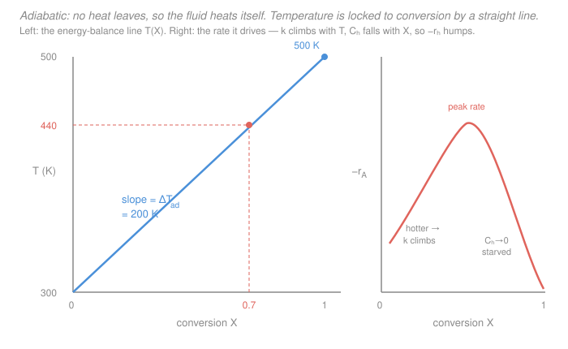

# Chemical Reaction Engineering · Lesson 3.2: Adiabatic reactor operation

> ⏱ ~15 min · Module 3: Energy balance and non-isothermal design · Builds on: [3.1 Reactor energy balance](03-01-reactor-energy-balance.md), [1.2 Arrhenius temperature dependence](01-02-arrhenius-temperature-dependence.md) · Unlocks: 3.3 (reactors with heat exchange), 3.4 (multiple steady states), Boss problem 3

## Why this matters

In [3.1](03-01-reactor-energy-balance.md) you built the full steady-flow energy balance and saw the coupling: rate depends on temperature (Arrhenius), and temperature depends on how far the reaction has gone. **Adiabatic operation is the cleanest way to break that coupling open** — you wrap the reactor in perfect insulation, set the heat duty to zero, and every joule the reaction releases has nowhere to go but into the fluid itself. The payoff is a startlingly simple result: temperature and conversion get *locked together on a straight line*. That one line turns a tangled two-variable problem into a one-variable one, and it's the backbone of every industrial adiabatic bed — from the sulfur-burning stage of a sulfuric-acid plant to an ammonia converter. It's also where exothermic reactors first show their teeth: they heat themselves, which is wonderful for speed and dangerous for control ([3.5](03-05-stability-runaway.md)).

## The idea

Insulate the reactor completely — no cooling coil, no jacket, no heat leaking through the walls ($\dot Q = 0$), and no shaft work stirring energy in ($\dot W_s = 0$). Now the reactor is a closed thermal box. An exothermic reaction dumps heat, and since it can't escape, the fluid's own temperature has to rise to absorb it. **The more the reaction proceeds (higher conversion), the more heat it has released, so the hotter the fluid must be.** Temperature isn't free to be anything — it's bookkept, joule for joule, by how much reactant has been consumed.

That bookkeeping is *linear*. Convert 10% and you've released 10% of the total possible heat, warming the fluid by 10% of its maximum rise; convert 20% and you've warmed it twice as much. So a plot of $T$ against conversion $X$ is a **straight line** climbing from the feed temperature. Its slope is the total temperature rise the reaction could deliver if it ran to completion — the **adiabatic temperature rise**. Endothermic reactions run the same movie backward: they *soak up* heat, so the fluid *cools* as conversion climbs, and the line slopes down.

Here's the beautiful part. That line hands you $T$ for free at every $X$. Feed it into Arrhenius to get $k(T)$, and you know the rate $-r_A$ everywhere along the reactor without ever solving a differential energy equation. The mole balance (algebraic for a CSTR, an integral for a PFR) then closes the problem.

## The formal version

Start from the steady-flow energy balance of [3.1](03-01-reactor-energy-balance.md) (constant $C_{p,i}$, single reaction, reference temperature $T_0$ = feed temperature):

$$\dot Q - \dot W_s - F_{A0}\sum_i \Theta_i C_{p,i}\,(T - T_0) - \Delta H_{rx}\,F_{A0}\,X = 0.$$

Here $F_{A0}$ is the molar feed of A (mol/s), $\Theta_i = F_{i0}/F_{A0}$ is the feed ratio of species $i$ to A (dimensionless), $C_{p,i}$ is its molar heat capacity (J/mol·K), $\Delta H_{rx}$ is the heat of reaction (J/mol of A; **negative for exothermic**), $T$ is the reactor temperature (K), and $X$ is conversion (dimensionless fraction). *In words: heat added, minus work done, minus the energy needed to warm the stream from $T_0$ to $T$, minus the heat consumed by reaction, equals zero.*

**Adiabatic** means $\dot Q = 0$; assume $\dot W_s = 0$ too. The $F_{A0}$ cancels, and solving for $T$:

$$\boxed{\,T = T_0 + \frac{(-\Delta H_{rx})\,X}{\sum_i \Theta_i C_{p,i}}\,}$$

This is the **adiabatic energy-balance line**. *In words: the temperature at any point is the feed temperature plus the heat released so far, divided by the stream's total heat capacity.* Because $T_0$, $\Delta H_{rx}$, and the $\Theta_i C_{p,i}$ are all fixed by the feed, $T$ is a **straight line in $X$** — set once you specify the feed, identical for a CSTR, a PFR, or a batch reactor.

Its slope is the **adiabatic temperature rise**, the temperature change at complete conversion ($X = 1$):

$$\Delta T_{ad} = \frac{(-\Delta H_{rx})}{\sum_i \Theta_i C_{p,i}} \qquad\Longrightarrow\qquad T = T_0 + \Delta T_{ad}\,X.$$

*In words: $\Delta T_{ad}$ is the biggest temperature swing the reaction can produce, all of its heat spread across all of the stream's heat capacity.* Exothermic ($\Delta H_{rx} < 0$) gives $\Delta T_{ad} > 0$ and a rising line; endothermic ($\Delta H_{rx} > 0$) gives $\Delta T_{ad} < 0$ and a falling one. Note the **inert ballast** hiding in the denominator: pile in inerts (large $\Theta_I C_{p,I}$) and $\Delta T_{ad}$ shrinks — a standard trick to tame a hot reaction.

**Closing the problem.** The line gives $T(X)$; Arrhenius gives $k(T) = A\,e^{-E/(RT)}$; together they give the rate as a function of conversion alone,

$$-r_A(X) = k\big(T(X)\big)\,C_{A0}(1 - X) \quad\text{(liquid, first order),}$$

which you drop into whichever mole balance applies:

$$\text{CSTR: } V = \frac{F_{A0}\,X}{-r_A(X)}, \qquad \text{PFR: } V = F_{A0}\int_0^X \frac{dX}{-r_A(X)}.$$

The catch that makes non-isothermal design interesting: along an adiabatic PFR, $-r_A$ is **not monotonic**. As $X$ rises, $T$ climbs and $k$ shoots up (Arrhenius), *pushing the rate up* — but the reactant is also being consumed, $C_{A0}(1-X) \to 0$, *pulling the rate down*. The rate rises, peaks, then collapses. That hump is the signature of an exothermic adiabatic reactor.

## Picture

## Worked examples

**Example 1 — Boss problem 3, parts (a) and (b): reading $T$ off the line, then sizing.** A liquid-phase exothermic reaction $A \to B$ with $-r_A = kC_A$ runs adiabatically. Feed: $T_0 = 300$ K, $C_{A0} = 2\ \mathrm{mol/L}$, volumetric flow $v_0 = 5\ \mathrm{L/min}$. Thermodynamics: $\Delta H_{rx} = -40{,}000\ \mathrm{J/mol}$, $\sum \Theta_i C_{p,i} = 200\ \mathrm{J/(mol\cdot K)}$.

*(a) Temperature vs. conversion.* The adiabatic rise:

$$\Delta T_{ad} = \frac{-\Delta H_{rx}}{\sum \Theta_i C_{p,i}} = \frac{40{,}000}{200} = 200\ \mathrm{K}.$$

So the energy-balance line is $T = 300 + 200\,X$. At complete conversion $T(X{=}1) = 300 + 200 = 500$ K; at the design conversion $X = 0.7$,

$$T(0.7) = 300 + 200(0.7) = 440\ \mathrm{K}.$$

*(b) CSTR volume at $X = 0.7$.* The line told us the reactor sits at $T = 440$ K; at that temperature the rate constant is $k = 1.5\ \mathrm{min^{-1}}$ (from Arrhenius). For a liquid, $C_A = C_{A0}(1-X)$, so $-r_A = k C_{A0}(1-X)$ and $F_{A0} = C_{A0}v_0$. The CSTR design equation collapses neatly:

$$V = \frac{F_{A0}X}{-r_A} = \frac{C_{A0}v_0\,X}{k\,C_{A0}(1-X)} = \frac{v_0\,X}{k\,(1-X)} = \frac{5\,(0.7)}{1.5\,(0.3)} = \frac{3.5}{0.45} \approx 7.8\ \mathrm{L}.$$

*Check.* Units: $\dfrac{(\mathrm{L/min})}{(\mathrm{min^{-1}})} = \mathrm{L}$ ✓. Sanity: a 7.8 L tank is tiny — because self-heating to 440 K made $k$ large, the reactor barely needs any volume. Had we (wrongly) used the cold feed rate constant at 300 K, we'd have sized a much bigger, needlessly expensive tank. **Read $T$ off the energy balance first; then use it in the mole balance.**

**Example 2 — the endothermic contrast: self-cooling and stall.** Same reactor, but now run an *endothermic* $A \to B$ with $\Delta H_{rx} = +50{,}000\ \mathrm{J/mol}$, $\sum \Theta_i C_{p,i} = 250\ \mathrm{J/(mol\cdot K)}$, fed hot at $T_0 = 500$ K. The adiabatic rise is now **negative**:

$$\Delta T_{ad} = \frac{-(+50{,}000)}{250} = -200\ \mathrm{K}, \qquad T = 500 - 200\,X.$$

The reaction *steals* its heat from the fluid, so temperature *falls* as conversion climbs: $T(0.25) = 450$ K, $T(0.5) = 400$ K, $T(0.75) = 350$ K. And here's the trap the reaction sets for itself: as $T$ drops, Arrhenius drives $k$ down hard, so the rate keeps sagging — the reaction **cools itself into a stall** long before reaching high conversion. There's no runaway to fear, but also no free lunch: an adiabatic endothermic reactor is self-limiting. To push conversion you must *add heat*, which is exactly the job of [3.3](03-03-reactors-with-heat-exchange.md).

*Check.* Sign audit: $\Delta H_{rx} > 0$ (endothermic), so $-\Delta H_{rx} < 0$, so $\Delta T_{ad} < 0$ and the line slopes down — consistent with "reaction absorbs heat, fluid cools." ✓

## Watch out

- **You might drop the minus sign on $\Delta H_{rx}$.** The formula carries $(-\Delta H_{rx})$. For an exothermic reaction $\Delta H_{rx}$ is *negative*, so $-\Delta H_{rx}$ is *positive*, giving a *positive* $\Delta T_{ad}$ and a rising line. If your exothermic reactor comes out cooling down, you forgot the minus. (Quick test: exothermic must heat, endothermic must cool — check the sign of your slope against physical sense every time.)
- **You might think the energy-balance line depends on the reactor type.** It does not. $T = T_0 + \Delta T_{ad}X$ is fixed entirely by the feed and thermodynamics — a CSTR, a PFR, and a batch reactor all ride the *same* line. What differs is *where on the line* the reactor operates: a CSTR jumps straight to the exit point and stays there; a PFR sweeps continuously up the line from $T_0$ to the exit.
- **You might assume the rate keeps climbing as an exothermic reactor heats up.** Only at first. Rising $T$ boosts $k$, but falling $C_A$ (depletion) eventually wins, so $-r_A$ rises, peaks, then falls — the hump in the figure. Sizing that assumes a monotonic rate will get a PFR profile wrong.

## One-liner

> Insulate the reactor and temperature stops being free: it rides the straight line $T = T_0 + \Delta T_{ad}X$, so read $T$ off the energy balance, feed it to Arrhenius, and only then size with the mole balance.

## Problems

**P1 (🟢)** A liquid exothermic reaction runs adiabatically with $\Delta H_{rx} = -80{,}000\ \mathrm{J/mol}$, $\sum \Theta_i C_{p,i} = 250\ \mathrm{J/(mol\cdot K)}$, and feed temperature $T_0 = 350$ K. Find $\Delta T_{ad}$, write the energy-balance line, and give the temperature at $X = 0.5$ and at complete conversion.

**P2 (🟡)** A liquid exothermic $A \to B$, $-r_A = kC_A$, runs adiabatically: $T_0 = 300$ K, $C_{A0} = 1\ \mathrm{mol/L}$, $v_0 = 4\ \mathrm{L/min}$, $\Delta H_{rx} = -60{,}000\ \mathrm{J/mol}$, $\sum \Theta_i C_{p,i} = 300\ \mathrm{J/(mol\cdot K)}$. You want $X = 0.5$. Find the operating temperature from the line, and given that $k = 2\ \mathrm{min^{-1}}$ there, size the CSTR.

**P3 (🔴)** The reactor in P1 is fed with a large slug of inert diluent added to the feed, raising $\sum \Theta_i C_{p,i}$ from $250$ to $1000\ \mathrm{J/(mol\cdot K)}$ (heat of reaction per mole of A unchanged). What is the new $\Delta T_{ad}$, and the new exit temperature at complete conversion? In one sentence, explain why plant operators deliberately do this to a strongly exothermic reaction.

Solutions

**P1** Adiabatic rise:
$$\Delta T_{ad} = \frac{-\Delta H_{rx}}{\sum \Theta_i C_{p,i}} = \frac{80{,}000}{250} = 320\ \mathrm{K}.$$
Line: $T = 350 + 320\,X$. Then $T(0.5) = 350 + 320(0.5) = 510$ K, and $T(1) = 350 + 320 = 670$ K.

*Check.* Units: $\dfrac{\mathrm{J/mol}}{\mathrm{J/(mol\cdot K)}} = \mathrm{K}$ ✓. Exothermic ($\Delta H_{rx}<0$) gave a positive rise and a heating reactor — physically right.

**P2** Line first:
$$\Delta T_{ad} = \frac{60{,}000}{300} = 200\ \mathrm{K}, \qquad T = 300 + 200\,X, \qquad T(0.5) = 300 + 100 = 400\ \mathrm{K}.$$
At $T = 400$ K, $k = 2\ \mathrm{min^{-1}}$. For a liquid first-order reaction the CSTR volume simplifies (as in Example 1):
$$V = \frac{v_0\,X}{k\,(1-X)} = \frac{4\,(0.5)}{2\,(0.5)} = \frac{2}{1} = 2\ \mathrm{L}.$$

*Check.* Units: $\dfrac{\mathrm{L/min}}{\mathrm{min^{-1}}} = \mathrm{L}$ ✓. The 100 K self-heating (300 → 400 K) is exactly what makes $k$ big enough that a 2 L tank suffices; sizing at the 300 K feed rate constant would have demanded a far larger reactor.

**P3** With the diluent, the denominator quadruples:
$$\Delta T_{ad} = \frac{80{,}000}{1000} = 80\ \mathrm{K}, \qquad T(1) = 350 + 80 = 430\ \mathrm{K}.$$
The exit temperature drops from 670 K to 430 K. *Why do it:* the same heat is now spread over four times the heat-capacity ballast, so the peak temperature is far lower — operators add inert diluent (or recycle product) to cap the adiabatic rise below the point where the catalyst sinters, side reactions ignite, or the reactor runs away ([3.5](03-05-stability-runaway.md)).

*Check.* $\Delta T_{ad}$ scales as $1/\sum\Theta_i C_{p,i}$: multiplying the denominator by 4 divides the rise by 4 ($320 \to 80$) ✓.

## Flashback

**From Lesson 1.2 (Arrhenius temperature dependence):** A rate constant is $k = 1.0\ \mathrm{min^{-1}}$ at $300$ K and the activation energy is $E = 50{,}000\ \mathrm{J/mol}$ ($R = 8.314\ \mathrm{J/(mol\cdot K)}$). By what factor does $k$ grow when an adiabatic exothermic reactor self-heats the fluid to $440$ K? (Fresh variant — new numbers; this is the $k$ that Example 1(b) used.)

Solution

Use the two-point Arrhenius form, $\ln\dfrac{k_2}{k_1} = -\dfrac{E}{R}\left(\dfrac{1}{T_2} - \dfrac{1}{T_1}\right)$:
$$\frac{1}{T_2} - \frac{1}{T_1} = \frac{1}{440} - \frac{1}{300} = 0.0022727 - 0.0033333 = -0.0010606\ \mathrm{K^{-1}},$$
$$\ln\frac{k_2}{k_1} = -\frac{50{,}000}{8.314}(-0.0010606) = (6014)(0.0010606) \approx 6.38 \;\Longrightarrow\; \frac{k_2}{k_1} = e^{6.38} \approx 590.$$
So $k_2 \approx 590\ \mathrm{min^{-1}}$ — heating by only 140 K multiplies the rate constant nearly 600-fold.

*Check.* Units inside the exponent: $\dfrac{\mathrm{J/mol}}{\mathrm{J/(mol\cdot K)}}\cdot \mathrm{K^{-1}}$ is dimensionless ✓. *This is the whole point of adiabatic exothermic operation:* the reaction's own heat drives its rate constant up by orders of magnitude — a gift for throughput, and precisely the positive feedback loop that makes runaway a real hazard in [3.5](03-05-stability-runaway.md).

## Connections

- **Backward:** this is the full energy balance of [3.1](03-01-reactor-energy-balance.md) with the heat and work terms zeroed; the $k(T)$ step is the Arrhenius law of [1.2](01-02-arrhenius-temperature-dependence.md); the mole balances are the CSTR and PFR design equations from [1.5](01-05-cstr.md) and [1.6](01-06-pfr-packed-bed.md), with $C_A = C_{A0}(1-X)$ from the liquid stoichiometric table of [2.3](02-03-stoichiometry-concentration-conversion.md).
- **Forward:** [3.3](03-03-reactors-with-heat-exchange.md) puts the heat term back ($\dot Q = Ua(T_a - T)$), bending the straight line into a curve and letting you *choose* the temperature path; [3.4](03-04-multiple-steady-states-cstr.md) crosses this energy line against a heat-generation curve to expose multiple steady states; [3.5](03-05-stability-runaway.md) turns the self-heating feedback seen in the Flashback into the runaway and stability analysis. Boss problem 3 is Example 1 extended.
- **Sideways (thermodynamics):** setting $\dot Q = 0$ in an open-system energy balance is exactly the adiabatic control-volume bookkeeping of [`engineering-thermodynamics` 2.3 (mass and energy balances on control volumes)](../../engineering-thermodynamics/lessons/02-03-mass-energy-balance-control-volumes.md), and the $\Delta H_{rx}$ that powers $\Delta T_{ad}$ is the reaction enthalpy from that course. The Arrhenius $k(T)$ that the line feeds is the transition-state picture of [`physical-chemistry` 3.4 (Arrhenius & transition-state theory)](../../physical-chemistry/lessons/03-04-arrhenius-transition-state-theory.md) — here it is no longer a curiosity but the mechanism by which a reactor sizes itself.
