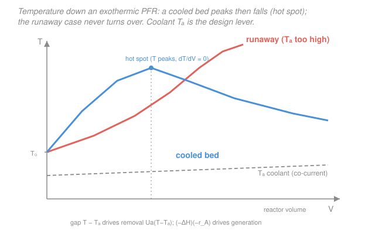

# Chemical Reaction Engineering · Lesson 3.3: Reactors with heat exchange

> ⏱ ~15 min · Module 3: Energy Balance & Non-Isothermal Reactors · Builds on: [3.2 Adiabatic operation](03-02-adiabatic-operation.md), [3.1 The reactor energy balance](03-01-reactor-energy-balance.md) · Unlocks: [3.4 Multiple steady states in a CSTR](03-04-multiple-steady-states-cstr.md), reactor thermal design

## Why this matters

Adiabatic operation ([3.2](03-02-adiabatic-operation.md)) let temperature run free: an exothermic reaction heats its own feed, conversion and temperature march up together, and you just read off where they land. That's fine until the temperature climbs somewhere you don't want it — past a catalyst's sintering point, past a selectivity cliff, or into thermal **runaway** ([3.5](03-05-stability-runaway.md)). The fix is a **jacket**: wrap the tube in a coolant (or a heater) and pull heat out (or in) as the reaction runs. Now temperature is something you *design*, not something you suffer. Almost every real exothermic tubular reactor — an SO₂ converter, an ethylene oxide reactor, a hydrocracker bed — is cooled this way, and the number that decides whether it's safe is the **hot spot**: the peak temperature buried somewhere inside the tube.

## The idea

Picture marching down the reactor a slice at a time, exactly as in [1.6](01-06-pfr-packed-bed.md), but now tracking **two** things per slice: how much A has converted, and how hot the mixture is. Two tugs-of-war set the temperature. The reaction **generates** heat at a rate $(-\Delta H_{rx})(-r_A)$ — big where the rate is fast (high $C_A$, early in the tube). The jacket **removes** heat at a rate $Ua(T-T_a)$ — big where the mixture is much hotter than the coolant. Whichever wins, locally, decides whether the temperature in the next slice goes up or down.

Here's the drama. Near the inlet the reactant is fresh, so generation is huge and easily beats the jacket — temperature *rises*. But rising temperature and falling reactant pull in opposite directions on the rate: eventually the reactant thins out enough that generation drops below what the jacket removes, and temperature *falls* again. The place where they exactly balance — generation equals removal — is where $dT/dV=0$: the **hot spot**, the hottest point in the whole reactor. If you can keep that peak under your temperature limit, you're safe. If the coolant is too weak or too warm, generation stays ahead everywhere, the temperature never turns over, and the reactor runs away.

The single knob you turn is the coolant: its temperature $T_a$ and how hard it's coupled, $Ua$. Colder coolant or a bigger $Ua$ pulls the peak down. But there's a catch we'll hit in a moment — over-cool it and you strangle the very rate you're trying to run.

## The formal version

**The coupled PFR balances.** From the steady-flow energy balance ([3.1](03-01-reactor-energy-balance.md)) written per unit reactor volume, with heat exchange $\dot Q = Ua(T_a - T)$ and no shaft work, the temperature profile obeys

$$\boxed{\;\frac{dT}{dV} = \frac{Ua(T_a - T) + (-\Delta H_{rx})(-r_A)}{F_{A0}\sum_i \Theta_i C_{p,i}}\;}$$

solved **simultaneously** with the mole balance

$$\frac{dX}{dV} = \frac{-r_A}{F_{A0}}.$$

*In words: the numerator is heat removed plus heat generated (per unit volume); the denominator is the thermal mass of the flowing stream, which sets only how fast $T$ moves — the sign of $dT/dV$ is decided upstairs.* The symbols: $T$ = local temperature (K); $T_a$ = coolant temperature (K); $Ua$ = overall heat-transfer coefficient $U$ times heat-exchange area per unit reactor volume $a$, units J/(s·L·K), so $Ua(T_a-T)$ is a volumetric heat rate J/(s·L); $-\Delta H_{rx}$ = heat released per mole A reacted (J/mol, **positive for exothermic**); $-r_A$ = rate (mol/(L·s)); $F_{A0}$ = molar feed of A (mol/s); $\Theta_i = F_{i0}/F_{A0}$ and $C_{p,i}$ = molar heat capacity of species $i$ (J/(mol·K)), so $F_{A0}\sum_i\Theta_i C_{p,i}$ is the total heat capacity of the stream (J/(s·K)).

These two ODEs are **coupled both ways**: $-r_A = k(T)\,C_A(X)$ needs both $T$ (through Arrhenius $k$, [1.2](01-02-arrhenius-temperature-dependence.md)) and $X$. You march them together — Euler or Runge–Kutta — never one then the other. Set $Ua=0$ and the first equation collapses back to the adiabatic $T(X)$ line of [3.2](03-02-adiabatic-operation.md).

**Where the coolant temperature comes from.** $T_a$ is only constant if the jacket boils a fluid at fixed temperature (a phase-changing utility). With a *sensible* coolant it changes down the tube, and how depends on flow direction:

- **Co-current** — coolant enters at the reactor inlet and flows the same way. It starts cold and *warms up* as it soaks heat, obeying its own ODE $\dfrac{dT_a}{dV} = \dfrac{Ua(T-T_a)}{\dot m_c C_{p,c}}$ ($\dot m_c$ = coolant mass flow, $C_{p,c}$ = its heat capacity). This is an **initial-value problem**: you know $T$, $X$, and $T_a$ all at $V=0$ and march forward. Simple, but the coolant is warmest right where the hot spot is — the worst place to lose cooling power.
- **Counter-current** — coolant enters at the reactor *outlet* and flows backward, so its inlet condition is at $V=V_{\text{total}}$ while the reactor's is at $V=0$. Now it's a **boundary-value problem**: you must guess the coolant temperature at one end and iterate until both ends match. Harder to solve, but it keeps the coldest coolant near the hot spot, so it generally tames the peak better.

**Hot spots.** The hot spot is the interior maximum where generation exactly cancels removal:

$$\left.\frac{dT}{dV}\right|_{\text{hot spot}} = 0 \quad\Longleftrightarrow\quad Ua(T - T_a) = (-\Delta H_{rx})(-r_A).$$

*In words: at the peak, the jacket is pulling out heat exactly as fast as the reaction makes it.* Downstream of the peak, removal wins and $T$ falls; if no such balance is ever reached, the reactor runs away (the coral curve in the figure — see [3.5](03-05-stability-runaway.md) for the stability analysis).

## Picture



## Worked examples

**Example 1 — the coolant temperature that erases the hot spot.** A liquid-phase exothermic reaction $A\to B$ runs in a cooled PFR with $-\Delta H_{rx}=40{,}000\ \mathrm{J/mol}$. At a particular station in the tube the local temperature is $T=400\ \mathrm{K}$ and the local rate is $-r_A = 0.50\ \mathrm{mol/(L\cdot s)}$. The jacket has $Ua = 500\ \mathrm{J/(s\cdot L\cdot K)}$. At what coolant temperature $T_a$ does that station sit exactly at $dT/dV=0$ — i.e., generation is matched by removal, and the temperature is not climbing?

*Set generation equal to removal.* The hot-spot condition is $Ua(T-T_a) = (-\Delta H_{rx})(-r_A)$.

*Generation term.*
$$(-\Delta H_{rx})(-r_A) = (40{,}000\ \mathrm{J/mol})(0.50\ \mathrm{mol/(L\cdot s)}) = 20{,}000\ \mathrm{J/(L\cdot s)}.$$

*Solve for $T_a$.*
$$500\,(400 - T_a) = 20{,}000 \;\Longrightarrow\; 400 - T_a = 40 \;\Longrightarrow\; T_a = \mathbf{360\ K}.$$

*What the answer means.* Run the coolant at 360 K and this station is exactly balanced — it's poised at a temperature maximum. Warmer coolant (say $T_a=380$ K) removes only $500(20)=10{,}000\ \mathrm{J/(L\cdot s)}$, less than the 20,000 generated, so the numerator is $+10{,}000$ and $T$ is still *rising* here — the peak is further downstream, hotter. Colder coolant ($T_a=340$ K) removes $500(60)=30{,}000$, more than generated, so the numerator is $-10{,}000$ and $T$ is already *falling* — you've cooled past the point of a hot spot. *Units check:* $Ua(T-T_a) = [\mathrm{J/(s\cdot L\cdot K)}][\mathrm{K}] = \mathrm{J/(L\cdot s)}$, matching the generation term ✓. *Sanity:* $T_a=360$ K sits well below the 400 K reaction temperature — you always need a coolant colder than the reactor to pull heat out of an exothermic bed. ✓

*(How fast, not just which way.)* Put a stream on it — $F_{A0}=20\ \mathrm{mol/s}$, $\sum\Theta_iC_{p,i}=200\ \mathrm{J/(mol\cdot K)}$, so the denominator $F_{A0}\sum\Theta_iC_{p,i}=4000\ \mathrm{J/(s\cdot K)}$. With $T_a=380$ K the slope is $dT/dV = 10{,}000/4000 = 2.5\ \mathrm{K/L}$: the mixture heats 2.5 K per liter of reactor at that station. The denominator never flips the sign — it only sets the pace.

**Example 2 — taming the peak, and the price of over-cooling.** Same reactor, and suppose the first design gives a hot spot of 460 K — 20 K over the 440 K limit your catalyst can tolerate. Two levers, both in the removal term $Ua(T-T_a)$:

- **Lower $T_a$** (colder coolant). This widens the driving gap $T-T_a$ everywhere, so the jacket pulls harder at every station, generation loses sooner, and the peak drops and moves *upstream* (toward the inlet). 
- **Raise $Ua$** (more area or a better coefficient — thinner tubes, more tubes, a more conductive wall, higher coolant velocity). This scales up removal proportionally at the *same* $T-T_a$, so it too flattens the peak.

**The tradeoff — over-cooling kills the rate.** Removal doesn't care what the reaction wants, but the rate does: $k=A e^{-E/(RT)}$ climbs steeply with $T$ ([1.2](01-02-arrhenius-temperature-dependence.md)). Chill the bed too aggressively and you drag $T$ down along the whole tube; Arrhenius then throttles $k$, the rate crawls, and you need a much larger reactor to hit the target conversion — or you simply miss it. So there's a sweet spot: cold enough that the hot spot clears your temperature ceiling, warm enough that the reaction still moves. *In practice you tune $T_a$ and $Ua$ together until the peak just kisses the limit and the reactor is no bigger than it has to be.* This "peak vs. rate" tension is exactly the sensitivity that becomes runaway when you push it too far — the subject of [3.5](03-05-stability-runaway.md).

## Watch out

- **You might think the denominator sets whether $T$ rises or falls.** It doesn't — $F_{A0}\sum\Theta_iC_{p,i}$ is always positive, so it only sets the *magnitude* of $dT/dV$. The **sign** — heating vs. cooling — is decided entirely by the numerator, the race between $Ua(T_a-T)$ and $(-\Delta H_{rx})(-r_A)$. Read the numerator to know which way temperature goes.
- **You might mix up the sign in $\dot Q = Ua(T_a-T)$.** Written this way, $\dot Q$ is heat *added to the reactor*. For an exothermic bed you want cooling, so $T_a<T$ makes $\dot Q<0$ — heat leaves. Flip it to $Ua(T-T_a)$ and you're now writing heat *removed*; both appear in this lesson, so watch which side of the balance you're on. The boxed $dT/dV$ uses $Ua(T_a-T)$ in the numerator.
- **You might treat co-current and counter-current as interchangeable.** They're not even the same *kind* of problem. Co-current is an initial-value march (everything known at $V=0$); counter-current is a boundary-value problem that needs iteration because the coolant's known condition is at the far end. Counter-current usually gives a lower, safer hot spot — it puts the coldest coolant where the reaction is hottest.

## One-liner

> Wrap the tube in a coolant and temperature becomes a design variable: march $dT/dV$ and $dX/dV$ together, and keep the interior hot spot — where generation just balances removal — under your limit without over-cooling the rate to death.

## Problems

**P1 (🟢)** A cooled PFR runs an exothermic reaction with $-\Delta H_{rx}=60{,}000\ \mathrm{J/mol}$ and $Ua = 800\ \mathrm{J/(s\cdot L\cdot K)}$. At one station $T=430\ \mathrm{K}$ and $-r_A = 0.40\ \mathrm{mol/(L\cdot s)}$. Is the temperature rising or falling there if the coolant is held at $T_a = 400\ \mathrm{K}$? Compute the generation and removal terms to decide.

**P2 (🟡)** For the same station and jacket in P1 ($T=430$ K, $-r_A=0.40$, $Ua=800$, $-\Delta H_{rx}=60{,}000$), find the coolant temperature $T_a$ that would place this station exactly at the hot spot ($dT/dV=0$). Then, given a stream heat capacity $F_{A0}\sum\Theta_iC_{p,i}=5000\ \mathrm{J/(s\cdot K)}$, report the local slope $dT/dV$ at $T_a=400$ K.

**P3 (🔴)** An equilibrium-limited exothermic reaction ($A\rightleftharpoons B$) has an equilibrium conversion $X_e$ that *falls* as temperature rises. You run it in a single adiabatic bed and, because the reaction heats the gas, you hit the equilibrium curve at only $X=0.55$ before the rate dies. Explain qualitatively why **interstage cooling** — splitting into two adiabatic beds with a cooler in between — lets you reach a higher total conversion, and sketch what the operating path looks like on an $X$–$T$ plot.

<details>
<summary>Solutions</summary>

**P1** Compare the two terms in the numerator.

*Generation:* $(-\Delta H_{rx})(-r_A) = (60{,}000)(0.40) = 24{,}000\ \mathrm{J/(L\cdot s)}$.

*Removal:* $Ua(T-T_a) = 800(430-400) = 800(30) = 24{,}000\ \mathrm{J/(L\cdot s)}$.

They're **equal** — generation exactly matches removal, so the numerator is zero and $dT/dV=0$. This station is sitting right *at* a temperature extremum (a hot spot). By coincidence of the chosen numbers, $T_a=400$ K is precisely the balancing coolant temperature. *Check:* both terms in J/(L·s) ✓; a hot spot needs removal to have caught up to generation, which is exactly what happened.

**P2** Set removal = generation for the hot-spot condition:
$$Ua(T-T_a) = (-\Delta H_{rx})(-r_A) \;\Rightarrow\; 800(430-T_a) = 24{,}000 \;\Rightarrow\; 430 - T_a = 30 \;\Rightarrow\; T_a = \mathbf{400\ K}.$$

So $T_a=400$ K already *is* the hot-spot coolant temperature (consistent with P1). The local slope there:
$$\frac{dT}{dV} = \frac{Ua(T_a-T) + (-\Delta H_{rx})(-r_A)}{F_{A0}\sum\Theta_iC_{p,i}} = \frac{800(400-430) + 24{,}000}{5000} = \frac{-24{,}000 + 24{,}000}{5000} = \mathbf{0\ K/L}.$$

*Check:* zero slope confirms the hot spot. Had the coolant been warmer, say $T_a=410$ K, removal would be $800(20)=16{,}000<24{,}000$, numerator $=+8000$, $dT/dV=+1.6$ K/L — still climbing, peak downstream. Units: $(\mathrm{J/(L\cdot s)})/(\mathrm{J/(s\cdot K)}) = \mathrm{K/L}$ ✓.

**P3** In an adiabatic bed, temperature and conversion rise together along a straight line $T = T_0 + \frac{(-\Delta H_{rx})X}{\sum\Theta_iC_{p,i}}$ ([3.2](03-02-adiabatic-operation.md)). For an *exothermic* reaction the equilibrium conversion $X_e$ **decreases** with $T$, so the adiabatic operating line climbs *toward* a falling equilibrium ceiling. They meet at $X=0.55$: the reaction has self-heated to the point where equilibrium won't allow any more conversion — the forward and reverse rates balance and the net rate dies.

**Interstage cooling** breaks the deadlock. After the first bed reaches (say) $X=0.55$ at high $T$, run the stream through a heat exchanger that cools it back down at *constant conversion* (a horizontal move left on the $X$–$T$ plot — no reaction in the cooler). At the lower temperature, $X_e$ has *risen* again, so you're now well below equilibrium with plenty of driving force. Feed this cooled stream to a second adiabatic bed: it climbs a new operating line from the cooled point up to the equilibrium curve again, reaching a higher conversion, say $X=0.80$. The operating path is a **staircase**: up an adiabatic line, left along a cooling leg, up the next adiabatic line — each bed grabbing more conversion by exploiting the higher $X_e$ that cooling restores.

```
X
0.80 |                         ___/• (bed 2 hits equilibrium)
     |                    ___/
0.55 |        •<---------/   (cool at constant X)
     |    ___/  (bed 1)
     |___/________________________ T
```

*Why it works:* exothermic equilibrium is a fight between kinetics (want it hot) and thermodynamics (want it cold). Adiabatic beds go fast but overshoot into the low-$X_e$ zone; the intercoolers reset the temperature to reclaim thermodynamic headroom. This is exactly how industrial SO₂→SO₃ and ammonia converters are built. *Check:* each cooling leg is horizontal (no reaction, $X$ fixed) and each reaction leg has positive slope (exothermic heating) — the staircase always stays below the equilibrium curve, which is what keeps the net rate positive. ✓

</details>

## Flashback

**From Lesson 3.2 (Adiabatic operation):** A liquid-phase exothermic reaction runs *adiabatically* in a PFR with feed temperature $T_0 = 310\ \mathrm{K}$, $-\Delta H_{rx} = 50{,}000\ \mathrm{J/mol}$, and $\sum\Theta_iC_{p,i} = 250\ \mathrm{J/(mol\cdot K)}$. (a) What is the adiabatic temperature rise at complete conversion, $\Delta T_{ad}$? (b) What is the temperature at $X=0.6$? (c) If the catalyst degrades above 420 K, is adiabatic operation safe to $X=0.6$, and what does that imply about needing a jacket?

<details>
<summary>Solution</summary>

(a) The adiabatic rise at $X=1$:
$$\Delta T_{ad} = \frac{-\Delta H_{rx}}{\sum\Theta_iC_{p,i}} = \frac{50{,}000}{250} = \mathbf{200\ K}.$$

(b) On the adiabatic line $T = T_0 + \Delta T_{ad}\,X$:
$$T(0.6) = 310 + 200(0.6) = 310 + 120 = \mathbf{430\ K}.$$

(c) At $X=0.6$ the bed is already at 430 K — **10 K over** the 420 K catalyst limit, so adiabatic operation is **not safe** to that conversion. Solving for the conversion that hits 420 K: $420 = 310 + 200X \Rightarrow X = 0.55$. Beyond $X\approx0.55$ the adiabatic bed cooks the catalyst. *This is precisely why you add a jacket* (this lesson): cooling holds the peak below 420 K so you can push conversion further without destroying the catalyst. *Check:* units of $\Delta T_{ad}$ are $(\mathrm{J/mol})/(\mathrm{J/(mol\cdot K)}) = \mathrm{K}$ ✓; the adiabatic line is linear in $X$, so temperature and conversion are locked together with no way to separate them — exactly the freedom that heat exchange buys back. ✓

</details>

## Connections

- **Backward:** this generalizes [3.2 (adiabatic operation)](03-02-adiabatic-operation.md) — set $Ua=0$ and the coupled $dT/dV$ collapses to the adiabatic $T(X)$ line. The mole balance $dX/dV = -r_A/F_{A0}$ is the same PFR design equation from [1.6](01-06-pfr-packed-bed.md), now married to an energy balance from [3.1](03-01-reactor-energy-balance.md), with the rate's temperature dependence supplied by Arrhenius ([1.2](01-02-arrhenius-temperature-dependence.md)).
- **Forward:** [3.4 (multiple steady states in a CSTR)](03-04-multiple-steady-states-cstr.md) applies the same generation-vs-removal contest to a *mixed* reactor, where it produces ignition–extinction and hysteresis; [3.5 (stability & runaway)](03-05-stability-runaway.md) formalizes what happens when the hot spot never turns over.
- **Sideways (heat transfer):** the $Ua$ in $\dot Q = Ua(T_a-T)$ is the overall heat-transfer coefficient and area from the LMTD analysis of a jacketed exchanger — see heat-transfer [4.4 (heat exchangers & the LMTD)](../../heat-transfer/lessons/04-04-heat-exchangers-lmtd.md). There you *size the jacket* ($U$, area) given the duty; here you take $Ua$ as given and ask what temperature profile it produces inside the reactor. Same coefficient, opposite direction of the design question.
