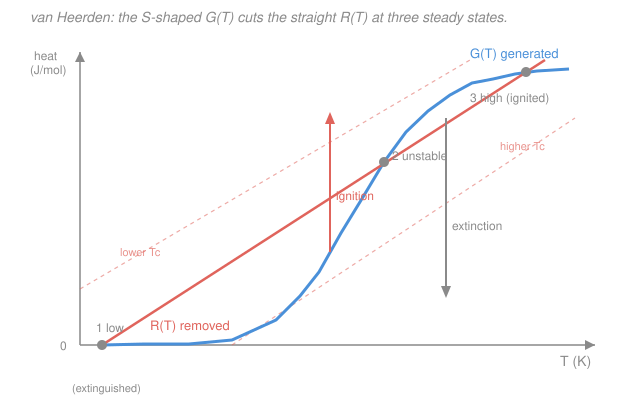

# Chemical Reaction Engineering · Lesson 3.4: Multiple steady states in the CSTR

> ⏱ ~15 min · Module 3: Energy Balance & Nonisothermal Reactors · Builds on: [3.1 Reactor energy balance](03-01-reactor-energy-balance.md), [3.2 Adiabatic operation](03-02-adiabatic-operation.md), [1.5 The CSTR](01-05-cstr.md), [1.2 Arrhenius temperature dependence](01-02-arrhenius-temperature-dependence.md) · Unlocks: [3.5 Stability & runaway](03-05-stability-runaway.md)

## Why this matters

Everything so far has quietly assumed that a reactor, run at a fixed feed, settles into **one** steady state. For an exothermic reaction in a CSTR, that assumption can be flat wrong: the *same* reactor, with the *same* feed, coolant, and flow rate, can sit at **three** different steady states — a cold, barely-reacting one; a hot, nearly-complete one; and an unstable one in between. Which one you land on depends on how you started up. This is not a mathematical curiosity: it is why a reactor has to be *lit off* like a furnace, why it can suddenly jump from 5% conversion to 95% when you nudge the coolant a degree, and why shutting it down and restarting it can leave it stuck cold. Getting this wrong has flipped reactors into runaway. This lesson shows where the multiplicity comes from with two curves and one picture.

## The idea

The trick is to stop solving the mole balance and energy balance together and instead read them as **two separate curves of temperature**, then ask where they meet.

- **Heat generated**, $G(T)$: how much heat the reaction throws off. It is proportional to conversion, and conversion follows the Arrhenius rate — dead slow when the reactor is cold, then rising sharply once it warms up, then flattening out near complete conversion. So $G(T)$ is an **S-shaped curve**: flat-low, steep-middle, flat-high.
- **Heat removed**, $R(T)$: how much heat the coolant and the cold incoming feed carry away. Both scale with how far the reactor sits above the coolant/feed temperature, so $R(T)$ is a **straight line** rising with $T$.

A steady state is a temperature where **generation exactly balances removal**: $G(T)=R(T)$, an intersection of the S-curve and the line. And here is the whole lesson in one image: *a straight line can cut an S-shaped curve either once or three times.* One intersection → one steady state, business as usual. Three intersections → three steady states. The reactor picks one; the other two are also valid solutions of the same equations.

## The formal version

**Heat generated.** From the steady-state energy balance (Lesson 3.1), the heat released by reaction per mole of $A$ fed is the heat of reaction times the conversion actually achieved at temperature $T$:

$$G(T) = (-\Delta H_{rx})\,X(T),$$

with $-\Delta H_{rx}$ the (positive, for exothermic) heat released per mole of $A$ reacted (J/mol) and $X(T)$ the conversion the *mole balance* delivers at temperature $T$ (dimensionless). For a liquid first-order reaction in a CSTR, the mole balance of Lesson 1.5 gave $\tau = \dfrac{X}{k(1-X)}$; solving for $X$ and inserting Arrhenius $k(T)=A\,e^{-E/(RT)}$ (Lesson 1.2):

$$X(T) = \frac{\tau\,k(T)}{1+\tau\,k(T)} = \frac{\tau A\,e^{-E/(RT)}}{1+\tau A\,e^{-E/(RT)}}.$$

In words: at low $T$, $k$ is tiny so $X\to 0$ (nothing reacts, no heat); at high $T$, $k$ is huge so $X\to 1$ (complete conversion, maximum heat). In between, $X$ climbs steeply — the source of the S-shape. Here $\tau=V/v_0$ is the space time (s), $A$ the pre-exponential (1/s), $E$ the activation energy (J/mol), $R=8.314$ J/(mol·K).

**Heat removed.** Collecting the sensible-heat and coolant terms of the energy balance into a single line (the form from Lesson 3.3, with heat exchange):

$$R(T) = C_{p0}\,(1+\kappa)\,(T - T_c),$$

where $C_{p0}=\sum \Theta_i C_{p,i}$ is the total feed heat capacity per mole of $A$ fed (J/(mol·K)), $\kappa = \dfrac{Ua}{C_{p0}\,F_{A0}}$ is the **dimensionless cooling capacity** (0 = adiabatic, large = strong cooling), and $T_c = \dfrac{\kappa T_a + T_0}{1+\kappa}$ is the **effective coolant temperature** — a weighted average of coolant temperature $T_a$ and feed temperature $T_0$ (K). In words: $R(T)$ is a straight line of slope $C_{p0}(1+\kappa)$ that crosses zero at $T=T_c$; a hotter feed or coolant slides the whole line to the right.

**Steady states** are the temperatures satisfying

$$\boxed{\,G(T) = R(T)\,}$$

Because $G$ is S-shaped and $R$ is straight, there can be **one or three** solutions. When there are three, they are (in order of temperature) the **low / extinguished** state, the **middle / unstable** state, and the **high / ignited** state. (Why the middle one is unstable is the subject of Lesson 3.5; the one-line reason is previewed in *Watch out*.)

## Picture

The blue S-curve is $G(T)$, the coral straight line is $R(T)$; their three intersections are the three steady states. The two faint dashed lines are the *same* removal line slid right (hotter coolant) or left (colder): as $T_c$ increases, the line climbs until the low and middle intersections merge and vanish — the reactor **ignites**, jumping up to the high branch (up-arrow). Slide it back left and the high and middle intersections merge and vanish — the reactor **extinguishes**, dropping to the low branch (down-arrow). The two jumps happen at *different* coolant temperatures, so the reactor's state depends on its history: that gap is the hysteresis.

## Worked examples

Throughout, take a liquid exothermic first-order reaction with $-\Delta H_{rx} = 80{,}000$ J/mol, $C_{p0} = 200$ J/(mol·K), cooling capacity $\kappa = 1$, and kinetics such that $X(T)$ takes the tabulated values below (computed from $X=\tau k/(1+\tau k)$ with an Arrhenius $k$). The design coolant temperature is $T_c = 300$ K.

### Example 1 — locate the three steady states

The removal line is $R(T) = C_{p0}(1+\kappa)(T-T_c) = 200(1+1)(T-300) = 400\,(T-300)$ J/mol — a straight line of slope $400$ J/(mol·K) through $T_c=300$ K. Tabulate both sides and read off the sign of $G-R$:

| $T$ (K) | $X(T)$ | $G=80000\,X$ (J/mol) | $R=400(T-300)$ (J/mol) | $G-R$ |
|---:|---:|---:|---:|:--:|
| 300 | $\approx 0$ | $\approx 0$ | 0 | $0^{+}$ — **cross ①** |
| 340 | 0.005 | 400 | 16,000 | $-$ |
| 380 | 0.091 | 7,300 | 32,000 | $-$ |
| 420 | 0.528 | 42,300 | 48,000 | $-$ |
| 430 | 0.653 | 52,200 | 52,000 | $\approx 0$ — **cross ②** |
| 460 | 0.891 | 71,300 | 64,000 | $+$ |
| 480 | 0.951 | 76,100 | 72,000 | $+$ |
| 495 | 0.973 | 77,800 | 78,000 | $\approx 0$ — **cross ③** |
| 500 | 0.978 | 78,200 | 80,000 | $-$ |

The sign of $G-R$ flips three times, so there are **three steady states**:

- **① Low (extinguished):** $T\approx 300$ K, $X\approx 0$. The reactor sits at essentially the feed temperature doing almost nothing — the rate is too slow to self-heat.
- **② Middle (unstable):** $T\approx 430$ K, $X\approx 0.65$. A real solution of the equations, but you can never hold a reactor here (Lesson 3.5).
- **③ High (ignited):** $T\approx 495$ K, $X\approx 0.97$. Hot and nearly complete — the useful operating point.

**Sanity check.** The adiabatic temperature rise is $\Delta T_{ad}=(-\Delta H_{rx})/C_{p0}=80{,}000/200=400$ K, so full conversion could in principle push the reactor $400$ K above feed. The ignited state at $495$ K (a $195$ K rise on a $300$ K feed) reaches $X\approx 0.97$, consistent with $195 \approx 0.97\times 400 \times \frac{1}{1+\kappa}\cdot(\text{...})$ — the cooling ($\kappa=1$) bleeds off roughly half the heat, so the temperature rise lands well below the full $400$ K. Units check: every column is J/mol, and both $G$ and $R$ are heat per mole of $A$ fed, so equating them is legitimate.

### Example 2 — ignition: raise the coolant until the low state disappears

Now crank the coolant temperature up. Raising $T_a$ raises the effective $T_c$; take it from $300$ K to $T_c = 365$ K. The removal line becomes $R(T) = 400\,(T-365)$ — the *same slope*, slid $65$ K to the right. Does the extinguished state survive? Evaluate $G-R$ along the cold end of the S-curve:

$$T=365:\quad G\approx 2{,}800,\ \ R = 400(0)=0 \ \Rightarrow\ G>R.$$
$$T=390:\quad G\approx 12{,}900,\ \ R=400(25)=10{,}000\ \Rightarrow\ G>R.$$
$$T=420:\quad G\approx 42{,}300,\ \ R=400(55)=22{,}000\ \Rightarrow\ G>R.$$

Generation now beats removal *everywhere* on the low and middle part of the curve — there is no low intersection left. Contrast Example 1, where at $T=340$ removal ($16{,}000$) crushed generation ($400$) and pinned the reactor cold. With the low and middle states gone, **the only surviving steady state is the ignited one** near $T\approx 555$ K, $X\approx 0.997$. A reactor sitting quietly at $300$ K will, the instant $T_c$ passes the ignition point (here $\approx 363$ K), **light off and jump ~250 K to the ignited branch**. That is the up-arrow in the figure.

**The hysteresis.** To put the reactor back cold, lowering $T_c$ to $363$ K again is *not* enough — the ignited state persists far below that. You must drag $T_c$ all the way down past the **extinction point** (here below $\approx 300$ K, where the high and middle states merge) before the reactor drops back to the cold branch. Ignition and extinction happen at different coolant temperatures, so between them the reactor **remembers** which branch it is on. Practically: you light the reactor off with a hot startup, then back the coolant down into the multiplicity window to run economically on the ignited branch — and you never let a transient knock it below the extinction point, or you will have to re-ignite.

**Units/sanity check.** Sliding $T_c$ by $65$ K shifts $R$ at fixed $T$ by $400\times 65 = 26{,}000$ J/mol — comparable to the height of the S-curve's steep rise, which is exactly why a modest coolant change can erase two steady states. Dimensions: slope (J/(mol·K)) × temperature (K) = J/mol. Good.

## Watch out

- **You might think** three steady states means you can operate at whichever one you like — **but actually** the middle state is unstable and cannot be held. The one-line reason (full story in [3.5](03-05-stability-runaway.md)): at a stable state a small temperature bump must be self-correcting, which needs removal to grow faster than generation, $\dfrac{dR}{dT} > \dfrac{dG}{dT}$. At the low and high crossings the straight line is steeper than the flattening S-curve — stable. At the middle crossing the S-curve is rising *faster* than the line, so a tiny warm-up generates more extra heat than it removes and the reactor runs away toward the high state (or a tiny cool-down collapses it to the low state). The middle state is a knife-edge.
- **You might think** multiplicity is a property of the *reaction* — **but actually** it needs an **exothermic reaction feeding back through temperature**: the rate heats the reactor (Arrhenius), and the higher temperature speeds the rate. Kill the feedback — run isothermal, or endothermic, or with enormous cooling ($\kappa \to \infty$, making $R$ nearly vertical so it can only cut the S once) — and the three states collapse to one. A PFR, lacking the CSTR's instant back-mixing of hot product with cold feed, generally does not show this steady-state multiplicity in the same way.
- **You might think** the ignited (high-$T$) state is always the goal — **but actually** it can be too hot: past the ignition point the jump in temperature can overshoot into thermal runaway, decompose product, or exceed the vessel's rating. The ignited branch is desirable *when it is safely reachable and controllable* — which is what makes the ignition/extinction map, not just the steady states, the real design object.

## One-liner

> An exothermic CSTR balances an S-shaped heat-generation curve against a straight heat-removal line, and a line can cut an S three times — so the same reactor can run cold, run hot, or hover on an unstable knife-edge, and which one depends on how you lit it.

## Problems

**P1 (🟢)** A removal line is $R(T) = 400\,(T-300)$ J/mol (i.e. $C_{p0}=200$ J/(mol·K), $\kappa=1$, $T_c=300$ K). The generation curve passes through $G=52{,}000$ J/mol at $T=430$ K. Verify that $T=430$ K is (to two significant figures) a steady state, and find the conversion there given $-\Delta H_{rx}=80{,}000$ J/mol.

**P2 (🟡)** For the same system, the coolant is now run *colder*: $T_c$ drops from $300$ K to $250$ K, keeping the slope $400$ J/(mol·K). Using the $X(T)$ table from Example 1, check whether the **ignited** state near $T\approx 495$ K survives. What does your answer say physically, and which van Heerden jump is this?

**P3 (🔴)** You are told a *different* exothermic CSTR shows **only one** steady state (no multiplicity) at every coolant temperature. Give two distinct physical changes to the removal line $R(T)=C_{p0}(1+\kappa)(T-T_c)$ that would guarantee this, and explain each in terms of how the line cuts the S-curve.

Solutions

**P1** At $T=430$ K: $R = 400\,(430-300) = 400\times 130 = 52{,}000$ J/mol, which equals the given $G=52{,}000$ J/mol. Since $G=R$, generation balances removal — it is a steady state. ✓ Conversion: $G=(-\Delta H_{rx})X \Rightarrow X = G/(-\Delta H_{rx}) = 52{,}000/80{,}000 = 0.65$. So $X\approx 0.65$ at the middle state. (Units: J/mol ÷ J/mol = dimensionless. ✓) This is the *unstable* middle intersection of Example 1.

**P2** New line: $R(T)=400\,(T-250)$. At $T=495$ K: $R = 400\,(495-250)=400\times 245 = 98{,}000$ J/mol, while $G = 80{,}000\times 0.973 \approx 77{,}800$ J/mol. Now $R > G$: removal overwhelms generation, so $T\approx 495$ K is **no longer a balance** — the ignited state does not survive. Check the top of the curve too: at $T=500$, $R=400(250)=100{,}000 > G\approx 78{,}200$; removal beats generation at every high temperature, so the whole high branch is gone. Physically, the colder coolant carries away more heat than the reaction can supply up high, so the reactor **collapses to the low/extinguished branch** — this is the **extinction** jump (the down-arrow). Sanity: dropping $T_c$ by $50$ K raised $R$ at fixed $T$ by $400\times50=20{,}000$ J/mol, enough to lift the line clear above the S-curve's plateau ($\approx 78{,}000$). ✓

**P3** The line must cut the S-curve only once, at every $T_c$. Two independent ways:

1. **Make the removal line much steeper** — increase the slope $C_{p0}(1+\kappa)$ by cranking up the cooling capacity $\kappa$ (bigger heat-transfer area/coefficient $Ua$, or lower feed rate $F_{A0}$). A steep enough line is always steeper than the S-curve's steepest point, so it can only pierce the S once no matter where $T_c$ puts it. (In the limit $\kappa\to\infty$ the line is vertical: the reactor is isothermal at $T_a$ and multiplicity is impossible.)

2. **Flatten the generation curve** — reduce the exothermicity $-\Delta H_{rx}$ (e.g. dilute the feed so $C_{p0}$ is large relative to the heat released, shrinking the S-curve's total height). If the S never rises steeply enough to out-climb the line's slope, the line meets it once. Equivalently, a smaller adiabatic rise $\Delta T_{ad}=(-\Delta H_{rx})/C_{p0}$ means less thermal feedback and no room for three crossings.

Both work by the same geometry: multiplicity requires the S-curve to have a stretch steeper than the line; remove that (steepen the line or flatten the S) and you are back to a unique steady state.

## Flashback

**From Lesson 3.2 (Adiabatic operation):** A liquid exothermic reaction runs **adiabatically** ($\kappa=0$, no coolant) with feed at $T_0 = 310$ K, $-\Delta H_{rx}=80{,}000$ J/mol, and $C_{p0}=\sum\Theta_i C_{p,i}=200$ J/(mol·K). (a) What is the adiabatic temperature rise at complete conversion? (b) If the reactor actually reaches $X=0.70$, what is its temperature?

Solution

(a) The adiabatic rise at $X=1$ is $\Delta T_{ad}=\dfrac{-\Delta H_{rx}}{\sum\Theta_i C_{p,i}}=\dfrac{80{,}000}{200}=400$ K. In words: if every fed mole of $A$ reacts and all the heat stays in the stream, the temperature climbs $400$ K.

(b) The adiabatic energy balance is linear in conversion, $T = T_0 + \dfrac{(-\Delta H_{rx})\,X}{\sum\Theta_i C_{p,i}} = T_0 + X\,\Delta T_{ad}$. At $X=0.70$: $T = 310 + 0.70\times 400 = 310 + 280 = \mathbf{590}$ K. Units: K + (dimensionless)(K) = K. ✓ Note this is the $\kappa=0$ special case of this lesson's removal line — with no cooling the "line" is just the sensible-heat term, and the reactor rides straight up the adiabatic $X$–$T$ relation instead of balancing against a coolant.

## Connections

- **Backward:** this is the CSTR mole balance of [1.5](01-05-cstr.md) — which gave $X$ as a function of rate — welded to the energy balance of [3.1](03-01-reactor-energy-balance.md)/[3.3](03-03-reactors-with-heat-exchange.md), with the Arrhenius temperature dependence of [1.2](01-02-arrhenius-temperature-dependence.md) supplying the S-shape. The removal line's $\kappa=0$ limit is exactly the adiabatic operating line of [3.2](03-02-adiabatic-operation.md) (see the Flashback).
- **Forward:** [3.5 Stability & runaway](03-05-stability-runaway.md) proves *why* the middle state is unstable ($dR/dT$ vs $dG/dT$) and turns the ignition/extinction map into the design tool for avoiding thermal runaway and parametric sensitivity.
- **Sideways:** the S-curve-meets-line, jump-and-hysteresis structure is a **saddle-node bifurcation** — the same mathematics behind bistable switches, tipping points, and phase-change-like transitions across physics and biology. The Arrhenius feedback here (rate heats the reactor, heat speeds the rate) is the chemical-engineering cousin of the positive feedback that makes any bistable system flip.
