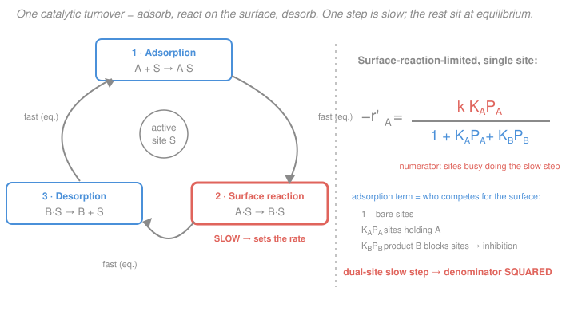

# Chemical Reaction Engineering · Lesson 4.2: Heterogeneous rate laws & rate-limiting steps

> ⏱ ~15 min · Module 4: Catalysis, Diffusion & Nonideal Reactors · Builds on: [4.1 Catalysis & the Langmuir isotherm](04-01-catalysis-langmuir-isotherm.md), [`physical-chemistry` 3.3 Mechanisms: steady-state & pre-equilibrium](../../physical-chemistry/lessons/03-03-mechanisms-steady-state-pre-equilibrium.md) · Unlocks: [4.3 Internal diffusion & the Thiele modulus](04-03-internal-diffusion-thiele-effectiveness.md), which asks whether reactant can even reach the sites this rate law assumes

## Why this matters

A solid catalyst turns a reactant into product by a little assembly line on its surface: the molecule sticks (**adsorbs**), rearranges while stuck (**surface reaction**), then lets go (**desorbs**). To size a catalytic reactor — a packed bed from [1.6](01-06-pfr-packed-bed.md) — you need $-r_A'$, the rate per kilogram of catalyst, as a function of the partial pressures you can dial at the inlet. This lesson builds that rate law *from the mechanism*, and the result has a shape you will see on every industrial catalyst datasheet: the **Langmuir–Hinshelwood–Hougen–Watson (LHHW)** form. Its denominator is a fingerprint — read it right and you can tell adsorption-limited from surface-limited, single-site from dual-site, straight off the pressure data.

## The idea

Three steps, one of them slow. That is the whole trick.

If step 2 (the surface reaction) is far slower than adsorption and desorption, then steps 1 and 3 are essentially always *caught up* — they sit at **equilibrium**, filling and emptying the surface faster than the slow step can consume what is there. This is exactly the **pre-equilibrium approximation** from [`physical-chemistry` 3.3](../../physical-chemistry/lessons/03-03-mechanisms-steady-state-pre-equilibrium.md), now living on a surface. The slow step alone sets the rate; the fast steps just tell you *how full the surface is*.

So the rate is: (rate constant of the slow step) $\times$ (how many sites are currently holding the thing the slow step consumes). The first factor is chemistry. The second factor is a **coverage**, and coverage is governed by the Langmuir competition from [4.1](04-01-catalysis-langmuir-isotherm.md): every species that can stick is fighting for the same finite pile of sites. That fight is what lands in the denominator.

The punchline you can already guess: at low pressure the surface is nearly empty, coverage $\propto$ pressure, and the reaction looks **first order**. At high pressure the surface saturates, coverage stops rising, and the rate flattens to **zero order** — the assembly line is running flat out and feeding it more reactant does nothing. And a product (or a spectator) that adsorbs strongly can *hog* the sites, giving a **negative order**: more of it, slower everything.

## The formal version

Take the isomerization $\mathrm{A} \to \mathrm{B}$ on single sites $S$, product B also able to adsorb. The three-step catalytic cycle:

$$
\underbrace{\mathrm{A} + S \rightleftharpoons \mathrm{A}\cdot S}_{\text{1. adsorption (fast, eq.)}}
\qquad
\underbrace{\mathrm{A}\cdot S \to \mathrm{B}\cdot S}_{\text{2. surface reaction (SLOW)}}
\qquad
\underbrace{\mathrm{B}\cdot S \rightleftharpoons \mathrm{B} + S}_{\text{3. desorption (fast, eq.)}}
$$

Let $C_v$ be the concentration of **vacant** sites, $C_{A\cdot S}$ and $C_{B\cdot S}$ the occupied ones (all in mol per kg catalyst), $P_A, P_B$ partial pressures (atm), $K_A, K_B$ the adsorption equilibrium constants (atm$^{-1}$), and $C_t$ the **total** site concentration (mol/kg) — a fixed property of the catalyst.

**Step 1 at equilibrium** (adsorption balances desorption of A):
$$C_{A\cdot S} = K_A P_A\, C_v.$$
*In words: the more A-pressure and the stickier A, the more sites hold A — proportional to the vacant sites available.*

**Step 3 at equilibrium**, read backwards as adsorption of B ($\mathrm{B}+S \rightleftharpoons \mathrm{B}\cdot S$):
$$C_{B\cdot S} = K_B P_B\, C_v.$$

**Step 2 sets the rate** (rate constant $k_s$, in per-site-time units):
$$-r_A' = k_s\, C_{A\cdot S} = k_s K_A P_A\, C_v. \tag{*}$$
*In words: the rate is the slow step's constant times the number of sites currently holding A.* Everything now hinges on $C_v$, and for that we use the **site balance** — sites are conserved, they can only be vacant, holding A, or holding B:
$$C_t = C_v + C_{A\cdot S} + C_{B\cdot S} = C_v\big(1 + K_A P_A + K_B P_B\big).$$
Solve for $C_v$ and substitute into $(\ast)$:

$$\boxed{\;-r_A' = \frac{k K_A P_A}{1 + K_A P_A + K_B P_B}\;}, \qquad k \equiv k_s C_t. \tag{LHHW}$$

*In words: rate = (a driving term for A on top) over (the adsorption term: bare sites + A-covered + B-covered).* This is the LHHW form. The lumped $k = k_s C_t$ carries units of mol/(kg·s), so $-r_A'$ comes out per mass of catalyst — exactly what the packed-bed balance $\frac{dX}{dW} = \frac{-r_A'}{F_{A0}}$ wants.

**Two structural facts to carry forward:**

- **Dual-site slow step → squared denominator.** If step 2 needs the adsorbed A to react with an *adjacent vacant site*, $\mathrm{A}\cdot S + S \to \mathrm{B}\cdot S + S$, then the rate is $k_s C_{A\cdot S} C_v = k_s K_A P_A\,C_v^2$, and substituting $C_v = C_t/(1+K_A P_A + K_B P_B)$ gives
$$-r_A' = \frac{k K_A P_A}{\big(1 + K_A P_A + K_B P_B\big)^2}.$$
The **exponent on the denominator counts the sites the slow step needs.** Single-site: power 1. Dual-site: power 2.

- **Which step is slow changes the whole $P$-dependence.** If *adsorption* of A is the bottleneck instead, A is no longer at equilibrium, so $K_A P_A$ leaves the denominator and the numerator becomes a bare $P_A$ (with a $-P_B/K$ back-pressure term if the reaction reverses). If *desorption* of B is slow, B piles up and $P_B$ appears strongly. You **diagnose the mechanism** by fitting each candidate form and seeing which one's pressure dependence matches the data — the subject of the analysis in [2.5](02-05-analysis-of-rate-data.md), now with these richer forms as the templates.

| Rate-limiting step | Signature in the rate law |
|---|---|
| Adsorption of A | numerator $\propto P_A$ (no $K_A P_A$ in denominator) |
| Surface reaction, single site | LHHW above, denominator power **1** |
| Surface reaction, dual site | denominator power **2** |
| Desorption of B | $P_B$ dominates; rate falls as product builds |

## Picture

The denominator is not algebra for algebra's sake: every term is a *population of sites*. The `1` is bare sites, $K_A P_A$ the A-covered ones, $K_B P_B$ the B-blocked ones. Fitting a term to near-zero is a physical claim: "that species doesn't stick."

## Worked examples

**Example 1 (derive the single-site LHHW law).** A vapor-phase isomerization $\mathrm{A}\to\mathrm{B}$ runs on a solid catalyst. Kinetic tests show the surface reaction is rate-limiting; adsorption of A and desorption of B are fast. Both A and B adsorb on the same single sites. Derive $-r_A'$.

Follow the mechanism above. Adsorption equilibrium of A: $C_{A\cdot S} = K_A P_A C_v$. Desorption of B at equilibrium (B adsorption): $C_{B\cdot S} = K_B P_B C_v$. Slow surface step: $-r_A' = k_s C_{A\cdot S} = k_s K_A P_A C_v$. Site balance:
$$C_t = C_v + K_A P_A C_v + K_B P_B C_v \;\Rightarrow\; C_v = \frac{C_t}{1 + K_A P_A + K_B P_B}.$$
Substitute, lump $k = k_s C_t$:
$$-r_A' = \frac{k K_A P_A}{1 + K_A P_A + K_B P_B}.$$

**Units/sanity check:** $K_A P_A$ is (atm$^{-1}$)(atm), dimensionless — good, the denominator is a pure number as it must be. $k = k_s C_t$ has units mol/(kg·s), so $-r_A'$ is mol/(kg·s), the per-mass rate a packed bed needs. **Design meaning:** feed pure A ($P_B \approx 0$) at 1 atm with $K_A = 2\ \mathrm{atm^{-1}}$ and $k = 10\ \mathrm{mol/(kg\cdot s)}$; then $-r_A' = 10(2)(1)/(1+2) = 6.7\ \mathrm{mol/(kg\cdot s)}$. To convert 100 mol/s of A at, say, this roughly constant rate near the inlet you'd need on the order of $W \sim F_{A0}X/(-r_A') \approx (100)(0.5)/6.7 \approx 7$ kg of catalyst — a real bed weight falls straight out of the surface mechanism.

**Example 2 (diagnose the limits — order drops from 1 to 0, then B inhibits).** Use $-r_A' = \dfrac{k K_A P_A}{1 + K_A P_A + K_B P_B}$ with $k = 10\ \mathrm{mol/(kg\cdot s)}$, $K_A = 2\ \mathrm{atm^{-1}}$, $K_B = 5\ \mathrm{atm^{-1}}$.

*Step A — order in A with no product around ($P_B=0$).* The **apparent order** in A is the log-log slope
$$n_A \equiv \frac{d\ln(-r_A')}{d\ln P_A} = 1 - \frac{K_A P_A}{1 + K_A P_A} = \frac{1}{1 + K_A P_A}.$$
Tabulate:

| $P_A$ (atm) | $K_A P_A$ | $-r_A'$ (mol/kg·s) | apparent order $n_A$ |
|---|---|---|---|
| 0.1 | 0.2 | $10(0.2)/1.2 = 1.67$ | $1/1.2 = 0.83$ |
| 1 | 2 | $10(2)/3 = 6.67$ | $1/3 = 0.33$ |
| 10 | 20 | $10(20)/21 = 9.52$ | $1/21 = 0.05$ |

The order slides from nearly 1 (empty surface, rate tracks pressure) toward 0 (saturated surface, rate plateaus at $k = 10$). *Same catalyst, same mechanism — the "order" you measure depends entirely on where on the isotherm you sit.*

*Step B — product B inhibits.* Now hold $P_A = 1$ atm ($K_A P_A = 2$) and admit B:

| $P_B$ (atm) | denominator $1 + 2 + K_B P_B$ | $-r_A'$ (mol/kg·s) |
|---|---|---|
| 0 | 3 | $20/3 = 6.67$ |
| 1 | 8 | $20/8 = 2.50$ |
| 2 | 13 | $20/13 = 1.54$ |

More product, slower reaction. The apparent order in B is
$$n_B = \frac{d\ln(-r_A')}{d\ln P_B} = -\frac{K_B P_B}{1 + K_A P_A + K_B P_B},$$
which at $P_B = 1$ is $-5/8 = -0.63$ — **negative**, and it tends to $-1$ when B swamps the surface. B is not consumed by this; it wins the site competition and locks A out.

**Sanity check:** all orders are dimensionless and bounded ($0 \le n_A \le 1$, $-1 \le n_B \le 0$), as a single-site Langmuir surface must give. If a fit ever demands $n_A > 1$ or $n_B < -1$, the mechanism is not single-site LHHW — likely a dual-site (squared) denominator.

## Watch out

- **You might think a bigger adsorption constant always means a faster catalyst.** It doesn't. Strong adsorption *raises coverage*, but coverage saturates at 1 — beyond that, more $K_A P_A$ just enlarges the denominator too, and a strongly-adsorbing **product** or spectator throttles the rate (negative order). The best catalyst binds the reactant "just enough": the Sabatier principle.
- **You might drop the square on a dual-site law.** The denominator's exponent is a mechanistic fingerprint, not decoration — power 1 means the slow step uses one site, power 2 means it needs an adjacent partner site. Fit the wrong power and your $k$, and every extrapolated pressure, is off.
- **You might read a negative order as "B is being consumed faster."** No — negative order is a *site-blocking* statement. B could even be an inert that happens to adsorb; it slows A simply by occupying real estate. Order signs report surface competition, not stoichiometry.
- **You might forget that "the order" is local.** These rate laws are non-power-law; the apparent order is the log-log slope *at your operating pressure* and it changes as you move. Quoting "the reaction is first order" without the pressure range is meaningless for a catalytic reaction.

## One-liner

> A catalytic rate law is a coverage story: the numerator is the slow step's occupied sites, the denominator is everyone competing for the surface — squared when the slow step needs two sites at once.

## Problems

**P1 (🟢)** A single-reactant, surface-reaction-limited catalyst gives $-r_A' = \dfrac{k K_A P_A}{1 + K_A P_A}$ with $k = 5\ \mathrm{mol/(kg\cdot s)}$ and $K_A = 4\ \mathrm{atm^{-1}}$. Compute $-r_A'$ and the apparent order in A at (a) $P_A = 0.5$ atm and (b) $P_A = 5$ atm. What does the rate approach as $P_A \to \infty$, and why?

**P2 (🟡)** For a **single** reactant A (no product adsorption), compare a single-site surface-limited law $-r_A' = \dfrac{k K_A P_A}{1 + K_A P_A}$ with a **dual-site** one $-r_A' = \dfrac{k K_A P_A}{(1 + K_A P_A)^2}$. Show that as $P_A$ rises the single-site rate saturates to a plateau, but the dual-site rate rises, **peaks, then falls**. Find the pressure $P_A$ at which the dual-site rate is maximum. What does the falling branch tell you physically? *(This is the classic way to spot a dual-site mechanism from data.)*

**P3 (🔴)** A bimolecular surface reaction $\mathrm{A} + \mathrm{B} \to \mathrm{C}$ proceeds by **dual-site** Langmuir–Hinshelwood: A and B each adsorb on single sites and react when adjacent. With products negligible,
$$-r_A' = \frac{k K_A K_B P_A P_B}{\big(1 + K_A P_A + K_B P_B\big)^2}.$$
Hold $P_A$ fixed and find the partial pressure $P_B$ that **maximizes** the rate. Interpret the result: why is there an optimum rather than "more B is always better"?

Solutions

**P1** Apparent order $n_A = \dfrac{1}{1+K_A P_A}$ (from Example 2, with $P_B=0$).
- (a) $P_A = 0.5$: $K_A P_A = 2$, so $-r_A' = 5(2)/(1+2) = 3.33\ \mathrm{mol/(kg\cdot s)}$, order $= 1/3 = 0.33$.
- (b) $P_A = 5$: $K_A P_A = 20$, so $-r_A' = 5(20)/21 = 4.76\ \mathrm{mol/(kg\cdot s)}$, order $= 1/21 = 0.048$.

As $P_A \to \infty$, $K_A P_A$ dominates and $-r_A' \to k = 5\ \mathrm{mol/(kg\cdot s)}$: the surface is fully covered in A (coverage $\to 1$), so every site is running the slow step flat out and adding pressure buys nothing — pure zero order. (Units: $k$ already in mol/(kg·s), and the fraction is dimensionless ✓.)

**P2** Let $u = K_A P_A$ (dimensionless).

*Single-site:* $-r_A' = \dfrac{ku}{1+u} \to k$ as $u\to\infty$ — a monotone rise to the plateau $k$. No maximum.

*Dual-site:* $-r_A' = \dfrac{ku}{(1+u)^2}$. Differentiate with respect to $u$:
$$\frac{d(-r_A')}{du} = k\,\frac{(1+u)^2 - u\cdot 2(1+u)}{(1+u)^4} = k\,\frac{(1+u) - 2u}{(1+u)^3} = k\,\frac{1-u}{(1+u)^3}.$$
This is positive for $u<1$, zero at $u=1$, negative for $u>1$ — so the rate rises, peaks at $u = K_A P_A = 1$, i.e.
$$\boxed{P_A^{\text{max}} = 1/K_A},$$
then declines (as $u\to\infty$, $-r_A' \approx k/u \to 0$). Maximum rate $= k(1)/(1+1)^2 = k/4$.

*Physical reading:* a dual-site slow step needs an adsorbed A **and** a neighboring **vacant** site. Piling on $P_A$ eventually covers *everything* in A — no vacant partner sites remain — so the reaction chokes on its own reactant. That falling branch is impossible for a single-site mechanism, so seeing the rate drop at high $P_A$ is the tell-tale of dual-site kinetics. (Sanity: at the peak, coverage $\theta_A = u/(1+u) = 1/2$ — half sites hold A, half are vacant partners, the ideal split ✓.)

**P3** Fix $P_A$; write $a \equiv K_A P_A$ (constant) and $v \equiv K_B P_B$ (the variable). Then
$$-r_A' = \frac{k\,a\,v}{(1 + a + v)^2} = \big(k\,a\big)\frac{v}{(1+a+v)^2}.$$
Let $D \equiv 1+a$. Maximize $g(v) = \dfrac{v}{(D+v)^2}$:
$$g'(v) = \frac{(D+v)^2 - v\cdot 2(D+v)}{(D+v)^4} = \frac{(D+v)-2v}{(D+v)^3} = \frac{D-v}{(D+v)^3} = 0 \;\Rightarrow\; v = D.$$
So $K_B P_B = 1 + K_A P_A$, i.e.
$$\boxed{P_B^{\text{opt}} = \frac{1 + K_A P_A}{K_B}}.$$
*Interpretation:* the reaction needs A **and** B adsorbed on adjacent sites, so it wants a balanced surface — roughly equal populations of A-sites and B-sites. Flood the surface with B and it crowds A off; starve it of B and there is nothing for A to react with. The optimum sets B's coverage to match "one plus A's grip," the point where an A and a B are most likely to be neighbors. (Sanity check: at the optimum $v = D = 1+a$, so the denominator is $(2D)^2$ and coverages are $\theta_A = a/(2D)$, $\theta_B = D/(2D) = 1/2$ — B takes half the surface, A and vacancies share the rest, the balanced state ✓. This same "there is an optimal feed ratio" logic drives selectivity choices in [2.6](02-06-multiple-reactions-yield-selectivity.md).)

## Flashback

**From Lesson 4.1 (Langmuir isotherm):** A gas A adsorbs on a catalyst with $K_A = 3\ \mathrm{atm^{-1}}$. (a) What partial pressure of A covers half the surface? (b) Now a second gas B, with $K_B = 6\ \mathrm{atm^{-1}}$, is also present at $P_B = 0.5$ atm and competes for the same sites. Using competitive Langmuir $\theta_A = \dfrac{K_A P_A}{1 + K_A P_A + K_B P_B}$, what $P_A$ is now needed to hold $\theta_A = 0.4$?

Solution

(a) Half coverage means $\theta_A = \dfrac{K_A P_A}{1+K_A P_A} = 0.5 \Rightarrow K_A P_A = 1 \Rightarrow P_A = 1/K_A = 1/3 \approx 0.33$ atm. (Half-coverage pressure is always $1/K_A$ — the isotherm's natural scale.)

(b) With B present, $K_B P_B = 6(0.5) = 3$. Require
$$\frac{3 P_A}{1 + 3P_A + 3} = 0.4 \;\Rightarrow\; 3P_A = 0.4(4 + 3P_A) = 1.6 + 1.2 P_A \;\Rightarrow\; 1.8 P_A = 1.6 \;\Rightarrow\; P_A \approx 0.89\ \text{atm}.$$
Check: denominator $= 1 + 3(0.89) + 3 = 6.67$, and $\theta_A = 2.67/6.67 = 0.40$ ✓. You need almost triple the pressure ($0.89$ vs $0.33$ atm) to reach a *lower* coverage than before — B is squatting on the sites. This is precisely the site competition that puts $K_B P_B$ in the LHHW denominator and makes B a rate inhibitor.

## Connections

- **Backward:** the LHHW denominator *is* the Langmuir site-balance denominator from [4.1](04-01-catalysis-langmuir-isotherm.md) — coverage and rate law share the same "who's on the surface" bookkeeping. The rate-limiting-step logic is the pre-equilibrium approximation of [`physical-chemistry` 3.3](../../physical-chemistry/lessons/03-03-mechanisms-steady-state-pre-equilibrium.md), and you fit these forms to pressure data with the methods of [2.5](02-05-analysis-of-rate-data.md).
- **Forward:** this $-r_A'$ is the **intrinsic** kinetics a catalyst pellet *would* show if every site were fed instantly. [4.3](04-03-internal-diffusion-thiele-effectiveness.md) asks whether reactant can actually diffuse into the pellet fast enough to keep those sites supplied — the intrinsic $k$ here becomes the $k$ inside the Thiele modulus — and [4.4](04-04-external-mass-transfer-disguised-kinetics.md) shows how transport can *disguise* the order and activation energy you'd read off these laws.
- **Sideways:** the saturating single-site form $-r_A' = \dfrac{k K_A P_A}{1+K_A P_A}$ is algebraically the **Michaelis–Menten** law from [`physical-chemistry` 3.5](../../physical-chemistry/lessons/03-05-catalysis-enzyme-kinetics.md) — an enzyme is a one-site catalyst, $K_A$ plays the role of $1/K_M$, and "substrate saturation" is exactly "surface saturation." Same binding-then-react mechanism, same rate-law shape, different century of discovery.
