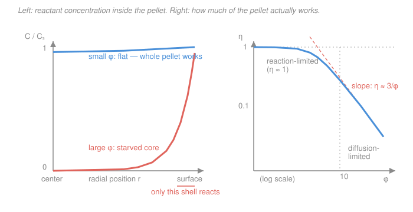

# Chemical Reaction Engineering · Lesson 4.3: Internal diffusion — the Thiele modulus & effectiveness factor

> ⏱ ~15 min · Module 4: Catalysis & Reactor Diagnostics · Builds on: [4.2 Heterogeneous rate laws (LHHW)](04-02-heterogeneous-rate-laws-lhhw.md), [transport-phenomena 4.3 Diffusion with reaction & the Thiele modulus](../../transport-phenomena/lessons/04-03-diffusion-with-reaction-thiele.md) · Unlocks: [4.4 External mass transfer & disguised kinetics](04-04-external-mass-transfer-disguised-kinetics.md), Boss Problem 4 (catalyst pellet)

## Why this matters

In [4.2](04-02-heterogeneous-rate-laws-lhhw.md) you measured an *intrinsic* rate on a catalyst surface. But real catalyst isn't a flat surface — it's a porous pellet the size of a peppercorn, laced with a labyrinth of pores that pack an enormous internal surface area into a few cubic millimeters. Here's the catch: a reactant molecule in the bulk gas has to **diffuse down those pores** before it can find an active site. If the reaction is hungry and the pores are slow, the molecule gets eaten near the mouth of the pore and never reaches the center. The **interior of your pellet does nothing** — you paid for catalyst that just sits there. This lesson gives you the one dimensionless number that tells you whether that's happening, and the correction factor that turns intrinsic kinetics into the rate you'll actually observe in a reactor.

## The idea

Picture a sponge dropped into ink where the ink also gets *destroyed* on contact with the sponge fibers. Two things race: ink soaking **inward** (diffusion) versus ink being **consumed** on the way (reaction). If consumption is slow, ink saturates the whole sponge evenly — every fiber is wet, every fiber works. If consumption is ferocious, the ink is gobbled up at the surface and the core stays bone-dry — only the outer skin ever sees any ink.

A catalyst pellet is exactly this. The reactant is the ink; the pores are the soaking channels; the active sites are the fibers that consume it. When **reaction is slow relative to diffusion**, the reactant concentration is nearly flat all the way to the center — the whole pellet is active. When **reaction is fast relative to diffusion**, the concentration plummets from the surface value to nearly zero within a thin outer shell — the core is starved, and adding more catalyst mass to the interior buys you nothing.

The single knob that decides which world you're in is the ratio of those two rates. Big ratio, starved core. Small ratio, uniform activity. That ratio, packaged dimensionlessly, is the **Thiele modulus**.

## The formal version

**Effective diffusivity.** Inside a pellet the reactant doesn't diffuse through open gas — it threads through tortuous, partly-blocked pores. We bundle all that geometry into an **effective diffusivity**

$$D_e = \frac{D_{AB}\,\varepsilon_p\,\sigma_c}{\tau},$$

where $D_{AB}$ is the ordinary (or Knudsen) pore diffusivity (cm²/s), $\varepsilon_p$ the pellet porosity (void fraction, dimensionless), $\tau$ the tortuosity (path-lengthening factor $\gtrsim 3$, dimensionless), and $\sigma_c$ a constriction factor (dimensionless). *In words: $D_e$ is the diffusivity a molecule feels once you charge it for the fact that pores are narrow, winding, and mostly not there.* Numerically $D_e$ is typically **an order of magnitude smaller** than the free-gas $D_{AB}$.

**Thiele modulus.** For a spherical pellet of radius $R$ (cm) carrying a first-order reaction with volumetric rate constant $k$ (s⁻¹), define

$$\boxed{\;\phi = R\sqrt{\dfrac{k}{D_e}}\;}$$

*In words: $\phi$ is (reaction rate) ÷ (diffusion rate) inside the pellet — how fast the reactant is destroyed compared to how fast it can be resupplied by diffusion.* It is dimensionless: $[\,\text{cm}\,]\sqrt{\text{s}^{-1}/(\text{cm}^2\text{s}^{-1})} = \text{cm}\cdot\text{cm}^{-1}$. Large $\phi$ = reaction wins the race = starved core.

**Effectiveness factor.** Solving the diffusion–reaction balance inside the sphere (done for you in [transport-phenomena 4.3](../../transport-phenomena/lessons/04-03-diffusion-with-reaction-thiele.md)) gives the concentration profile, and integrating the local rate over the whole pellet gives the total. We report the result as the **effectiveness factor**

$$\eta = \frac{\text{actual rate over the whole pellet}}{\text{rate if the entire pellet were at the surface concentration }C_{As}},$$

which for a **sphere, first order** works out to

$$\boxed{\;\eta = \frac{3}{\phi^2}\big(\phi\coth\phi - 1\big)\;}$$

*In words: $\eta$ is the fraction of your pellet's potential that you actually get — how much the internal starvation discounts the rate.* The rate you observe is then simply

$$\big(-r_A\big)_{\text{observed}} = \eta\,\big(-r_A\big)_{\text{surface}} = \eta\,k\,C_{As}.$$

The two limits are the whole story:

- **$\phi \ll 1$ (reaction-limited):** $\eta \to 1$. Diffusion easily keeps up; the pellet is uniformly active; you get the full intrinsic rate.
- **$\phi \gg 1$ (diffusion-limited):** $\coth\phi \to 1$, so $\eta \approx \dfrac{3}{\phi^2}(\phi - 1) \approx \dfrac{3}{\phi}$. Only a thin shell of thickness $\sim R/\phi$ reacts; the observed rate is a small fraction of intrinsic.

## Picture

Left panel: for small $\phi$ (blue) the reactant concentration barely sags from center to surface — every part of the pellet sees plenty of reactant. For large $\phi$ (coral) it collapses to near zero except in a thin outer shell. Right panel: $\eta$ sits on a plateau at $1$ while $\phi \lesssim 0.4$, then rolls off along the $3/\phi$ asymptote once diffusion can't keep up. The whole game is knowing which part of that curve your pellet lives on.

## Worked examples

### Example 1 — Boss Problem 4: rating a real pellet

A spherical catalyst pellet has radius $R = 0.5$ cm. The first-order reaction has volumetric rate constant $k = 2$ s⁻¹, and the effective diffusivity is $D_e = 5\times 10^{-3}$ cm²/s. Find the Thiele modulus and effectiveness factor, and interpret.

**Thiele modulus.**
$$\phi = R\sqrt{\frac{k}{D_e}} = 0.5\,\text{cm}\,\sqrt{\frac{2\ \text{s}^{-1}}{5\times10^{-3}\ \text{cm}^2\text{s}^{-1}}} = 0.5\sqrt{400\ \text{cm}^{-2}} = 0.5 \times 20 = 10.$$

**Effectiveness factor.** With $\phi = 10$, $\coth 10 \approx 1.0000$ (it's already indistinguishable from 1 by $\phi \approx 3$), so
$$\eta = \frac{3}{\phi^2}\big(\phi\coth\phi - 1\big) = \frac{3}{100}\big(10\times 1 - 1\big) = \frac{3}{100}\times 9 = 0.27.$$

**Interpret.** $\phi = 10 \gg 1$: strongly **diffusion-limited**. Check against the asymptote: $3/\phi = 3/10 = 0.30$, essentially the same as $0.27$ — confirming we're deep in the diffusion-limited tail. Only about a quarter of the pellet's intrinsic capacity is realized. Physically, the active shell is roughly $R/\phi = 0.5/10 = 0.05$ cm thick — a 0.5-mm skin on a 5-mm pellet — and the entire core is dead weight. **Design read:** buying a more active catalyst (bigger $k$) is nearly pointless here (see Watch out); the lever that works is a **smaller pellet**.

*Sanity check:* $\eta$ is dimensionless and lies in $(0,1)$, as it must — you can never beat the surface-concentration rate. ✓

### Example 2 — the small-$\phi$ contrast: crush the pellet

Take the *same* catalyst and gas, but grind the pellet down to a fine particle with $R = 0.025$ cm (a factor-of-20 reduction). Now
$$\phi = 0.025\sqrt{400} = 0.025 \times 20 = 0.5.$$
$$\eta = \frac{3}{(0.5)^2}\big(0.5\coth 0.5 - 1\big).$$
Here $\coth 0.5 = 1/\tanh 0.5 = 1/0.4621 = 2.164$, so $0.5\times 2.164 = 1.082$, and
$$\eta = \frac{3}{0.25}\big(1.082 - 1\big) = 12 \times 0.082 = 0.98.$$

Now **98%** of the pellet is doing useful work, versus 27% before. Same chemistry, same diffusivity — the only change was particle size, and the realized rate per gram of catalyst jumped by a factor of $0.98/0.27 \approx 3.6$. This is why fluidized-bed and slurry reactors use fine powders: they operate at $\phi \ll 1$ and extract nearly the full intrinsic rate. The price is paid elsewhere — small particles pack tightly and choke gas flow, spiking the pressure drop from the [Ergun equation in 2.4](02-04-isothermal-design-pressure-drop-ergun.md). **Pellet size is a genuine design variable: internal effectiveness pulls toward small, pressure drop pulls toward large.**

## Watch out

- **You might think** a more active catalyst always means a faster reactor. **But actually**, deep in the diffusion-limited regime it barely helps. The observed rate scales as $\eta\, k \approx (3/\phi)\,k = 3\sqrt{D_e/k}\,k/R = (3/R)\sqrt{k D_e}$ — it goes as $\sqrt{k}$, not $k$. Double the intrinsic activity and you gain only $\sqrt{2}\approx 1.4\times$, because the extra speed just steepens the profile and shrinks the active shell. The $1/\sqrt{k}$ in $\eta$ half-cancels the $k$ in the rate. Smaller $R$, on the other hand, gives a full linear payoff.

- **You might think** $\eta$ is a property of the catalyst you can look up. **But actually** it depends on $R$, $k$, *and* $D_e$ together through $\phi$ — change the pellet size or the temperature (which changes $k$) and $\eta$ moves. In particular, raising temperature speeds reaction far more than diffusion, so a pellet that's reaction-limited when cold can slide into diffusion limitation when hot — one reason apparent activation energies drop at high temperature (the "disguised kinetics" of [4.4](04-04-external-mass-transfer-disguised-kinetics.md)).

- **You might think** you need to know $k$ and $D_e$ separately to detect diffusion limitation — a lab headache. **But actually** you can diagnose it from *observables only*. The **Weisz–Prater criterion** forms $C_{WP} = \eta\phi^2 = \dfrac{(-r_A')_{\text{obs}}\,\rho_c R^2}{D_e\,C_{As}}$ from the measured rate, pellet radius, density, and surface concentration — no intrinsic $k$ required. If $C_{WP} \ll 1$, no internal limitation ($\eta \approx 1$); if $C_{WP} \gg 1$, you're diffusion-limited. It's the practical field test for whether your pellet's core is dead.

## One-liner

> The Thiele modulus $\phi = R\sqrt{k/D_e}$ asks "does the reactant reach the core before it's eaten?" — and $\eta$ tells you what fraction of your pellet you actually paid for and got.

## Problems

**P1 (🟢)** A spherical pellet has $R = 0.3$ cm, first-order $k = 0.8$ s⁻¹, and $D_e = 2\times 10^{-2}$ cm²/s. Compute $\phi$. Is this pellet reaction-limited or diffusion-limited? Estimate $\eta$ with the appropriate limiting formula, then state what fraction of the pellet's intrinsic rate you'd observe.

**P2 (🟡)** For the pellet in Example 1 ($\phi = 10$, $\eta = 0.27$), an engineer proposes *doubling* the intrinsic rate constant to $k = 4$ s⁻¹ by switching to a pricier catalyst. Recompute $\phi$, $\eta$, and the observed rate group $\eta k$ (relative to the original $\eta k$). By what factor does the *observed* rate actually improve? Was the pricier catalyst worth it?

**P3 (🔴)** You measure an observed rate on a pellet and want to know, without a kinetics rig, whether internal diffusion is throttling it. Given observed rate $(-r_A')_{\text{obs}} = 0.05$ mol/(g·s), pellet density $\rho_c = 2$ g/cm³, $R = 0.4$ cm, $D_e = 3\times10^{-3}$ cm²/s, and measured surface concentration $C_{As} = 0.1$ mol/cm³. Check the units and compute the Weisz–Prater number $C_{WP} = \dfrac{(-r_A')_{\text{obs}}\,\rho_c R^2}{D_e\,C_{As}}$. What do you conclude?

Solutions

**P1** $\phi = R\sqrt{k/D_e} = 0.3\sqrt{0.8/0.02} = 0.3\sqrt{40} = 0.3 \times 6.32 = 1.90$.

This is a middling value — neither limit is exact, so use the full formula. $\coth(1.90) = 1/\tanh(1.90)$; $\tanh(1.90) = 0.9562$, so $\coth(1.90) = 1.0458$. Then
$$\eta = \frac{3}{(1.90)^2}\big(1.90\times 1.0458 - 1\big) = \frac{3}{3.61}\big(1.987 - 1\big) = 0.831 \times 0.987 = 0.82.$$
So $\phi \approx 1.9$ sits on the shoulder of the curve — mildly diffusion-influenced. You'd observe about **82%** of the intrinsic rate; the core is starting to starve but most of the pellet still works. (If you'd sloppily used $3/\phi = 1.58 > 1$, that nonsense answer is your flag that $\phi$ isn't large enough for the diffusion-limited approximation.)

**P2** New $\phi = R\sqrt{k/D_e} = 0.5\sqrt{4/(5\times10^{-3})} = 0.5\sqrt{800} = 0.5\times 28.28 = 14.14$.

Still $\gg 1$, so $\eta \approx 3/\phi = 3/14.14 = 0.212$.

Observed rate group: $\eta k = 0.212 \times 4 = 0.849$. Original: $\eta k = 0.27 \times 2 = 0.54$. Ratio $= 0.849/0.54 = 1.57 \approx \sqrt{2}$.

**Doubling $k$ improved the observed rate by only ~1.57× (≈$\sqrt{2}$), not 2×.** In the diffusion-limited regime the rate scales as $\sqrt{k}$, so half the money bought nothing. Verdict: the pricier catalyst is a poor buy — the engineer should shrink the pellet instead, which pays off linearly in $1/R$.

**P3** First units. $(-r_A')_{\text{obs}}\rho_c R^2 = 0.05\,\frac{\text{mol}}{\text{g·s}} \times 2\,\frac{\text{g}}{\text{cm}^3} \times (0.4)^2\,\text{cm}^2 = 0.05\times 2\times 0.16 = 0.016\ \frac{\text{mol}}{\text{cm·s}}$.

Denominator: $D_e C_{As} = 3\times10^{-3}\,\frac{\text{cm}^2}{\text{s}} \times 0.1\,\frac{\text{mol}}{\text{cm}^3} = 3\times10^{-4}\ \frac{\text{mol}}{\text{cm·s}}$.

$$C_{WP} = \frac{0.016}{3\times10^{-4}} = 53.3.$$

Dimensionless (the mol·cm⁻¹·s⁻¹ cancels), as required. $C_{WP} = 53 \gg 1$: **strongly diffusion-limited.** Since $C_{WP} = \eta\phi^2$ and here $\eta\phi^2 \approx (3/\phi)\phi^2 = 3\phi$, we even get an estimate $\phi \approx 53/3 \approx 18$, i.e. $\eta \approx 3/18 \approx 0.17$. Conclusion: internal diffusion is throttling this pellet hard — grind it down or you're wasting most of the catalyst. All of this from observables, no intrinsic $k$ measured.

## Flashback

**From Lesson 4.2 (Heterogeneous rate laws, LHHW):** A gas-phase reaction $A \to B$ is surface-reaction-limited on a single-site catalyst, giving the LHHW rate law $-r_A' = \dfrac{k K_A P_A}{1 + K_A P_A + K_B P_B}$. At the reactor inlet $P_A = 2$ atm, $P_B = 0$, with $k = 5$ mol/(g·s), $K_A = 0.5$ atm⁻¹, $K_B = 1.5$ atm⁻¹. (a) Compute $-r_A'$ at the inlet. (b) The reaction runs to a point where $P_A = 0.5$ atm and $P_B = 1.5$ atm. Compute $-r_A'$ there and explain why it dropped by more than the drop in $P_A$ alone would suggest.

Solution

(a) Denominator $= 1 + K_A P_A + K_B P_B = 1 + 0.5(2) + 1.5(0) = 1 + 1 = 2$. Numerator $= k K_A P_A = 5(0.5)(2) = 5$. So $-r_A' = 5/2 = 2.5$ mol/(g·s).

(b) Denominator $= 1 + 0.5(0.5) + 1.5(1.5) = 1 + 0.25 + 2.25 = 3.5$. Numerator $= 5(0.5)(0.5) = 1.25$. So $-r_A' = 1.25/3.5 = 0.357$ mol/(g·s).

The rate fell from 2.5 to 0.357 — a factor of **7**, far more than the 4× drop in $P_A$ (2 → 0.5). Two things stacked: the numerator dropped 4× as $P_A$ fell, *and* the product B, with a strong adsorption constant $K_B = 1.5$, piled onto the surface and crowded A off the active sites — the $K_B P_B$ term grew from 0 to 2.25, inflating the denominator. **Product inhibition** compounds reactant depletion. This is exactly the surface-coverage competition that the effectiveness factor of *this* lesson assumes is already baked into the intrinsic $k$: internal diffusion then discounts *that* rate further.

## Connections

- **Backward:** the intrinsic rate $-r_A' = k C_{As}$ that $\eta$ discounts comes straight from the surface kinetics of [4.2 (LHHW)](04-02-heterogeneous-rate-laws-lhhw.md); the pellet-size ↔ pressure-drop tradeoff ties back to the Ergun equation of [2.4](02-04-isothermal-design-pressure-drop-ergun.md).
- **Sideways:** the Thiele modulus and $\eta = \frac{3}{\phi^2}(\phi\coth\phi - 1)$ are **not new here** — [transport-phenomena 4.3](../../transport-phenomena/lessons/04-03-diffusion-with-reaction-thiele.md) *derived* them from the diffusion-with-reaction balance for a slab and sphere. That course produced the tool; this lesson uses it to rate a working catalyst pellet and turn it into a reactor design lever. Same math, one abstraction layer up.
- **Forward:** we've been assuming the reactant reaches the *pellet surface* at bulk concentration. [4.4 (external mass transfer)](04-04-external-mass-transfer-disguised-kinetics.md) removes that assumption — a stagnant gas film outside the pellet adds *another* resistance in series, and when it dominates it "disguises" the kinetics (apparent order $(n+1)/2$, apparent $E \approx E_{\text{true}}/2$). Internal (this lesson) + external (next) diffusion together set the real rate a reactor sees. It all comes to a head in **Boss Problem 4**.
