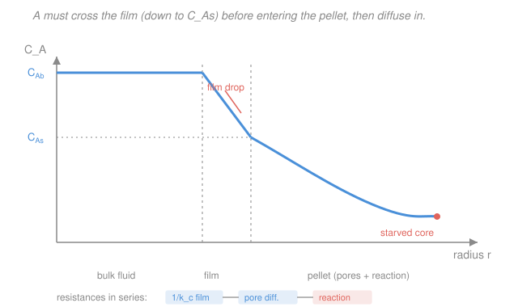

# Chemical Reaction Engineering · Lesson 4.4: External mass transfer & the disguise of kinetics

> ⏱ ~15 min · Module 4: Catalysis & Diffusion · Builds on: [4.3 Internal diffusion & the effectiveness factor](04-03-internal-diffusion-thiele-effectiveness.md), [`transport-phenomena` 4.5 Mass-transfer coefficients & correlations](../../transport-phenomena/lessons/04-05-mass-transfer-coefficients-correlations.md), [`transport-phenomena` 4.2 Diffusion through a stagnant film](../../transport-phenomena/lessons/04-02-diffusion-stagnant-film-stefan.md) · Unlocks: [4.5 Residence-time distribution](04-05-residence-time-distribution.md), [4.6 Nonideal reactor models](04-06-nonideal-reactor-models.md)

## Why this matters

In [4.3](04-03-internal-diffusion-thiele-effectiveness.md) a reactant molecule fought its way *inside* the pellet through the pore maze. But before any of that, it has to get *to* the pellet — and a pellet sitting in flowing fluid is wrapped in a thin, nearly-stagnant boundary layer the fluid can't scrub off. The molecule must diffuse across that **film** first. That's a third resistance, wired in series with pore diffusion and the intrinsic reaction, and sometimes it's the one that throttles everything.

The payoff is a piece of detective work you'll use for the rest of your career. When transport limits the rate, the reaction *lies about its own kinetics* — the order and activation energy you measure are not the true ones. Read those clues correctly and you know whether to buy a better catalyst, crush the pellets, or just turn up the pump. Read them wrong and you'll spend a year "improving" a catalyst that was never the bottleneck.

## The idea

Picture the journey of one molecule of A from the bulk gas to a reacted product, as a relay of three legs:

1. **Cross the film** — diffuse through the stagnant boundary layer around the pellet, from bulk concentration $C_{Ab}$ down to the surface concentration $C_{As}$.
2. **Diffuse into the pores** — the internal-diffusion leg from [4.3](04-03-internal-diffusion-thiele-effectiveness.md), captured by the effectiveness factor $\eta$.
3. **React** at an active site.

Three legs in series means three **resistances in series**, exactly like resistors in a circuit: the total resistance is the sum, and the *slowest* leg sets the pace. If the film is molasses, it doesn't matter how brilliant your catalyst is — the sites are starved because A can't be delivered fast enough.

Here's the twist that makes this lesson worth its salt. When a *transport* leg controls, the overall rate takes on the personality of *transport*, not of chemistry. Diffusion barely cares about temperature (a warm gas diffuses only slightly faster than a cold one), so a transport-limited rate barely responds to heating — even though the underlying reaction is screamingly Arrhenius. That mismatch between what you measure and what's really happening is called **disguised** (or falsified) **kinetics**, and its specific fingerprints are a diagnosis you can run with a thermometer and a pump.

## The formal version

**External film flux.** At steady state, the rate at which A arrives at the outer surface (per unit external surface area) is set by the film mass-transfer coefficient $k_c$:

$$-r_A'' = k_c\,(C_{Ab} - C_{As}),$$

where $-r_A''$ is the molar flux to the surface (mol·m⁻²·s⁻¹), $k_c$ is the **mass-transfer coefficient** (m·s⁻¹), $C_{Ab}$ is the bulk concentration and $C_{As}$ the surface concentration (mol·m⁻³). *In words: flux equals the coefficient times the concentration drop across the film.* You met $k_c$ in [`transport-phenomena` 4.5](../../transport-phenomena/lessons/04-05-mass-transfer-coefficients-correlations.md) — it comes from a Sherwood-number correlation $\mathrm{Sh} = k_c d_p / D_{AB}$ that depends on flow (Reynolds) and fluid properties (Schmidt); pump harder and $k_c$ goes up because the film gets thinner.

**Couple film to reaction.** The catch is that $C_{As}$ is not something you measure — it's whatever value makes supply equal consumption. For a first-order surface reaction $-r_A'' = k'' C_{As}$ (with $k''$ a surface rate constant, also m·s⁻¹, so the units match), steady state demands **arrival = consumption**:

$$k_c\,(C_{Ab} - C_{As}) = k''\,C_{As} \quad\Longrightarrow\quad C_{As} = \frac{k_c}{k_c + k''}\,C_{Ab}.$$

Substitute back to get the observable rate purely in terms of the *bulk* concentration you actually know:

$$\boxed{\,-r_A'' = \frac{C_{Ab}}{\dfrac{1}{k_c} + \dfrac{1}{k''}}\,}$$

*In words: the two resistances $1/k_c$ (film) and $1/k''$ (reaction) simply add, and the bigger one controls.* Fold in the pore leg from [4.3](04-03-internal-diffusion-thiele-effectiveness.md) and you have all three in series; the smallest coefficient (largest resistance) is the bottleneck.

**Disguised kinetics — the fingerprints.** Suppose the *true* rate law is order $n$ with Arrhenius constant $k = A e^{-E/RT}$. What you *observe* depends on which leg controls:

| Regime controlling | Apparent order | Apparent activation energy | Tell-tale |
|---|---|---|---|
| Reaction (kinetics) | $n$ (true) | $E$ (true) | responds to catalyst, to $T$; blind to flow & size |
| Pore diffusion (internal) | $(n+1)/2$ | $\approx E/2$ | shrink pellet $\to$ rate rises; blind to flow |
| Film (external) | $1$ | $\approx 0$ (few kJ/mol) | pump faster $\to$ rate rises; nearly blind to $T$ |

*In words: transport doesn't just slow the rate — it rewrites the order and halves (or erases) the activation energy you'd measure.*

Where does the pore-diffusion row come from? From [4.3](04-03-internal-diffusion-thiele-effectiveness.md): in the strong-diffusion limit $\eta \approx 3/\phi_1$ with the Thiele modulus $\phi_1 = R\sqrt{k/D_e}$. The observed rate is $\eta$ times the intrinsic rate:

$$-r_A^{\text{obs}} = \eta\,k\,C_A \approx \frac{3}{R}\sqrt{\frac{D_e}{k}}\;k\,C_A = \frac{3}{R}\sqrt{D_e\,k}\;C_A.$$

The observed rate constant scales as $\sqrt{D_e\,k}$. Since $k \propto e^{-E/RT}$ and $D_e$ hardly depends on $T$, $\sqrt{k} \propto e^{-E/2RT}$ — so $E_{\text{obs}} \approx E/2$. Redo the argument for a general order and the $\sqrt{k}$ drags the apparent order to $(n+1)/2$ (Example 2). The film row is the extreme case: when $k_c \ll k''$, $C_{As} \to 0$ and $-r_A'' \to k_c C_{Ab}$ — first order in bulk, and $k_c$ carries diffusion's near-zero activation energy, so the true chemistry is completely masked.

## Picture

The height of the film drop measures how much the external resistance is starving the surface; the decay inside the pellet is the internal (pore) resistance from 4.3. Add reaction, and you have all three in series.

## Worked examples

**Example 1 (film + reaction in series — find the controlling resistance).** A first-order catalytic reaction runs on non-porous pellet surfaces (so ignore pores for now). Measurements give a film coefficient $k_c = 0.01\ \mathrm{m/s}$, a surface rate constant $k'' = 0.1\ \mathrm{m/s}$, and a bulk concentration $C_{Ab} = 100\ \mathrm{mol/m^3}$. Find the surface concentration, the rate, and which resistance controls.

Surface concentration:

$$C_{As} = \frac{k_c}{k_c + k''}\,C_{Ab} = \frac{0.01}{0.01 + 0.1}\times 100 = \frac{0.01}{0.11}\times 100 \approx 9.1\ \mathrm{mol/m^3}.$$

The surface is starved down to 9% of bulk — a big clue already. The rate (flux to the surface):

$$-r_A'' = k''\,C_{As} = 0.1 \times 9.1 \approx 0.91\ \mathrm{mol\,m^{-2}\,s^{-1}}.$$

Check against the series formula: $\dfrac{1}{1/k_c + 1/k''} = \dfrac{1}{100 + 10} = \dfrac{1}{110} = 0.0091\ \mathrm{m/s}$, times $100 = 0.91$. ✓ Consistent. The two resistances are $1/k_c = 100\ \mathrm{s/m}$ (film) and $1/k'' = 10\ \mathrm{s/m}$ (reaction). Film is $100/110 \approx 91\%$ of the total — **the film controls**. Buying a catalyst with twice the $k''$ would barely move the rate ($1/k''$ drops from 10 to 5, total 105 vs 110 — a 5% gain). To speed this reactor up you must pump harder to raise $k_c$.

*Units/sanity check:* $[\mathrm{m/s}]\times[\mathrm{mol/m^3}] = \mathrm{mol\,m^{-2}\,s^{-1}}$, a flux per external area. ✓ Multiply by the total external pellet area in the bed to get moles of product per second — the "how much product" number.

**Example 2 (disguised activation energy — why measuring $E$ diagnoses the regime).** A reaction is truly first order ($n=1$) with true activation energy $E = 120\ \mathrm{kJ/mol}$. You run it on large pellets, strongly pore-diffusion-limited, and make an Arrhenius plot of the *observed* rate. What slope do you get, and what does it tell you?

From above, in strong internal diffusion the observed rate constant is $k_{\text{obs}} \propto \sqrt{D_e\,k}$. Taking logs,

$$\ln k_{\text{obs}} = \text{const} + \tfrac12\ln D_e + \tfrac12\ln k = \text{const}' - \frac{E}{2R}\frac{1}{T},$$

(using $D_e$'s weak $T$-dependence as roughly constant). The Arrhenius slope is $-E/2R$, so you would report

$$E_{\text{obs}} \approx \frac{E}{2} = \frac{120}{2} = 60\ \mathrm{kJ/mol}.$$

*The diagnosis:* if a lab reports $E_{\text{obs}} = 60\ \mathrm{kJ/mol}$ but the intrinsic chemistry (measured on tiny crushed particles, $\eta \to 1$) gives $120\ \mathrm{kJ/mol}$, the factor-of-two gap is a signature of pore-diffusion control. And for a general true order $n$, the same $\sqrt{k}$ factor shifts the apparent order to $(n+1)/2$: a truly second-order reaction ($n=2$) *reports* order $(2+1)/2 = 1.5$. So the two numbers you measure — order and $E$ — together fingerprint the regime, no extra equipment required.

*Sanity check:* halving $E$ makes the observed rate less temperature-sensitive, exactly what "transport is taking over" should feel like. ✓

## Watch out

- **You might think a low measured activation energy means the reaction is intrinsically fast and weakly temperature-dependent.** Actually it's often the fingerprint of transport control: $E_{\text{obs}} \approx E/2$ says pore diffusion is limiting, and $E_{\text{obs}} \approx 0$ says the film is. Before you trust a low $E$, crush the pellets and shrink the flow film to see if it climbs back to the true value.
- **You might think raising temperature always speeds a catalytic reactor.** Actually if the film controls, $k_c$ barely changes with $T$ (diffusion is nearly temperature-flat), so heating wastes energy — you must raise the fluid *velocity* to thin the film. Diagnose before you dial.
- **You might plug the bulk concentration into the surface rate law.** Actually the intrinsic rate law lives on $C_{As}$, not $C_{Ab}$ — and when mass transfer matters, $C_{As}$ can be a small fraction of $C_{Ab}$ (9% in Example 1). Always back $C_{As}$ out of the steady-state balance first.

## One-liner

> Reactant queues at three gates — film, pore, reaction — and the slowest gate not only sets the rate but *disguises the kinetics*: a halved activation energy is pore diffusion's confession, a near-zero one is the film's.

## Problems

**P1 (🟢)** A first-order reaction on non-porous pellets has film coefficient $k_c = 0.005\ \mathrm{m/s}$, surface rate constant $k'' = 0.005\ \mathrm{m/s}$, and bulk concentration $C_{Ab} = 50\ \mathrm{mol/m^3}$. Find $C_{As}$, the rate, and which resistance controls.

**P2 (🟡)** A gas-phase reaction over catalyst pellets shows an *apparent* reaction order of $1.5$ and an *apparent* activation energy of $45\ \mathrm{kJ/mol}$. Diagnose the regime, and give the true order and true activation energy. What two experiments would confirm your diagnosis?

**P3 (🔴)** Now include internal diffusion. A pellet's internal resistance (pore + reaction lumped via $\eta$) behaves like an effective first-order surface coefficient $k_r'' = 0.08\ \mathrm{m/s}$, and the external film coefficient is $k_c = 0.02\ \mathrm{m/s}$, with $C_{Ab} = 200\ \mathrm{mol/m^3}$. Treating the two as resistances in series, find $C_{As}$, the overall rate, and rank the controlling resistance.

Solutions

**P1** Surface concentration: $C_{As} = \dfrac{k_c}{k_c + k''}C_{Ab} = \dfrac{0.005}{0.010}\times 50 = 25\ \mathrm{mol/m^3}$ — exactly half of bulk. Rate: $-r_A'' = k'' C_{As} = 0.005 \times 25 = 0.125\ \mathrm{mol\,m^{-2}\,s^{-1}}$ (check: $\dfrac{1}{1/0.005 + 1/0.005} = \dfrac{1}{200+200} = 0.0025\ \mathrm{m/s}$, times $50 = 0.125$ ✓). The resistances are equal ($200\ \mathrm{s/m}$ each), so **neither controls** — this is textbook mixed control, 50/50. Speeding it up requires improving *both* the pump (film) and the catalyst (reaction); fixing only one gets you at most a factor near 2.

**P2** The apparent order $(n+1)/2 = 1.5 \Rightarrow n = 2$: the true reaction is **second order**. The halved activation energy signature means **pore (internal) diffusion controls**, so $E_{\text{true}} \approx 2 \times E_{\text{obs}} = 2 \times 45 = 90\ \mathrm{kJ/mol}$. Two confirmations: (i) **crush the pellets** — if pore diffusion is limiting, smaller $R$ raises $\eta$ (since $\eta \approx 3/\phi_1 \propto 1/R$ in the strong-diffusion limit), so the rate per mass climbs and $E_{\text{obs}}$ drifts back toward 90 kJ/mol; (ii) **vary the flow velocity** — internal diffusion is *inside* the pellet, so it's blind to the external film; if the rate doesn't budge when you pump harder, the limitation is internal, not film. Both pointing the same way seals the diagnosis.

**P3** Series resistances: $1/k_c = 1/0.02 = 50\ \mathrm{s/m}$ (film), $1/k_r'' = 1/0.08 = 12.5\ \mathrm{s/m}$ (internal). Surface concentration: $C_{As} = \dfrac{k_c}{k_c + k_r''}C_{Ab} = \dfrac{0.02}{0.10}\times 200 = 40\ \mathrm{mol/m^3}$. Overall rate: $-r_A'' = k_r'' C_{As} = 0.08 \times 40 = 3.2\ \mathrm{mol\,m^{-2}\,s^{-1}}$ (check: $\dfrac{1}{50 + 12.5} = \dfrac{1}{62.5} = 0.016\ \mathrm{m/s}$, times $200 = 3.2$ ✓). Film is $50/62.5 = 80\%$ of the total — **the film controls**, with internal diffusion a secondary drag. Note both transport legs suppress the rate below the intrinsic value; to improve this pellet, pump faster first (attack the dominant 80%), then shrink the pellet to ease the internal 20%.

## Flashback

**From Lesson 4.3 (Internal diffusion & the effectiveness factor):** A spherical catalyst pellet has radius $R = 0.3\ \mathrm{cm}$, a first-order volumetric rate constant $k = 8\ \mathrm{s^{-1}}$, and effective diffusivity $D_e = 2\times 10^{-3}\ \mathrm{cm^2/s}$. Find the Thiele modulus and the effectiveness factor, and state what fraction of the pellet is doing useful work.

Solution

Thiele modulus:

$$\phi_1 = R\sqrt{\frac{k}{D_e}} = 0.3\sqrt{\frac{8}{2\times 10^{-3}}} = 0.3\sqrt{4000} = 0.3 \times 63.2 \approx 19.$$

Since $\phi_1 \gg 1$ we're deep in the diffusion-limited regime, so $\coth\phi_1 \approx 1$ and

$$\eta = \frac{3}{\phi_1^2}\big(\phi_1\coth\phi_1 - 1\big) \approx \frac{3}{361}(19 - 1) = \frac{54}{361} \approx 0.15,$$

matching the shortcut $\eta \approx 3/\phi_1 = 3/19 \approx 0.16$. So only about **15%** of the pellet's activity is used — reaction is confined to a thin outer shell, and the starved core is dead weight. *Design consequence:* grinding this pellet to a smaller $R$ would raise $\eta$ and the rate per gram — the same "shrink the pellet" lever from P2. (Units: $R\sqrt{k/D_e} = \mathrm{cm}\sqrt{\mathrm{s^{-1}}/(\mathrm{cm^2\,s^{-1}})} = \mathrm{cm}\cdot\mathrm{cm^{-1}} = $ dimensionless ✓.)

## Connections

- **Backward:** this bolts the external film onto the internal-diffusion picture of [4.3](04-03-internal-diffusion-thiele-effectiveness.md) — the Thiele modulus and $\eta$ are reused verbatim, now as the middle resistance of three. The film coefficient $k_c$ and the stagnant-film idea are straight from [`transport-phenomena` 4.5](../../transport-phenomena/lessons/04-05-mass-transfer-coefficients-correlations.md) and [4.2](../../transport-phenomena/lessons/04-02-diffusion-stagnant-film-stefan.md); that course *derived* these transport quantities, and here we *use* them to size a catalytic reactor.
- **Forward:** knowing which resistance controls tells you whether a real packed bed will behave near-ideally or not — the springboard into flow nonidealities, residence-time distributions ([4.5](04-05-residence-time-distribution.md)), and nonideal reactor models ([4.6](04-06-nonideal-reactor-models.md)).
- **Sideways:** the halved activation energy is a direct falsification of the Arrhenius picture from [`physical-chemistry` 3.4](../../physical-chemistry/lessons/03-04-arrhenius-transition-state-theory.md) — same $E$, disguised by transport. And "resistances in series, the largest controls" is the identical logic you use for thermal resistances in conduction and for series RC circuits: one governing bottleneck, additive impedances.
