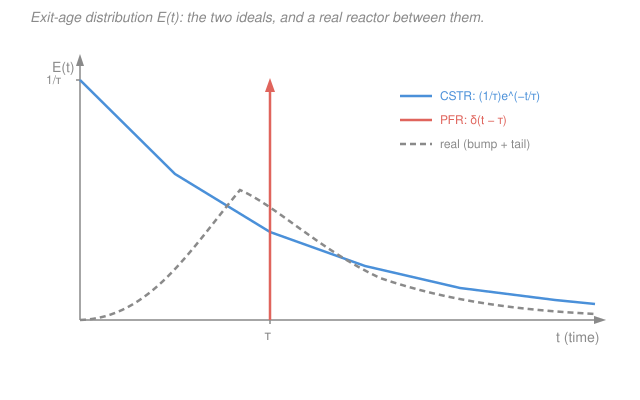

# Chemical Reaction Engineering · Lesson 4.5: Residence-time distribution

> ⏱ ~15 min · Module 4: Catalysis & Nonideal Reactors · Builds on: [1.5 The CSTR](01-05-cstr.md), [1.6 The PFR & packed-bed reactor](01-06-pfr-packed-bed.md), [2.1 Conversion & the design equations](02-01-conversion-design-equations.md) (space time $\tau=V/v_0$) · Unlocks: [4.6 Nonideal reactor models](04-06-nonideal-reactor-models.md)

## Why this matters

Every design equation so far assumed one of two fairy tales: a **PFR**, where every molecule marches through in lockstep and spends *exactly* $\tau$ inside, or a **CSTR**, where the contents are perfectly mixed the instant they enter. Real reactors are neither. Fluid channels through fast lanes, gets caught in stagnant corners, swirls in recirculation zones. Two reactors with the *same* volume and *same* flow can give wildly different conversions because their fluid spends its time differently. Before you can predict conversion in a real vessel ([4.6](04-06-nonideal-reactor-models.md)), you need to *measure* how long fluid actually stays. That measurement is the **residence-time distribution (RTD)** — and you get it without opening the reactor, just by watching a tracer come out.

## The idea

Dump a spoonful of dye into the feed all at once, then stand at the outlet with a stopwatch and a color meter. The dye that took a shortcut shows up early; the dye that got stuck in a dead corner dribbles out late. Plot dye concentration at the exit versus time and you've drawn a *histogram of exit ages* — the fraction of fluid that lived inside for 1 minute, for 2 minutes, for 10. That curve is the RTD. It doesn't tell you *where* each parcel went, only *how long* it stayed — but for predicting conversion, how long is most of what matters.

Two shapes anchor the extremes. A PFR gives a single infinitely-thin **spike**: everyone stays exactly $\tau$, no more, no less. A CSTR gives a **decaying exponential**: because the tank is perfectly mixed, some tracer is swept straight to the exit and leaves almost immediately, while some lingers for many multiples of $\tau$. Every real reactor lives *between* these two — and the *ways* it deviates (an early blip, a long tail) diagnose exactly what's wrong inside.

## The formal version

**Pulse experiment → the exit-age distribution $E(t)$.** Inject a small slug of tracer at $t=0$ and record the exit concentration $C(t)$ (mol/m³ or any convenient unit). Define

$$E(t)=\frac{C(t)}{\displaystyle\int_0^\infty C(t)\,dt}, \qquad \int_0^\infty E(t)\,dt = 1.$$

$E(t)$ has units of inverse time (1/s). *In words: $E(t)\,dt$ is the fraction of the fluid now leaving that has been inside for a time between $t$ and $t+dt$.* Dividing by the total area is just **normalization** — it turns "how much dye" into "what fraction," so the result doesn't depend on how big your spoonful was.

**Step experiment → the cumulative distribution $F(t)$.** Instead of a pulse, at $t=0$ switch the feed to a steady tracer concentration $C_0$ and watch the outlet climb from 0 to $C_0$. Then

$$F(t)=\frac{C(t)}{C_0}=\int_0^t E(t')\,dt', \qquad E(t)=\frac{dF}{dt}.$$

*In words: $F(t)$ is the fraction of exiting fluid younger than age $t$.* It rises monotonically from $F(0)=0$ to $F(\infty)=1$. Pulse and step are two windows on the same distribution — $E$ is the density, $F$ is its running integral.

**Moments — collapsing the curve to two numbers.** The **mean residence time** is the average age of the exit stream:

$$t_m=\int_0^\infty t\,E(t)\,dt.$$

For a **constant-density** stream (a liquid, or a gas with no mole change) this equals the space time you already know:

$$t_m=\tau=\frac{V}{v_0}.$$

*In words: on average, fluid stays exactly as long as the "one volume per flow" bookkeeping predicts* — provided all of $V$ is actually being used. The **variance** measures the spread about that mean:

$$\sigma^2=\int_0^\infty (t-t_m)^2\,E(t)\,dt.$$

*In words: $\sigma^2$ is how far the reactor is from plug flow* — zero means everyone stays the same time; large means widely mixed ages. These are literally the **mean and variance of a probability distribution**: $E(t)$ is a probability density, and a molecule's residence time is a random variable drawn from it.

**The two ideal RTDs.**

- **PFR** — every element takes exactly $\tau$, so all the tracer exits in one instant: $E(t)=\delta(t-\tau)$, a spike at $t=\tau$. Its spread is zero, $\sigma^2=0$.
- **CSTR** — after a pulse the well-mixed contents wash out as $C(t)=C_0e^{-t/\tau}$, giving

$$E(t)=\frac{1}{\tau}\,e^{-t/\tau}, \qquad t_m=\tau, \qquad \sigma^2=\tau^2.$$

*In words: the CSTR's RTD is the memoryless exponential* — the probability of leaving in the next instant is $1/\tau$ regardless of how long you've already been inside, so there's no "typical" age, just a constant escape chance. That's why some tracer bypasses to the exit at once and some lingers indefinitely.

Real reactors sit between $\sigma^2=0$ and $\sigma^2=\tau^2$, and their departures from the ideal shapes are diagnostic: an **early spike** in $E(t)$ means some feed is **bypassing** (channeling straight to the outlet); a **long tail** means some fluid is trapped in **dead volume** (stagnant zones it only slowly escapes).

## Picture

## Worked examples

### Example 1 — from a pulse tracer to $E(t)$, $t_m$, and $\sigma^2$

A pulse of tracer is injected into a liquid reactor ($V=30$ L, $v_0=10$ L/min, so $\tau=V/v_0=3.0$ min). The exit concentration $C$ (mg/L) is sampled every $\Delta t=1$ min:

| $t$ (min) | 0 | 1 | 2 | 3 | 4 | 5 | 6 |
|---|---|---|---|---|---|---|---|
| $C$ (mg/L) | 0 | 1 | 3 | 4 | 3 | 1 | 0 |

**Step 1 — normalize.** Integrate $C$ with the trapezoidal rule. The endpoints are zero, so the trapezoidal integral is simply $\Delta t$ times the column sum:

$$\int_0^\infty C\,dt \approx \Delta t\sum C = 1\times(0+1+3+4+3+1+0)=12\ \frac{\mathrm{mg\cdot min}}{\mathrm L}.$$

Then $E(t)=C(t)/12$ (units $\mathrm{min^{-1}}$). For instance $E(3)=4/12=0.33\ \mathrm{min^{-1}}$. Check normalization: $\Delta t\sum E = 12/12 = 1$ ✓.

**Step 2 — mean residence time.** $t_m=\int tE\,dt \approx \dfrac{\Delta t\sum tC}{\Delta t\sum C}=\dfrac{\sum tC}{\sum C}$. Build the $tC$ column: $0,\,1,\,6,\,12,\,12,\,5,\,0$, summing to $36$:

$$t_m=\frac{36}{12}=3.0\ \mathrm{min}.$$

This matches $\tau=3.0$ min — reassuring: the whole volume is being used, no gross dead zone or bypass.

**Step 3 — variance.** Build $(t-t_m)^2C$ with $t_m=3$: at $t=0,\dots,6$ the values are $9(0),4(1),1(3),0(4),1(3),4(1),9(0)=0,4,3,0,3,4,0$, summing to $14$:

$$\sigma^2=\frac{\sum (t-t_m)^2 C}{\sum C}=\frac{14}{12}=1.17\ \mathrm{min^2}.$$

**Sanity check.** A CSTR of the same $\tau$ would have $\sigma^2=\tau^2=9\ \mathrm{min^2}$; a PFR would have $0$. Our $1.17\ \mathrm{min^2}$ sits between them, much closer to plug flow — this vessel is a fairly tight, near-PFR reactor. Units: $\sigma^2$ in $\mathrm{min^2}$, $t_m$ in min ✓.

### Example 2 — diagnosing a sick reactor

A reactor is built for $V=80$ L at $v_0=10$ L/min, so the design space time is $\tau=V/v_0=8.0$ min. But a pulse test shows two red flags: the tracer curve has an **early spike near $t=0$**, and its mean comes out to only $t_m=6.0$ min. What's wrong, and how much volume is being wasted?

**Read the shape.** The early spike means a portion of the feed reaches the exit almost instantly — that's **bypassing (channeling)**: fluid shortcuts through a fast lane instead of mixing into the bulk.

**Read the mean.** $t_m<\tau$ tells you the flowing fluid only "sees" part of the vessel; the rest is stagnant **dead volume** that the tracer barely enters. The fraction of volume effectively in use is

$$\frac{t_m}{\tau}=\frac{6.0}{8.0}=0.75,$$

so the **dead (unused) fraction** is

$$1-\frac{t_m}{\tau}=0.25 \quad\Rightarrow\quad V_{\text{dead}}\approx 0.25\times 80 = 20\ \mathrm{L}.$$

**Interpretation.** Roughly 20 L of the reactor is doing no work, and some feed is short-circuiting on top of that — both push conversion *below* the ideal-reactor prediction, because reactant spends less time in contact than the design assumed. The fix is mechanical (baffles, a redistributor, better inlet design), and you'd re-run the tracer test to confirm $t_m$ climbs back toward $\tau$.

**Sanity check.** $t_m\le\tau$ always, since dead volume and bypass can only *lower* the measured mean — a mean *above* $\tau$ would signal a measurement or flow-rate error. Units: $t_m/\tau$ dimensionless, $V_{\text{dead}}$ in L ✓.

## Watch out

- **You might think** $t_m=\tau$ always, so measuring the RTD is pointless — **but actually** they coincide only when the whole volume participates and density is constant. A gap $t_m<\tau$ is *exactly* the useful signal: it quantifies dead volume. (And for a mole-changing gas reaction, $v$ varies through the vessel and even the ideal relation $t_m=\tau$ needs care — same caveat as [1.5](01-05-cstr.md).)
- **You might think** a small variance means "good" and large means "bad" — **but actually** the RTD is descriptive, not a grade. A CSTR is *supposed* to have $\sigma^2=\tau^2$; that huge spread is its design, not a defect. "Good" or "bad" only makes sense against the reactor you intended to build.
- **You might think** the RTD alone fixes conversion — **but actually** it doesn't, except at the two extremes. Two reactors can share an identical $E(t)$ yet give different conversions, because $E(t)$ says *how long* molecules stay but not *whether they mix* with young or old neighbors while inside. That "micromixing" gap (segregation vs. maximum mixedness) is [4.6](04-06-nonideal-reactor-models.md)'s problem.

## One-liner

> The RTD is the histogram of exit ages you read straight off a tracer: $E(t)=C(t)/\!\int C\,dt$ with mean $t_m=\tau$ and spread $\sigma^2$ pinned between $0$ (PFR) and $\tau^2$ (CSTR) — early spikes flag bypass, long tails flag dead volume.

## Problems

**P1 (🟢)** A step tracer test on a liquid reactor gives the outlet ratio $F(t)=C(t)/C_0$:

| $t$ (min) | 0 | 2 | 4 | 6 | 8 |
|---|---|---|---|---|---|
| $F$ | 0 | 0.3 | 0.6 | 0.9 | 1.0 |

(a) What fraction of the exiting fluid is younger than 4 min? (b) What fraction has an age between 4 and 6 min? (c) Sketch how you'd get $E(t)$ from this table (no numbers needed — just the operation).

**P2 (🟡)** For an ideal CSTR with $\tau=5$ min, use $E(t)=\frac{1}{\tau}e^{-t/\tau}$ to find the fraction of fluid that stays *longer* than one space time (i.e., $t>\tau$). Then find the fraction that leaves in under $\tau/2$.

**P3 (🔴)** A reactor is designed for $\tau=10$ min ($V=100$ L, $v_0=10$ L/min). A pulse test yields $t_m=10$ min (so no dead volume) but a variance $\sigma^2=30\ \mathrm{min^2}$. Is this reactor closer to a PFR or a CSTR? Quantify your answer by comparing $\sigma^2$ to the two ideal limits, and comment on what a downstream model ([4.6](04-06-nonideal-reactor-models.md)) would need to capture.

Solutions

**P1** (a) $F(4)=0.6$ directly: **60%** of the exit stream is younger than 4 min — that's the definition of $F$. (b) The fraction with age in $[4,6]$ is $F(6)-F(4)=0.9-0.6=\mathbf{0.30}$ (30%), since $F$ is cumulative. (c) $E(t)=dF/dt$: differentiate the $F$ curve — numerically, the slope between successive points. E.g. between 2 and 4 min, $E\approx (0.6-0.3)/2=0.15\ \mathrm{min^{-1}}$. *Check:* the slopes here are $0.15,0.15,0.15,0.05$ — mostly flat then tapering, and $\int E\,dt = F(\infty)-F(0)=1$ ✓.

**P2** Fraction with $t>\tau$: 

$$\int_\tau^\infty \frac{1}{\tau}e^{-t/\tau}\,dt = \left[-e^{-t/\tau}\right]_\tau^\infty = e^{-1}\approx 0.368.$$

So **≈37%** of the fluid stays longer than one space time — a lot, and a hallmark of how much a CSTR spreads ages. Fraction leaving in under $\tau/2$:

$$\int_0^{\tau/2}\frac{1}{\tau}e^{-t/\tau}\,dt = \left[-e^{-t/\tau}\right]_0^{\tau/2}=1-e^{-1/2}=1-0.607=0.393.$$

So **≈39%** exits before half a space time. *Check:* both are independent of the numeric value of $\tau=5$ min (they depend only on $t/\tau$), and $0.393<0.5<1-0.368=0.632$, consistent with the exponential front-loading early exits. ✓

**P3** Compare to the ideal limits: PFR has $\sigma^2=0$; CSTR has $\sigma^2=\tau^2=10^2=100\ \mathrm{min^2}$. The measured $\sigma^2=30\ \mathrm{min^2}$ is $30/100=0.30$ of the way from PFR to CSTR — so it's **closer to a PFR** (about a third of the maximal spread), a moderately dispersed near-plug-flow vessel. Because $t_m=\tau$, there's no dead volume or bypass to model; the only nonideality is *axial spreading* of residence times. A downstream model would capture it with a single dispersion-like parameter — e.g. tanks-in-series $N=\tau^2/\sigma^2=100/30\approx 3.3$ tanks (more than 1, confirming it beats a single CSTR but falls short of plug flow). *Check:* $0<30<100$ places it validly between the ideals, and $N>1$ is consistent with "near-PFR." ✓

## Flashback

**From Lesson 3.2 (Adiabatic operation):** A liquid-phase exothermic reaction runs adiabatically with feed temperature $T_0=310$ K, $\Delta H_{rx}=-60{,}000$ J/mol, and $\sum\Theta_i C_{p,i}=250$ J/(mol·K). Find the adiabatic temperature rise $\Delta T_{ad}$ (the rise at complete conversion) and the reactor temperature at $X=0.5$.

Solution

The adiabatic energy balance gives $T=T_0+\dfrac{(-\Delta H_{rx})X}{\sum\Theta_i C_{p,i}}$, so the full-conversion rise is

$$\Delta T_{ad}=\frac{-\Delta H_{rx}}{\sum\Theta_i C_{p,i}}=\frac{60{,}000}{250}=240\ \mathrm{K}.$$

At $X=0.5$:

$$T=310 + 240\times 0.5 = 310 + 120 = 430\ \mathrm{K}.$$

*Check:* $\Delta H_{rx}<0$ (exothermic) gives a positive rise, as it must; units $\dfrac{\mathrm{J/mol}}{\mathrm{J/(mol\cdot K)}}=\mathrm K$ ✓. At $X=1$ the temperature would reach $310+240=550$ K — the ceiling an adiabatic run climbs to. ✓

## Connections

- **Backward:** the two anchor curves are the [1.5 CSTR](01-05-cstr.md) and [1.6 PFR](01-06-pfr-packed-bed.md) seen from a new angle — instead of assuming perfect mixing or perfect plug flow, you now *measure* how close a real vessel comes. The mean $t_m=\tau=V/v_0$ is the very space time from [2.1](02-01-conversion-design-equations.md), and $t_m<\tau$ is the same "is all the volume working?" caveat flagged back in [1.5](01-05-cstr.md).
- **Forward:** [4.6 Nonideal reactor models](04-06-nonideal-reactor-models.md) turns $\sigma^2$ into a *prediction*: the tanks-in-series model reads off $N=\tau^2/\sigma^2$, and the dispersion model reads off a Péclet number — both let you compute conversion in the real reactor the RTD just characterized.
- **Sideways (probability):** $E(t)$ *is* a probability density function, $F(t)$ its cumulative distribution, and $t_m,\sigma^2$ its mean and variance — the identical objects from probability theory. The CSTR's exponential RTD is the **memoryless exponential distribution**: constant escape rate $1/\tau$, no aging — the same law that governs radioactive decay and Poisson waiting times.
