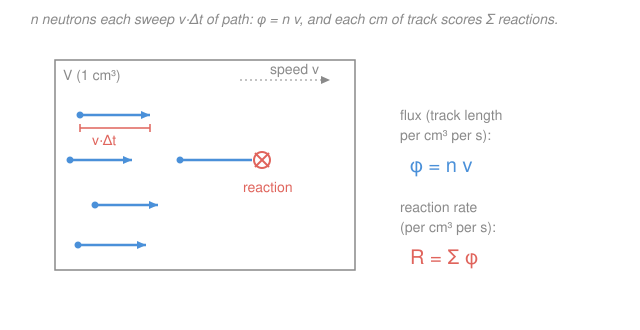

# Reactor Physics & Neutron Transport · Lesson 1.2: Cross sections, flux & reaction rates

> ⏱ ~15 min · Module 1: Transport & the diffusion approximation · Builds on: [1.1 Neutron balance & the transport equation](01-01-neutron-balance-transport-equation.md), [`intro-nuclear-engineering`](../../intro-nuclear-engineering/syllabus.md) · Unlocks: [1.3 The diffusion approximation & Fick's law](01-03-diffusion-approximation-ficks-law.md)

## Why this matters

Every term in [1.1](01-01-neutron-balance-transport-equation.md)'s transport equation was a *reaction rate* — neutrons colliding, absorbing, fissioning, scattering into a new direction. To make the equation predict anything, you need the one number that converts "here is a population of neutrons and a chunk of matter" into "here is how fast they react." That number is the **macroscopic cross section** $\Sigma$, and the rate it produces, $R = \Sigma\phi$, is the single most-used formula in the whole course: fission power is $\Sigma_f \phi$, absorption is $\Sigma_a\phi$, the burnup of fuel and the buildup of xenon are both just $\Sigma\phi$ integrated over time. Get this lesson solid and the rest is bookkeeping on top of it.

## The idea

A single nucleus is a tiny target. Fire neutrons at it and the **microscopic cross section** $\sigma$ is the effective area it presents — literally "how big is the bullseye," measured in **barns** ($1\ \text{barn} = 10^{-24}\ \text{cm}^2$, a joke name because to a nuclear physicist a barn is enormous). A bigger $\sigma$ means a fatter target and more reactions. But you never have one nucleus; you have a slab full of them. Pack $N$ targets into every cubic centimeter and the total target area they present *per centimeter of neutron travel* is $\Sigma = N\sigma$ — the **macroscopic cross section**, units of $\text{cm}^{-1}$. Read it as "reactions per centimeter of path": a neutron pushing through the material trips a reaction, on average, once every $1/\Sigma$ centimeters. That distance is the **mean free path** $\lambda = 1/\Sigma$.

Now the neutrons. Picture a swarm of density $n$ (neutrons per cm³) all moving at speed $v$. In a time $\Delta t$ each one draws a track of length $v\,\Delta t$. Add up all those tracks in one cm³ and you get the **flux** $\phi = n v$ — the total *track length swept per cm³ per second*. This is the honest meaning of flux: not a flow through a surface (that's current, next lesson), but the sheer amount of neutron path being laid down inside the material. And here is the punchline: if the material scores a reaction every $\Sigma$ per cm of track, then the reaction rate is just cross section times track length,

$$R = \Sigma\phi.$$

Cross section is targets per cm; flux is cm of track per second; multiply and reactions per second fall out.

## The formal version

**Number density.** For a pure material of mass density $\rho$ (g/cm³) and atomic (or molar) mass $M$ (g/mol),

$$N = \frac{\rho\,N_A}{M}, \qquad N_A = 6.022\times10^{23}\ \text{mol}^{-1}.$$

*In words: nuclei per cm³ equals grams per cm³ times atoms per gram.* For a mixture, do this per nuclide to get each $N_i$.

**Macroscopic cross section and its additivity.** For reaction type $x$ (absorption $a$, scattering $s$, fission $f$, radiative capture $\gamma$, total $t$),

$$\Sigma_x = N\sigma_x \quad(\text{one nuclide}), \qquad \Sigma_x = \sum_i N_i\,\sigma_{x,i} \quad(\text{a mixture}).$$

*In words: cross sections add — over the different nuclides present, and over the different things a neutron can do.* Two identities you will use constantly:

$$\Sigma_t = \Sigma_a + \Sigma_s, \qquad \Sigma_a = \Sigma_f + \Sigma_\gamma.$$

Total collision = absorption + scattering; absorption = fission + capture-without-fission. (Additivity works because probabilities of independent target-encounters add.)

**Mean free path.**

$$\lambda_x = \frac{1}{\Sigma_x}.$$

*In words: the average straight-line distance a neutron travels before a reaction of type $x$ happens* — small $\Sigma$, long mean free path.

**Scalar flux and the reaction rate.** Recall from [1.1](01-01-neutron-balance-transport-equation.md) the angular flux $\psi(\mathbf r,\hat\Omega,E,t)$. The **scalar flux** collapses direction by integrating over the unit sphere of directions:

$$\phi = \int_{4\pi}\psi\,d\Omega = n\,v.$$

*In words: sum the neutron traffic over all directions and you get the total track length laid down per volume per time.* Then the **reaction-rate density** for any reaction type is

$$\boxed{\,R_x = \Sigma_x\,\phi\,} \qquad \left[\frac{\text{cm}^2}{\text{cm}^3}\cdot\frac{1}{\text{cm}^2\,\text{s}} = \frac{1}{\text{cm}^3\,\text{s}}\right].$$

*In words: reactions per cm³ per second equals target density (per cm of path) times track length (cm of path per cm³ per second)* — the units cancel to "reactions per cm³ per second" exactly.

**The one-speed (one-group) reduction.** Real $\sigma_x(E)$ varies wildly with neutron energy $E$, and the flux $\phi(E)$ has a whole spectrum. The reaction rate is really $\int \Sigma_x(E)\,\phi(E)\,dE$. The **one-group** trick keeps the total rate but hides the energy: define a flux-weighted average cross section

$$\bar\Sigma_x = \frac{\int \Sigma_x(E)\,\phi(E)\,dE}{\int \phi(E)\,dE}, \qquad \phi = \int\phi(E)\,dE,$$

so that $\bar\Sigma_x\,\phi$ reproduces the true rate. *In words: replace the energy-dependent problem with a single effective speed and constants averaged over the spectrum the neutrons actually have.* This is why a whole reactor can be modeled with a handful of numbers — and it's exactly the approximation the diffusion machinery ahead will lean on.

## Picture

## Worked examples

**Example 1 (mechanical — from data to a reaction rate).** Aluminum cladding: $\rho = 2.70\ \text{g/cm}^3$, $M = 27.0\ \text{g/mol}$, thermal absorption cross section $\sigma_a = 0.23\ \text{barn}$. Sitting in a flux $\phi = 1\times10^{13}\ \text{cm}^{-2}\text{s}^{-1}$, how fast is it absorbing neutrons?

First the number density:

$$N = \frac{\rho N_A}{M} = \frac{2.70\times 6.022\times10^{23}}{27.0} = 6.02\times10^{22}\ \text{cm}^{-3}.$$

Now the macroscopic cross section — **carry the barn conversion** ($0.23\ \text{barn} = 0.23\times10^{-24}\ \text{cm}^2$):

$$\Sigma_a = N\sigma_a = (6.02\times10^{22})(0.23\times10^{-24}\ \text{cm}^2) = 1.39\times10^{-2}\ \text{cm}^{-1}.$$

So a neutron travels a mean free path $\lambda_a = 1/\Sigma_a \approx 72\ \text{cm}$ before aluminum absorbs it — aluminum is nearly transparent, as cladding should be. Finally the rate:

$$R_a = \Sigma_a\phi = (1.39\times10^{-2})(1\times10^{13}) = 1.39\times10^{11}\ \text{absorptions cm}^{-3}\text{s}^{-1}.$$

Every step was units-bookkeeping; the only trap is forgetting the $10^{-24}$.

**Example 2 (one-speed additivity — the fuel-utilization preview).** A homogeneous thermal mixture of $^{235}$U fuel and a moderator. Fuel: $N_5 = 1.0\times10^{21}\ \text{cm}^{-3}$, $\sigma_f = 585\ \text{barn}$, capture $\sigma_\gamma = 100\ \text{barn}$. Moderator: $N_M = 4.0\times10^{22}\ \text{cm}^{-3}$, $\sigma_{a,M} = 0.66\ \text{barn}$ (it only absorbs). Of all the neutrons this mixture absorbs, what fraction cause fission?

Build each macroscopic cross section (barns → $10^{-24}\ \text{cm}^2$ throughout):

$$\Sigma_f = N_5\sigma_f = (1.0\times10^{21})(585\times10^{-24}) = 0.585\ \text{cm}^{-1},$$
$$\Sigma_a^{\text{fuel}} = N_5(\sigma_f+\sigma_\gamma) = (1.0\times10^{21})(685\times10^{-24}) = 0.685\ \text{cm}^{-1},$$
$$\Sigma_a^{\text{mod}} = N_M\sigma_{a,M} = (4.0\times10^{22})(0.66\times10^{-24}) = 0.0264\ \text{cm}^{-1}.$$

Absorption is additive over the two nuclides:

$$\Sigma_a = \Sigma_a^{\text{fuel}} + \Sigma_a^{\text{mod}} = 0.685 + 0.0264 = 0.711\ \text{cm}^{-1}.$$

The fission fraction of *all* absorptions is a ratio of rates, and since every reaction sees the same $\phi$, the $\phi$ cancels — it's just a ratio of cross sections:

$$\frac{R_f}{R_a} = \frac{\Sigma_f\phi}{\Sigma_a\phi} = \frac{\Sigma_f}{\Sigma_a} = \frac{0.585}{0.711} = 0.82.$$

Worth unpacking, because it previews two four-factor ideas from [2.1](02-01-k-infinity-four-factor-formula.md). It factors cleanly:

$$\frac{\Sigma_f}{\Sigma_a} = \underbrace{\frac{\Sigma_a^{\text{fuel}}}{\Sigma_a}}_{f\,=\,0.963}\times\underbrace{\frac{\sigma_f}{\sigma_f+\sigma_\gamma}}_{0.854} = 0.963\times0.854 = 0.82.$$

The first factor — the share of absorptions that land in fuel rather than moderator — is the **thermal utilization** $f$. The second — the share of *fuel* absorptions that actually fission instead of just capturing — is set by the fuel nuclide alone. Multiply: 82% of every neutron absorbed in this mixture splits an atom. That single ratio is the seed of reactor multiplication.

## Watch out

- **You might think flux is neutrons flowing through a surface.** It isn't — that's the *current* $\mathbf J$ (Lesson 1.3). Scalar flux $\phi = nv$ is a *scalar*: total track length per volume per time, direction thrown away. A perfectly isotropic swarm has zero net current but a large flux, and it's the flux that drives reactions.
- **You might reach for $\Sigma = N\sigma$ with $\sigma$ still in barns.** $\Sigma$ comes out in $\text{cm}^{-1}$ only if $\sigma$ is in $\text{cm}^2$; keep the $10^{-24}$ glued to every barn until the very end, or your rate is off by 24 orders of magnitude.
- **You might treat $\Sigma_a$ as fundamental.** It's built: absorption is fission plus non-fission capture ($\Sigma_a = \Sigma_f + \Sigma_\gamma$), and every $\Sigma$ sums over all nuclides present. Change the composition or the density and every macroscopic cross section moves — the microscopic $\sigma$'s are the fixed nuclear data.

## One-liner

> Cross section is targets per centimeter of path and flux is centimeters of path per second — multiply them, $R=\Sigma\phi$, and you have every reaction rate in the reactor.

## Problems

**P1 (🟢)** Liquid sodium coolant: $\rho = 0.97\ \text{g/cm}^3$, $M = 23\ \text{g/mol}$, $\sigma_a = 0.53\ \text{barn}$. Find (a) the number density $N$, (b) the macroscopic absorption cross section $\Sigma_a$ and the absorption mean free path $\lambda_a$, and (c) the absorption-rate density in a flux $\phi = 2\times10^{14}\ \text{cm}^{-2}\text{s}^{-1}$.

**P2 (🟡)** For thermal neutrons in $^{239}$Pu, $\sigma_f = 748\ \text{barn}$ and non-fission capture $\sigma_\gamma = 271\ \text{barn}$. (a) What fraction of absorptions cause fission, and what is the capture-to-fission ratio $\alpha = \sigma_\gamma/\sigma_f$? (b) With $\nu = 2.9$ neutrons released per fission, compute the reproduction factor $\eta = \nu\,\sigma_f/\sigma_a$ — the neutrons produced per neutron absorbed in the fuel. (No number densities needed — see why.)

**P3 (🔴, optional — the one-group collapse)** A two-region energy spectrum: a fast group with flux $\phi_1 = 3\times10^{13}$ and $\Sigma_{a1} = 0.002\ \text{cm}^{-1}$, and a thermal group with $\phi_2 = 1\times10^{13}$ and $\Sigma_{a2} = 0.02\ \text{cm}^{-1}$ (fluxes in $\text{cm}^{-2}\text{s}^{-1}$). (a) Find the total absorption rate. (b) Find the single flux-weighted one-group cross section $\bar\Sigma_a$ that reproduces that rate from the total flux $\phi_1+\phi_2$, and (c) confirm $\bar\Sigma_a(\phi_1+\phi_2)$ gives back the rate from (a).

Solutions

**P1** (a) Number density:

$$N = \frac{\rho N_A}{M} = \frac{0.97\times 6.022\times10^{23}}{23} = 2.54\times10^{22}\ \text{cm}^{-3}.$$

(b) Convert the barn ($0.53\times10^{-24}\ \text{cm}^2$):

$$\Sigma_a = N\sigma_a = (2.54\times10^{22})(0.53\times10^{-24}) = 1.35\times10^{-2}\ \text{cm}^{-1},$$
$$\lambda_a = \frac{1}{\Sigma_a} = \frac{1}{1.35\times10^{-2}} \approx 74\ \text{cm}.$$

(c) Reaction-rate density:

$$R_a = \Sigma_a\phi = (1.35\times10^{-2})(2\times10^{14}) = 2.7\times10^{12}\ \text{absorptions cm}^{-3}\text{s}^{-1}.$$

*Check.* A 74 cm mean free path says sodium barely absorbs — correct, that's why it's a coolant, not a poison. Units of $R_a$: $\text{cm}^{-1}\cdot\text{cm}^{-2}\text{s}^{-1} = \text{cm}^{-3}\text{s}^{-1}$ ✓.

**P2** (a) Total absorption cross section is fission plus capture:

$$\sigma_a = \sigma_f + \sigma_\gamma = 748 + 271 = 1019\ \text{barn}.$$
$$\frac{\sigma_f}{\sigma_a} = \frac{748}{1019} = 0.734, \qquad \alpha = \frac{\sigma_\gamma}{\sigma_f} = \frac{271}{748} = 0.362.$$

So 73.4% of absorptions in $^{239}$Pu fission; the rest are wasted captures. (b) Reproduction factor:

$$\eta = \nu\,\frac{\sigma_f}{\sigma_a} = 2.9\times\frac{748}{1019} = 2.9\times0.734 = 2.13.$$

No number density is needed because both quantities are *ratios* of reaction rates for the **same nuclide** — every rate carries the same $N\phi$, which cancels ($\eta = \nu\Sigma_f/\Sigma_a = \nu N\sigma_f/(N\sigma_a)$).

*Check.* $\eta = 2.13$ neutrons produced per neutron absorbed in fuel comfortably exceeds 1 — a chain reaction is possible before you even account for losses, which is what the four-factor formula in [2.1](02-01-k-infinity-four-factor-formula.md) does next.

**P3** (a) Reaction rates add over the two groups:

$$R = \Sigma_{a1}\phi_1 + \Sigma_{a2}\phi_2 = (0.002)(3\times10^{13}) + (0.02)(1\times10^{13}) = 6\times10^{10} + 2\times10^{11} = 2.6\times10^{11}\ \text{cm}^{-3}\text{s}^{-1}.$$

(b) Flux-weighted average over the total flux $\phi = \phi_1+\phi_2 = 4\times10^{13}$:

$$\bar\Sigma_a = \frac{\Sigma_{a1}\phi_1 + \Sigma_{a2}\phi_2}{\phi_1+\phi_2} = \frac{2.6\times10^{11}}{4\times10^{13}} = 6.5\times10^{-3}\ \text{cm}^{-1}.$$

(c) Reconstruct the rate:

$$\bar\Sigma_a(\phi_1+\phi_2) = (6.5\times10^{-3})(4\times10^{13}) = 2.6\times10^{11}\ \text{cm}^{-3}\text{s}^{-1}.\ \checkmark$$

*Check.* The one-group cross section lands between the two group values ($0.002 < 6.5\times10^{-3} < 0.02$) and pulls toward the fast group because that group carries three-quarters of the flux. This is the one-speed reduction in miniature: **collapse the spectrum, preserve the reaction rate** — the group constants are *defined* to make $\bar\Sigma\phi$ exact.

## Connections

- **Backward:** this puts numbers on [1.1](01-01-neutron-balance-transport-equation.md)'s abstract loss and source terms — the collision term $\Sigma_t\psi$, the fission source $\nu\Sigma_f\phi$, and every scattering integrand were reaction rates $\Sigma\phi$ waiting for the $\Sigma$ and $\phi$ this lesson supplies. It also sharpens the cross-section material from [`intro-nuclear-engineering`](../../intro-nuclear-engineering/syllabus.md) into the macroscopic, one-group form the reactor needs.
- **Forward:** [1.3](01-03-diffusion-approximation-ficks-law.md) keeps $R = \Sigma_a\phi$ as the loss term and adds *leakage*, turning the balance into the diffusion equation $D\nabla^2\phi - \Sigma_a\phi + S = 0$; the one-group constants defined here are precisely what that equation runs on. The fission-fraction split in Example 2 becomes the thermal utilization $f$ in the four-factor formula ([2.1](02-01-k-infinity-four-factor-formula.md)).
- **Sideways (statistical mechanics):** the flux-weighted average $\bar\Sigma$ is an average of $\sigma(E)$ over the neutron *speed distribution* — and for a thermalized reactor that spectrum is essentially a Maxwell-Boltzmann distribution, the same one stat-mech builds for a gas. The canonical "thermal neutron" speed $v = 2200\ \text{m/s}$ is just the most-probable speed of that distribution at room temperature.
