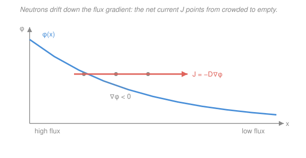

# Reactor Physics & Neutron Transport · Lesson 1.3: The diffusion approximation & Fick's law

> ⏱ ~15 min · Module 1: Transport & the diffusion approximation · Builds on: [1.1 Neutron balance & the transport equation](01-01-neutron-balance-transport-equation.md), [1.2 Cross sections, flux & reaction rates](01-02-cross-sections-flux-reaction-rates.md) · Unlocks: [1.4 The one-group diffusion equation & boundary conditions](01-04-one-group-diffusion-boundary-conditions.md)

## Why this matters

The transport equation from [1.1](01-01-neutron-balance-transport-equation.md) is exact and almost unsolvable by hand — it tracks neutrons in seven dimensions ($\mathbf r$, $\hat\Omega$, $E$, $t$). Every design number you actually compute — critical size, flux shape, leakage — comes instead from **diffusion theory**, a one-line law that says neutrons flow downhill in concentration just like heat, dye, or perfume. This lesson earns that simplification honestly: it shows the single assumption behind it, hands you the diffusion coefficient $D$, and — just as important — marks the four places where the assumption breaks and you must not trust the answer.

## The idea

Picture a room where one corner is packed with people and another is empty. Nobody is *told* to move toward the empty corner, but because everyone mills about randomly, more people happen to wander out of the crowded corner than into it. The result is a net drift from crowded to empty — pure statistics, no guiding force. Neutrons do exactly this: they scatter off nuclei in random directions, and wherever the flux (neutron crowd) is denser, more of them random-walk *out* than *in*. **The net current runs down the flux gradient.**

That is Fick's law, and it's the same sentence physics uses three times: heat flows from hot to cold, a dye spreads from concentrated to dilute, neutrons drift from high flux to low. The only new ingredient is *how easily* they drift — captured by one number, the diffusion coefficient $D$. Big $D$ means long, straight hops between collisions (neutrons spread fast); small $D$ means a tight, hobbled random walk.

The catch: this whole picture assumes neutrons are heading in *almost every direction equally* — nearly isotropic, with just a gentle lean toward the empty side. That's true deep inside a big, mildly-absorbing lump of material. It is a lie next to a source, at a surface, in a void, or inside a strong absorber — anywhere neutrons stream one way. Knowing *where the lie lives* is half of what this lesson buys you.

## The formal version

Start from the angular flux $\psi(\mathbf r,\hat\Omega)$ of [1.1](01-01-neutron-balance-transport-equation.md) — neutrons at $\mathbf r$ heading in direction $\hat\Omega$. The **$P_1$ (diffusion) approximation** keeps only the first two terms of its expansion in direction:

$$\psi(\mathbf r,\hat\Omega) \approx \frac{1}{4\pi}\Big[\phi(\mathbf r) + 3\,\mathbf J(\mathbf r)\cdot\hat\Omega\Big].$$

*In words: the angular flux is a big isotropic part (the scalar flux $\phi$, same in all directions) plus a small term that leans linearly toward one direction (the net current $\mathbf J$).* The two moments are exactly the quantities from [1.2](01-02-cross-sections-flux-reaction-rates.md): $\phi=\int\psi\,d\Omega$ (how many neutrons, ignoring direction) and $\mathbf J=\int\hat\Omega\,\psi\,d\Omega$ (which way they net flow). Assuming the lean is *small* — that $3\mathbf J\cdot\hat\Omega$ never rivals $\phi$ — is the entire approximation.

Push this ansatz through the transport equation (integrate the streaming term over $\hat\Omega$, drop the time derivative of $\mathbf J$ as negligible) and out drops **Fick's law**:

$$\boxed{\;\mathbf J = -D\,\nabla\phi\;}, \qquad D = \frac{1}{3\,\Sigma_{tr}}.$$

*In words: the net current points opposite the flux gradient — from high flux to low — and its size is set by $D$.* The steeper the flux drops off, the harder neutrons drift down it. The minus sign is the whole physics: flow is *against* the slope.

The stiffness that resists the flow is the **transport cross section** $\Sigma_{tr}$:

$$\Sigma_{tr} = \Sigma_t - \bar\mu_0\,\Sigma_s = \Sigma_a + \Sigma_s\,(1-\bar\mu_0), \qquad \bar\mu_0 = \frac{2}{3A}.$$

*In words: it's the total cross section $\Sigma_t=\Sigma_a+\Sigma_s$, but with scattering discounted by how forward-peaked it is.* Here $\bar\mu_0$ is the **average cosine of the scattering angle** — how much a neutron keeps going forward after a collision — and $A$ is the target's mass number. Light nuclei (small $A$) get hit hard and scatter every which way, but a neutron glancing off a *heavy* nucleus barely changes course. A forward scatter (large $\bar\mu_0$) hardly interrupts the walk, so it counts less toward stopping it — hence the discount $(1-\bar\mu_0)$. The transport mean free path is $\lambda_{tr}=1/\Sigma_{tr}$, and $D=\lambda_{tr}/3$: the diffusion coefficient is just one-third of the effective step length.

**The analogy, made explicit.** Fick's law for neutrons is one member of a family — the same equation with relabeled letters:

| Process | Flux law | Driving gradient | "Conductivity" |
|---|---|---|---|
| Heat (Fourier) | $\mathbf q = -k\,\nabla T$ | temperature $T$ | thermal $k$ |
| Mass (Fick) | $\mathbf J = -D_m\,\nabla c$ | concentration $c$ | diffusivity $D_m$ |
| Neutrons | $\mathbf J = -D\,\nabla\phi$ | scalar flux $\phi$ | neutron $D=1/3\Sigma_{tr}$ |

*In words: neutron diffusion is Fourier heat conduction with flux playing the role of temperature.* If you can solve a steady-state heat problem, you can solve a reactor — which is exactly what [1.4](01-04-one-group-diffusion-boundary-conditions.md) does.

## Picture

## Worked examples

**Example 1 (get $D$ from nuclear data).** A graphite moderator has $\Sigma_s = 0.30\ \text{cm}^{-1}$, $\Sigma_a = 0.010\ \text{cm}^{-1}$, and scatters off carbon, $A=12$. Find $D$.

First the forward-scatter cosine:

$$\bar\mu_0 = \frac{2}{3A} = \frac{2}{36} = 0.0556.$$

Carbon is fairly light, so scattering is nearly isotropic — the discount is small. Now the transport cross section:

$$\Sigma_{tr} = \Sigma_a + \Sigma_s(1-\bar\mu_0) = 0.010 + 0.30(1-0.0556) = 0.010 + 0.2833 = 0.2933\ \text{cm}^{-1}.$$

$$D = \frac{1}{3\Sigma_{tr}} = \frac{1}{3(0.2933)} = 1.14\ \text{cm}.$$

So neutrons in this graphite random-walk with an effective step of $\lambda_{tr}=1/\Sigma_{tr}=3.41$ cm, and $D=\lambda_{tr}/3=1.14$ cm. *Check:* $\Sigma_a\ll\Sigma_s$, so $\Sigma_{tr}\approx\Sigma_s$ and $D\approx1/3\Sigma_s$ — a good moderator is nearly a pure scatterer, as it should be.

**Example 2 (apply Fick's law — current and leakage).** In a bare slab reactor the thermal flux takes the fundamental cosine shape

$$\phi(x) = \phi_0\cos\!\left(\frac{\pi x}{\tilde a}\right), \qquad -\frac{\tilde a}{2}\le x\le \frac{\tilde a}{2},$$

with $\phi_0 = 10^{13}\ \text{n/cm}^2\text{s}$, width $\tilde a = 100$ cm, and the graphite $D=1.14$ cm from Example 1. Find the current $J(x)$ and the leakage out the face.

Differentiate and apply Fick's law (one dimension, so $\nabla\phi=d\phi/dx$):

$$J(x) = -D\frac{d\phi}{dx} = -D\,\phi_0\left(-\frac{\pi}{\tilde a}\right)\sin\!\left(\frac{\pi x}{\tilde a}\right) = D\,\phi_0\,\frac{\pi}{\tilde a}\sin\!\left(\frac{\pi x}{\tilde a}\right).$$

At the centre ($x=0$) the flux is flat, $\sin 0=0$, so $J=0$ — no net flow, by symmetry. At the face ($x=\tilde a/2$), $\sin(\pi/2)=1$:

$$J_{\text{surface}} = D\,\phi_0\,\frac{\pi}{\tilde a} = (1.14)(10^{13})\frac{\pi}{100} = 3.6\times10^{11}\ \text{n/cm}^2\text{s},$$

positive, i.e. pointing *outward* — every square centimetre of the slab face leaks $3.6\times10^{11}$ neutrons per second into the surroundings. That number is what a reactor must make up with fission to stay critical (Module 2).

**Where the answer is untrustworthy:** right at that face. A vacuum boundary lets neutrons stream *out* and none come back, so near the surface the angular flux is strongly forward-peaked — the "small lean" assumption fails within a couple of mean free paths of the edge. Fick's law overestimates the surface flux; the fix is the *extrapolated boundary* of [1.4](01-04-one-group-diffusion-boundary-conditions.md), which pretends the flux reaches zero slightly *outside* the real edge.

## Watch out

- **You might think the current $\mathbf J$ tells you which way any given neutron moves.** It doesn't — most neutrons are milling about nearly isotropically. $\mathbf J$ is only the tiny *imbalance* left after all that random motion cancels, the small $3\mathbf J\cdot\hat\Omega$ lean on top of the big isotropic $\phi$. When that lean is *not* small, diffusion theory itself is wrong.
- **You might use $\Sigma_t$ where you need $\Sigma_{tr}$.** For a heavy scatterer the two differ little, but for hydrogen ($A=1$, $\bar\mu_0=2/3$) forward scattering nearly triples $D$ — see Problem 3. Always transport-correct; $D=1/3\Sigma_t$ is only right for isotropic scattering ($\bar\mu_0=0$).
- **You might trust diffusion theory everywhere.** It fails wherever neutrons stream instead of diffuse: **near a source** (fresh neutrons are directional), **near a boundary or material interface** (flux gradients are steep, symmetry is broken), **in a void** ($\Sigma_{tr}\to0$ so $D\to\infty$ — neutrons free-stream, no diffusion), and **inside a strong absorber** ($\Sigma_a\gtrsim\Sigma_s$, so neutrons headed inward get eaten before they can scatter back out and isotropize). All four break near-isotropy. Deep inside a big weak absorber, diffusion is excellent.

## One-liner

> Assume the angular flux is nearly isotropic with a gentle lean, and transport collapses to Fick's law $\mathbf J=-D\nabla\phi$ with $D=1/3\Sigma_{tr}$ — neutrons flow downhill in flux, exactly like heat downhill in temperature, until a source, edge, void, or strong absorber makes them stream instead.

## Problems

**P1 (🟢)** A beryllium reflector has $\Sigma_s=0.50\ \text{cm}^{-1}$, $\Sigma_a=0.020\ \text{cm}^{-1}$, and $A=9$. Compute $\bar\mu_0$, the transport cross section $\Sigma_{tr}$, the diffusion coefficient $D$, and the transport mean free path $\lambda_{tr}$.

**P2 (🟡)** In a graphite block with $D=0.9$ cm, a detector reads a thermal flux $\phi=5.0\times10^{12}\ \text{n/cm}^2\text{s}$ at $x=0$ and $4.2\times10^{12}$ at $x=10$ cm, roughly linear between. (a) Estimate the net current $J$, including its direction. (b) A black control rod (a near-total absorber) sits at $x=12$ cm. Would you trust Fick's law for the flux in the last centimetre before the rod? Why?

**P3 (🔴, optional)** For a hydrogenous material ($A=1$, so $\bar\mu_0=2/3$) with $\Sigma_s=1.5\ \text{cm}^{-1}$ and $\Sigma_a=0.02\ \text{cm}^{-1}$, compute $D$ correctly and compare it to the naive $D_{\text{naive}}=1/(3\Sigma_t)$ that ignores the transport correction. By what factor do they differ, and physically why is hydrogen the extreme case?

Solutions

**P1** Forward-scatter cosine:

$$\bar\mu_0 = \frac{2}{3A} = \frac{2}{27} = 0.0741.$$

Transport cross section:

$$\Sigma_{tr} = \Sigma_a + \Sigma_s(1-\bar\mu_0) = 0.020 + 0.50(1-0.0741) = 0.020 + 0.4630 = 0.483\ \text{cm}^{-1}.$$

Diffusion coefficient and transport mean free path:

$$D = \frac{1}{3\Sigma_{tr}} = \frac{1}{3(0.483)} = 0.69\ \text{cm}, \qquad \lambda_{tr} = \frac{1}{\Sigma_{tr}} = 2.07\ \text{cm}.$$

*Check:* $D=\lambda_{tr}/3 = 2.07/3 = 0.69$ cm ✓. Beryllium's $D$ is smaller than graphite's (Example 1) because its scattering cross section is larger — a tighter random walk.

**P2** (a) The gradient is roughly constant:

$$\frac{d\phi}{dx} \approx \frac{(4.2-5.0)\times10^{12}}{10\ \text{cm}} = -8.0\times10^{10}\ \text{n/cm}^3\text{s}.$$

Fick's law:

$$J = -D\frac{d\phi}{dx} = -(0.9)(-8.0\times10^{10}) = +7.2\times10^{10}\ \text{n/cm}^2\text{s}.$$

Positive, so the net current points in $+x$ — toward the rod. That makes sense: the flux is lower on the rod side (the rod eats neutrons), and neutrons drift down the gradient toward it.

(b) **No.** A black absorber is exactly the "strong absorber / boundary" failure mode. Right in front of it the flux plunges steeply and the angular distribution is lopsided — neutrons heading *into* the rod are swallowed and never scatter back, so the population near the surface is anything but isotropic. The $P_1$ assumption breaks, and Fick's law overstates the flux there. A proper treatment uses a transport boundary condition (or a measured "rod worth"), not diffusion theory.

**P3** Correct transport-corrected value:

$$\Sigma_{tr} = \Sigma_a + \Sigma_s(1-\bar\mu_0) = 0.02 + 1.5\left(1-\tfrac{2}{3}\right) = 0.02 + 0.50 = 0.52\ \text{cm}^{-1}, \quad D = \frac{1}{3(0.52)} = 0.64\ \text{cm}.$$

Naive value ignoring the correction, with $\Sigma_t=\Sigma_a+\Sigma_s=1.52\ \text{cm}^{-1}$:

$$D_{\text{naive}} = \frac{1}{3(1.52)} = 0.22\ \text{cm}.$$

They differ by a factor $0.64/0.22 \approx 2.9$ — the naive number is nearly **three times too small**. Physically, hydrogen has $A=1$, so $\bar\mu_0=2/3$ is as large as it gets: a neutron bouncing off a proton keeps most of its forward motion, so a collision barely interrupts the walk. Ignoring that makes each step look far shorter than it really is, badly underestimating how far neutrons spread. Hydrogen is the case where you can *never* skip the transport correction.

## Flashback

**From Lesson 1.2 (Cross sections, flux & reaction rates):** An aluminium structural component has number density $N=6.0\times10^{22}\ \text{cm}^{-3}$ and a thermal absorption cross section $\sigma_a=0.23\ \text{b}$. Find the macroscopic cross section $\Sigma_a$ and the absorption mean free path $\lambda_a$. If the thermal flux is $\phi=2.0\times10^{12}\ \text{n/cm}^2\text{s}$, what is the absorption reaction rate per cm$^3$?

Solution

Convert barns to cm$^2$ ($1\ \text{b}=10^{-24}\ \text{cm}^2$) and multiply by number density:

$$\Sigma_a = N\sigma_a = (6.0\times10^{22})(0.23\times10^{-24}) = 1.38\times10^{-2}\ \text{cm}^{-1}.$$

$$\lambda_a = \frac{1}{\Sigma_a} = \frac{1}{0.0138} = 72.5\ \text{cm}.$$

*In words: a thermal neutron travels about 72 cm through aluminium, on average, before being absorbed — aluminium is nearly transparent, which is why it's a structural metal in reactors.* The reaction rate density is

$$R = \Sigma_a\phi = (0.0138)(2.0\times10^{12}) = 2.76\times10^{10}\ \text{absorptions/cm}^3\text{s}.$$

*Check:* units $(\text{cm}^{-1})(\text{cm}^{-2}\text{s}^{-1}) = \text{cm}^{-3}\text{s}^{-1}$ ✓.

## Connections

- **Backward:** the two moments in Fick's law are precisely the scalar flux $\phi$ and current $\mathbf J$ you defined in [1.2](01-02-cross-sections-flux-reaction-rates.md), and the whole derivation is the angular integral of the transport equation from [1.1](01-01-neutron-balance-transport-equation.md) — diffusion theory is that exact equation with one honest approximation spent.
- **Forward:** substitute $\mathbf J=-D\nabla\phi$ into the neutron balance and you get the steady-state diffusion equation $D\nabla^2\phi-\Sigma_a\phi+S=0$ of [1.4](01-04-one-group-diffusion-boundary-conditions.md) — the workhorse you'll solve for flux shapes, diffusion length ([1.5](01-05-diffusion-length-source-problems.md)), and criticality (Module 2).
- **Sideways (heat & mass transport):** Fick's law $\mathbf J=-D\nabla\phi$ is Fourier's law of heat conduction $\mathbf q=-k\nabla T$ and Fickian mass diffusion $\mathbf J=-D_m\nabla c$ with the labels swapped — so the flux-shape math here is the same Laplacian eigenvalue problem from [`pdes`](../../pdes/syllabus.md) that governs a cooling slab, and the sister course [`reactor-thermal-hydraulics`](../../reactor-thermal-hydraulics/syllabus.md) will hand this reactor's power straight into the *actual* heat equation.
