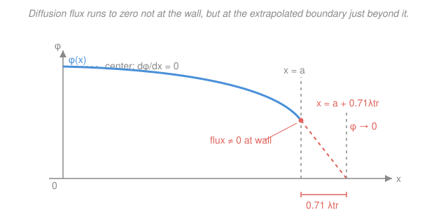

# Reactor Physics & Neutron Transport · Lesson 1.4: The one-group diffusion equation & boundary conditions

> ⏱ ~15 min · Module 1: Transport & the diffusion approximation · Builds on: [1.3 The diffusion approximation & Fick's law](01-03-diffusion-approximation-ficks-law.md), [`pdes`](../../pdes/syllabus.md) · Unlocks: [1.5 Diffusion length & source problems](01-05-diffusion-length-source-problems.md), [2.4 Bare reactor geometries & flux shapes](02-04-bare-reactor-geometries-flux-shapes.md)

## Why this matters

Every quantitative question in this course — what size goes critical, where the flux peaks, how thick a shield must be — is really the *same* boundary-value problem, solved in a new geometry. In [1.3](01-03-diffusion-approximation-ficks-law.md) you got Fick's law, a rule for how neutrons flow. Now we combine it with plain bookkeeping ("neutrons in = neutrons out") to get one second-order PDE for the flux, and then close it with the handful of boundary conditions that turn "a PDE" into "*the* flux, uniquely." Get those conditions wrong and you'll compute a critical mass that's off by tens of percent — the extrapolated boundary alone is why a bare sphere is a few centimeters bigger than naïve theory says.

## The idea

Picture a tiny box anywhere inside a reactor. Neutrons appear in it (from a source or fission), disappear from it (absorbed), and drift across its walls (leakage). In **steady state** nothing is piling up, so those three must exactly balance:

$$\text{production} \;=\; \text{absorption} \;+\; \text{net leakage out}.$$

That's the whole equation. Fick's law already told us that leakage is downhill flow — neutrons drift from crowded regions to empty ones — so "net leakage out of the box" is measured by how *curved* the flux is (the Laplacian). Where the flux dips into a local valley, more neutrons flow in than out, and the box is a net importer. Assemble those pieces and out drops the diffusion equation.

But a PDE by itself describes infinitely many flux shapes. To pin down the real one you need conditions at the edges of your region, and physics hands you exactly four kinds: flux and current must **match** where two materials meet; flux must run to zero at the **edge of the world** (a vacuum); the gradient must **vanish** at a plane of symmetry; and the flux must stay **finite and non-negative** everywhere, because it counts real neutrons. This is precisely the boundary-value-problem machinery from [`pdes`](../../pdes/syllabus.md) — Dirichlet, Neumann, interface matching — wearing a reactor's clothes.

## The formal version

Take a source-and-absorber medium described by the diffusion coefficient $D$ (cm), the macroscopic absorption cross section $\Sigma_a$ (cm$^{-1}$), and a source $S$ (neutrons cm$^{-3}$s$^{-1}$). Let $\phi(\mathbf r)$ be the scalar flux (neutrons cm$^{-2}$s$^{-1}$) and $\mathbf J = -D\nabla\phi$ the current from Fick's law. The steady-state balance per unit volume is

$$S \;=\; \underbrace{\Sigma_a\phi}_{\text{absorbed}} \;+\; \underbrace{\nabla\cdot\mathbf J}_{\text{net leakage out}}.$$

*In words: whatever is born is either soaked up right here or flows out through the walls.* The divergence $\nabla\cdot\mathbf J$ is the net outflow per unit volume — positive where the box is a net exporter. Substitute Fick's law, and with $D$ constant $\nabla\cdot\mathbf J = -D\,\nabla^2\phi$:

$$\boxed{\,D\,\nabla^2\phi \;-\; \Sigma_a\phi \;+\; S \;=\; 0\,}$$

*In words: production ($S$) balances absorption ($\Sigma_a\phi$) plus net leakage, where the leakage term is $-D\nabla^2\phi$ — leakage is the negative curvature of the flux.* This is the **steady-state one-group diffusion equation**: "one-group" because we lumped all neutrons into a single speed back in [1.2](01-02-cross-sections-flux-reaction-rates.md). Dividing by $D$ and defining the **diffusion length** $L \equiv \sqrt{D/\Sigma_a}$ (its meaning is [1.5](01-05-diffusion-length-source-problems.md)'s job) gives the tidy form

$$\nabla^2\phi \;-\; \frac{1}{L^2}\,\phi \;=\; -\frac{S}{D}, \qquad\text{and in a source-free region}\qquad \nabla^2\phi - \frac{1}{L^2}\phi = 0.$$

That source-free equation is the *modified Helmholtz* equation — a linear, second-order BVP you solved in [`pdes`](../../pdes/syllabus.md). To select the physical solution, impose:

**1. Interface conditions (material meets material).** Across a boundary between two media, both the flux and the normal current are continuous:

$$\phi_1 = \phi_2, \qquad J_{1,n} = J_{2,n} \;\;\Longrightarrow\;\; -D_1\frac{d\phi_1}{dn} = -D_2\frac{d\phi_2}{dn}.$$

*In words: the neutron density can't jump (nothing creates or destroys neutrons at a mathematical surface), and the flow arriving must equal the flow leaving, or neutrons would pile up on the seam.* Note what this does **not** say: since $D_1\neq D_2$, the gradient $d\phi/dn$ generally *does* jump — it's the product $D\,d\phi/dn$ that matches.

**2. Vacuum boundary — the extrapolated boundary.** At a free surface (facing vacuum) neutrons leak out and none come back, so the flux is low there but *not* zero. Exact transport theory shows the diffusion solution, extended past the surface, extrapolates linearly to zero a short distance $d = 0.71\lambda_{tr}$ beyond it, where $\lambda_{tr} = 1/\Sigma_{tr} = 3D$ is the transport mean free path. So we impose $\phi = 0$ at the **extrapolated boundary**

$$\tilde a = a + 0.71\,\lambda_{tr},$$

with $a$ the physical half-size. *In words: pretend the reactor is slightly bigger than it is, and set the flux to zero at that imaginary edge.* (Since $\lambda_{tr}=3D$, the extrapolation distance is $0.71\lambda_{tr} = 2.13\,D$.)

**3. Symmetry.** At a plane of symmetry no net current crosses, so

$$\left.\frac{d\phi}{dx}\right|_{\text{plane}} = 0.$$

*In words: at the center of a symmetric core the flux is flat-topped — as much leaks left as right, so the net is zero.* This is a Neumann condition, and it replaces needing an external boundary on that side.

**4. Finiteness & non-negativity.** The flux must be finite everywhere inside the region and $\phi \ge 0$. *In words: $\phi$ counts real neutrons, so a solution that blows up (e.g. the $1/r$ or $\ln r$ piece at the origin) or goes negative is thrown out.* This is often the condition that kills one of the two constants in a general solution.

Count them: each region contributes a second-order ODE needing exactly two conditions. A symmetric bare slab uses symmetry at the center and a vacuum boundary at the edge — two conditions, one flux.

## Picture

## Worked examples

**Example 1 (a slab BVP with a uniform source).** An infinite slab of graphite, physical half-thickness $a = 40$ cm, contains a uniform source $S_0 = 1\times10^{8}$ neutrons cm$^{-3}$s$^{-1}$. Take $D = 0.90$ cm and $\Sigma_a = 3.6\times10^{-4}$ cm$^{-1}$, so $L = \sqrt{D/\Sigma_a} = \sqrt{2500} = 50$ cm and $\lambda_{tr} = 3D = 2.7$ cm. Find the peak flux.

Place $x=0$ at the center. The equation is one-dimensional:

$$D\,\phi'' - \Sigma_a\phi + S_0 = 0 \;\;\Longrightarrow\;\; \phi'' - \frac{1}{L^2}\phi = -\frac{S_0}{D}.$$

The general solution is *particular + homogeneous*. A constant $\phi_p$ solves the full equation when $-\Sigma_a\phi_p + S_0 = 0$, i.e. $\phi_p = S_0/\Sigma_a$. The homogeneous part is $A\cosh(x/L) + C\sinh(x/L)$:

$$\phi(x) = \frac{S_0}{\Sigma_a} + A\cosh\frac{x}{L} + C\sinh\frac{x}{L}.$$

Now apply the conditions. **Symmetry** at $x=0$: $\phi'(0) = 0$ forces $C=0$ (only $\sinh$ has nonzero slope at the origin). **Vacuum** at the extrapolated edge $\tilde a = a + 0.71\lambda_{tr} = 40 + 0.71(2.7) = 41.9$ cm: $\phi(\tilde a) = 0$ gives

$$\frac{S_0}{\Sigma_a} + A\cosh\frac{\tilde a}{L} = 0 \;\;\Longrightarrow\;\; A = -\frac{S_0/\Sigma_a}{\cosh(\tilde a / L)}.$$

So the flux is

$$\phi(x) = \frac{S_0}{\Sigma_a}\left[\,1 - \frac{\cosh(x/L)}{\cosh(\tilde a/L)}\,\right].$$

Numerically, $S_0/\Sigma_a = 10^{8}/(3.6\times10^{-4}) = 2.78\times10^{11}$ cm$^{-2}$s$^{-1}$, and $\tilde a/L = 41.9/50 = 0.838$, so $\cosh(0.838) = 1.372$. The peak (center) flux is

$$\phi(0) = 2.78\times10^{11}\left[1 - \frac{1}{1.372}\right] = 2.78\times10^{11}(0.271) = 7.5\times10^{10}\ \text{neutrons cm}^{-2}\text{s}^{-1}.$$

*Check.* At the extrapolated edge $\phi(\tilde a)=0$ by construction, and at the physical wall $\phi(a) = 2.78\times10^{11}[1-\cosh(0.80)/1.372] = 2.78\times10^{11}[1-1.337/1.372] = 7.1\times10^{9}$ — small but nonzero, exactly as the Picture shows. Deep inside a very thick slab the bracket $\to 1$ and $\phi \to S_0/\Sigma_a$, the infinite-medium answer (every neutron born is absorbed locally). ✓

**Example 2 (an interface — match $\phi$ and $J$).** Neutrons diffuse across a planar interface from graphite (medium 1, $D_1 = 0.90$ cm) into water (medium 2, $D_2 = 0.16$ cm). Just inside the graphite the diffusion solution gives a flux $\phi_1 = 5.0\times10^{12}$ cm$^{-2}$s$^{-1}$ at the interface and a gradient $\phi_1' = -2.0\times10^{11}$ cm$^{-3}$ (flux falling toward the water). Find the flux and gradient just inside the water.

**Flux is continuous**, so immediately

$$\phi_2 = \phi_1 = 5.0\times10^{12}\ \text{cm}^{-2}\text{s}^{-1}.$$

**Current is continuous**, $-D_2\phi_2' = -D_1\phi_1'$, so

$$\phi_2' = \frac{D_1}{D_2}\,\phi_1' = \frac{0.90}{0.16}\,(-2.0\times10^{11}) = 5.625\,(-2.0\times10^{11}) = -1.1\times10^{12}\ \text{cm}^{-3}.$$

The gradient is more than five times *steeper* in the water, even though the flux and the current are unchanged. *In words: water's smaller $D$ means neutrons diffuse less freely, so to push the same current across, the flux has to fall off much faster.*

*Check.* Compute the current from each side: graphite $J = -D_1\phi_1' = -0.90(-2.0\times10^{11}) = 1.8\times10^{11}$; water $J = -D_2\phi_2' = -0.16(-1.1\times10^{12}) = 1.8\times10^{11}$ neutrons cm$^{-2}$s$^{-1}$. Equal ✓ — the seam neither creates nor swallows neutrons.

## Watch out

- **You might think the flux is zero at the physical surface** — it isn't. It's small but nonzero at the real edge; it's the *linearly extrapolated* flux that reaches zero at $\tilde a = a + 0.71\lambda_{tr}$. (Bare diffusion theory alone predicts $\tfrac23\lambda_{tr}$; the $0.71\lambda_{tr}$ is the corrected value from exact transport theory. Either way it's a small distance you cannot skip.)
- **You might expect both $\phi$ and $\phi'$ to be continuous at an interface.** Only $\phi$ and the current $J = -D\phi'$ are. Because $D$ jumps across the seam, $\phi'$ jumps too (Example 2) — matching the raw slope there is a classic error.
- **You might hunt for an external boundary condition on every surface.** Inside a symmetric core you use $\phi'=0$; at a singular point (an origin, an infinite medium) you use finiteness/non-negativity. These *are* boundary conditions — they retire one constant apiece, exactly as an edge condition would.

## One-liner

> Steady state is "production = absorption + leakage," which is $D\nabla^2\phi - \Sigma_a\phi + S = 0$; the flux it selects is fixed by matching $\phi$ and $J$ at interfaces, hitting zero at $\tilde a = a + 0.71\lambda_{tr}$, flattening at symmetry planes, and staying finite.

## Problems

**P1 (🟢)** A slab medium has transport cross section $\Sigma_{tr} = 0.125$ cm$^{-1}$ and physical half-width $a = 24$ cm. (a) Find the transport mean free path $\lambda_{tr}$, the extrapolation distance $0.71\lambda_{tr}$, and the extrapolated half-width $\tilde a$. (b) Name the boundary condition you would impose at the center ($x=0$) and at $x=\tilde a$.

**P2 (🟡)** A source-free medium with diffusion length $L = 12$ cm occupies $0 \le x \le \tilde a$ with $\tilde a = 36$ cm. Its left face is held at $\phi(0) = 2.0\times10^{12}$ cm$^{-2}$s$^{-1}$ (fed by a neighboring source region) and its right face is a vacuum surface, $\phi(\tilde a) = 0$. There is no internal source. (a) Solve the diffusion equation for $\phi(x)$. (b) Evaluate $\phi$ at $x = 12$ cm.

**P3 (🔴)** At the interface between a reactor core (medium 1, $D_1 = 0.80$ cm) and a graphite reflector (medium 2, $D_2 = 1.10$ cm), the flux and current are continuous. Just inside the core the gradient is $\phi_1' = -3.0\times10^{10}$ cm$^{-3}$. (a) Find the current $J$ crossing into the reflector. (b) Find the gradient $\phi_2'$ just inside the reflector and explain why it is *shallower* than in the core — and how that previews a reflector's job of pushing flux back into the core (developed in [3.4](03-04-migration-area-reflectors-heterogeneity.md)).

Solutions

**P1.** (a) The transport mean free path is $\lambda_{tr} = 1/\Sigma_{tr} = 1/0.125 = 8$ cm. Extrapolation distance $0.71\lambda_{tr} = 0.71(8) = 5.68$ cm. Extrapolated half-width $\tilde a = a + 0.71\lambda_{tr} = 24 + 5.68 = 29.68$ cm.

(b) At the center $x=0$ (a plane of symmetry) impose the **symmetry** condition $d\phi/dx = 0$. At $x = \tilde a$ impose the **vacuum / extrapolated-boundary** condition $\phi(\tilde a) = 0$.

*Check.* The extrapolation adds about 24% to the half-width here — never negligible. Units: $1/\text{cm}^{-1} = \text{cm}$ ✓.

**P2.** (a) Source-free, so $\phi'' - \phi/L^2 = 0$, general solution $\phi = A\cosh(x/L) + B\sinh(x/L)$. It's cleanest to build the solution around the vacuum face: any combination $\phi(x) = A'\sinh\!\big((\tilde a - x)/L\big)$ automatically satisfies $\phi(\tilde a) = 0$ (since $\sinh 0 = 0$). Apply the driven face $\phi(0) = \phi_0$:

$$\phi(0) = A'\sinh\frac{\tilde a}{L} = \phi_0 \;\;\Longrightarrow\;\; A' = \frac{\phi_0}{\sinh(\tilde a/L)},$$

so

$$\phi(x) = \phi_0\,\frac{\sinh\!\big((\tilde a - x)/L\big)}{\sinh(\tilde a/L)}.$$

(b) With $\tilde a/L = 36/12 = 3$ and $(\tilde a - x)/L = (36-12)/12 = 2$:

$$\phi(12) = 2.0\times10^{12}\,\frac{\sinh 2}{\sinh 3} = 2.0\times10^{12}\,\frac{3.627}{10.018} = 7.2\times10^{11}\ \text{cm}^{-2}\text{s}^{-1}.$$

*Check.* At $x=0$: $\sinh 3/\sinh 3 = 1$, so $\phi = \phi_0$ ✓. At $x=\tilde a$: $\sinh 0 = 0$, so $\phi = 0$ ✓. The flux decays monotonically from the driven face to the vacuum edge, as it must with no internal source.

**P3.** (a) Current is continuous, so evaluate it from the known (core) side:

$$J = -D_1\phi_1' = -0.80\,(-3.0\times10^{10}) = 2.4\times10^{10}\ \text{neutrons cm}^{-2}\text{s}^{-1}\ \text{(into the reflector)}.$$

(b) Current continuity, $-D_2\phi_2' = -D_1\phi_1'$, gives

$$\phi_2' = \frac{D_1}{D_2}\,\phi_1' = \frac{0.80}{1.10}\,(-3.0\times10^{10}) = -2.18\times10^{10}\ \text{cm}^{-3}.$$

The reflector's gradient is *shallower* (smaller magnitude) because its larger $D$ lets neutrons diffuse more freely — the same current is carried by a gentler slope. Physically, a reflector with large $D$ and small $\Sigma_a$ lets neutrons wander back across the interface instead of escaping, propping up the flux near the core edge; that returned population is the "reflector saving" that lets a reflected core be smaller than a bare one ([3.4](03-04-migration-area-reflectors-heterogeneity.md)).

*Check.* Recompute the current from the reflector side: $-D_2\phi_2' = -1.10(-2.18\times10^{10}) = 2.4\times10^{10}$ ✓ — matches part (a), as continuity demands.

## Flashback

**From Lesson 1.3 (Fick's law and the diffusion coefficient):** A moderator has transport cross section $\Sigma_{tr} = 0.30$ cm$^{-1}$. (a) Find the diffusion coefficient $D$. (b) At a point where the flux gradient is $d\phi/dx = -9.0\times10^{9}$ cm$^{-3}$, find the neutron current $J_x$ and state its direction.

Solution

(a) From $D = 1/(3\Sigma_{tr})$:

$$D = \frac{1}{3(0.30)} = \frac{1}{0.90} = 1.11\ \text{cm}.$$

(b) Fick's law $J_x = -D\,d\phi/dx$:

$$J_x = -(1.11)(-9.0\times10^{9}) = 1.0\times10^{10}\ \text{neutrons cm}^{-2}\text{s}^{-1}.$$

The current is positive, i.e. in the $+x$ direction — neutrons flow *down* the gradient, from the high-flux side toward the low-flux side.

*Check.* Units: $D$ in cm times gradient in cm$^{-3}$ gives cm$^{-2}$s$^{-1}$ ✓ (the gradient carries the hidden per-second of flux). Sign: a decreasing flux ($d\phi/dx<0$) drives flow toward $+x$ ✓ — exactly the downhill drift Fick's law encodes.

## Connections

- **Backward:** this equation is [1.3](01-03-diffusion-approximation-ficks-law.md)'s Fick's law ($\mathbf J = -D\nabla\phi$, $D = 1/3\Sigma_{tr}$) dropped into the neutron balance of [1.1](01-01-neutron-balance-transport-equation.md) — leakage becomes $-D\nabla^2\phi$, the curvature of the flux.
- **Forward:** [1.5](01-05-diffusion-length-source-problems.md) solves point- and plane-source versions of this BVP and reveals what $L$ physically means; [2.4](02-04-bare-reactor-geometries-flux-shapes.md) swaps absorption-dominated $-\phi/L^2$ for a *multiplying* medium, turning this into $\nabla^2\phi + B^2\phi = 0$ — same boundary conditions, now with the extrapolated dimension setting the critical size.
- **Sideways (PDEs):** this is textbook boundary-value-problem machinery from [`pdes`](../../pdes/syllabus.md). The vacuum condition is a Dirichlet condition ($\phi=0$ on a surface), symmetry is a Neumann condition ($\partial\phi/\partial n = 0$), and interface matching is the same jump-condition bookkeeping used for the steady heat equation across two conductors — flux $\leftrightarrow$ temperature, current $\leftrightarrow$ heat flux.
