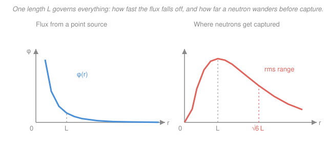

# Reactor Physics & Neutron Transport · Lesson 1.5: Diffusion length & source problems

> ⏱ ~15 min · Module 1: Transport & the diffusion approximation · Builds on: [1.4 One-group diffusion & boundary conditions](01-04-one-group-diffusion-boundary-conditions.md), [1.3 The diffusion approximation & Fick's law](01-03-diffusion-approximation-ficks-law.md) · Unlocks: [2.3 Criticality & geometric buckling](02-03-criticality-condition-geometric-buckling.md), [3.2 Resonance escape & Fermi age](03-02-resonance-escape-fermi-age.md)

## Why this matters

Before you can ask whether a reactor goes critical, you need one number that says *how far a neutron reaches* in a given material — because leakage, reflector savings, and critical size are all just "reach compared to size." That number is the **diffusion length** $L$. It also settles a very practical question: how much graphite, water, or concrete do you wrap around a source to soak up neutrons before they get out? This lesson solves the two source problems every reactor engineer has memorized — the point source and the plane source — and reads $L$ off the answers. It closes Module 1: you now have the full diffusion toolkit, and everything after is geometry.

## The idea

Turn off every source and ask what an infinite medium does with a neutron. It scatters around, random-walks a while, and eventually gets absorbed. The diffusion equation for the leftover flux is a tug-of-war: the Laplacian tries to spread the flux out, absorption tries to kill it. In one dimension the balance produces a pure exponential, $\phi \propto e^{-|x|/L}$ — and the constant $L$ in that exponent is *the* natural length of the medium.

Here is the honest picture of $L$: a neutron is born somewhere and dies (gets absorbed) somewhere else. Draw the straight line — the **crow-flight** vector — between birth and death. That vector is short in water (a strong absorber packed with hydrogen) and long in graphite (a clean moderator that barely absorbs). Averaged over many neutrons, the mean-square length of that vector is exactly $\langle r^2\rangle = 6L^2$. So $L$ isn't an abstract decay constant — it's a slightly rescaled measure of *how far a neutron gets from where it started before something eats it*. Big $L$, far reach, leaky reactor. Small $L$, tight, hard to leak.

## The formal version

**The source-free diffusion equation.** Away from any source, the one-group steady-state equation from Lesson 1.4, $D\nabla^2\phi - \Sigma_a\phi + S = 0$, loses its source term:

$$D\nabla^2\phi - \Sigma_a\phi = 0 \qquad\Longleftrightarrow\qquad \nabla^2\phi - \frac{1}{L^2}\phi = 0, \qquad L \equiv \sqrt{\frac{D}{\Sigma_a}}.$$

In words: where no neutrons are being born, diffusion and absorption must cancel; dividing through by $D$ packages the two material constants into a single length $L=\sqrt{D/\Sigma_a}$, the **diffusion length**. ($D$ is the diffusion coefficient, $\Sigma_a$ the macroscopic absorption cross section; both were fixed in Lessons 1.2–1.3.)

**Plane source.** For an infinite isotropic plane source of strength $S$ (neutrons per cm² per s) at $x=0$, the equation is one-dimensional, $\phi'' - \phi/L^2 = 0$, and finiteness at infinity kills the growing exponential:

$$\phi(x) = \frac{SL}{2D}\,e^{-|x|/L}.$$

In words: flux falls off as a clean exponential with *e*-folding length $L$; the coefficient is fixed by demanding that half the source neutrons leave each face (derived in the flashback). Every $L$ you travel, the flux drops by a factor $e$.

**Point source.** For an isotropic point source of strength $S$ (neutrons per s) at the origin, spherical symmetry gives the result you will derive in Example 1:

$$\phi(r) = \frac{S\,e^{-r/L}}{4\pi D r}.$$

In words: the same exponential decay, but with an extra $1/r$ from spreading over spheres of growing area — the flux is huge near the source and dies off within a few $L$.

**What $L$ measures.** From the point-source solution, the probability that a neutron born at the origin is finally absorbed in the shell $[r, r+dr]$ is $p(r)\,dr = \dfrac{1}{L^2}\,r\,e^{-r/L}\,dr$, and its mean-square gives

$$\boxed{\;\langle r^2\rangle = 6L^2\;}\qquad\Rightarrow\qquad r_{\text{rms}} = \sqrt{6}\,L \approx 2.45\,L.$$

In words: the typical straight-line distance from birth to capture is $\sqrt6\,L$ — so $L$ *is* the crow-flight range of a neutron, up to the factor $\sqrt6$.

## Picture

Left: the flux $\phi(r)\propto e^{-r/L}/r$ — sharp near the source, gone within a few $L$. Right: where those neutrons actually get *captured*, $p(r)\propto r\,e^{-r/L}$. It peaks not at the origin but at $r=L$ (close in, the shell area $4\pi r^2$ is tiny; far out, few neutrons survive), and its spread reaches out to $r_{\text{rms}}=\sqrt6\,L$. That right-hand hump is the physical meaning of the diffusion length.

## Worked examples

**Example 1 — the point-source solution, and why the total absorption is $S$ (the boss result).**

*Solve.* For $r>0$ the medium is source-free and spherically symmetric, so $\nabla^2\phi = \dfrac{1}{r^2}\dfrac{d}{dr}\!\left(r^2\dfrac{d\phi}{dr}\right)$. The standard trick is the substitution $\phi = w(r)/r$, which collapses the spherical Laplacian to a flat one: $\nabla^2\phi = \dfrac{1}{r}\,w''(r)$. The equation $\nabla^2\phi - \phi/L^2 = 0$ becomes

$$w'' - \frac{1}{L^2}w = 0 \quad\Rightarrow\quad w = A\,e^{-r/L} + C\,e^{+r/L}.$$

Finiteness as $r\to\infty$ forces $C=0$, so $\phi(r) = A\,e^{-r/L}/r$.

*Fix $A$ from the source.* In steady state every one of the $S$ neutrons per second must cross any tiny sphere around the origin. The net outward current is $J = -D\,d\phi/dr$, and the flow through a sphere of radius $r$ is $4\pi r^2 J$. Differentiate:

$$\frac{d\phi}{dr} = -A\,e^{-r/L}\!\left(\frac{1}{Lr} + \frac{1}{r^2}\right), \qquad 4\pi r^2 J = 4\pi D A\,e^{-r/L}\!\left(\frac{r}{L} + 1\right).$$

Let $r\to 0$: the bracket $\to 1$, so the outflow $\to 4\pi D A$. Setting this equal to $S$ gives $A = \dfrac{S}{4\pi D}$, hence

$$\phi(r) = \frac{S\,e^{-r/L}}{4\pi D r}.\qquad\checkmark$$

*Verify total absorption $= S$.* Absorptions happen at rate density $\Sigma_a\phi$; integrate over all space (shell volume $4\pi r^2\,dr$):

$$\int_0^\infty \Sigma_a\,\phi\,4\pi r^2\,dr = \frac{\Sigma_a S}{D}\int_0^\infty r\,e^{-r/L}\,dr = \frac{\Sigma_a S}{D}\,L^2 = \frac{\Sigma_a S}{D}\cdot\frac{D}{\Sigma_a} = S.\qquad\checkmark$$

Every neutron is accounted for — none leak to infinity, they are all eventually absorbed. (The integral $\int_0^\infty r\,e^{-r/L}dr = L^2$ is a one-line integration by parts, the same $\Gamma$-function move from [calc-refresher](../../calc-refresher/syllabus.md).)

**Example 2 — a shielding problem (boss-style): how thick a graphite blanket captures 95%?**

A point source sits at the center of a large graphite pile; thermal neutrons there have $L \approx 52\,\text{cm}$. We want the radius $r$ within which 95% of the emitted neutrons are absorbed — i.e. only 5% get past.

Use the capture distribution $p(r) = \frac{1}{L^2}r\,e^{-r/L}$. The fraction captured *within* radius $r$ is its cumulative integral (integration by parts, $x\equiv r/L$):

$$F(r) = \int_0^{r}\frac{1}{L^2}r'\,e^{-r'/L}\,dr' = 1 - \left(1+\frac{r}{L}\right)e^{-r/L}.$$

Demanding $F=0.95$ means the *escaping* fraction $1-F$ equals $0.05$:

$$\left(1+\frac{r}{L}\right)e^{-r/L} = 0.05.$$

This is transcendental — solve numerically for $x=r/L$. Test $x=4.7$: $(5.7)e^{-4.7} = 5.7(0.00910)=0.0519$. A touch high, so nudge up: $x=4.74$ gives $(5.74)e^{-4.74}=5.74(0.00874)=0.0502$. So $x\approx 4.74$, and

$$r \approx 4.74\,L \approx 4.74(52\,\text{cm}) \approx 246\,\text{cm} \approx 2.5\,\text{m}.$$

Two and a half meters of graphite to stop 95% — a sobering reminder that a good moderator is a *bad* shield precisely because its $L$ is so long. (Rounding $x$ to $4.7$ recovers the syllabus figure of $\approx 245$ cm.)

## Watch out

- **You might think** flux $\phi(r)$ tells you where neutrons are absorbed — **but** absorption density is $\Sigma_a\phi\cdot 4\pi r^2$, not $\phi$. The extra $4\pi r^2$ pushes the captures *outward*: $\phi$ blows up at the origin, yet the capture distribution peaks all the way out at $r=L$.
- **You might think** $L$ is a distance the neutron *travels* — **but** it is the straight-line **crow-flight** displacement from birth to death. The actual zig-zag path length is far longer (many mean free paths $\lambda = 1/\Sigma$); $L$ measures net reach, not mileage.
- **You might think** the source-free equation $\nabla^2\phi - \phi/L^2=0$ and the criticality equation $\nabla^2\phi + B^2\phi=0$ (Module 2) are cousins — **but** the sign flips everything: $-1/L^2$ gives dying exponentials $e^{-r/L}$, while $+B^2$ gives *oscillatory* eigenfunctions ($\sin$, $\cos$, $J_0$). Absorption-dominated leakage versus a self-sustaining mode.

## One-liner

> The diffusion length $L=\sqrt{D/\Sigma_a}$ is how far a neutron reaches before capture — the flux dies as $e^{-r/L}$, and the crow-flight range is $\sqrt6\,L$.

## Problems

**P1 (🟢)** For thermal neutrons in ordinary water, $D = 0.16\,\text{cm}$ and $\Sigma_a = 0.0197\,\text{cm}^{-1}$. (a) Find the diffusion length $L$. (b) What is the root-mean-square crow-flight distance from a neutron's birth to its capture? (c) In one sentence, why is water's $L$ so much shorter than graphite's $52$ cm?

**P2 (🟡)** Using the point-source capture distribution $p(r)\,dr = \frac{1}{L^2}r\,e^{-r/L}\,dr$, find the **median** crow-flight distance — the radius $r$ within which half of all neutrons are captured. Compare it to the rms range $\sqrt6\,L$ and say what the comparison tells you about the shape of the distribution.

**P3 (🔴, optional)** In Module 2 the flux inside a finite bare reactor obeys $\nabla^2\phi + B^2\phi = 0$ — the same operator as here but with the sign of the constant reversed. (a) Without solving, state what qualitative kind of solution each equation produces (this lesson's $-1/L^2$ vs. Module 2's $+B^2$) and why. (b) This is the Helmholtz eigenvalue problem you met in [pdes](../../pdes/syllabus.md). What physically forces the reactor version to have *oscillatory* solutions while the source problem has *decaying* ones?

Solutions

**P1** (a) $L = \sqrt{D/\Sigma_a} = \sqrt{0.16/0.0197} = \sqrt{8.12} = 2.85\,\text{cm}$.
(b) $r_{\text{rms}} = \sqrt6\,L = 2.449(2.85\,\text{cm}) = 6.98 \approx 7.0\,\text{cm}$.
(c) Water is packed with hydrogen, which absorbs thermal neutrons far more strongly than carbon does — a larger $\Sigma_a$ (and smaller $D$) shrinks $L=\sqrt{D/\Sigma_a}$, so a neutron is captured after a much shorter reach. (Good moderator ≠ good absorber: graphite is a clean moderator with tiny $\Sigma_a$, hence $L\approx 52$ cm.)

**P2** The fraction captured within radius $r$ is the cumulative distribution from Example 2, $F(r) = 1-(1+r/L)e^{-r/L}$. Set $F = 0.5$ with $x=r/L$:

$$\left(1+x\right)e^{-x} = 0.5.$$

Solve numerically. Test $x=1.68$: $(2.68)e^{-1.68} = 2.68(0.1864) = 0.4996 \approx 0.5$. So the median is $r_{1/2} \approx 1.68\,L$.

Compare: median $\approx 1.68\,L$, rms $= \sqrt6\,L \approx 2.45\,L$. The rms sits well above the median, so the distribution is **right-skewed** — most neutrons are captured within a couple of $L$, but a long tail of far-reaching neutrons (the $r^3$ weighting in $\langle r^2\rangle$) drags the rms outward. Half the captures happen inside $1.68\,L$, yet the "typical squared distance" is set by the stragglers.

**P3** (a) With $-1/L^2$: solutions are real exponentials $e^{\pm r/L}$ (or $\sinh,\cosh$), and physical boundedness keeps only the *decaying* one — flux monotonically dies away from the source. With $+B^2$: solutions are *oscillatory* — $\sin(Br)$, $\cos(Br)$, $J_0(Br)$ — that can turn back down and vanish at a finite boundary. The sign of the constant in a second-order linear ODE is exactly what decides exponential-vs-trigonometric behavior.
(b) In the source problem, absorption dominates and there is no production, so the population can only *decay* with distance — nothing pushes it back up. In the reactor, fission *replaces* the leaked and absorbed neutrons, and criticality demands a self-consistent standing flux shape that is nonzero inside and drops to (nearly) zero at the edges. That "nonzero interior, zero at the boundary" requirement is precisely a Helmholtz eigenvalue problem, whose solutions must oscillate to curve down and meet the boundary condition. The eigenvalue is the buckling $B^2$ — the subject of Module 2.

## Flashback

**From Lesson 1.4 (One-group diffusion & boundary conditions):** An infinite isotropic plane source of strength $S$ (neutrons·cm⁻²·s⁻¹) sits at the midplane ($x=0$) of a slab of physical half-thickness $a$ with vacuum surfaces. Using the **extrapolated** half-thickness $\tilde a = a + 0.71\,\lambda_{tr}$, solve the one-group diffusion equation for $\phi(x)$ inside the slab. Then check that as $\tilde a \to \infty$ you recover the infinite-medium plane-source result $\phi = \frac{SL}{2D}e^{-|x|/L}$.

Solution

For $0 < x < \tilde a$ the region is source-free: $\phi'' - \phi/L^2 = 0$. Impose the extrapolated vacuum condition $\phi(\tilde a) = 0$ (Lesson 1.4: flux extrapolates linearly to zero a distance $0.71\lambda_{tr}$ beyond the physical face). The solution vanishing at $\tilde a$ and symmetric in $x$ is

$$\phi(x) = A\,\sinh\!\left(\frac{\tilde a - |x|}{L}\right).$$

Fix $A$ from the source: by symmetry each face receives $S/2$, so the outward current at $x\to 0^+$ is $J(0^+) = -D\,\phi'(0^+) = S/2$. With $\phi'(x) = -\frac{A}{L}\cosh\!\big(\frac{\tilde a - x}{L}\big)$,

$$J(0^+) = \frac{DA}{L}\cosh\!\left(\frac{\tilde a}{L}\right) = \frac{S}{2} \quad\Rightarrow\quad A = \frac{SL}{2D\cosh(\tilde a/L)}.$$

$$\boxed{\;\phi(x) = \frac{SL}{2D}\,\frac{\sinh\!\big((\tilde a - |x|)/L\big)}{\cosh(\tilde a/L)}\;}$$

**Limit check.** As $\tilde a\to\infty$, write $\sinh\!\big(\frac{\tilde a - x}{L}\big) \approx \tfrac12 e^{(\tilde a - x)/L}$ and $\cosh(\tilde a/L)\approx \tfrac12 e^{\tilde a/L}$; the ratio $\to e^{-x/L}$, giving $\phi \to \frac{SL}{2D}e^{-x/L}$ — the infinite-medium plane source. ✓ A finite slab just wraps that exponential in a $\sinh$ that bends the flux down to zero at the extrapolated edge.

## Connections

- **Backward:** this is [1.4](01-04-one-group-diffusion-boundary-conditions.md)'s one-group equation with the source moved to a boundary/point condition, closed with the extrapolated and finiteness rules from that lesson and the $D$, $\Sigma_a$ from [1.2–1.3](01-03-diffusion-approximation-ficks-law.md). Module 1 is now complete: you can set up and solve any one-group diffusion problem.
- **Forward:** flip the sign of the constant and $L$ becomes the yardstick for leakage — [2.3 criticality & geometric buckling](02-03-criticality-condition-geometric-buckling.md) builds the material buckling $B_m^2=(k_\infty-1)/L^2$ directly on it, and the fast analog $\langle r^2\rangle=6\tau$ (Fermi age) appears in [3.2](03-02-resonance-escape-fermi-age.md), where $L^2$ and $\tau$ combine into the migration area $M^2=L^2+\tau$.
- **Sideways (PDEs):** the substitution $\phi = w/r$ that tames the spherical Laplacian, and the exponential-vs-oscillatory dichotomy set by the sign of the constant, are core [pdes](../../pdes/syllabus.md) moves; the reactor version in Module 2 is literally the Helmholtz eigenvalue problem. The decaying-tail arithmetic ($\int r^n e^{-r/L}dr$) is the same $\Gamma$-function machinery from improper integrals in [calc-refresher](../../calc-refresher/syllabus.md).
