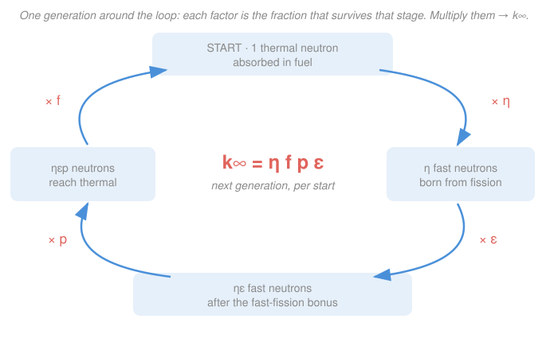

# Reactor Physics & Neutron Transport · Lesson 2.1: $k_\infty$ & the four-factor formula

> ⏱ ~15 min · Module 2: The critical reactor — multiplication & buckling · Builds on: [1.5 Diffusion length & source problems](01-05-diffusion-length-source-problems.md), [1.2 Cross sections, flux & reaction rates](01-02-cross-sections-flux-reaction-rates.md), [`intro-nuclear-engineering`](../../intro-nuclear-engineering/syllabus.md) · Unlocks: [2.2 Leakage & the six-factor formula](02-02-leakage-six-factor-formula.md)

## Why this matters

A reactor lives or dies on a single number: does each generation of neutrons reproduce *itself*, exactly, indefinitely? Too many and the power runs away; too few and it fizzles. Before we worry about the reactor's size and how neutrons leak out the edges (that's [2.2](02-02-leakage-six-factor-formula.md)), we ask the cleaner question: in an *infinite* lattice with no edges to leak from, what's the generation-to-generation multiplication? That number is $k_\infty$, and the four-factor formula tells its story as four survival odds a neutron must run in a row. Master it and you can read *why* a boron injection shuts a core down, or why a fuel-to-water ratio has a sweet spot — straight off the cross sections.

## The idea

Follow **one generation** of neutrons around a loop. Start the clock at the moment $N$ thermal neutrons get absorbed in the fuel — that's our bookkeeping "start line." Each such absorption has some chance of causing a fission, and each fission spits out a couple of fast neutrons. So right away the population *grows*. But those newborn neutrons are fast, and a thermal reactor needs them slow. On the way down in energy they run a gauntlet: some get an unlucky bonus fission on the way, most have to survive the $^{238}$U capture resonances, and once they finally thermalize they have to be absorbed *in the fuel* rather than wasted in the moderator, coolant, or structure. Whatever fraction makes it all the way back to "absorbed in the fuel, thermal" *is the next generation's start line*.

$k_\infty$ is just the ratio of that new start line to the old one. Write it as a product of four fractions — one per hurdle — and you have the **four-factor formula**. Two of the factors are *pure cross-section ratios* you can compute right now from [1.2](01-02-cross-sections-flux-reaction-rates.md)'s macroscopic $\Sigma$'s; the other two ($p$ and $\varepsilon$) come from slowing-down physics we'll build in Module 3, so here we'll take them as given lattice numbers and focus on $f$ and $\eta$.

## The formal version

For an **infinite** thermal reactor, the infinite-medium multiplication factor is

$$\boxed{\,k_\infty = \eta\, f\, p\, \varepsilon\,}$$

*In words: multiply the four survival/gain factors of one neutron generation and you get how many neutrons the next generation starts with, per neutron this one started with.* Read left-to-right it's the neutron's life cycle; each symbol is defined below. ("Infinite" means no leakage — the whole population stays in the medium — so $k_\infty$ is an upper bound on the real $k_{\text{eff}}$.)

**Reproduction factor $\eta$** — fast neutrons produced per *thermal neutron absorbed in the fuel*:

$$\eta = \nu\,\frac{\Sigma_f^{\text{fuel}}}{\Sigma_a^{\text{fuel}}} = \frac{\nu\,\Sigma_f^{\text{fuel}}}{\Sigma_f^{\text{fuel}} + \Sigma_c^{\text{fuel}}},$$

where $\nu$ is neutrons emitted per fission ($\approx 2.4$ for $^{235}$U), $\Sigma_f^{\text{fuel}}$ is the fuel's macroscopic fission cross section (cm$^{-1}$), and $\Sigma_a^{\text{fuel}} = \Sigma_f^{\text{fuel}} + \Sigma_c^{\text{fuel}}$ is total fuel absorption (fission $+$ radiative capture $\Sigma_c$). *In words: of the neutrons absorbed in fuel, only the fraction $\Sigma_f/\Sigma_a$ actually fission, and each of those releases $\nu$ — so $\eta$ is $\nu$ discounted by the fuel's own wasted captures.* Crucially $\eta \le \nu$ always: not every absorbed neutron fissions.

**Thermal utilization $f$** — fraction of *all* thermal absorptions that land in the fuel:

$$f = \frac{\Sigma_a^{\text{fuel}}}{\Sigma_a^{\text{total}}} = \frac{\Sigma_a^{\text{fuel}}}{\Sigma_a^{\text{fuel}} + \Sigma_a^{\text{mod}} + \Sigma_a^{\text{poison}} + \cdots}.$$

*In words: when a thermal neutron finally gets absorbed, $f$ is the odds it was the fuel that caught it rather than the moderator, coolant, poison, or structure* — the "not wasted" fraction. $0 < f < 1$; anything absorbed outside the fuel is a dead neutron.

**Resonance escape probability $p$** — the fraction of neutrons that slow all the way to thermal *without* being captured in the $^{238}$U absorption resonances on the way down. *In words: while a fast neutron loses energy step by step, it passes through the sharp $^{238}$U capture spikes; $p$ is the odds it threads them all and reaches thermal.* $0 < p < 1$. We derive $p$ quantitatively from the resonance integral in [3.2](03-02-resonance-escape-fermi-age.md); here it's a given lattice number.

**Fast-fission factor $\varepsilon$** — the bonus. A few fast neutrons, before they slow down, are energetic enough to fission $^{238}$U (which won't fission thermally). *In words: $\varepsilon$ counts the extra fissions the fast neutrons sneak in on their way down, so it's the one factor greater than 1* — typically $\varepsilon \approx 1.03$. It multiplies the whole thermal-fission chain by that small surplus.

So the loop reads: **1 thermal neutron absorbed in fuel** $\xrightarrow{\times\eta}$ $\eta$ fast born $\xrightarrow{\times\varepsilon}$ $\eta\varepsilon$ fast (with the bonus) $\xrightarrow{\times p}$ $\eta\varepsilon p$ reach thermal $\xrightarrow{\times f}$ $\eta\varepsilon p f$ absorbed in fuel = the next generation's start. Reactor is on the knife's edge (in the infinite idealization) when $k_\infty = 1$.

## Picture

## Worked examples

**Example 1 (compute $f$, $\eta$, then $k_\infty$).** A homogeneous thermal lattice has these thermal macroscopic cross sections: fuel $\Sigma_f^{\text{fuel}} = 0.25\,\text{cm}^{-1}$ and $\Sigma_a^{\text{fuel}} = 0.30\,\text{cm}^{-1}$; moderator $\Sigma_a^{\text{mod}} = 0.10\,\text{cm}^{-1}$. Take $\nu = 2.4$, and from slowing-down data $p = 0.80$, $\varepsilon = 1.05$. Find $k_\infty$.

Thermal utilization — only fuel vs moderator absorb here:

$$f = \frac{\Sigma_a^{\text{fuel}}}{\Sigma_a^{\text{fuel}} + \Sigma_a^{\text{mod}}} = \frac{0.30}{0.30 + 0.10} = \frac{0.30}{0.40} = 0.75.$$

Reproduction factor:

$$\eta = \nu\,\frac{\Sigma_f^{\text{fuel}}}{\Sigma_a^{\text{fuel}}} = 2.4 \times \frac{0.25}{0.30} = 2.4 \times 0.8333 = 2.0.$$

(Sanity: $\eta = 2.0 < \nu = 2.4$, because a sixth of fuel absorptions are captures, not fissions.) Now assemble:

$$k_\infty = \eta\, f\, p\, \varepsilon = 2.0 \times 0.75 \times 0.80 \times 1.05 = 1.26.$$

Above 1 — this infinite lattice multiplies. Whether the *finite* reactor is critical depends on how much leaks out ([2.2](02-02-leakage-six-factor-formula.md)); $k_\infty = 1.26$ is the leakage budget you get to spend.

**Example 2 (a lattice change — inject a poison).** Keep everything from Example 1, but dissolve a neutron poison (say boron, or picture equilibrium xenon from [5.3](05-03-xenon-135-iodine-pit.md)) into the moderator, adding $\Sigma_a^{\text{poison}} = 0.05\,\text{cm}^{-1}$ of thermal absorption. Which factor moves, and what's the new $k_\infty$?

Only $f$ changes — the poison steals thermal absorptions from the fuel (η, p, ε are set by fuel and slowing-down, untouched):

$$f' = \frac{\Sigma_a^{\text{fuel}}}{\Sigma_a^{\text{fuel}} + \Sigma_a^{\text{mod}} + \Sigma_a^{\text{poison}}} = \frac{0.30}{0.30 + 0.10 + 0.05} = \frac{0.30}{0.45} = 0.6667.$$

$$k_\infty' = \eta\, f'\, p\, \varepsilon = 2.0 \times 0.6667 \times 0.80 \times 1.05 = 1.12.$$

The multiplication dropped from 1.26 to 1.12. Because only $f$ moved, the *fractional* change in $k_\infty$ equals the fractional change in $f$: $f'/f = 0.6667/0.75 = 0.889$, an 11% cut — exactly the ratio $k_\infty'/k_\infty = 1.12/1.26 = 0.889$. That is the whole mechanism of a chemical shim or a control poison: it eats $f$, and $k_\infty$ follows one-for-one.

## Watch out

- **You might think $\eta = \nu$** (neutrons per absorption = neutrons per fission). It never is — $\eta = \nu\,\Sigma_f/\Sigma_a^{\text{fuel}} \le \nu$, because some fuel absorptions are radiative capture that produce *zero* neutrons. For natural-uranium fuel the gap is large; the $\Sigma_f/\Sigma_a$ discount is doing real work.
- **You might think $k_\infty > 1$ means the reactor goes critical.** No — $k_\infty$ is the *infinite* (no-leakage) value. Every real core leaks, so $k_{\text{eff}} < k_\infty$. You *need* $k_\infty > 1$, but by how much depends on size; a tiny core can have $k_\infty = 1.3$ and still be subcritical because it leaks the surplus away. That's [2.2](02-02-leakage-six-factor-formula.md).
- **You might think more moderator is always better.** It isn't: adding moderator raises $p$ (more scattering collisions means neutrons slow past the resonances faster) but *lowers* $f$ (more moderator absorption competing with the fuel). Their product $p f$ has a peak — the over/under-moderation trade-off that sets a lattice's optimal fuel-to-moderator ratio.

## One-liner

> $k_\infty = \eta f p \varepsilon$ is one neutron generation's life told as four odds in a row — born, bonus-fissioned, slowed past the resonances, and recaptured in fuel — multiplied into the size of the next generation.

## Problems

**P1 (🟢)** A thermal lattice has $\Sigma_a^{\text{fuel}} = 0.25\,\text{cm}^{-1}$ and moderator $\Sigma_a^{\text{mod}} = 0.0625\,\text{cm}^{-1}$ (no poison). Compute the thermal utilization $f$.

**P2 (🟡)** For the same lattice, the fuel has $\nu = 2.43$, $\Sigma_f^{\text{fuel}} = 0.20\,\text{cm}^{-1}$, $\Sigma_a^{\text{fuel}} = 0.25\,\text{cm}^{-1}$. Slowing-down data give $p = 0.75$ and $\varepsilon = 1.03$. Find the reproduction factor $\eta$ and then $k_\infty$. Is this infinite lattice supercritical?

**P3 (🔴)** Now a burnable poison is added, contributing $\Sigma_a^{\text{poison}} = 0.05\,\text{cm}^{-1}$ of thermal absorption alongside the moderator. Recompute $f$ and $k_\infty$ (η, p, ε unchanged), and state the fractional change in $k_\infty$. How much reactivity margin is left before the infinite lattice would go subcritical?

Solutions

**P1.** Only fuel and moderator absorb thermal neutrons here:

$$f = \frac{\Sigma_a^{\text{fuel}}}{\Sigma_a^{\text{fuel}} + \Sigma_a^{\text{mod}}} = \frac{0.25}{0.25 + 0.0625} = \frac{0.25}{0.3125} = 0.80.$$

*Check.* Dimensionless (ratio of like quantities), and $0 < 0.80 < 1$ ✓. Fuel absorption is $4\times$ the moderator's, so it catches 4 of every 5 — matching $f = 0.8$.

**P2.** Reproduction factor:

$$\eta = \nu\,\frac{\Sigma_f^{\text{fuel}}}{\Sigma_a^{\text{fuel}}} = 2.43 \times \frac{0.20}{0.25} = 2.43 \times 0.80 = 1.944.$$

(Note $\eta = 1.944 < \nu = 2.43$: fission is only $80\%$ of fuel absorption, the rest is capture.) Now with $f = 0.80$ from P1:

$$k_\infty = \eta\, f\, p\, \varepsilon = 1.944 \times 0.80 \times 0.75 \times 1.03.$$

Step by step: $1.944 \times 0.80 = 1.5552$; $\times 0.75 = 1.1664$; $\times 1.03 = 1.2014 \approx 1.20.$

$k_\infty \approx 1.20 > 1$, so **yes, the infinite lattice is supercritical** — the no-leakage population grows $\sim 20\%$ per generation. (The finite reactor will spend that $20\%$ surplus on leakage; see [2.2](02-02-leakage-six-factor-formula.md).)

*Check.* Each factor is in its expected band: $\eta \approx 1.9$–$2.1$ for enriched fuel, $f = 0.8$, $p = 0.75$ ($<1$), $\varepsilon$ just over 1 ✓.

**P3.** The poison adds to the *non-fuel* absorption, so total thermal absorption is now $\Sigma_a^{\text{fuel}} + \Sigma_a^{\text{mod}} + \Sigma_a^{\text{poison}} = 0.25 + 0.0625 + 0.05 = 0.3625\,\text{cm}^{-1}$:

$$f' = \frac{0.25}{0.3625} = 0.6897.$$

Only $f$ changed, so:

$$k_\infty' = 1.944 \times 0.6897 \times 0.75 \times 1.03.$$

Step by step: $1.944 \times 0.6897 = 1.3408$; $\times 0.75 = 1.0056$; $\times 1.03 = 1.0357 \approx 1.04.$

Fractional change: $k_\infty'/k_\infty = 1.04/1.20 = 0.863$, a **drop of about 14%** — identical to the drop in $f$ alone, $f'/f = 0.6897/0.80 = 0.862$, since $\eta, p, \varepsilon$ are untouched. Margin left before subcritical: $k_\infty'$ is only $1.04$, so the infinite lattice sits just $\sim 4\%$ above break-even — and that's *before* subtracting any real-core leakage, which could easily push $k_{\text{eff}}$ below 1. The poison has nearly used up the whole reactivity budget.

*Check.* Poison only touches $f$ (it's a thermal absorber outside the fuel), and $k_\infty$ tracks $f$ one-for-one — consistent with Example 2's mechanism. Adding absorption *must* lower $k_\infty$; it does ✓.

## Flashback

**From Lesson 1.5 (Diffusion length & point sources):** A point source emits $S = 1 \times 10^{7}$ neutrons/s isotropically at the origin of an infinite non-multiplying medium with diffusion coefficient $D = 0.75\,\text{cm}$ and absorption cross section $\Sigma_a = 3 \times 10^{-4}\,\text{cm}^{-1}$. Find the diffusion length $L$ and the scalar flux one diffusion length out, at $r = L$.

Solution

Diffusion length:

$$L = \sqrt{\frac{D}{\Sigma_a}} = \sqrt{\frac{0.75}{3 \times 10^{-4}}} = \sqrt{2500} = 50\,\text{cm}.$$

The infinite-medium point-source flux is $\phi(r) = \dfrac{S\,e^{-r/L}}{4\pi D r}$. At $r = L = 50\,\text{cm}$, $r/L = 1$:

$$\phi(L) = \frac{S\,e^{-1}}{4\pi D L} = \frac{(1\times10^{7})(0.3679)}{4\pi (0.75)(50)} = \frac{3.679\times10^{6}}{471.2} \approx 7.8 \times 10^{3}\,\text{cm}^{-2}\text{s}^{-1}.$$

*Check.* $L = \sqrt{D/\Sigma_a}$ has units $\sqrt{\text{cm}/\text{cm}^{-1}} = \text{cm}$ ✓; the flux falls by the factor $e^{-1} \approx 0.37$ over one $L$, which is exactly what "diffusion length = the $e$-folding range of the exponential" means. That same "how far do neutrons reach before they're lost" length is what governs leakage in [2.2](02-02-leakage-six-factor-formula.md), where $k_\infty$ meets a finite geometry.

## Connections

- **Backward:** $f$ and $\eta$ are nothing but ratios of the macroscopic cross sections and reaction rates $R = \Sigma\phi$ from [1.2](01-02-cross-sections-flux-reaction-rates.md) — this lesson just organizes those ratios into a generation story. It also sharpens the four-factor formula you first met in [`intro-nuclear-engineering`](../../intro-nuclear-engineering/syllabus.md), now computing the factors from $\Sigma$'s rather than quoting them.
- **Forward:** [2.2](02-02-leakage-six-factor-formula.md) attaches the two leakage odds to give $k_{\text{eff}} = k_\infty\,P_{FNL}\,P_{TNL}$ — the number that actually runs the reactor — and [3.1](03-01-slowing-down-lethargy-density.md)–[3.2](03-02-resonance-escape-fermi-age.md) finally *derive* the $p$ and $\varepsilon$ we took as given here.
- **Sideways (population dynamics):** $k_\infty$ is a **net reproduction rate** — the average number of "offspring" one generation leaves the next — the exact same object as the basic reproduction number $R_0$ that decides whether an epidemic grows ($R_0 > 1$) or dies out ($R_0 < 1$), or the Malthusian growth factor in ecology. Criticality is just $R_0 = 1$ wearing a neutron's uniform.
