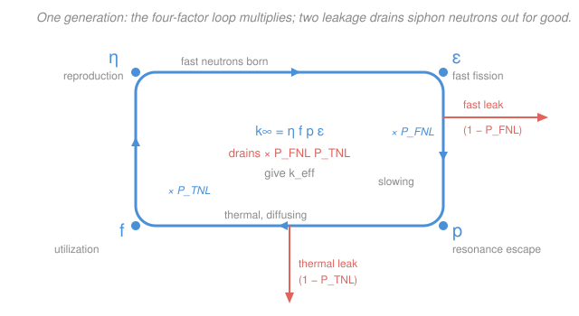

# Reactor Physics & Neutron Transport · Lesson 2.2: Leakage & the six-factor formula

> ⏱ ~15 min · Module 2: The critical reactor — multiplication & buckling · Builds on: [2.1 $k_\infty$ & the four-factor formula](02-01-k-infinity-four-factor-formula.md), [1.5 Diffusion length & source problems](01-05-diffusion-length-source-problems.md) · Unlocks: [2.3 The criticality condition & geometric buckling](02-03-criticality-condition-geometric-buckling.md)

## Why this matters

Lesson 2.1 followed one neutron generation around an *infinite* lattice and got $k_\infty$ — but no real reactor is infinite. A finite core has a surface, and neutrons walk out of it and never come back. That single fact, **leakage**, is why a chunk of reactor-grade fuel the size of a golf ball does nothing while the same material in a large enough assembly runs a city: multiplication is fixed by composition, but leakage is fixed by *size*. The number that actually decides whether the chain reaction lives or dies is $k_{\text{eff}}$, and getting it is just $k_\infty$ minus what leaks. This is the equation an operator is really controlling.

## The idea

Picture the neutron life cycle from 2.1 as a loop that multiplies the population each generation. Now punch two holes in the bucket. A neutron is born fast and spends its first microseconds *slowing down* — bouncing off moderator nuclei, wandering some distance before it reaches thermal energy. If it wanders past the edge of the core during that time, it's gone: that's **fast leakage**. Then, as a slow thermal neutron, it *diffuses* around looking for a nucleus to fission — and it can wander out the edge during *that* phase too: **thermal leakage**.

So a finite reactor keeps only the fraction of neutrons that *don't* leak. Call those fractions the **non-leakage probabilities**: $P_{FNL}$ (survive the fast, slowing-down phase without leaking) and $P_{TNL}$ (survive the thermal, diffusing phase without leaking). The effective multiplication is the infinite-medium value knocked down by both survival fractions:

$$k_{\text{eff}} = k_\infty \, P_{FNL}\, P_{TNL}.$$

The key intuition: **leakage is a surface effect, multiplication is a volume effect.** Shrink the core and its surface-to-volume ratio grows, so proportionally more neutrons find the edge — leakage rises, the non-leakage probabilities fall, and $k_{\text{eff}}$ drops. Keep shrinking and eventually you lose more than you make, and the chain reaction dies. There is a size below which nothing works. Finding it is the whole point of Module 2.

## The formal version

**The six-factor formula.** For a finite reactor,

$$\boxed{\,k_{\text{eff}} = \underbrace{\eta\, f\, p\, \varepsilon}_{k_\infty}\; P_{FNL}\, P_{TNL}\,}$$

where $\eta$ (reproduction factor), $f$ (thermal utilization), $p$ (resonance escape probability), and $\varepsilon$ (fast-fission factor) are the four factors of $k_\infty$ from [2.1](02-01-k-infinity-four-factor-formula.md), and:

- $P_{FNL}$ — the **fast non-leakage probability**: the fraction of fission neutrons that stay in the core while slowing down to thermal energy.
- $P_{TNL}$ — the **thermal non-leakage probability**: the fraction of those thermal neutrons that stay in the core while diffusing until absorbed.

*In words: of every neutron a generation produces, keep only the ones that stayed inside during both the fast trip and the thermal trip.* Both are probabilities, so $0 < P_{FNL}, P_{TNL} \le 1$; the infinite reactor is the limit $P_{FNL} = P_{TNL} = 1$, recovering $k_{\text{eff}} = k_\infty$.

**$k_{\text{eff}}$ is the multiplication factor**: the ratio of neutrons in one generation to those in the previous generation. Its value sorts every reactor into exactly three states:

$$k_{\text{eff}} \begin{cases} < 1 & \textbf{subcritical} \text{ — population shrinks each generation, chain reaction dies out} \\ = 1 & \textbf{critical} \text{ — exactly self-sustaining, steady power} \\ > 1 & \textbf{supercritical} \text{ — population grows each generation, power rises} \end{cases}$$

*In words: critical isn't "dangerous," it's the steady-state operating point — every generation exactly replaces itself.* A reactor is brought up in power by going slightly supercritical, then trimmed back to exactly critical to hold power. "Subcritical" is the shut-down state.

**Where does size enter?** The non-leakage probabilities depend on the core's dimensions through a single geometric quantity called the **buckling** $B^2$ (units $\text{cm}^{-2}$), which measures how sharply the neutron flux has to curve to fit inside the core — a small core forces a steeply curved flux, a large $B^2$, and more leakage. To a very good approximation the combined non-leakage probability is

$$P_{FNL}\,P_{TNL} \approx \frac{1}{1 + M^2 B^2},$$

where $M^2$ (the **migration area**, $\text{cm}^2$) sets how far a neutron roams from birth to absorption. We derive $B^2$ properly in [2.3](02-03-criticality-condition-geometric-buckling.md); here just read it as **"$B^2$ grows as the core shrinks,"** so leakage grows as the core shrinks. For a bare sphere of extrapolated radius $R$, $B^2 = (\pi/R)^2$ — the preview we'll use in Example 2.

## Picture

The loop is $k_\infty = \eta f p \varepsilon$ from 2.1. The two coral drains are what's new: neutrons lost through the surface while fast (right, during slowing down) and while thermal (bottom, during diffusion). Whatever survives both drains is the next generation.

## Worked examples

**Example 1 (compute $k_{\text{eff}}$ and classify).** A finite thermal reactor has $k_\infty = 1.09$. Measurements give a fast non-leakage probability $P_{FNL} = 0.97$ and a thermal non-leakage probability $P_{TNL} = 0.928$. Is it critical?

Combine the leakage:

$$P_{FNL}\,P_{TNL} = 0.97 \times 0.928 = 0.900.$$

Then

$$k_{\text{eff}} = k_\infty\, P_{FNL}\,P_{TNL} = 1.09 \times 0.900 = 0.981.$$

Since $k_{\text{eff}} = 0.981 < 1$, the reactor is **subcritical** — it would die out. Note the story: the *material* multiplies ($k_\infty = 1.09 > 1$), but this particular core leaks about 10% of its neutrons, which is more than the 9% surplus, so it can't sustain. To reach critical you'd need the non-leakage product to climb to

$$P_{FNL}\,P_{TNL} = \frac{1}{k_\infty} = \frac{1}{1.09} = 0.917,$$

i.e. cut leakage from 10.0% down to 8.3% — which you do by making the core *bigger*. That's Example 2.

**Example 2 (the size effect — why a critical size exists).** Take a bare spherical reactor of fixed composition: $k_\infty = 1.09$ and migration area $M^2 = 60\ \text{cm}^2$. Using $P_{FNL}P_{TNL} \approx 1/(1 + M^2 B^2)$ with $B^2 = (\pi/R)^2$, sweep the radius $R$:

$$k_{\text{eff}}(R) = \frac{k_\infty}{1 + M^2 (\pi/R)^2}.$$

| Radius $R$ | $B^2 = (\pi/R)^2$ | $M^2B^2$ | $k_{\text{eff}} = 1.09/(1+M^2B^2)$ | State |
|---|---|---|---|---|
| $100\,\text{cm}$ | $0.000987\,\text{cm}^{-2}$ | $0.0592$ | $1.029$ | supercritical |
| $81.1\,\text{cm}$ | $0.001500\,\text{cm}^{-2}$ | $0.0900$ | $1.000$ | **critical** |
| $60\,\text{cm}$ | $0.002742\,\text{cm}^{-2}$ | $0.1645$ | $0.936$ | subcritical |

As the sphere shrinks, $B^2$ climbs, more neutrons leak, and $k_{\text{eff}}$ slides straight down through 1. Somewhere in the middle is the **critical radius** where $k_{\text{eff}} = 1$ exactly. Solve for it by setting the leakage term equal to the surplus:

$$M^2 B^2 = k_\infty - 1 \;\Longrightarrow\; B^2 = \frac{0.09}{60} = 0.00150\ \text{cm}^{-2} \;\Longrightarrow\; R = \frac{\pi}{\sqrt{B^2}} = \frac{\pi}{0.0387} \approx 81\ \text{cm}.$$

Same fuel, same $k_\infty$ — but below about 81 cm this reactor cannot run, and above it, it runs away until something trims it back. That's the critical size, and it's a pure geometry problem: the subject of [2.5](02-05-material-buckling-critical-size-mass.md).

## Watch out

- **You might think $k_{\text{eff}} > 1$ is the normal running state.** It isn't — a reactor at steady power sits at $k_{\text{eff}} = 1$ *exactly*. Supercritical is a transient you use to *raise* power, then you return to critical to hold it. "Critical" is not an alarm word; it's the target.
- **You might think a big $k_\infty$ guarantees criticality.** No — Example 1 had $k_\infty = 1.09$ and was still subcritical because leakage ate the surplus. Composition sets the ceiling; size decides whether you reach it. A reactor with $k_\infty < 1$, though, is hopeless at *any* size — you can't leak *negative* neutrons.
- **You might read $P_{FNL}$ as "the probability it leaks."** It's the opposite — the probability it *doesn't* leak (the survivor fraction). The lost fraction is $1 - P_{FNL}$. Smaller reactor → *smaller* $P_{FNL}$ → more leakage.

## One-liner

> A finite reactor keeps only the neutrons that don't walk out the edge, so $k_{\text{eff}} = k_\infty P_{FNL} P_{TNL}$ — and shrinking the core raises leakage until $k_{\text{eff}}$ falls below 1.

## Problems

**P1 (🟢)** A finite reactor has $k_\infty = 1.15$, $P_{FNL} = 0.96$, and $P_{TNL} = 0.92$. (a) Compute $k_{\text{eff}}$ and classify the reactor. (b) What value of the *combined* non-leakage product $P_{FNL}P_{TNL}$ would make it exactly critical?

**P2 (🟡)** A bare spherical reactor has $k_\infty = 1.10$ and migration area $M^2 = 50\ \text{cm}^2$. Using $P_{FNL}P_{TNL} \approx 1/(1 + M^2B^2)$ and $B^2 = (\pi/R)^2$: (a) Is a sphere of extrapolated radius $R = 60\ \text{cm}$ critical? (b) Find the critical radius.

**P3 (🔴, optional)** Two reactors have identical composition — $k_\infty = 1.08$, $M^2 = 40\ \text{cm}^2$ — but one is a bare sphere of radius $R = 60\ \text{cm}$ and the other $R = 120\ \text{cm}$. Compute $k_{\text{eff}}$ for each and classify them. Then, using $B^2 = (\pi/R)^2$, explain in one sentence why doubling the radius cuts the leakage term by roughly a factor of four. (This $B^2 \propto 1/R^2$ scaling is the Helmholtz eigenvalue you'll meet head-on in [2.3](02-03-criticality-condition-geometric-buckling.md).)

Solutions

**P1** (a) Multiply straight through:
$$k_{\text{eff}} = k_\infty P_{FNL} P_{TNL} = 1.15 \times 0.96 \times 0.92.$$
Take it in steps: $0.96 \times 0.92 = 0.8832$, then $1.15 \times 0.8832 = 1.0157$. So $k_{\text{eff}} \approx 1.016 > 1$: **supercritical** (by about 1.6%).

(b) Critical means $k_{\text{eff}} = 1 = k_\infty (P_{FNL}P_{TNL})$, so
$$P_{FNL}P_{TNL} = \frac{1}{k_\infty} = \frac{1}{1.15} = 0.870.$$
*Check:* the actual product is $0.883 > 0.870$, i.e. leakage is *lower* than the critical threshold, so there's a surplus — consistent with supercritical. ✓

**P2** (a) At $R = 60\ \text{cm}$: $B^2 = (\pi/60)^2 = (0.05236)^2 = 0.002742\ \text{cm}^{-2}$. Then $M^2B^2 = 50 \times 0.002742 = 0.1371$, so
$$k_{\text{eff}} = \frac{1.10}{1 + 0.1371} = \frac{1.10}{1.1371} = 0.967 < 1 \;\Rightarrow\; \textbf{subcritical}.$$
It leaks too much at this size.

(b) Critical requires $M^2B^2 = k_\infty - 1 = 0.10$, so
$$B^2 = \frac{0.10}{50} = 0.00200\ \text{cm}^{-2}, \qquad R = \frac{\pi}{\sqrt{B^2}} = \frac{\pi}{0.04472} \approx 70.2\ \text{cm}.$$
*Check:* $70.2 > 60$, so the 60 cm sphere is below critical size — matching part (a). ✓ The reactor must grow to $\approx 70\ \text{cm}$ radius to sustain.

**P3** Compute each with $k_{\text{eff}} = k_\infty/(1 + M^2B^2)$, $B^2 = (\pi/R)^2$, $M^2 = 40$.

*Small ($R = 60$):* $B^2 = (\pi/60)^2 = 0.002742\ \text{cm}^{-2}$; $M^2B^2 = 40 \times 0.002742 = 0.1097$;
$$k_{\text{eff}} = \frac{1.08}{1.1097} = 0.973 \;\Rightarrow\; \textbf{subcritical}.$$

*Large ($R = 120$):* $B^2 = (\pi/120)^2 = 0.0006854\ \text{cm}^{-2}$; $M^2B^2 = 40 \times 0.0006854 = 0.02742$;
$$k_{\text{eff}} = \frac{1.08}{1.02742} = 1.051 \;\Rightarrow\; \textbf{supercritical}.$$

Same material, opposite fates — size alone flips it. Doubling $R$ divides $B^2 = (\pi/R)^2$ by $2^2 = 4$, and since the leakage term $M^2B^2$ is proportional to $B^2$, the leakage fraction drops by about four — leakage is a surface effect, and going bigger buries the surface relative to the volume. ✓

## Flashback

**From Lesson 2.1 ($k_\infty$ & the four-factor formula):** A thermal lattice has macroscopic thermal-absorption cross sections $\Sigma_a^{F} = 0.32\ \text{cm}^{-1}$ in the fuel and $\Sigma_a^{M} = 0.08\ \text{cm}^{-1}$ in everything else (moderator, structure, coolant). The other three factors are $\eta = 1.65$, $p = 0.88$, $\varepsilon = 1.03$. Find the thermal utilization $f$ and $k_\infty$. (Fresh numbers.)

Solution

Thermal utilization is the fraction of thermal absorptions that happen in the fuel:
$$f = \frac{\Sigma_a^{F}}{\Sigma_a^{F} + \Sigma_a^{M}} = \frac{0.32}{0.32 + 0.08} = \frac{0.32}{0.40} = 0.80.$$
Then the four-factor formula:
$$k_\infty = \eta\, f\, p\, \varepsilon = 1.65 \times 0.80 \times 0.88 \times 1.03.$$
Step through: $1.65 \times 0.80 = 1.32$; $\times 0.88 = 1.1616$; $\times 1.03 = 1.196$. So $k_\infty \approx 1.20$.

*Check:* $f$ is a fraction in $(0,1)$ ✓, and $\eta \approx 1.65$ (roughly the value for a thermal $^{235}\text{U}$ system) times factors near 1 lands $k_\infty$ a bit above 1, as any workable fuel must. In a *finite* core this $k_\infty = 1.20$ would still need $P_{FNL}P_{TNL} > 1/1.20 = 0.83$ to go critical — the leakage budget from this lesson. ✓

## Connections

- **Backward:** the four factors $\eta f p \varepsilon = k_\infty$ come straight from [2.1](02-01-k-infinity-four-factor-formula.md); the non-leakage probabilities are built on the diffusion length $L$ and the neutron's crow-flight range from [1.5](01-05-diffusion-length-source-problems.md) — leakage is just diffusion out through a finite boundary.
- **Forward:** [2.3](02-03-criticality-condition-geometric-buckling.md) turns the buckling $B^2$ from a black box into an eigenvalue set by geometry, recasting "$k_{\text{eff}} = 1$" as "material buckling = geometric buckling"; [2.5](02-05-material-buckling-critical-size-mass.md) solves that for critical size and mass. Module 3 ([3.2](03-02-resonance-escape-fermi-age.md), [3.3](03-03-two-group-diffusion-theory.md)) derives $P_{FNL}$ and $P_{TNL}$ separately from Fermi age and two-group theory.
- **Sideways (PDEs):** the buckling $B^2$ is the eigenvalue of the Helmholtz problem $\nabla^2\phi + B^2\phi = 0$ — the same separation-of-variables eigenvalue problem from [`pdes`](../../pdes/syllabus.md), where geometry fixes the allowed values. A reactor's critical size is literally the lowest eigenvalue of its shape.
