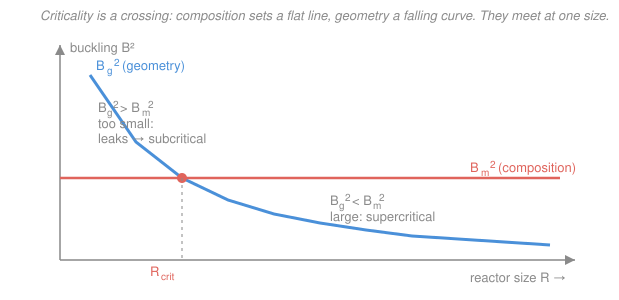

# Reactor Physics & Neutron Transport · Lesson 2.3: The criticality condition & geometric buckling

> ⏱ ~15 min · Module 2: The critical reactor — multiplication & buckling · Builds on: [2.2 Leakage & the six-factor formula](02-02-leakage-six-factor-formula.md), [1.4 One-group diffusion & boundary conditions](01-04-one-group-diffusion-boundary-conditions.md) · Unlocks: [2.4 Bare reactor geometries & flux shapes](02-04-bare-reactor-geometries-flux-shapes.md)

## Why this matters

Every reactor design ends at the same question: *what size and what mix go critical?* The six-factor formula told you leakage matters but hid the size inside a fudge factor. This lesson pays that debt honestly. It shows that criticality is nothing more mysterious than a shape matching a composition — an **eigenvalue problem**, the exact machinery you built in [`pdes`](../../pdes/syllabus.md). Once you see it, "critical size" stops being a lookup and becomes a one-line calculation: two curvatures, set equal.

## The idea

A neutron population lives or dies by a race: fresh neutrons are **produced** by fission and **lost** to absorption and to **leakage** out the surface. Absorption and production are properties of the *mix* — they don't care how big the block is. Leakage is a property of the *shape* — a small reactor has a lot of surface per neutron and bleeds fast; a big one barely leaks.

Here is the trick that organizes the whole subject. Both effects show up as **curvature of the flux**. A steeply curved flux (sharp peak, fast drop to the edges) is a leaky flux — the diffusion term $D\nabla^2\phi$ is large. So the flux carries two numbers:

- how much curvature the **composition** *wants* — a horizontal line, set once you fix the fuel-moderator mix;
- how much curvature the **geometry** *forces* — a curve that falls as the reactor grows, because a bigger box lets the flux relax and bend less.

Criticality is the crossing of those two: **the curvature the mix wants equals the curvature the size forces**. Too small, geometry forces more curvature than the mix can pay for, and the reactor leaks itself subcritical. Too big, and it runs away. One size in between is critical. That "curvature" has a name — **buckling** — and the crossing is $B_m^2 = B_g^2$.

## The formal version

Start from the steady one-group diffusion equation of [1.4](01-04-one-group-diffusion-boundary-conditions.md), but now the source is fission itself — each absorption in fuel produces $\nu\Sigma_f/\Sigma_a$ new neutrons, so $S = \nu\Sigma_f\phi$:

$$D\nabla^2\phi - \Sigma_a\phi + \nu\Sigma_f\phi = 0.$$

In words: at every point, diffusion in/out plus fission births minus absorption deaths must sum to zero for a steady population. Here $\phi(\mathbf r)$ is the scalar flux, $D$ the diffusion coefficient, $\Sigma_a$ the macroscopic absorption cross section, and $\nu\Sigma_f$ the fission-neutron production cross section ($\nu$ neutrons per fission).

Divide through by $D$ and collect the two flux terms:

$$\nabla^2\phi + \underbrace{\frac{\nu\Sigma_f - \Sigma_a}{D}}_{\displaystyle B_m^2}\,\phi = 0 \qquad\Longrightarrow\qquad \boxed{\nabla^2\phi + B^2\phi = 0.}$$

In words: the critical reactor equation *is* the **Helmholtz eigenvalue equation** — the same $\nabla^2\phi + B^2\phi = 0$ whose separated solutions you met in `pdes`. Everything reactor-specific has been squeezed into one constant, $B^2$.

**Material buckling** is that constant, read as a property of the *mix*:

$$B_m^2 \equiv \frac{\nu\Sigma_f - \Sigma_a}{D} = \frac{k_\infty - 1}{L^2},$$

using $k_\infty = \nu\Sigma_f/\Sigma_a$ (the infinite-medium multiplication of [2.1](02-01-k-infinity-four-factor-formula.md)) and $L^2 = D/\Sigma_a$ (the diffusion area of [1.5](01-05-diffusion-length-source-problems.md)). In words: material buckling measures how much more a neutron produces than it absorbs, per unit of how far it wanders — the curvature the composition can *afford*. It is positive exactly when $k_\infty > 1$.

**Geometric buckling** is the same constant, read as a property of the *shape*. Solve $\nabla^2\phi + B_g^2\phi = 0$ subject to $\phi \to 0$ at the **extrapolated boundary** ($\tilde a = a + 0.71\lambda_{tr}$, from [1.4](01-04-one-group-diffusion-boundary-conditions.md)) and $\phi \ge 0$ inside. Only special values of $B_g^2$ admit such a solution — the **eigenvalues** of the geometry. The smallest one, the **fundamental mode**, is the physical geometric buckling. In words: geometric buckling is the curvature the size and shape *force* on the flux; it shrinks as the reactor grows.

**The criticality condition.** A steady, self-sustaining chain reaction exists only when the composition's wanted curvature and the geometry's forced curvature are the *same number*:

$$\boxed{B_m^2 = B_g^2.}$$

In words: composition curvature $=$ geometry curvature. This is one scalar equation; solving it for the reactor's size gives the **critical size**.

Consistency check with [2.2](02-02-leakage-six-factor-formula.md): one-group leakage makes the thermal non-leakage probability $P_{NL} = 1/(1 + L^2 B_g^2)$, so $k_{\text{eff}} = k_\infty/(1 + L^2 B_g^2)$. Setting $k_{\text{eff}} = 1$ gives $k_\infty - 1 = L^2 B_g^2$, i.e. $B_g^2 = (k_\infty-1)/L^2 = B_m^2$. The six-factor picture and the buckling picture are the same statement.

## Picture

The coral line is fixed the moment you choose the mix. The blue curve is $B_g^2 = (\pi/\tilde a)^2$ for a slab — pure geometry, falling as size grows. Left of the crossing the flux is forced to bend too hard and the reactor leaks itself subcritical; right of it, too big, supercritical. They meet at exactly one $R_{\text{crit}}$.

## Worked examples

**Example 1 — material buckling from composition, and what its sign means.**
A homogeneous fuel-moderator mix has $\nu\Sigma_f = 0.104\,\text{cm}^{-1}$, $\Sigma_a = 0.100\,\text{cm}^{-1}$, and $D = 0.40\,\text{cm}$. Find $B_m^2$ two ways and interpret.

Directly from the definition:

$$B_m^2 = \frac{\nu\Sigma_f - \Sigma_a}{D} = \frac{0.104 - 0.100}{0.40} = \frac{0.004}{0.40} = 0.010\,\text{cm}^{-2}.$$

Cross-check through $k_\infty$ and $L$. First $k_\infty = \nu\Sigma_f/\Sigma_a = 0.104/0.100 = 1.04$, and $L^2 = D/\Sigma_a = 0.40/0.100 = 4.0\,\text{cm}^2$. Then

$$B_m^2 = \frac{k_\infty - 1}{L^2} = \frac{0.04}{4.0} = 0.010\,\text{cm}^{-2}. \checkmark$$

**Interpretation of the sign.** $B_m^2 > 0$ because $k_\infty = 1.04 > 1$: this mix is a *supercritical material* — an infinite block of it would multiply neutrons without bound. Positive material buckling means "there is curvature to spend," so a finite critical reactor exists; you just have to make it big enough that geometry doesn't force *more* curvature than $0.010\,\text{cm}^{-2}$. Had $k_\infty < 1$, $B_m^2$ would be **negative** — no real $B_g$ could ever match it, and no size of any shape would go critical. (Real solutions to $\nabla^2\phi + B_m^2\phi = 0$ oscillate only when $B_m^2 > 0$; a negative $B_m^2$ gives exponential decay, a flux that can't vanish at two boundaries while staying positive.)

**Example 2 — the slab eigenvalue problem picks the fundamental mode.**
Take a bare slab reactor, infinite in $y$ and $z$, of extrapolated thickness $\tilde a$ (so $-\tilde a/2 \le x \le \tilde a/2$). The Helmholtz equation collapses to one dimension:

$$\frac{d^2\phi}{dx^2} + B^2\phi = 0 \qquad\Longrightarrow\qquad \phi(x) = A\cos(Bx) + C\sin(Bx).$$

This is exactly the separated ODE from `pdes`. Now impose the physics:

1. **Symmetry.** No preferred face, so the flux is even: $\phi(-x) = \phi(x)$. That kills the sine, $C = 0$, leaving $\phi = A\cos(Bx)$.
2. **Boundary condition.** Flux vanishes at the extrapolated surface: $\phi(\pm\tilde a/2) = 0$, so $\cos(B\tilde a/2) = 0$, which forces

$$\frac{B\tilde a}{2} = \frac{\pi}{2},\ \frac{3\pi}{2},\ \frac{5\pi}{2},\dots \qquad\Longrightarrow\qquad B_n = \frac{n\pi}{\tilde a},\quad n = 1, 3, 5,\dots$$

These are the eigenvalues — a discrete ladder, one flux shape per rung.

3. **Positivity picks the winner.** Flux is a neutron density; it must be $\ge 0$ everywhere. The $n=1$ shape, $\cos(\pi x/\tilde a)$, is positive across the whole slab. Every higher mode ($n=3,5,\dots$) swings negative inside — physically impossible for a steady reactor. So the **fundamental mode** $n=1$ is the only survivor, and

$$B_g^2 = \left(\frac{\pi}{\tilde a}\right)^2, \qquad \phi(x) = A\cos\!\left(\frac{\pi x}{\tilde a}\right).$$

Now demand criticality, $B_m^2 = B_g^2$. Using $B_m^2 = 0.010\,\text{cm}^{-2}$ from Example 1, so $B_m = 0.10\,\text{cm}^{-1}$:

$$\left(\frac{\pi}{\tilde a}\right)^2 = 0.010 \quad\Longrightarrow\quad \tilde a = \frac{\pi}{B_m} = \frac{\pi}{0.10} = 31.4\,\text{cm}.$$

That single number is the critical slab thickness. The higher modes aren't wrong math — they correspond to *thinner* slabs whose $B_g^2 > B_m^2$, which are subcritical (over-leaking) and simply die away in time, leaving the reactor to settle into the fundamental. Criticality selects the fundamental because material buckling is one number, and only one eigenvalue can equal it.

## Watch out

- You might think material and geometric buckling are two different physical quantities. They're **one quantity read two ways**: $B^2$ in $\nabla^2\phi + B^2\phi=0$. $B_m^2$ evaluates it from cross sections (composition), $B_g^2$ from the boundary-value problem (shape). Criticality is the demand that the two readings agree.
- You might think the boundary condition is "flux zero at the physical edge." It's zero at the **extrapolated** edge $\tilde a = a + 0.71\lambda_{tr}$ (see [1.4](01-04-one-group-diffusion-boundary-conditions.md)). Using the physical dimension overestimates $B_g^2$ and undersizes the reactor — a real error, not a rounding one, for small cores.
- You might think a bigger reactor is "more critical." Bigger lowers $B_g^2$ (less leakage curvature); if it drops *below* $B_m^2$ the reactor is **supercritical**, not merely critical. Criticality is a knife-edge, one exact size — which is why real reactors need control rods to sit slightly super and be trimmed back.

## One-liner

> Criticality is a shape matching a mix: the curvature geometry forces on the flux, $B_g^2$, set equal to the curvature composition can afford, $B_m^2$.

## Problems

**P1 (🟢)** A homogeneous mix has $\nu\Sigma_f = 0.0129\,\text{cm}^{-1}$, $\Sigma_a = 0.0125\,\text{cm}^{-1}$, and $D = 0.16\,\text{cm}$. (a) Find $k_\infty$ and $B_m^2$. (b) Is an infinite block of this material supercritical, and does a finite critical size exist?

**P2 (🟡)** Using the mix of P1, consider a bare slab. (a) Find the critical extrapolated thickness $\tilde a$ and write the fundamental flux shape. (b) A slab of this mix is built with extrapolated thickness $40\,\text{cm}$. Is it critical, subcritical, or supercritical? Justify with buckling.

**P3 (🔴, optional — bridge to `pdes`)** For a bare rectangular box (extrapolated edges $\tilde a, \tilde b, \tilde c$), separation of variables in the Helmholtz equation gives a product flux $\phi = A\cos\frac{\pi x}{\tilde a}\cos\frac{\pi y}{\tilde b}\cos\frac{\pi z}{\tilde c}$. (a) Show the geometric buckling is the *sum* of the three 1-D eigenvalues, $B_g^2 = (\pi/\tilde a)^2 + (\pi/\tilde b)^2 + (\pi/\tilde c)^2$. (b) For a **cube** of the P1 mix, find the critical extrapolated edge.

Solutions

**P1.** (a) $k_\infty = \nu\Sigma_f/\Sigma_a = 0.0129/0.0125 = 1.032$.
$$B_m^2 = \frac{\nu\Sigma_f - \Sigma_a}{D} = \frac{0.0129 - 0.0125}{0.16} = \frac{0.0004}{0.16} = 0.0025\,\text{cm}^{-2}.$$
Cross-check: $L^2 = D/\Sigma_a = 0.16/0.0125 = 12.8\,\text{cm}^2$, and $(k_\infty-1)/L^2 = 0.032/12.8 = 0.0025\,\text{cm}^{-2}$. ✓
(b) Yes to both: $k_\infty = 1.032 > 1$ so an infinite block multiplies (supercritical material), and $B_m^2 > 0$ means a real geometric buckling can match it — a finite critical reactor exists.

**P2.** (a) Criticality is $(\pi/\tilde a)^2 = B_m^2 = 0.0025$, so $B_m = \sqrt{0.0025} = 0.05\,\text{cm}^{-1}$ and
$$\tilde a = \frac{\pi}{B_m} = \frac{\pi}{0.05} = 62.8\,\text{cm}, \qquad \phi(x) = A\cos\!\left(\frac{\pi x}{62.8}\right).$$
(b) For $\tilde a = 40\,\text{cm}$, $B_g^2 = (\pi/40)^2 = (0.0785)^2 = 0.00617\,\text{cm}^{-2}$. Since $B_g^2 = 0.00617 > B_m^2 = 0.0025$, the geometry forces more curvature than the mix can afford — the slab leaks too much and is **subcritical**. (It is thinner than the critical $62.8\,\text{cm}$, exactly as the picture predicts: left of the crossing.)

**P3.** (a) Plug the product $\phi = A\cos\frac{\pi x}{\tilde a}\cos\frac{\pi y}{\tilde b}\cos\frac{\pi z}{\tilde c}$ into $\nabla^2\phi + B_g^2\phi = 0$. Each second derivative pulls down its own factor: $\partial_{xx}$ gives $-(\pi/\tilde a)^2\phi$, and likewise for $y,z$. So
$$\nabla^2\phi = -\left[\left(\tfrac{\pi}{\tilde a}\right)^2 + \left(\tfrac{\pi}{\tilde b}\right)^2 + \left(\tfrac{\pi}{\tilde c}\right)^2\right]\phi,$$
and matching $\nabla^2\phi = -B_g^2\phi$ forces $B_g^2 = (\pi/\tilde a)^2 + (\pi/\tilde b)^2 + (\pi/\tilde c)^2$. This is the defining feature of separation of variables from `pdes`: a product ansatz turns one PDE into independent 1-D eigenvalue problems, and the total eigenvalue is the sum of the parts.
(b) A cube has $\tilde a = \tilde b = \tilde c$, so $B_g^2 = 3(\pi/\tilde a)^2$. Setting this to $B_m^2 = 0.0025$:
$$\left(\frac{\pi}{\tilde a}\right)^2 = \frac{0.0025}{3} = 8.33\times10^{-4}, \qquad \frac{\pi}{\tilde a} = 0.02887\,\text{cm}^{-1}, \qquad \tilde a = \frac{\pi}{0.02887} = 108.8\,\text{cm}.$$
A critical cube of this mix is about $109\,\text{cm}$ on a side (extrapolated). Note it needs far more material than the slab: a compact 3-D shape leaks from all sides, raising $B_g^2$, so it must grow to bring $B_g^2$ back down to $B_m^2$.

## Flashback

**From Lesson 2.2 (six-factor $k_{\text{eff}}$).** A finite thermal reactor has $k_\infty = 1.15$, fast non-leakage probability $P_{FNL} = 0.96$, and thermal non-leakage probability $P_{TNL} = 0.90$. Compute $k_{\text{eff}}$ and classify the reactor.

Solution

$$k_{\text{eff}} = k_\infty\,P_{FNL}\,P_{TNL} = 1.15 \times 0.96 \times 0.90.$$
Step by step: $1.15 \times 0.96 = 1.104$, then $1.104 \times 0.90 = 0.9936$. So $k_{\text{eff}} = 0.994 < 1$: the reactor is **subcritical**. Leakage (the two non-leakage factors together retain only $0.96\times0.90 = 86.4\%$ of neutrons) more than erases the $15\%$ infinite-medium surplus — the chain reaction dies. In buckling language, this core's $B_g^2$ sits *above* its $B_m^2$: it is too small, left of the crossing in this lesson's picture.

## Connections

- **Backward:** the leakage that [2.2](02-02-leakage-six-factor-formula.md) buried in $P_{NL}$ is now explicit as $B_g^2$; the vanishing-at-the-extrapolated-edge condition is straight from [1.4](01-04-one-group-diffusion-boundary-conditions.md), and $L^2 = D/\Sigma_a$ from [1.5](01-05-diffusion-length-source-problems.md).
- **Forward:** [2.4](02-04-bare-reactor-geometries-flux-shapes.md) solves $\nabla^2\phi + B_g^2\phi = 0$ in the slab, sphere, and cylinder to get the $B_g^2$ formulas and flux shapes; [2.5](02-05-material-buckling-critical-size-mass.md) turns $B_m = B_g$ into critical mass.
- **Sideways (`pdes`):** the critical reactor equation is the **Helmholtz eigenvalue problem** $\nabla^2\phi + B^2\phi = 0$. Material buckling is a chosen eigenvalue; geometric buckling is the *fundamental* eigenvalue of a domain with homogeneous Dirichlet data — the exact separation-of-variables and eigenfunction machinery of [`pdes`](../../pdes/syllabus.md), the same structure that sets the fundamental tone of a drum or the ground state of a particle in a box.
