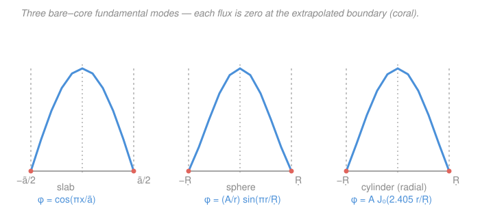

# Reactor Physics & Neutron Transport · Lesson 2.4: Bare reactor geometries & flux shapes

> ⏱ ~15 min · Module 2: The critical reactor — multiplication & buckling · Builds on: [2.3 Criticality & geometric buckling](02-03-criticality-condition-geometric-buckling.md), [1.4 One-group diffusion & boundary conditions](01-04-one-group-diffusion-boundary-conditions.md), [`pdes`](../../pdes/syllabus.md) · Unlocks: [2.5 Material buckling, critical size & mass](02-05-material-buckling-critical-size-mass.md)

## Why this matters

In [2.3](02-03-criticality-condition-geometric-buckling.md) criticality became one clean equation, $\nabla^2\phi + B^2\phi = 0$, with the promise that a bare reactor is critical when its *geometry* supplies exactly the buckling $B^2$ its *material* demands. This lesson cashes that promise: we solve the equation in the three shapes reactors actually come in — slab, sphere, cylinder — and read off both the flux shape and the geometric buckling $B_g^2$ each shape provides. That flux shape is not academic: its **peak** sets the hottest fuel pin, its **average** sets the power, and the ratio between them (the form factor) is the number that decides how hard you can push a core before the center melts while the edges loaf.

## The idea

Here is the whole trick in one breath. The critical flux obeys $\nabla^2\phi + B^2\phi = 0$ — the **Helmholtz equation**, the same eigenvalue problem you drilled in [`pdes`](../../pdes/syllabus.md). A bare reactor has one more rule from [1.4](01-04-one-group-diffusion-boundary-conditions.md): the flux falls to zero at the **extrapolated boundary**, the slightly-enlarged surface sitting about $0.71\lambda_{tr}$ beyond the physical edge (we mark extrapolated dimensions with a tilde, e.g. $\tilde a$). So criticality is a boundary-value problem: *find the standing wave that fits exactly inside the core and vanishes at its extrapolated edge.*

An eigenvalue problem on a bounded domain has many solutions — a whole ladder of standing waves, like the overtones of a drum. But a reactor gets to pick only **one**: the lowest one, the **fundamental mode**. Every higher harmonic dips negative somewhere, and a negative neutron flux is physical nonsense — you cannot have fewer than zero neutrons in a region. Only the lowest eigenfunction stays positive everywhere, so it is the only shape a steady critical reactor can wear. Its eigenvalue *is* the geometric buckling. Bigger core → longer wavelength fits → smaller $B_g^2$ → less curvature → less leakage. Buckling is literally how sharply the flux bends to reach zero at the wall, and a fat core bends gently.

## The formal version

Solve $\nabla^2\phi + B_g^2\phi = 0$ in each geometry, imposing (i) $\phi \to 0$ at the extrapolated boundary, (ii) $\phi$ finite everywhere inside, (iii) $\phi > 0$ throughout (the fundamental mode), and (iv) symmetry about the center.

**Slab** of extrapolated thickness $\tilde a$ (infinite in the other two directions), coordinate $x\in[-\tilde a/2,\,\tilde a/2]$. The Laplacian is just $d^2\phi/dx^2$:

$$\phi'' + B_g^2\phi = 0 \;\Rightarrow\; \phi(x) = \cos\!\left(\frac{\pi x}{\tilde a}\right), \qquad B_g^2 = \left(\frac{\pi}{\tilde a}\right)^2.$$

*In words: the flux is a single cosine hump spanning the slab, and the buckling is set by how thick the slab is.*

**Sphere** of extrapolated radius $\tilde R$, radial coordinate $r$:

$$\phi(r) = \frac{A}{r}\sin\!\left(\frac{\pi r}{\tilde R}\right), \qquad B_g^2 = \left(\frac{\pi}{\tilde R}\right)^2.$$

*In words: a $\sin(B r)/r$ profile — peaked and finite at the center, zero at the surface.*

**Finite cylinder** of extrapolated radius $\tilde R$ and height $\tilde H$, coordinates $(r,z)$ with $z\in[-\tilde H/2,\,\tilde H/2]$. The flux separates into a radial and an axial factor:

$$\phi(r,z) = A\, J_0\!\left(\frac{2.405\, r}{\tilde R}\right)\cos\!\left(\frac{\pi z}{\tilde H}\right), \qquad B_g^2 = \left(\frac{2.405}{\tilde R}\right)^2 + \left(\frac{\pi}{\tilde H}\right)^2,$$

where $J_0$ is the zeroth-order Bessel function and $2.405$ is its first zero. *In words: radially a Bessel hump, axially a cosine hump, and the total buckling is the sum of a radial and an axial piece.*

Notice $B_g^2$ depends **only on geometry** — no cross sections anywhere. Material enters only later, through the criticality match $B_m^2 = B_g^2$ from [2.3](02-03-criticality-condition-geometric-buckling.md).

**Form factor (peak-to-average flux).** Reactor power tracks the *average* flux, but fuel and cladding survive the *peak*. The ratio

$$f_q \equiv \frac{\phi_{\max}}{\bar\phi}$$

is a pure number fixed by the mode shape: slab $\pi/2 \approx 1.57$, sphere $\pi^2/3 \approx 3.29$, cylinder $\approx 3.64$ (the product of the radial and axial factors). *In words: a bare sphere's center runs more than three times hotter than its average — which is exactly why real cores are flattened with reflectors and zoned fuel.*

## Picture

## Worked examples

**Example 1 (sphere — solve it, then find the form factor).** Start from the radial Helmholtz equation for a sphere,

$$\frac{1}{r^2}\frac{d}{dr}\!\left(r^2\frac{d\phi}{dr}\right) + B_g^2\phi = 0.$$

The substitution $\phi = u(r)/r$ is the standard move — it collapses the spherical Laplacian to a plain 1-D one. With $\phi = u/r$ one gets $\frac{1}{r^2}(r^2\phi')' = u''/r$, so the equation becomes

$$u'' + B_g^2\,u = 0 \;\Rightarrow\; u = A\sin(B_g r) + C\cos(B_g r).$$

Now apply the conditions. **Finiteness at the center:** $\phi = u/r$ blows up as $r\to0$ unless $u(0)=0$; the cosine term violates this ($\cos 0 = 1$), so $C=0$. That leaves $\phi = \dfrac{A}{r}\sin(B_g r)$. **Zero at the surface:** $\phi(\tilde R)=0$ needs $\sin(B_g\tilde R)=0$, i.e. $B_g\tilde R = n\pi$. The fundamental mode is the smallest positive root, $n=1$:

$$B_g\tilde R = \pi \;\Rightarrow\; \boxed{B_g^2 = \left(\frac{\pi}{\tilde R}\right)^2}.$$

(Higher $n$ would put nodes *inside* the sphere — the flux would go negative — so they're discarded.)

Now the **peak-to-average ratio**. The peak is at the center; using $\lim_{r\to0}\frac{\sin(B_g r)}{r} = B_g$,

$$\phi_{\max} = A B_g.$$

The volume-average over the sphere (volume $\tfrac{4}{3}\pi\tilde R^3$) is

$$\bar\phi = \frac{1}{\tfrac{4}{3}\pi\tilde R^3}\int_0^{\tilde R}\frac{A}{r}\sin(B_g r)\,4\pi r^2\,dr = \frac{3A}{\tilde R^3}\int_0^{\tilde R} r\sin(B_g r)\,dr.$$

The integral is $\left[\dfrac{\sin(B_g r)}{B_g^2} - \dfrac{r\cos(B_g r)}{B_g}\right]_0^{\tilde R}$. At $r=\tilde R$ use $B_g\tilde R=\pi$: $\sin\pi = 0$ and $\cos\pi = -1$, leaving $\dfrac{\tilde R}{B_g}$. So

$$\bar\phi = \frac{3A}{\tilde R^3}\cdot\frac{\tilde R}{B_g} = \frac{3A}{B_g\tilde R^2} = \frac{3A}{\pi\tilde R} \quad(\text{using } B_g=\pi/\tilde R).$$

Therefore

$$f_q = \frac{\phi_{\max}}{\bar\phi} = \frac{A B_g}{3A/(\pi\tilde R)} = \frac{(\pi/\tilde R)(\pi\tilde R)}{3} = \boxed{\frac{\pi^2}{3} \approx 3.29}.$$

This is the number quoted in Boss Problem 2 — the center of a bare spherical core carries 3.29× its average flux.

**Example 2 (cylinder — separate the variables, then minimize leakage).** For a finite cylinder write $\phi(r,z) = \mathcal{R}(r)\,Z(z)$. Substituting into $\nabla^2\phi + B_g^2\phi = 0$ and dividing by $\mathcal{R}Z$:

$$\underbrace{\frac{1}{r\mathcal{R}}\frac{d}{dr}\!\left(r\frac{d\mathcal{R}}{dr}\right)}_{\text{depends only on }r} + \underbrace{\frac{1}{Z}\frac{d^2Z}{dz^2}}_{\text{depends only on }z} + B_g^2 = 0.$$

Each underbraced group depends on a different variable, so each must be a constant. Call them $-\alpha^2$ (radial) and $-\gamma^2$ (axial), with $\alpha^2 + \gamma^2 = B_g^2$.

*Radial:* $\frac{1}{r}(r\mathcal{R}')' + \alpha^2\mathcal{R} = 0$ is Bessel's equation of order zero; the finite-at-center solution is $\mathcal{R} = J_0(\alpha r)$ (the singular $Y_0$ is dropped). Zero flux at $r=\tilde R$ forces $\alpha\tilde R$ to the first zero of $J_0$: $\alpha\tilde R = 2.405 \Rightarrow \alpha = 2.405/\tilde R$.

*Axial:* $Z'' + \gamma^2 Z = 0$ with symmetry gives $Z = \cos(\gamma z)$, and $Z(\pm\tilde H/2)=0$ forces $\gamma\tilde H/2 = \pi/2$, i.e. $\gamma = \pi/\tilde H$.

Adding the two eigenvalues:

$$B_g^2 = \left(\frac{2.405}{\tilde R}\right)^2 + \left(\frac{\pi}{\tilde H}\right)^2.$$

**Minimum-leakage (minimum-volume) cylinder.** The material fixes the buckling it needs, $B_g^2 = B_m^2 = \text{const}$. Among all cylinders with that buckling, which uses the least volume $V = \pi\tilde R^2\tilde H$ (least fuel, least cost, least leakage per critical core)? Solve the constraint for $\tilde R^2 = (2.405)^2/(B_g^2 - \pi^2/\tilde H^2)$ and substitute:

$$V(\tilde H) = \frac{\pi(2.405)^2\,\tilde H}{B_g^2 - \pi^2/\tilde H^2}.$$

Setting $dV/d\tilde H = 0$ gives the tidy condition $B_g^2 = 3\pi^2/\tilde H^2$, i.e. the **axial buckling equals one-third of the total**. Then the radial buckling is the other two-thirds, and taking the ratio,

$$\frac{(\pi/\tilde H)^2}{(2.405/\tilde R)^2} = \frac{1}{2} \;\Rightarrow\; \frac{\tilde H}{\tilde R} = \frac{\pi\sqrt{2}}{2.405} \approx 1.85.$$

*In words: the leakiest thing a core can be is a pancake or a pencil; the least-wasteful bare cylinder is a little taller than it is wide, $\tilde H \approx 1.85\,\tilde R$.* This is the reactor-physics analog of "a sphere minimizes surface area" — the sphere is the true optimum, and the cylinder gets as close as a buildable shape can.

## Watch out

- **You might think the flux hits zero at the physical wall.** It hits zero at the *extrapolated* boundary $\tilde a = a + 0.71\lambda_{tr}$ (from [1.4](01-04-one-group-diffusion-boundary-conditions.md)). At the real surface the flux is small but nonzero — the "zero" lives a fraction of a mean free path *outside* the core. Always buckle with tilde dimensions, then subtract the extrapolation length to get the physical size (that's [2.5](02-05-material-buckling-critical-size-mass.md)'s job).
- **You might keep the higher harmonics.** $\cos(3\pi x/\tilde a)$ solves the same Helmholtz equation with a larger $B^2$ — but it goes negative, so it can't be a real flux. Only the all-positive fundamental mode survives; the overtones are the *approach* to criticality (transients that die away), not the critical state itself.
- **You might read $B_g^2$ as a property of the fuel.** It isn't — it's pure geometry. Two reactors of identical shape and size have identical $B_g^2$ whether they're uranium or plutonium. Composition enters only through $B_m^2$; criticality is the handshake $B_m^2 = B_g^2$.

## One-liner

> The fundamental mode of $\nabla^2\phi + B^2\phi = 0$ — cosine in a slab, $\sin(Br)/r$ in a sphere, $J_0\cos$ in a cylinder — is the only all-positive standing wave that fits the core and vanishes at its extrapolated edge, and its eigenvalue is the geometric buckling.

## Problems

**P1 (🟢)** A bare slab reactor has extrapolated thickness $\tilde a = 200\,\text{cm}$. (a) Find its geometric buckling $B_g^2$. (b) At what distance from the midplane has the flux dropped to half its peak value?

**P2 (🟡)** A bare cylinder has extrapolated dimensions $\tilde R = 50\,\text{cm}$, $\tilde H = 100\,\text{cm}$. (a) Compute $B_g^2$, splitting it into radial and axial contributions. (b) The core is critical, so $B_m^2 = B_g^2$ with diffusion length $L^2 = 60\,\text{cm}^2$. Using $B_m^2 = (k_\infty - 1)/L^2$, what $k_\infty$ does the fuel need?

**P3 (🔴)** Keep the material of P2 fixed ($B_m^2 = 0.00330\,\text{cm}^{-2}$), but now design the *minimum-volume* critical cylinder. (a) Find its extrapolated $\tilde R$ and $\tilde H$. (b) Compare its volume to the P2 cylinder and comment.

Solutions

**P1.** (a) For a slab, $B_g^2 = (\pi/\tilde a)^2$:

$$B_g^2 = \left(\frac{\pi}{200\,\text{cm}}\right)^2 = (0.015708\,\text{cm}^{-1})^2 = 2.47\times10^{-4}\,\text{cm}^{-2}.$$

(b) The shape is $\phi(x) = \phi_{\max}\cos(\pi x/\tilde a)$, so half-peak means $\cos(\pi x/\tilde a) = \tfrac12$, i.e. $\pi x/\tilde a = \pi/3$, giving

$$x = \frac{\tilde a}{3} = \frac{200}{3} \approx 66.7\,\text{cm}.$$

*Check.* Units: $(\text{cm}^{-1})^2 = \text{cm}^{-2}$ ✓. The half-flux point lies two-thirds of the way to the boundary ($66.7$ of $100$ cm), consistent with a cosine that's still near its peak in the middle and plunges near the edge. ✓

**P2.** (a) $B_g^2 = (2.405/\tilde R)^2 + (\pi/\tilde H)^2$:

$$\text{radial: } \left(\frac{2.405}{50}\right)^2 = (0.04810)^2 = 2.314\times10^{-3}\,\text{cm}^{-2},$$
$$\text{axial: } \left(\frac{\pi}{100}\right)^2 = (0.031416)^2 = 0.987\times10^{-3}\,\text{cm}^{-2},$$
$$B_g^2 = 2.314\times10^{-3} + 0.987\times10^{-3} = 3.30\times10^{-3}\,\text{cm}^{-2}.$$

(b) Criticality means $B_m^2 = B_g^2$, so $k_\infty = 1 + L^2 B_m^2$:

$$k_\infty = 1 + (60\,\text{cm}^2)(3.30\times10^{-3}\,\text{cm}^{-2}) = 1 + 0.198 = 1.20.$$

*Check.* $L^2 B^2$ is dimensionless ✓. Radial leakage dominates here because the cylinder is relatively squat; a taller, thinner core would shift the balance toward the axial term. A required $k_\infty$ of $1.20$ is a realistic infinite-medium multiplication for a thermal lattice. ✓

**P3.** (a) The minimum-volume condition from Example 2 fixes the split: axial buckling is one-third of the total, radial two-thirds. With $B^2 = 3.30\times10^{-3}\,\text{cm}^{-2}$ ($B = 0.05745\,\text{cm}^{-1}$):

$$\left(\frac{\pi}{\tilde H}\right)^2 = \frac{B^2}{3} \;\Rightarrow\; \tilde H = \frac{\pi\sqrt{3}}{B} = \frac{5.441}{0.05745} \approx 94.7\,\text{cm},$$
$$\left(\frac{2.405}{\tilde R}\right)^2 = \frac{2B^2}{3} \;\Rightarrow\; \tilde R = \frac{2.405\sqrt{3}}{B\sqrt{2}} = \frac{4.166}{0.08125} \approx 51.3\,\text{cm}.$$

The ratio $\tilde H/\tilde R = 94.7/51.3 = 1.85$ ✓, as required.

(b) Volumes:

$$V_{\text{opt}} = \pi(51.3)^2(94.7) \approx 7.82\times10^{5}\,\text{cm}^3, \qquad V_{\text{P2}} = \pi(50)^2(100) \approx 7.85\times10^{5}\,\text{cm}^3.$$

The optimum is only about $0.4\%$ smaller. *Comment:* the P2 cylinder ($\tilde H/\tilde R = 2.0$) was already close to the ideal $1.85$, and the volume minimum is *shallow* — modest departures from the optimal aspect ratio cost almost nothing. That flatness is a gift to designers: you can pick a cylinder's proportions for engineering reasons (pressure vessel, coolant flow) and pay only a tiny leakage penalty.

*Check.* Both volumes near $7.8\times10^{5}\,\text{cm}^3$ ✓, and $V_{\text{opt}} < V_{\text{P2}}$ as it must be for a true minimum. ✓

## Flashback

**From Lesson 2.3 (Material buckling):** A homogeneous fuel–moderator mixture has $k_\infty = 1.05$ and diffusion length $L = 1.5\,\text{cm}$. (a) Find the material buckling $B_m^2$. (b) If this mixture is formed into a bare critical sphere, what extrapolated radius $\tilde R$ does it need? (Fresh numbers.)

Solution

(a) Material buckling is $B_m^2 = (k_\infty - 1)/L^2$:

$$B_m^2 = \frac{1.05 - 1}{(1.5\,\text{cm})^2} = \frac{0.05}{2.25\,\text{cm}^2} = 0.0222\,\text{cm}^{-2}.$$

(b) A critical bare sphere matches $B_g^2 = B_m^2$, and $B_g^2 = (\pi/\tilde R)^2$, so $\tilde R = \pi/\sqrt{B_m^2}$:

$$\tilde R = \frac{\pi}{\sqrt{0.0222\,\text{cm}^{-2}}} = \frac{\pi}{0.1491\,\text{cm}^{-1}} \approx 21.1\,\text{cm}.$$

*Check.* Units: $(k_\infty-1)$ is dimensionless over $\text{cm}^2$ gives $\text{cm}^{-2}$ ✓; $\pi/\text{cm}^{-1} = \text{cm}$ ✓. A small $L$ (tightly-absorbing mixture) and a modest excess $k_\infty - 1 = 0.05$ produce a compact critical sphere of about 21 cm — the criticality match of [2.3](02-03-criticality-condition-geometric-buckling.md) turned into a size, which is exactly where [2.5](02-05-material-buckling-critical-size-mass.md) picks up. ✓

## Connections

- **Backward:** this is [2.3](02-03-criticality-condition-geometric-buckling.md)'s abstract $B_m^2 = B_g^2$ made concrete — we finally *compute* $B_g^2$ for real shapes — and it leans on the extrapolated-boundary condition from [1.4](01-04-one-group-diffusion-boundary-conditions.md) to know where the flux must vanish.
- **Forward:** [2.5](02-05-material-buckling-critical-size-mass.md) inverts these formulas — set $B_g^2 = B_m^2$ and solve for the critical *dimension* and *mass*, then peel off the extrapolation length to get physical size. The form factors computed here return in reactor-thermal-hydraulics as the peaking factors that limit power.
- **Sideways (PDEs):** $\nabla^2\phi + B^2\phi = 0$ with $\phi=0$ on the boundary is the exact Helmholtz eigenvalue problem from [`pdes`](../../pdes/syllabus.md) — the same separation of variables, the same "keep only the lowest eigenmode," the same Bessel functions that describe a vibrating circular drumhead. Reactor buckling and a drum's fundamental tone are the *same* mathematics; the reactor just insists the eigenfunction stay positive.
