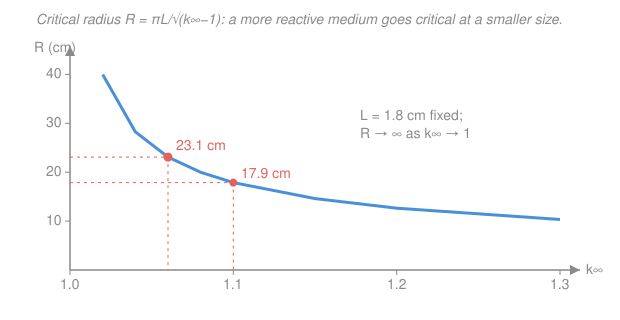

# Reactor Physics & Neutron Transport · Lesson 2.5: Material buckling, critical size & mass

> ⏱ ~15 min · Module 2: The critical reactor — multiplication & buckling · Builds on: [2.4 Bare geometries & flux shapes](02-04-bare-reactor-geometries-flux-shapes.md), [2.3 Criticality & geometric buckling](02-03-criticality-condition-geometric-buckling.md) · Unlocks: Module 3 (two-group / migration area) and [3.4 Migration area, reflectors & heterogeneity](03-04-migration-area-reflectors-heterogeneity.md)

## Why this matters

Every reactor design starts with two blunt questions: *how big* and *how much fuel*? This lesson answers both from the buckling machinery you just built. The trick is that criticality is now an equation you can solve for a length — set the material buckling equal to the geometric buckling and the critical size falls out. Get this and you can size a bare core on the back of an envelope, and you'll understand why a sphere is the cheapest shape to go critical, why a slightly richer fuel shrinks the whole reactor, and why the one-group answer you get here is optimistic in a way Module 3 has to fix.

## The idea

Two bucklings have been circling each other for three lessons. **Material buckling** $B_m^2=(k_\infty-1)/L^2$ is a property of the *stuff* — how hard the mixture pushes the chain reaction, set by composition alone, independent of size. **Geometric buckling** $B_g^2$ is a property of the *shape and size* — how curved the flux is forced to be, and therefore how fast neutrons leak out the surface.

Criticality is the handshake $B_m^2=B_g^2$: the reactivity the material offers exactly pays the leakage the geometry charges. Here's the move — for a given shape, $B_g^2$ is a known function of the dimension (a sphere has $B_g^2=(\pi/\tilde R)^2$). So the handshake becomes *one equation in one unknown length*. Solve it and you have the **critical size**. Multiply the critical volume by how much fuel is packed into it and you have the **critical mass**.

The intuition to carry: a hotter mixture (bigger $k_\infty$) can afford more leakage, so it goes critical *smaller*. Shape matters too — a sphere hides the most volume behind the least surface, so it leaks least and needs the least fuel. Everything in this lesson is that one sentence, made quantitative.

## The formal version

**The critical-size equation.** At criticality the material and geometric bucklings coincide:

$$B_m^2 = B_g^2, \qquad B_m^2=\frac{k_\infty-1}{L^2}.$$

*In words: the reactivity per unit area the fuel supplies must equal the curvature the geometry imposes.* For a **bare sphere**, [2.4](02-04-bare-reactor-geometries-flux-shapes.md) gave the fundamental mode $\phi(r)=A\,\dfrac{\sin(B_g r)}{r}$ with $B_g^2=(\pi/\tilde R)^2$, where $\tilde R$ is the **extrapolated radius** (the physical radius plus the extrapolation distance $\approx 0.71\lambda_{tr}$, so the flux hits zero just *outside* the metal). Setting $B_m=B_g$ and solving for the length:

$$\boxed{\;\tilde R=\frac{\pi}{B_m}=\frac{\pi L}{\sqrt{k_\infty-1}}\;}$$

*In words: the critical radius is $\pi$ diffusion-lengths' worth of margin, stretched by how close $k_\infty$ sits to 1.* The same recipe works for any shape — solve $B_g^2(\text{size})=B_m^2$ for the dimension. Slab of thickness $\tilde a$: $\tilde a=\pi/B_m$. Cube of side $\tilde a$: $B_g^2=3(\pi/\tilde a)^2\Rightarrow \tilde a=\pi\sqrt{3}/B_m$.

**Critical mass.** Once the critical volume $V$ is known, the mass of fissile fuel it must contain is just bookkeeping:

$$M_c = \rho_{\text{fuel}}\,V = \rho_{\text{fuel}}\cdot\tfrac{4}{3}\pi\tilde R^3,$$

where $\rho_{\text{fuel}}$ (g/cm$^3$) is the **mass of fissile nuclide per unit core volume** — the fuel loading, i.e. (mixture density) $\times$ (fissile mass fraction). *In words: critical mass = how big the core is, times how densely fuel is packed into it.* Substituting $\tilde R=\pi L/\sqrt{k_\infty-1}$ makes the sensitivities explicit:

$$M_c \;\propto\; \frac{L^3}{(k_\infty-1)^{3/2}}.$$

*In words: critical mass grows like the cube of the diffusion length and falls steeply as $k_\infty$ climbs above 1* — a small composition change moves the mass a lot, because it enters to the $3/2$ power and the radius is cubed.

**Which knobs move the size.** Read $\tilde R=\pi L/\sqrt{k_\infty-1}$ directly:

- **Larger $k_\infty$** (richer fuel, better moderation, less parasitic capture) $\Rightarrow$ **smaller** critical size. More reactivity buys more allowable leakage.
- **Smaller $L$** (more absorbing / more compact mixture) $\Rightarrow$ **smaller** critical size. Neutrons don't wander as far before being used, so less leaks out a given surface. A "more reactive" composition usually does *both* — raises $k_\infty$ and lowers $L$ — so the two effects stack.
- **Geometry** sets the shape efficiency: for a fixed volume the **sphere** minimizes surface-to-volume, so it leaks least and has the **smallest critical mass** of any shape. A long thin cylinder or a flat slab of the same volume is all surface, leaks more, and needs more fuel.

## Picture

The curve is $\tilde R=\pi L/\sqrt{k_\infty-1}$. Near $k_\infty=1$ it blows up — a barely-multiplying mixture needs an enormous (formally infinite) core to beat leakage. As the mixture gets hotter the critical radius drops fast, then flattens: past a point, extra reactivity buys little more shrinkage.

## Worked examples

**Example 1 (size and mass of a bare sphere).** A homogeneous fuel–moderator sphere has $k_\infty=1.06$ and $L=1.8$ cm. Find the material buckling, the critical extrapolated radius, and — given a fuel loading of $\rho_{\text{fuel}}=0.5$ g/cm$^3$ of fissile material — the critical mass.

*Material buckling:*

$$B_m^2=\frac{k_\infty-1}{L^2}=\frac{0.06}{(1.8)^2}=\frac{0.06}{3.24}=0.01852\ \text{cm}^{-2},\qquad B_m=0.1361\ \text{cm}^{-1}.$$

*Critical radius* (set $B_g=B_m$ for a sphere):

$$\tilde R=\frac{\pi}{B_m}=\frac{3.1416}{0.1361}=23.1\ \text{cm}.$$

*Critical volume and mass:*

$$V=\tfrac{4}{3}\pi\tilde R^3=\tfrac{4}{3}\pi(23.1)^3=5.15\times10^{4}\ \text{cm}^3\;(\approx 51.5\ \text{L}),$$

$$M_c=\rho_{\text{fuel}}\,V=0.5\ \tfrac{\text{g}}{\text{cm}^3}\times5.15\times10^{4}\ \text{cm}^3=2.58\times10^{4}\ \text{g}\approx 25.8\ \text{kg}.$$

So this mixture goes critical as a roughly soccer-ball-sized sphere holding about 26 kg of fissile fuel. (The *physical* radius is a hair under $\tilde R$ — subtract the extrapolation distance $0.71\lambda_{tr}$, a centimeter or two — but for sizing we work in extrapolated dimensions.)

**Example 2 (sensitivity — a small composition change).** Suppose better moderation lifts $k_\infty$ from $1.06$ to $1.10$, with $L$ essentially unchanged. How much does the reactor shrink?

$$B_m^2=\frac{0.10}{3.24}=0.03086\ \text{cm}^{-2},\qquad B_m=0.1757\ \text{cm}^{-1},\qquad \tilde R=\frac{\pi}{0.1757}=17.9\ \text{cm}.$$

The radius drops from 23.1 cm to 17.9 cm — a 4-point rise in $k_\infty$ shaves off 5 cm. The mass falls much harder, because mass scales as $\tilde R^3$:

$$\frac{M_c'}{M_c}=\left(\frac{17.9}{23.1}\right)^3=0.465\;\Rightarrow\; M_c'=0.465\times25.8\ \text{kg}\approx 12.0\ \text{kg}.$$

**A tiny composition tweak nearly halved the critical mass.** That $3/2$-power leverage on $(k_\infty-1)$ is why fuel enrichment and moderator choice dominate core sizing — and, run the other way, why a mixture creeping toward $k_\infty=1$ (poisons building in, fuel burning out) demands a rapidly ballooning core to stay critical. Going the other direction, if instead $L$ had grown (say a less-absorbing, more open lattice), $\tilde R=\pi L/\sqrt{k_\infty-1}$ would have grown in proportion: bigger $L$ means neutrons roam farther and leak more, so the core must be *larger*.

## Watch out

- **You might think a bigger $L$ helps you go critical smaller.** It's the opposite: $\tilde R\propto L$. A large diffusion length means neutrons take long random walks before absorption and are more likely to walk out the surface, so a *bigger* core is needed. Reactivity ($k_\infty$) shrinks the reactor; mobility ($L$) grows it.
- **You might trust the one-group critical size.** With $L$ this small (1.8 cm), one-group theory counts only *thermal* leakage and ignores that fast neutrons also stream out while slowing down. That fast leakage is captured by the Fermi age $\tau$ in Module 3, where the diffusion length is replaced by the **migration area** $M^2=L^2+\tau$. Since $\tau$ can dwarf $L^2$ in a thermal system, the true critical size can be *several times* the one-group value — see Problem 3.
- **You might size the core in physical rather than extrapolated dimensions.** The buckling formulas ($B_g^2=(\pi/\tilde R)^2$) use the *extrapolated* size where the flux vanishes; the metal ends one extrapolation distance inside that. For a big reactor the difference is negligible, but for a small tight core it matters — and a reflector (Module 3) shrinks it further via the reflector saving $\delta$.

## One-liner

> Set $B_m=B_g$ and the criticality condition becomes a ruler: $\tilde R=\pi L/\sqrt{k_\infty-1}$ — a hotter, more compact mixture goes critical smaller, and a sphere does it with the least fuel.

## Problems

**P1 (🟢)** A bare spherical reactor has $k_\infty=1.05$ and $L=2.0$ cm. Find the material buckling $B_m^2$ and the critical extrapolated radius $\tilde R$.

**P2 (🟡)** Take the sphere of P1 with a fuel loading $\rho_{\text{fuel}}=0.4$ g/cm$^3$ of fissile material. (a) Find its critical mass. (b) A design change raises $k_\infty$ to $1.09$ (same $L$). Find the new critical radius and the new critical mass, and comment on the leverage.

**P3 (🔴, connects to Module 3)** For the Example-1 mixture ($k_\infty=1.06$, $L=1.8$ cm) one-group theory gave $\tilde R\approx23.1$ cm. But the fast neutrons also leak while slowing down, with Fermi age $\tau=27$ cm$^2$. Using the migration-area estimate $B_m^2\approx(k_\infty-1)/M^2$ with $M^2=L^2+\tau$, recompute the critical radius. What does the comparison tell you about one-group theory here?

Solutions

**P1.** Material buckling from composition:

$$B_m^2=\frac{k_\infty-1}{L^2}=\frac{0.05}{(2.0)^2}=\frac{0.05}{4.0}=0.0125\ \text{cm}^{-2},\qquad B_m=0.1118\ \text{cm}^{-1}.$$

Critical radius for a sphere ($B_g=B_m$):

$$\tilde R=\frac{\pi}{B_m}=\frac{3.1416}{0.1118}=28.1\ \text{cm}.$$

*Check.* Units: $[k_\infty]$ is dimensionless, so $B_m^2$ has units cm$^{-2}$ ✓; $\tilde R=\pi/B_m$ is cm ✓. Larger $L$ (2.0 vs 1.8) and smaller $k_\infty$ (1.05 vs 1.06) than Example 1, so a bigger core (28.1 vs 23.1 cm) — both effects push the same way. ✓

**P2.** (a) Critical volume and mass:

$$V=\tfrac{4}{3}\pi(28.1)^3=9.29\times10^{4}\ \text{cm}^3,\qquad M_c=0.4\times9.29\times10^{4}=3.72\times10^{4}\ \text{g}\approx 37.2\ \text{kg}.$$

(b) With $k_\infty=1.09$:

$$B_m^2=\frac{0.09}{4.0}=0.0225\ \text{cm}^{-2},\quad B_m=0.15\ \text{cm}^{-1},\quad \tilde R=\frac{\pi}{0.15}=20.9\ \text{cm}.$$

$$\frac{M_c'}{M_c}=\left(\frac{20.9}{28.1}\right)^3=0.414\;\Rightarrow\;M_c'=0.414\times37.2\approx 15.4\ \text{kg}.$$

*Comment.* Raising $k_\infty$ from $1.05$ to $1.09$ — a change of $0.04$ — cut the critical mass by nearly 60% (37.2 → 15.4 kg). The $M_c\propto(k_\infty-1)^{-3/2}$ scaling means the reactor is most sensitive to composition exactly when $k_\infty$ is near 1: $(k_\infty-1)$ went from $0.05$ to $0.09$, a factor $1.8$, and $1.8^{3/2}=2.42$, i.e. mass down by $1/2.42=0.414$. ✓

**P3.** Migration area and corrected buckling:

$$M^2=L^2+\tau=(1.8)^2+27=3.24+27=30.24\ \text{cm}^2.$$

$$B_m^2\approx\frac{k_\infty-1}{M^2}=\frac{0.06}{30.24}=1.98\times10^{-3}\ \text{cm}^{-2},\qquad B_m=0.0445\ \text{cm}^{-1}.$$

$$\tilde R=\frac{\pi}{B_m}=\frac{3.1416}{0.0445}\approx 70.5\ \text{cm}.$$

*Comment.* The critical radius jumps from 23.1 cm to about **70.5 cm** — roughly triple — and the volume (hence critical mass) by a factor $(70.5/23.1)^3\approx 28$. The one-group answer was wildly optimistic *because* $L$ was tiny: here $\tau=27$ cm$^2$ dwarfs $L^2=3.24$ cm$^2$, so almost all the real leakage happens while neutrons are fast and slowing down — exactly the physics one-group theory throws away. This is the whole reason Module 3 upgrades to two-group / migration-area theory. ✓

## Flashback

**From Lesson 2.4 (bare geometries & flux shapes) — fresh variant.** A bare uniform reactor is modeled as an infinite slab of extrapolated thickness $\tilde a=200$ cm, with fundamental-mode flux $\phi(x)=A\cos(\pi x/\tilde a)$ measured from the mid-plane. Find the geometric buckling $B_g^2$ and the peak-to-average flux ratio (the form factor).

Solution

The slab fundamental mode solves $\phi''+B_g^2\phi=0$ with $\phi=A\cos(\pi x/\tilde a)$, so

$$B_g^2=\left(\frac{\pi}{\tilde a}\right)^2=\left(\frac{\pi}{200}\right)^2=(0.01571)^2=2.47\times10^{-4}\ \text{cm}^{-2}.$$

Peak flux is at the center, $\phi_{\max}=A$. The average over the slab $-\tilde a/2\le x\le \tilde a/2$:

$$\bar\phi=\frac{1}{\tilde a}\int_{-\tilde a/2}^{\tilde a/2}A\cos\!\frac{\pi x}{\tilde a}\,dx=\frac{A}{\tilde a}\cdot\frac{\tilde a}{\pi}\Big[\sin\tfrac{\pi x}{\tilde a}\Big]_{-\tilde a/2}^{\tilde a/2}=\frac{A}{\pi}\big(\sin\tfrac{\pi}{2}-\sin(-\tfrac{\pi}{2})\big)=\frac{2A}{\pi}.$$

$$\frac{\phi_{\max}}{\bar\phi}=\frac{A}{2A/\pi}=\frac{\pi}{2}\approx 1.57.$$

*Check.* The ratio is dimensionless and greater than 1 (peak beats average) ✓. The slab form factor $\pi/2\approx1.57$ is milder than a sphere's $\pi^2/3\approx3.29$ — a slab's flux is flatter across its width than a sphere's is across its radius, so the slab wastes less peak-power margin. ✓

## Connections

- **Backward:** this closes Module 2 by turning [2.3](02-03-criticality-condition-geometric-buckling.md)'s criticality condition $B_m^2=B_g^2$ and [2.4](02-04-bare-reactor-geometries-flux-shapes.md)'s geometric bucklings into an actual size and mass. The four-/six-factor $k_\infty$ from [2.1](02-01-k-infinity-four-factor-formula.md)–[2.2](02-02-leakage-six-factor-formula.md) is the single composition number that drives the whole shrink-with-reactivity curve.
- **Forward:** Problem 3 previews [3.3 Two-group diffusion theory](03-03-two-group-diffusion-theory.md) and [3.4 Migration area, reflectors & heterogeneity](03-04-migration-area-reflectors-heterogeneity.md), where $L^2\to M^2=L^2+\tau$ fixes the fast-leakage blind spot, and a reflector's saving $\delta$ shrinks the physical critical size further.
- **Sideways (PDEs):** solving $\nabla^2\phi+B^2\phi=0$ for the size that admits a nonnegative fundamental mode is the Helmholtz eigenvalue problem from [`pdes`](../../pdes/syllabus.md) — the critical dimension is exactly the value that makes the lowest Dirichlet eigenvalue equal $B_m^2$, the reactor-physics twin of finding the fundamental frequency of a drum.
