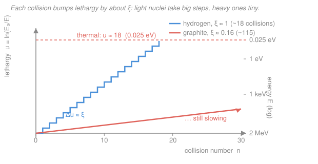

# Reactor Physics & Neutron Transport · Lesson 3.1: Slowing down — lethargy & the slowing-down density

> ⏱ ~15 min · Module 3: Spectra, slowing-down & few-group methods · Builds on: [`intro-nuclear-engineering`](../../intro-nuclear-engineering/syllabus.md), [2.5 Material buckling, critical size & mass](02-05-material-buckling-critical-size-mass.md) · Unlocks: [3.2 Resonance escape & Fermi age](03-02-resonance-escape-fermi-age.md)

## Why this matters

A fission neutron is born fast — about 2 MeV — but it fissions $^{235}$U best when it's slow, down at thermal energies around 0.025 eV. Everything between those two numbers is the job of the **moderator**, and how *efficiently* it drags a neutron down that eight-orders-of-magnitude slope decides whether your reactor is small and cheap or a graphite pile the size of a house. It also decides the two rival factors in $k_\infty$: slow the neutron in as little space as possible (good for leakage and for staying clear of the $^{238}$U resonances), but do it without letting the moderator itself eat neutrons. This lesson gives you the bookkeeping — lethargy, $\xi$, and the slowing-down density $q$ — that makes "moderation" a number.

## The idea

Watch one neutron bounce off light nuclei. Each **elastic scatter** is like a cue ball hitting another ball: the neutron ricochets off and hands over a chunk of its energy. Off hydrogen (a nucleus almost its own mass) it can lose *everything* in one hit; off carbon (twelve times heavier) it barely dents — a ping-pong ball off a bowling ball comes back with nearly all its speed.

Here's the clean surprise: neutrons don't lose a fixed *amount* of energy per collision, they lose a fixed *fraction*. A collision that takes you from 2 MeV to 1 MeV and one that takes you from 2 eV to 1 eV are, physically, the same kind of event. So the natural ruler isn't energy — it's the **logarithm** of energy. Measure "how far down" a neutron has come by $\ln(E_0/E)$, call it **lethargy**, and each collision advances it by roughly a *constant step*, no matter where on the slope it is. Slowing down becomes a staircase climbed at a steady pace: count the steps, divide by the step size, and you know how many collisions it takes to reach the bottom.

## The formal version

**Lethargy.** Pick a reference energy $E_0$ (usually the fission source, $\sim 2\ \text{MeV}$). A neutron at energy $E$ has lethargy

$$u \equiv \ln\!\frac{E_0}{E}.$$

*In words: lethargy is a dimensionless "how tired" coordinate that starts at $0$ when the neutron is born and climbs as it slows — it runs backwards to energy.* Thermal energy $0.025\ \text{eV}$ sits at $u_{th}=\ln(2\times10^6/0.025)\approx 18.2$.

**Energy loss per collision.** For an elastic scatter off a nucleus of mass number $A$, the neutron's energy after the collision lies somewhere in $[\alpha E,\, E]$, where

$$\alpha \equiv \left(\frac{A-1}{A+1}\right)^2.$$

*In words: $\alpha$ is the worst the neutron can do — the fraction of energy it keeps in a dead-on head-collision.* For hydrogen $A=1$, $\alpha=0$: a head-on hit stops it cold. For carbon $A=12$, $\alpha=0.716$: even the best hit removes under 30%.

For isotropic scattering (true in the center of mass at low energies), the outgoing energy is *uniformly distributed* on $[\alpha E, E]$. The average **lethargy gain per collision** is then an expectation over that uniform spread. With $x=E'/E$ uniform on $[\alpha,1]$ (density $1/(1-\alpha)$),

$$\xi \equiv \langle \Delta u\rangle = \frac{1}{1-\alpha}\int_\alpha^1 \ln\!\frac1x\,dx = 1+\frac{\alpha\ln\alpha}{1-\alpha}.$$

*In words: $\xi$ is the average step size of the lethargy staircase — and, crucially, it does not depend on the neutron's current energy.* (The integral $\int_\alpha^1(-\ln x)\,dx=[x-x\ln x]_\alpha^1=1-\alpha+\alpha\ln\alpha$ gives the formula; this is exactly the weighted-average-over-a-density move from [`calc-refresher`](../../calc-refresher/syllabus.md).)

**Collisions to thermalize.** Since each collision adds $\xi$ to $u$ on average, the number of collisions to fall from $E_0$ to $E_{th}$ is just total distance over step size:

$$N \approx \frac{u_{th}}{\xi}=\frac{\ln(E_0/E_{th})}{\xi}.$$

*In words: divide the whole lethargy slope by the average step to count the bounces.*

**Moderating power and moderating ratio.** A good moderator must slow neutrons *fast in space* and *cleanly*. Two figures of merit:

$$\underbrace{\xi\Sigma_s}_{\text{moderating power}},\qquad \underbrace{\frac{\xi\Sigma_s}{\Sigma_a}}_{\text{moderating ratio}}.$$

*In words: moderating power $\xi\Sigma_s$ is the lethargy gained per cm of travel (step size $\times$ collisions per cm) — how compactly it moderates; the moderating ratio weighs that against how many neutrons the moderator absorbs — how honestly it moderates.* $\Sigma_s$ and $\Sigma_a$ are the macroscopic scattering and absorption cross sections from [1.2](01-02-cross-sections-flux-reaction-rates.md).

**Slowing-down density.** Define

$$q(E)=\text{neutrons slowing down past energy } E,\ \text{per cm}^3\text{ per s}.$$

*In words: $q$ is the downward current on the energy axis — the rate at which neutrons cross a given energy on their way to thermal.* In the asymptotic region (below the source, above thermal, absorption negligible), every neutron born must pass every energy exactly once, so $q$ is *constant in energy* and equals the source rate. It ties to the flux by

$$\boxed{\,q=\xi\,\Sigma_s\,\phi(u)\,}$$

where $\phi(u)$ is the flux per unit lethargy. *In words: the flow past an energy equals (collisions per cm$^3$ per s $=\Sigma_s\phi$) $\times$ (lethargy each collision carries a neutron down $=\xi$).* Constant $q$ then forces $\phi(u)=q/(\xi\Sigma_s)=\text{const}$, i.e. the famous $\phi(E)\propto 1/E$ slowing-down spectrum — the launching point for Fermi age in [3.2](03-02-resonance-escape-fermi-age.md).

## Picture

## Worked examples

**Example 1 (mechanical — carbon, start to finish).** How many collisions does graphite need to thermalize a fission neutron?

Mass number $A=12$:

$$\alpha=\left(\frac{12-1}{12+1}\right)^2=\left(\frac{11}{13}\right)^2=0.716.$$

$$\xi=1+\frac{\alpha\ln\alpha}{1-\alpha}=1+\frac{0.716\,\ln(0.716)}{1-0.716}=1+\frac{0.716\,(-0.334)}{0.284}=1-0.842=0.158.$$

The lethargy slope from $E_0=2\ \text{MeV}$ to $E_{th}=0.025\ \text{eV}$ is

$$u_{th}=\ln\!\frac{2\times10^6}{0.025}=\ln(8\times10^7)=18.2,$$

so

$$N=\frac{u_{th}}{\xi}=\frac{18.2}{0.158}\approx 115\ \text{collisions.}$$

Compare hydrogen ($\xi=1$): $N\approx 18$. Graphite needs six times as many bounces — which is exactly why a graphite-moderated core is *large*: the neutron has to travel far to rack up 115 collisions.

**Example 2 (why you'd care — power vs. cleanliness).** Two moderators, representative thermal data:

| Moderator | $\xi$ | $\Sigma_s$ (cm$^{-1}$) | $\Sigma_a$ (cm$^{-1}$) | $\xi\Sigma_s$ (cm$^{-1}$) | $\xi\Sigma_s/\Sigma_a$ |
|---|---|---|---|---|---|
| Light water H$_2$O | 0.92 | 1.47 | 0.022 | 1.35 | 61 |
| Graphite | 0.158 | 0.385 | 0.00030 | 0.061 | 203 |

Water's **moderating power** $1.35\ \text{cm}^{-1}$ dwarfs graphite's $0.061$ — hydrogen's big $\xi$ and dense scattering slow a neutron to thermal in a few centimetres, so water reactors are compact. But water's **moderating ratio** is only $61$ against graphite's $203$: those same hydrogen nuclei absorb neutrons (radiative capture into deuterium). 

Now the punchline that runs the industry. **Heavy water** D$_2$O has a modest moderating power ($\xi\Sigma_s\approx0.18$) but a moderating ratio of *several thousand* — deuterium almost never absorbs. That spare margin of neutrons is exactly what lets a D$_2$O reactor (CANDU) go critical on **natural, unenriched uranium**, where light-water designs must enrich. In four-factor language ([2.1](02-01-k-infinity-four-factor-formula.md)): a high moderating ratio protects the thermal utilization $f$ (fewer neutrons lost to the moderator), while slowing neutrons quickly protects the resonance escape $p$ (less time lingering at $^{238}$U resonance energies). Moderator choice *is* that trade-off, priced in neutrons.

## Watch out

- **You might think lethargy is just energy renamed.** It's the *logarithm* of energy, running the opposite way: $u=0$ at birth (high $E$), rising to $\sim18$ at thermal. The point of the switch is that collisions add a constant $\xi$ in $u$, but a wildly varying amount in $E$ — the log is what makes the staircase even.
- **You might read $\xi$ as the fractional energy loss per collision.** It's the average loss in *lethargy*, i.e. the average of $\ln(E/E')$, not of $(E-E')/E$. Because it's a log-average it's a fixed step regardless of energy; a plain fractional-energy average would not be.
- **You might expect $q$ to fall off as neutrons slow.** In the clean asymptotic region it's *constant* — every neutron that starts must cross every energy on its way down, so the downward flow is the same at each energy. $q$ only drops where absorption steals neutrons mid-slide (the resonances of [3.2](03-02-resonance-escape-fermi-age.md)) or once they reach thermal and pile up.

## One-liner

> Measure slowing-down in lethargy $u=\ln(E_0/E)$ and every collision becomes the same step $\xi$ — so it takes $\approx u_{th}/\xi$ bounces to thermalize, and the steady downhill flow is $q=\xi\Sigma_s\phi$.

## Problems

**P1 (🟢)** Beryllium ($A=9$) is a candidate moderator. Compute $\alpha$ and $\xi$, and estimate the number of collisions to slow a $2\ \text{MeV}$ neutron to $0.025\ \text{eV}$. Where does it land relative to hydrogen and carbon?

**P2 (🟡)** Using the Example 2 table (or your own consistent numbers), explain in one short paragraph why light water gives a *smaller* reactor than graphite but *cannot* run on natural uranium, while heavy water can. Name which four-factor quantities each effect touches.

**P3 (🔴, optional)** In an infinite moderator with a source of $S=10^{12}$ neutrons/cm$^3$/s at high energy and negligible absorption during slowing-down, take $\xi=0.92$ and $\xi\Sigma_s=1.35\ \text{cm}^{-1}$. (a) State the slowing-down density $q$ in the asymptotic region and justify it. (b) Find the flux per unit lethargy $\phi(u)$. (c) Show the energy flux obeys $\phi(E)\propto 1/E$.

Solutions

**P1** With $A=9$:

$$\alpha=\left(\frac{9-1}{9+1}\right)^2=\left(\frac{8}{10}\right)^2=0.64,\qquad \ln\alpha=\ln0.64=-0.446.$$

$$\xi=1+\frac{0.64(-0.446)}{1-0.64}=1+\frac{-0.2856}{0.36}=1-0.793=0.207.$$

Collisions: $N=u_{th}/\xi=18.2/0.207\approx 88$. So beryllium sits between hydrogen ($\approx18$) and carbon ($\approx115$) — heavier than carbon per nucleus it is not, but $A=9$ gives a $\xi$ a hair above graphite's, so it thermalizes in appreciably fewer collisions than graphite while still needing far more than water. (Its real appeal is a low $\Sigma_a$ and a high moderating ratio, plus an $(n,2n)$ reaction — but that's beyond one-speed bookkeeping.)

*Check.* $\xi$ decreasing with $A$ (H $1$ → Be $0.21$ → C $0.16$) and $N$ increasing accordingly is the expected monotone trend. ✓

**P2** Light water's moderating power $\xi\Sigma_s=1.35\ \text{cm}^{-1}$ is $\sim\!22\times$ graphite's $0.061$, so a neutron reaches thermal in a few centimetres instead of tens — the core can be small. But water's moderating ratio ($\approx61$) is low because hydrogen absorbs: too many thermal neutrons are captured by the moderator, cutting the **thermal utilization $f$** (the fraction of thermal absorptions that happen in fuel). On natural uranium — already neutron-poor because only 0.7% is fissile $^{235}$U — that loss pushes $k_\infty$ below 1. Heavy water keeps the fast slowing-down (protecting **resonance escape $p$**, since neutrons spend little time at the $^{238}$U resonances) but has a moderating ratio in the thousands: deuterium barely absorbs, so $f$ stays high and the spare neutrons let natural uranium go critical. The size penalty (D$_2$O's lower moderating power means a bigger core) is the price paid for skipping enrichment.

**P3** (a) With absorption negligible below the source, **no neutron is removed while slowing down**, so every neutron the source emits must cross each energy exactly once. The downward flow past any energy therefore equals the emission rate: $q=S=10^{12}$ neutrons/cm$^3$/s, and it is constant in energy.

(b) From $q=\xi\Sigma_s\,\phi(u)$,

$$\phi(u)=\frac{q}{\xi\Sigma_s}=\frac{10^{12}}{1.35}\approx 7.4\times10^{11}\ \text{neutrons/cm}^2\text{/s per unit lethargy},$$

a *constant* in $u$ — the flat lethargy spectrum.

(c) Flux is conserved between the two ways of slicing the axis: $\phi(E)\,|dE|=\phi(u)\,du$. Since $u=\ln(E_0/E)$, $du=-\,dE/E$, so $|du/dE|=1/E$ and

$$\phi(E)=\phi(u)\left|\frac{du}{dE}\right|=\frac{\phi(u)}{E}\propto\frac{1}{E}.$$

*Check.* Constant $q$ and constant $\phi(u)$ are two faces of the same statement; the $1/E$ energy spectrum is the hallmark of a pure slowing-down region and is what [3.2](03-02-resonance-escape-fermi-age.md) perturbs with resonance absorption. ✓

## Flashback

**From Lesson 2.5 (Material buckling, critical size & mass):** A bare spherical reactor is a homogeneous fuel–moderator mix with $k_\infty=1.04$ and one-group diffusion length $L=2.2\ \text{cm}$. Find the material buckling $B_m^2$ and the critical *extrapolated* radius.

Solution

Material buckling from one-group theory:

$$B_m^2=\frac{k_\infty-1}{L^2}=\frac{0.04}{(2.2)^2}=\frac{0.04}{4.84}=8.26\times10^{-3}\ \text{cm}^{-2}.$$

Criticality matches this to the sphere's geometric buckling $B_g^2=(\pi/\tilde R)^2$, so

$$\tilde R=\frac{\pi}{B_m}=\frac{\pi}{\sqrt{8.26\times10^{-3}}}=\frac{\pi}{0.0909}\approx 34.6\ \text{cm}.$$

*Check.* Units: $B_m^2$ in cm$^{-2}$ → $B_m$ in cm$^{-1}$ → $\tilde R$ in cm. ✓ A weakly multiplying core ($k_\infty$ only $4\%$ over 1) needs a large radius — halving $k_\infty-1$ would grow $\tilde R$ by $\sqrt2$, exactly the size-vs-composition sensitivity from 2.5. The *physical* radius is a little smaller, $R=\tilde R-0.71\lambda_{tr}$.

## Connections

- **Backward:** the whole scheme rides on the macroscopic cross sections $\Sigma_s,\Sigma_a$ from [1.2](01-02-cross-sections-flux-reaction-rates.md); moderating ratio is just those two quantities weighed against each other, and it directly feeds the thermal utilization $f$ and resonance escape $p$ of the four-factor formula in [2.1](02-01-k-infinity-four-factor-formula.md).
- **Forward:** [3.2 Resonance escape & Fermi age](03-02-resonance-escape-fermi-age.md) turns the constant slowing-down density $q$ into a continuous *spatial* diffusion in lethargy — the Fermi age $\tau$ that measures how far, in cm$^2$, a neutron wanders while thermalizing, giving the fast non-leakage $e^{-B^2\tau}$.
- **Sideways (calculus / probability):** $\xi$ is a textbook expectation — the mean of $\ln(E/E')$ over a uniform post-collision energy, the same weighted-average-over-a-density integral you met in [`calc-refresher`](../../calc-refresher/syllabus.md). And $\phi(u)$ constant $\Leftrightarrow$ $\phi(E)\propto1/E$ is a change-of-variables ($u=\ln E_0/E$) done exactly as in a probability density transformation.
