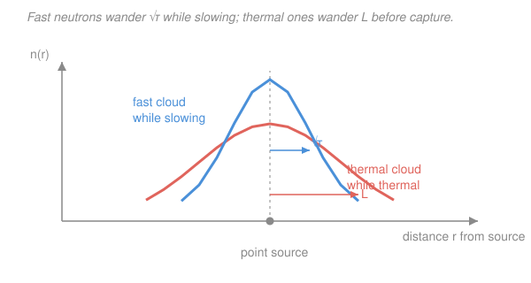

# Reactor Physics & Neutron Transport · Lesson 3.2: Resonance escape & Fermi age theory

> ⏱ ~15 min · Module 3: Spectra, slowing-down & few-group methods · Builds on: [3.1 Slowing down: lethargy & the slowing-down density](03-01-slowing-down-lethargy-density.md), [1.5 Diffusion length & source problems](01-05-diffusion-length-source-problems.md) · Unlocks: [3.3 Two-group diffusion theory](03-03-two-group-diffusion-theory.md)

## Why this matters

A neutron is born fast (~2 MeV) and fissions best when slow (~0.025 eV), and the trip down is a minefield. Sitting in the middle of the energy range are the $^{238}$U capture resonances — narrow spikes where the absorption cross section jumps from a few barns to *thousands*. A neutron that lands on one is gone: captured, not thermalized, a lost member of the next generation. The fraction that slips *past* every resonance is the resonance escape probability $p$ — one of the four factors in $k_\infty=\eta f p\varepsilon$ from [2.1](02-01-k-infinity-four-factor-formula.md). And even the survivors don't sit still: they wander in space while slowing, and if the reactor is small they leak out before ever reaching thermal. Fermi age theory measures exactly how far they wander — and hands you the fast non-leakage probability that finishes the six-factor formula.

## The idea

Two ideas, one theme: **treat slowing-down as continuous**.

**Resonance escape.** In [3.1](03-01-slowing-down-lethargy-density.md) a neutron slid down the energy scale in discrete lethargy steps of average size $\xi$. Picture that staircase crossing the resonance band. Each step is a gamble: land on a $^{238}$U resonance and you're absorbed; land between them and you survive to step again. Two things raise your odds. Bigger steps (larger $\xi$ — a better moderator) *hop over* the narrow resonances instead of dwelling in them. And more moderator relative to fuel means each step is far more likely a harmless scatter off the moderator than a capture on the fuel. So $p$ rises with **moderating power per unit fuel**.

**Fermi age.** Now zoom out. A neutron takes ~100 tiny steps to thermalize (3.1), so instead of tracking each one, smear them into a continuous flow — the neutron "diffuses down in energy." Here's the payoff: while it diffuses in energy it also diffuses in *space*, and the two are locked together. The accumulated spatial spread has a name, the **Fermi age** $\tau$, and — this is the whole trick — the equation governing it is the *heat equation*, with $\tau$ playing the role of time. This is the fast-neutron twin of the diffusion length $L$ from [1.5](01-05-diffusion-length-source-problems.md): there, $L$ measured how far a *thermal* neutron crow-flies before capture; here, $\sqrt\tau$ measures how far a *fast* neutron crow-flies before it goes thermal.

## The formal version

**The resonance integral.** Package all the resonance absorption into one number:

$$I=\int \sigma_a^{\text{res}}(E)\,\frac{dE}{E},$$

where $\sigma_a^{\text{res}}(E)$ is the $^{238}$U absorption cross section (barns) across the resonance region and $dE/E=du$ is a lethargy element. *In words: $I$ is the total resonance absorption a neutron sees per unit lethargy as it slides down through the traps* — units of barns.

**Resonance escape probability.** Over a lethargy step $du$, the chance of being caught by fuel rather than scattered by moderator is $\dfrac{N_F\sigma_a^{\text{res}}}{\xi\Sigma_s}\,du$, where $N_F$ is the fuel ($^{238}$U) number density (cm$^{-3}$) and $\xi\Sigma_s$ is the moderating power (cm$^{-1}$) from [3.1](03-01-slowing-down-lethargy-density.md). Surviving every step multiplies these escapes together, and $\prod(1-\text{small})\to\exp(-\sum)$:

$$\boxed{\,p=\exp\!\left(-\frac{N_F\,I}{\xi\Sigma_s}\right)}$$

*In words: $p$ is the fraction of neutrons that thread all the $^{238}$U resonances without capture — set by a tug-of-war between fuel resonance absorption ($N_F I$) and moderator slowing-down power ($\xi\Sigma_s$).* More moderator, or a moderator with bigger $\xi$, shrinks the exponent and pushes $p$ toward 1.

**Continuous slowing-down: the age equation.** Let $q(\mathbf r,\tau)$ be the slowing-down density from [3.1](03-01-slowing-down-lethargy-density.md) — the rate (neutrons·cm$^{-3}$·s$^{-1}$) crossing a given energy — now tracked in space and in "age" $\tau$. Fermi's continuous-slowing-down model gives

$$\nabla^2 q=\frac{\partial q}{\partial\tau}.$$

*In words: this is the heat equation. As neutrons age (slow down, $\tau$ grows), their spatial distribution diffuses outward exactly as heat spreads in time* — $\tau$ is a mathematical stand-in for time.

**The Fermi age.** The variable $\tau$ accumulates as the neutron slows:

$$\tau(E)=\int_E^{E_0}\frac{D(E')}{\xi\Sigma_s}\,\frac{dE'}{E'},\qquad [\tau]=\frac{\text{cm}}{\text{cm}^{-1}}=\text{cm}^2,$$

with $D=1/(3\Sigma_{tr})$ the diffusion coefficient (cm) from [1.3](01-03-diffusion-approximation-ficks-law.md). Solving the age equation from a point source shows $q$ spreads as a Gaussian with mean-square crow-flight distance $\langle r^2\rangle_{\text{slowing}}=6\tau$, i.e.

$$\tau=\tfrac16\langle r^2\rangle_{\text{slowing}}.$$

*In words: $\tau$ (an area, NOT a time) is one-sixth the mean-square straight-line distance a neutron travels between birth and thermalization* — precisely the role $L^2=\tfrac16\langle r^2\rangle$ played for thermal capture in [1.5](01-05-diffusion-length-source-problems.md). Its square root $\sqrt\tau$ is a length, the *slowing-down length*.

**Fast non-leakage probability.** In a bare reactor the flux (and $q$) ride the fundamental spatial mode with $\nabla^2\to -B^2$ (the geometric buckling from [2.3](02-03-criticality-condition-geometric-buckling.md)). The age equation then collapses to an ODE in $\tau$, $-B^2 q=\partial q/\partial\tau$, so $q(\tau)=q(0)\,e^{-B^2\tau}$. The fraction of fast neutrons that reach thermal energy *without leaking out* is that survival factor:

$$\boxed{\,P_{FNL}=e^{-B^2\tau}}$$

*In words: fast neutrons leak while slowing down; the survivors are the fundamental mode decayed over "time" $\tau$* — the same mode-decay that governs heat cooling. Combined with the thermal non-leakage $P_{TNL}=1/(1+L^2B^2)$ from Module 1–2, this completes $k_{\text{eff}}=k_\infty P_{FNL}P_{TNL}$.

## Picture

One source, two clouds. The blue cloud is where fast neutrons *finish slowing down* — its width is the slowing-down length $\sqrt\tau$. The coral cloud is where those now-thermal neutrons *finally get captured* — its width is the diffusion length $L$ from [1.5](01-05-diffusion-length-source-problems.md). A neutron's whole spatial journey is these two random walks stacked end to end; their mean-square distances simply add, previewing the migration area $M^2=L^2+\tau$ of [3.4](03-04-migration-area-reflectors-heterogeneity.md).

## Worked examples

**Example 1 (resonance escape — read the tug-of-war).** A homogeneous fuel–moderator mixture has $^{238}$U density $N_F=1.5\times10^{20}\,\text{cm}^{-3}$, effective resonance integral $I=300\,\text{b}=300\times10^{-24}\,\text{cm}^2$, and moderating power $\xi\Sigma_s=0.20\,\text{cm}^{-1}$. Find $p$.

First the fuel-absorption rate per lethargy (units cm$^{-1}$, so the exponent is dimensionless):

$$N_F I=(1.5\times10^{20})(300\times10^{-24})=0.045\,\text{cm}^{-1}.$$

Then

$$\frac{N_F I}{\xi\Sigma_s}=\frac{0.045}{0.20}=0.225,\qquad p=e^{-0.225}=0.798.$$

So ~80% of neutrons thread the resonances; ~20% are lost to $^{238}$U capture. **Now add moderator** until $\xi\Sigma_s$ doubles to $0.40\,\text{cm}^{-1}$ (same fuel). The exponent halves to $0.1125$:

$$p=e^{-0.1125}=0.894.$$

Diluting the fuel with moderator lifts $p$ from 0.80 to 0.89 — every extra scatter is another chance to hop *over* a resonance instead of into it. (In a real lattice you can also raise $p$ by *lumping* the fuel so its interior self-shields the resonances; that lowers the *effective* $I$ — heterogeneity, [3.4](03-04-migration-area-reflectors-heterogeneity.md).)

**Example 2 (fast non-leakage vs thermal non-leakage).** A bare reactor has Fermi age $\tau=40\,\text{cm}^2$, thermal diffusion area $L^2=60\,\text{cm}^2$, and geometric buckling $B^2=0.0020\,\text{cm}^{-2}$. Compare the two leakages.

Fast (while slowing):

$$P_{FNL}=e^{-B^2\tau}=e^{-(0.0020)(40)}=e^{-0.08}=0.923\quad\Rightarrow\quad \text{7.7\% leak fast.}$$

Thermal (after thermalizing):

$$P_{TNL}=\frac{1}{1+L^2B^2}=\frac{1}{1+(0.0020)(60)}=\frac{1}{1.12}=0.893\quad\Rightarrow\quad \text{10.7\% leak thermal.}$$

Here the thermal neutrons wander farther ($L^2=60>\tau=40$) so they leak more, but both losses are real and both shrink as the core grows (smaller $B^2$). Note the two formulas have *different shapes* — an exponential for fast, a rational for thermal — yet the total non-leakage is $P_{FNL}P_{TNL}=0.824$, and $e^{-M^2B^2}=e^{-(100)(0.0020)}=e^{-0.20}=0.819$ with $M^2=L^2+\tau=100\,\text{cm}^2$. They nearly agree: for small $B^2$ the two spreads simply add into one migration area (the shortcut of [3.4](03-04-migration-area-reflectors-heterogeneity.md)).

## Watch out

- **You might read "age" as a time — it is an area, cm$^2$.** $\tau$ is a squared *length*, one-sixth of $\langle r^2\rangle_{\text{slowing}}$. It earns the name "age" only because it plays the mathematical role of time in the heat-equation $\nabla^2 q=\partial q/\partial\tau$, not because any clock is ticking.
- **You might expect $P_{FNL}$ and $P_{TNL}$ to have the same form.** They don't: fast slowing-down is a one-way Gaussian spread (heat-equation propagator, giving $e^{-B^2\tau}$), while thermal diffusion is a steady balance between diffusion and capture (giving $1/(1+L^2B^2)$). They agree only to first order in $B^2$.
- **You might think a "better moderator" only means faster thermalizing.** It also raises $p$ directly through $\xi\Sigma_s$ in the denominator — but pile in *too* much moderator and you dilute the fuel and hurt the thermal utilization $f$. The four factors trade against each other; there is an optimum moderator-to-fuel ratio.

## One-liner

> Slowing down is diffusion in disguise: $p=\exp(-N_F I/\xi\Sigma_s)$ is the fraction that slips past the $^{238}$U resonances, and the Fermi age $\tau$ — an area, not a time — measures how far fast neutrons wander before going thermal, giving $P_{FNL}=e^{-B^2\tau}$.

## Problems

**P1 (🟢)** A homogeneous mixture has $N_F=2.0\times10^{20}\,\text{cm}^{-3}$, effective resonance integral $I=250\,\text{b}$, and moderating power $\xi\Sigma_s=0.25\,\text{cm}^{-1}$. (a) Compute the resonance escape probability $p$. (b) A redesign doubles the moderating power to $0.50\,\text{cm}^{-1}$. Find the new $p$ and say in one sentence why it rose.

**P2 (🟡)** A small water-moderated core has $\tau=27\,\text{cm}^2$, $L^2=8\,\text{cm}^2$, and $B^2=0.0025\,\text{cm}^{-2}$. (a) Find $P_{FNL}$ and $P_{TNL}$. (b) Find the total non-leakage $P_{FNL}P_{TNL}$, and compare it to $e^{-M^2B^2}$ with $M^2=L^2+\tau$. Are they close, and why?

**P3 (🔴)** A bare reactor has $k_\infty=1.20$, $\tau=40\,\text{cm}^2$, $L^2=60\,\text{cm}^2$, and $B^2=0.0020\,\text{cm}^{-2}$. Using the six-factor formula $k_{\text{eff}}=k_\infty P_{FNL}P_{TNL}$, compute $k_{\text{eff}}$ and decide whether the reactor is subcritical, critical, or supercritical. Which way must the size change to reach critical? (This is the buckling that [3.3](03-03-two-group-diffusion-theory.md) will re-derive from two-group theory.)

Solutions

**P1.** (a) $N_F I=(2.0\times10^{20})(250\times10^{-24})=0.050\,\text{cm}^{-1}$. Exponent $=0.050/0.25=0.20$, so

$$p=e^{-0.20}=0.819.$$

(b) Doubling $\xi\Sigma_s$ to $0.50$ halves the exponent to $0.10$:

$$p=e^{-0.10}=0.905.$$

It rose because more moderating power means each neutron makes more (and larger) scattering steps per unit fuel absorption, so it is likelier to hop across the narrow $^{238}$U resonances than to be caught in one. *Check.* Both $p<1$ as required, and adding moderator (bigger denominator) shrinks the exponent, so $p\uparrow$ — consistent with Example 1. ✓

**P2.** (a) $B^2\tau=(0.0025)(27)=0.0675$, so

$$P_{FNL}=e^{-0.0675}=0.935.$$

$L^2B^2=(0.0025)(8)=0.020$, so

$$P_{TNL}=\frac{1}{1+0.020}=0.980.$$

(b) Total non-leakage:

$$P_{FNL}P_{TNL}=(0.935)(0.980)=0.916.$$

With $M^2=L^2+\tau=8+27=35\,\text{cm}^2$, $M^2B^2=(35)(0.0025)=0.0875$, so $e^{-M^2B^2}=e^{-0.0875}=0.916$. **They agree to three digits.** Reason: $M^2B^2=0.0875$ is small, and to first order $\dfrac{1}{1+L^2B^2}\approx e^{-L^2B^2}$, so $P_{FNL}P_{TNL}\approx e^{-B^2(\tau+L^2)}=e^{-M^2B^2}$. The two random walks (slowing + thermal) merge into one migration area. *Check.* Water thermalizes in a short distance ($\tau$ small-ish) but its thermal $L^2$ is tiny (strong absorption), so most leakage here is fast — matching $P_{FNL}<P_{TNL}$. ✓

**P3.** Non-leakage factors:

$$P_{FNL}=e^{-B^2\tau}=e^{-(0.0020)(40)}=e^{-0.08}=0.923,$$
$$P_{TNL}=\frac{1}{1+L^2B^2}=\frac{1}{1+(0.0020)(60)}=\frac{1}{1.12}=0.893.$$

Then

$$k_{\text{eff}}=k_\infty P_{FNL}P_{TNL}=(1.20)(0.923)(0.893)=0.989.$$

Since $k_{\text{eff}}=0.989<1$, the reactor is **subcritical** — by about 1%. Leakage is too high, so the core must be made **larger** (which lowers $B^2$, raising both non-leakage factors) to reach $k_{\text{eff}}=1$. *Check.* The needed buckling solves $k_\infty e^{-B^2\tau}/(1+L^2B^2)=1$; a bit less than $0.0020\,\text{cm}^{-2}$ does it, i.e. a slightly bigger core. Two-group theory ([3.3](03-03-two-group-diffusion-theory.md)) writes this as $k_\infty/[(1+L^2B^2)(1+\tau B^2)]=1.20/(1.12\times1.08)=0.992$ — the same near-critical verdict, differing only because it uses $1/(1+\tau B^2)$ in place of $e^{-B^2\tau}$. ✓

## Flashback

**From Lesson 3.1 (Slowing down: lethargy & $\xi$).** A moderator has average lethargy gain per collision $\xi=0.21$. How many elastic scattering collisions does it take, on average, to slow a fission neutron from $E_0=1.5\,\text{MeV}$ to thermal energy $E_{th}=0.025\,\text{eV}$? Also state the total lethargy gained. (Fresh numbers.)

Solution

The total lethargy to cross is $\Delta u=\ln(E_0/E_{th})$:

$$\Delta u=\ln\!\left(\frac{1.5\times10^{6}}{0.025}\right)=\ln(6\times10^{7})=\ln 6+7\ln 10=1.79+16.12=17.91.$$

Each collision adds $\xi$ on average, so the number of collisions is

$$n=\frac{\Delta u}{\xi}=\frac{17.91}{0.21}\approx 85\ \text{collisions}.$$

*Check.* $\xi=0.21$ is near beryllium's value, and beryllium is known to thermalize fast neutrons in ~85–90 collisions — consistent. A moderator with larger $\xi$ (e.g. hydrogen, $\xi\approx1$) would need far fewer. ✓ This same $\xi\Sigma_s$ is the denominator that set $p$ above — good moderators both thermalize quickly *and* raise resonance escape.

## Connections

- **Backward:** the lethargy staircase and moderating power $\xi\Sigma_s$ come straight from [3.1](03-01-slowing-down-lethargy-density.md), and the age $\tau=\tfrac16\langle r^2\rangle$ is the fast-neutron mirror of the diffusion length $L^2=\tfrac16\langle r^2\rangle$ built in [1.5](01-05-diffusion-length-source-problems.md). Both $p$ and $P_{FNL}$ feed the six-factor formula of [2.2](02-02-leakage-six-factor-formula.md).
- **Forward:** [3.3](03-03-two-group-diffusion-theory.md) makes the two clouds explicit as coupled fast and thermal groups, and [3.4](03-04-migration-area-reflectors-heterogeneity.md) fuses them into the migration area $M^2=L^2+\tau$ and the tidy $k_{\text{eff}}\approx k_\infty/(1+M^2B^2)$; self-shielding there is what raises the *effective* resonance escape in a real lattice.
- **Sideways (PDEs):** the age equation $\nabla^2 q=\partial q/\partial\tau$ *is* the heat/diffusion equation from [`pdes`](../../pdes/syllabus.md), with the Fermi age $\tau$ standing in for time — so the same separation-of-variables and eigenfunction machinery that solves cooling problems (and criticality in [2.4](02-04-bare-reactor-geometries-flux-shapes.md)) solves neutron slowing-down, and the fundamental mode's decay is exactly $e^{-B^2\tau}$.
