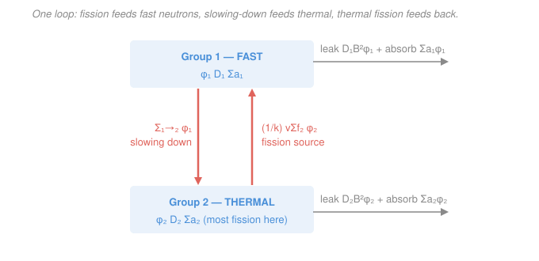

# Reactor Physics & Neutron Transport · Lesson 3.3: Two-group diffusion theory

> ⏱ ~15 min · Module 3: Spectra, slowing-down & few-group methods · Builds on: [3.2 Resonance escape & Fermi age](03-02-resonance-escape-fermi-age.md), [1.4 One-group diffusion & boundary conditions](01-04-one-group-diffusion-boundary-conditions.md) · Unlocks: [3.4 Migration area, reflectors & heterogeneity](03-04-migration-area-reflectors-heterogeneity.md)

## Why this matters

One-group theory is a beautiful lie: it pretends every neutron lives at one energy, so it smears the reactor's most important fact — neutrons are **born fast** but **fission best when slow** — into a single number. That smearing is exactly why one-group leakage (the age-theory $e^{-B^2\tau}$ and the thermal $1/(1+L^2B^2)$) had to be stapled on by hand. Two-group theory stops pretending. It tracks a fast population and a thermal population as two coupled fields, and out falls the criticality condition every reactor engineer knows by heart — with the fast and thermal leakage cleanly separated, no stapling required. It is the smallest model that gets a real thermal reactor's size right.

## The idea

Split the neutron population into just **two bins**: *fast* (group 1 — where fission neutrons are born and where they slow down) and *thermal* (group 2 — where nearly all the fission is caused). Now tell the story of a generation as a two-stage relay.

A fast neutron is born high in energy. It bounces around, and with each scatter it loses energy (Module 3.1's lethargy staircase) until it drops out of the fast bin and lands in the thermal bin. From group 1's bookkeeping, that neutron has been *removed* — it left the fast world. But its disappearance from group 1 is precisely a *birth* into group 2. That single transfer, governed by a **removal cross section** $\Sigma_{1\to2}$, is the coupling: **group 1's loss is group 2's source.**

Once thermal, the neutron wanders as a slow diffuser until it's absorbed. If that absorption happens in fuel and triggers fission, brand-new fast neutrons appear — feeding group 1 and closing the loop. So the two groups chase each other in a cycle: fission $\to$ fast $\to$ (slow down) $\to$ thermal $\to$ (fission) $\to$ fast. Two diffusion equations, one shared flux shape, coupled by two arrows. Write them down and the machine runs itself.

## The formal version

Assume, as is standard and nearly true in a thermal reactor: fission neutrons are **all born fast** (into group 1), and fission is caused **only** by thermal neutrons (group 2). Steady state, one energy transfer only (fast $\to$ thermal, never back up). Two coupled diffusion equations:

$$\underbrace{D_1\nabla^2\phi_1}_{\text{fast leakage}} \;-\; \underbrace{(\Sigma_{a1}+\Sigma_{1\to2})}_{\Sigma_{R1}\,=\,\text{removal}}\phi_1 \;+\; \underbrace{\tfrac{1}{k}\,\nu\Sigma_{f2}\,\phi_2}_{\text{fission source, born fast}} \;=\; 0,$$

$$\underbrace{D_2\nabla^2\phi_2}_{\text{thermal leakage}} \;-\; \underbrace{\Sigma_{a2}\,\phi_2}_{\text{thermal absorption}} \;+\; \underbrace{\Sigma_{1\to2}\,\phi_1}_{\text{slowing-down source}} \;=\; 0.$$

*In words: (fast) net fast neutrons leak away plus get removed by slowing down, and this loss is exactly balanced by the fission neutrons born fast; (thermal) thermal neutrons leak and get absorbed, replenished only by the fast neutrons that slowed down into their bin.* Every symbol: $\phi_1,\phi_2$ are the fast/thermal scalar fluxes; $D_1,D_2$ the group diffusion coefficients; $\Sigma_{a1},\Sigma_{a2}$ the group absorption cross sections; $\Sigma_{1\to2}$ the **removal (slowing-down) cross section** — the rate a fast neutron transfers to the thermal group; $\nu\Sigma_{f2}$ the thermal fission neutron production; and $\Sigma_{R1}\equiv\Sigma_{a1}+\Sigma_{1\to2}$ the total rate a neutron *leaves* group 1. The eigenvalue $k$ divides the fission source so a steady solution exists (the same criticality eigenvalue trick as [2.3](02-03-criticality-condition-geometric-buckling.md)).

**The one closing assumption.** In a bare, homogeneous, critical reactor both fluxes settle into the *same* fundamental spatial mode — the Helmholtz eigenfunction from [1.4](01-04-one-group-diffusion-boundary-conditions.md) and [2.4](02-04-bare-reactor-geometries-flux-shapes.md):

$$\nabla^2\phi_1=-B^2\phi_1,\qquad \nabla^2\phi_2=-B^2\phi_2,$$

with **one** geometric buckling $B^2$ set by size and shape. *In words: fast and thermal flux have the same shape across the core, so the calculus collapses to algebra.* Substituting turns the two PDEs into two algebraic equations:

$$(D_1B^2+\Sigma_{R1})\,\phi_1=\tfrac{1}{k}\,\nu\Sigma_{f2}\,\phi_2,\qquad (D_2B^2+\Sigma_{a2})\,\phi_2=\Sigma_{1\to2}\,\phi_1.$$

Divide the two group areas out. Define the **Fermi age** $\tau\equiv D_1/\Sigma_{R1}$ (the fast diffusion area — the mean-square crow-flight spread while slowing down, straight from [3.2](03-02-resonance-escape-fermi-age.md)) and the **thermal diffusion area** $L^2\equiv D_2/\Sigma_{a2}$ (from [1.5](01-05-diffusion-length-source-problems.md)). Eliminating $\phi_1/\phi_2$ gives the critical condition:

$$\boxed{\,k_{\text{eff}}=\frac{k_\infty}{(1+L^2B^2)(1+\tau B^2)}\,},\qquad k_\infty=\frac{\nu\Sigma_{f2}}{\Sigma_{a2}}\cdot\frac{\Sigma_{1\to2}}{\Sigma_{R1}}.$$

*In words: multiplication is the infinite-medium value $k_\infty$ knocked down by two leakage penalties — one for escaping while fast, one for escaping while thermal.* Read the two factors as non-leakage probabilities:

$$P_{FNL}=\frac{1}{1+\tau B^2}\ (\text{fast, slowing-down}),\qquad P_{TNL}=\frac{1}{1+L^2B^2}\ (\text{thermal}),$$

so $k_{\text{eff}}=k_\infty\,P_{FNL}\,P_{TNL}$ — the six-factor formula's leakage terms of [2.2](02-02-leakage-six-factor-formula.md), now *derived* instead of asserted. And $k_\infty$ itself is the four-factor $\eta f p$ of [2.1](02-01-k-infinity-four-factor-formula.md): $\nu\Sigma_{f2}/\Sigma_{a2}=\eta f$ (thermal reproduction × utilization), and $\Sigma_{1\to2}/\Sigma_{R1}=p$ (the chance a fast neutron slows down rather than being absorbed on the way — resonance escape).

## Picture

## Worked examples

**Example 1 (the reduction — where the boxed formula comes from).** Start from the two algebraic equations. From the thermal equation solve for the flux ratio:

$$\phi_1=\frac{D_2B^2+\Sigma_{a2}}{\Sigma_{1\to2}}\,\phi_2.$$

Put that into the fast equation $(D_1B^2+\Sigma_{R1})\phi_1=\tfrac1k\nu\Sigma_{f2}\phi_2$ and cancel $\phi_2$:

$$k=\frac{\nu\Sigma_{f2}\,\Sigma_{1\to2}}{(D_1B^2+\Sigma_{R1})(D_2B^2+\Sigma_{a2})}.$$

Now factor each bracket to expose $1+(\text{area})B^2$:

$$D_1B^2+\Sigma_{R1}=\Sigma_{R1}\!\left(1+\tfrac{D_1}{\Sigma_{R1}}B^2\right)=\Sigma_{R1}(1+\tau B^2),\quad D_2B^2+\Sigma_{a2}=\Sigma_{a2}(1+L^2B^2).$$

Substitute; the $\Sigma_{R1}\Sigma_{a2}$ in the denominator combines with the numerator to make $k_\infty$:

$$k=\frac{\nu\Sigma_{f2}\Sigma_{1\to2}/(\Sigma_{a2}\Sigma_{R1})}{(1+\tau B^2)(1+L^2B^2)}=\frac{k_\infty}{(1+L^2B^2)(1+\tau B^2)}.$$

Setting $k_{\text{eff}}=1$ gives the critical condition $k_\infty=(1+L^2B^2)(1+\tau B^2)$. That is the whole derivation: two boxes, one shared mode, a flux ratio, and factoring.

**Example 2 (put numbers in — Module 3's boss reactor).** Take $k_\infty=1.20$, $L^2=60\ \text{cm}^2$, $\tau=40\ \text{cm}^2$. Find the critical buckling and split the leakage.

The critical condition is $(1+60B^2)(1+40B^2)=1.20$. Let $x=B^2$ and expand:

$$1+100x+2400x^2=1.20\;\Longrightarrow\; 2400x^2+100x-0.20=0.$$

Quadratic formula: $x=\dfrac{-100+\sqrt{100^2+4(2400)(0.20)}}{2(2400)}=\dfrac{-100+\sqrt{11920}}{4800}=\dfrac{-100+109.18}{4800}=0.00191\ \text{cm}^{-2}.$

So $B^2\approx0.00191\ \text{cm}^{-2}$ (a hair below the quick migration-area estimate $B^2\approx(k_\infty-1)/M^2=0.20/100=0.0020$; the $\tau L^2B^4$ cross-term shaves it down — that's [3.4](03-04-migration-area-reflectors-heterogeneity.md)'s correction previewed). For a bare sphere $B^2=(\pi/R)^2$, so $R=\pi/\sqrt{0.00191}=\pi/0.04372\approx71.9\ \text{cm}$.

Now the leakage split. Fast: $\tau B^2=40(0.00191)=0.0765$, so $P_{FNL}=1/1.0765=0.929$ — **fast leakage $\approx7.1\%$**. Thermal: $L^2B^2=60(0.00191)=0.115$, so $P_{TNL}=1/1.115=0.897$ — **thermal leakage $\approx10.3\%$** (of the fast survivors). Check the loop closes: $k_\infty P_{FNL}P_{TNL}=1.20(0.929)(0.897)=1.00$ ✓. The two leakages don't add naively — total non-leakage is the *product* $0.833$, i.e. a 16.7% overall escape, split as 7.1% lost fast plus $0.929\times10.3\%=9.6\%$ lost thermal.

## Watch out

- **You might think the fast and thermal fluxes have different bucklings.** In a *bare homogeneous* core they don't — both ride the same fundamental mode with one $B^2$, and that shared shape is exactly what lets the PDEs collapse to algebra. Add a reflector ([3.4](03-04-migration-area-reflectors-heterogeneity.md)) and the shapes diverge; the clean single-$B^2$ split is a bare-core luxury.
- **You might think $\tau$ here is a brand-new quantity.** It's the same Fermi age from [3.2](03-02-resonance-escape-fermi-age.md): $\tau=D_1/\Sigma_{R1}$ is the fast group's diffusion area. The two-group factor $1/(1+\tau B^2)$ is just the rational cousin of age theory's $e^{-B^2\tau}$ — identical for small $\tau B^2$, since $e^{-\tau B^2}\approx1-\tau B^2\approx1/(1+\tau B^2)$.
- **You might think fast and thermal leakage add.** They compound: a neutron must survive slowing down (survive $P_{FNL}$) *and then* survive as a thermal wanderer (survive $P_{TNL}$). Total non-leakage is $P_{FNL}P_{TNL}$, a product — never $P_{FNL}+P_{TNL}$.

## One-liner

> Two bins, one shared flux shape, coupled by the removal cross section — and criticality falls out as $k_\infty$ docked by a fast leakage factor and a thermal one, multiplied.

## Problems

**P1 (🟢)** A bare thermal reactor has group constants (cm$^{-1}$ except $D$ in cm): $D_1=1.3$, $D_2=0.40$, $\Sigma_{a1}=0.002$, $\Sigma_{1\to2}=0.023$, $\Sigma_{a2}=0.05$, $\nu\Sigma_{f2}=0.075$. Compute $k_\infty$, the Fermi age $\tau$, the thermal area $L^2$, and the migration area $M^2=L^2+\tau$. Which two four-factor quantities does your $k_\infty$ split into?

**P2 (🟡)** Using the reactor of P1 ($k_\infty=1.38$, $L^2=8.0\ \text{cm}^2$, $\tau=52\ \text{cm}^2$): find the critical buckling $B^2$ (solve the quadratic), the critical radius of a bare sphere, and the fast vs thermal leakage fractions. Which stage leaks more here, and why?

**P3 (🔴, optional)** Show that when $L^2B^2$ and $\tau B^2$ are both small, the two-group critical condition collapses to the one-group migration form $k_\infty\approx1+M^2B^2$ with $M^2=L^2+\tau$. (This is the bridge to [3.4](03-04-migration-area-reflectors-heterogeneity.md).)

Solutions

**P1** Removal from the fast group: $\Sigma_{R1}=\Sigma_{a1}+\Sigma_{1\to2}=0.002+0.023=0.025\ \text{cm}^{-1}$.

$$k_\infty=\frac{\nu\Sigma_{f2}}{\Sigma_{a2}}\cdot\frac{\Sigma_{1\to2}}{\Sigma_{R1}}=\frac{0.075}{0.05}\cdot\frac{0.023}{0.025}=1.50\times0.920=1.38.$$

$$\tau=\frac{D_1}{\Sigma_{R1}}=\frac{1.3}{0.025}=52\ \text{cm}^2,\qquad L^2=\frac{D_2}{\Sigma_{a2}}=\frac{0.40}{0.05}=8.0\ \text{cm}^2,\qquad M^2=52+8=60\ \text{cm}^2.$$

The two factors of $k_\infty$ are $\nu\Sigma_{f2}/\Sigma_{a2}=1.50=\eta f$ (thermal reproduction × utilization) and $\Sigma_{1\to2}/\Sigma_{R1}=0.92=p$ (resonance escape — the chance a fast neutron slows all the way down rather than being absorbed en route). So $k_\infty=\eta f p$, the four-factor formula minus the fast-fission factor $\varepsilon$ we dropped by ignoring fast fission. *Units:* every area is (cm)/(cm$^{-1}$) = cm² ✓; $k_\infty$ dimensionless ✓.

**P2** Critical condition $(1+L^2B^2)(1+\tau B^2)=k_\infty$, i.e. $(1+8x)(1+52x)=1.38$ with $x=B^2$:

$$1+60x+416x^2=1.38\;\Longrightarrow\;416x^2+60x-0.38=0.$$

$$x=\frac{-60+\sqrt{60^2+4(416)(0.38)}}{2(416)}=\frac{-60+\sqrt{3600+632.3}}{832}=\frac{-60+65.06}{832}=0.00608\ \text{cm}^{-2}.$$

So $B^2\approx0.00608\ \text{cm}^{-2}$. (Quick migration check: $(k_\infty-1)/M^2=0.38/60=0.00633$ — same ballpark, slightly high, as expected.) Bare sphere: $R=\pi/\sqrt{B^2}=\pi/0.0780\approx40.3\ \text{cm}$.

Leakage split: $\tau B^2=52(0.00608)=0.316$, so $P_{FNL}=1/1.316=0.760$ → **fast leakage $\approx24\%$**. $L^2B^2=8(0.00608)=0.0486$, so $P_{TNL}=1/1.0486=0.954$ → **thermal leakage $\approx4.6\%$**. Check: $1.38(0.760)(0.954)=1.00$ ✓.

The **fast** stage leaks far more here, because $\tau=52\gg L^2=8$: the neutron's crow-flight spread while slowing down is large compared with its short thermal wander, so in a core this small most escapes happen before the neutron ever thermalizes. (Contrast Example 2's boss reactor, where $L^2>\tau$ and thermal leakage dominated — the ranking is set by which area is bigger.)

**P3** Multiply the critical condition out and set $k_{\text{eff}}=1$:

$$k_\infty=(1+L^2B^2)(1+\tau B^2)=1+(L^2+\tau)B^2+L^2\tau B^4.$$

For small buckling the $B^4$ term is negligible ($L^2\tau B^4\ll(L^2+\tau)B^2$ when $B^2$ is small), leaving

$$k_\infty\approx1+(L^2+\tau)B^2=1+M^2B^2,\qquad M^2\equiv L^2+\tau.$$

Equivalently $k_{\text{eff}}\approx k_\infty/(1+M^2B^2)$: one group again, but with the migration area $M^2$ carrying *both* the thermal wandering and the fast slowing-down spread. That single number is [3.4](03-04-migration-area-reflectors-heterogeneity.md)'s workhorse. *Sanity:* for Example 2, $M^2=100$, dropping the $B^4$ term moved $B^2$ from $0.00191$ to $0.00200$ — a 5% error, small because $L^2\tau B^4$ was genuinely tiny there. ✓

## Flashback

**From Lesson 3.2 (Resonance escape & Fermi age):** In Fermi-age theory the probability a fast neutron avoids leaking *while it slows down* to thermal is $P_{FNL}=e^{-B^2\tau}$. A reactor has Fermi age $\tau=30\ \text{cm}^2$ and geometric buckling $B^2=0.0030\ \text{cm}^{-2}$. (a) Evaluate the age-theory fast non-leakage probability. (b) Compare it to the two-group rational form $1/(1+\tau B^2)$ from this lesson — do they agree, and why should they?

Solution

(a) $B^2\tau=0.0030\times30=0.09$, so

$$P_{FNL}=e^{-B^2\tau}=e^{-0.09}\approx0.914.$$

(b) The two-group form: $1/(1+\tau B^2)=1/(1+0.09)=1/1.09\approx0.917$. They agree to within $0.4\%$ — and they *must* for small $\tau B^2$, because the two-group $1/(1+\tau B^2)$ is just the first-order rational approximation to the exponential: $e^{-\tau B^2}=1-\tau B^2+\tfrac12(\tau B^2)^2-\cdots$ and $1/(1+\tau B^2)=1-\tau B^2+(\tau B^2)^2-\cdots$ match through the linear term. Age theory (continuous slowing-down) and two-group theory (one lumped transfer) are telling the same story about the fast phase; they only diverge when $\tau B^2$ stops being small — i.e. in very small or very leaky cores. *Sanity:* both give a $\sim9\%$ fast leakage, consistent with a modest, reasonably-sized thermal core. ✓

## Connections

- **Backward:** this is [3.2](03-02-resonance-escape-fermi-age.md)'s Fermi age $\tau$ and [1.5](01-05-diffusion-length-source-problems.md)'s thermal length $L^2$ fused into one criticality statement, closed with [1.4](01-04-one-group-diffusion-boundary-conditions.md)'s boundary conditions and [2.3](02-03-criticality-condition-geometric-buckling.md)'s eigenvalue framing. The result *is* the leakage half of the six-factor formula from [2.2](02-02-leakage-six-factor-formula.md) — now derived, and the $\eta f p$ half of [2.1](02-01-k-infinity-four-factor-formula.md)'s four factors, read straight off $k_\infty$.
- **Forward:** [3.4](03-04-migration-area-reflectors-heterogeneity.md) takes P3's small-buckling collapse as its starting point — migration area $M^2=L^2+\tau$ compresses the two groups back to one and then handles reflectors, where the shared-$B^2$ assumption finally breaks and the fast and thermal shapes part ways.
- **Sideways (PDEs):** both equations lean on the same Helmholtz eigenvalue problem $\nabla^2\phi=-B^2\phi$ from [`pdes`](../../pdes/syllabus.md) — the fundamental mode of a bounded region. The coupled pair is a $2\times2$ generalized eigenvalue problem whose eigenvalue is $k$; asking "what $B^2$ makes $k=1$?" is the reactor-physics face of "what boundary makes the operator singular?" And $k_\infty=\eta f p$ ties straight back to the cross-section bookkeeping of [`intro-nuclear-engineering`](../../intro-nuclear-engineering/syllabus.md).
