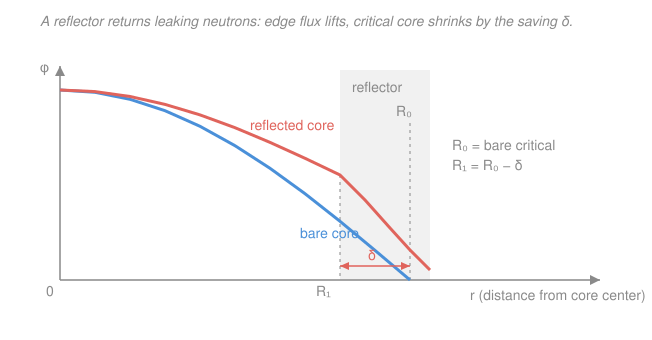

# Reactor Physics & Neutron Transport · Lesson 3.4: Migration area, reflectors & heterogeneity

> ⏱ ~15 min · Module 3: Spectra, slowing-down & few-group methods · Builds on: [3.3 Two-group diffusion theory](03-03-two-group-diffusion-theory.md), [3.2 Resonance escape & Fermi age](03-02-resonance-escape-fermi-age.md) · Unlocks: Module 4 (reactor kinetics) and the sister course [`reactor-thermal-hydraulics`](../../reactor-thermal-hydraulics/syllabus.md)

## Why this matters

Two-group theory ([3.3](03-03-two-group-diffusion-theory.md)) gave you an honest critical condition, but with two length scales ($L$ for thermal wandering, $\sqrt\tau$ for slowing-down) it's fussy to size a core with. This lesson does two things a real designer needs. First it **collapses those two scales into one number**, the migration area $M^2$, so criticality reads almost as simply as one-group theory did. Second it adds the two features that separate a textbook bare sphere from an actual power reactor: a **reflector** (which shrinks the critical size — and the fuel bill — by bouncing escaping neutrons back) and **heterogeneity** (fuel in rods, not a smoothie), which quietly buys you a better resonance-escape probability. This closes Module 3: you can now size a leaky, reflected, rodded core.

## The idea

Picture one neutron's whole life as a single flight. It's born fast, ricochets off moderator nuclei losing energy — that random walk carries it some crow-flight distance while it slows down. Then, now thermal, it wanders again as a slow neutron until something finally absorbs it. **Total displacement from birthplace to death is just those two random walks added.** Mean-square distances of independent random walks add, so the total mean-square crow-flight is the slowing-down spread plus the thermal spread. Package that as one area — the **migration area** $M^2 = L^2 + \tau$ — and $M$ (the migration length) is *the* single distance that tells you how far a neutron ranges before it's captured. Leakage is governed by that one length, so the critical condition should depend on $M^2$ alone. It does.

Now the reflector. A bare core throws away every neutron that crosses its surface heading out. Wrap it in a slab of moderator with little absorption — graphite, water, beryllium — and a good fraction of those escapees scatter back in. Fewer losses means you need less core to stay critical: the reflected critical radius is smaller than the bare one by a fixed length called the **reflector saving** $\delta$. Because core mass grows like radius *cubed*, even a modest $\delta$ can cut the fuel loading dramatically.

And heterogeneity: real fuel is lumped into rods, not blended uniformly with the moderator. Lumping lets a fuel rod **shield its own interior** — the outer layer soaks up the dangerous resonance-energy neutrons, so the inside sees fewer of them and captures fewer on U-238. That *raises* the resonance escape probability $p$. It costs you a little thermal utilization $f$, but the trade is a net win, which is why every power reactor is a lattice of rods.

## The formal version

**Migration area and migration length.** Define

$$M^2 \equiv L^2 + \tau, \qquad M \equiv \sqrt{L^2+\tau}.$$

*In words: the migration area is the thermal diffusion area plus the Fermi age — the total mean-square straight-line distance from where a neutron is born fast to where it's finally captured as a thermal neutron.* Recall from [1.5](01-05-diffusion-length-source-problems.md) that thermal neutrons satisfy $\langle r^2\rangle_{\text{th}} = 6L^2$, and from [3.2](03-02-resonance-escape-fermi-age.md) that slowing down spreads them by $\langle r^2\rangle_{\text{slow}} = 6\tau$. Adding the two independent walks, $\langle r^2\rangle_{\text{birth}\to\text{capture}} = 6L^2 + 6\tau = 6M^2$.

**The compact critical relation.** Start from the two-group critical condition [3.3](03-03-two-group-diffusion-theory.md):

$$k_{\text{eff}} = \frac{k_\infty}{(1+L^2B^2)(1+\tau B^2)}.$$

Multiply the denominator out: $(1+L^2B^2)(1+\tau B^2) = 1 + (L^2+\tau)B^2 + L^2\tau B^4$. For a large, low-leakage core $B^2$ is tiny, so the $B^4$ term is negligible and

$$\boxed{\,k_{\text{eff}} \approx \frac{k_\infty}{1+M^2 B^2}\,}, \qquad M^2 = L^2+\tau.$$

*In words: for a big reactor the fast and thermal leakages combine into a single small-leakage factor set by the migration area — the reactor leaks as if governed by one length $M$.* Setting $k_{\text{eff}}=1$ gives the critical buckling

$$1 + M^2 B_c^2 = k_\infty \quad\Longrightarrow\quad B_c^2 \approx \frac{k_\infty - 1}{M^2}.$$

*In words: exactly one-group theory ([2.3](02-03-criticality-condition-geometric-buckling.md)) with $L^2$ replaced by $M^2$.* Match this material buckling to the geometric buckling $B_g^2$ of your shape (for a bare sphere, $B_g^2 = (\pi/\tilde R)^2$) to get the critical size.

**Reflector saving.** A reflected core of extrapolated half-dimension $\tilde R_{\text{refl}}$ goes critical when its bare-equivalent size would have been larger:

$$\tilde R_{\text{refl}} = \tilde R_{\text{bare}} - \delta.$$

*In words: adding a reflector is worth $\delta$ centimetres of core — you may shrink each half-dimension by $\delta$ and stay critical.* The saving $\delta$ grows with reflector thickness (saturating after ~2 migration lengths of reflector) and is larger for a better moderator; a thick water or graphite reflector is typically worth a few to ~10 cm. Because core volume $\propto \tilde R^3$, the fractional fuel saving is

$$\frac{\Delta V}{V} = 1 - \left(\frac{\tilde R_{\text{refl}}}{\tilde R_{\text{bare}}}\right)^3.$$

**Heterogeneity & self-shielding (a taste).** Blend fuel and moderator uniformly ("homogeneous") and every U-238 nucleus is equally exposed to slowing-down neutrons passing through the resonance energies — lots of resonance capture, low $p$. Lump the fuel into rods ("heterogeneous") and a resonance-energy neutron is very likely absorbed in the *outer skin* of a rod before it reaches the centre: the rod **self-shields** its own interior, so fewer U-238 nuclei see resonance neutrons and $p$ goes **up**. The price is that thermal neutrons are born in the moderator and some are absorbed there before diffusing into a rod, nudging the thermal utilization $f$ **down**. Since $k_\infty = \eta\,\varepsilon\,f\,p$ ([2.1](02-01-k-infinity-four-factor-formula.md)), the design question is whether the gain in $p$ beats the loss in $f$ — and for natural or low-enriched uranium it decisively does. That single fact is why reactors are built as lattices of fuel rods.

## Picture

The bare critical flux (blue) must fall all the way to zero at the extrapolated boundary $R_0$, so it leaks hard at the edge. The reflected flux (coral) stays higher across a *smaller* core and spills a tail into the reflector instead of vanishing — that recovered leakage is what lets the critical radius drop from $R_0$ to $R_1 = R_0 - \delta$.

## Worked examples

**Example 1 (migration area → critical size).** A large homogeneous core has $k_\infty = 1.20$, thermal diffusion area $L^2 = 60\,\text{cm}^2$, and Fermi age $\tau = 40\,\text{cm}^2$. Find the migration area, the critical buckling, and the critical radius of a bare sphere (ignore the extrapolation length).

Migration area:

$$M^2 = L^2 + \tau = 60 + 40 = 100\,\text{cm}^2, \qquad M = 10\,\text{cm}.$$

Critical buckling from the compact relation:

$$B_c^2 \approx \frac{k_\infty - 1}{M^2} = \frac{0.20}{100} = 0.0020\,\text{cm}^{-2}.$$

A bare sphere has $B_g^2 = (\pi/\tilde R)^2$, so at criticality $B_g^2 = B_c^2$:

$$\tilde R = \frac{\pi}{B_c} = \frac{\pi}{\sqrt{0.0020}} = \frac{\pi}{0.04472} \approx 70\,\text{cm}.$$

*Sanity check against the exact two-group condition:* with $L^2\tau B^4 = 60\cdot40\cdot(0.002)^2 = 0.0096$, the dropped term is under 1% of the $1+M^2B^2 = 1.20$ denominator — the compact formula is well justified here.

**Example 2 (reflector saving → fuel savings).** The same core from Example 1 (bare critical radius $\tilde R_{\text{bare}} = 70\,\text{cm}$) is wrapped in a thick graphite reflector worth a reflector saving $\delta = 14\,\text{cm}$. Give the reflected critical radius and the fractional fuel savings.

Reflected critical radius:

$$\tilde R_{\text{refl}} = \tilde R_{\text{bare}} - \delta = 70 - 14 = 56\,\text{cm}.$$

The radius drops to a factor $56/70 = 0.80$ of bare. Since fuel loading tracks core volume $\propto R^3$ (homogeneous mix, so mass $\propto$ volume):

$$\frac{\Delta V}{V} = 1 - \left(\frac{56}{70}\right)^3 = 1 - (0.80)^3 = 1 - 0.512 = 0.488 \approx 49\%.$$

A 14 cm saving on a 70 cm core cuts the critical fuel loading nearly in half. *That* is why reflectors are not optional on compact cores — they're one of the cheapest reactivity investments you can make.

## Watch out

- **You might think $M^2$ replaces $L^2$ everywhere.** It only replaces $L^2$ in the *leakage/criticality* bookkeeping (the migration length is the birth-to-capture range). The individual $L^2$ and $\tau$ still matter separately when you split leakage into fast vs thermal — the collapse to $M^2$ is a small-$B^2$ convenience, not a new physical length for thermal neutrons alone.
- **You might think a reflector adds reactivity by producing neutrons.** It doesn't — a reflector has no fuel. It only *returns* neutrons that would have leaked. Its worth is a reduced leakage (a bigger non-leakage probability), realized geometrically as the size saving $\delta$.
- **You might think lumping fuel is always better because $p$ rises.** It's a trade: heterogeneity raises $p$ (self-shielding) but lowers $f$ (moderator captures). It wins for natural/low-enriched uranium; there's an optimal rod diameter and lattice pitch where $k_\infty = \eta\varepsilon f p$ peaks. Too fat a rod over-shields and starves the interior of thermal neutrons.

## One-liner

> Fold slowing-down and thermal wandering into one migration area $M^2 = L^2+\tau$ so $k_{\text{eff}}\approx k_\infty/(1+M^2B^2)$; then a reflector shrinks the critical size by $\delta$, and lumping the fuel self-shields it to raise $p$.

## Problems

**P1 (🟢)** A homogeneous core has $k_\infty = 1.25$, $L^2 = 35\,\text{cm}^2$, and $\tau = 65\,\text{cm}^2$. Find the migration area $M^2$, the critical buckling $B_c^2$, and the critical radius of a bare sphere (ignore extrapolation).

**P2 (🟡)** A bare spherical core is critical at extrapolated radius $\tilde R_{\text{bare}} = 45\,\text{cm}$. It is reflected, gaining a reflector saving $\delta = 9\,\text{cm}$. (a) Give the reflected critical radius. (b) What fraction of the fuel loading does the reflector save?

**P3 (🔴, connects to the four-factor formula)** A designer compares a homogeneous mix against a rodded lattice of the same materials. Lumping the fuel raises the resonance escape probability from $p = 0.75$ to $p = 0.80$, but lowers the thermal utilization from $f = 0.90$ to $f = 0.88$; $\eta$ and $\varepsilon$ are unchanged. Does the heterogeneous lattice have a larger $k_\infty$? By what percentage does $k_\infty$ change?

Solutions

**P1** Migration area:

$$M^2 = L^2 + \tau = 35 + 65 = 100\,\text{cm}^2.$$

Critical buckling:

$$B_c^2 \approx \frac{k_\infty - 1}{M^2} = \frac{0.25}{100} = 0.0025\,\text{cm}^{-2}.$$

Bare sphere, $B_g^2 = (\pi/\tilde R)^2 = B_c^2$:

$$\tilde R = \frac{\pi}{\sqrt{0.0025}} = \frac{\pi}{0.05} \approx 62.8\,\text{cm}.$$

*Check.* Units: $[k_\infty-1]$ is dimensionless over $\text{cm}^2$ gives $\text{cm}^{-2}$ for $B_c^2$ ✓; $\pi/B_c$ has units $\text{cm}$ ✓. A higher $k_\infty$ than Example 1 with the same $M^2$ gives a bigger $B_c^2$ and hence a *smaller* critical radius (62.8 < 70 cm) — more excess multiplication tolerates more leakage, so less core is needed. ✓

**P2** (a) Reflected critical radius:

$$\tilde R_{\text{refl}} = \tilde R_{\text{bare}} - \delta = 45 - 9 = 36\,\text{cm}.$$

(b) Fuel loading tracks core volume $\propto R^3$, so

$$\frac{\Delta V}{V} = 1 - \left(\frac{36}{45}\right)^3 = 1 - (0.80)^3 = 1 - 0.512 = 0.488 \approx 49\%.$$

*Check.* The radius ratio $36/45 = 0.80$; cubing the ratio (not the radius) gives the volume fraction retained, $0.512$, so ~49% is saved. A 9 cm saving on a 45 cm core is the same fractional saving as the 14-on-70 case in Example 2 — both give a 0.80 radius ratio, confirming the saving scales with core size. ✓

**P3** Only $f$ and $p$ change, and $k_\infty = \eta\varepsilon fp$, so the ratio is

$$\frac{k_\infty^{\text{het}}}{k_\infty^{\text{hom}}} = \frac{f_{\text{het}}\,p_{\text{het}}}{f_{\text{hom}}\,p_{\text{hom}}} = \frac{0.88 \times 0.80}{0.90 \times 0.75} = \frac{0.7040}{0.6750} = 1.043.$$

Yes — the heterogeneous lattice has the larger $k_\infty$, by about **+4.3%**. The gain in $p$ (0.75 → 0.80, a 6.7% rise) outweighs the loss in $f$ (0.90 → 0.88, a 2.2% drop). *Check.* Multiplying the two fractional changes: $(1.0667)(0.9778) = 1.043$ ✓. This is exactly the self-shielding trade — and a +4.3% swing in $k_\infty$ is enormous in reactor terms (thousands of pcm), which is why the lattice geometry is chosen deliberately, not for convenience. ✓

## Flashback

**From Lesson 3.3 (Two-group diffusion theory) — split the leakage.** A bare reactor operates at critical buckling $B^2 = 0.0025\,\text{cm}^{-2}$ with fast-group age $\tau = 60\,\text{cm}^2$ and thermal diffusion area $L^2 = 40\,\text{cm}^2$. Using the two-group non-leakage factors, find the fast non-leakage probability, the thermal non-leakage probability, and the total fraction of neutrons that leak. (Fresh numbers — recompute from scratch.)

Solution

The two-group non-leakage probabilities are $P_{FNL} = 1/(1+\tau B^2)$ (escape while fast) and $P_{TNL} = 1/(1+L^2 B^2)$ (escape while thermal).

Fast:
$$\tau B^2 = 60 \times 0.0025 = 0.15, \qquad P_{FNL} = \frac{1}{1.15} = 0.870 \;\Rightarrow\; \text{fast leakage} \approx 13.0\%.$$

Thermal:
$$L^2 B^2 = 40 \times 0.0025 = 0.10, \qquad P_{TNL} = \frac{1}{1.10} = 0.909 \;\Rightarrow\; \text{thermal leakage} \approx 9.1\%.$$

Total non-leakage $= P_{FNL}P_{TNL} = 0.870 \times 0.909 = 0.791$, so the total leakage fraction is

$$1 - 0.791 \approx 20.9\%.$$

*Check.* The compact factor $1/(1+M^2B^2)$ with $M^2 = 100$ gives $1/(1.25) = 0.800$ — within ~1% of the exact $0.791$, the tiny gap being the dropped $L^2\tau B^4$ term. Here the fuel slows down over a larger age ($\tau > L^2$), so fast leakage dominates thermal leakage, unlike a graphite core where the thermal walk is the leakier stage. ✓

## Connections

- **Backward:** this compresses [3.3](03-03-two-group-diffusion-theory.md)'s two-group condition into one migration length, using $\langle r^2\rangle = 6L^2$ from [1.5](01-05-diffusion-length-source-problems.md) and $\tau = \tfrac16\langle r^2\rangle_{\text{slow}}$ from [3.2](03-02-resonance-escape-fermi-age.md). The critical-buckling match is [2.3](02-03-criticality-condition-geometric-buckling.md)'s $B_m^2 = B_g^2$ with $L^2 \to M^2$, and the self-shielding story reprices $p$ and $f$ from the four-factor formula ([2.1](02-01-k-infinity-four-factor-formula.md)).
- **Forward:** with a sized, reflected core in hand, Module 4 ([4.1](04-01-delayed-neutrons-point-kinetics.md)) lets $k_{\text{eff}}$ move in *time* — reactivity, delayed neutrons, and the point-kinetics equations that decide whether the reactor is controllable.
- **Sideways (thermal-hydraulics & materials):** the reflected flux shape this lesson sets is the heat-source map that [`reactor-thermal-hydraulics`](../../reactor-thermal-hydraulics/syllabus.md) turns into a temperature field, and the fuel-rod lattice geometry is exactly the object nuclear materials engineering must keep intact under irradiation. The independent-random-walks-add argument for $M^2$ is the same variance-addition rule you meet whenever independent displacements combine — a diffusion-length version of the statistics behind the heat equation's spreading Gaussian.
