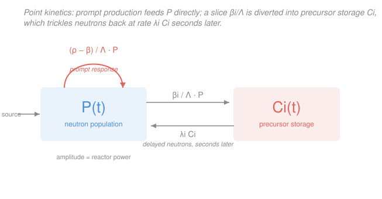

# Reactor Physics & Neutron Transport · Lesson 4.1: Delayed neutrons & the point-kinetics equations

> ⏱ ~15 min · Module 4: Reactor kinetics & reactivity · Builds on: [`intro-nuclear-engineering`](../../intro-nuclear-engineering/syllabus.md) (delayed neutrons), [3.4 Migration area, reflectors & heterogeneity](03-04-migration-area-reflectors-heterogeneity.md), [`ode-refresher`](../../ode-refresher/syllabus.md) (coupled linear systems) · Unlocks: [4.2 Reactivity & the prompt jump](04-02-reactivity-prompt-jump.md)

## Why this matters

So far the reactor has been frozen in time: we asked *is it critical?* and answered with geometry. Now we let power **move**. If every neutron came straight out of fission, a reactor would be uncontrollable — a tiny nudge above critical would double the power every few milliseconds, faster than any rod or human could react. The only reason a reactor is a machine you can drive rather than a bomb you can't is that a **sub-percent** slice of neutrons show up *seconds* late. This lesson writes the equations that govern power in time, and those late neutrons are the whole story. Everything in Module 4 — reactor period, the prompt jump, the inhour equation, why $\beta$ is a speed limit — is bookkeeping on top of what we set up here.

## The idea

Picture two ways a neutron can be born after a fission.

Most are **prompt**: released within about $10^{-14}$ s of the split — essentially instant. A few are **delayed**: the fission doesn't emit them, it emits a radioactive fragment (a **precursor**, like $^{87}$Br) that later beta-decays into a state that *then* coughs out a neutron. That decay takes anywhere from a fraction of a second to about a minute. So a small fraction of each generation is held in escrow and paid out slowly.

Here's why that changes everything. Left to the prompt neutrons alone, a reactor's clock ticks at the **generation time** $\Lambda \sim 10^{-4}$–$10^{-5}$ s — the average time from one fission to the next. Nudge the multiplication up 0.1% and power would run away on *that* clock: unmanageably fast. But the delayed neutrons, though only ~0.65% of the total, drag the *effective* clock out to their decay times — seconds. That slow escrow account is what you actually control. Take it away and the reactor becomes ungovernable.

To track power we make one big simplifying bet: assume the **shape** of the flux across the core stays fixed (the fundamental mode from Module 2), and only its overall **amplitude** $P(t)$ changes with time. That reduces a space-and-time PDE to a handful of ordinary differential equations in $t$ alone — the **point-kinetics equations**. "Point" because we've thrown away space and treated the whole reactor as a single point that brightens and dims.

## The formal version

Define the players first. $P(t)$ is the amplitude of the neutron population — proportional to reactor power (units are whatever you like; only ratios matter). $\rho$ is the **reactivity**, $\rho = (k-1)/k$, the fractional distance from critical (formalized in [4.2](04-02-reactivity-prompt-jump.md)); $\rho=0$ is exactly critical. $\Lambda$ is the **mean neutron generation time**, $\Lambda = \ell/k$ with $\ell$ the prompt neutron lifetime — roughly the mean time between successive fission generations, $\sim 10^{-4}$–$10^{-5}$ s.

Now the delayed part. Of every fission's neutrons, a fraction $\beta \approx 0.0065$ for $^{235}$U are delayed — the **delayed neutron fraction**. Precursors aren't one species but a spread of half-lives, so we bin them into (conventionally six) **groups** $i$, each with its own fraction $\beta_i$ (so $\sum_i \beta_i = \beta$) and decay constant $\lambda_i$ (s$^{-1}$). Let $C_i(t)$ be the concentration of group-$i$ precursors.

The **point-kinetics equations** are then

$$\frac{dP}{dt} = \frac{\rho - \beta}{\Lambda}\,P + \sum_i \lambda_i C_i,$$

$$\frac{dC_i}{dt} = \frac{\beta_i}{\Lambda}\,P - \lambda_i C_i.$$

*In words (first equation): the neutron population is driven by prompt multiplication — but only the fraction $\rho-\beta$ that isn't held back as delayed — plus a rain of delayed neutrons $\lambda_i C_i$ falling out of each precursor group.* *In words (second): each precursor pool fills at rate $\beta_i/\Lambda\,P$ (born with the fission) and drains by radioactive decay at rate $\lambda_i C_i$.*

Read the first equation term by term — this is the payoff:

- $\dfrac{\rho-\beta}{\Lambda}P$ is the **prompt** response. Notice the $-\beta$: the prompt neutrons alone see an effective reactivity $\rho-\beta$, not $\rho$, because $\beta$ of the production is siphoned off into precursors. As long as $\rho < \beta$ this term is *negative* — the prompt chain alone would die out. The reactor is prompt-subcritical and coasts on the delayed rain.
- $\sum_i \lambda_i C_i$ is the **delayed** neutrons trickling back out of storage. This is the slow term, and it's what keeps power alive and controllable.

The instant $\rho$ reaches $\beta$, the prompt term flips positive and the reactor no longer needs the delayed neutrons at all — that's **prompt criticality**, the catastrophe of [4.3](04-03-prompt-criticality.md). This is why reactivity gets measured in **dollars**, $\rho/\beta$: one dollar *is* prompt critical.

This is a **coupled linear system of ODEs** — exactly the machinery from [`ode-refresher`](../../ode-refresher/syllabus.md). Its behavior is set by the eigenvalues of the coefficient matrix, and Problem 3 makes that explicit.

## Picture

## Worked examples

**Example 1 (mechanical — the steady state).** A reactor sits at constant power: exactly critical, $\rho = 0$, and nothing changing, so $dP/dt = 0$ and every $dC_i/dt = 0$. What holds the precursors?

Set the precursor equation to zero:

$$\frac{dC_i}{dt} = \frac{\beta_i}{\Lambda}P - \lambda_i C_i = 0 \quad\Longrightarrow\quad \boxed{\,C_i = \frac{\beta_i\,P}{\lambda_i\,\Lambda}\,}.$$

*In words: at steady state each precursor pool self-balances — the rate it fills, $\beta_i P/\Lambda$, equals the rate it drains, $\lambda_i C_i$.* Now check the power equation is consistent. Substitute, with $\rho=0$:

$$\frac{dP}{dt} = \frac{0-\beta}{\Lambda}P + \sum_i \lambda_i\!\left(\frac{\beta_i P}{\lambda_i \Lambda}\right) = -\frac{\beta}{\Lambda}P + \frac{P}{\Lambda}\sum_i \beta_i = -\frac{\beta}{\Lambda}P + \frac{\beta}{\Lambda}P = 0. \checkmark$$

The $\lambda_i$'s cancel and $\sum_i\beta_i = \beta$ closes the books: the delayed rain exactly refills the $-\beta/\Lambda$ hole the prompt term leaves. Note the magnitude of the storage: the ratio $C_i/P = \beta_i/(\lambda_i\Lambda)$ is *enormous* — with $\Lambda\sim10^{-5}$ s the precursor pool dwarfs the live neutron population. That deep reservoir is the reactor's flywheel; it's why power can't turn on a dime.

**Example 2 (why you'd care — one group, two timescales).** Six groups is fine for a computer; to *see* the physics, lump them into one effective group with total fraction $\beta$, a single mean decay constant $\bar\lambda$, and one pooled precursor $C=\sum_i C_i$:

$$\frac{dP}{dt} = \frac{\rho-\beta}{\Lambda}P + \bar\lambda C, \qquad \frac{dC}{dt} = \frac{\beta}{\Lambda}P - \bar\lambda C.$$

This is a $2\times2$ linear system; its solutions are sums of exponentials $e^{\omega t}$, and the two rates $\omega$ are the two timescales of the reactor. You can read their sizes straight off the coefficients. Take the reactor near critical ($\rho\approx0$) and use $\Lambda = 5\times10^{-5}$ s, $\beta = 0.0065$, $\bar\lambda = 0.08\ \text{s}^{-1}$:

- **Fast (prompt) scale.** The prompt term carries the coefficient $\beta/\Lambda = 0.0065 / (5\times10^{-5}) = 130\ \text{s}^{-1}$ — a time constant $\Lambda/\beta \approx 7.7\times10^{-3}\ \text{s}$, about **8 ms**. Any prompt imbalance is snuffed out or amplified on this near-instant clock.
- **Slow (delayed) scale.** Once the prompt part has settled, what's left evolves at the precursors' own pace, $\bar\lambda \approx 0.08\ \text{s}^{-1}$ — a time constant $1/\bar\lambda \approx 12.5\ \text{s}$.

Four orders of magnitude separate them. The reactor lurches almost instantly to a new prompt-balanced level (the "prompt jump" of [4.2](04-02-reactivity-prompt-jump.md)), then drifts on the slow delayed clock — the ramp you actually steer. Problem 3 computes these two rates exactly as eigenvalues.

## Watch out

- **You might think $\Lambda$ is the reactor's response time. It isn't — the *delayed* neutrons are.** If you (wrongly) drop the $C_i$ terms, power runs on the prompt clock $\Lambda\sim10^{-5}$ s and any positive $\rho$ is a disaster. The whole controllability of a reactor is smuggled in through those $\lambda_i C_i$ terms; Problem 2 shows exactly what you lose without them.
- **You might read the $-\beta$ in $(\rho-\beta)/\Lambda$ as saying delayed neutrons are subtracted from production. They aren't lost — they're *deferred*.** The $-\beta$ removes them from the prompt term only because they've been rerouted into $C_i$, and they come back in the very next term $\sum_i\lambda_i C_i$. Total neutrons are conserved; the equation just tracks the fast and slow accounts separately.
- **You might treat $P$ as a number of neutrons at a point. It's the amplitude of a fixed flux *shape*.** Point kinetics assumes the spatial mode is frozen — a good bet for small, prompt reactivity changes, but it breaks when a perturbation deforms the flux (a rod dropping on one side, spatial xenon oscillations in [5.4](05-04-xenon-oscillations-samarium-149.md)). Then you need space back.

## One-liner

> Prompt neutrons set a millisecond clock the reactor could never survive; the ~0.65% that arrive seconds late — the $\sum_i\lambda_i C_i$ term — stretch that clock to seconds and hand you the controls.

## Problems

**P1 (🟢)** A reactor runs at steady state, exactly critical, with amplitude $P = 100$ (arbitrary units). Using one delayed group with $\beta = 0.0065$, $\bar\lambda = 0.08\ \text{s}^{-1}$, and $\Lambda = 5\times10^{-5}$ s, find the equilibrium precursor concentration $C$. Comment on its size relative to $P$.

**P2 (🟡)** Suppose you *ignore delayed neutrons entirely*: set $\beta = 0$ and drop the precursor term, so $\dfrac{dP}{dt} = \dfrac{\rho}{\Lambda}P$. A step reactivity $\rho = +0.001$ is inserted, with $\Lambda = 5\times10^{-5}$ s. Find $P(t)$, its e-folding time, and the factor by which power grows in one second. What does this say about why delayed neutrons matter?

**P3 (🔴, optional)** Take the one-group system at exactly critical, $\rho = 0$, and write it as $\dfrac{d}{dt}\begin{pmatrix}P\\ C\end{pmatrix} = M\begin{pmatrix}P\\ C\end{pmatrix}$. Find the matrix $M$, compute its two eigenvalues, and interpret each physically. Use $\beta = 0.0065$, $\bar\lambda = 0.08\ \text{s}^{-1}$, $\Lambda = 5\times10^{-5}$ s.

Solutions

**P1** At steady state, $C = \dfrac{\beta P}{\bar\lambda \Lambda}$ (Example 1). Plug in:

$$C = \frac{(0.0065)(100)}{(0.08)(5\times10^{-5})} = \frac{0.65}{4\times10^{-6}} = 1.625\times10^{5}.$$

So $C/P = 0.0065/(4\times10^{-6}) \approx 1625$: the precursor reservoir holds roughly **1600 times** the live neutron amplitude. *Check.* Units: $[\beta]$ is dimensionless, so $[C] = [P]/([\bar\lambda][\Lambda]) = [P]/(\text{s}^{-1}\cdot\text{s}) = [P]$ ✓ — same units as $P$, as it must be. The physical takeaway: this deep escrow is the flywheel; power can't change faster than the reservoir will let it drain or fill.

**P2** With $dP/dt = (\rho/\Lambda)P$ (a single linear ODE, [`ode-refresher`](../../ode-refresher/syllabus.md) 1.x growth), the solution is a pure exponential:

$$P(t) = P_0\,e^{(\rho/\Lambda)t}, \qquad \frac{\rho}{\Lambda} = \frac{0.001}{5\times10^{-5}} = 20\ \text{s}^{-1}.$$

The e-folding time is $\Lambda/\rho = 1/20 = 0.05\ \text{s}$ — power multiplies by $e$ every **50 ms**. In one second it grows by $e^{20} \approx 4.9\times10^{8}$ — a factor of nearly half a billion, per second, for a mere 0.1% reactivity. *Check.* $[\rho/\Lambda] = 1/\text{s}$ ✓. This is the fantasy of a prompt-only reactor: utterly uncontrollable. Restoring the delayed neutrons replaces this 0.05 s runaway with a period of tens of seconds (the real dynamics of [4.2](04-02-reactivity-prompt-jump.md)/[4.4](04-04-inhour-equation-reactor-period.md)) — that four-order-of-magnitude reprieve *is* the delayed neutrons' gift, and the entire reason reactors are safe to operate.

**P3** With $\rho=0$ the two equations are $\dot P = -\tfrac{\beta}{\Lambda}P + \bar\lambda C$ and $\dot C = \tfrac{\beta}{\Lambda}P - \bar\lambda C$, so

$$M = \begin{pmatrix} -\beta/\Lambda & \bar\lambda \\[2pt] \beta/\Lambda & -\bar\lambda \end{pmatrix}.$$

Eigenvalues come from $\det(M - \omega I) = 0$. Its trace is $\operatorname{tr}M = -(\beta/\Lambda + \bar\lambda)$ and its determinant is

$$\det M = \left(-\frac{\beta}{\Lambda}\right)(-\bar\lambda) - (\bar\lambda)\left(\frac{\beta}{\Lambda}\right) = \frac{\bar\lambda\beta}{\Lambda} - \frac{\bar\lambda\beta}{\Lambda} = 0.$$

A zero determinant means one eigenvalue is $\omega_1 = 0$; the other is the trace, $\omega_2 = -(\beta/\Lambda + \bar\lambda)$. Numerically $\beta/\Lambda = 0.0065/(5\times10^{-5}) = 130\ \text{s}^{-1}$, so

$$\omega_1 = 0, \qquad \omega_2 = -(130 + 0.08) \approx -130\ \text{s}^{-1}.$$

Interpretation: $\omega_1 = 0$ is the **critical steady state** — a marginally stable mode that neither grows nor decays (exactly what $\rho=0$ should give; the reactor holds power). $\omega_2 \approx -130\ \text{s}^{-1}$ is the **fast prompt transient**, decaying with time constant $1/130 \approx 7.7\ \text{ms}$ — the same 8 ms scale from Example 2, now derived rather than estimated. *Check.* Both eigenvalues have units s$^{-1}$ ✓, and neither is positive, consistent with a critical reactor being on the edge of stability. Nudge $\rho$ slightly positive and $\omega_1$ lifts just above zero into a slow growing mode (the asymptotic period of [4.4](04-04-inhour-equation-reactor-period.md)), while $\omega_2$ stays fast and negative — the two-timescale split laid bare.

## Flashback

**From Lesson 3.4 (Migration area & the critical condition):** A bare spherical reactor has $k_\infty = 1.15$ and migration area $M^2 = 50\ \text{cm}^2$. Using $k_{\text{eff}} \approx k_\infty/(1 + M^2 B^2) = 1$, find the critical geometric buckling $B^2$ and the extrapolated critical radius of the sphere.

Solution

Criticality $k_\infty/(1+M^2B^2) = 1$ means $M^2 B^2 = k_\infty - 1$, so

$$B^2 = \frac{k_\infty - 1}{M^2} = \frac{0.15}{50} = 0.003\ \text{cm}^{-2}, \qquad B = \sqrt{0.003} = 0.0548\ \text{cm}^{-1}.$$

For a bare sphere the fundamental-mode buckling is $B_g^2 = (\pi/R)^2$, so the extrapolated critical radius is

$$R = \frac{\pi}{B} = \frac{\pi}{0.0548} \approx 57.4\ \text{cm}.$$

*Check.* $[B^2] = \text{cm}^{-2}$ ✓; a bigger $M^2$ (leakier neutrons) or a smaller excess $k_\infty-1$ would demand a larger core, as it should. This is the same $M^2 B^2 = k_\infty - 1$ balance that Boss Problem 3 uses — production just able to cover leakage.

## Connections

- **Backward:** the frozen-shape assumption borrows the fundamental flux mode and its buckling straight from Module 2 ([2.3](02-03-criticality-condition-geometric-buckling.md)–[2.4](02-04-bare-reactor-geometries-flux-shapes.md)) and [3.4](03-04-migration-area-reflectors-heterogeneity.md); $\Lambda$ is the generation time built from the neutron lifetime of the diffusion picture. Criticality set the *stage*; kinetics lets the amplitude move on it.
- **Forward:** [4.2](04-02-reactivity-prompt-jump.md) solves a step insertion with these equations (the prompt jump), [4.3](04-03-prompt-criticality.md) reads the $\rho=\beta$ catastrophe out of the $(\rho-\beta)/\Lambda$ term, and [4.4](04-04-inhour-equation-reactor-period.md) turns the slow eigenvalue into the reactor period. Module 5's feedback ([5.1](05-01-reactivity-feedback-temperature-coefficients.md)) makes $\rho$ itself a function of power, closing the loop.
- **Sideways (ODEs):** this is a coupled linear system whose dynamics live in the eigenvalues of its coefficient matrix — the [`ode-refresher`](../../ode-refresher/syllabus.md) systems toolkit exactly. The four-order-of-magnitude gap between the prompt and delayed eigenvalues makes it a textbook **stiff** system, which is why reactor-kinetics codes use implicit solvers rather than naive time-stepping — a bridge to numerical analysis.
