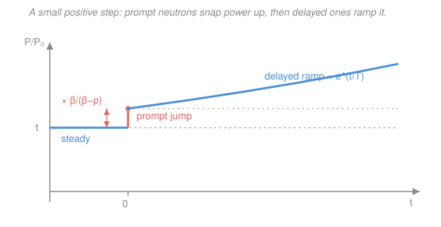

# Reactor Physics & Neutron Transport · Lesson 4.2: Reactivity & the prompt jump

> ⏱ ~15 min · Module 4: Reactor kinetics & reactivity · Builds on: [4.1 Delayed neutrons & the point-kinetics equations](04-01-delayed-neutrons-point-kinetics.md), [`ode-refresher` syllabus](../../ode-refresher/syllabus.md) · Unlocks: [4.3 Prompt criticality](04-03-prompt-criticality.md), [4.4 The inhour equation & reactor period](04-04-inhour-equation-reactor-period.md)

## Why this matters

An operator never dials $k$. The knob that actually runs a reactor is how far $k$ sits from exactly critical — that fractional gap is **reactivity**, $\rho$. Pull a control rod a little and you insert a small positive $\rho$; the power doesn't rise smoothly from where it was. It *lurches* — an almost-instant jump the moment the rod moves — and only then begins the slow climb operators steer by. That two-part response, the **prompt jump** followed by the **delayed ramp**, is the single most important picture in reactor control, and it falls straight out of the point-kinetics equations you wrote in [4.1](04-01-delayed-neutrons-point-kinetics.md).

## The idea

Reactivity measures *fractional departure from critical*. At $k=1$ the chain reaction exactly replaces itself and $\rho=0$. A little above, $\rho>0$ and power grows; a little below, $\rho<0$ and it sags. It's just a rescaled, more convenient version of $k$ — but rescaled so that "zero" means "critical," which is where a reactor lives.

Now the surprising part. From [4.1](04-01-delayed-neutrons-point-kinetics.md), the neutron population has two reservoirs on wildly different clocks: prompt neutrons that appear in $\sim\!10^{-4}\,\text{s}$, and a small delayed fraction $\beta$ stored in precursors that trickle out over seconds. Insert a *small* positive step (smaller than $\beta$). The prompt population reacts almost instantly — but it can't run away by itself, because the fraction $\beta$ it's missing is exactly what it needs to be self-sustaining on prompt neutrons alone. So the prompt neutrons snap to a **new, higher equilibrium** in a fraction of a second and then wait. The power we see jumps by a fixed factor, essentially instantly. After that, the slow leak of delayed neutrons from the precursors drives a gentle exponential rise. **The prompt neutrons set the height of the jump; the delayed neutrons set the speed of the ramp.**

The trick that makes this solvable by hand is to notice the prompt equilibration is so fast that we can pretend it's instantaneous — set the fast term to zero and let algebra hand us the jump. That's the **prompt-jump approximation**.

## The formal version

**Reactivity.** For a reactor with multiplication factor $k$,

$$\rho \equiv \frac{k-1}{k}.$$

*In words: reactivity is the fractional surplus (or deficit) of neutrons per generation — how far, in relative terms, the reactor is from exactly critical.* For the small departures that matter in operation ($k\approx1$), $\rho\approx k-1$. Positive $\rho$ is supercritical, negative is subcritical, $\rho=0$ is critical.

**Units of reactivity.** $\rho$ is dimensionless, so it comes in flavors:

- **Absolute** — the bare number, e.g. $\rho=0.0015$.
- **pcm** ("percent mille," $10^{-5}$): $\rho=0.0015=150\ \text{pcm}$. The natural resolution of a control-rod adjustment.
- **Dollars and cents:** measure $\rho$ in units of the delayed fraction $\beta$,

$$\rho\,[\$]=\frac{\rho}{\beta},\qquad 1\ \text{dollar}\equiv\rho=\beta,\qquad 1\ \text{cent}=0.01\,\beta.$$

*In words: one dollar of reactivity is exactly the amount that makes the reactor critical on prompt neutrons alone.* This is the most physical unit, because — as the next lesson shows — the reactor's whole personality changes at $\rho=\beta$. Everything comfortable happens below one dollar.

**The point-kinetics equations (one delayed group, from [4.1](04-01-delayed-neutrons-point-kinetics.md)).** With power $P(t)$, precursor population $C(t)$, delayed fraction $\beta$, decay constant $\lambda$, and mean generation time $\Lambda$:

$$\frac{dP}{dt}=\frac{\rho-\beta}{\Lambda}\,P+\lambda C,\qquad \frac{dC}{dt}=\frac{\beta}{\Lambda}\,P-\lambda C.$$

*In words: prompt production/loss plus the delayed drip drives the power; the power feeds the precursor reservoir, which decays at rate $\lambda$.*

**The prompt-jump (prompt-drop) approximation.** The prompt term carries the coefficient $1/\Lambda$ with $\Lambda\sim10^{-4}\,\text{s}$ — enormous. So $P$ re-equilibrates to that term almost instantly. Approximate this by dropping the derivative, $\Lambda\,dP/dt\approx0$, i.e. set the prompt term to balance:

$$(\rho-\beta)P+\Lambda\lambda C\approx0\quad\Longrightarrow\quad P\approx\frac{\Lambda\lambda C}{\beta-\rho}.$$

At the instant of a step, the precursors haven't moved yet ($C=C_0$, its pre-step value). Before the step the reactor was critical and steady, so the precursor equation at equilibrium gives $\lambda C_0=\dfrac{\beta}{\Lambda}P_0$, i.e. $\Lambda\lambda C_0=\beta P_0$. Substituting:

$$\boxed{\ \frac{P(0^+)}{P_0}=\frac{\beta}{\beta-\rho}\ }$$

*In words: the instant you insert a small step $\rho<\beta$, power jumps by the factor $\beta/(\beta-\rho)$ — bigger the closer $\rho$ creeps toward one dollar.* A negative step gives the mirror image, a **prompt drop** by $\beta/(\beta+|\rho|)<1$.

**The asymptotic period.** After the jump, seek an exponential $P\propto e^{\omega t}$. Substituting $P,C\propto e^{\omega t}$ and dropping the tiny $\Lambda\omega$ term gives the stable root

$$\omega=\frac{\lambda\,\rho}{\beta-\rho},\qquad T\equiv\frac{1}{\omega}=\frac{\beta-\rho}{\lambda\,\rho}.$$

*In words: after the jump, power grows exponentially with a stable period $T$ set by how fast the delayed precursors ($\lambda$) can feed the surplus.* $T$ is the **reactor period** — the e-folding time — and its general form is the inhour equation of [4.4](04-04-inhour-equation-reactor-period.md). Note $\omega\to\infty$ as $\rho\to\beta$: at one dollar the delayed neutrons stop being the bottleneck. That cliff is [4.3](04-03-prompt-criticality.md).

## Picture

## Worked examples

**Example 1 (the prompt jump — boss-style).** A reactor at steady power takes a step $\rho=+0.0015$ with $\beta=0.0065$. Find the immediate power jump.

Check we're below one dollar: $\rho/\beta=0.0015/0.0065=0.23$, so $\rho=23\ \text{cents}<\$1$ — the prompt-jump approximation applies. Then

$$\frac{P(0^+)}{P_0}=\frac{\beta}{\beta-\rho}=\frac{0.0065}{0.0065-0.0015}=\frac{0.0065}{0.0050}=1.30.$$

Power leaps by **30%** almost instantly — before any operator can react — then ramps on. With $\lambda=0.08\ \text{s}^{-1}$ the ramp period is

$$T=\frac{\beta-\rho}{\lambda\rho}=\frac{0.0050}{0.08\times0.0015}=\frac{0.0050}{0.00012}\approx42\ \text{s},$$

so power e-folds every $\sim\!42\,$s and doubles every $T\ln2\approx29\,$s. A 23-cent nudge: 30% now, then doubling every half-minute.

**Example 2 (dollars both ways, and a negative step).** (a) Convert $\rho=0.0015$ to cents with $\beta=0.0065$: $\rho/\beta=0.2308$, so $\rho\approx\$0.23=23\ \text{cents}$ (and $=150\ \text{pcm}$). (b) Back: "23 cents" means $\rho=0.23\times\beta=0.23\times0.0065=0.0015$ ✓. (c) Now insert the *negative* step $\rho=-0.0015$. The jump factor is still $\beta/(\beta-\rho)$, but $\rho<0$:

$$\frac{P(0^+)}{P_0}=\frac{\beta}{\beta+|\rho|}=\frac{0.0065}{0.0065+0.0015}=\frac{0.0065}{0.0080}=0.81.$$

Power **drops 19% instantly** — the prompt-drop — then sags slowly toward a lower level on a negative period. Same physics, sign flipped: whatever surplus (or deficit) you dial, the prompt neutrons register it *now* and the delayed neutrons take their time.

## Watch out

- **You might think reactivity and $k$ say different things.** They're the same information: $\rho=(k-1)/k$. Reactivity is just $k$ recentered on critical and (usually) rescaled into dollars. Use $\rho$ when you're near critical — which, operating a reactor, is always.
- **You might read the jump as the whole story.** The prompt jump is instantaneous and *bounded* (a fixed factor $\beta/(\beta-\rho)$); it is not the reactor "taking off." The genuine, sustained power rise is the slow delayed ramp behind it. Below one dollar, delayed neutrons govern the pace — which is the only reason a human can steer.
- **You might expect symmetry between positive and negative steps.** The prompt jump/drop factors are exact mirrors, but the *asymptotic* response is not: negative reactivity's period saturates (there's a fastest a subcritical reactor can shut down — the longest-lived precursor sets it), while positive reactivity's period shrinks without bound toward $\rho=\beta$. That asymmetry is quantified in [4.4](04-04-inhour-equation-reactor-period.md).

## One-liner

> A small step $\rho<\beta$ makes power leap at once by $\beta/(\beta-\rho)$ — the prompt jump — then climb slowly on the delayed-neutron period $T=(\beta-\rho)/\lambda\rho$.

## Problems

**P1 (🟢)** A reactor with $\beta=0.0075$ takes a step $\rho=+0.0020$. (a) Express $\rho$ in pcm and in dollars/cents. (b) Find the immediate prompt-jump factor $P(0^+)/P_0$.

**P2 (🟡)** Same reactor, $\beta=0.0065$, $\lambda=0.08\ \text{s}^{-1}$, now takes a *negative* step $\rho=-0.0026$. (a) Find the prompt-drop factor. (b) Find the stable asymptotic period $T$, and say whether power is rising or falling.

**P3 (🔴)** An operator wants a stable positive period of exactly $T=60\ \text{s}$ ($\beta=0.0065$, $\lambda=0.08\ \text{s}^{-1}$). (a) What reactivity $\rho$ must be inserted? Give it in pcm and cents. (b) Is the prompt-jump approximation valid here, and if so, how big is the jump? *(This inverts the period relation — the everyday task the [inhour equation](04-04-inhour-equation-reactor-period.md) generalizes.)*

Solutions

**P1.** (a) $\rho=0.0020=200\ \text{pcm}$. In dollars, $\rho/\beta=0.0020/0.0075=0.267$, so $\rho\approx\$0.27=27\ \text{cents}$ — below one dollar, so the approximation holds. (b)

$$\frac{P(0^+)}{P_0}=\frac{\beta}{\beta-\rho}=\frac{0.0075}{0.0075-0.0020}=\frac{0.0075}{0.0055}=1.36.$$

Power jumps 36% instantly. *Check:* $\rho<\beta$ keeps the factor finite and $>1$, as a positive step must. ✓

**P2.** (a) Negative step, so $\rho=-0.0026$:

$$\frac{P(0^+)}{P_0}=\frac{\beta}{\beta-\rho}=\frac{0.0065}{0.0065+0.0026}=\frac{0.0065}{0.0091}=0.714.$$

Power drops immediately to 71% of steady. (b) Stable root:

$$\omega=\frac{\lambda\rho}{\beta-\rho}=\frac{0.08\times(-0.0026)}{0.0091}=\frac{-0.000208}{0.0091}=-0.0229\ \text{s}^{-1},$$

$$T=\frac{1}{\omega}=-43.7\ \text{s}.$$

The negative period means power is **falling** — e-folding *down* every $\sim\!44\,$s after the initial drop. *Check:* negative $\rho$ gives negative $\omega$ and a drop factor $<1$, both consistent with shutdown. ✓

**P3.** (a) A period $T=60\ \text{s}$ means $\omega=1/T=0.01667\ \text{s}^{-1}$. Invert $\omega=\lambda\rho/(\beta-\rho)$:

$$\omega(\beta-\rho)=\lambda\rho\ \Longrightarrow\ \omega\beta=\rho(\lambda+\omega)\ \Longrightarrow\ \rho=\frac{\omega\beta}{\lambda+\omega}=\frac{0.01667\times0.0065}{0.08+0.01667}=\frac{1.083\times10^{-4}}{0.09667}.$$

$$\rho=1.12\times10^{-3}=112\ \text{pcm},\qquad \frac{\rho}{\beta}=\frac{0.00112}{0.0065}=0.172\ \Rightarrow\ \approx17\ \text{cents}.$$

(b) $\rho=17\ \text{cents}\ll\$1$, so yes — the prompt-jump approximation is valid. The jump:

$$\frac{P(0^+)}{P_0}=\frac{\beta}{\beta-\rho}=\frac{0.0065}{0.0065-0.00112}=\frac{0.0065}{0.00538}=1.21.$$

So a 17-cent insertion gives a 21% prompt jump, then a steady 60-second period. *Check:* substitute back — $\omega=0.08\times0.00112/0.00538=0.01665\ \text{s}^{-1}$, $T\approx60\,$s ✓. Sensible: a modest reactivity buys a slow, controllable period, exactly what an operator wants. ✓

## Flashback

**From Lesson 4.1 (equilibrium precursors).** A reactor sits at steady power $P_0$ (critical, $\rho=0$) with a single delayed group: $\beta=0.0064$, $\lambda=0.076\ \text{s}^{-1}$, $\Lambda=6\times10^{-5}\,\text{s}$. Find the equilibrium precursor population $C_0$ in terms of $P_0$, and comment on its size relative to $P_0$.

Solution

At steady state the precursor population is constant, so $dC/dt=0$ in the precursor equation:

$$\frac{\beta}{\Lambda}P_0-\lambda C_0=0\ \Longrightarrow\ C_0=\frac{\beta}{\Lambda\lambda}P_0=\frac{0.0064}{(6\times10^{-5})(0.076)}P_0=\frac{0.0064}{4.56\times10^{-6}}P_0\approx1.40\times10^{3}\,P_0.$$

So the precursor reservoir holds roughly **1,400 times** the instantaneous power-equivalent population. *Comment:* delayed neutrons are only $\beta=0.64\%$ of each generation, yet because they leak out slowly ($1/\lambda\approx13\,$s) they accumulate into an enormous stored pool. That giant, sluggish reservoir is precisely what damps the reactor's response — the reason the prompt jump is bounded and the ramp is gentle. *Check:* $C_0/P_0=\beta/(\Lambda\lambda)$ is dimensionless-times-seconds consistent with $C$ and $P$ carrying the same population units and $\lambda C_0$ having units of $P_0/\text{time}$. ✓

## Connections

- **Backward:** the two point-kinetics ODEs come from [4.1](04-01-delayed-neutrons-point-kinetics.md); the prompt-jump trick is exactly the fast/slow separation of a stiff system — setting the fast variable to its quasi-equilibrium — that keeps $\Lambda$ from forcing microscopic time steps.
- **Forward:** [4.3](04-03-prompt-criticality.md) asks what happens as $\rho\to\beta$ (the jump factor $\beta/(\beta-\rho)$ blows up — prompt criticality), and [4.4](04-04-inhour-equation-reactor-period.md) generalizes the asymptotic period to all six delayed groups via the inhour equation.
- **Sideways (ODEs / applied math):** dropping $\Lambda\,dP/dt$ is a singular-perturbation quasi-steady-state reduction — the same move that collapses a stiff two-timescale system to its slow manifold, seen in enzyme kinetics (Michaelis–Menten) and in stiff-ODE solvers studied in the numerical-methods track.
