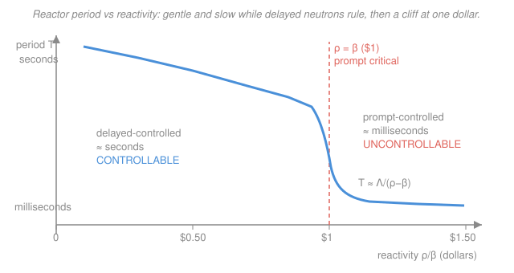

# Reactor Physics & Neutron Transport · Lesson 4.3: Prompt criticality — why $\beta$ is the speed limit

> ⏱ ~15 min · Module 4: Reactor kinetics & reactivity · Builds on: [4.2 Reactivity & the prompt jump](04-02-reactivity-prompt-jump.md), [4.1 Delayed neutrons & the point-kinetics equations](04-01-delayed-neutrons-point-kinetics.md) · Unlocks: [4.4 The inhour equation & the reactor period](04-04-inhour-equation-reactor-period.md)

## Why this matters

A running reactor is a chain reaction balanced on a knife edge, and the thing keeping it controllable is astonishingly small: the roughly 0.65% of fission neutrons that come out *late*, seconds after the fission that made them. Spend that margin and the reactor stops answering to control rods and starts answering to physics on a millisecond clock. That threshold has a name — **prompt critical** — and a value — **one dollar** of reactivity. It is the single most important number an operator never wants to reach. The SL-1 accident (1961) and the Chernobyl excursion (1986) are, in the end, both stories of a reactor pushed past a dollar.

## The idea

From [4.1](04-01-delayed-neutrons-point-kinetics.md): most fission neutrons are **prompt** (born within $\sim10^{-14}$ s), but a small fraction $\beta\approx0.0065$ are **delayed**, emitted seconds later by decaying fission-product *precursors*. Those latecomers are the reason a reactor is slow enough to steer.

Here is the key: **the prompt neutrons alone are not quite enough to sustain the chain.** Just below criticality, if you deleted the delayed neutrons the reaction would die out — the chain only closes *because* the precursors trickle in a few more. So the tempo of the whole reactor is set by the slowest link, the precursor decay: seconds. A control rod moving over seconds can keep up. That is the entire gift of delayed neutrons.

Now add reactivity. As you make the reactor more supercritical, you lean less and less on the delayed neutrons — the prompt chain gets closer to sustaining itself alone. At exactly $\rho=\beta$, it *does*: the prompt neutrons by themselves close the loop, and the delayed neutrons are no longer needed. The slow link is gone. The tempo collapses from the precursor timescale ($\sim$ seconds) to the **prompt generation time** $\Lambda\sim10^{-4}$ s — four orders of magnitude faster than any rod can move. Push even a hair past $\beta$ and power runs away on that prompt clock. That cliff is what this lesson is about.

## The formal version

**Prompt multiplication.** Recall reactivity $\rho=(k-1)/k$, so the multiplication factor is $k=1/(1-\rho)$, where $k$ is neutrons in one generation per neutron in the last. Of the neutrons a fission generation produces, only the fraction $(1-\beta)$ are prompt. So the multiplication carried by prompt neutrons *alone* is

$$k_p = k\,(1-\beta).$$

*In words: the prompt-only chain has an effective multiplication that is the full $k$ discounted by the missing delayed fraction.*

The prompt chain sustains itself when $k_p=1$:

$$k(1-\beta)=1 \;\Longrightarrow\; k=\frac{1}{1-\beta} \;\Longrightarrow\; \rho = \frac{k-1}{k}=1-(1-\beta)=\beta.$$

$$\boxed{\;\rho=\beta:\quad\textbf{prompt critical}\;}$$

*In words: exactly at $\rho=\beta$ the prompt neutrons by themselves are critical; below it the chain needs its delayed neutrons, above it the prompt neutrons alone are supercritical.* This is the physics behind the **dollar**: define reactivity in dollars as $\rho/\beta$, so $\rho=\beta$ is exactly **one dollar**, and a cent is $\beta/100$. The dollar is not an arbitrary scale — it is normalized to $\beta$ precisely because $\beta$ is where the character of the reactor changes.

**The prompt period.** For $\rho>\beta$ the precursors can no longer keep pace, so drop the delayed source term $\sum_i\lambda_i C_i$ from the point-kinetics equation ([4.1](04-01-delayed-neutrons-point-kinetics.md)). What remains is a bare first-order linear ODE for the power $P(t)$:

$$\frac{dP}{dt}\approx\frac{\rho-\beta}{\Lambda}\,P \;\Longrightarrow\; P(t)=P_0\,e^{t/T_p},\qquad \boxed{\,T_p=\frac{\Lambda}{\rho-\beta}\,}$$

where $\Lambda$ (s) is the prompt neutron generation time and $T_p$ is the **prompt period** (the e-folding time). *In words: once you are prompt-supercritical, power grows exponentially with a period set by the tiny generation time divided by how far past a dollar you are* — and since $\rho-\beta$ can be a minuscule number, $T_p$ can be catastrophically short. Valid only for $\rho>\beta$; below a dollar you must keep the delayed source, which is the inhour equation of [4.4](04-04-inhour-equation-reactor-period.md).

## Picture

## Worked examples

Use $\beta=0.0065$, $\Lambda=5\times10^{-5}\,\text{s}$, one-delayed-group decay constant $\bar\lambda=0.08\,\text{s}^{-1}$ throughout (the same numbers as Boss Problem 4). For the delayed region, the stable asymptotic period from one-group kinetics is $T=\dfrac{\beta-\rho}{\bar\lambda\,\rho}$ (derived in [4.4](04-04-inhour-equation-reactor-period.md); use it here as a yardstick).

**Example 1 — just barely over the line.** Insert $\rho=1.005\beta$: half a cent past a dollar. Then $\rho-\beta=0.005\beta=0.005\times0.0065=3.25\times10^{-5}$, and

$$T_p=\frac{\Lambda}{\rho-\beta}=\frac{5\times10^{-5}}{3.25\times10^{-5}}\approx 1.5\ \text{s}.$$

Compare to normal operation, where an operator nudges reactivity by a few cents — say $\rho=0.05\beta$ (5 cents), comfortably delayed-controlled:

$$T=\frac{\beta-\rho}{\bar\lambda\,\rho}=\frac{0.95\beta}{0.08\times0.05\beta}=\frac{0.95}{0.004}\approx 237\ \text{s}\approx 4\ \text{min}.$$

So crossing from the cents-region to *half a cent over a dollar* collapses a leisurely 4-minute clock into a 1.5-second one — and, as Example 2 shows, it only gets worse from there. That is the cliff.

**Example 2 — delayed vs prompt, side by side.** Contrast two insertions.

*Delayed,* $\rho=0.5\beta$ (fifty cents):

$$T=\frac{\beta-\rho}{\bar\lambda\,\rho}=\frac{0.5\beta}{0.08\times0.5\beta}=\frac{1}{0.08}=12.5\ \text{s}.$$

Power e-folds every 12.5 s; a rod insertion or a temperature feedback ([5.1](05-01-reactivity-feedback-temperature-coefficients.md)) catches it easily.

*Prompt,* $\rho=1.05\beta$ (five cents *over* a dollar): $\rho-\beta=0.05\beta=3.25\times10^{-4}$, so

$$T_p=\frac{\Lambda}{\rho-\beta}=\frac{5\times10^{-5}}{3.25\times10^{-4}}\approx 0.15\ \text{s}=150\ \text{ms}.$$

Power e-folds every 150 ms — a factor of 100 in $T_p\ln100\approx0.71\,\text{s}$. No mechanical rod, and certainly no human, responds that fast; only prompt physics (Doppler broadening, fuel disassembly) can stop it. **The safety margin is the whole story: the difference between these two cases is just $0.55\beta$ — 55 cents of reactivity — yet one is a routine maneuver and the other is a power excursion. The cardinal rule: keep every insertion, and the total available excess reactivity, well under one dollar.**

## Watch out

- **You might think going a little over a dollar is just a little worse than being under it.** It is a *regime change*, not a gradual one. Below $\beta$ the reactor leans on second-scale precursors (controllable); at and above $\beta$ it runs on the millisecond generation time (uncontrollable). The dollar is a wall, not a slope.
- **You might think $T_p=\Lambda/(\rho-\beta)$ works for any positive $\rho$.** It only holds for $\rho>\beta$, where you may neglect the delayed neutrons. Below a dollar the delayed source dominates the period entirely and $\rho-\beta<0$ would give a nonsensical negative time — use the inhour equation ([4.4](04-04-inhour-equation-reactor-period.md)) there.
- **You might confuse the prompt *jump* with prompt *critical*.** [4.2](04-02-reactivity-prompt-jump.md)'s prompt jump is the sudden but **bounded** step in power right after a sub-dollar insertion — it settles onto a slow delayed period. Prompt critical is the **unbounded** runaway once $\rho\ge\beta$: no settling, just exponential growth on the prompt clock.

## One-liner

> Delayed neutrons buy you a reactor measured in seconds; at $\rho=\beta$ — one dollar — you spend them all, and the reactor's clock collapses to the prompt generation time $\Lambda$.

## Problems

Use $\beta=0.0065$, $\Lambda=5\times10^{-5}\,\text{s}$, $\bar\lambda=0.08\,\text{s}^{-1}$.

**P1 (🟢)** Express each reactivity in dollars and state whether the reactor is delayed-supercritical, exactly prompt critical, or prompt supercritical: (a) $\rho=0.0026$, (b) $\rho=0.0065$, (c) $\rho=0.0072$.

**P2 (🟡)** A step insertion brings a reactor to $\rho=1.10\beta$. (a) Find the prompt period $T_p$. (b) How long for power to grow by a factor of 100? (c) Compare that time to the delayed case $\rho=0.5\beta$ (use $T=\dfrac{\beta-\rho}{\bar\lambda\rho}$), and state the ratio.

**P3 (🔴)** Starting from $k_p=k(1-\beta)$, show the prompt-critical condition is $\rho=\beta$. Then, from the point-kinetics equation $\dfrac{dP}{dt}=\dfrac{\rho-\beta}{\Lambda}P+\sum_i\lambda_iC_i$, explain which term you drop for $\rho>\beta$ and why, and recover $T_p=\Lambda/(\rho-\beta)$.

Solutions

**P1** Dollars $=\rho/\beta$.
(a) $0.0026/0.0065=0.40=\$0.40$ — **delayed-supercritical** (below a dollar; runs on delayed neutrons).
(b) $0.0065/0.0065=1.00=\$1.00$ — **exactly prompt critical** ($\rho=\beta$, the threshold).
(c) $0.0072/0.0065=1.108\approx\$1.11$ — **prompt supercritical** (over a dollar; prompt runaway).

*Check.* Only (c) has $\rho>\beta$, so only (c) sits in the uncontrollable regime — consistent with the cliff in the figure. ✓

**P2** (a) $\rho-\beta=0.10\beta=0.10\times0.0065=6.5\times10^{-4}$, so

$$T_p=\frac{\Lambda}{\rho-\beta}=\frac{5\times10^{-5}}{6.5\times10^{-4}}\approx 0.077\ \text{s}=77\ \text{ms}.$$

(b) Factor of 100 means $e^{t/T_p}=100\Rightarrow t=T_p\ln100=0.077\times4.605\approx 0.35\ \text{s}$.

(c) Delayed case $\rho=0.5\beta$: $T=\dfrac{0.5\beta}{0.08\times0.5\beta}=\dfrac{1}{0.08}=12.5\ \text{s}$, so a factor of 100 takes $12.5\times4.605\approx 57.6\ \text{s}$. Ratio $57.6/0.35\approx 1.6\times10^{2}$: the prompt case reaches ×100 power **about 160 times faster**.

*Check.* Both times scale as $\ln100$, so the ratio is just $T/T_p=12.5/0.077\approx162$ ✓ — and 77 ms is on the prompt scale ($\sim\Lambda\times10^3$), while 12.5 s is on the delayed scale ($\sim1/\bar\lambda$), exactly the two timescales the lesson contrasts. ✓

**P3** Prompt neutrons carry multiplication $k_p=k(1-\beta)$. Set $k_p=1$: $k=1/(1-\beta)$, so $\rho=\dfrac{k-1}{k}=1-\dfrac1k=1-(1-\beta)=\beta$. Hence prompt critical at $\rho=\beta$.

For $\rho>\beta$ the reactor is prompt supercritical: the prompt chain diverges on its own on the $\Lambda$ timescale ($\sim10^{-4}$ s), while the delayed source $\sum_i\lambda_iC_i$ builds only on the precursor timescale ($1/\lambda_i\sim$ seconds). Over the millisecond growth of $P$, the precursor populations $C_i$ — and hence that source — are essentially frozen and negligible beside the exploding prompt term. Dropping it leaves

$$\frac{dP}{dt}\approx\frac{\rho-\beta}{\Lambda}P,$$

a first-order linear ODE with solution $P=P_0e^{t/T_p}$ and $T_p=\Lambda/(\rho-\beta)$.

*Check.* At $\rho=\beta$ the coefficient $(\rho-\beta)/\Lambda$ is exactly zero — the prompt term neither grows nor decays, and the (now non-negligible) delayed neutrons set the pace: the boundary of the regime, as it should be. ✓

## Flashback

**From Lesson 4.2 (Reactivity & the prompt jump):** A reactor at steady power $P_0$ takes a step insertion $\rho=0.0013$ with $\beta=0.0065$. (a) What is this in dollars? (b) Use the prompt-jump approximation $\dfrac{P_1}{P_0}=\dfrac{\beta}{\beta-\rho}$ to find the immediate fractional jump in power.

Solution

(a) Dollars $=\rho/\beta=0.0013/0.0065=0.20=\$0.20$ (twenty cents) — safely sub-dollar, so the prompt jump applies and settles onto a slow delayed period.

(b) $\dfrac{P_1}{P_0}=\dfrac{\beta}{\beta-\rho}=\dfrac{0.0065}{0.0065-0.0013}=\dfrac{0.0065}{0.0052}=1.25$: power jumps **25%** essentially instantly, then rises slowly on the delayed period.

*Check.* The denominator $\beta-\rho>0$ because $\rho<\beta$ — the jump is finite. As $\rho\to\beta$ the denominator $\to0$ and the jump blows up: that divergence *is* the approach to prompt criticality this lesson describes. ✓

## Connections

- **Backward:** the prompt jump of [4.2](04-02-reactivity-prompt-jump.md) is this lesson's near-miss — its jump factor $\beta/(\beta-\rho)$ diverges exactly as $\rho\to\beta$, which is the wall we hit here. And $\beta$, $\Lambda$, and the precursor picture are all from [4.1](04-01-delayed-neutrons-point-kinetics.md); the delayed-neutron fractions themselves trace to the fission-product physics of the [`intro-nuclear-engineering`](../../intro-nuclear-engineering/syllabus.md) course.
- **Forward:** [4.4](04-04-inhour-equation-reactor-period.md) makes the period-vs-reactivity curve of the figure quantitative for *any* $\rho$ (the inhour equation), joining the delayed and prompt branches smoothly; and the feedbacks of [5.1](05-01-reactivity-feedback-temperature-coefficients.md)–[5.2](05-02-doppler-moderator-void-coefficients.md) are what physically *prevent* reaching a dollar — the Doppler effect is the reactor's own reflex against a prompt excursion.
- **Sideways (ODEs):** the prompt runaway is the pure exponential-growth solution of a first-order linear ODE, $\dot P=(\text{const})P$ — the same $e^{t/T_p}$ math as radioactive growth or unstable equilibria in [`ode-refresher`](../../ode-refresher/syllabus.md). Point kinetics with its fast prompt mode and slow precursor modes is a textbook **stiff** ODE system, the kind that demands the implicit solvers of [`numerical-analysis`](../../numerical-analysis/syllabus.md).
