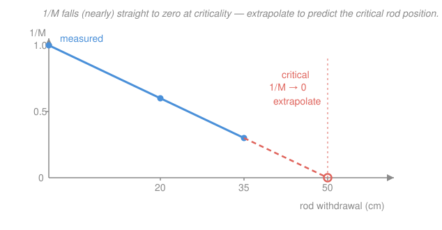

# Reactor Physics & Neutron Transport · Lesson 4.5: Sources, subcritical multiplication & startup

> ⏱ ~15 min · Module 4: Reactor kinetics & reactivity · Builds on: [4.4 The inhour equation & the reactor period](04-04-inhour-equation-reactor-period.md), [4.1 Delayed neutrons & point kinetics](04-01-delayed-neutrons-point-kinetics.md) · Unlocks: Module 5 (feedback & poisons), [5.6 Reactor control & operation](05-06-reactor-control-operation.md)

## Why this matters

Every reactor spends time *below* critical — before startup, during a fuel load, after a scram. In that regime the chain reaction doesn't sustain itself, so you'd think the neutron flux is zero and there's nothing to measure. It isn't, and that's the whole game: a neutron **source** plus a subcritical core produces a *steady, multiplied* flux, and how big that multiplication is tells you exactly how close to critical you are. The technique built on this — the $1/M$ plot — is how operators walk a reactor up to criticality without ever overshooting into an accident. It's the single most-used startup procedure in the industry.

## The idea

Drop one neutron into a subcritical assembly with $k < 1$. It causes some fissions, producing on average $k$ neutrons in the next generation; those make $k^2$; then $k^3$; and so on. Because $k < 1$ the chain *dies out* — but not instantly. Before it does, that one source neutron has spawned a whole finite family:

$$1 + k + k^2 + k^3 + \cdots = \frac{1}{1-k}.$$

So each source neutron is quietly amplified into $\tfrac{1}{1-k}$ neutrons total. Feed the core a steady source of $S$ neutrons per second and the population settles at a steady level proportional to $\tfrac{S}{1-k}$. Nothing runs away — the flux just sits there, held up by the source and magnified by the multiplication.

The punchline: as you make the core less subcritical (pull rods, $k \to 1$), that $\tfrac{1}{1-k}$ factor **blows up**. At $k = 0.9$ it's 10; at $k = 0.99$ it's 100. So the flux (and the count rate on your detector) climbs dramatically as you near critical — and it does so in a way you can measure *from a safe distance below*, long before the chain reaction can sustain itself. That measurable climb is your early-warning system.

## The formal version

**Subcritical multiplication.** For a source-driven subcritical system, the source multiplication factor is

$$M \equiv \frac{N}{S} = \frac{1}{1-k},$$

where $S$ is the source strength (neutrons/s), $N$ the total steady neutron production rate including the source, and $k = k_{\text{eff}} < 1$ the effective multiplication factor from [2.2](02-02-leakage-six-factor-formula.md). *In words: each source neutron and its entire decaying fission chain sum to $\tfrac{1}{1-k}$ neutrons, so the source's effect is magnified by $M$.*

**Source-driven flux.** Since the whole population scales with $S$ and with $M$, the steady scalar flux is

$$\phi \;\propto\; S\,M \;=\; \frac{S}{1-k}.$$

*In words: the flux you measure is the source, amplified by the multiplication — proportional to $S$ and rising sharply as $k \to 1$.* Note there is **no time dependence and no period** here: a subcritical reactor with a fixed source is at steady state (set $dP/dt = 0$ in the point-kinetics equations of [4.1](04-01-delayed-neutrons-point-kinetics.md) with $\rho < 0$ and a source term, and $P$ pins to a constant). You track *how close to critical* by the flux **level**, not by any rate of climb.

**The $1/M$ method (approach to critical).** A detector's count rate $C$ is proportional to the flux, so $C \propto M \propto \tfrac{1}{1-k}$. Take the reciprocal against a reference count rate $C_0$ (the deep-subcritical starting configuration):

$$\frac{1}{M} \;\equiv\; \frac{C_0}{C} \;=\; \frac{1-k}{1-k_0}.$$

*In words: the inverse count-rate ratio is proportional to $(1-k)$, so it falls linearly toward zero exactly as $k \to 1$.* Plot $1/M$ against rod withdrawal, draw the line through your data points, and read off where it hits zero — that's the predicted critical rod position. You extrapolate *ahead* of where you actually are, so you always know how much reactivity is left before you get there.

## Picture

## Worked examples

**Example 1 (subcritical multiplication — the sharp rise).** A source sits in a subcritical core. Compare the steady flux at $k = 0.90$ and at $k = 0.98$.

$$M(0.90) = \frac{1}{1-0.90} = \frac{1}{0.10} = 10, \qquad M(0.98) = \frac{1}{1-0.98} = \frac{1}{0.02} = 50.$$

Since $\phi \propto S\,M$ with the same source, the flux ratio is

$$\frac{\phi(0.98)}{\phi(0.90)} = \frac{M(0.98)}{M(0.90)} = \frac{50}{10} = 5.$$

A change in $k$ of just $0.08$ multiplies the flux fivefold. Push further — $k = 0.99$ gives $M = 100$, $k = 0.999$ gives $M = 1000$ — and you see the flux diverging as $k \to 1$. *That divergence is criticality announcing itself: at $k = 1$ the source is no longer needed and the chain sustains on its own.*

**Example 2 ($1/M$ approach to critical — extrapolate to the critical rod position).** During a startup the source gives a reference count rate $C_0 = 60$ cps with rods fully inserted. Rods are then withdrawn in steps:

| rod withdrawal | count rate $C$ | $1/M = C_0/C$ |
|---|---|---|
| 0 cm | 60 cps | $60/60 = 1.00$ |
| 20 cm | 100 cps | $60/100 = 0.60$ |
| 35 cm | 200 cps | $60/200 = 0.30$ |

Plot the three points and they fall on a straight line dropping $0.02$ per cm:

$$\text{slope} = \frac{0.30 - 0.60}{35 - 20} = \frac{-0.30}{15} = -0.02\ \text{cm}^{-1}.$$

Extrapolate to $1/M = 0$ from the last point $(35\ \text{cm},\,0.30)$:

$$0 = 0.30 + (-0.02)(x - 35) \;\Longrightarrow\; x - 35 = \frac{0.30}{0.02} = 15 \;\Longrightarrow\; x \approx 50\ \text{cm}.$$

Predicted critical rod position $\approx 50$ cm withdrawn. The *safe* move is never to jump straight there: withdraw a fraction of the remaining predicted distance (say to 42 cm), take a fresh count, re-plot, and re-extrapolate. If the line steepens — the predicted critical position creeping *toward* you — you slow down. The extrapolation is your continuously-updated distance-to-critical.

## Watch out

- **You might think a subcritical reactor with a source keeps climbing toward power.** It doesn't — it settles at a *steady* flux $\propto S/(1-k)$ and stays there. There is no period below critical (contrast [4.4](04-04-inhour-equation-reactor-period.md)). What rises is the flux **level** each time you add reactivity, not the flux at fixed $k$. Criticality is where the steady level would become infinite.
- **You might think $M = \tfrac{1}{1-k}$ works for any $k$.** It's a subcritical-only formula. For $k \ge 1$ the geometric series $1 + k + k^2 + \cdots$ *diverges*: a critical or supercritical assembly never reaches a source-driven steady state — it grows on its own, and multiplication ceases to be a finite number.
- **You might think you can withdraw rods straight to the extrapolated critical position.** Rod worth is nonlinear and your early extrapolation can *over*-predict the distance, so the true critical point may arrive sooner than the first line suggests. Always step conservatively and re-extrapolate; the $1/M$ plot is a prediction to update, not a target to rush.

## One-liner

> A neutron source turns "how far below critical are we?" into a number you can read off a detector — count rate $\propto \tfrac{1}{1-k}$ — and walking $1/M$ down to zero is how you reach criticality without ever overshooting.

## Problems

**P1 (🟢)** A subcritical assembly has an installed source and $k = 0.95$. (a) Find the subcritical multiplication $M$. (b) Rods are withdrawn until $k = 0.99$; by what factor does the steady flux increase, assuming the source is unchanged?

**P2 (🟡)** During startup, a detector reads $80$ cps with rods fully in (reference) and $400$ cps at 30 cm of withdrawal. Assuming the $1/M$ plot is linear from the fully-inserted point, estimate the critical rod position.

**P3 (🔴, optional)** Why do you always have a neutron source available, even in a freshly fueled core that has never operated? Name two intrinsic mechanisms and one installed option, and explain in one sentence what would go wrong with the $1/M$ startup procedure if the source were absent.

Solutions

**P1** (a) $M = \dfrac{1}{1-k} = \dfrac{1}{1-0.95} = \dfrac{1}{0.05} = 20.$

(b) The flux scales with $M$ at fixed source, so the ratio is

$$\frac{\phi(0.99)}{\phi(0.95)} = \frac{M(0.99)}{M(0.95)} = \frac{1/(1-0.99)}{1/(1-0.95)} = \frac{100}{20} = 5.$$

The flux rises **fivefold** for a $0.04$ increase in $k$ — the characteristic sharp climb near critical. *Check:* $M$ went from 20 to 100, and $100/20 = 5$; both are finite because $k < 1$. ✓

**P2** Form $1/M = C_0/C$ at each position, with $C_0 = 80$ cps:

$$\text{0 cm:}\quad \frac{1}{M} = \frac{80}{80} = 1.00, \qquad \text{30 cm:}\quad \frac{1}{M} = \frac{80}{400} = 0.20.$$

The line through $(0,\,1.00)$ and $(30,\,0.20)$ has slope

$$\frac{0.20 - 1.00}{30 - 0} = \frac{-0.80}{30} = -0.0267\ \text{cm}^{-1}.$$

Extrapolate to $1/M = 0$:

$$0 = 1.00 - 0.0267\,x \;\Longrightarrow\; x = \frac{1.00}{0.0267} \approx 37.5\ \text{cm}.$$

Predicted critical at $\approx 38$ cm of withdrawal. *Check:* the count rate rose 5× (80 → 400 cps) over 30 cm, so $1/M$ fell to $0.20$; a little more than half that distance again ($7.5$ cm) drives the remaining $0.20$ to zero — consistent with the constant slope. ✓

**P3** *Intrinsic sources* (always present in fuel): **spontaneous fission** of heavy nuclides (notably $^{238}$U, and $^{240}$Pu once any plutonium has bred in), and **$(\alpha,n)$ reactions** — alpha particles from actinide decay striking light nuclei (oxygen in the oxide fuel, or beryllium/boron nearby) and knocking out neutrons. *Installed option:* a manufactured **startup source** such as antimony–beryllium (a photoneutron source), plutonium–beryllium, americium–beryllium, or californium-252 (which is a strong spontaneous-fission emitter).

Without a source, a deeply subcritical core has so few neutrons that detectors read essentially nothing (statistical noise), so $C_0 \approx 0$ and $1/M = C_0/C$ is undefined — you would be withdrawing rods **blind**, with no measurable signal of how close to critical you are until the flux suddenly became large near $k = 1$, far too late to extrapolate safely. The source guarantees a detectable, predictable count rate that responds smoothly to reactivity all the way up.

## Flashback

**From Lesson 4.4 (The inhour equation & the reactor period):** A reactor gets a small positive step insertion $\rho = +0.0010$, with $\beta = 0.0065$ and a one-delayed-group decay constant $\bar\lambda = 0.08\ \text{s}^{-1}$. Using the one-delayed-group asymptotic result $\omega = \dfrac{\bar\lambda\,\rho}{\beta - \rho}$, find the stable reactor period $T$ and the doubling time. (Fresh variant — new $\rho$.)

Solution

The stable asymptotic growth rate is

$$\omega = \frac{\bar\lambda\,\rho}{\beta - \rho} = \frac{0.08 \times 0.0010}{0.0065 - 0.0010} = \frac{8.0\times10^{-5}}{0.0055} = 0.01455\ \text{s}^{-1}.$$

The reactor period is its reciprocal:

$$T = \frac{1}{\omega} = \frac{1}{0.01455} \approx 68.8\ \text{s} \;\approx\; 69\ \text{s}.$$

Power grows as $P(t) = P_0\,e^{t/T}$, so the doubling time is

$$t_2 = T\ln 2 = 68.8 \times 0.693 \approx 47.7\ \text{s} \;\approx\; 48\ \text{s}.$$

*Check:* $\rho = 0.0010$ is well below $\beta = 0.0065$ (about 15 cents), so the response is slow and delayed-neutron-controlled — a period of tens of seconds, comfortably manageable, exactly as intended. A larger $\rho$ shrinks $\beta - \rho$ and would shorten the period sharply. ✓

## Connections

- **Backward:** this is the point-kinetics picture of [4.1](04-01-delayed-neutrons-point-kinetics.md)–[4.2](04-02-reactivity-prompt-jump.md) run at $\rho < 0$: set $dP/dt = 0$ with a source and you get the steady subcritical level instead of a period. The multiplication $\tfrac{1}{1-k}$ is the neutron life cycle of the four-factor formula ([2.1](02-01-k-infinity-four-factor-formula.md)) summed over generations when each contributes a factor $k < 1$.
- **Forward:** every real startup and the operational picture in [5.6 Reactor control & operation](05-06-reactor-control-operation.md) lean on the $1/M$ plot; and understanding the source-held subcritical state is the baseline for the poison transients of Module 5, where negative reactivity from xenon ([5.3](05-03-xenon-135-iodine-pit.md)) can push a shut-down core so far subcritical that restart is impossible.
- **Sideways (analysis / control theory):** $\sum_{n\ge 0} k^n = \tfrac{1}{1-k}$ is the geometric series you met in [`calc-refresher`](../../calc-refresher/syllabus.md); the same closed form is the DC gain $\tfrac{1}{1-G}$ of a stable linear feedback loop and the Neumann series $(I-A)^{-1} = \sum A^n$ for a contraction — subcritical multiplication is a reactor wearing that identical mathematics.
