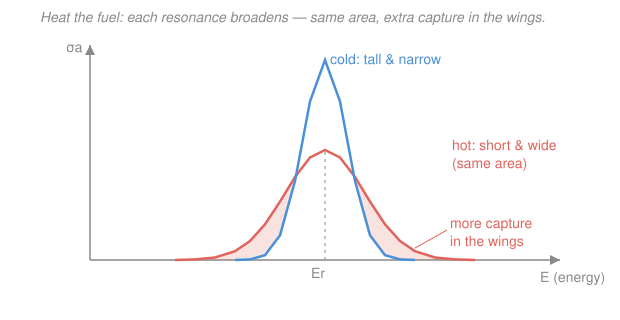

# Reactor Physics & Neutron Transport · Lesson 5.2: The Doppler & moderator/void coefficients

> ⏱ ~15 min · Module 5: Feedback, poisons & fuel evolution · Builds on: [5.1 Reactivity feedback & temperature coefficients](05-01-reactivity-feedback-temperature-coefficients.md), [3.2 Resonance escape & Fermi age](03-02-resonance-escape-fermi-age.md) · Unlocks: [5.3 Xenon-135 transients & the iodine pit](05-03-xenon-135-iodine-pit.md)

## Why this matters

In [5.1](05-01-reactivity-feedback-temperature-coefficients.md) you learned that a reactor with a *negative* temperature coefficient regulates itself: heat it up and reactivity falls, damping the power. But "the temperature coefficient" is really a sum of separate physical effects on separate clocks, and only one of them is reliably fast and reliably negative. This lesson computes the two that matter most. The **Doppler coefficient** is the reason a modern reactor cannot run away: it acts in the fuel, in microseconds, and it is almost always negative. The **moderator and void coefficients** are the ones you have to *engineer* the sign of — and the story of what happens when you get the void coefficient wrong has a name: Chernobyl. By the end you can look at a design and say whether it fights a power excursion or feeds it.

## The idea

**Doppler: hot fuel is a wider net.** Recall from [3.2](03-02-resonance-escape-fermi-age.md) the $^{238}$U capture resonances — narrow spikes in the absorption cross section that swallow neutrons on their way down to thermal. Those spikes sit at fixed energies *in the frame of the target nucleus*. But the nuclei are not sitting still: they jiggle with thermal motion, and the hotter the fuel, the faster they jiggle. A neutron of fixed lab energy now meets a *spread* of relative energies, so the sharp resonance gets **smeared out** — same total area under the peak (the number of nuclei didn't change), but shorter and wider. This is **Doppler broadening**, and it is the picture below.

Here is the subtle, crucial part. A tall, narrow cold resonance is *self-shielded*: it is so absorbing right at its peak that it eats every neutron at that exact energy in the outer skin of the fuel, and the flux at the peak energy collapses to nearly zero. A cross section that big is wasted — there are no neutrons left for it to capture. When broadening spreads that same area out into the **wings**, it moves absorption into energies where the flux is *not* yet depleted. More neutrons are actually caught. So heating the fuel **increases** effective resonance absorption, which **lowers** the resonance escape probability $p$, which lowers $k$. Hotter fuel, less reactivity: negative feedback, born right in the fuel pellet, essentially instantly.

**Moderator and void: it's about how much moderator is in the way.** Heat the *moderator* (the water) and it expands — fewer atoms per cubic centimeter, so less slowing-down power. Whether that helps or hurts depends on whether the reactor was starved for moderator or drowning in it. Boil the coolant and you punch **voids** (steam bubbles) into it, an even more violent version of the same density loss. In a light-water reactor the coolant *is* the moderator, so voids mean less moderation. In a graphite-moderated reactor the graphite does the moderating and the water is mostly a neutron *absorber* — so removing water removes an absorber, and reactivity goes *up*. Same event, opposite sign. That sign is the whole ballgame.

## The formal version

Each feedback is a **partial temperature (or void) coefficient** — the derivative of reactivity with respect to one physical variable, holding the others fixed. Reactivity is $\rho=(k-1)/k$; a convenient unit is the **pcm**, "per cent mille," $1\,\text{pcm}=10^{-5}\,\Delta k/k$.

**Doppler (fuel-temperature) coefficient.**

$$\alpha_D=\left(\frac{\partial\rho}{\partial T_f}\right),\qquad \Delta\rho_{\text{Doppler}}=\int_{T_{f,1}}^{T_{f,2}}\alpha_D\,dT_f,$$

where $T_f$ is the fuel temperature. *In words: $\alpha_D$ says how much reactivity you lose per degree the fuel heats.* Because it works through resonance broadening, its magnitude falls off roughly as $\alpha_D\propto T_f^{-1/2}$ (the broadening saturates as it gets hot), but its **sign stays negative** for any reactor with significant $^{238}$U — which is essentially all of them. It is **prompt**: the fission energy is deposited in the fuel, so $T_f$ rises in the same instant the power does, with no waiting for heat to conduct anywhere.

**Moderator temperature coefficient (MTC).**

$$\alpha_M=\left(\frac{\partial\rho}{\partial T_m}\right),$$

with $T_m$ the moderator temperature. *In words: how much reactivity you lose (or gain) per degree the moderator heats.* Two effects combine: lower moderator density (less moderation, spectrum hardens → resonance escape $p$ drops) and a shifted, hotter thermal spectrum (changes thermal cross sections). The **sign depends on the moderator-to-fuel ratio**: an *under-moderated* core loses reactivity when moderator thins out ($\alpha_M<0$, stable), an *over-moderated* core gains it ($\alpha_M>0$, dangerous). PWRs are deliberately built under-moderated so $\alpha_M<0$. The MTC is **delayed** relative to Doppler — heat must first leave the fuel and reach the coolant.

**Void coefficient.**

$$\alpha_v=\left(\frac{\partial\rho}{\partial \bar\alpha}\right),\qquad \Delta\rho_{\text{void}}\approx\alpha_v\,\bar\alpha,$$

where $\bar\alpha$ is the **void fraction** (fraction of coolant volume that is steam, usually quoted in %). *In words: how much reactivity each percent of boiling buys you.* It is the density effect taken to the limit. In a PWR/BWR the voided coolant was doing moderation, so $\alpha_v<0$ — **self-limiting**: more boiling → less reactivity → less power → less boiling. In the RBMK the voided coolant was a net *absorber*, so $\alpha_v>0$ — **self-amplifying**: more boiling → more reactivity → more power → more boiling. That is a positive feedback loop, the exact opposite of the stabilizing loop from [5.1](05-01-reactivity-feedback-temperature-coefficients.md).

**The rule that ties it together.** The total power coefficient — the sum of all of these, weighted by how much each variable moves as power rises — **must be negative** at operating conditions for a reactor to be inherently stable. Doppler is the anchor that guarantees it, because it is fast and always negative.

## Picture

Same nuclei, same total area under the peak — but heating the fuel trades height for width. The blue cold resonance is so tall it is self-shielded (the flux at its peak is already exhausted, so the extra height is wasted). The coral hot resonance moves that area out into the shaded **wings**, where the flux is still full and every extra barn of cross section captures a real neutron. Net effect: more resonance absorption, lower $p$, negative reactivity — the single most important inherent safety feature in the machine.

## Worked examples

**Example 1 (Doppler — from broadening to a number).** Trace the sign first, then estimate the size. A power rise heats the fuel; the $^{238}$U resonances broaden; self-shielding relaxes so effective resonance absorption goes **up**; resonance escape $p=\exp(-N_F I/\xi\Sigma_s)$ from [3.2](03-02-resonance-escape-fermi-age.md) **falls** (the effective resonance integral $I$ grew); $k_\infty=\eta f p\varepsilon$ **falls**; $\Delta\rho<0$. Negative, guaranteed, prompt.

Now the magnitude. Take a fuel Doppler coefficient $\alpha_D=-2.4\,\text{pcm}/^\circ\text{C}$ and a power maneuver that raises the average fuel temperature from $600^\circ\text{C}$ to $1100^\circ\text{C}$, so $\Delta T_f=500^\circ\text{C}$. Treating $\alpha_D$ as roughly constant over the swing (it really drifts as $T_f^{-1/2}$, so this is an average value across the range):

$$\Delta\rho_{\text{Doppler}}=\alpha_D\,\Delta T_f=(-2.4\,\text{pcm}/^\circ\text{C})(500^\circ\text{C})=-1200\,\text{pcm}=-0.0120.$$

In dollars (with $\beta=0.0065$, i.e. $1\$=650\,\text{pcm}$, from [4.2](04-02-reactivity-prompt-jump.md)):

$$\Delta\rho_{\text{Doppler}}=\frac{-1200}{650}\approx-1.85\,\$.$$

That is a large, immediate brake — nearly two dollars of negative reactivity slammed in the instant the fuel heats, before the coolant has felt a thing. This is why a well-designed reactor "catches itself" on a power spike.

**Example 2 (void/moderator — same event, opposite sign).** Coolant in the core starts to boil, reaching an average void fraction $\bar\alpha=5\%$. Compare two machines.

*PWR* (light water is the moderator; under-moderated by design), $\alpha_v=-120\,\text{pcm}/\%$:

$$\Delta\rho=\alpha_v\,\bar\alpha=(-120)(5)=-600\,\text{pcm}=-0.92\,\$.$$

Reactivity drops, power drops, boiling subsides — the reactor pushes back on the disturbance. Self-limiting.

*RBMK* (graphite moderates; water is a net absorber), $\alpha_v=+60\,\text{pcm}/\%$:

$$\Delta\rho=\alpha_v\,\bar\alpha=(+60)(5)=+300\,\text{pcm}=+0.46\,\$.$$

Reactivity *rises*, power rises, more coolant boils, void fraction climbs — and $\alpha_v>0$ means the next slice of void adds *more* positive reactivity. Watch where that goes: if the void reaches $\bar\alpha\approx11\%$,

$$\Delta\rho=(+60)(11)=+660\,\text{pcm}=+0.0066>\beta=0.0065,$$

the reactor is now **prompt critical** ($\rho>\beta$, [4.3](04-03-prompt-criticality.md)) on void feedback alone — power on the prompt-neutron timescale $\Lambda\sim10^{-4}\,\text{s}$, with no delayed neutrons to slow it. That runaway, with a slow, badly-designed control system and a positive void coefficient, is the physics behind the 1986 Chernobyl excursion. (Numbers here are illustrative but the signs and the mechanism are exact.) The lesson is stark: the *magnitude* of a coefficient sets how briskly a reactor settles; its **sign** decides whether it settles at all.

## Watch out

- **You might think broadening a resonance changes how many neutrons it *could* absorb — it doesn't change the area.** The resonance integral of an isolated peak is conserved under broadening. What changes is how much of that area is *usable*: self-shielding wastes a tall peak, so spreading the same area into the wings lets it capture more. The Doppler effect is entirely a self-shielding story, not a "bigger cross section" story.
- **You might assume every temperature coefficient is negative because 5.1 said stable reactors have $\alpha_T<0$.** Only the Doppler coefficient is negative by physics. The moderator/void coefficient's sign is a *design choice* set by the moderator-to-fuel ratio — under-moderated gives you the negative sign, over-moderated betrays you. A reactor can have a fine Doppler coefficient and still be unstable if its void coefficient is positive and large.
- **You might picture the void coefficient as "always loses moderator, so always negative."** Only when the coolant *is* the moderator. When coolant and moderator are different materials (RBMK: water + graphite), voiding the coolant can remove more absorption than moderation, flipping the sign positive.

## One-liner

> Doppler broadening makes hot fuel a wider, less-wasteful neutron trap — a prompt, essentially always-negative brake — while the moderator/void coefficient's *sign* is something you engineer, and getting it positive is how a reactor feeds its own excursion instead of damping it.

## Problems

**P1 (🟢)** A reactor has a Doppler (fuel-temperature) coefficient $\alpha_D=-1.8\,\text{pcm}/^\circ\text{C}$. A power increase raises the average fuel temperature by $450^\circ\text{C}$. (a) Find the Doppler reactivity change in pcm and in $\Delta k/k$. (b) Express it in dollars given $\beta=0.0064$. (c) In one sentence, explain via resonance broadening why the sign is negative.

**P2 (🟡)** Coolant boils to an average void fraction $\bar\alpha=6\%$ in two reactors. Reactor A (light-water PWR) has $\alpha_v=-140\,\text{pcm}/\%$; Reactor B (graphite-moderated) has $\alpha_v=+55\,\text{pcm}/\%$. (a) Compute $\Delta\rho$ for each in pcm. (b) For each, state whether the boiling is self-limiting or self-amplifying and why. (c) With $\beta=0.0065$, what void fraction would make Reactor B prompt critical on void feedback alone?

**P3 (🔴)** A PWR at power has three feedbacks acting as its temperature rises from cold-zero-power to hot-full-power: Doppler contributes $-900\,\text{pcm}$, the (negative) moderator temperature coefficient contributes $-700\,\text{pcm}$, and a small void contribution adds $-150\,\text{pcm}$. (a) What is the total **power defect** (the reactivity the control system must supply to hold the reactor critical at full power)? (b) The available control-rod excess reactivity is $2500\,\text{pcm}$; how much margin is left after overcoming the power defect? (c) If a design change flipped the moderator coefficient to $+700\,\text{pcm}$, what would the new total power coefficient contribution be, and why is that a safety problem even though Doppler is still negative?

Solutions

**P1.** (a) $\Delta\rho=\alpha_D\,\Delta T_f=(-1.8\,\text{pcm}/^\circ\text{C})(450^\circ\text{C})=-810\,\text{pcm}$. In fractional terms, $-810\times10^{-5}=-0.00810\ \Delta k/k$.

(b) $1\$=\beta=0.0064=640\,\text{pcm}$, so $\Delta\rho=-810/640=-1.27\,\$$.

(c) Heating the fuel Doppler-broadens the $^{238}$U resonances; the same peak area, spread into the unshielded wings, captures more neutrons, so the effective resonance integral rises, resonance escape $p$ falls, $k$ falls — negative reactivity. *Check.* Magnitude ~1 dollar over a big fuel-temperature swing is the right order for a Doppler brake. ✓

**P2.** (a) Reactor A: $\Delta\rho=(-140)(6)=-840\,\text{pcm}$. Reactor B: $\Delta\rho=(+55)(6)=+330\,\text{pcm}$.

(b) Reactor A is **self-limiting**: boiling drops reactivity, so power falls and the boiling subsides — the disturbance is damped. Reactor B is **self-amplifying**: boiling *raises* reactivity, so power rises, more coolant boils, and each extra percent of void adds still more positive reactivity — a runaway loop.

(c) Prompt critical needs $\Delta\rho\ge\beta=0.0065=650\,\text{pcm}$. Solve $55\,\bar\alpha=650$: $\bar\alpha=650/55\approx11.8\%$. *Check.* A void fraction under ~12% tipping a reactor prompt critical on coolant boiling alone is exactly the kind of hair-trigger a positive void coefficient creates. ✓

**P3.** (a) The power defect is the total feedback reactivity that must be compensated:

$$\Delta\rho_{\text{defect}}=-900-700-150=-1750\,\text{pcm}.$$

The control system must supply $+1750\,\text{pcm}$ (withdraw rods / dilute boron) to stay critical at full power. (b) Margin $=2500-1750=750\,\text{pcm}$ of rod excess remaining. (c) Flipping the MTC to $+700\,\text{pcm}$ changes the sum to $-900+700-150=-350\,\text{pcm}$. It is *still* net negative, so the reactor is nominally stable — **but** the safety margin has collapsed: a positive moderator term means any transient that heats or voids the coolant now *adds* reactivity, and if operating conditions ever let the moderator term outweigh Doppler, the total coefficient goes positive and the reactor loses its self-regulation. A negative *total* is not enough; you want every large contributor negative, and never rely on Doppler alone to cover a positive moderator/void term. *Check.* This is precisely the design principle that separates a PWR from an RBMK. ✓

## Flashback

**From Lesson 5.1 (temperature coefficients & the feedback equilibrium).** An operator withdraws a control rod, inserting $+165\,\text{pcm}$ of reactivity into a critical reactor. The reactor has a constant total temperature coefficient $\alpha_T=-3.0\,\text{pcm}/^\circ\text{C}$. (a) By how much does the average core temperature rise before feedback cancels the insertion and the reactor settles back to a new steady state ($k=1$)? (b) Separately, if holding the reactor at full power requires overcoming a temperature rise of $260^\circ\text{C}$ from zero power, what is the power defect in pcm? (Fresh numbers.)

Solution

(a) At the new steady state the *net* reactivity is zero: the inserted reactivity plus the feedback must cancel,

$$\rho_{\text{ins}}+\alpha_T\,\Delta T=0\;\Rightarrow\;\Delta T=-\frac{\rho_{\text{ins}}}{\alpha_T}=-\frac{+165}{-3.0}=+55^\circ\text{C}.$$

The core heats $55^\circ\text{C}$, at which point the $-3.0\,\text{pcm}/^\circ\text{C}$ feedback has generated exactly $-165\,\text{pcm}$ to swallow the insertion, and power levels off at a new, higher steady value. This self-seeking equilibrium *is* the negative-coefficient stability of [5.1](05-01-reactivity-feedback-temperature-coefficients.md).

(b) Power defect $=|\alpha_T|\,\Delta T=(3.0\,\text{pcm}/^\circ\text{C})(260^\circ\text{C})=780\,\text{pcm}$ — the reactivity the control system must supply to hold criticality against feedback at full power. *Check.* A negative coefficient means heating always costs reactivity, so both the equilibrium (part a) and the power defect (part b) come out positive in the amount the operator must add. ✓

## Connections

- **Backward:** the Doppler mechanism is [3.2](03-02-resonance-escape-fermi-age.md)'s resonance escape $p=\exp(-N_F I/\xi\Sigma_s)$ read at finite temperature — broadening raises the effective $I$. The feedback-equilibrium logic and the power defect come straight from [5.1](05-01-reactivity-feedback-temperature-coefficients.md), and the prompt-critical threshold $\rho=\beta$ that the RBMK void coefficient can reach is from [4.3](04-03-prompt-criticality.md).
- **Forward:** [5.3](05-03-xenon-135-iodine-pit.md) adds a slower feedback of a different kind — a fission-product poison whose reactivity swings on an hours-long clock rather than the millisecond (Doppler) and seconds (moderator) clocks here. Together, temperature feedbacks and xenon are what a control system in [5.6](05-06-reactor-control-operation.md) must juggle to run a core.
- **Sideways (dynamical systems / control):** a negative coefficient is negative feedback and a positive one is positive feedback in the exact sense of control theory — the sign of $\partial\rho/\partial(\text{state})$ decides whether the fixed point at criticality is stable or unstable, the reactor version of the stability criteria you meet for equilibria of nonlinear systems in dynamical-systems and control coursework. The self-limiting PWR void loop is a stable node; the RBMK's is a repeller.
