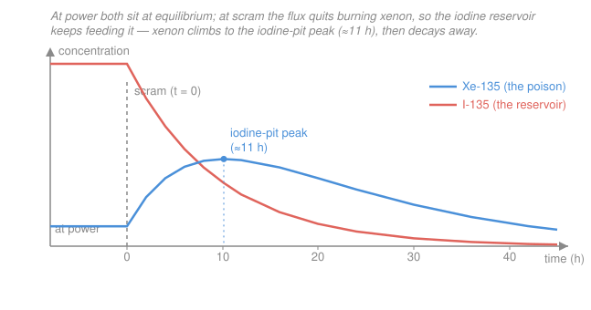

# Reactor Physics & Neutron Transport · Lesson 5.3: Xenon-135 transients & the iodine pit

> ⏱ ~15 min · Module 5: Feedback, poisons & fuel evolution · Builds on: [5.2 Doppler & moderator/void coefficients](05-02-doppler-moderator-void-coefficients.md), [`intro-nuclear-engineering`](../../intro-nuclear-engineering/syllabus.md) · Unlocks: [5.4 Xenon oscillations & samarium-149](05-04-xenon-oscillations-samarium-149.md)

## Why this matters

In September 1944 the first full-scale plutonium production reactor, Hanford B, came up to power, ran for a few hours, and then mysteriously died — its chain reaction choking off on its own. Hours later it restarted, only to die again. What was strangling it was one isotope, $^{135}$Xe, being bred by the reactor's own fission products. Xenon-135 has the largest thermal absorption cross section of any known nuclide (~$2.6\times10^{6}$ barns — a single atom soaks up neutrons like a black hole), and it is created not directly but on a *time delay*, through a decay chain. That delay is the whole story: when you shut a reactor down, xenon does not disappear — **it rises**, sometimes so far that you cannot restart for the better part of a day. Every operator who has ever scrammed a reactor plans around the iodine pit.

## The idea

Think of two tanks connected by a pipe. Fission fills the **iodine tank** ($^{135}$I) fast. Iodine slowly leaks through the pipe into the **xenon tank** ($^{135}$Xe) as it decays. Xenon is the villain — it eats neutrons — so at power the reactor keeps xenon low by *burning it out*: every neutron xenon absorbs converts it to harmless $^{136}$Xe. So while running, there are two drains on the xenon tank (its own decay, plus neutron burnup) and a big reservoir of iodine sitting upstream.

Now pull the plug on the chain reaction. The flux vanishes, so the **burnup drain slams shut** — but the iodine tank is still full and still leaking into xenon at full speed. Production keeps flowing while the biggest loss just stopped. The xenon level *climbs*. It keeps climbing until the iodine reservoir has drained enough that xenon's own decay finally overtakes the inflow — that crest is the **iodine pit**, and it lands about 11 hours after shutdown. Only then does xenon start falling. During that climb the reactor is drowning in neutron poison, and if your control rods can't buy back that much reactivity, you simply cannot restart. You wait.

The key asymmetry: xenon is made *slowly* (through decay) but destroyed *fast* (by flux). Remove the flux and you keep the slow maker while killing the fast destroyer.

## The formal version

**The chain.** Fission produces $^{135}$I (directly, plus from short-lived tellurium we lump in), which beta-decays to $^{135}$Xe, which decays to effectively-stable $^{135}$Cs:

$$\ce{^{135}_{53}I ->[\lambda_I] ^{135}_{54}Xe ->[\lambda_X] ^{135}_{55}Cs}$$

*In words: iodine is the parent, xenon the poisonous daughter, cesium the harmless grandchild.* The decay constants are $\lambda_I = \ln 2 / (6.6\,\text{h}) \approx 2.9\times10^{-5}\,\text{s}^{-1}$ and $\lambda_X = \ln 2 / (9.1\,\text{h}) \approx 2.1\times10^{-5}\,\text{s}^{-1}$ — **iodine decays faster than xenon**, which will matter for the peak time.

**The coupled Bateman equations.** Let $I(t)$ and $X(t)$ be the atom densities (atoms/cm³), $\Sigma_f$ the macroscopic fission cross section, $\phi$ the scalar flux (n/cm²/s), $\gamma_I \approx 0.061$ and $\gamma_X \approx 0.003$ the fission yields (fraction of fissions producing each directly), and $\sigma_X \approx 2.6\times10^{6}\,\text{b} = 2.6\times10^{-18}\,\text{cm}^2$ the xenon absorption cross section:

$$\frac{dI}{dt} = \underbrace{\gamma_I \Sigma_f \phi}_{\text{fission}} - \underbrace{\lambda_I I}_{\text{decay}}$$

$$\frac{dX}{dt} = \underbrace{\gamma_X \Sigma_f \phi}_{\text{fission}} + \underbrace{\lambda_I I}_{\text{from iodine}} - \underbrace{\lambda_X X}_{\text{decay}} - \underbrace{\sigma_X \phi X}_{\text{burnup}}$$

*In words: iodine is born from fission and lost only to decay (its own neutron absorption is negligible); xenon is born from fission and from decaying iodine, and lost both to its own decay and to being burned up by the flux.* That last term $\sigma_X\phi X$ — xenon eating a neutron and neutralizing itself — is the one that vanishes at shutdown.

**Equilibrium at power.** Run at constant $\phi$ long enough (a day or so) and set both derivatives to zero:

$$I_{\text{eq}} = \frac{\gamma_I \Sigma_f \phi}{\lambda_I}, \qquad X_{\text{eq}} = \frac{(\gamma_I + \gamma_X)\,\Sigma_f \phi}{\lambda_X + \sigma_X \phi}.$$

*In words: iodine equilibrates when its production equals its decay; xenon's numerator picks up both yields because at equilibrium every iodine atom made eventually becomes a xenon atom.* (Substitute $\lambda_I I_{\text{eq}} = \gamma_I\Sigma_f\phi$ into the xenon balance to get the combined yield $\gamma_I+\gamma_X$.)

**Saturation.** Look at the xenon denominator, $\lambda_X + \sigma_X\phi$. The two losses trade off at the **saturation flux** $\phi^* = \lambda_X/\sigma_X \approx 8\times10^{12}\,\text{n/cm}^2\text{/s}$. Below it, decay dominates; above it, burnup dominates. Power reactors run *well above* $\phi^*$, so $\sigma_X\phi \gg \lambda_X$ and

$$X_{\text{eq}} \;\to\; \frac{(\gamma_I+\gamma_X)\Sigma_f}{\sigma_X} \quad(\text{flux cancels!}).$$

*In words: pushing the flux higher makes more xenon but also burns it faster, so equilibrium xenon saturates — its reactivity worth tops out at a few percent no matter how hard you run.*

**Post-shutdown transient.** At $t=0$ scram, so $\phi\to 0$. Iodine now just decays, $I(t) = I_0 e^{-\lambda_I t}$ with $I_0 = I_{\text{eq}}$, and the xenon equation loses its flux terms:

$$\frac{dX}{dt} = \lambda_I I - \lambda_X X \quad\Longrightarrow\quad X(t) = X_0 e^{-\lambda_X t} + \frac{\lambda_I I_0}{\lambda_I - \lambda_X}\left(e^{-\lambda_X t} - e^{-\lambda_I t}\right).$$

*In words: xenon is fed by the still-draining iodine reservoir and drained only by its own decay.* Because at power $X_0$ was held *down* by burnup while $I_0$ piled *up*, the reservoir term dominates and $X(t)$ **rises before it falls**. The crest is where $dX/dt = 0$, i.e. $\lambda_I I = \lambda_X X$ (inflow equals decay). Neglecting the small $X_0$ term (deep saturation), the peak lands at a time set *only by the two half-lives*:

$$t_{\text{peak}} = \frac{\ln(\lambda_I/\lambda_X)}{\lambda_I - \lambda_X} \approx 11\,\text{h}.$$

## Picture

## Worked examples

**Example 1 — equilibrium xenon and its reactivity worth.** A thermal reactor runs at $\phi = 5\times10^{13}\,\text{n/cm}^2\text{/s}$ with $\Sigma_f = 0.10\,\text{cm}^{-1}$ and total core absorption $\Sigma_a = 0.15\,\text{cm}^{-1}$. Find equilibrium xenon and its reactivity.

First the burnup-vs-decay competition in the denominator:

$$\sigma_X\phi = (2.6\times10^{-18})(5\times10^{13}) = 1.3\times10^{-4}\,\text{s}^{-1}, \qquad \lambda_X = 2.1\times10^{-5}\,\text{s}^{-1}.$$

Burnup beats decay by ~6× (we are $\phi/\phi^* \approx 6$ above saturation flux), so xenon is firmly in the saturated regime. The equilibrium density:

$$X_{\text{eq}} = \frac{(\gamma_I+\gamma_X)\Sigma_f\phi}{\lambda_X + \sigma_X\phi} = \frac{(0.064)(0.10)(5\times10^{13})}{2.1\times10^{-5} + 1.3\times10^{-4}} = \frac{3.2\times10^{11}}{1.51\times10^{-4}} \approx 2.1\times10^{15}\,\text{cm}^{-3}.$$

Xenon adds macroscopic absorption $\Sigma_a^X = \sigma_X X_{\text{eq}} = (2.6\times10^{-18})(2.1\times10^{15}) = 5.5\times10^{-3}\,\text{cm}^{-1}$. Its reactivity worth is the fraction of the core's neutron absorption it steals (exactly, this routes through the thermal utilization $f$ from [2.1](02-01-k-infinity-four-factor-formula.md); to first order it is just the ratio):

$$\rho_X \approx -\frac{\Sigma_a^X}{\Sigma_a} = -\frac{5.5\times10^{-3}}{0.15} \approx -0.037 = -3700\ \text{pcm}.$$

That is about $-5.6$ dollars if $\beta = 0.0065$ — a large, standing negative reactivity the reactor must carry excess fuel to overcome. And note the saturation ceiling: as $\phi\to\infty$, $\rho_X \to -(\gamma_I+\gamma_X)\Sigma_f/\Sigma_a = -0.064(0.10)/0.15 = -4.3\%$. Equilibrium xenon can never cost more than that, however hard you run.

**Example 2 — the post-shutdown peak and why you can't restart.** The same reactor scrams from that equilibrium. When does xenon peak, and how bad does it get?

The iodine reservoir at scram:

$$I_0 = I_{\text{eq}} = \frac{\gamma_I\Sigma_f\phi}{\lambda_I} = \frac{(0.061)(0.10)(5\times10^{13})}{2.9\times10^{-5}} \approx 1.0\times10^{16}\,\text{cm}^{-3}.$$

Notice $I_0 \approx 1.0\times10^{16}$ is about **5× larger** than $X_0 = 2.1\times10^{15}$ — that lopsided reservoir is the engine of the transient. The peak time comes from $\lambda_I I = \lambda_X X$; in the saturated limit (small $X_0$) that reduces to the pure two-exponential result:

$$t_{\text{peak}} = \frac{\ln(\lambda_I/\lambda_X)}{\lambda_I - \lambda_X} = \frac{\ln(2.9/2.1)}{(2.9 - 2.1)\times10^{-5}} = \frac{0.32}{0.81\times10^{-5}} \approx 4.0\times10^{4}\,\text{s} \approx 11\,\text{h}.$$

(The finite $X_0$ pulls the real crest a little earlier, ~9–10 h — the plotted curve peaks near 10 h — but the headline number is robust: *xenon crests roughly half a day after shutdown, then decays with its 9.1-h half-life.*) Plugging $t_{\text{peak}}$ back into $X(t)$ gives a peak of about $2.6\times$ the equilibrium value, so the peak xenon reactivity is roughly

$$\rho_{X,\text{peak}} \approx 2.6 \times (-3.7\%) \approx -9.5\%.$$

**The restart limit.** A reactor is designed with enough excess reactivity (extra fuel, withdrawable rods) to overcome *equilibrium* xenon plus some margin. But the post-shutdown peak buries an *extra* ~$-5.8\%$ on top of equilibrium. If the control system's spare positive worth is less than that swing, no combination of rod withdrawals can make the core critical again — you are in the **xenon dead time**. You must wait for xenon to decay back below your override capability, typically 10–20 hours. This is exactly what stopped Hanford B, and it is why operators either ride through a transient at reduced power or commit to staying down.

## Watch out

- **You might think shutting down clears the poison — actually xenon *rises*.** Removing the flux removes the burnup that was suppressing xenon, while the iodine reservoir keeps decaying into it. The poison peaks *after* you shut off the thing that was fighting it. Shutdown makes the poison problem worse before it gets better.
- **You might think more flux always means more xenon at power — actually equilibrium xenon *saturates*.** Higher flux breeds more xenon but also burns it faster; above $\phi^* \approx 8\times10^{12}$ the two scale together and $X_{\text{eq}}$ levels off. But do not confuse the two effects: the *equilibrium* saturates, while the *post-shutdown peak* keeps growing with pre-shutdown flux, because higher flux means a bigger iodine reservoir waiting to dump.
- **You might blame iodine for the poisoning — it's innocent.** $^{135}$I barely absorbs neutrons; its role is purely as the hidden reservoir. The neutron sponge is $^{135}$Xe, and it is made on iodine's clock, not fission's — that time delay is the entire reason for the pit.

## One-liner

> Xenon is bred slowly through iodine decay but destroyed fast by the flux, so killing the flux at scram lets it flood in — cresting the iodine pit ~11 hours later, sometimes deep enough to lock out a restart.

## Problems

**P1 (🟢)** Using $\sigma_X = 2.6\times10^{-18}\,\text{cm}^2$ and $\lambda_X = 2.1\times10^{-5}\,\text{s}^{-1}$, find the saturation flux $\phi^*$ at which xenon burnup exactly equals xenon decay. A reactor operates at $\phi = 3\times10^{13}\,\text{n/cm}^2\text{/s}$ — is its equilibrium xenon decay-limited or burnup-limited, and roughly by what factor?

**P2 (🟡)** Right after scram the xenon rate is $dX/dt = \lambda_I I_0 - \lambda_X X_0$. Show that xenon *rises* (this is positive) as long as $\lambda_I I_0 > \lambda_X X_0$, and using the equilibrium expressions (neglect the tiny direct yield $\gamma_X$) show this is equivalent to $\sigma_X\phi > 0$ — i.e. xenon *always* rises after shutdown from any power level. What physical quantity does the strength of the initial rise track?

**P3 (🔴)** A reactor's control system can supply at most $+6\%$ of positive reactivity from full rod withdrawal, and this is essentially all consumed at the xenon peak of $-9.5\%$ described above. After the peak (iodine largely gone), xenon reactivity decays roughly as $\rho_X(t') \approx -9.5\%\,e^{-\lambda_X t'}$ where $t'$ is time past the peak. Estimate how long after the *peak* the reactor can restart, and the total dead time measured from scram. (Use $\lambda_X = 2.1\times10^{-5}\,\text{s}^{-1}$.)

Solutions

**P1.** Burnup rate per xenon atom is $\sigma_X\phi$; decay rate is $\lambda_X$. They are equal when

$$\phi^* = \frac{\lambda_X}{\sigma_X} = \frac{2.1\times10^{-5}}{2.6\times10^{-18}} = 8.1\times10^{12}\,\text{n/cm}^2\text{/s}.$$

At $\phi = 3\times10^{13}$, the ratio is $\phi/\phi^* = 3\times10^{13}/8.1\times10^{12} \approx 3.7$. Since $\sigma_X\phi \approx 3.7\,\lambda_X > \lambda_X$, xenon is **burnup-limited (saturated)**, with burnup removing xenon about 3.7× faster than decay does. *Check:* units $\text{s}^{-1}/\text{cm}^2 = \text{n/cm}^2\text{/s}$ ✓, and $8\times10^{12}$ is the textbook saturation flux ✓.

**P2.** The initial post-scram rate is positive iff $\lambda_I I_0 > \lambda_X X_0$, which is exactly $dX/dt(0) > 0$ — xenon rises. Substitute the equilibria $I_0 = \gamma_I\Sigma_f\phi/\lambda_I$ and $X_0 = (\gamma_I+\gamma_X)\Sigma_f\phi/(\lambda_X+\sigma_X\phi)$:

$$\lambda_I I_0 = \gamma_I\Sigma_f\phi, \qquad \lambda_X X_0 = \frac{\lambda_X(\gamma_I+\gamma_X)\Sigma_f\phi}{\lambda_X+\sigma_X\phi}.$$

Neglecting $\gamma_X$ (so $\gamma_I+\gamma_X \approx \gamma_I$), the rise condition $\lambda_I I_0 > \lambda_X X_0$ becomes

$$\gamma_I\Sigma_f\phi > \frac{\lambda_X\,\gamma_I\Sigma_f\phi}{\lambda_X+\sigma_X\phi} \;\Longleftrightarrow\; 1 > \frac{\lambda_X}{\lambda_X+\sigma_X\phi} \;\Longleftrightarrow\; \sigma_X\phi > 0.$$

That holds for *any* nonzero operating flux — so a reactor scrammed from power **always** sees xenon rise. Physically, the rise is exactly the burnup loss $\sigma_X\phi X_0$ that just disappeared: the harder the reactor was running (bigger $\sigma_X\phi$), the more suppressed xenon was, the more violently it rebounds. The initial rise tracks the pre-shutdown **flux (power) level**. *Check:* at $\phi=0$ (already shut down) the inequality collapses to $0>0$, false — a cold reactor's xenon just decays, no rise ✓.

**P3.** Restart becomes possible once $|\rho_X|$ falls to the $6\%$ override. Solve $9.5\%\,e^{-\lambda_X t'} = 6\%$:

$$t' = \frac{1}{\lambda_X}\ln\!\frac{9.5}{6} = \frac{\ln(1.58)}{2.1\times10^{-5}} = \frac{0.459}{2.1\times10^{-5}} \approx 2.2\times10^{4}\,\text{s} \approx 6\,\text{h after the peak.}$$

The peak itself is ~11 h after scram, so the total **xenon dead time** is roughly $11 + 6 \approx 17$ hours — squarely in the "10–20 h" band. *Check:* one xenon half-life (9.1 h) cuts $9.5\%$ to $4.75\%$, already below $6\%$, so the answer must be under one half-life ✓ (6 h < 9.1 h). The pure-exponential decay is an approximation — near the peak, residual iodine is still feeding xenon, so the true recovery is a touch slower — but the estimate captures the right timescale.

## Flashback

**From Lesson 5.2 (Doppler & temperature coefficients):** A reactor has a fuel (Doppler) temperature coefficient $\alpha_D = -2.4\,\text{pcm}/^\circ\text{C}$. As the reactor heats from cold-zero-power to full power, the average fuel temperature rises by $320\,^\circ\text{C}$. What Doppler reactivity is inserted, and does this feedback stabilize or destabilize the core?

Solution

Doppler reactivity is the coefficient times the temperature change:

$$\Delta\rho_D = \alpha_D\,\Delta T = (-2.4\,\text{pcm}/^\circ\text{C})(320\,^\circ\text{C}) = -768\,\text{pcm} \approx -0.77\%.$$

The negative sign means a temperature *rise* inserts *negative* reactivity — this is **stabilizing (a negative feedback)**. A power excursion heats the fuel, resonance broadening (the Doppler effect) raises resonance absorption, reactivity drops, and power is pushed back down. Because it acts on the fuel itself, it is *prompt* — it responds as fast as the fuel heats, which is what makes it the first line of inherent reactor safety. *Check:* $-0.77\%$ is a typical order for the Doppler contribution to the power defect ✓, and the negative sign is the whole point — a positive Doppler coefficient would be a runaway hazard.

## Connections

- **Backward:** the reactivity worth in Example 1 rides on the thermal utilization $f$ from the four-factor formula ([2.1](02-01-k-infinity-four-factor-formula.md)) — xenon is just one more term in the absorption denominator — and the negative $\rho_X$ it produces is the same kind of reactivity you learned to convert into period back in Module 4 ([4.2](04-02-reactivity-prompt-jump.md)). Xenon feedback joins the temperature coefficients of [5.1](05-01-reactivity-feedback-temperature-coefficients.md) and [5.2](05-02-doppler-moderator-void-coefficients.md), but on an hours-long clock instead of a prompt one.
- **Forward:** [5.4](05-04-xenon-oscillations-samarium-149.md) turns this point model into a *spatial* one — the same delay that makes xenon rise after shutdown can make it slosh from one side of a large core to the other in slow spatial oscillations — and adds samarium-149, a poison that (having a stable end-product) never decays away.
- **Sideways (ODEs):** the coupled iodine–xenon Bateman pair is structurally identical to a two-box radioactive decay chain, and to any *linear source-and-sink compartment model* — a fast-feeding parent draining into a slow-clearing child. The same $A e^{-\lambda_X t} + B(e^{-\lambda_X t}-e^{-\lambda_I t})$ solution shows up in pharmacokinetics (drug absorption then elimination) and in the two-stage circuits of an `ode-refresher` coupled-system problem; the "grow-then-decay" hump is the universal signature of a source that outlives its own supply line.
