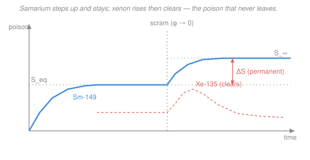

# Reactor Physics & Neutron Transport · Lesson 5.4: Xenon oscillations & samarium-149

> ⏱ ~15 min · Module 5: Reactivity feedback, poisons & fuel evolution · Builds on: [5.3 Xenon-135 & the iodine pit](05-03-xenon-135-iodine-pit.md), [5.1 Reactivity feedback & temperature coefficients](05-01-reactivity-feedback-temperature-coefficients.md) · Unlocks: [5.5 Fuel burnup, conversion & breeding](05-05-fuel-burnup-conversion-breeding.md)

## Why this matters

Lesson 5.3 gave you xenon's fast, violent transient — the post-shutdown pit that can lock a reactor out for a day. This lesson covers xenon's *slow* side and its quieter cousin. In a big core, xenon can drive a **spatial oscillation**: the flux tilts to one end, sloshes back, and swings with a ~15–30 hour period that will grow without bound unless an operator actively damps it — a stability problem, not a poisoning problem. And **samarium-149** is the poison that never leaves: it doesn't decay, so after shutdown it doesn't clear like xenon — it steps *up* to a new, permanent level you carry for the rest of the cycle. Both are things a real operator watches every shift.

## The idea

**Xenon oscillations.** Picture a tall core as a top half and a bottom half, loosely linked. Nudge the flux up in the top. Xenon there gets burned out *faster* (more neutrons destroying it), so the top's poison drops, so the top's flux climbs *even higher* — a runaway in that spot. Meanwhile the bottom's flux fell, so *its* xenon isn't being burned, and (worse) the iodine banked from before keeps decaying into fresh xenon there — the bottom poisons up, pushing its flux down further. The tilt exaggerates itself.

But it doesn't run away forever. The high-flux top is now *burning through its iodine bank*; a few hours later it runs short of the iodine that feeds new xenon, xenon there starts climbing, and the top gets poisoned — while the bottom, having decayed its xenon away, opens back up. The tilt reverses. Because the whole dance is paced by iodine's ~6.6 h and xenon's ~9.2 h clocks, one full swing takes roughly **15–30 hours**. Total power can sit rock-steady while the *shape* oscillates underneath — dangerous, because a local flux peak means a local power (and temperature) peak the gross instruments don't see.

**Why big cores.** The oscillation needs the two ends to act semi-independently. A small core is tightly neutronically coupled — the whole thing rises and falls together, and a negative power/temperature coefficient stabilizes it. A large core (many migration lengths across) is *loosely coupled*: one end can bloom while the other wilts. Modern power reactors are big enough to be xenon-unstable in the higher spatial modes and rely on control action to hold the shape.

**Samarium-149.** Fission makes neodymium-149, which decays down a chain to samarium-149 — and there the chain *stops*, because $^{149}$Sm is **stable**. It has a big thermal absorption cross-section, so it's a real poison, but with no decay its only removal is neutron capture (burnup). At power, production and burnup balance at an equilibrium level. Here's the twist: at shutdown the flux vanishes, so burnup stops — but the promethium already banked keeps decaying into fresh samarium. So samarium doesn't dip-and-recover like xenon. It **ramps up to a new, higher plateau and stays there**. No pit that clears — just a permanent step.

## The formal version

### Samarium-149 chain

$$\ce{^{149}_{60}Nd ->[\beta^-][1.7\,h] ^{149}_{61}Pm ->[\beta^-][53\,h] ^{149}_{62}Sm}\ (\text{stable})$$

*In words: fission makes neodymium; it beta-decays to promethium, which beta-decays to samarium-149, which is stable and can only leave by absorbing a neutron.* Because Nd's 1.7 h half-life is short, we lump it in and treat $^{149}$Pm as the effective fission product with yield $\gamma_{Pm}$. Let $P$ and $S$ be the atom densities (cm$^{-3}$) of promethium and samarium; $\Sigma_f$ the fission cross-section (cm$^{-1}$); $\phi$ the flux; $\lambda_{Pm}$ the promethium decay constant; $\sigma_S$ the samarium thermal absorption cross-section (cm$^2$). The Bateman pair:

$$\frac{dP}{dt} = \gamma_{Pm}\Sigma_f\phi - \lambda_{Pm}P, \qquad \frac{dS}{dt} = \lambda_{Pm}P - \sigma_S\phi\,S.$$

*In words: promethium is born from fission and dies by decay; samarium is born from promethium's decay and dies only by neutron capture.* Note the second equation has **no** $-\lambda_S S$ term — samarium doesn't decay.

**Equilibrium at power.** Set both derivatives to zero:

$$P_{eq} = \frac{\gamma_{Pm}\Sigma_f\phi}{\lambda_{Pm}}, \qquad S_{eq} = \frac{\lambda_{Pm}P_{eq}}{\sigma_S\phi} = \boxed{\ \frac{\gamma_{Pm}\Sigma_f}{\sigma_S}\ }.$$

*In words: the equilibrium samarium level is flux-independent* — the $\phi$ in production and the $\phi$ in burnup cancel. Ramp power up or down and (once re-equilibrated) $S_{eq}$ is the same. Contrast xenon, whose equilibrium *did* depend on flux (its $\lambda_X$ decay term breaks the cancellation).

The poison's reactivity worth is the fraction of thermal absorptions it steals, $\rho \approx -\sigma_S S/\Sigma_a$ (with $\Sigma_a$ the core's thermal absorption, cm$^{-1}$), so

$$\rho_{Sm,\,eq} = -\frac{\sigma_S S_{eq}}{\Sigma_a} = -\frac{\gamma_{Pm}\Sigma_f}{\Sigma_a}.$$

*In words: equilibrium samarium worth is just its yield times the fission-to-absorption ratio — a fixed background drain, the same at any power.*

**Post-shutdown buildup.** At $t=0$ scram to $\phi=0$. Burnup stops; the banked promethium ($P_{eq}$) all decays into samarium. Final samarium:

$$S_\infty = S_{eq} + P_{eq} = S_{eq}\left(1 + \frac{\sigma_S\phi_0}{\lambda_{Pm}}\right),$$

using $P_{eq}/S_{eq} = \sigma_S\phi_0/\lambda_{Pm}$ from the equilibria (with $\phi_0$ the pre-shutdown flux). *In words: every promethium atom that was banked becomes a new samarium atom, so samarium ratchets up by that whole inventory and holds there.* The rise takes several promethium half-lives (~2–4 days) and is **permanent** until the samarium is slowly burned out again after restart. The worth rises in proportion, $\rho_{Sm,\infty} = \rho_{Sm,\,eq}(1+\sigma_S\phi_0/\lambda_{Pm})$.

### Lumped fission-product poisoning

Beyond Xe and Sm, the *hundreds* of other fission products with modest cross-sections add up to a slowly growing absorber. To first order they're lumped as a background reactivity drain proportional to fissions accumulated (burnup), roughly $\rho_{FP} \approx -(\text{a few} \times 10^{-2})\,\times$ (burnup in fissions per initial fuel atom) — a steady tax on excess reactivity that [5.6](05-06-reactor-control-operation.md) must budget for over the cycle. It has no transient; it just monotonically eats reactivity as fuel burns.

### Xenon spatial stability (qualitative)

The oscillation is the fed-back loop: $\ \delta\phi\uparrow \Rightarrow$ local Xe burnup $\uparrow \Rightarrow$ local Xe $\downarrow \Rightarrow \delta\phi\uparrow$ more — a *positive* local feedback, but delayed and phase-lagged by the iodine bank, which is exactly the recipe for an oscillation rather than a pure runaway. It self-excites (grows) when the destabilizing xenon feedback beats the stabilizing forces: neutron coupling between regions, and a prompt **negative power coefficient** (5.1) that pushes back the instant a region's power rises. *In words: xenon wants to tilt the flux; leakage/coupling and a negative power coefficient want to flatten it; whichever wins decides if a nudge grows or dies.*

## Picture

## Worked examples

**Example 1 (samarium equilibrium & post-shutdown step).** A thermal reactor runs at flux $\phi_0 = 3\times10^{13}\,\text{cm}^{-2}\text{s}^{-1}$. Use $\gamma_{Pm}=0.0113$, $\Sigma_f = 0.070\,\text{cm}^{-1}$, $\Sigma_a = 0.100\,\text{cm}^{-1}$, $\sigma_S = 4.08\times10^{4}\,\text{b} = 4.08\times10^{-20}\,\text{cm}^2$, and $^{149}$Pm half-life $53\,\text{h}$. Find the equilibrium samarium worth and the post-shutdown increase.

*Equilibrium concentration* (flux-independent):
$$S_{eq} = \frac{\gamma_{Pm}\Sigma_f}{\sigma_S} = \frac{0.0113 \times 0.070}{4.08\times10^{-20}} = \frac{7.91\times10^{-4}}{4.08\times10^{-20}} = 1.94\times10^{16}\ \text{cm}^{-3}.$$

*Equilibrium worth:*
$$\rho_{Sm,\,eq} = -\frac{\gamma_{Pm}\Sigma_f}{\Sigma_a} = -\frac{0.0113 \times 0.070}{0.100} = -7.9\times10^{-3} \approx -790\ \text{pcm}.$$
Notice we never needed $\phi$ — the equilibrium worth is the same at any power level. Cross-check via $-\sigma_S S_{eq}/\Sigma_a = -(4.08\times10^{-20})(1.94\times10^{16})/0.100 = -7.9\times10^{-3}$ ✓.

*Post-shutdown step.* First $\lambda_{Pm} = \ln 2 / (53\,\text{h}) = 0.693/(1.91\times10^{5}\,\text{s}) = 3.63\times10^{-6}\,\text{s}^{-1}$. Then
$$\frac{\sigma_S\phi_0}{\lambda_{Pm}} = \frac{(4.08\times10^{-20})(3\times10^{13})}{3.63\times10^{-6}} = \frac{1.22\times10^{-6}}{3.63\times10^{-6}} = 0.337.$$
So samarium climbs to $S_\infty = S_{eq}(1+0.337) = 1.337\,S_{eq}$ — a **34% permanent rise**. The worth grows to
$$\rho_{Sm,\infty} = -790\,(1.337) \approx -1060\ \text{pcm}, \quad\text{an added } \Delta\rho \approx -270\ \text{pcm that never clears.}$$
That's an order of magnitude smaller than xenon's post-shutdown swing (thousands of pcm), and slower (days, not hours) — but unlike xenon's pit, this reactivity is *gone for good* until you burn the samarium back down after restart.

**Example 2 (why the spatial oscillation self-excites, and what damps it).** Explain, step by step, the feedback that tilts an axial flux and why a negative power coefficient stabilizes it.

Start with a small upward flux perturbation in the top half.
1. **Prompt local burnout.** Xenon destruction rate is $\sigma_X\phi X$. More flux on top $\Rightarrow$ faster xenon burnout there $\Rightarrow$ top xenon drops within an hour or two $\Rightarrow$ top absorption drops $\Rightarrow$ top flux rises *further*. This is the destabilizing positive feedback.
2. **The delayed reversal.** But xenon's *source* is decaying iodine, and iodine is made at the old flux level, changing only on its ~6.6 h clock. As the top burns through its iodine bank, iodine (hence new xenon) there falls behind; hours later the top runs xenon-short but *also* iodine-short, xenon rebuilds, and the top poisons up. The bottom, whose xenon decayed away while its flux was low, now opens up. The tilt flips. The lag between "flux responds fast" and "iodine responds slow" sets the ~15–30 h period.
3. **What kills it.** A **negative power coefficient** (5.1): the instant the top's power rises, its fuel heats, Doppler and moderator feedback add *negative* reactivity right there, directly opposing the flux rise before xenon can amplify it. Neutron leakage/coupling between halves does the same by bleeding the peak into the valley. If these beat the xenon feedback, a nudge decays; if not, the operator must intervene — dropping rods or banks on the rising side to flatten the tilt manually.

The moral: gross power can be flat while the *shape* rings. Operators watch axial/radial flux-tilt indicators, not just total power, and act on the tilt directly.

## Watch out

- **You might think samarium behaves like xenon after shutdown — a peak that decays away.** It doesn't. Samarium is *stable*: post-shutdown it rises to a **higher permanent plateau** and stays. Xenon's pit clears in ~2 days because xenon decays; samarium's step only clears by burning it out after you're back at power.
- **You might think a bigger reactor is more stable.** For *spatial* xenon modes it's the opposite — a large, loosely-coupled core lets one region run away from another, which is exactly what the oscillation needs. Small tightly-coupled cores ride through it.
- **You might think steady total power means steady core.** A xenon oscillation can leave gross power flat while the flux sloshes end-to-end, hiding a local power/temperature peak. The danger is spatial, so the diagnostic must be spatial.

## One-liner

> Xenon can make the flux *slosh* on a ~day-long clock that operators must actively damp; samarium is the poison that never leaves — it steps up after shutdown and stays, at a worth that's flux-independent at power.

## Problems

**P1 (🟢)** A core runs at flux $\phi_0 = 2\times10^{13}\,\text{cm}^{-2}\text{s}^{-1}$ with $\gamma_{Pm}=0.0113$, $\Sigma_f=0.055\,\text{cm}^{-1}$, $\Sigma_a=0.090\,\text{cm}^{-1}$. Find the equilibrium samarium reactivity worth $\rho_{Sm,eq}$. Does it change if the reactor is instead run at half that flux (once re-equilibrated)? Explain in one sentence.

**P2 (🟡)** Using the P1 core with $\sigma_S = 4.08\times10^{-20}\,\text{cm}^2$ and $^{149}$Pm half-life $53\,\text{h}$, find the fractional post-shutdown rise $S_\infty/S_{eq}$ from full flux $\phi_0 = 2\times10^{13}\,\text{cm}^{-2}\text{s}^{-1}$, and the total post-shutdown samarium worth. How does this magnitude compare with a typical post-shutdown *xenon* swing (thousands of pcm), and why is samarium's so much gentler?

**P3 (🔴)** A tall reactor is observed to have a steady total power but a slowly oscillating axial flux tilt with a ~20 h period. An operator proposes "just wait it out — it'll damp on its own." Under what condition is that safe, and what is the physical risk if the core is xenon-*unstable*? Tie your answer to the sign of the power coefficient (5.1).

Solutions

**P1** The equilibrium samarium worth is flux-independent:
$$\rho_{Sm,eq} = -\frac{\gamma_{Pm}\Sigma_f}{\Sigma_a} = -\frac{0.0113\times0.055}{0.090} = -\frac{6.215\times10^{-4}}{0.090} = -6.9\times10^{-3} \approx -690\ \text{pcm}.$$
Running at half flux does **not** change it: production ($\gamma_{Pm}\Sigma_f\phi$) and burnup ($\sigma_S\phi S$) both scale with $\phi$, so $S_{eq}=\gamma_{Pm}\Sigma_f/\sigma_S$ has no $\phi$ in it. *Check:* units $-(\text{cm}^{-1})/(\text{cm}^{-1})$ = dimensionless ✓, magnitude ~700 pcm is the right ballpark for equilibrium samarium ✓.

**P2** Promethium decay constant: $\lambda_{Pm} = \ln2/(53\,\text{h}) = 0.693/(1.91\times10^{5}\,\text{s}) = 3.63\times10^{-6}\,\text{s}^{-1}$. The ratio:
$$\frac{\sigma_S\phi_0}{\lambda_{Pm}} = \frac{(4.08\times10^{-20})(2\times10^{13})}{3.63\times10^{-6}} = \frac{8.16\times10^{-7}}{3.63\times10^{-6}} = 0.225.$$
So $S_\infty/S_{eq} = 1 + 0.225 = 1.225$ — a **22.5% permanent rise**. Total worth:
$$\rho_{Sm,\infty} = \rho_{Sm,eq}(1.225) = -690\times1.225 \approx -845\ \text{pcm}\quad(\text{added }\Delta\rho\approx-155\ \text{pcm}).$$
This is far gentler than xenon's post-shutdown swing (often $-2000$ to $-4000$ pcm) for two reasons: samarium's yield/cross-section combination gives a smaller equilibrium worth to begin with, and the *step* is set by $\sigma_S\phi_0/\lambda_{Pm}$ — with promethium's slow 53 h decay feeding it, the extra samarium is only a fraction of the banked precursor. Xenon's precursor (iodine, 6.6 h) dumps a proportionally huge xenon spike because xenon's own decay can't keep pace. And crucially: xenon's spike *decays away*; samarium's step is permanent. *Check:* ratio $>1$ as required (buildup, not decay) ✓.

**P3** "Wait it out" is safe **only if the core is xenon-stable** — i.e. the stabilizing feedbacks (negative power coefficient plus neutron coupling/leakage between regions) outweigh the destabilizing xenon-burnout feedback, so any tilt decays on its own. If the core is xenon-*unstable*, the amplitude *grows* each cycle: the flux peak on the rising side climbs higher every ~20 h swing, driving a local power and fuel-temperature peak that the flat *total* power completely hides — risking exceeding local thermal limits (DNB / fuel centerline) even though the megawatt meter looks fine. A **negative power coefficient** (5.1) is the reactor's built-in damper: when a region's power rises, prompt Doppler/moderator feedback there adds negative reactivity, opposing the tilt before xenon amplifies it. A weak or positive power coefficient removes that damper and the operator *must* intervene (insert control on the rising side) rather than wait. *Key point:* the diagnostic is spatial (flux tilt), not gross power.

## Flashback

**From Lesson 5.3 (Xenon-135 & the iodine pit):** A reactor runs at steady flux $\phi = 2\times10^{13}\,\text{cm}^{-2}\text{s}^{-1}$ until $^{135}$Xe reaches equilibrium. Using $\gamma_I+\gamma_X = 0.064$, $\Sigma_f = 0.070\,\text{cm}^{-1}$, $\Sigma_a = 0.100\,\text{cm}^{-1}$, $\lambda_X = 2.11\times10^{-5}\,\text{s}^{-1}$, and $\sigma_X = 2.65\times10^{6}\,\text{b} = 2.65\times10^{-18}\,\text{cm}^2$, find the equilibrium xenon concentration and its reactivity worth.

Solution

Equilibrium xenon (production from I+Xe yield, removal by decay *and* burnup):
$$X_{eq} = \frac{(\gamma_I+\gamma_X)\Sigma_f\phi}{\lambda_X + \sigma_X\phi}.$$
Burnup term: $\sigma_X\phi = (2.65\times10^{-18})(2\times10^{13}) = 5.30\times10^{-5}\,\text{s}^{-1}$. Denominator: $2.11\times10^{-5} + 5.30\times10^{-5} = 7.41\times10^{-5}\,\text{s}^{-1}$. Numerator: $0.064\times0.070\times2\times10^{13} = 8.96\times10^{10}$. So
$$X_{eq} = \frac{8.96\times10^{10}}{7.41\times10^{-5}} = 1.21\times10^{15}\ \text{cm}^{-3}.$$
Worth:
$$\rho_{X,eq} = -\frac{\sigma_X X_{eq}}{\Sigma_a} = -\frac{(2.65\times10^{-18})(1.21\times10^{15})}{0.100} = -\frac{3.21\times10^{-3}}{0.100} = -3.2\times10^{-2} \approx -3200\ \text{pcm}.$$
*Check:* equilibrium xenon worth of a few thousand pcm is exactly the textbook magnitude ✓. Contrast this lesson: xenon's worth *depends on flux* (the $\sigma_X\phi$ in the denominator), while samarium's equilibrium worth does not — that difference traces directly to xenon decaying and samarium not.

## Connections

- **Backward:** this extends [5.3](05-03-xenon-135-iodine-pit.md)'s xenon transient — same iodine-fed dynamics, but now the *spatial* mode (oscillation) and the *stable* analog (samarium). The reactivity-worth bookkeeping ($\rho \approx -\sigma_p N_p/\Sigma_a$) is the poison version of the thermal-utilization ideas from [2.1](02-01-k-infinity-four-factor-formula.md), and the damping argument runs on the power coefficient from [5.1](05-01-reactivity-feedback-temperature-coefficients.md).
- **Forward:** [5.5](05-05-fuel-burnup-conversion-breeding.md) generalizes the Bateman chains here to the full fuel-depletion problem (plutonium buildup, burnable poisons), and [5.6](05-06-reactor-control-operation.md) budgets samarium's permanent step, lumped fission products, and xenon-shape control into the cycle-long reactivity plan.
- **Sideways (dynamical systems / control):** the self-exciting flux tilt is a **delayed-feedback oscillator** — a positive local feedback (xenon burnout) phase-lagged by a slow precursor (iodine) — the same limit-cycle-vs-decay structure you meet in control theory and in the stiff coupled ODEs of [`ode-refresher`](../../ode-refresher/syllabus.md); whether it grows or decays is a stability eigenvalue problem exactly like the point-kinetics analysis of [4.1](04-01-delayed-neutrons-point-kinetics.md).
