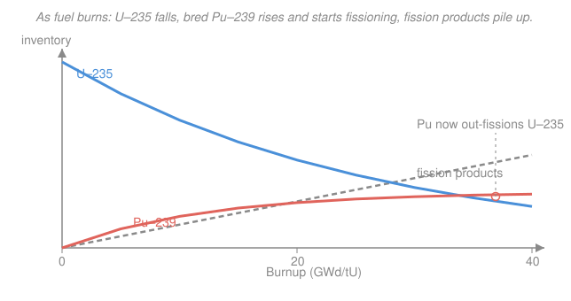

# Reactor Physics & Neutron Transport · Lesson 5.5: Fuel burnup, conversion & breeding

> ⏱ ~15 min · Module 5: Reactivity feedback & the operating reactor · Builds on: [5.4 Xenon oscillations & samarium-149](05-04-xenon-oscillations-samarium-149.md), [5.1 Reactivity feedback & temperature coefficients](05-01-reactivity-feedback-temperature-coefficients.md) · Unlocks: [5.6 Reactor control & operation](05-06-reactor-control-operation.md), [nuclear-fuel-cycle](../../nuclear-fuel-cycle/syllabus.md)

## Why this matters

Everything so far assumed the fuel stands still. It doesn't. Over a fuel cycle — 1 to 2 years at full power — the $^{235}$U burns away, fission-product poisons accumulate, and a brand-new fissile isotope, $^{239}$Pu, is *manufactured inside the fuel* from the otherwise-inert $^{238}$U. The reactor you start is not the reactor you shut down. Get this bookkeeping right and you know how long a core lasts, why spent fuel is simultaneously a waste and a resource, and what separates an ordinary reactor from a **breeder** that makes more fuel than it consumes.

## The idea

Picture the fuel as a slowly changing bank account. Every fission spends one fissile atom and buys one MW-day-ish of heat. But the same neutrons that cause fissions are also being *captured* by the $^{238}$U that makes up ~96% of the fuel — and each such capture, after two quick beta decays, mints a fresh $^{239}$Pu atom, which is itself fissile. So the account has withdrawals ($^{235}$U burning down) *and* deposits ($^{239}$Pu building up).

The single number that meters the withdrawals is **burnup**: energy extracted per mass of fuel. The single number that meters the deposit-to-withdrawal ratio is the **conversion ratio**. When deposits exceed withdrawals — more fissile made than destroyed — you have a **breeder**, and nuclear fuel stops being a finite resource in any practical sense.

Two facts anchor everything: **about 1 gram of fissile fissioned releases 1 MW-day of heat** (roughly $8\times10^{10}$ J, from ~200 MeV per fission), and the neutron that isn't needed to keep the chain going is the neutron available to breed. That second idea — a *spare neutron* — is the whole game.

## The formal version

**Burnup.** The thermal energy extracted per unit mass of heavy metal loaded:

$$B = \frac{P\,t}{M}, \qquad [B] = \frac{\text{MW}\cdot\text{d}}{\text{kg U}} = \text{MWd/kgU} = \text{GWd/tU}.$$

Here $P$ is thermal power (MW), $t$ the full-power operating time (days), and $M$ the mass of uranium loaded (kg or tonnes). *In words:* burnup is the fuel's odometer — how much energy each kilogram has delivered. Discharge burnups run ~40–60 GWd/tU in modern light-water reactors. Because ~1 g of fissile gives ~1 MWd, **the burnup in MWd/kgU is roughly the grams of fissile fissioned per kilogram of uranium.**

**Depletion (Bateman-type balance).** Each nuclide density $N$ obeys a production-minus-destruction ODE driven by the flux $\phi$. For the fuel that matters:

$$\frac{dN_{25}}{dt} = -\,\sigma_a^{25}\,\phi\,N_{25}, \qquad N_{25}(t) = N_{25}(0)\,e^{-\sigma_a^{25}\phi\,t}.$$

*In words:* $^{235}$U (subscript 25) has no source — it only gets absorbed, so it decays exponentially in *fluence* $\phi t$. Meanwhile $^{239}$Pu (subscript 49) is born from $^{238}$U capture and dies by its own absorption:

$$\frac{dN_{49}}{dt} = \underbrace{\sigma_c^{28}\,\phi\,N_{28}}_{\text{bred from }^{238}\text{U}} \;-\; \underbrace{\sigma_a^{49}\,\phi\,N_{49}}_{\text{consumed}}.$$

The breeding chain (the two intermediate beta decays are fast — 23 min and 2.4 d — so effectively instantaneous):

$$\ce{^{238}U + n -> ^{239}U ->[\beta^-][23.5 min] ^{239}Np ->[\beta^-][2.36 d] ^{239}Pu}$$

*In words:* capture a neutron on $^{238}$U, wait a couple of days, get plutonium. Setting $dN_{49}/dt=0$ gives a flux-independent equilibrium $N_{49}^{\text{eq}} = (\sigma_c^{28}/\sigma_a^{49})\,N_{28}$ — the coral curve in the figure leveling off.

**Conversion ratio.**

$$CR = \frac{\text{fissile atoms produced}}{\text{fissile atoms consumed}} = \frac{\sigma_c^{28}\phi N_{28}}{\sigma_a^{25}\phi N_{25} + \sigma_a^{49}\phi N_{49}}.$$

*In words:* new fissile made per fissile destroyed. $CR<1$ is a **converter** (every commercial LWR, $CR\approx0.5$–$0.6$); $CR>1$ is a **breeder** (the ratio is then usually called the breeding ratio, and $CR-1$ is the breeding gain).

**The breeding requirement — the spare-neutron budget.** Let $\eta$ be the neutrons produced per neutron absorbed in the fuel (Lesson 2.1's reproduction factor). Spend those $\eta$ neutrons: **1** must be absorbed in fissile to sustain the chain, **1** must be captured in fertile material to replace the fissile atom just burned, and some number $L$ leak out or are captured parasitically. Breeding needs

$$\eta \;\ge\; 2 + L \quad\Longrightarrow\quad \boxed{\eta > 2}\ \text{is necessary.}$$

*In words:* you need one neutron to keep the reactor alive, a second to make the next batch of fuel, and enough left over to cover the losses. $^{239}$Pu clears this bar only in a **fast spectrum** ($\eta\approx2.4$ vs ~1.85 thermal); $^{233}$U from the $\ce{^{232}Th -> ^{233}U}$ cycle is the one isotope that breeds even in a **thermal** spectrum ($\eta\approx2.29$).

## Picture

The blue $^{235}$U burns down exponentially in fluence; the coral $^{239}$Pu breeds up and saturates near a flux-independent equilibrium; grey fission products climb roughly linearly (one pair per fission). Late in the cycle the bred plutonium can *out-fission the residual $^{235}$U* — in a typical LWR, Pu supplies about a third of the total energy by end of life.

## Worked examples

**Example 1 (burnup, and a fissile-balance surprise).** A 3000 MW$_{\text{th}}$ core is loaded with $M = 90$ t of uranium enriched to 3.5% $^{235}$U and runs 1200 full-power days.

*Burnup:*
$$B = \frac{P\,t}{M} = \frac{3000\ \text{MW}\times 1200\ \text{d}}{90{,}000\ \text{kgU}} = 40\ \text{MWd/kgU} = 40\ \text{GWd/tU}.$$

*Fissile consumed.* Using ~1.05 g of fissile destroyed per MWd (the 1 g that fissions, plus ~5% that is captured without fissioning):
$$m_{\text{fissile}} = (P\,t)\times 1.05\ \tfrac{\text{g}}{\text{MWd}} = (3.6\times10^{6}\ \text{MWd})(1.05) \approx 3.78\times10^{6}\ \text{g} = 3780\ \text{kg}.$$

*Now the surprise.* The core was loaded with only
$$m_{235}(0) = 0.035\times 90{,}000\ \text{kg} = 3150\ \text{kg of }^{235}\text{U}.$$
We burned **3780 kg of fissile** but started with **3150 kg of $^{235}$U**. Naively "fraction of $^{235}$U consumed" $= 3780/3150 = 120\%$ — impossible. The resolution: several hundred kilograms of the fissile we burned were never loaded — they were $^{239}$Pu *bred in situ* from $^{238}$U. Breeding isn't a bookkeeping footnote; it supplies real energy. (Accounting honestly, discharge $^{235}$U is ~0.8%, so ~77% of the *original* $^{235}$U is gone and plutonium fissions make up the balance.)

**Example 2 (conversion ratio and the breeding bar).** Over one cycle a reactor breeds 500 kg of new fissile while consuming 800 kg of fissile.

$$CR = \frac{500}{800} = 0.625 \;<\;1 \quad\Rightarrow\quad \textbf{converter}.$$

Now push the same design toward breeding. Suppose in a fast spectrum $^{239}$Pu gives $\eta = 2.40$ neutrons per absorption, and leakage plus parasitic capture cost $L = 0.25$ neutrons per fuel absorption. Per fissile atom destroyed:

$$CR = \eta - 1 - L = 2.40 - 1 - 0.25 = 1.15 \;>\;1 \quad\Rightarrow\quad \textbf{breeder},$$

with breeding gain $CR-1 = 0.15$ (15 extra fissile atoms per 100 burned — enough to fuel a second reactor over time). Check the requirement: $CR>1$ needs $\eta > 2 + L = 2.25$, comfortably above the hard floor $\eta>2$. Try this *thermally*, where $\eta_{^{239}\text{Pu}}\approx1.85$: then $\eta-1-L = 1.85-1-0.25 = 0.60 < 1$ — no amount of design tightening breeds, because you can't even reach $\eta=2$. That single number is why breeders run fast.

## Watch out

- **You might think** burnup measures how much fuel is "used up." Actually it measures **energy out per mass loaded**. A high-burnup fuel still contains plenty of fissile material — often ~1% $^{235}$U plus ~1% plutonium — which is exactly why spent fuel is a reprocessing *resource*, not just waste.
- **You might think** $\eta>2$ guarantees breeding. It's only *necessary*. You still have to beat the losses $L$ (leakage, parasitic capture in structure, coolant, fission products), so the real bar is $\eta>2+L$. Margin, not just sign.
- **You might think** the plutonium is uniformly great fuel. The buildup also includes even-mass isotopes ($^{240}$Pu, $^{242}$Pu) and **minor actinides** ($^{237}$Np, $^{241}$Am, $^{244}$Cm) from successive captures — non-fissile in a thermal spectrum, strong absorbers, and the long-lived heat-and-radiotoxicity problem that dominates geologic waste disposal.

## One-liner

> Burnup is the fuel's odometer; the conversion ratio is its deposit-to-withdrawal ledger — and the one spare neutron above $\eta=2$ is what lets a reactor refill its own tank.

## Problems

**P1 (🟢)** A single PWR assembly holds 460 kg of uranium and is discharged at a burnup of 50 GWd/tU. (a) How much thermal energy did it produce, in MWd? (b) Estimate the mass of fissile fissioned, using ~1 g/MWd. (c) If it was loaded at 4.5% enrichment, what fraction of the *original* $^{235}$U mass does that fissioned mass represent (ignoring plutonium)?

**P2 (🟡)** A design has reproduction factor $\eta = 2.20$ for its fissile isotope and, per neutron absorbed in fuel, loses $L = 0.30$ neutrons to leakage and parasitic capture. (a) Estimate the conversion ratio $CR = \eta - 1 - L$ and classify the reactor. (b) It's proposed to reduce losses to $L = 0.15$ by a tighter, higher-leakage-suppressing lattice. Does it breed now? (c) In one sentence, why does switching the *same* fissile isotope from a thermal to a fast spectrum help — name the quantity that changes.

**P3 (🔴, optional)** Show that the equilibrium $^{239}$Pu inventory is independent of flux. Starting from $dN_{49}/dt = \sigma_c^{28}\phi N_{28} - \sigma_a^{49}\phi N_{49}$ (treat $N_{28}$ as roughly constant), find $N_{49}^{\text{eq}}$, and interpret why a higher flux does *not* give you more equilibrium plutonium — only gets you there faster.

Solutions

**P1.** (a) $M = 0.460$ tU, so energy $= B\cdot M = 50\ \tfrac{\text{GWd}}{\text{tU}}\times0.460\ \text{tU} = 23\ \text{GWd} = 23{,}000\ \text{MWd}$.
(b) At ~1 g fissioned per MWd, $m \approx 23{,}000\ \text{g} = 23\ \text{kg}$ fissioned.
(c) Original $^{235}$U $= 0.045\times460\ \text{kg} = 20.7\ \text{kg}$. The fissioned mass $23\ \text{kg} > 20.7\ \text{kg}$ — i.e. **more than 100%** of the original $^{235}$U, which is impossible from $^{235}$U alone. The excess is bred plutonium fissioning; the "ignore plutonium" premise breaks, which is the point. (Honestly, ~70–75% of the $^{235}$U is gone and Pu supplies the rest.)

**P2.** (a) $CR = 2.20 - 1 - 0.30 = 0.90 < 1$ → **converter** (a good one, but still net-consuming fuel).
(b) With $L=0.15$: $CR = 2.20 - 1 - 0.15 = 1.05 > 1$ → **yes, it breeds**, gain 0.05. Cutting losses moved a converter across the line.
(c) A fast spectrum raises $\eta$ (fewer non-fission captures, higher $\nu$ per absorption) — more neutrons produced per neutron absorbed means more spare neutrons for fertile capture.

**P3.** Set $dN_{49}/dt = 0$:
$$\sigma_c^{28}\phi N_{28} = \sigma_a^{49}\phi N_{49}^{\text{eq}} \;\Rightarrow\; N_{49}^{\text{eq}} = \frac{\sigma_c^{28}}{\sigma_a^{49}}\,N_{28}.$$
The flux $\phi$ cancels — both production and destruction scale linearly with it. Physically, at higher flux you breed plutonium *faster* but also *burn* it faster in exact proportion, so the balance point is unchanged. Flux sets the *rate*, cross-section ratio and fertile density set the *ceiling*. (The same cancellation you saw for equilibrium samarium in 5.4 — a stable/quasi-stable species whose source and sink both ride on $\phi$.)

## Flashback

**From Lesson 5.4 (samarium-149).** A reactor runs at steady flux $\phi$ until $^{149}$Sm reaches equilibrium. Its precursor $^{149}$Pm is produced with effective fission yield $\gamma_{Pm}=0.0113$ and beta-decays with constant $\lambda_{Pm}$; $^{149}$Sm is stable and removed only by absorption ($\sigma_{Sm}$). (a) Write the two Bateman balances and show the equilibrium samarium $N_{Sm}^{\text{eq}}$ is **independent of flux**. (b) Its reactivity worth is $\rho_{Sm}=-\sigma_{Sm}N_{Sm}^{\text{eq}}/\Sigma_a$; given $\Sigma_f/\Sigma_a = 0.65$ in the fuel, estimate $\rho_{Sm}$ in pcm.

Solution

(a) Promethium: $dN_{Pm}/dt = \gamma_{Pm}\Sigma_f\phi - \lambda_{Pm}N_{Pm} = 0 \Rightarrow N_{Pm}^{\text{eq}} = \gamma_{Pm}\Sigma_f\phi/\lambda_{Pm}$.
Samarium: $dN_{Sm}/dt = \lambda_{Pm}N_{Pm} - \sigma_{Sm}\phi N_{Sm} = 0$. Substitute $\lambda_{Pm}N_{Pm}^{\text{eq}} = \gamma_{Pm}\Sigma_f\phi$:
$$N_{Sm}^{\text{eq}} = \frac{\gamma_{Pm}\Sigma_f\phi}{\sigma_{Sm}\phi} = \frac{\gamma_{Pm}\Sigma_f}{\sigma_{Sm}}.$$
The flux cancels — equilibrium samarium poisoning is flux-independent (unlike xenon, whose sink $\lambda_X+\sigma_X\phi$ keeps a decay term).

(b) $\rho_{Sm} = -\dfrac{\sigma_{Sm}N_{Sm}^{\text{eq}}}{\Sigma_a} = -\dfrac{\sigma_{Sm}}{\Sigma_a}\cdot\dfrac{\gamma_{Pm}\Sigma_f}{\sigma_{Sm}} = -\gamma_{Pm}\dfrac{\Sigma_f}{\Sigma_a} = -0.0113\times0.65 \approx -7.3\times10^{-3} \approx \boxed{-730\ \text{pcm}}.$
About $-0.7\%\,\Delta k$ at equilibrium — modest next to xenon's ~$-2.6\%$, but permanent, and it *grows further* after shutdown as the promethium inventory decays into more samarium with no flux to burn it.

## Connections

- **Backward:** the depletion ODEs are the same coupled Bateman balances you solved for the iodine–xenon and promethium–samarium chains in [5.3](05-03-xenon-135-iodine-pit.md)–[5.4](05-04-xenon-oscillations-samarium-149.md); here the "poison" that builds up is instead a *new fuel* ($^{239}$Pu). The reproduction factor $\eta$ is straight from the four-factor formula in [2.1](02-01-k-infinity-four-factor-formula.md).
- **Forward:** a burning-down $^{235}$U inventory means falling reactivity, so a fresh core must start with *excess* reactivity held down by control — the setup for [5.6 Reactor control & operation](05-06-reactor-control-operation.md) (rods, chemical shim, burnable poisons) and the whole [nuclear-fuel-cycle](../../nuclear-fuel-cycle/syllabus.md) of enrichment, reprocessing, and waste.
- **Sideways (numerical methods):** real depletion couples hundreds of nuclides through their cross-sections and the changing flux — a large stiff ODE system (matrix exponential of the Bateman operator) solved in codes like ORIGEN. That is the same stiff-system machinery from `numerical-analysis`, applied to a nuclide vector instead of a chemical reaction network.
