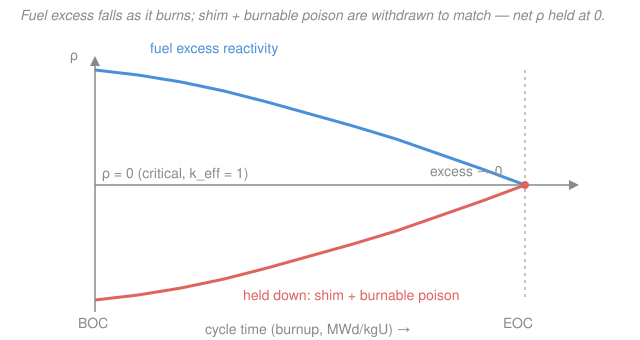

# Reactor Physics & Neutron Transport · Lesson 5.6: Reactor control & operation

> ⏱ ~15 min · Module 5: Feedback, poisons & fuel evolution · Builds on: [5.5 Fuel burnup, conversion & breeding](05-05-fuel-burnup-conversion-breeding.md), [4.2 Reactivity & the prompt jump](04-02-reactivity-prompt-jump.md) · Unlocks (course end): [`reactor-thermal-hydraulics`](../../reactor-thermal-hydraulics/syllabus.md), [`nuclear-fuel-cycle`](../../nuclear-fuel-cycle/syllabus.md), [`radiation-detection-shielding`](../../radiation-detection-shielding/syllabus.md)

## Why this matters

Here is the paradox that runs a power reactor: to stay critical for a *year* while the fuel steadily depletes and poisons pile up, a fresh core must start with far *more* reactivity than critical needs — and then that dangerous surplus has to be locked down and released, gram by gram, on a schedule. Every tool from this course now becomes an instrument on the control panel: the feedback of [5.1](05-01-reactivity-feedback-temperature-coefficients.md)–[5.2](05-02-doppler-moderator-void-coefficients.md), the xenon poison of [5.3](05-03-xenon-135-iodine-pit.md)–[5.4](05-04-xenon-oscillations-samarium-149.md), the burnup of [5.5](05-05-fuel-burnup-conversion-breeding.md), and the reactivity arithmetic of [4.2](04-02-reactivity-prompt-jump.md). This final lesson is the synthesis: how you hold down the excess, spend it over a cycle, and prove you can always shut the reactor off.

## The idea

Think of the fresh core as a fully-wound spring. If you released all of it at once the reactor would be wildly supercritical — so you *hold most of it down* with absorbers and let it out slowly as burnup eats the fuel. That surplus over critical is the **excess reactivity**, and it must be enough to outlast a full cycle of fuel depletion, plutonium buildup, and fission-product poisoning.

Three tools spend it, on three different clocks:

- **Control rods** — strong neutron absorbers on drives. Fast and precise, they're the reactor's steering wheel and brake: milliseconds to scram, fine trim for transients. But they distort the flux shape locally, so you don't want them buried deep in the core during normal running.
- **Chemical shim** — boron dissolved in the coolant of a PWR. Slow and *spatially uniform*: it soaks up neutrons everywhere at once without bending the flux, perfect for the gradual, core-wide trim as fuel burns down. You dilute the boron over months to release reactivity.
- **Burnable poisons** — deliberately loaded absorbers (gadolinium, boron) that *burn out alongside the fuel*. They hold down the big beginning-of-cycle excess, then deplete on their own, so the excess-reactivity curve stays flat instead of towering at startup and crashing later.

The whole art is keeping $k_{\text{eff}}=1$ at every instant while this surplus drains away — and reserving enough absorber worth that, no matter what, you can drive the core deeply subcritical and *keep* it there. That last guarantee is the **shutdown margin**, and it's the number safety lives or dies on.

## The formal version

**The reactivity budget.** At beginning of cycle (BOC) the fuel carries an excess reactivity $\rho_{\text{ex}}$ above critical. The control system must be able to *hold down* everything that would otherwise drive the core supercritical, and *give back* everything a shutdown removes. The pieces are usually quoted in $\%\Delta k$ or **pcm** ($1\%\,\Delta k = 1000\ \text{pcm}$):

$$\rho_{\text{control}} \;\ge\; \underbrace{\rho_{\text{ex}}}_{\text{burnup}} \;+\; \underbrace{|\rho_{\text{PD}}|}_{\text{power defect}} \;+\; \underbrace{|\rho_{\text{Xe}}|}_{\text{peak xenon}} \;+\; \text{margin}.$$

*In words: the sum of rod worth plus shim worth must cover the fuel's cycle surplus, the power defect you get back on cooldown, and the swing from peak xenon — with reactivity to spare.* The **power defect** $\rho_{\text{PD}}$ is the (negative) reactivity from all temperature feedbacks between zero power and full power; cooling the core *returns* that reactivity, so control must be able to absorb it. Peak xenon (the iodine pit of [5.3](05-03-xenon-135-iodine-pit.md)) is the transient negative reactivity whose eventual decay you must also hold against.

**Differential and integral rod worth.** As you withdraw a rod a distance $x$ from the bottom of a core of height $H$, each increment inserts reactivity. The **differential worth** is the local rate,

$$\frac{d\rho}{dx} \quad (\text{pcm/cm}),$$

and the **integral worth** is its running total,

$$\rho(x) = \int_0^{x} \frac{d\rho}{dx'}\,dx'.$$

*In words: differential worth is how much reactivity one more centimeter of withdrawal buys; integral worth is the cumulative reactivity from a given rod position.* Because a rod's effectiveness scales with the neutron flux (really the flux *squared*, importance-weighted) at its tip, and the flux is cosine-shaped — peaked at core center, near zero at the ends — the differential worth is **bell-shaped**: weak at top and bottom, strongest at mid-height. Integrating a bell gives the classic **S-curve** for integral worth: flat, then steep through the middle, then flat again. A standard model:

$$\frac{d\rho}{dx} = \frac{\rho_{\text{tot}}}{H}\left[1-\cos\!\frac{2\pi x}{H}\right], \qquad \rho(x)=\rho_{\text{tot}}\left[\frac{x}{H}-\frac{1}{2\pi}\sin\!\frac{2\pi x}{H}\right],$$

with $\rho_{\text{tot}}$ the rod's total worth (fully withdrawn). *In words: the same withdrawal buys the most reactivity through the flux-rich middle of the core.*

**Rod shadowing.** Two rods near each other are worth *less* together than the sum of their individual worths: the first rod depresses the local flux, so the second one — now sitting in a dimmer region — has less to absorb. Worth is not additive; it must be measured or computed for the actual configuration.

**Shutdown margin (SDM).** The reactor must be subcritical *even in its most reactive credible shutdown state with the single highest-worth control rod stuck fully out*:

$$\text{SDM} = \big(\rho_{\text{rods, all-in}} - \rho_{\text{stuck rod}}\big) - \big(\rho_{\text{ex at that state}} + |\rho_{\text{PD}}| + \rho_{\text{Xe decay}}\big) \;\ge\; \text{SDM}_{\min}.$$

*In words: subtract the worth you lose to a stuck rod, then check what's left can still overcome the excess plus the positive reactivity that appears as the core cools and xenon decays — with a required cushion left over.* The xenon term is the treacherous one: after a scram, xenon builds to its pit and then *decays away over ~1–2 days*, slowly inserting positive reactivity — so a margin that looked fine at hour zero can vanish at hour twenty.

## Picture

## Worked examples

**Example 1 (the reactivity budget + shutdown margin).** A fresh PWR core at BOC has these reactivity demands the control system must command (all in $\%\Delta k$):

| Demand | Magnitude |
|---|---|
| Fuel-cycle excess $\rho_{\text{ex}}$ (burn to EOC) | $16.0$ |
| Power defect $|\rho_{\text{PD}}|$ (hot full power &#8594; cold) | $2.0$ |
| Peak transient xenon $|\rho_{\text{Xe}}|$ | $2.8$ |
| **Total demand** | $\mathbf{20.8}$ |

Available control worth: soluble boron (chemical shim) over its full range $=15.0\%\,\Delta k$; control rods total $=7.0\%\,\Delta k$, so available $=22.0\%\,\Delta k$.

$$\text{margin} = 22.0 - 20.8 = 1.2\%\,\Delta k > 0. \quad\checkmark$$

The control system can command every operating state with $1.2\%\,\Delta k$ to spare. **Now the shutdown check.** A fast scram can't credit boron dilution (it's too slow to inject), so the *rods alone* must guarantee subcriticality — and we assume the highest-worth rod (worth $1.4\%\,\Delta k$) sticks fully out:

$$\rho_{\text{rods, available}} = 7.0 - 1.4 = 5.6\%\,\Delta k.$$

At the hot-to-cold shutdown state (boron holds the burnup excess), the rods must overcome the positive reactivity boron *doesn't*: the power defect returned on cooldown ($2.0$) plus the reactivity inserted as peak xenon decays away ($2.8$):

$$\text{SDM} = 5.6 - (2.0 + 2.8) = 0.8\%\,\Delta k \;=\; 800\ \text{pcm}.$$

If the plant's technical specification requires $\text{SDM}_{\min}=500\ \text{pcm}$, we pass with $300\ \text{pcm}$ to spare. Notice the xenon term is nearly half the demand — this is exactly why a reactor scrammed from full power can sit in a "xenon dead time" where restart is impossible until the pit decays.

**Example 2 (integral from differential rod worth).** A control rod has total worth $\rho_{\text{tot}}=2500\ \text{pcm}$ over a core of height $H=360\ \text{cm}$, with the bell-shaped differential worth above.

*(a) Differential worth at core midplane and at the ends.* At $x=H/2$, $\cos(2\pi\cdot\tfrac12)=\cos\pi=-1$:

$$\left.\frac{d\rho}{dx}\right|_{H/2}=\frac{2500}{360}\big[1-(-1)\big]=\frac{2500}{360}\times2 = 13.9\ \text{pcm/cm}.$$

At the ends ($x=0$ or $x=H$), $\cos 0 = \cos 2\pi = 1$, so $d\rho/dx = 0$ — the rod tip sits where the flux vanishes and buys nothing.

*(b) Reactivity inserted withdrawing from 25% to 50% of height.* Use the integral $\rho(x)=\rho_{\text{tot}}\!\left[\tfrac{x}{H}-\tfrac{1}{2\pi}\sin\tfrac{2\pi x}{H}\right]$. At $x/H=0.50$: $\sin\pi=0$, so $\rho=2500(0.50-0)=1250\ \text{pcm}$. At $x/H=0.25$: $\sin(\pi/2)=1$, so

$$\rho(0.25H)=2500\left[0.25-\frac{1}{2\pi}(1)\right]=2500\,(0.25-0.15915)=2500(0.09085)=227\ \text{pcm}.$$

Withdrawing from 25% to 50%:

$$\Delta\rho = 1250-227 = 1023\ \text{pcm}.$$

Compare the *first* quarter of travel (0 → 25%), which inserts only $227\ \text{pcm}$: the same 25% span buys **4.5× more reactivity** through the flux-rich middle than near the bottom. That asymmetry is the S-curve, and it's why operators watch rod position, not just how far a rod has moved.

## Watch out

- **You might think excess reactivity is a design mistake — why not just build a critical core?** A perfectly-critical fresh core would go subcritical the instant the first fuel atom fissioned. Excess reactivity is the *fuel budget for the whole cycle*; the skill is holding it down safely, not eliminating it.
- **You might think withdrawing a rod halfway inserts half its worth.** No — the S-curve means a rod near the top or bottom is nearly worthless, while the middle inches carry most of the reactivity. "50% withdrawn" gives exactly 50% of total worth only because the curve is symmetric, but the reactivity is packed into the central travel.
- **You might think shutdown margin only matters at the moment of scram.** The opposite: it's often *tightest hours later*, as peak xenon decays and quietly inserts positive reactivity. Shutdown margin is a promise you must keep across the whole transient, not just at $t=0$.

## One-liner

> A reactor runs by hoarding excess reactivity, holding it down with rods, shim, and burnable poison, then spending it exactly as fast as burnup and poisons drain it — while always keeping enough absorber in reserve to shut down and stay down.

## Problems

**P1 (🟢)** A core needs to hold down a total reactivity demand of $\rho_{\text{ex}}+|\rho_{\text{PD}}|+|\rho_{\text{Xe}}| = 18.5\%\,\Delta k$. Chemical shim provides $12.0\%\,\Delta k$ and the control rods $7.5\%\,\Delta k$. (a) Is the total worth sufficient, and by how much? (b) If burnable poisons are added worth $6.0\%\,\Delta k$ at BOC, what does that let you *reduce*, and why is that operationally desirable?

**P2 (🟡)** A rod has total worth $\rho_{\text{tot}}=1800\ \text{pcm}$ over $H=300\ \text{cm}$, with $\dfrac{d\rho}{dx}=\dfrac{\rho_{\text{tot}}}{H}\left[1-\cos\dfrac{2\pi x}{H}\right]$. (a) Find the peak differential worth (pcm/cm) and where it occurs. (b) Find the reactivity inserted by withdrawing the rod from the fully-inserted position to mid-core ($x=0$ to $x=H/2$).

**P3 (🔴)** Shutdown-margin check. Control rods are worth $8.0\%\,\Delta k$ total; the highest-worth rod (stuck out) is $1.8\%\,\Delta k$. In the limiting cold-shutdown state the rods must overcome a power defect of $2.2\%\,\Delta k$ plus a xenon-decay insertion of $2.5\%\,\Delta k$ (boron holds the burnup excess). (a) Compute the shutdown margin. (b) Does it meet a required $\text{SDM}_{\min}=1000\ \text{pcm}$? (c) The chief engineer proposes crediting $3\%\,\Delta k$ of boron toward *this* margin. Why is that not allowed for the fast-scram analysis?

Solutions

**P1.** (a) Total available $=12.0+7.5=19.5\%\,\Delta k$ against a demand of $18.5\%\,\Delta k$, so it's sufficient with $19.5-18.5 = 1.0\%\,\Delta k$ ($=1000\ \text{pcm}$) of margin. *Check:* positive margin, so the control system can command every state. ✓ (b) Burnable poisons ($6.0\%\,\Delta k$) hold down part of the BOC excess *on their own* and then deplete as the fuel burns, so you can **reduce the beginning-of-cycle shim (boron) concentration** (or rod insertion) by that much. Desirable because: (i) it flattens the excess-reactivity-vs-time curve — less towering surplus at startup — and (ii) a high BOC boron concentration makes the moderator temperature coefficient less negative (even positive), so cutting boron with burnable poisons keeps the [5.2](05-02-doppler-moderator-void-coefficients.md) moderator coefficient safely negative. *(Either reason earns full credit.)*

**P2.** (a) Peak differential worth is at $x=H/2$ (core midplane), where $\cos\pi=-1$:

$$\left.\frac{d\rho}{dx}\right|_{\max}=\frac{\rho_{\text{tot}}}{H}\,[1-(-1)]=\frac{2\rho_{\text{tot}}}{H}=\frac{2(1800)}{300}=12.0\ \text{pcm/cm}.$$

*Check:* units pcm/cm; the ends give $\tfrac{\rho_{\text{tot}}}{H}(1-1)=0$, as they must. ✓ (b) Integral to mid-core, $\rho(x)=\rho_{\text{tot}}\!\left[\tfrac{x}{H}-\tfrac{1}{2\pi}\sin\tfrac{2\pi x}{H}\right]$. At $x=H/2$: $\sin\pi=0$, so

$$\rho(H/2)=1800\big(0.50-0\big)=900\ \text{pcm}.$$

Withdrawing $0\to H/2$ inserts exactly half the total worth, $900\ \text{pcm}$. *Check:* by symmetry the top half must also carry $900\ \text{pcm}$, summing to $\rho_{\text{tot}}=1800\ \text{pcm}$. ✓ (The reactivity is symmetric about mid-core even though it's concentrated in the central travel.)

**P3.** (a) Rod worth after the stuck rod is removed: $8.0-1.8=6.2\%\,\Delta k$. Reactivity the rods must overcome: $2.2+2.5=4.7\%\,\Delta k$. So

$$\text{SDM}=6.2-4.7=1.5\%\,\Delta k = 1500\ \text{pcm}.$$

(b) Required is $1000\ \text{pcm}$; we have $1500\ \text{pcm}$, so **yes**, with $500\ \text{pcm}$ to spare. ✓ (c) Soluble boron cannot be *injected* fast enough to be credited in a fast-scram (rod-drop) shutdown-margin analysis — boron concentration changes over minutes-to-hours by dilution/boration, while a scram must act in seconds. The stuck-rod SDM analysis credits only what physically inserts on the scram timescale: the control rods. (Boron *is* credited for the slow, at-power reactivity balance of Example 1 — just not for the instantaneous shutdown guarantee.)

## Flashback

**From Lesson 5.1 (temperature coefficients & the power defect).** A reactor has an isothermal temperature coefficient $\alpha_T = -2.5\ \text{pcm}/^\circ\text{C}$, roughly constant over the range of interest. It is heated from cold shutdown at $20\,^\circ\text{C}$ to a hot zero-power condition at $290\,^\circ\text{C}$. (a) Find the reactivity change from the heatup. (b) Which way must the operator move the rods (or boron) to stay critical during the heatup, and how does this connect to the "power defect" line in this lesson's budget?

Solution

(a) With a constant coefficient, integrate $\Delta\rho=\alpha_T\,\Delta T$:

$$\Delta\rho = (-2.5\ \text{pcm}/^\circ\text{C})\times(290-20)\,^\circ\text{C} = -2.5\times270 = -675\ \text{pcm}.$$

Heating inserts $-675\ \text{pcm}$ of reactivity (a negative "temperature defect"). *Check:* a negative coefficient means warming reduces reactivity — the stabilizing sign of [5.1](05-01-reactivity-feedback-temperature-coefficients.md). ✓ (b) To hold $k_{\text{eff}}=1$ as the core warms and *loses* $675\ \text{pcm}$, the operator must **add** $+675\ \text{pcm}$ — by withdrawing rods or diluting boron. This is exactly the temperature part of the **power defect** in Example 1: the reactivity feedback swallows on the way up must be *returned* by control on the way down, which is why the control system's worth must cover $|\rho_{\text{PD}}|$. A fitting close: the same coefficient that keeps the reactor inherently stable is a line item in the budget you must plan for. ✓

## Connections

- **Backward:** this lesson spends everything Module 5 built — the excess reactivity of [5.5](05-05-fuel-burnup-conversion-breeding.md) is what control holds down, the power defect comes from the temperature coefficients of [5.1](05-01-reactivity-feedback-temperature-coefficients.md)–[5.2](05-02-doppler-moderator-void-coefficients.md), the xenon term from [5.3](05-03-xenon-135-iodine-pit.md), and every worth is quoted in the reactivity and dollars of [4.2](04-02-reactivity-prompt-jump.md). A control rod is just a strong, movable $\Sigma_a$ perturbing the criticality balance of Module 2.
- **Forward:** the power defect and rod worth both depend on the core temperature field, which is handed to [`reactor-thermal-hydraulics`](../../reactor-thermal-hydraulics/syllabus.md); reload design, burnable-poison loading, and the fuel-cycle economics of the excess-reactivity curve are the subject of [`nuclear-fuel-cycle`](../../nuclear-fuel-cycle/syllabus.md); and the shielding of a shut-down but still-radioactive core is [`radiation-detection-shielding`](../../radiation-detection-shielding/syllabus.md).
- **Sideways (calculus / perturbation theory):** integral rod worth *is* the cumulative-integral picture from `calc-refresher` — the S-curve is the running integral of a bell-shaped density, and differential worth is its derivative, the fundamental theorem of calculus wearing a control-rod uniform. Deeper still, that a rod's worth scales with the local flux *squared* is first-order eigenvalue perturbation theory (importance-weighting by the adjoint flux) — the same math that tells you how a small change to any operator shifts its dominant eigenvalue.
