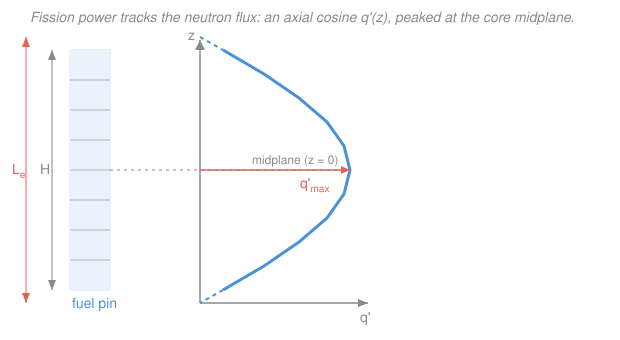

# Reactor Thermal-Hydraulics · Lesson 1.1: Power distribution and the volumetric source

> ⏱ ~15 min · Module 1: Core power and conduction in the fuel · Builds on: [`reactor-physics` 2.4 (flux shapes)](../../reactor-physics/lessons/02-04-bare-reactor-geometries-flux-shapes.md), [`intro-nuclear-engineering` 3.1 (fission energy)](../../intro-nuclear-engineering/lessons/03-01-fission-process-energy.md) · Unlocks: [1.2 Conduction with a heat source in a fuel pin](01-02-conduction-heat-source-fuel-pin.md)

## Why this matters

Neutronics ended by telling you *where* fissions happen and how the flux is shaped across a core. Thermal-hydraulics begins by asking a blunter question: **how many watts, in each cubic millimeter of fuel, do you now have to carry away before something melts?** Every temperature you will ever compute in this course — pellet centerline, cladding surface, coolant outlet — hangs off one number, the local heat generation rate. This lesson converts a reactor's headline power rating into that number and, just as importantly, into the *one* engineering figure a fuel designer lives by: the **linear power** of the hottest pin. Get the source term right and the rest of the course is bookkeeping; get it wrong and every downstream margin is fiction.

## The idea

A fission releases about **200 MeV**, and the useful part of that — the kinetic energy of the two heavy fragments — is dumped within microns of where the split happened. So to very good approximation, **fission power becomes heat right there in the fuel.** The core is a distributed stove: heat is *made* volumetrically, everywhere the fuel sits, not delivered from a surface.

That gives us three ways to quote "how hot is it running," and the trick is knowing which one answers which question:

- **Volumetric** $q'''$ — watts per cubic meter of fuel. The rawest form: how furiously each bit of fuel is generating heat. It's what the physics hands you directly.
- **Linear** $q'$ — watts per meter of pin *length*. Collapse the volumetric rate over a pin's cross-section and you get the heat pouring out of each meter of rod. This is the number reactor engineers actually design to, because it (not $q'''$) sets the centerline temperature. Quoted in kW/m, and famously kept below ~40–50 kW/m.
- **Surface heat flux** $q''$ — watts per square meter of the pin's outer surface. This is what the coolant sees and must sweep away, and it's what boiling limits are written against.

Same power, three denominators — volume, length, area. Moving between them is just multiplying or dividing by a bit of pin geometry.

And the power is **not uniform.** It tracks the neutron flux you solved for in [`reactor-physics` 2.4](../../reactor-physics/lessons/02-04-bare-reactor-geometries-flux-shapes.md): a Bessel hump across the core radius, a **cosine hump** up the height. So the pin in the center at mid-height runs far hotter than the core average. The ratio of peak to average — the **peaking factor** — is why we can't just design to the average and call it a day. The peak pin is the one that melts.

## The formal version

**Local heat generation.** In a spot where the macroscopic fission cross-section is $\Sigma_f$ (per meter, $\mathrm{m^{-1}}$), the neutron flux is $\phi$ ($\mathrm{n\,m^{-2}s^{-1}}$), and each fission deposits recoverable energy $E_f$ (joules), the volumetric heat rate in the fuel is

$$q''' = \Sigma_f\,\phi\,E_f \qquad \left[\mathrm{W/m^3}\right].$$

*In words: fissions per cubic meter per second ($\Sigma_f\phi$) times joules per fission ($E_f$) equals watts per cubic meter.* Here $E_f \approx 200\ \mathrm{MeV} = 200\times1.602\times10^{-13}\ \mathrm{J} = 3.20\times10^{-11}\ \mathrm{J}$. Because $q'''$ is proportional to $\phi$, its spatial shape *is* the flux shape.

**The two geometry conversions.** Take a cylindrical fuel pellet of radius $r_o$ (m). Integrate the volumetric rate over the fuel cross-section to get the heat leaving each meter of length:

$$q' = q''' \cdot A_{fuel} = q'''\,\pi r_o^2 \qquad \left[\mathrm{W/m}\right].$$

*In words: linear power is volumetric power times the fuel's cross-sectional area.* That same heat, in steady state, must cross the pellet's outer surface (area $2\pi r_o$ per meter), giving the surface flux

$$q'' = \frac{q'}{2\pi r_o} = \frac{q'''\,r_o}{2} \qquad \left[\mathrm{W/m^2}\right].$$

*In words: everything made inside a meter of pin ($q'$) must escape through that meter's outer skin ($2\pi r_o$).* The three densities are one physical quantity wearing three denominators: $q''' \,(\div\text{volume}) \to q'\,(\div\text{length}) \to q''\,(\div\text{area})$.

**Axial shape and peaking.** For a bare core the axial power profile is a cosine centered on the midplane $z=0$:

$$q'(z) = q'_{max}\cos\!\left(\frac{\pi z}{L_e}\right),$$

where $L_e$ is the **extrapolated length** — the active fuel length $H$ stretched slightly (by the neutron extrapolation distance at each end, the $\tilde H$ of [`reactor-physics` 2.4](../../reactor-physics/lessons/02-04-bare-reactor-geometries-flux-shapes.md)), so the cosine reaches zero just *beyond* the physical ends rather than at them. *In words: power is highest at mid-height and tapers toward the top and bottom, following the flux.*

To connect a single pin's rating to the whole core, define the **average linear power** from total thermal power $P$ (W), pin count $N_{pins}$, and active length $L$:

$$\bar q' = \frac{P}{N_{pins}\,L}.$$

*In words: spread all the core's power evenly over every meter of every pin.* The **peaking factor** $F_q$ lifts that average to the worst case:

$$q'_{max} = F_q\,\bar q', \qquad F_q = F_r\cdot F_z\;(\times\ \text{engineering factors}),$$

a product of a **radial** factor $F_r$ (hottest pin vs. average pin) and an **axial** factor $F_z$ (peak vs. average *along* the hot pin). A pure axial cosine over the active length contributes $F_z = \pi/2 \approx 1.57$ on its own; with radial tilt and manufacturing tolerances the total $F_q$ for a PWR runs ~2.2–2.6. That peak pin is what Module 1's [hot-channel analysis (1.5)](01-05-hot-channel-hot-spot-factors.md) is built to protect.

## Picture

The cosine is drawn solid over the active length $H$ and dashed on the short **extrapolated** tails, where it finishes falling to zero just past the pin ends — that overshoot is exactly why $L_e > H$.

## Worked examples

**Example 1 (core rating → the peak-pin number).** A 3000 $\mathrm{MW_{th}}$ PWR holds about $N_{pins} = 50{,}000$ fuel rods, each with active length $L = 3.66\ \mathrm{m}$. Find the average linear power, then the peak.

Spread the power evenly:

$$\bar q' = \frac{P}{N_{pins}\,L} = \frac{3000\times10^{6}\ \mathrm{W}}{50{,}000 \times 3.66\ \mathrm{m}} = \frac{3.0\times10^{9}}{1.83\times10^{5}}\ \mathrm{W/m} = 1.64\times10^{4}\ \mathrm{W/m} \approx 16.4\ \mathrm{kW/m}.$$

Now apply a total peaking factor $F_q \approx 2.5$ (radial $\times$ axial $\times$ tolerances):

$$q'_{max} = F_q\,\bar q' = 2.5 \times 16.4\ \mathrm{kW/m} \approx 41\ \mathrm{kW/m}.$$

*Check.* Units: $\mathrm{W}/(\text{pins}\cdot\mathrm{m}) = \mathrm{W/m}$ ✓ (pin count is dimensionless). The ~40 kW/m peak is the canonical PWR fuel-design figure and the starting point for **Boss problem 1** — remember it. (A ~2.5% refinement: a few percent of $E_f$ escapes the fuel as gamma and neutron energy deposited in coolant and structures, so the fuel-only average is slightly below this; we fold that in later.)

**Example 2 (peak $q'$ → $q'''$ and $q''$).** Take that peak pin, $q'_{max} = 40\ \mathrm{kW/m}$, in a pellet of radius $r_o = 4.1\ \mathrm{mm} = 4.1\times10^{-3}\ \mathrm{m}$. What volumetric rate and surface flux does that imply?

Cross-sectional area of fuel:

$$A_{fuel} = \pi r_o^2 = \pi\,(4.1\times10^{-3})^2 = 5.28\times10^{-5}\ \mathrm{m^2}.$$

Volumetric rate (divide linear power by area):

$$q''' = \frac{q'}{A_{fuel}} = \frac{4.0\times10^{4}\ \mathrm{W/m}}{5.28\times10^{-5}\ \mathrm{m^2}} = 7.6\times10^{8}\ \mathrm{W/m^3} \approx 758\ \mathrm{MW/m^3}.$$

Surface heat flux at the pellet outer surface (divide by circumference $2\pi r_o$):

$$q'' = \frac{q'}{2\pi r_o} = \frac{4.0\times10^{4}}{2\pi\,(4.1\times10^{-3})} = \frac{4.0\times10^{4}}{2.58\times10^{-2}}\ \mathrm{W/m^2} = 1.55\times10^{6}\ \mathrm{W/m^2} \approx 1.55\ \mathrm{MW/m^2}.$$

*Check.* Cross-check with the shortcut $q'' = q'''\,r_o/2 = 7.6\times10^{8}\times(4.1\times10^{-3})/2 = 1.56\times10^{6}\ \mathrm{W/m^2}$ ✓ (rounding). Units track: $\mathrm{(W/m)/m^2 = W/m^3}$ and $\mathrm{(W/m)/m = W/m^2}$ ✓. A three-quarters-of-a-gigawatt-per-cubic-meter stove behind a wall of ceramic — that is why fuel pins are thin.

## Watch out

- **You might think $q'''$, $q'$, and $q''$ are different physical quantities.** They're the *same heat*, divided by volume, length, or area respectively. Confusing them is a units disaster — a "40" that's kW/m (fine) versus MW/m³ (a totally different pin). Always carry the primes and the denominator.
- **You might design to the average power.** Never. The peak pin runs $F_q \approx 2.5\times$ hotter, and it's the one that melts or triggers boiling crisis. The whole point of the peaking factor is that the *average* is a comforting lie.
- **You might expect $q'''$ to be uniform because "the pin is one material."** It isn't — $q''' \propto \phi$, and the flux sags toward the pin's ends (axial cosine) and toward the core edge (radial Bessel). Uniform material, wildly non-uniform source.
- **You might read the surface flux $q''$ off the pellet and hand it to the coolant.** The heat still has to cross a gas gap and the cladding first; the flux the coolant actually sees is at the *clad* outer surface, a slightly larger radius. We chain those resistances in [1.3](01-03-gap-cladding-resistances.md).

## One-liner

> Fission power is a volumetric stove ($q''' = \Sigma_f\phi E_f$); collapse it over a pin's area for the design-critical linear rating $q'$ (~40 kW/m at the peak), and never forget the peak pin runs ~2.5× the core average.

## Problems

**P1 (🟢)** A 2800 $\mathrm{MW_{th}}$ PWR has 45,000 fuel rods, each 3.5 m of active length. (a) Find the core-average linear power $\bar q'$ in kW/m. (b) With a total peaking factor $F_q = 2.4$, find the peak linear power $q'_{max}$.

**P2 (🟡)** For the axial cosine $q'(z) = q'_{max}\cos(\pi z/L_e)$, assume the extrapolation is negligible so $L_e \approx H$ and $z$ runs over $[-H/2,\,H/2]$. Show that the average linear power along the pin is $\bar q'_{axial} = (2/\pi)\,q'_{max}$, and hence that the **axial peaking factor** is $F_z = q'_{max}/\bar q'_{axial} = \pi/2 \approx 1.57$. If the peak is 40 kW/m, what is the axial average?

**P3 (🔴)** A fuel region has macroscopic fission cross-section $\Sigma_f = 30\ \mathrm{m^{-1}}$, neutron flux $\phi = 3.0\times10^{17}\ \mathrm{n\,m^{-2}s^{-1}}$, and recoverable energy per fission $E_f = 200\ \mathrm{MeV}$. (a) Compute the volumetric heat rate $q'''$. (b) For a pellet of radius $r_o = 4.1\ \mathrm{mm}$, convert to linear power $q'$. Is this an average-ish or a peak value, judging by Example 1?

Solutions

**P1** (a) Average linear power:

$$\bar q' = \frac{P}{N_{pins}\,L} = \frac{2800\times10^{6}}{45{,}000 \times 3.5} = \frac{2.8\times10^{9}}{1.575\times10^{5}} = 1.78\times10^{4}\ \mathrm{W/m} \approx 17.8\ \mathrm{kW/m}.$$

(b) Peak:

$$q'_{max} = F_q\,\bar q' = 2.4 \times 17.8 \approx 42.7\ \mathrm{kW/m}.$$

*Check.* Units $\mathrm{W/m}$ ✓; the ~43 kW/m peak sits right in the realistic PWR band (~40–45 kW/m), as it should. ✓

**P2** Average over the length is the integral of $q'(z)$ divided by $H$:

$$\bar q'_{axial} = \frac{1}{H}\int_{-H/2}^{H/2} q'_{max}\cos\!\left(\frac{\pi z}{H}\right)dz = \frac{q'_{max}}{H}\left[\frac{H}{\pi}\sin\!\left(\frac{\pi z}{H}\right)\right]_{-H/2}^{H/2}.$$

Evaluate: $\sin(\pi/2) - \sin(-\pi/2) = 1-(-1) = 2$, so

$$\bar q'_{axial} = \frac{q'_{max}}{H}\cdot\frac{H}{\pi}\cdot 2 = \frac{2}{\pi}\,q'_{max}.$$

Therefore $F_z = q'_{max}/\bar q'_{axial} = q'_{max}/\big((2/\pi)q'_{max}\big) = \pi/2 \approx 1.571$. With $q'_{max} = 40\ \mathrm{kW/m}$:

$$\bar q'_{axial} = \frac{2}{\pi}\times 40 \approx 25.5\ \mathrm{kW/m}.$$

*Check.* $F_z > 1$ as any peak-over-average must be ✓, and $2/\pi \approx 0.637$ says the cosine averages to about 64% of its peak — a hump that's mostly "on," which matches the shape. This $\pi/2$ is exactly the axial form factor $F_z$ that feeds the total peaking factor $F_q$. ✓

**P3** (a) First $E_f$ in joules: $E_f = 200\times1.602\times10^{-13} = 3.20\times10^{-11}\ \mathrm{J}$. Then

$$q''' = \Sigma_f\,\phi\,E_f = (30)(3.0\times10^{17})(3.20\times10^{-11}) = 30\times3.0\times3.20\times10^{17-11}\ \mathrm{W/m^3}.$$

$30\times3.0\times3.20 = 288$, and $10^{6}$, so $q''' = 2.88\times10^{8}\ \mathrm{W/m^3} \approx 288\ \mathrm{MW/m^3}$.

(b) Linear power:

$$q' = q'''\,\pi r_o^2 = 2.88\times10^{8}\times\pi\,(4.1\times10^{-3})^2 = 2.88\times10^{8}\times 5.28\times10^{-5} = 1.52\times10^{4}\ \mathrm{W/m} \approx 15.2\ \mathrm{kW/m}.$$

Compared with Example 1's core average of ~16.4 kW/m and peak of ~40 kW/m, this ~15 kW/m is an **average-ish** value — sensible, since $3.0\times10^{17}$ is a middling flux rather than the mid-core peak.

*Check.* Units: $\mathrm{m^{-1}}\cdot\mathrm{m^{-2}s^{-1}}\cdot\mathrm{J} = \mathrm{J\,m^{-3}s^{-1}} = \mathrm{W/m^3}$ ✓; then $\mathrm{W/m^3}\cdot\mathrm{m^2} = \mathrm{W/m}$ ✓. The whole chain neutronics ($\Sigma_f\phi$) → energy ($E_f$) → geometry ($\pi r_o^2$) lands on a believable kW/m, which is the point of the lesson. ✓

## Connections

- **Backward:** the axial cosine and radial Bessel shapes here are the *fundamental-mode flux* of [`reactor-physics` 2.4](../../reactor-physics/lessons/02-04-bare-reactor-geometries-flux-shapes.md); the peaking factor is that lesson's form factor $\phi_{max}/\bar\phi$ wearing a thermal hat. The ~200 MeV/fission and its "deposited locally" split come straight from [`intro-nuclear-engineering` 3.1](../../intro-nuclear-engineering/lessons/03-01-fission-process-energy.md).
- **Forward:** $q'''$ is the **source term** in next lesson's conduction equation — [1.2](01-02-conduction-heat-source-fuel-pin.md) integrates it across the pellet to get the parabolic $T(r)$ and the centerline-to-surface drop $q'/(4\pi k)$, and the cosine $q'(z)$ drives the whole [axial channel profile (1.4)](01-04-axial-temperature-profile-channel.md). The peaking factor is the seed of [hot-channel/hot-spot analysis (1.5)](01-05-hot-channel-hot-spot-factors.md).
- **Sideways:** the volumetric-source idea is the reactor cousin of any internally-heated conduction problem — the same $q'''$ that appears in [`heat-transfer` 1.3 (1-D steady conduction)](../../heat-transfer/lessons/01-03-1d-steady-conduction.md) when a wall generates its own heat. And $\Sigma_f\phi$ ties the temperatures you'll compute back to burnup and power history via [`reactor-physics` 5.5 (burnup)](../../reactor-physics/lessons/05-05-fuel-burnup-conversion-breeding.md).
