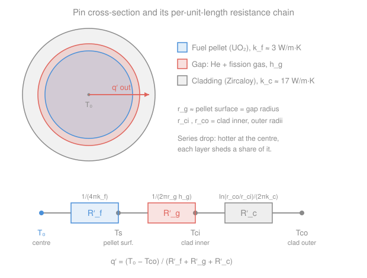

# Reactor Thermal-Hydraulics · Lesson 1.3: The gap and cladding resistances

> ⏱ ~15 min · Module 1: From fission to fuel temperature · Builds on: [1.2 Conduction with a heat source in the fuel pin](01-02-conduction-heat-source-fuel-pin.md), [`heat-transfer` 1.4 Thermal resistance networks](../../heat-transfer/lessons/01-04-thermal-resistance-networks.md), [`nuclear-materials` 4.1 Zirconium alloys (cladding)](../../nuclear-materials/lessons/04-01-zirconium-alloys-cladding.md) · Unlocks: 1.4 (axial temperature profile), 2.4 (full radial drop)

## Why this matters

In [1.2](01-02-conduction-heat-source-fuel-pin.md) you found how hot the *centre* of a fuel pellet runs relative to its *surface*. But the surface isn't where the coolant is. Between the pellet and the flowing water sit two more layers: a paper-thin gas **gap** and a metal **cladding** tube. Heat has to cross both, and each one costs a temperature rise. Get these wrong and you'll badly under-predict the centreline temperature — the number that decides whether the fuel stays solid or melts. This lesson chains the pellet, gap, and clad into a single **resistance network**, the same trick you learned for a composite wall in [`heat-transfer` 1.4](../../heat-transfer/lessons/01-04-thermal-resistance-networks.md), now wrapped into a cylinder.

## The idea

Think of heat leaving the pin as current flowing through a string of resistors wired in series. Each layer the heat crosses is one resistor; the temperature drop across it is the "voltage" and the linear power $q'$ is the "current." Layers in series just add their resistances, and the *same* $q'$ flows through all of them (steady state, no heat stored). So the total drop from pellet centre to clad outer surface is simply $q'$ times the sum of the resistances.

The twist versus a flat wall: two of our three layers are so thin compared to their radius that they behave almost like flat slabs, but one — the gap — is different in kind. It's a sliver of gas (helium at fabrication, increasingly laced with fission gas as the fuel burns), and gas conducts terribly. Rather than track its microscopic width we bundle everything about it — width, gas mixture, surface roughness, contact points — into one number, the **gap conductance** $h_g$. It plays the role of a heat-transfer coefficient sitting on the pellet surface. The upshot, which will surprise you: after the fuel itself, this near-invisible gap is often the *second-biggest* resistance in the whole stack — bigger than the solid metal clad.

## The formal version

We work **per unit length** of pin, so every resistance has units of $\mathrm{K\cdot m/W}$ (a K per W-per-metre). Linear power $q'$ has units $\mathrm{W/m}$, so $\Delta T = q' R'$ comes out in kelvin. The primes on $q'$ and $R'$ are the "per-metre-of-pin" reminder.

**Fuel (from [1.2](01-02-conduction-heat-source-fuel-pin.md)).** The centre-to-surface drop $T_0 - T_s = \dfrac{q'}{4\pi k_f}$ can be read as a resistance

$$R'_f = \frac{1}{4\pi k_f},$$

where $k_f$ is the fuel thermal conductivity ($\mathrm{W/(m\cdot K)}$; for UO$_2$, $k_f \approx 3$ and *falling* with temperature). *In words: the fuel's own resistance to shedding the heat generated inside it — and notice the pellet radius has cancelled out.*

**Gap.** Model the thin gas layer by a **gap conductance** $h_g$ ($\mathrm{W/(m^2\cdot K)}$, typically $5000$–$10^4$), defined so the heat flux across the gap is $h_g$ times the temperature jump. Spreading that over the gap circumference $2\pi r_g$ (with $r_g$ the gap radius, essentially the pellet surface radius, in m) gives

$$R'_g = \frac{1}{2\pi r_g h_g}, \qquad \Delta T_g = \frac{q'}{2\pi r_g h_g}.$$

*In words: a bigger conductance or a fatter pin sheds the gap drop more easily.* This is exactly a convective resistance $1/(hA')$ with area-per-length $A' = 2\pi r_g$ — the gap is treated as a "film" of gas rather than a slab of known width.

**Cladding.** The clad is a solid cylindrical shell (Zircaloy, $k_c \approx 17\ \mathrm{W/(m\cdot K)}$) from inner radius $r_{ci}$ to outer radius $r_{co}$ (m). Its steady radial conduction resistance is the cylindrical-shell formula from [`heat-transfer` 1.4](../../heat-transfer/lessons/01-04-thermal-resistance-networks.md):

$$R'_c = \frac{\ln(r_{co}/r_{ci})}{2\pi k_c}.$$

*In words: a log in the radius ratio because the heat spreads over more area as it moves outward through the shell.*

**The chain.** Fuel, gap, and clad sit in series, so

$$\boxed{\,q' = \frac{T_0 - T_{co}}{R'_f + R'_g + R'_c}\,}, \qquad \sum R' = \frac{1}{4\pi k_f} + \frac{1}{2\pi r_g h_g} + \frac{\ln(r_{co}/r_{ci})}{2\pi k_c}.$$

*In words: one current $q'$, the drops add, and the total drop is $q'$ times the total resistance* — Ohm's law for heat. (In [2.4](02-04-full-radial-temperature-drop.md) we tack on one more resistor, the coolant film $R'_{conv} = 1/(2\pi r_{co} h)$, to reach the bulk water temperature.)

**Why the gap degrades over life.** At fabrication the gap is filled with helium, which for a gas conducts unusually well ($k \approx 0.15\ \mathrm{W/(m\cdot K)}$). As the fuel burns, fission splits atoms into xenon and krypton, and some of that gas leaks out of the pellet into the gap (the fission-gas release of [`nuclear-materials` 3.4](../../nuclear-materials/lessons/03-04-fission-gas-release-swelling.md)). Xe and Kr are heavy, sluggish, and conduct heat roughly ten to thirty times *worse* than helium, so they dilute the fill gas and drop $h_g$. A degrading $h_g$ means a growing $\Delta T_g$ at the same power — the fuel runs hotter as it ages, even before you count fuel-conductivity loss. (Pellet swelling eventually closes the gap into solid contact, which claws some conductance back, but early-to-mid life the trend is degradation.)

## Picture

## Worked examples

**Example 1 (the gap drop — one resistor).** A pin runs at $q' = 40\ \mathrm{kW/m} = 40{,}000\ \mathrm{W/m}$ with gap radius $r_g = 4.2\ \mathrm{mm} = 0.0042\ \mathrm{m}$ and gap conductance $h_g = 6000\ \mathrm{W/(m^2\cdot K)}$. The drop across the gap:

$$\Delta T_g = \frac{q'}{2\pi r_g h_g} = \frac{40{,}000}{2\pi (0.0042)(6000)} = \frac{40{,}000}{158.3} \approx 253\ \mathrm{K}.$$

Over a gas layer perhaps 60 microns thick, more than 250 K. That is the price of asking heat to cross a gas gap. (Equivalently $R'_g = 1/158.3 \approx 6.32\times10^{-3}\ \mathrm{K\cdot m/W}$.)

*Check.* Units: $\dfrac{\mathrm{W/m}}{(\mathrm{m})(\mathrm{W/(m^2 K)})} = \dfrac{\mathrm{W/m}}{\mathrm{W/(m\,K)}} = \mathrm{K}$ ✓. Halve $h_g$ (aged fuel) and $\Delta T_g$ doubles to ~500 K — the degradation mechanism, quantified.

**Example 2 (clad drop, then the whole radial stack).** Same $q' = 40\ \mathrm{kW/m}$. Cladding: $r_{ci} = 4.18\ \mathrm{mm}$, $r_{co} = 4.75\ \mathrm{mm}$, $k_c = 17\ \mathrm{W/(m\cdot K)}$.

$$R'_c = \frac{\ln(r_{co}/r_{ci})}{2\pi k_c} = \frac{\ln(4.75/4.18)}{2\pi(17)} = \frac{\ln(1.1364)}{106.8} = \frac{0.1278}{106.8} \approx 1.20\times10^{-3}\ \mathrm{K\cdot m/W},$$

$$\Delta T_c = q' R'_c = 40{,}000 \times 1.20\times10^{-3} \approx 47.9\ \mathrm{K}.$$

Now bring in the fuel drop from [1.2](01-02-conduction-heat-source-fuel-pin.md) with UO$_2$ $k_f \approx 3\ \mathrm{W/(m\cdot K)}$:

$$R'_f = \frac{1}{4\pi k_f} = \frac{1}{4\pi(3)} = \frac{1}{37.70} \approx 2.65\times10^{-2}\ \mathrm{K\cdot m/W}, \quad \Delta T_f = 40{,}000 \times 2.65\times10^{-2} \approx 1061\ \mathrm{K}.$$

Adding the three (using Example 1's $\Delta T_g \approx 253\ \mathrm{K}$), the centreline-to-clad-outer-surface rise is

$$\Delta T_{0 \to co} = \Delta T_f + \Delta T_g + \Delta T_c \approx 1061 + 253 + 48 \approx 1362\ \mathrm{K}.$$

*Check.* Cross-check via the chain: $\sum R' = (2.65 + 0.632 + 0.120)\times10^{-2} = 3.40\times10^{-2}\ \mathrm{K\cdot m/W}$, so $q'\sum R' = 40{,}000 \times 3.40\times10^{-2} \approx 1362\ \mathrm{K}$ ✓. Share of the drop: fuel **78%**, gap **19%**, clad **3.5%**. The fuel and gap own the stack; the metal tube is almost free. If the clad outer surface sits near 350 °C in a PWR, the centreline is around 1700 °C — comfortably below UO$_2$'s ~2865 °C melt, but you can see how a degraded gap or a power spike eats the margin.

## Watch out

- **You might think the metal cladding is the big thermal barrier** — it's shiny, solid, and in the way. But metal conducts far better than a gas sliver: here the clad is only ~3.5% of the drop while the near-invisible gas gap is ~19%. Resistance follows conductivity, not thickness or looks.
- **You might treat $h_g$ as a fixed material constant.** It is not — it drifts with burnup as fission gas floods the gap, and it jumps when swelling closes the gap into solid contact. The same pin at the same power runs *hotter* late in life. Always ask "beginning or end of life?" before trusting a gap number.
- **You might use the flat-slab resistance $L/(kA)$ for the clad.** Because the clad's thickness ($r_{co}-r_{ci} \approx 0.57$ mm) is small next to its radius, that's a decent approximation — but the honest form is the log-ratio $\ln(r_{co}/r_{ci})/(2\pi k_c)$. Reach for the cylindrical formula so you're never caught out by a thick shell.

## One-liner

> Fuel, gap, and clad are three resistors in series carrying the same $q'$; the gas gap — tiny but a poor conductor, and worsening with burnup — costs far more temperature than the metal tube around it.

## Problems

**P1 (🟢)** A fuel pin operates at $q' = 30\ \mathrm{kW/m}$. Its cladding has $r_{ci} = 4.10\ \mathrm{mm}$, $r_{co} = 4.70\ \mathrm{mm}$, $k_c = 17\ \mathrm{W/(m\cdot K)}$. Find $R'_c$ and the temperature drop across the cladding.

**P2 (🟡)** A pin runs at $q' = 35\ \mathrm{kW/m}$ with $r_g = 4.1\ \mathrm{mm}$. Early in life $h_g = 9000\ \mathrm{W/(m^2\cdot K)}$ (fresh helium fill); late in life fission-gas release has dropped it to $h_g = 3500\ \mathrm{W/(m^2\cdot K)}$. Find the gap temperature drop in each case, and how many extra kelvin the aged gap adds.

**P3 (🔴, optional)** Using $R'_f = 2.65\times10^{-2}$, $R'_g = 6.32\times10^{-3}$, and $R'_c = 1.20\times10^{-3}\ \mathrm{K\cdot m/W}$ (the Example-2 values), suppose the design limits the centreline-to-clad-outer drop to $T_0 - T_{co} \le 1500\ \mathrm{K}$. What is the maximum allowable linear power $q'$? Then, if fission-gas release degrades the gap so $R'_g$ *doubles*, what is the new $q'$ limit?

Solutions

**P1** Cylindrical-shell resistance:

$$R'_c = \frac{\ln(r_{co}/r_{ci})}{2\pi k_c} = \frac{\ln(4.70/4.10)}{2\pi(17)} = \frac{\ln(1.1463)}{106.8} = \frac{0.1366}{106.8} \approx 1.28\times10^{-3}\ \mathrm{K\cdot m/W}.$$

$$\Delta T_c = q' R'_c = 30{,}000 \times 1.28\times10^{-3} \approx 38.4\ \mathrm{K}.$$

*Check.* Units of $R'_c$: dimensionless log over $\mathrm{W/(m\cdot K)}$ gives $\mathrm{K\cdot m/W}$ ✓; times $\mathrm{W/m}$ gives K ✓. A ~38 K drop across the metal — small, as expected for a good conductor.

**P2** Fresh:

$$\Delta T_g^{\text{fresh}} = \frac{q'}{2\pi r_g h_g} = \frac{35{,}000}{2\pi(0.0041)(9000)} = \frac{35{,}000}{231.9} \approx 151\ \mathrm{K}.$$

Aged:

$$\Delta T_g^{\text{aged}} = \frac{35{,}000}{2\pi(0.0041)(3500)} = \frac{35{,}000}{90.2} \approx 388\ \mathrm{K}.$$

Extra from ageing: $388 - 151 \approx 237\ \mathrm{K}$ hotter at the pellet surface, at the *same* power.

*Check.* $h_g$ dropped by a factor $9000/3500 = 2.57$, and indeed $388/151 \approx 2.57$ — $\Delta T_g \propto 1/h_g$ ✓. Units K throughout. This is why end-of-life fuel temperatures are the limiting case.

**P3** With the limit $\Delta T = 1500\ \mathrm{K}$ and $\sum R' = (2.65 + 0.632 + 0.120)\times10^{-2} = 3.40\times10^{-2}\ \mathrm{K\cdot m/W}$:

$$q'_{\max} = \frac{\Delta T}{\sum R'} = \frac{1500}{3.40\times10^{-2}} \approx 4.41\times10^{4}\ \mathrm{W/m} \approx 44.1\ \mathrm{kW/m}.$$

Double the gap: $R'_g \to 1.264\times10^{-2}$, so $\sum R' = (2.65 + 1.264 + 0.120)\times10^{-2} = 4.03\times10^{-2}\ \mathrm{K\cdot m/W}$:

$$q'_{\max} = \frac{1500}{4.03\times10^{-2}} \approx 3.72\times10^{4}\ \mathrm{W/m} \approx 37.2\ \mathrm{kW/m}.$$

*Check.* Units: $\mathrm{K}/(\mathrm{K\cdot m/W}) = \mathrm{W/m}$ ✓. Degrading the gap forces a ~16% cut in allowable power to hold the same temperature ceiling — a direct link between fission-gas release and how hard you may push a pin late in life. The gap alone drove the whole penalty because the fuel and clad resistances didn't change.

## Flashback

**From Lesson 1.2 (Conduction with a heat source in the fuel pin):** A UO$_2$ pellet ($k_f \approx 3\ \mathrm{W/(m\cdot K)}$, taken constant) of radius $r_o = 4.1\ \mathrm{mm}$ operates at $q' = 30\ \mathrm{kW/m}$. (a) Find the centreline-to-surface temperature drop. (b) Back out the volumetric heat generation rate $q'''$.

Solution

**(a)** From [1.2](01-02-conduction-heat-source-fuel-pin.md), $T_0 - T_s = \dfrac{q'}{4\pi k_f} = \dfrac{30{,}000}{4\pi(3)} = \dfrac{30{,}000}{37.70} \approx 796\ \mathrm{K}.$

**(b)** Linear and volumetric power are related by the pellet cross-sectional area: $q' = q''' \,\pi r_o^2$, so

$$q''' = \frac{q'}{\pi r_o^2} = \frac{30{,}000}{\pi (0.0041)^2} = \frac{30{,}000}{5.28\times10^{-5}} \approx 5.68\times10^{8}\ \mathrm{W/m^3}.$$

*Check.* Units in (a): $\mathrm{(W/m)}/\mathrm{(W/(m\cdot K))} = \mathrm{K}$ ✓. In (b): $\mathrm{(W/m)}/\mathrm{m^2} = \mathrm{W/m^3}$ ✓. A ~800 K drop across just the fuel, before any gap or clad — consistent with the fuel dominating the radial stack in this lesson's Example 2.

## Connections

- **Backward:** the clad resistance is the cylindrical-shell result from [`heat-transfer` 1.4](../../heat-transfer/lessons/01-04-thermal-resistance-networks.md), and the fuel resistance repackages the parabolic profile of [1.2](01-02-conduction-heat-source-fuel-pin.md). The gap treats a gas layer as a "film" with coefficient $h_g$ — the same convective-resistance idea $1/(hA')$ you'll use for the coolant next.
- **Forward:** [1.4](01-04-axial-temperature-profile-channel.md) lets $q'$ vary along the pin (cosine power), so this radial stack gets evaluated at every elevation; [2.4](02-04-full-radial-temperature-drop.md) adds the coolant film $R'_{conv} = 1/(2\pi r_{co} h)$ to close the loop from centreline to bulk water.
- **Sideways (materials):** the gap story is a thermal-hydraulics reading of two materials phenomena — Zircaloy's modest conductivity ([`nuclear-materials` 4.1](../../nuclear-materials/lessons/04-01-zirconium-alloys-cladding.md)) and fission-gas release into the gap ([`nuclear-materials` 3.4](../../nuclear-materials/lessons/03-04-fission-gas-release-swelling.md)). What materials science calls "gas release and swelling," the heat-transfer engineer feels as a drifting $h_g$ and a hotter centreline.
