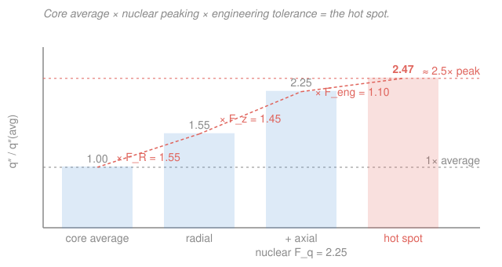

# Reactor Thermal-Hydraulics · Lesson 1.5: Hot-channel and hot-spot factors

> ⏱ ~15 min · Module 1: Core power and conduction in the fuel · Builds on: [1.1 Power distribution and the volumetric source](01-01-power-distribution-volumetric-source.md), [1.4 Axial temperature profile of a channel](01-04-axial-temperature-profile-channel.md) · Unlocks: Module 2–3 thermal limits, all four Boss problems

## Why this matters

A reactor core has tens of thousands of fuel pins, and safety analysis cares about exactly one of them: the hottest. Melt one pin, or dry out one channel, and you have a fuel-failure event — no matter how comfortable the other 50,000 pins are. So a design cannot be built on the core *average* linear rating or the core *average* coolant temperature rise. It must be built on the worst local value those averages hide. **Hot-channel and hot-spot factors** are the bookkeeping that gets you from the average — which is easy to compute from total power ([1.1](01-01-power-distribution-volumetric-source.md)) — to the limiting local condition that every thermal margin in Modules 2–4 is actually written against.

## The idea

Two averages get inflated, and they get inflated by different things.

The first is the **coolant temperature rise**. Some channels sit under high-power fuel and heat their water more than the average channel does. The factor that captures this is the **enthalpy-rise factor** $F_{\Delta H}$: multiply the core-average coolant temperature rise by it and you get the rise in the hottest *channel*. This is the number that decides whether the coolant stays subcooled or starts to boil.

The second is the **local heat flux** — how hard a single spot on a single pin is pushing heat through its cladding. This peaks not just because a pin sits in a high-power region, but also because of *where* along that pin you look (the axial cosine, [1.4](01-04-axial-temperature-profile-channel.md)) and small local effects like a fuel-pellet gap or a water-hole next door. The factor here is the **heat-flux factor** $F_q$: multiply the core-average heat flux by it and you get the peak local flux, which sets the peak clad and fuel temperatures.

And then reality adds a second layer on top of the neutronics. Pellets are not all exactly the design density; enrichment varies within tolerance; channels are not machined to exactly the nominal flow area. Every one of those manufacturing tolerances nudges the local condition a little worse. Those **engineering subfactors** multiply the nuclear factors to give the true worst case — the **hot spot**.

The picture to hold: start at the average, take a step up for radial peaking, another for axial peaking, another for engineering tolerances, and you land on the spot the limits apply to.

## The formal version

Every hot-channel factor is a ratio of a *local* (or hot-channel) quantity to its *core-average* value — a pure, dimensionless number $\ge 1$.

**Nuclear (power-peaking) factors.** These come straight from the neutron flux shape ([1.1](01-01-power-distribution-volumetric-source.md)). Write the peak local heat flux as the average times three peaking factors:

$$F_q^N = F_R \cdot F_z \cdot F_{local}.$$

- $F_R$ — **radial** factor: the ratio of the hottest pin's power to the core-average pin power (dimensionless).
- $F_z$ — **axial** factor: the peak-to-average of the axial power shape. For a pure cosine over active length $L_e$ with no extrapolation it is $F_z=\pi/2\approx1.57$; flattening by burnup and control brings it down.
- $F_{local}$ — **local** factor: fine structure the coarse radial/axial picture misses (a gap between pellets, a guide tube next door), dimensionless.

*In words: the peak heat flux anywhere in the core is the average flux blown up by how hot the worst pin is, times how peaked the axial shape is, times local wrinkles.* This $F_q$ is the **heat-flux hot-channel factor** — it governs the peak local flux $q''$, hence the peak clad-surface and fuel-centerline temperatures.

The **enthalpy-rise factor** looks similar but is built from an *integral* up the channel:

$$F_{\Delta H} = \frac{\displaystyle\int_0^{L} q'_{\text{hot}}(z)\,dz}{\displaystyle\int_0^{L} q'_{\text{avg}}(z)\,dz} = \frac{(\Delta h)_{\text{hot channel}}}{(\Delta h)_{\text{avg channel}}}.$$

*In words: how much more enthalpy the hot channel picks up over its whole length than the average channel does.* Because it integrates power over the entire channel, **the axial shape averages out** — $F_{\Delta H}$ carries only the radial and local peaking, not $F_z$. That is exactly why $F_{\Delta H} < F_q$: the heat-flux factor keeps the axial peak, the enthalpy-rise factor spends it. With equal coolant flow per channel and roughly constant $c_p$, $F_{\Delta H}$ multiplies the coolant temperature rise:

$$(\Delta T)_{\text{hot channel}} = F_{\Delta H}\,(\Delta T)_{\text{avg channel}}.$$

**Engineering (uncertainty) subfactors.** Each manufacturing tolerance contributes a subfactor $F_i \ge 1$ — pellet density $F_{\rho}$, enrichment $F_e$, fuel/clad dimensions $F_{d}$, channel flow area $F_A$, and so on. They combine in one of two ways:

$$\underbrace{F^E = \prod_i F_i}_{\text{multiplicative (deterministic)}} \qquad\text{or}\qquad \underbrace{F^E = 1 + \sqrt{\textstyle\sum_i (F_i-1)^2}}_{\text{statistical (root-sum-square)}}.$$

*In words: either assume every tolerance hits its worst value at the same spot at once (product), or treat them as independent random errors that rarely all peak together (RSS).* The multiplicative form is conservative; the RSS form is defensible when the subfactors are genuinely independent, and it recovers real margin.

The **total hot-spot factor** is nuclear times engineering:

$$\boxed{\,F_q^{\text{total}} = F_q^N \cdot F_q^E, \qquad F_{\Delta H}^{\text{total}} = F_{\Delta H}^N \cdot F_{\Delta H}^E.\,}$$

This is the machine that turns a core-average $q'$ into the design-limiting peak.

## Picture

## Worked examples

**Example 1 (average → hot channel, both factors).** A PWR runs with coolant inlet 290 °C and a **core-average** outlet of 323 °C, so the average temperature rise is $(\Delta T)_{\text{avg}} = 33\ \mathrm{K}$. The **core-average** heat flux is $q''_{\text{avg}} = 0.60\ \mathrm{MW/m^2}$. Design factors are $F_{\Delta H} = 1.55$ and $F_q = 2.5$.

*Coolant side (uses $F_{\Delta H}$).* The hot channel's rise is

$$(\Delta T)_{\text{hot}} = F_{\Delta H}\,(\Delta T)_{\text{avg}} = 1.55 \times 33\ \mathrm{K} = 51.2\ \mathrm{K},$$

so the hot-channel outlet is $290 + 51.2 = 341.2\ \mathrm{°C}$. Against $T_{\text{sat}}(15.5\ \mathrm{MPa}) \approx 345\ \mathrm{°C}$, that leaves only about $4\ \mathrm{K}$ of subcooling at the hot-channel exit — precisely the margin $F_{\Delta H}$ exists to protect.

*Wall side (uses $F_q$).* The peak local flux is

$$q''_{\text{peak}} = F_q\,q''_{\text{avg}} = 2.5 \times 0.60 = 1.50\ \mathrm{MW/m^2}.$$

This peak — not the average — is what later gets compared to the critical heat flux (Module 3) and what drives the peak clad temperature through the film and resistance chain ([1.3](01-03-gap-cladding-resistances.md)).

*Check.* Both factors are dimensionless, so units pass through untouched (K stays K, MW/m² stays MW/m²). Sanity: $F_{\Delta H}=1.55 < F_q=2.5$ as it must — the heat-flux factor carries the extra axial peaking the enthalpy-rise factor integrates away. ✓

**Example 2 (folding in engineering tolerances).** The nuclear heat-flux factor is $F_q^N = 2.5$. Three engineering subfactors apply at the hot spot: pellet density $1.03$, enrichment $1.05$, and flow-area/geometry $1.02$.

*Multiplicative (deterministic).*

$$F_q^E = 1.03 \times 1.05 \times 1.02 = 1.103, \qquad F_q^{\text{total}} = 2.5 \times 1.103 = 2.76.$$

*Statistical (root-sum-square).*

$$F_q^E = 1 + \sqrt{0.03^2 + 0.05^2 + 0.02^2} = 1 + \sqrt{0.0038} = 1.062, \qquad F_q^{\text{total}} = 2.5 \times 1.062 = 2.65.$$

The multiplicative total ($2.76$) is about $4\%$ higher than the statistical total ($2.65$). The difference is the coincidence assumption: multiplication assumes the worst pellet, the worst enrichment, and the worst channel all land on the very same pin at the very same elevation; RSS says three independent tolerances almost never max out together. Modern designs typically combine engineering subfactors statistically while keeping the nuclear factors deterministic.

*Check.* $F_q^E \ge 1$ both ways ✓, and RSS $\le$ product always (since $\sqrt{\sum a_i^2} \le \sum a_i$ for $a_i \ge 0$), so the statistical route can only recover margin, never invent it. ✓

## Watch out

- **You might think "hot channel" and "hot spot" are the same place.** They are governed by different factors *and* sit at different elevations. $F_{\Delta H}$ governs the hottest *channel* — an integrated, coolant-enthalpy quantity whose worst point is near the channel *exit*. $F_q$ governs the hottest *spot* — a local flux whose worst point is near the axial power peak. As [1.4](01-04-axial-temperature-profile-channel.md) showed, peak coolant temperature, peak clad temperature, and peak flux all occur at *different* heights.
- **You might think $F_{\Delta H}$ should include the axial factor $F_z$ like $F_q$ does.** It must not. $F_{\Delta H}$ is an integral of power over the whole channel, so the axial cosine averages out and only radial + local peaking survive. $F_q$ is a *local* value and keeps the full axial peak. This is the entire reason $F_q > F_{\Delta H}$; sneaking $F_z$ into $F_{\Delta H}$ double-counts it.
- **You might think multiplying every subfactor is the "more correct" answer.** It is more *conservative*, not more accurate. Multiplication models a coincidence (all tolerances worst, same place, same time) that independent random errors essentially never produce. RSS is the honest statistical treatment when the subfactors are genuinely uncorrelated.

## One-liner

> The core is judged by its hottest pin: multiply the average by nuclear peaking — $F_{\Delta H}$ for the coolant rise, $F_q = F_R F_z F_{local}$ for the local flux — then by engineering tolerances, to reach the hot spot the limits are written against.

## Problems

**P1 (🟢)** A core has a core-average linear rating $q'_{\text{avg}} = 17.8\ \mathrm{kW/m}$ and a core-average coolant temperature rise of $34\ \mathrm{K}$ (inlet $291\ \mathrm{°C}$). Design factors are $F_q = 2.6$ and $F_{\Delta H} = 1.60$. Find (a) the peak linear rating and (b) the hot-channel outlet temperature. Comment on the margin to $T_{\text{sat}}(15.5\ \mathrm{MPa}) \approx 345\ \mathrm{°C}$.

**P2 (🟡)** Three engineering subfactors apply to a heat-flux hot spot: $1.04$, $1.06$, $1.03$. The nuclear factor is $F_q^N = 2.4$. Compute the engineering factor and the total $F_q$ both multiplicatively and by root-sum-square. Which total is larger, and why is that the conservative choice?

**P3 (🔴)** A design quotes $F_q^N = 2.50$ and $F_{\Delta H}^N = 1.55$. Treating $F_{\Delta H}$ as carrying the radial+local peaking and $F_q$ as that same peaking times the axial factor, extract the implied axial factor $F_z$. Is it physically reasonable for a partially flattened cosine? Explain in one sentence why $F_{\Delta H}$ does not itself contain $F_z$.

Solutions

**P1** (a) Peak linear rating scales with $F_q$:

$$q'_{\text{peak}} = F_q\,q'_{\text{avg}} = 2.6 \times 17.8 = 46.3\ \mathrm{kW/m}.$$

(b) Hot-channel rise scales with $F_{\Delta H}$:

$$(\Delta T)_{\text{hot}} = 1.60 \times 34 = 54.4\ \mathrm{K}, \qquad T_{\text{out,hot}} = 291 + 54.4 = 345.4\ \mathrm{°C}.$$

That is essentially *at* the saturation temperature — the hot channel has run out of subcooling margin and would begin to boil at its exit. A real design would trim $F_{\Delta H}$ (flatter radial power) or raise coolant flow to buy that margin back.

*Check.* Both factors dimensionless; $q'$ in kW/m, $\Delta T$ in K ✓. $q'_{\text{peak}} > q'_{\text{avg}}$ and $T_{\text{out,hot}} > T_{\text{out,avg}} = 325\ \mathrm{°C}$ ✓.

**P2** Multiplicative:

$$F_q^E = 1.04 \times 1.06 \times 1.03 = 1.135, \qquad F_q^{\text{total}} = 2.4 \times 1.135 = 2.72.$$

Root-sum-square:

$$F_q^E = 1 + \sqrt{0.04^2 + 0.06^2 + 0.03^2} = 1 + \sqrt{0.0061} = 1.078, \qquad F_q^{\text{total}} = 2.4 \times 1.078 = 2.59.$$

The multiplicative total ($2.72$) is larger. It is conservative because it assumes all three tolerances hit their worst value simultaneously at the same location; RSS treats them as independent, so their joint worst case is far less likely and the effective factor is smaller.

*Check.* $\sqrt{\sum a_i^2} = 0.078 \le \sum a_i = 0.13$, so RSS $\le$ product, consistent ✓.

**P3** If $F_{\Delta H}$ carries radial+local and $F_q = (\text{radial+local}) \times F_z$, then

$$F_z = \frac{F_q^N}{F_{\Delta H}^N} = \frac{2.50}{1.55} = 1.61.$$

An axial factor of $1.61$ is just above the ideal-cosine value $\pi/2 \approx 1.57$, so it is physically reasonable — a lightly peaked, near-cosine axial shape. $F_{\Delta H}$ does not contain $F_z$ because it is an *integral of power over the whole channel length*, and integrating the axial shape replaces its peak with its average, leaving only radial and local peaking.

*Check.* $F_z = 1.61 \ge 1$ and comparable to $\pi/2$ ✓; consistent with $F_q > F_{\Delta H}$ ✓.

## Flashback

**From Lesson 1.4 (Axial temperature profile of a channel):** A coolant channel carries $\dot m = 0.30\ \mathrm{kg/s}$ of water with $c_p = 5.4\ \mathrm{kJ/(kg\cdot K)}$. Its total thermal power (the integral of $q'(z)$ over the active length) is $66\ \mathrm{kW}$. If the coolant enters at $290\ \mathrm{°C}$, what is its bulk outlet temperature? (Fresh variant — no peaking factors involved.)

Solution

Steady energy balance on the channel: all the power deposited goes into raising the coolant enthalpy, $\dot m c_p\,\Delta T = Q$. So

$$\Delta T = \frac{Q}{\dot m c_p} = \frac{66\,000\ \mathrm{W}}{0.30\ \mathrm{kg/s} \times 5400\ \mathrm{J/(kg\cdot K)}} = \frac{66\,000}{1620} = 40.7\ \mathrm{K},$$

giving $T_{\text{out}} = 290 + 40.7 = 330.7\ \mathrm{°C}$.

*Check.* Units: $\mathrm{W}/(\mathrm{kg/s}\cdot\mathrm{J/(kg\cdot K)}) = \mathrm{W}/(\mathrm{W/K}) = \mathrm{K}$ ✓. A $\sim41\ \mathrm{K}$ rise is a typical PWR channel value, and this is a core-*average*-style channel — multiply by $F_{\Delta H}$ (this lesson) to get the hot channel. ✓

## Connections

- **Backward:** the three nuclear factors are exactly the radial, axial (cosine), and local peaking of the flux from [1.1](01-01-power-distribution-volumetric-source.md), repackaged as design multipliers. The peak flux $F_q\,q''_{\text{avg}}$ becomes peak temperatures through the fuel–gap–clad resistance chain of [1.2](01-02-conduction-heat-source-fuel-pin.md)–[1.3](01-03-gap-cladding-resistances.md), and the "different peaks at different elevations" point is [1.4](01-04-axial-temperature-profile-channel.md)'s.
- **Forward:** every thermal limit downstream is written against the *hot* condition. [2.1](02-01-coolant-energy-balance-bulk-temperature.md) closes the energy balance on the hot channel via $F_{\Delta H}$; [2.2](02-02-convective-heat-transfer-film-drop.md) and [2.4](02-04-full-radial-temperature-drop.md) push the peak flux $F_q\,q''_{\text{avg}}$ through the film to the peak clad temperature; Module 3's [CHF/DNBR](03-06-critical-heat-flux-dnb.md) compares that peak flux to the boiling limit. All four [Boss problems](../syllabus.md) operate on the hottest pin, not the average one.
- **Sideways:** the engineering subfactors are fed by the materials tolerances of [`nuclear-materials` 3.1 (UO₂ pellet density)](../../nuclear-materials/lessons/03-01-uo2-ceramic-fuel.md) and [4.1 (Zircaloy cladding dimensions)](../../nuclear-materials/lessons/04-01-zirconium-alloys-cladding.md); the flux shape behind the nuclear factors is the neutronics of the [`reactor-physics` course](../../reactor-physics/syllabus.md). The multiplicative-vs-RSS choice is the same independent-error-propagation-in-quadrature you meet anywhere uncertainties combine: correlated errors add, independent ones add in quadrature.
