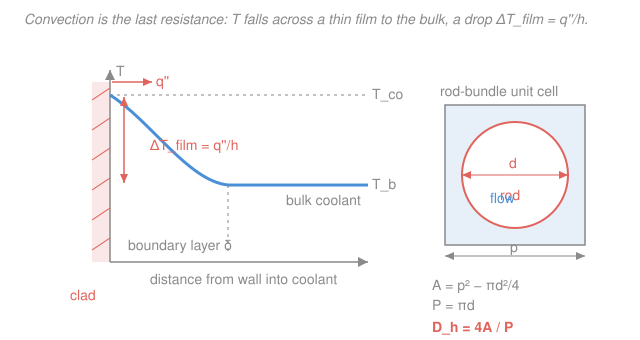

# Reactor Thermal-Hydraulics · Lesson 2.2: Convective heat transfer and the film drop

> ⏱ ~15 min · Module 2: Single-phase convection and flow · Builds on: [2.1 Coolant energy balance](02-01-coolant-energy-balance-bulk-temperature.md), [`heat-transfer` 3.4 internal forced convection](../../heat-transfer/lessons/03-04-internal-forced-convection.md), [`fluid-dynamics` 3.1 Reynolds number](../../fluid-dynamics/lessons/03-01-reynolds-number.md) · Unlocks: 2.3 (correlations across coolants), 2.4 (full radial drop), Boss problem 2

## Why this matters

In [2.1](02-01-coolant-energy-balance-bulk-temperature.md) you found the coolant's *bulk* temperature $T_b$ — the mixed-mean value you'd measure by catching all the flow in a cup. But the fuel doesn't see the bulk. It sees the fluid *touching the clad*, which is hotter, because heat has to shove its way across a thin, sluggish layer of coolant clinging to the wall. That last shove is **convection**, and the temperature penalty it costs — the **film drop** $\Delta T_{film}$ — is the final link in the fuel→coolant chain. Get it wrong and every temperature upstream (clad, gap, fuel centerline) is wrong too. Get it right and you'll see why, for pressurized water, this is usually the *smallest* of the four resistances — yet the one place where the whole reactor's safety margin (critical heat flux, Module 3) is spent.

## The idea

Right at the wall the coolant isn't moving — it sticks (the no-slip condition). A little farther out it's ripping past at full speed. In between sits a thin **thermal boundary layer** where the fluid is nearly stagnant, and stagnant fluid is a poor conductor. So heat leaving the clad has to *conduct* across this lazy film before the fast-moving bulk can sweep it away. That crossing costs a temperature difference: the wall runs hotter than the bulk by exactly enough to push the heat through.

The engineering trick is to hide all the messy fluid physics inside one number, the **heat transfer coefficient** $h$. Big $h$ means a thin, easily-crossed film (fast, turbulent flow); small $h$ means a thick, insulating one. Then the wall-to-bulk drop is just heat flux divided by $h$ — the same "flow = driving force / resistance" bookkeeping as Ohm's law, with $1/h$ playing the resistor. The only real work left is *estimating* $h$, and that's what the Nusselt number and the Dittus–Boelter correlation do for us.

## The formal version

**Newton's law of cooling.** The heat flux $q''$ (in $\mathrm{W/m^2}$) leaving the clad outer surface at temperature $T_{co}$ (°C) into coolant at bulk temperature $T_b$ (°C) is

$$q'' = h\,(T_{co} - T_b) \qquad\Longrightarrow\qquad \boxed{\;\Delta T_{film} = \frac{q''}{h}\;}$$

where $h$ is the **convective heat transfer coefficient** ($\mathrm{W/(m^2\cdot K)}$). *In words: the wall sits above the bulk by an amount equal to how hard you're pushing heat ($q''$) divided by how easily the flow carries it ($h$).* This is the convection resistance from the [fuel–gap–clad–coolant chain](../../heat-transfer/lessons/01-04-thermal-resistance-networks.md); per unit length it reads $R'_{conv} = 1/(2\pi r_{co} h)$, the last term in $q' = \Delta T_{total}/\sum R'$.

**Getting $h$: the Nusselt number.** We don't measure $h$ directly; we get it from a dimensionless group, the **Nusselt number**

$$Nu = \frac{h\,D_h}{k},$$

with $k$ the coolant's thermal conductivity ($\mathrm{W/(m\cdot K)}$) and $D_h$ a characteristic length. *In words: $Nu$ is the ratio of actual (convective) heat transfer to what pure conduction across the same gap would give* — $Nu=1$ would mean the flow does nothing; turbulent water runs $Nu\sim 500$–$1000$.

**Hydraulic diameter.** A reactor channel is not a round pipe — it's the gap *between* fuel rods. To reuse pipe correlations we define an equivalent diameter from the flow geometry:

$$D_h = \frac{4\,A_{flow}}{P_{wetted}},$$

$A_{flow}$ = cross-sectional area open to flow ($\mathrm{m^2}$), $P_{wetted}$ = perimeter the fluid touches ($\mathrm{m}$). *In words: fat, open channels have a big $D_h$; tight ones a small one.* (For a round pipe this correctly returns $D_h = 4(\pi D^2/4)/(\pi D) = D$.)

**The correlation.** $h$ depends on how turbulent the flow is and how the fluid distributes heat, captured by two more groups — the **Reynolds number** $Re = GD_h/\mu$ (inertia vs. viscosity; $G=\dot m/A_{flow}$ is the mass flux in $\mathrm{kg/(m^2\cdot s)}$, $\mu$ the dynamic viscosity in $\mathrm{Pa\cdot s}$) and the **Prandtl number** $Pr = \mu c_p/k$ (how momentum diffuses vs. heat). For turbulent flow of an ordinary fluid ($Re \gtrsim 10^4$, $0.6 \lesssim Pr \lesssim 160$), the workhorse is **Dittus–Boelter**:

$$Nu = 0.023\,Re^{0.8}\,Pr^{0.4} \quad (\text{heating; use }Pr^{0.3}\text{ for cooling}).$$

*In words: crank up the flow ($Re$) and $h$ climbs, but sub-linearly (the $0.8$ power).* This is the same correlation you derived for pipes in [`heat-transfer` 3.4](../../heat-transfer/lessons/03-04-internal-forced-convection.md); we just feed it $D_h$ instead of a pipe diameter. Rod bundles pack differently from a round tube, so subchannel work bumps the leading constant — the **Weisman** correction multiplies $Nu$ by $\psi = 1.826\,(p/d) - 1.0430$ for a square array (about $+38\%$ at $p/d=1.33$), which we'll fold in properly in [2.3](02-03-correlations-across-coolants.md). Dittus–Boelter alone is close enough to see the physics.

## Picture

## Worked examples

**Example 1 (mechanical — hydraulic diameter of a rod array).** A PWR uses a square-pitch lattice: clad outer diameter $d = 9.5\,\mathrm{mm}$, rod-center-to-rod-center pitch $p = 12.6\,\mathrm{mm}$. The unit cell is one square of side $p$ with one rod's worth of metal ($\pi d^2/4$) removed. One rod's wetted perimeter is its full circumference $\pi d$. So

$$A_{flow} = p^2 - \frac{\pi d^2}{4} = (0.0126)^2 - \frac{\pi(0.0095)^2}{4} = 1.588\times10^{-4} - 0.709\times10^{-4} = 8.79\times10^{-5}\,\mathrm{m^2},$$

$$P_{wetted} = \pi d = \pi(0.0095) = 0.02985\,\mathrm{m},$$

$$D_h = \frac{4A_{flow}}{P_{wetted}} = \frac{4(8.79\times10^{-5})}{0.02985} = 0.0118\,\mathrm{m} \approx 11.8\,\mathrm{mm}.$$

*Sanity check.* Units: $\mathrm{m^2/m = m}$ ✓. The result is close to the *rod* diameter (9.5 mm) — reasonable for a tight lattice where the flow gap is comparable to the rod. Note $D_h$ ($11.8\,\mathrm{mm}$) exceeds the rod-to-rod gap ($p-d = 3.1\,\mathrm{mm}$): $D_h$ is an *area-to-perimeter* measure, not a literal spacing.

**Example 2 (why you'd care — the film drop, Boss problem 2 in miniature).** Take the same lattice, water at the pinned PWR conditions (~300 °C, 15.5 MPa: $k = 0.56\,\mathrm{W/(m\cdot K)}$, $\mu = 9.1\times10^{-5}\,\mathrm{Pa\cdot s}$, $Pr = 0.87$), mass flux $G = 3500\,\mathrm{kg/(m^2\cdot s)}$, at a channel node running a local linear power $q' = 20\,\mathrm{kW/m}$.

*Step 1 — Reynolds number.*

$$Re = \frac{G D_h}{\mu} = \frac{3500 \times 0.0118}{9.1\times10^{-5}} = 4.5\times10^{5}.$$

Far above $10^4$ — fully turbulent, so Dittus–Boelter applies.

*Step 2 — Nusselt, then $h$.*

$$Nu = 0.023\,Re^{0.8}Pr^{0.4} = 0.023\,(4.5\times10^5)^{0.8}(0.87)^{0.4} = 0.023 \times 3.35\times10^4 \times 0.946 \approx 729.$$

$$h = \frac{Nu\,k}{D_h} = \frac{729 \times 0.56}{0.0118} \approx 3.5\times10^{4}\,\mathrm{W/(m^2\cdot K)}.$$

*Step 3 — heat flux, then the film drop.* The clad-surface flux is the linear power spread over the rod circumference:

$$q'' = \frac{q'}{\pi d} = \frac{20{,}000}{\pi(0.0095)} = 6.7\times10^{5}\,\mathrm{W/m^2} = 0.67\,\mathrm{MW/m^2},$$

$$\Delta T_{film} = \frac{q''}{h} = \frac{6.7\times10^5}{3.5\times10^4} \approx 19\,\mathrm{K}.$$

*Sanity check.* Units: $(\mathrm{W/m^2})/(\mathrm{W/(m^2 K)}) = \mathrm{K}$ ✓. About 19 K — modest, as promised, and it scales *linearly* with $q'$, so the true peak node (~40 kW/m from Boss 1) roughly doubles it to ~40 K. Compare the fuel-centerline drop at the same $q'$: $\Delta T_{fuel} = q'/(4\pi k_f) = 20{,}000/(4\pi\cdot 3) \approx 530\,\mathrm{K}$. The film is the *smallest* step in the whole chain — one part in thirty — precisely because water's $h$ is so large.

## Watch out

- **You might think a bigger $h$ means the coolant is doing more work.** It's the opposite framing that matters: big $h$ means a *smaller* $\Delta T_{film}$ for the same duty. $h$ is a conductance; its inverse $1/h$ is the resistance you're trying to shrink. Turbulence and high flow shrink the film and raise $h$ — that's why reactors run at ferocious mass fluxes.
- **You might plug a pipe diameter into $Re$ and $Nu$ for a rod bundle.** Both groups use the *hydraulic* diameter $D_h = 4A_{flow}/P_{wetted}$, computed from the actual flow-and-wetted geometry — never the rod diameter or the pitch directly. Mixing them up throws $Re$, $Nu$, and $h$ off by tens of percent.
- **You might think the small film drop makes convection unimportant.** It's the smallest resistance *right up until it isn't*. If the flux climbs past the critical heat flux (Module 3), the wall dries out, $h$ collapses, and $\Delta T_{film}$ jumps by hundreds of degrees in an instant. The film is small but it is the safety-limiting link — that's the whole reason we obsess over it.

## One-liner

> The last resistance from fuel to coolant is a thin clinging film; its temperature toll is $\Delta T_{film}=q''/h$, and you get $h$ from $Nu = 0.023\,Re^{0.8}Pr^{0.4}$ fed the channel's hydraulic diameter.

## Problems

**P1 (🟢)** A coolant channel runs $q'' = 1.0\,\mathrm{MW/m^2}$ at the clad surface with $h = 4.0\times10^4\,\mathrm{W/(m^2\cdot K)}$. Find the film temperature drop. If the bulk temperature there is $315\,^\circ\mathrm{C}$, what is the clad outer-surface temperature $T_{co}$?

**P2 (🟡)** For a square-pitch lattice with pitch $p = 13.0\,\mathrm{mm}$ and rod diameter $d = 10.0\,\mathrm{mm}$, compute the hydraulic diameter $D_h$. Then, with water properties $k = 0.56\,\mathrm{W/(m\cdot K)}$, $\mu = 9.1\times10^{-5}\,\mathrm{Pa\cdot s}$, $Pr = 0.87$ and mass flux $G = 3800\,\mathrm{kg/(m^2\cdot s)}$, find $Re$ and the heat transfer coefficient $h$ from Dittus–Boelter.

**P3 (🔴, optional)** Doubling the mass flux $G$ (at fixed geometry and heat flux) does what to $\Delta T_{film}$? Give the factor, and explain in one sentence why it's *not* a factor of 2. (This is the lever an engineer pulls to lower peak clad temperature — Boss problem 2's final question.)

Solutions

**P1** Directly from Newton's law of cooling:

$$\Delta T_{film} = \frac{q''}{h} = \frac{1.0\times10^6}{4.0\times10^4} = 25\,\mathrm{K}.$$

The wall sits above the bulk by this drop: $T_{co} = T_b + \Delta T_{film} = 315 + 25 = 340\,^\circ\mathrm{C}$.

*Check.* Units $(\mathrm{W/m^2})/(\mathrm{W/(m^2 K)}) = \mathrm{K}$ ✓. At 15.5 MPa water boils at $T_{sat}\approx 345\,^\circ\mathrm{C}$, so $340\,^\circ\mathrm{C}$ is just barely subcooled — realistic for a hot PWR node, and a hint of why nucleate boiling ([Module 3](03-01-boiling-curve-pool-boiling-regimes.md)) starts to matter here. ✓

**P2** Hydraulic diameter first:

$$A_{flow} = p^2 - \frac{\pi d^2}{4} = (0.013)^2 - \frac{\pi(0.010)^2}{4} = 1.690\times10^{-4} - 0.785\times10^{-4} = 9.05\times10^{-5}\,\mathrm{m^2},$$

$$P_{wetted} = \pi d = \pi(0.010) = 0.03142\,\mathrm{m}, \qquad D_h = \frac{4(9.05\times10^{-5})}{0.03142} = 0.01152\,\mathrm{m} \approx 11.5\,\mathrm{mm}.$$

Reynolds and $h$:

$$Re = \frac{G D_h}{\mu} = \frac{3800\times0.01152}{9.1\times10^{-5}} = 4.81\times10^{5},$$

$$Nu = 0.023\,(4.81\times10^5)^{0.8}(0.87)^{0.4} = 0.023 \times 3.53\times10^4 \times 0.946 \approx 768,$$

$$h = \frac{Nu\,k}{D_h} = \frac{768\times0.56}{0.01152} \approx 3.7\times10^{4}\,\mathrm{W/(m^2\cdot K)}.$$

*Check.* Same ballpark as the worked example (~$3.5$–$3.7\times10^4$) — expected, since geometry and flow barely changed. Units of $h$: $(\text{dimensionless})\cdot\mathrm{(W/m\,K)/m} = \mathrm{W/(m^2 K)}$ ✓.

**P3** From $\Delta T_{film} = q''/h$ at fixed $q''$, the drop scales as $1/h$. Dittus–Boelter gives $h \propto Nu \propto Re^{0.8} \propto G^{0.8}$ (everything else held fixed). Doubling $G$ multiplies $h$ by $2^{0.8} = 1.74$, so

$$\Delta T_{film} \to \Delta T_{film}/1.74 \approx 0.57\times \text{(a }43\%\text{ reduction)}.$$

It's *not* a factor of 2 because heat transfer improves only as the $0.8$ power of flow — turbulence helps, but with diminishing returns — while the pumping power you pay for that extra flow climbs much faster (roughly $G^3$, [2.5](02-05-pressure-drop-core.md)). That trade-off is exactly why you can't just pump your way out of a hot channel.

*Check.* Exponent bookkeeping: $q''$ fixed, $h\propto G^{0.8}$, so $\Delta T \propto G^{-0.8}$; $2^{-0.8}=0.574$ ✓.

## Flashback

**From Lesson 2.1 (Coolant energy balance):** A single coolant channel carries $\dot m = 0.31\,\mathrm{kg/s}$ of water ($c_p = 5.4\,\mathrm{kJ/(kg\cdot K)}$) and removes a total thermal power of $60\,\mathrm{kW}$. If the inlet bulk temperature is $290\,^\circ\mathrm{C}$, what is the outlet bulk temperature?

Solution

Steady-state energy balance on the channel — all the heat added goes into raising the coolant's enthalpy:

$$\dot m\,c_p\,(T_{out} - T_{in}) = Q \;\Longrightarrow\; \Delta T_b = \frac{Q}{\dot m\,c_p} = \frac{60{,}000}{0.31 \times 5400} = 35.9\,\mathrm{K}.$$

$$T_{out} = 290 + 35.9 \approx 326\,^\circ\mathrm{C}.$$

*Check.* Units: $\mathrm{W}/(\mathrm{kg/s}\cdot\mathrm{J/(kg\,K)}) = \mathrm{W}/(\mathrm{W/K}) = \mathrm{K}$ ✓. A ~36 K core rise landing near 326 °C is textbook PWR, and comfortably below $T_{sat}\approx 345\,^\circ\mathrm{C}$ at 15.5 MPa — the coolant leaves hot but still liquid. This is the *bulk* $T_b$; today's lesson adds the film drop on top to reach the clad. ✓

## Connections

- **Backward:** this closes the [fuel–gap–clad–coolant resistance chain](../../heat-transfer/lessons/01-04-thermal-resistance-networks.md) — the convection term $R'_{conv} = 1/(2\pi r_{co}h)$ is the fourth and last resistor, sitting on top of the bulk temperature from [2.1](02-01-coolant-energy-balance-bulk-temperature.md). $Re$ and $Pr$ are the [`fluid-dynamics` 3.1](../../fluid-dynamics/lessons/03-01-reynolds-number.md) groups, and Dittus–Boelter is the [`heat-transfer` 3.4](../../heat-transfer/lessons/03-04-internal-forced-convection.md) pipe correlation reused with $D_h$.
- **Forward:** [2.3](02-03-correlations-across-coolants.md) swaps Dittus–Boelter for the right correlation per coolant (Weisman rod-bundle factor for water, low-$Pr$ Nusselt for liquid metal); [2.4](02-04-full-radial-temperature-drop.md) stacks this film drop with the clad, gap, and fuel drops into one bulk-to-centerline profile; and Boss problem 2 assembles outlet temperature, peak clad temperature, and pressure drop into a single margin statement.
- **Sideways:** the small, robust film drop is exactly what the [critical-heat-flux limit](03-06-critical-heat-flux-dnb.md) protects — cross that limit and $h$ collapses, so the same $q''=h\,\Delta T$ relation that gives a benign 19 K here is what produces a runaway wall temperature there. Same equation, opposite consequence.
