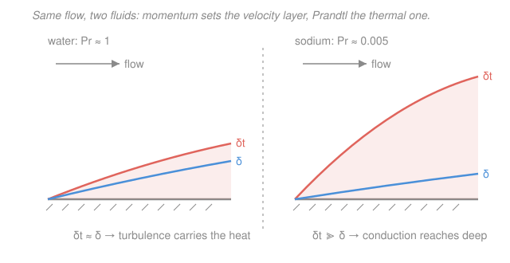

# Reactor Thermal-Hydraulics · Lesson 2.3: Correlations across coolants

> ⏱ ~15 min · Module 2: Convection & the coolant · Builds on: [2.2 convective film drop](02-02-convective-heat-transfer-film-drop.md), [2.1 coolant energy balance](02-01-coolant-energy-balance-bulk-temperature.md) · Unlocks: [2.4 full radial temperature drop](02-04-full-radial-temperature-drop.md)

## Why this matters

In 2.2 you turned a heat-transfer coefficient $h$ into a film temperature drop, and you got $h$ from Dittus–Boelter: $Nu=0.023\,Re^{0.8}Pr^{0.4}$. That correlation is a workhorse — for water. Point it at liquid sodium and it lies to you by a factor of two, in whichever direction the flow happens to push it. This lesson is about knowing which correlation the coolant actually obeys, and it explains a design fact you have already met in the [reactor zoo](../../intro-nuclear-engineering/lessons/04-05-reactor-types-nuclear-landscape.md): why fast reactors cool with a molten metal instead of water.

## The idea

Convection is a race between two boundary layers growing off the heated wall. The **momentum** (velocity) layer, thickness $\delta$, is where the fluid still feels the wall's drag. The **thermal** layer, thickness $\delta_t$, is where the fluid still feels the wall's heat. Heat transfer is good when the thermal layer is *thin* — the temperature gradient at the wall is steep, so a lot of heat crosses per degree.

The Prandtl number $Pr=\nu/\alpha$ is the ratio of how fast momentum diffuses to how fast heat diffuses. It sets the ratio of the two layers, roughly $\delta_t/\delta \sim Pr^{-1/3}$:

- **$Pr\sim1$ (water, gases):** the two layers are about the same size. Turbulent eddies stir heat and momentum together, so a single correlation form works.
- **$Pr\ll1$ (liquid metals, $Pr\approx0.005$):** heat diffuses *hundreds of times faster* than momentum. The thermal layer balloons far past the thin velocity layer — molecular conduction, not turbulence, carries most of the heat. A correlation built on turbulence (Dittus–Boelter) is solving the wrong problem.

So the correlation you reach for is chosen by $Pr$ first, geometry and flow regime second.

## The formal version

The heat-transfer coefficient always comes from a Nusselt number, $Nu=hD_h/k$, where $D_h=4A_{flow}/P_{wetted}$ is the hydraulic diameter (m), $k$ the coolant conductivity ($\mathrm{W/(m\cdot K)}$), and $h$ in $\mathrm{W/(m^2\cdot K)}$. What changes across coolants is the *formula for $Nu$*.

**Water and other $Pr\sim1$ liquids — Dittus–Boelter:**
$$Nu=0.023\,Re^{0.8}Pr^{n},\qquad n=0.4\ \text{(heating)},\ 0.3\ \text{(cooling)}$$
with $Re=GD_h/\mu$ and mass flux $G=\dot m/A_{flow}$ ($\mathrm{kg/(m^2 s)}$). *In words:* more turbulence (higher $Re$) and stiffer heat diffusion relative to momentum both raise $Nu$. Two one-line fixes worth knowing:

- **Entrance length:** the correlation is for fully developed flow. Near the inlet, over $z\lesssim (10\text{–}60)\,D_h$, $Nu$ is higher (the boundary layer is still thin). In rod bundles this stretch is short compared to the core, so it is usually ignored.
- **Property variation (Sieder–Tate):** near a hot wall the fluid is less viscous than in the bulk, thinning the layer. Multiply by $(\mu_b/\mu_w)^{0.14}$ — bulk viscosity over wall viscosity — a $\sim5\%$ correction for water, larger for oils.

**Gases (He, CO$_2$; $Pr\approx0.7$):** same turbulent form applies — Dittus–Boelter or Sieder–Tate work. The catch is not the correlation but the density: a gas is $\sim10^3\times$ thinner than water, so to remove the same power ($\dot m c_p\,\Delta T$, from [2.1](02-01-coolant-energy-balance-bulk-temperature.md)) you need enormous velocity, and $\Delta p_f\propto G^2$ (Lesson 2.5) makes pumping expensive. Gas-cooled reactors run at high pressure to buy back density.

**Liquid metals ($Pr\ll1$) — a Péclet-number correlation:**
$$Nu=C+D\,Pe^{m},\qquad Pe=Re\,Pr$$
The **Péclet number** $Pe=Re\,Pr=GD_h c_p/k$ is the ratio of advected to conducted heat — the right variable when conduction matters. A standard constant-heat-flux fit (Lyon–Martinelli) is
$$\boxed{Nu=7+0.025\,Pe^{0.8}}$$
*In words:* even at zero flow the fluid still conducts, so $Nu$ never falls below a floor near $7$; the flow adds only a weak $Pe^{0.8}$ trim. For rod bundles a bundle-specific fit is used instead (e.g. $Nu=4.82+0.0185\,Pe^{0.827}$), but the shape — **constant plus a small power of $Pe$** — is the signature of a low-$Pr$ coolant. That floor is why liquid metals give a huge $h$ even at low flow, and why a fast reactor can cool a tightly packed, undermoderated core with sodium.

## Picture

Left, water: the thermal layer (coral) barely outruns the velocity layer (blue), so the turbulent stirring that sets $\delta$ also sets heat transfer. Right, sodium: the velocity layer stays thin while the thermal layer reaches deep into the channel — heat is delivered by conduction across that whole thick layer, a mechanism turbulence-based correlations don't describe.

## Worked examples

### Example 1 — Sodium channel: compute $h$, and see why it dwarfs water

A fast-reactor sub-channel carries liquid sodium at $\sim400\,^\circ\mathrm{C}$: $\rho=856\,\mathrm{kg/m^3}$, $c_p=1275\,\mathrm{J/(kg\cdot K)}$, $k=71\,\mathrm{W/(m\cdot K)}$, $\mu=2.87\times10^{-4}\,\mathrm{Pa\cdot s}$. Hydraulic diameter $D_h=3.0\,\mathrm{mm}$ (tight triangular pin lattice), mass flux giving $Re=5.0\times10^4$.

**Prandtl:** $Pr=\dfrac{\mu c_p}{k}=\dfrac{(2.87\times10^{-4})(1275)}{71}=\dfrac{0.366}{71}=5.2\times10^{-3}$. This is the $Pr\ll1$ regime — go to the Péclet form.

**Péclet:** $Pe=Re\,Pr=(5.0\times10^4)(5.2\times10^{-3})=2.6\times10^{2}\approx260$.

**Nusselt (Lyon–Martinelli):**
$$Nu=7+0.025\,Pe^{0.8}=7+0.025\,(260)^{0.8}=7+0.025(85.5)=7+2.14=9.1.$$

**Coefficient:** $h=\dfrac{Nu\,k}{D_h}=\dfrac{(9.1)(71)}{0.003}=\dfrac{646}{0.003}\approx2.2\times10^{5}\,\mathrm{W/(m^2\cdot K)}.$

Now compare to water *in the same geometry and same $Re$*. Water ($Pr=0.87$, $k=0.56$) gives Dittus–Boelter $Nu=0.023(5.0\times10^4)^{0.8}(0.87)^{0.4}=0.023(5738)(0.946)\approx125$ — fourteen times sodium's Nusselt number. Yet
$$h_{water}=\frac{(125)(0.56)}{0.003}\approx2.3\times10^{4}\,\mathrm{W/(m^2\cdot K)},$$
about **one-tenth** of sodium's $h$. The reversal is entirely in $k$: sodium conducts $71/0.56\approx127\times$ better, and $h\propto Nu\,k$, so $127/14\approx9$ in sodium's favor. **A low $Nu$ times a huge $k$ still wins.** *Units check:* $[Nu][k]/[D_h]=(1)(\mathrm{W/m\,K})/\mathrm{m}=\mathrm{W/(m^2K)}$. ✓ Sanity: liquid-metal $h\sim10^5$ is textbook, and it means the film drop $q''/h$ across sodium is nearly negligible.

### Example 2 — Why Dittus–Boelter is the wrong tool for sodium

Take the *same* sodium channel and blindly apply Dittus–Boelter. With $Pr^{0.4}=(0.0052)^{0.4}=0.121$:
$$Nu_{DB}=0.023(5.0\times10^4)^{0.8}(0.0052)^{0.4}=0.023(5738)(0.121)=16.0.$$
Against the physically-grounded $Nu=9.1$ from Example 1, Dittus–Boelter is **75% too high** here — it would tell you the fuel is far better cooled than it is (non-conservative).

The deeper failure is the *shape*. Dittus–Boelter scales as $Re^{0.8}$ with no floor, so as flow drops it collapses toward zero. Cut the flow to $Re=1.0\times10^4$:
$$Nu_{DB}=0.023(1.0\times10^4)^{0.8}(0.121)=0.023(1585)(0.121)=4.4,$$
while the Péclet form gives $Nu=7+0.025(52)^{0.8}=7+0.025(23)=7.6$. Now Dittus–Boelter has fallen *below the conduction floor of 7* — it predicts the metal stops carrying heat when in reality it never does. That $+7$ is exactly the heat the thick thermal boundary layer conducts regardless of flow. Dittus–Boelter has no valid regime at $Pr\ll1$: it errs high at power, low at reduced flow, and only the $C+D\,Pe^m$ form tracks the truth. *Sanity:* the two forms cross near $Pe\sim400$; away from that crossing the disagreement only grows, so there is no "close enough" fudge for a liquid metal.

## Watch out

- **You might think a low $Nu$ means poor cooling — but** $h=Nu\,k/D_h$, and for liquid metals the enormous $k$ more than compensates. Judge the coolant by $h$, never by $Nu$ alone.
- **You might think plugging $Pr=0.005$ into Dittus–Boelter is "conservative because $Nu$ comes out small" — but** at operating $Re$ it comes out *too large*, over-predicting $h$; at low flow it under-predicts. It is simply wrong, not safely wrong.
- **You might match a correlation by fluid alone — but** geometry and regime matter too: $Nu=7+0.025Pe^{0.8}$ is a circular-tube/parallel-plate fit at constant $q''$; a rod bundle uses a bundle-specific constant, and the constant-wall-temperature version drops the floor from $7$ to $\approx5$. Match the correlation to pipe-vs-bundle, turbulent-vs-laminar, and the $Pr$ range all three.

## One-liner

> Let the Prandtl number pick the correlation: $Pr\sim1$ → Dittus–Boelter's $0.023\,Re^{0.8}Pr^{0.4}$; $Pr\ll1$ → a Péclet floor-plus-trim $C+D\,Pe^{0.8}$, because in a liquid metal conduction, not turbulence, delivers the heat.

## Problems

**P1 (🟢)** A helium-cooled channel runs at $Pr=0.66$, $Re=4.0\times10^4$, $k=0.30\,\mathrm{W/(m\cdot K)}$, $D_h=6.0\,\mathrm{mm}$. Which correlation applies, and what is $h$?

**P2 (🟡)** Lead-bismuth eutectic (LBE) in a channel: $Pr=0.025$, $Re=8.0\times10^4$, $k=13\,\mathrm{W/(m\cdot K)}$, $D_h=4.0\,\mathrm{mm}$. Use $Nu=7+0.025\,Pe^{0.8}$ to get $h$. Then compute what Dittus–Boelter ($n=0.4$) would have predicted and state the percentage error.

**P3 (🔴, optional)** For the sodium channel of Example 1 ($Pr=0.0052$), find the Péclet number at which Dittus–Boelter and $Nu=7+0.025\,Pe^{0.8}$ give the *same* $Nu$. (Hint: write both as functions of $Pe$ using $Re=Pe/Pr$, then solve numerically.)

Solutions

**P1** $Pr=0.66$ is order-1 (a gas), so Dittus–Boelter applies.
$$Nu=0.023(4.0\times10^4)^{0.8}(0.66)^{0.4}.$$
$(4.0\times10^4)^{0.8}=\exp(0.8\ln 40000)=\exp(0.8\cdot10.597)=\exp(8.477)=4813.$ $(0.66)^{0.4}=\exp(0.4\ln0.66)=\exp(-0.166)=0.847.$
$Nu=0.023(4813)(0.847)=93.8.$ Then $h=Nu\,k/D_h=(93.8)(0.30)/0.006=28.1/0.006\approx4.7\times10^{3}\,\mathrm{W/(m^2K)}.$ *Check:* a gas gives $h\sim10^3$–$10^4$, far below water or metal — exactly why gas reactors need high pressure and velocity. ✓

**P2** $Pr=0.025\ll1$ → Péclet form. $Pe=Re\,Pr=(8.0\times10^4)(0.025)=2000.$
$Pe^{0.8}=\exp(0.8\ln2000)=\exp(0.8\cdot7.601)=\exp(6.081)=437.$ $Nu=7+0.025(437)=7+10.9=17.9.$
$h=Nu\,k/D_h=(17.9)(13)/0.004=232.7/0.004\approx5.8\times10^{4}\,\mathrm{W/(m^2K)}.$
Dittus–Boelter: $(8.0\times10^4)^{0.8}=\exp(0.8\ln80000)=\exp(0.8\cdot11.29)=\exp(9.032)=8378.$ $(0.025)^{0.4}=\exp(0.4\ln0.025)=\exp(-1.475)=0.229.$ $Nu_{DB}=0.023(8378)(0.229)=44.1.$
Error: $(44.1-17.9)/17.9=+146\%$ — Dittus–Boelter over-predicts $Nu$ (and $h$) by about $2.5\times$. LBE, like sodium, must use the Péclet form. ✓

**P3** Set $0.023\,Re^{0.8}Pr^{0.4}=7+0.025(Re\,Pr)^{0.8}$ with $Re=Pe/Pr$ and $Pr=0.0052$.
Left: $0.023(Pe/Pr)^{0.8}Pr^{0.4}=0.023\,Pe^{0.8}Pr^{-0.4}=0.023\,Pe^{0.8}(0.0052)^{-0.4}=0.023\,Pe^{0.8}(8.26)=0.190\,Pe^{0.8}.$
Right: $7+0.025\,Pe^{0.8}.$ So $0.190\,Pe^{0.8}-0.025\,Pe^{0.8}=7\Rightarrow0.165\,Pe^{0.8}=7\Rightarrow Pe^{0.8}=42.4\Rightarrow Pe=42.4^{1/0.8}=42.4^{1.25}.$
$42.4^{1.25}=\exp(1.25\ln42.4)=\exp(1.25\cdot3.747)=\exp(4.684)=108.$ So the two agree only near $Pe\approx1.1\times10^2$ ($Re\approx2\times10^4$). Below that Dittus–Boelter under-predicts, above it over-predicts — confirming Example 1 ($Pe=260$, DB high) and the low-flow case ($Pe=52$, DB low). There is exactly one crossing and it sits below the operating point. ✓

## Flashback

**From Lesson 2.2 (convective film drop):** A PWR fuel channel carries water with $Re=4.0\times10^5$, $Pr=0.87$, $k=0.56\,\mathrm{W/(m\cdot K)}$, $D_h=11.8\,\mathrm{mm}$. The local surface heat flux is $q''=1.0\,\mathrm{MW/m^2}$. Find the coolant-side heat-transfer coefficient and the film temperature drop $T_{wall}-T_{bulk}$.

Solution

Water, $Pr\sim1$ → Dittus–Boelter (heating, $n=0.4$):
$$Nu=0.023(4.0\times10^5)^{0.8}(0.87)^{0.4}.$$
$(4.0\times10^5)^{0.8}=\exp(0.8\ln400000)=\exp(0.8\cdot12.899)=\exp(10.319)=3.03\times10^4.$ $(0.87)^{0.4}=0.946.$
$Nu=0.023(3.03\times10^4)(0.946)=659.$
$h=Nu\,k/D_h=(659)(0.56)/0.0118=369/0.0118\approx3.1\times10^{4}\,\mathrm{W/(m^2K)}.$
Film drop (Newton's law, [2.2](02-02-convective-heat-transfer-film-drop.md)): $\Delta T_{film}=q''/h=(1.0\times10^6)/(3.1\times10^4)\approx32\,\mathrm{K}.$
*Check:* a $\sim30$ K film drop at $1\,\mathrm{MW/m^2}$ is typical for a PWR — and note the same $q''$ across sodium's $h\sim2\times10^5$ would give a film drop under $5$ K, the payoff of Example 1. ✓

## Connections

- **Backward:** this is the general form of the $h$ you took on faith in [2.2](02-02-convective-heat-transfer-film-drop.md); the underlying forced-convection physics and $Nu$–$Re$–$Pr$ scaling come from [heat-transfer 03-04](../../heat-transfer/lessons/03-04-internal-forced-convection.md), and $Re$, $D_h$, and the boundary-layer picture from [fluid-dynamics 03-01](../../fluid-dynamics/lessons/03-01-reynolds-number.md).
- **Forward:** [2.4](02-04-full-radial-temperature-drop.md) drops this $h$ into the last link of the fuel-to-coolant resistance chain, and [2.5](02-05-pressure-drop-core.md) pays the pumping bill — the $\Delta p\propto G^2$ that makes the gas-coolant velocity of this lesson so costly.
- **Sideways:** the $Pr$-sorted coolant zoo — water PWR/BWR, gas (He/CO$_2$), and liquid-metal fast reactors — is the [reactor landscape](../../intro-nuclear-engineering/lessons/04-05-reactor-types-nuclear-landscape.md); the sodium conduction floor here is the thermal reason a fast reactor's tight, undermoderated lattice is coolable at all.
