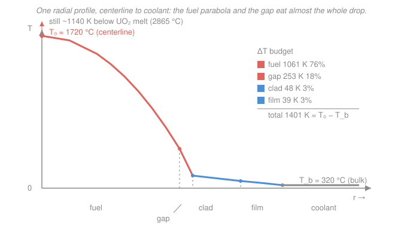

# Reactor Thermal-Hydraulics · Lesson 2.4: The full radial temperature drop

> ⏱ ~15 min · Module 2: Single-phase convection and flow · Builds on: [1.2 Conduction with a heat source](01-02-conduction-heat-source-fuel-pin.md), [1.3 Gap and cladding resistances](01-03-gap-cladding-resistances.md), [2.2 Convective film drop](02-02-convective-heat-transfer-film-drop.md) · Unlocks: Module 3 (once the wall is hot enough it boils), Boss problems

## Why this matters

Every degree between the fissioning fuel and the coolant that carries the heat away has to be *paid for* — and you now hold every piece of the bill. Lessons 1.2, 1.3, and 2.2 each priced one leg of the journey. This lesson staples them into a single ledger: the whole temperature rise from coolant bulk to fuel centerline, term by term. That one number, the fuel centerline temperature $T_0$, is what you hold up against the melt limit (~2865 °C for UO$_2$). And the clad-surface temperature — the *other* end of the same chain — is what you'll hold against the boiling and critical-heat-flux limits in Module 3. Assemble the chain once and both safety questions fall out of the same arithmetic.

The payoff isn't just a number; it's an org chart of blame. When you see that ~94% of the drop lives in the fuel and the gap, you know exactly which knob actually lowers a hot pin — and which ones are theatre.

## The idea

Picture the heat as water flowing downhill from the centerline (hottest) to the coolant (coolest). At each stage it has to squeeze through a *resistance*, and just like voltage across resistors in series, the temperature "drops" across each one in proportion to how hard that stage is to push through. Four resistances sit in series: the **fuel** the heat is born inside, the **gap** of gas between pellet and clad, the **cladding** wall, and the **film** of coolant clinging to the clad surface.

The same linear power $q'$ (watts per meter of pin) flows through all four — heat can't pile up in steady state — so the biggest temperature drop happens across the *stingiest* resistance. And UO$_2$ is a genuinely bad conductor ($k_f \approx 3\ \mathrm{W/(m\cdot K)}$, worse than stainless steel), while the gap is a thin blanket of low-conductivity gas. Those two dominate. The clad (zirconium alloy, $k_c \approx 17$) and the film (turbulent water, huge $h$) barely register. So the profile is dramatic on the inside and nearly flat on the outside: the centerline runs 1000s of degrees hot while the clad surface sits only tens of degrees above the coolant.

## The formal version

Add the four series resistances (each per unit length of pin, units K·m/W — see [1.3](01-03-gap-cladding-resistances.md) and [heat-transfer 01-04](../../heat-transfer/lessons/01-04-thermal-resistance-networks.md)). Because the same $q'$ threads all four, the total drop is $q'$ times the total resistance:

$$T_0 - T_b = \underbrace{\frac{q'}{4\pi k_f}}_{\text{fuel}} + \underbrace{\frac{q'}{2\pi r_g h_g}}_{\text{gap}} + \underbrace{\frac{q'\ln(r_{co}/r_{ci})}{2\pi k_c}}_{\text{clad}} + \underbrace{\frac{q'}{2\pi r_{co}h}}_{\text{film}}.$$

*In words: the centerline-to-coolant temperature rise is the linear power multiplied by the sum of the fuel, gap, clad, and film resistances.* The symbols, all with units:

- $q'$ — linear heat rate, W/m (heat leaving one meter of pin).
- $T_0$ — fuel centerline temperature; $T_b$ — coolant **bulk** (mixed-mean) temperature, both °C.
- $k_f$ — fuel conductivity, W/(m·K); $k_c$ — clad conductivity, W/(m·K).
- $h_g$ — gap conductance, W/(m²·K); $r_g$ — gap (≈ pellet) radius, m.
- $r_{ci}, r_{co}$ — clad inner/outer radii, m; $h$ — convective coefficient, W/(m²·K).

Two features earn a second look. **The fuel term has no radius in it** — $q'/(4\pi k_f)$ is the tidy centerline-to-surface drop for a uniform source (from [1.2](01-02-conduction-heat-source-fuel-pin.md); with temperature-dependent $k$ you'd use the integral $\frac{q'}{4\pi}=\int_{T_s}^{T_0}k\,dT$ from [nuclear-materials 03-02](../../nuclear-materials/lessons/03-02-fuel-temperature-profile-restructuring.md)). **The clad term is logarithmic** because heat spreads through a thickening cylindrical shell; over a thin clad it's nearly linear and small. The gap and film terms are "$1/(2\pi r h)$" — a surface conductance across a thin layer.

Read the ledger from either end: start at the coolant $T_b$ and *climb inward*, adding the film drop to reach the clad surface, the clad drop to reach the clad inner wall, the gap drop to reach the fuel surface $T_s$, and finally the big fuel drop to reach $T_0$. That climb is the picture.

## Picture

Flat and cool on the right (coolant), then two small steps up through film and clad, a steep jump across the gap, and a soaring parabola through the fuel to the centerline. The coral segments — fuel and gap — are almost the whole height.

## Worked examples

**Example 1 (the full budget).** A PWR pin runs at $q' = 40\ \mathrm{kW/m} = 40{,}000\ \mathrm{W/m}$. Properties: $k_f = 3$, $h_g = 6000$ with $r_g = 4.2\ \mathrm{mm}$; clad $r_{ci} = 4.18\ \mathrm{mm}$, $r_{co} = 4.75\ \mathrm{mm}$, $k_c = 17$; film $h = 34{,}000$ at $r_{co} = 4.75\ \mathrm{mm}$; coolant bulk $T_b = 320\ ^\circ\mathrm{C}$. Take each drop in turn:

$$\Delta T_{\text{fuel}} = \frac{q'}{4\pi k_f} = \frac{40{,}000}{4\pi (3)} = 1061\ \mathrm{K}.$$

$$\Delta T_{\text{gap}} = \frac{q'}{2\pi r_g h_g} = \frac{40{,}000}{2\pi (0.0042)(6000)} = 253\ \mathrm{K}.$$

$$\Delta T_{\text{clad}} = \frac{q'\ln(r_{co}/r_{ci})}{2\pi k_c} = \frac{40{,}000\,\ln(4.75/4.18)}{2\pi (17)} = \frac{40{,}000(0.1278)}{106.8} = 47.9\ \mathrm{K}.$$

$$\Delta T_{\text{film}} = \frac{q'}{2\pi r_{co} h} = \frac{40{,}000}{2\pi (0.00475)(34{,}000)} = 39.4\ \mathrm{K}.$$

The tally:

| Leg | ΔT (K) | Share of total |
|---|---|---|
| Fuel | 1061 | 75.7% |
| Gap | 253 | 18.0% |
| Clad | 47.9 | 3.4% |
| Film | 39.4 | 2.8% |
| **Total** | **1401** | **100%** |

So $T_0 = T_b + 1401 = 320 + 1401 = 1721\ ^\circ\mathrm{C}$. Check against melt: $1721 < 2865\ ^\circ\mathrm{C}$, a margin of ~1140 K. ✓ And climbing outward-in, the clad *outer* surface sits at only $T_b + \Delta T_{\text{film}} = 320 + 39 = 359\ ^\circ\mathrm{C}$ — a hair above the coolant, exactly as the flat right side of the figure promised. That clad-surface number is what Module 3 tests against boiling.

*Units/sanity check.* Every term is $\mathrm{(W/m)}\times\mathrm{(K\cdot m/W)} = \mathrm{K}$. ✓ Fuel and gap together are 94% of the budget; clad and film are rounding error. ✓

**Example 2 (which term to attack).** The pin above is running hot and you want to lower $T_0$. You have three candidate fixes. How much does each buy you?

- **Double the film coefficient** $h$ (better flow, more pumping): the film drop halves, $39.4 \to 19.7\ \mathrm{K}$ — saves **19.7 K**.
- **Double the gap conductance** $h_g$ (helium fill, tighter gap): the gap drop halves, $253 \to 126\ \mathrm{K}$ — saves **127 K**.
- **Raise fuel conductivity** $k_f$ from 3 to 4 (a doped or higher-$k$ fuel, +33%): $\Delta T_{\text{fuel}} = 40{,}000/(4\pi\cdot 4) = 796\ \mathrm{K}$ — saves **265 K**.

Doubling the pump work buys 20 K; a modest fuel-conductivity gain buys thirteen times that. *You cannot win back a resistance you barely have.* The film is 2.8% of the budget, so even driving $h \to \infty$ (zero film drop) saves at most 39 K. The leverage is always in the biggest resistances — fuel and gap.

*Sanity check.* Each intervention only touches its own term; the ranking of savings mirrors the ranking of the original drops (fuel > gap > clad ≈ film). ✓

## Watch out

- **You might think a higher heat transfer coefficient $h$ is the way to cool the fuel** — it's the coolant-side knob everyone reaches for. But the film is the *smallest* resistance in the chain. Chasing $h$ lowers the clad surface temperature (which matters for boiling margin, Module 3), not the fuel centerline. To cool the *fuel*, fix the fuel or the gap.
- **You might add the four temperatures instead of the four drops.** Only the **ΔT's** add in series; the temperatures are a running sum along the climb ($T_b \to T_{co} \to T_{ci} \to T_s \to T_0$). Adding $T_b$ four times is the classic double-count.
- **You might expect the gap to shrink as fuel burns and swells shut.** It does — and its resistance *falls*, which helps. But early in life a fresh, open gap can be the second-biggest resistance in the whole pin; fission-gas release ([nuclear-materials 03-04](../../nuclear-materials/lessons/03-04-fission-gas-release-swelling.md)) fills it with low-conductivity xenon and can push $h_g$ the *wrong* way. The gap term is the least stable line in your budget.

## One-liner

> The same $q'$ flows through fuel, gap, clad, and film in series, so $T_0 - T_b = q'\sum R'$ — and because UO$_2$ and the gap are the stingiest resistances, they own ~94% of the drop while the clad and film barely register.

## Problems

**P1 (🟢)** A pin runs at $q' = 30\ \mathrm{kW/m}$ into coolant at $T_b = 310\ ^\circ\mathrm{C}$. Properties: $k_f = 3$; $h_g = 5000$, $r_g = 4.1\ \mathrm{mm}$; clad $r_{ci} = 4.05\ \mathrm{mm}$, $r_{co} = 4.6\ \mathrm{mm}$, $k_c = 17$; film $h = 30{,}000$ at $r_{co} = 4.6\ \mathrm{mm}$. Compute the four temperature drops and the centerline temperature $T_0$. Is it below the UO$_2$ melt point?

**P2 (🟡)** Using the pin in P1, you can either double $h$ or double $h_g$. Compute the temperature saving from each, and say which you'd choose and why.

**P3 (🔴)** A pin runs at $q' = 35\ \mathrm{kW/m}$ with $T_b = 315\ ^\circ\mathrm{C}$ and a *measured* centerline temperature $T_0 = 1600\ ^\circ\mathrm{C}$. Known: $k_f = 3$; clad $r_{ci} = 4.1\ \mathrm{mm}$, $r_{co} = 4.7\ \mathrm{mm}$, $k_c = 17$; film $h = 32{,}000$ at $r_{co} = 4.7\ \mathrm{mm}$; gap radius $r_g = 4.2\ \mathrm{mm}$. Back out the gap temperature drop and infer the gap conductance $h_g$. Is the gap in good shape?

Solutions

**P1** Term by term:

$$\Delta T_{\text{fuel}} = \frac{30{,}000}{4\pi(3)} = 796\ \mathrm{K}, \qquad \Delta T_{\text{gap}} = \frac{30{,}000}{2\pi(0.0041)(5000)} = 233\ \mathrm{K},$$

$$\Delta T_{\text{clad}} = \frac{30{,}000\,\ln(4.6/4.05)}{2\pi(17)} = \frac{30{,}000(0.1273)}{106.8} = 35.8\ \mathrm{K}, \qquad \Delta T_{\text{film}} = \frac{30{,}000}{2\pi(0.0046)(30{,}000)} = 34.6\ \mathrm{K}.$$

Total $= 796 + 233 + 35.8 + 34.6 = 1099\ \mathrm{K}$, so $T_0 = 310 + 1099 = 1409\ ^\circ\mathrm{C}$. Comfortably below the 2865 °C melt point (margin ~1456 K). ✓

*Check.* Fuel + gap = 94% of the budget, same signature as Example 1 at lower power. Units all reduce to K. ✓

**P2** The film drop is $34.6$ K and the gap drop is $233$ K. Doubling a surface conductance halves its drop:

- Double $h$: film $34.6 \to 17.3\ \mathrm{K}$, saving **17.3 K**.
- Double $h_g$: gap $233 \to 116.5\ \mathrm{K}$, saving **116.5 K**.

Choose the gap — it saves ~7× more, because the gap is a far bigger resistance than the film. Doubling $h$ also costs pumping power (pressure drop scales steeply with flow, [2.5](02-05-pressure-drop-core.md)) for a meagre return on centerline temperature.

*Check.* Ratio of savings equals ratio of original drops, $233/34.6 \approx 6.7$. ✓

**P3** Compute the three *known* drops, then let the gap absorb the remainder.

$$\Delta T_{\text{fuel}} = \frac{35{,}000}{4\pi(3)} = 928\ \mathrm{K},\quad \Delta T_{\text{clad}} = \frac{35{,}000\,\ln(4.7/4.1)}{2\pi(17)} = 44.8\ \mathrm{K},\quad \Delta T_{\text{film}} = \frac{35{,}000}{2\pi(0.0047)(32{,}000)} = 37.0\ \mathrm{K}.$$

Known sum $= 928 + 44.8 + 37.0 = 1010\ \mathrm{K}$. The total measured drop is $T_0 - T_b = 1600 - 315 = 1285\ \mathrm{K}$, so the gap must carry

$$\Delta T_{\text{gap}} = 1285 - 1010 = 275\ \mathrm{K}.$$

Invert the gap relation $\Delta T_{\text{gap}} = q'/(2\pi r_g h_g)$:

$$h_g = \frac{q'}{2\pi r_g\,\Delta T_{\text{gap}}} = \frac{35{,}000}{2\pi(0.0042)(275)} \approx 4830\ \mathrm{W/(m^2\!\cdot\! K)}.$$

That's at the low end of the healthy 5000–10,000 range — a somewhat *degraded* gap, consistent with fission-gas release filling it with poorly-conducting xenon ([nuclear-materials 03-04](../../nuclear-materials/lessons/03-04-fission-gas-release-swelling.md)). The gap is your prime suspect for the elevated centerline.

*Check.* Units: $\mathrm{(W/m)}/[\mathrm{m}\cdot\mathrm{K}] = \mathrm{W/(m^2 K)}$. ✓ A lower $h_g$ means a larger gap drop, matching the higher-than-expected $T_0$. ✓

## Flashback

**From Lesson 2.2 (Convective film drop):** A fuel pin with outer clad radius $r_{co} = 5.0\ \mathrm{mm}$ carries $q' = 25\ \mathrm{kW/m}$ into water with convective coefficient $h = 28{,}000\ \mathrm{W/(m^2\!\cdot\! K)}$. Find the temperature difference between the clad outer surface and the bulk coolant.

Solution

The film drop is the convective leg alone:

$$\Delta T_{\text{film}} = \frac{q'}{2\pi r_{co} h} = \frac{25{,}000}{2\pi(0.005)(28{,}000)} = \frac{25{,}000}{879.6} \approx 28.4\ \mathrm{K}.$$

*Check.* Units $\mathrm{(W/m)}/[\mathrm{m}\cdot\mathrm{W/(m^2 K)}] = \mathrm{K}$. ✓ Tens of kelvin — exactly the "small resistance" role the film plays in the full chain, and the reason cranking $h$ does little for the fuel. ✓

## Connections

- **Backward:** this is the sum of three lessons — the fuel parabola of [1.2](01-02-conduction-heat-source-fuel-pin.md), the gap and clad shells of [1.3](01-03-gap-cladding-resistances.md), and the convective film of [2.2](02-02-convective-heat-transfer-film-drop.md) — assembled with the series-resistance bookkeeping of [heat-transfer 01-04](../../heat-transfer/lessons/01-04-thermal-resistance-networks.md).
- **Forward:** the clad-surface temperature at the top of this chain is the starting gun for Module 3 — once it climbs past saturation, the film gives way to boiling ([3.1](03-01-boiling-curve-pool-boiling-regimes.md)) and eventually the critical-heat-flux cliff ([3.6](03-06-critical-heat-flux-dnb.md)). Feed this radial budget the *axial* $q'(z)$ from [1.4](01-04-axial-temperature-profile-channel.md) and you get the full two-dimensional temperature field the Boss problems demand.
- **Sideways:** the "same current through series resistors, biggest drop across the biggest resistor" logic is literally Ohm's law for heat — the thermal-circuit analogy from [heat-transfer 01-04](../../heat-transfer/lessons/01-04-thermal-resistance-networks.md). And the "attack the dominant term" instinct from Example 2 is the same sensitivity thinking you'll use to rank pressure-drop contributions in [2.5](02-05-pressure-drop-core.md).
