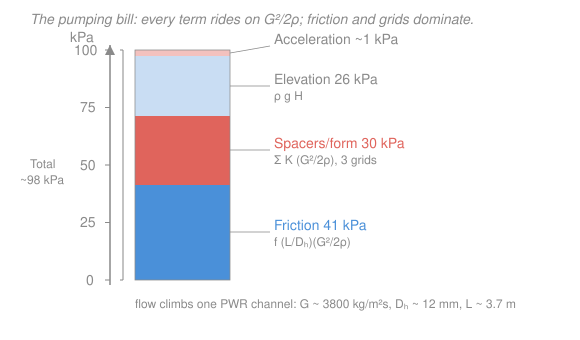

# Reactor Thermal-Hydraulics · Lesson 2.5: Pressure drop in the core

> ⏱ ~15 min · Module 2: Single-phase convection and flow · Builds on: [2.1 Coolant energy balance and bulk temperature](02-01-coolant-energy-balance-bulk-temperature.md), [`fluid-dynamics` 3.1 Reynolds number](../../fluid-dynamics/lessons/03-01-reynolds-number.md), [`fluid-dynamics` 3.2 Couette & Poiseuille flow](../../fluid-dynamics/lessons/03-02-couette-poiseuille.md) · Unlocks: [3.5 Two-phase pressure drop](03-05-two-phase-pressure-drop.md), [4.1 Natural circulation and driving head](04-01-natural-circulation-driving-head.md), Boss problem 2

## Why this matters

The coolant only carries heat away because a pump forces it up the channel — and forcing it costs pressure. Every pascal the channel eats is a pascal the pump must supply, and pump power is a real, continuous parasitic load: a few megawatts of a plant's electric output spent just moving water. Worse, the knobs that *lower* pressure drop (fatter channels, fewer spacer grids) are the same knobs that *worsen* heat transfer. So the core pressure drop is where thermal-hydraulics stops being physics and starts being an economic and safety trade. This lesson totals the bill, and it's the direct setup for the loss side of a [natural-circulation loop](04-01-natural-circulation-driving-head.md), where — with the pumps gone — buoyancy alone has to pay it.

## The idea

Send water up a heated rod bundle and it loses pressure four ways, each for a different physical reason:

1. **Friction** — the water rubs against every wall the whole way up. This is ordinary [pipe-flow drag](../../fluid-dynamics/lessons/03-02-couette-poiseuille.md), just in a bundle instead of a round tube.
2. **Form (local) losses** — every time the flow hits an obstacle it can't stream smoothly around — a **spacer grid** holding the rods apart, the inlet nozzle, an orifice — it separates, swirls, and dumps kinetic energy into turbulence. A discrete pressure hit at each fitting.
3. **Acceleration** — the water gets hotter and lighter going up. To keep the *same mass* flowing through the *same area*, lighter water must move faster; speeding it up costs momentum, hence pressure.
4. **Elevation** — you're lifting water against gravity. A static head, same as the pressure at the bottom of a swimming pool.

The unifying trick: every one of these is some dimensionless number times the **dynamic head** $G^2/2\rho$ — the pressure equivalent of the flow's kinetic energy. Get that one group right and the whole tally is bookkeeping. In a rod bundle, friction and spacer grids are the big two; acceleration is usually tiny in single phase (it becomes a monster once the coolant boils — that's [3.5](03-05-two-phase-pressure-drop.md)).

## The formal version

Everything is written in **mass flux** $G=\dot m/A_{flow}$ (kg·m⁻²·s⁻¹, from [2.1](02-01-coolant-energy-balance-bulk-temperature.md)) rather than velocity, because $G$ is constant up a channel of fixed area even as density changes, whereas velocity $v=G/\rho$ is not. The recurring group is the **dynamic head**

$$\frac{G^2}{2\rho} = \frac{\rho v^2}{2} \quad [\mathrm{Pa}],$$

with $\rho$ the coolant density (kg·m⁻³). *In words: the kinetic energy per unit volume of the stream, expressed as a pressure.*

**Friction.** Over a channel of length $L$ (m) and hydraulic diameter $D_h=4A_{flow}/P_{wetted}$ (m, from [2.2](02-02-convective-heat-transfer-film-drop.md)),

$$\Delta p_f = f\,\frac{L}{D_h}\,\frac{G^2}{2\rho}.$$

*In words: wall drag scales with how many diameters long the channel is, times the dynamic head.* Here $f$ is the **Darcy friction factor** (dimensionless). For turbulent flow in smooth channels,

$$f \approx 0.184\,Re^{-0.2} \quad (Re \gtrsim 2\times10^4), \qquad\text{or}\qquad f \approx 0.316\,Re^{-0.25} \quad (\text{Blasius, } Re \lesssim 2\times10^4),$$

with $Re=GD_h/\mu$ ([`fluid-dynamics` 3.1](../../fluid-dynamics/lessons/03-01-reynolds-number.md)) and $\mu$ the dynamic viscosity (Pa·s). Reactor flow is deeply turbulent ($Re\sim10^5$–$10^6$), so use the first form. **Watch the convention:** this is Darcy $f$; the *Fanning* factor $C_f = f/4$ appears in many chemical-engineering texts, and mixing them gives a 4× error.

**Form / local losses.** Each fitting gets a **loss coefficient** $K$ (dimensionless), tabulated or measured:

$$\Delta p_{form} = K\,\frac{G^2}{2\rho}.$$

*In words: a fitting costs some fixed fraction — or multiple — of one dynamic head.* A PWR spacer grid runs $K\approx 0.7$–$1.5$; sum $K$ over all grids plus inlet/outlet/orifice losses.

**Acceleration.** With $G$ fixed and density falling from inlet $\rho_i$ to outlet $\rho_o$,

$$\Delta p_{acc} = G^2\!\left(\frac{1}{\rho_o}-\frac{1}{\rho_i}\right).$$

*In words: the pressure needed to speed up the stream as it thins out.* This is the momentum-flux change $\Delta(G v)=\Delta(G^2/\rho)$; it is small in single-phase liquid (density barely moves) and dominant in boiling.

**Elevation.** For a vertical channel of height $H$ (m) with mean density $\bar\rho$,

$$\Delta p_{elev} = \bar\rho\, g H, \qquad g = 9.81\ \mathrm{m/s^2}.$$

*In words: the static weight of the column of coolant you're lifting.*

**The total, and the bill.** Sum them:

$$\Delta p_{tot} = \Delta p_f + \Delta p_{form} + \Delta p_{acc} + \Delta p_{elev}.$$

The pump must supply this against the volumetric flow $\dot V = \dot m/\rho$ (m³·s⁻¹), so the **pumping power** is

$$\dot W_{pump} = \frac{\dot V\,\Delta p_{tot}}{\eta},$$

with $\eta$ the pump (hydraulic-to-shaft) efficiency, typically $0.8$–$0.9$. *In words: hydraulic power is flow times pressure rise; divide by efficiency to get the shaft power you actually burn.*

## Picture

## Worked examples

**Example 1 — the core pressure drop (Boss problem 2, pressure piece).** A PWR coolant subchannel: mass flux $G = 3800\ \mathrm{kg\,m^{-2}s^{-1}}$, hydraulic diameter $D_h = 0.0118\ \mathrm{m}$, active length $L = 3.66\ \mathrm{m}$. Water at ~300 °C / 15.5 MPa: $\rho \approx 726\ \mathrm{kg/m^3}$, $\mu \approx 9.1\times10^{-5}\ \mathrm{Pa\,s}$. Three spacer grids, each $K\approx 1$.

*Reynolds number and friction factor:*

$$Re = \frac{G D_h}{\mu} = \frac{3800 \times 0.0118}{9.1\times10^{-5}} = \frac{44.8}{9.1\times10^{-5}} \approx 4.93\times10^{5}.$$

$$f = 0.184\,Re^{-0.2} = 0.184 \times (4.93\times10^5)^{-0.2} = 0.184 \times 0.0727 \approx 0.0134.$$

*Dynamic head* (the group everything rides on):

$$\frac{G^2}{2\rho} = \frac{3800^2}{2\times726} = \frac{1.444\times10^7}{1452} \approx 9.94\times10^3\ \mathrm{Pa} = 9.94\ \mathrm{kPa}.$$

*Friction* (note $L/D_h = 3.66/0.0118 = 310$ diameters):

$$\Delta p_f = f\,\frac{L}{D_h}\,\frac{G^2}{2\rho} = 0.0134 \times 310 \times 9.94\ \mathrm{kPa} \approx 41.3\ \mathrm{kPa}.$$

*Grids* (form loss), three at $K=1$:

$$\Delta p_{form} = \left(\textstyle\sum K\right)\frac{G^2}{2\rho} = 3 \times 9.94\ \mathrm{kPa} \approx 29.8\ \mathrm{kPa}.$$

*Elevation* (mean density up the channel):

$$\Delta p_{elev} = \bar\rho\,gH = 726 \times 9.81 \times 3.66 \approx 26.1\ \mathrm{kPa}.$$

*Acceleration* (inlet $\rho_i\approx740$, outlet $\rho_o\approx700\ \mathrm{kg/m^3}$):

$$\Delta p_{acc} = G^2\!\left(\tfrac{1}{700}-\tfrac{1}{740}\right) = 1.444\times10^7 \times (7.7\times10^{-5}) \approx 1.1\ \mathrm{kPa}.$$

*Total:*

$$\Delta p_{tot} \approx 41.3 + 29.8 + 26.1 + 1.1 \approx 98\ \mathrm{kPa} \approx 0.1\ \mathrm{MPa}.$$

*Check.* Units: $f$ and $K$ dimensionless, $G^2/2\rho$ in $\frac{(\mathrm{kg\,m^{-2}s^{-1}})^2}{\mathrm{kg\,m^{-3}}} = \mathrm{kg\,m^{-1}s^{-2}} = \mathrm{Pa}$ ✓. Magnitude: ~0.1 MPa against a 15.5 MPa system pressure is well under 1% — reassuringly small, as it must be, or the pump couldn't keep the core pressurized. Friction + grids carry ~72% of the drop; acceleration is a rounding error (it won't be, once we boil). Real assemblies have 7–9 grids, so in practice grid losses *dominate* — a lever the designer controls directly. ✓

**Example 2 — the pumping bill, and the trade.** A large PWR pushes $\dot m \approx 18{,}000\ \mathrm{kg/s}$ of coolant through the core, all channels in parallel sharing the same $\Delta p_{tot}\approx 98\ \mathrm{kPa}$. Volumetric flow:

$$\dot V = \frac{\dot m}{\rho} = \frac{18{,}000}{726} \approx 24.8\ \mathrm{m^3/s}.$$

Hydraulic power delivered to the coolant across the core:

$$\dot W_{hyd} = \dot V\,\Delta p_{tot} = 24.8 \times 9.8\times10^4 \approx 2.44\times10^6\ \mathrm{W} = 2.44\ \mathrm{MW}.$$

At pump efficiency $\eta = 0.85$:

$$\dot W_{pump} = \frac{2.44}{0.85} \approx 2.9\ \mathrm{MW}.$$

*Check.* Units: $\mathrm{m^3/s}\times\mathrm{Pa} = \mathrm{m^3/s}\times\mathrm{N/m^2} = \mathrm{N\,m/s} = \mathrm{W}$ ✓. Sense: ~3 MW to shove water across the core, on a plant making ~1100 MW electric, is a fraction of a percent — small, but it runs 24/7 and comes straight off the salable output (the full reactor coolant pumps, including steam-generator and piping losses, draw several times this).

*The trade.* Want to cut that bill? $\Delta p_f \propto 1/D_h$ and grid losses scale with grid count, so **fatter channels or fewer grids** lower the pressure drop. But widening the flow area drops the mass flux $G$, and the film heat-transfer coefficient scales as $h \propto G^{0.8}D_h^{-0.2}$ (Dittus–Boelter, [2.2](02-02-convective-heat-transfer-film-drop.md)) — so the same move that saves pump power **raises the clad temperature** and eats your margin to boiling. Grids are the sharpest example: they cost pressure *and* buy back heat transfer by tripping turbulence and mixing the subchannels. Pressure drop is never minimized in isolation — it's balanced against the film drop from [2.2](02-02-convective-heat-transfer-film-drop.md) and the CHF margin from Module 3.

## Watch out

- **You might think the elevation head is a pure loss you can engineer away — but in a *closed* loop it's largely recovered.** The coolant that rises through the core comes back down the downcomer, and that descending column pushes the pump's job back down. Across the *core alone* $\bar\rho gH$ is a real $\Delta p$, but what the pump net-fights around the whole loop is friction + form + acceleration. (In [natural circulation, 4.1](04-01-natural-circulation-driving-head.md), this recovery is the *entire point* — a density *difference* between hot and cold legs is what drives the flow.)
- **You might grab the Fanning friction factor by mistake.** The Darcy $f$ used here already includes the factor that makes $\Delta p_f = f\frac{L}{D_h}\frac{G^2}{2\rho}$ correct; Fanning $C_f = f/4$ needs $\Delta p_f = 4C_f\frac{L}{D_h}\frac{G^2}{2\rho}$. A missing 4× is the classic pressure-drop blunder — always confirm which factor a correlation reports.
- **You might mix velocity and mass flux.** In a heated channel $\rho$ falls, so velocity $v=G/\rho$ *rises* up the channel while $G$ stays put. Write everything in $G$ and evaluate $\rho$ at the right elevation; using an inlet velocity all the way up quietly under-counts the drop. And note $\frac{G^2}{2\rho}=\frac{\rho v^2}{2}$ are the *same* quantity — don't double-book it.

## One-liner

> A channel's pressure drop is friction + grids + acceleration + elevation, every term a dimensionless number times the dynamic head $G^2/2\rho$ — and the pump pays $\dot V\,\Delta p/\eta$, in megawatts, for all of it.

## Problems

**P1 (🟢)** A gas-cooled channel has $G = 900\ \mathrm{kg\,m^{-2}s^{-1}}$, $D_h = 0.015\ \mathrm{m}$, $L = 4.0\ \mathrm{m}$, coolant density $\rho = 5.0\ \mathrm{kg/m^3}$ and viscosity $\mu = 4.0\times10^{-5}\ \mathrm{Pa\,s}$. Find $Re$, the Darcy friction factor (use $f=0.184\,Re^{-0.2}$), and the frictional pressure drop $\Delta p_f$.

**P2 (🟡)** For the PWR channel of Example 1 ($G=3800$, $\rho=726$, three grids at $K=1$, $\Delta p_f = 41.3$ kPa), a design change swaps the three grids for **five** grids of $K=1.2$ each. By how much does the *form* loss change, and what is the new friction-plus-form subtotal? (Ignore elevation and acceleration.)

**P3 (🔴)** Show that for fixed mass flow rate $\dot m$ through a channel of fixed length, holding everything else constant, the frictional pressure drop scales roughly as $\Delta p_f \propto D_h^{-4.8}$ when the flow area is $A \propto D_h^2$. What does this say about the payoff of widening a channel? (Hint: $G=\dot m/A$, $f\propto Re^{-0.2}$, $Re = GD_h/\mu$.)

Solutions

**P1** Reynolds number:

$$Re = \frac{GD_h}{\mu} = \frac{900\times0.015}{4.0\times10^{-5}} = \frac{13.5}{4.0\times10^{-5}} \approx 3.38\times10^{5}.$$

Friction factor:

$$f = 0.184\,(3.38\times10^5)^{-0.2} = 0.184 \times 0.0787 \approx 0.0145.$$

Dynamic head: $\dfrac{G^2}{2\rho} = \dfrac{900^2}{2\times5.0} = \dfrac{8.1\times10^5}{10} = 8.1\times10^4\ \mathrm{Pa} = 81\ \mathrm{kPa}$.

$$\Delta p_f = f\,\frac{L}{D_h}\,\frac{G^2}{2\rho} = 0.0145 \times \frac{4.0}{0.015} \times 81\ \mathrm{kPa} = 0.0145 \times 267 \times 81\ \mathrm{kPa} \approx 313\ \mathrm{kPa}.$$

*Check.* Units all consistent (dimensionless × dimensionless × Pa). The drop is large because a low-density gas needs a *high* velocity ($v = G/\rho = 180$ m/s) to carry heat, and the dynamic head goes as $v^2$ — gas coolants pay a steep pumping penalty, exactly why they run at high pressure to raise $\rho$. ✓

**P2** Old form loss: $\sum K = 3\times1 = 3$, giving $3\times9.94 = 29.8$ kPa (Example 1). New: $\sum K = 5\times1.2 = 6.0$, giving

$$\Delta p_{form}' = 6.0 \times 9.94\ \mathrm{kPa} \approx 59.6\ \mathrm{kPa}.$$

So the form loss *doubles*, up by $\approx 29.8$ kPa. New friction-plus-form subtotal:

$$41.3 + 59.6 \approx 101\ \mathrm{kPa},$$

versus $41.3 + 29.8 = 71.1$ kPa before — a 42% jump in the pumped part of the drop. *Check.* The extra grids would buy better subchannel mixing and a higher CHF margin, so the pumping penalty is the price of that safety headroom — the trade named in Example 2. ✓

**P3** With $A \propto D_h^2$ and $\dot m$ fixed, $G = \dot m/A \propto D_h^{-2}$. Then $Re = GD_h/\mu \propto D_h^{-2}\cdot D_h = D_h^{-1}$, so $f \propto Re^{-0.2} \propto D_h^{0.2}$. The dynamic head $\dfrac{G^2}{2\rho} \propto G^2 \propto D_h^{-4}$, and the geometric factor $L/D_h \propto D_h^{-1}$. Collecting:

$$\Delta p_f \propto f\cdot\frac{L}{D_h}\cdot\frac{G^2}{2\rho} \propto D_h^{0.2}\cdot D_h^{-1}\cdot D_h^{-4} = D_h^{-4.8}.$$

*Check.* A brutal sensitivity: widening a channel by just 15% ($D_h\to1.15D_h$) cuts frictional drop by $1.15^{-4.8}\approx 0.49$ — more than half. That's why fatter channels are the first lever for pump power. The catch, from Example 2: $h\propto G^{0.8}D_h^{-0.2}\propto (D_h^{-2})^{0.8}D_h^{-0.2}=D_h^{-1.8}$ collapses even faster, so the wider channel cools far worse. The two exponents are why channel sizing is a genuine optimization, not a free lunch. ✓

## Flashback

**From Lesson 2.2 (Convective heat transfer and film drop):** A water-cooled channel runs at $Re = 4.0\times10^5$ with $Pr = 0.90$. The coolant conductivity is $k = 0.56\ \mathrm{W/(m\cdot K)}$ and the hydraulic diameter is $D_h = 0.012\ \mathrm{m}$. Using the Dittus–Boelter correlation for heating, $Nu = 0.023\,Re^{0.8}Pr^{0.4}$, find the Nusselt number and the convective heat-transfer coefficient $h$. (Fresh variant — different $Re$ and geometry from the lesson.)

Solution

$$Re^{0.8} = (4.0\times10^5)^{0.8} \approx 3.03\times10^{4}, \qquad Pr^{0.4} = 0.90^{0.4} \approx 0.959.$$

$$Nu = 0.023 \times 3.03\times10^4 \times 0.959 \approx 668.$$

Then, from $Nu = hD_h/k$,

$$h = \frac{Nu\,k}{D_h} = \frac{668 \times 0.56}{0.012} \approx 3.12\times10^{4}\ \mathrm{W/(m^2\,K)} \approx 31\ \mathrm{kW/(m^2\,K)}.$$

*Check.* Units: $Nu$ dimensionless; $h = \frac{[\,]\cdot\mathrm{W/(m\,K)}}{\mathrm{m}} = \mathrm{W/(m^2\,K)}$ ✓. A film coefficient of ~31 kW/(m²·K) is right in the PWR band (~30–40) — high, because pressurized water at deep-turbulent $Re$ is a superb single-phase coolant. Notice both this lesson and 2.2 lean on the *same* $Re$: it sets the friction factor here and the Nusselt number there — one flow number, two jobs, which is exactly why lowering $G$ to save pump power also costs you $h$. ✓

## Connections

- **Backward:** the whole tally is built on **mass flux** $G=\dot m/A$ and the **hydraulic diameter** $D_h$ from [2.1](02-01-coolant-energy-balance-bulk-temperature.md) and [2.2](02-02-convective-heat-transfer-film-drop.md), and the friction factor $f(Re)$ is textbook turbulent [pipe drag](../../fluid-dynamics/lessons/03-02-couette-poiseuille.md) with $Re$ from [`fluid-dynamics` 3.1](../../fluid-dynamics/lessons/03-01-reynolds-number.md) — the reactor channel is a Poiseuille problem wearing fuel rods.
- **Forward:** [3.5 Two-phase pressure drop](03-05-two-phase-pressure-drop.md) reruns this exact sum once the coolant boils — friction and acceleration each pick up a **two-phase multiplier** $\phi^2$, and the acceleration term (a rounding error here) becomes a leading contributor as vapor accelerates the flow. And [4.1 Natural circulation](04-01-natural-circulation-driving-head.md) puts these same loss terms on one side of a balance against a buoyancy *driving* head — solving $\sum\!\big(f\frac{L}{D_h}+K\big)\frac{G^2}{2\rho} = (\rho_{cold}-\rho_{hot})gH$ for the flow the loop can sustain with no pump at all.
- **Sideways (the design trade):** pressure drop is coupled to the film drop through the shared mass flux — cutting $\Delta p$ via bigger $D_h$ or fewer grids drops $h$ (Dittus–Boelter, [2.2](02-02-convective-heat-transfer-film-drop.md)) and shrinks the margin to critical heat flux ([Module 3](03-06-critical-heat-flux-dnb.md)). Boss problem 2 forces exactly this call: after you compute the drop, name the temperature-budget term you'd attack first.
