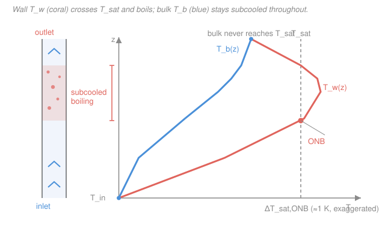

# Reactor Thermal-Hydraulics · Lesson 3.2: Onset of nucleate boiling and subcooled boiling

> ⏱ ~15 min · Module 3: Boiling and two-phase flow · Builds on: [3.1 The boiling curve](03-01-boiling-curve-pool-boiling-regimes.md), [2.1 Coolant energy balance](02-01-coolant-energy-balance-bulk-temperature.md), [2.2 Convective film drop](02-02-convective-heat-transfer-film-drop.md) · Unlocks: [3.3 Quality, void fraction, slip](03-03-quality-void-fraction-slip.md), [3.6 Critical heat flux / DNB](03-06-critical-heat-flux-dnb.md)

## Why this matters

Here is a fact that surprises people: a PWR is advertised as a *pressurized*, single-phase reactor — you keep it at 15.5 MPa precisely so the water never boils — and yet, in the hot channels, **it boils**. Not in the bulk stream, which stays a comfortable 15–20 K below saturation, but right on the cladding surface, where the wall runs hotter than the water it touches. Bubbles grow on the clad and collapse back into the subcooled flow a millimetre away. This is **subcooled boiling**, and it is not a malfunction — it is the designed-for operating state of the hottest part of the core. This lesson answers two questions: *where up the channel does the wall first start to boil* (the onset of nucleate boiling, ONB), and *what changes once it does*. It is the hinge between the single-phase machinery of Module 2 and everything two-phase that follows — quality, void, and the critical-heat-flux cliff that ends the module.

## The idea

Recall the whole point of [2.2](02-02-convective-heat-transfer-film-drop.md): the wall is always hotter than the bulk, by the film drop $\Delta T_{film} = q''/h$. Now climb the channel. The bulk temperature $T_b(z)$ rises toward saturation ([2.1](02-01-coolant-energy-balance-bulk-temperature.md)), and *on top of it* sits the wall, hotter still. Two curves march up the channel: $T_b(z)$ and $T_w(z) = T_b(z) + \Delta T_{film}$. The wall curve is the one that matters for boiling, because boiling starts at the wall.

A bubble can only survive on the wall if the liquid touching it is hotter than saturation — otherwise the surrounding subcooled water just condenses it back to nothing. So the trigger for boiling is **wall superheat**: the wall must climb some amount *above* $T_{sat}$ before nucleation sticks. The instant $T_w$ exceeds $T_{sat}$ by that threshold — call it $\Delta T_{sat,ONB}$ — bubbles start popping off cavities in the clad surface. That crossover point, at some elevation up the channel, is the **onset of nucleate boiling**.

The beautiful part: this can happen while the *bulk is still well below boiling*. The stream as a whole is subcooled liquid; only the thin film against the wall is superheated. Bubbles nucleate, detach, and collapse in the cold core — "partial" subcooled boiling — and higher up, where the wall is hotter and the bulk warmer, they survive longer: "fully-developed" subcooled boiling. In a BWR you go one step further: the bulk itself reaches $T_{sat}$ and you get honest **saturated (bulk) boiling** with net vapor leaving the channel. A PWR stops short of that — bulk-subcooled the whole way, boiling only at the wall.

## The formal version

**The ONB criterion (Bergles–Rohsenow / Davis–Anderson).** A bubble sitting in a wall cavity of radius $r_c$ is in mechanical equilibrium when the surface tension pulling it closed balances the vapor's excess pressure; translating that pressure into a temperature (via Clausius–Clapeyron) sets the superheat the wall must supply. Requiring that the linear wall-superheat profile is just *tangent* to this bubble-equilibrium curve — the point where the very first cavity can grow — Davis and Anderson (1966) get a clean closed form:

$$q''_{ONB} = \frac{k_l\, h_{fg}\, \rho_g}{8\,\sigma\, T_{sat}}\,\big(T_w - T_{sat}\big)^2 \quad\Longleftrightarrow\quad \boxed{\;\Delta T_{sat,ONB} = T_w - T_{sat} = \sqrt{\frac{8\,\sigma\, T_{sat}\, q''}{k_l\, h_{fg}\, \rho_g}}\;}$$

where $q''$ is the local wall heat flux ($\mathrm{W/m^2}$), $k_l$ the *liquid* thermal conductivity ($\mathrm{W/(m\cdot K)}$), $h_{fg}$ the latent heat of vaporization ($\mathrm{J/kg}$), $\rho_g$ the saturated-vapor density ($\mathrm{kg/m^3}$), $\sigma$ the surface tension ($\mathrm{N/m}$), and $T_{sat}$ the saturation temperature in **kelvin** (it comes from Clausius–Clapeyron, so it must be absolute). *In words: the wall must beat $T_{sat}$ by a superheat that grows like $\sqrt{q''}$ and shrinks when the fluid boils easily — high vapor density, high latent heat, low surface tension.* The Bergles–Rohsenow correlation is the same idea fit empirically to water; both give the same small number at reactor pressure.

**Locating ONB in the channel.** Overlay the criterion on the single-phase wall temperature you already know how to compute. ONB happens at the lowest elevation $z_{ONB}$ where

$$T_w(z) \;=\; \underbrace{T_b(z)}_{\text{from }2.1} + \underbrace{\frac{q''(z)}{h}}_{\text{film drop, }2.2} \;\ge\; T_{sat} + \Delta T_{sat,ONB}.$$

*In words: march the single-phase wall curve up the channel and mark where it first pokes past $T_{sat}$ by the onset superheat.* Because $\Delta T_{sat,ONB}$ is tiny at PWR pressure (Example 1), this is essentially "where does the wall first reach $T_{sat}$."

**Once boiling: the wall temperature nearly pins.** In fully-developed subcooled boiling the wall superheat stops tracking $q''/h$ and instead obeys a boiling law. For water the standard is **Jens–Lottes**:

$$\Delta T_{sat} = T_w - T_{sat} = 25\,\big(q''\big)^{0.25}\, e^{-p/6.2}, \qquad q'' \text{ in } \mathrm{MW/m^2},\; p \text{ in } \mathrm{MPa}.$$

*In words: once bubbles take over, the wall superheat depends only *weakly* (fourth root) on heat flux — so the wall temperature almost clamps a few K above $T_{sat}$ no matter how hard you push.* That clamp is the enhancement: doubling the flux barely moves the wall, so the effective $h$ has soared. It is also why the boiling curve of [3.1](03-01-boiling-curve-pool-boiling-regimes.md) is so steep in the nucleate region.

**Two regimes, one distinction.** *Subcooled boiling*: $T_b < T_{sat}$ but $T_w > T_{sat}+\Delta T_{sat,ONB}$ — bubbles at the wall, net liquid in the bulk (PWR). *Saturated (bulk) boiling*: $T_b = T_{sat}$, net vapor generated, quality $x>0$ (BWR). The equilibrium (thermodynamic) quality $x_e = (h - h_f)/h_{fg}$ — full story in [3.3](03-03-quality-void-fraction-slip.md) — is *negative* in the subcooled region, hits $0$ where the bulk reaches saturation, and climbs positive only in bulk boiling.

## Picture

## Worked examples

**Example 1 (locate ONB in a hot PWR channel).** Take a hot channel with a cosine flux, $L = 3.66\ \mathrm{m}$, peak linear rating $q'_{max} = 40\ \mathrm{kW/m}$ on a rod of $d = 9.5\ \mathrm{mm}$ (so peak $q''_{max} = q'_{max}/(\pi d) \approx 1.34\ \mathrm{MW/m^2}$), heat-transfer coefficient $h \approx 3.7\times10^4\ \mathrm{W/(m^2\cdot K)}$ (from [2.2](02-02-convective-heat-transfer-film-drop.md)), and $T_{sat}(15.5\ \mathrm{MPa}) = 345\ ^\circ\mathrm{C} = 618\ \mathrm{K}$. Combining the bulk rise ([2.1](02-01-coolant-energy-balance-bulk-temperature.md)) with the film drop gives this single-phase wall temperature up the channel (measure $z$ from the inlet):

| $z$ (m) | $T_b$ (°C) | $\Delta T_{film}$ (K) | $T_w = T_b+\Delta T_{film}$ (°C) |
|---|---|---|---|
| 0.00 | 290 | 0 | 290 |
| 0.92 | 296 | 26 | 322 |
| 1.83 | 310 | 36 | **346** |
| 2.44 | 320 | 31 | 351 |
| 2.75 | 324 | 26 | 350 |
| 3.05 | 327 | 18 | 345 |
| 3.66 | 330 | 0 | 330 |

*Step 1 — the onset superheat.* Use Davis–Anderson at the peak flux with saturated-water properties at 15.5 MPa: $\sigma \approx 0.005\ \mathrm{N/m}$, $k_l \approx 0.50\ \mathrm{W/(m\cdot K)}$, $h_{fg} \approx 0.97\times10^6\ \mathrm{J/kg}$, $\rho_g \approx 100\ \mathrm{kg/m^3}$, $q'' \approx 1.3\times10^6\ \mathrm{W/m^2}$:

$$\Delta T_{sat,ONB} = \sqrt{\frac{8(0.005)(618)(1.3\times10^6)}{(0.50)(0.97\times10^6)(100)}} = \sqrt{\frac{3.22\times10^7}{4.85\times10^7}} = \sqrt{0.66} \approx 0.8\ \mathrm{K}.$$

So the wall need only reach $T_{sat} + 0.8 \approx 346\ ^\circ\mathrm{C}$ — call it $\approx 1\ \mathrm{K}$ of superheat.

*Step 2 — find the crossing.* Reading the table straight off, $T_w$ first reaches the $346\ ^\circ\mathrm{C}$ threshold right at $z_{ONB} \approx 1.83\ \mathrm{m}$ — essentially the core midplane, where the flux (and hence the film drop) peaks. Above this the wall stays superheated until it falls back through $346\ ^\circ\mathrm{C}$ near $z \approx 3.0\ \mathrm{m}$ (the flux, and the film drop, have tapered off). So subcooled boiling occupies a band roughly $1.8\text{–}3.0\ \mathrm{m}$ up the channel — the upper half.

*Check.* Units inside the root: $\frac{(\mathrm{N/m})(\mathrm{K})(\mathrm{W/m^2})}{(\mathrm{W/(m\cdot K)})(\mathrm{J/kg})(\mathrm{kg/m^3})} = \frac{\mathrm{N\,K\,W\,m}}{\mathrm{m\,W\,J}} = \mathrm{K^2}$ (using $\mathrm{N\cdot m = J}$) ✓, so the root is in K. And the bulk maxes out at $330\ ^\circ\mathrm{C}$ — a full $15\ \mathrm{K}$ *below* $T_{sat}$ — so every one of these bubbles forms in a channel whose stream is still subcooled. Exactly the PWR picture. ✓

**Example 2 (PWR vs BWR — subcooled boiling vs saturated boiling).** The Example-1 PWR channel exits at $T_b = 330\ ^\circ\mathrm{C}$, still $15\ \mathrm{K}$ under $T_{sat} = 345\ ^\circ\mathrm{C}$. Its equilibrium quality at exit is *negative*:

$$x_{e,\text{exit}} = \frac{h_{exit} - h_f}{h_{fg}} < 0 \quad(\text{subcooled: } h_{exit} < h_f).$$

No net vapor leaves — the boiling is entirely a wall phenomenon. Now a BWR channel at $7\ \mathrm{MPa}$: $T_{sat} = 286\ ^\circ\mathrm{C}$, $h_f \approx 1267\ \mathrm{kJ/kg}$, $h_{fg} \approx 1505\ \mathrm{kJ/kg}$. Feed it $\dot m = 0.34\ \mathrm{kg/s}$ entering subcooled at $h_{in} \approx 1217\ \mathrm{kJ/kg}$ (about $10\ \mathrm{K}$ below saturation), with channel power $\dot Q_{ch} = 88\ \mathrm{kW}$. The exit enthalpy from the energy balance ([2.1](02-01-coolant-energy-balance-bulk-temperature.md), enthalpy form) is

$$h_{exit} = h_{in} + \frac{\dot Q_{ch}}{\dot m} = 1217 + \frac{88}{0.34} = 1217 + 259 = 1476\ \mathrm{kJ/kg},$$

comfortably above $h_f$, so the bulk has reached saturation and is boiling. The exit quality:

$$x_{e,\text{exit}} = \frac{h_{exit} - h_f}{h_{fg}} = \frac{1476 - 1267}{1505} = \frac{209}{1505} \approx 0.14 \;\;(14\%).$$

*Check.* Units: $\mathrm{kW}/(\mathrm{kg/s}) = \mathrm{kJ/kg}$ ✓; quality is a dimensionless enthalpy fraction, $0 < x < 1$ ✓. A BWR core exit quality around $10\text{–}15\%$ is exactly nominal. The contrast is the whole lesson: **same physics, different pressure and margin** — the PWR keeps the bulk subcooled and boils only at the wall ($x_e<0$), while the BWR drives the bulk to saturation and generates real vapor ($x_e\approx0.14$), which is what spins its turbine directly. See [`intro-nuclear-engineering` 4.5](../../intro-nuclear-engineering/lessons/04-05-reactor-types-nuclear-landscape.md) for why the two designs make that choice. ✓

## Watch out

- **You might think a PWR being "single-phase" means nothing boils.** Single-phase refers to the *bulk* stream, which never reaches $T_{sat}$. The *wall* routinely exceeds $T_{sat}$ in the hot upper channel, so subcooled boiling is present and *expected*. "Subcooled" describes the bulk, not the surface.
- **You might place ONB where the bulk hits $T_{sat}$.** That is where *saturated* boiling would begin — and in a PWR the bulk never gets there. ONB happens far lower, wherever the *wall* first beats $T_{sat}$ by $\Delta T_{sat,ONB}$; the film drop puts the wall ahead of the bulk by tens of K, so boiling starts long before (or without) the bulk saturating.
- **You might read subcooled boiling as a warning sign.** By itself it is benign and even *helpful*: the bubbles violently stir the film, the wall superheat pins at a couple K (Jens–Lottes), and $h$ shoots up — the wall temperature actually *stops climbing*. The hazard is downstream: subcooled boiling is the first rung of the ladder that ends at critical heat flux / DNB ([3.6](03-06-critical-heat-flux-dnb.md)), where the vapor blankets the wall and $h$ collapses.
- **You might expect ONB to need a lot of superheat.** At reactor pressure it needs almost none — $\Delta T_{sat,ONB}\sim 1\ \mathrm{K}$ — because high $\rho_g$ and $h_{fg}$ with low $\sigma$ make nucleation cheap. At atmospheric pressure the same criterion demands several K (P3), which is why boiling feels like a sharper threshold in a kettle than in a reactor.

## One-liner

> The wall boils before the bulk does: once $T_w$ beats $T_{sat}$ by the tiny Davis–Anderson superheat $\Delta T_{sat,ONB}\sim\sqrt{q''}$, nucleate boiling starts on the clad — so a PWR runs bulk-subcooled yet boils at the wall near the midplane, while a BWR pushes the bulk all the way to saturation.

## Problems

**P1 (🟢)** A PWR node has bulk temperature $T_b = 322\ ^\circ\mathrm{C}$ and film drop $\Delta T_{film} = 26\ \mathrm{K}$; $T_{sat} = 345\ ^\circ\mathrm{C}$ and $\Delta T_{sat,ONB} \approx 1\ \mathrm{K}$. Is the wall boiling at this node? By how much is the *bulk* subcooled?

**P2 (🟡)** A BWR channel at $7\ \mathrm{MPa}$ ($h_f = 1267\ \mathrm{kJ/kg}$, $h_{fg} = 1505\ \mathrm{kJ/kg}$) carries $\dot m = 0.30\ \mathrm{kg/s}$ entering at $h_{in} = 1230\ \mathrm{kJ/kg}$. What channel power $\dot Q_{ch}$ is needed to reach an exit quality $x_e = 0.15$? (Careful — the coolant must first be brought up to saturation, *then* boiled.)

**P3 (🔴, optional)** Using Davis–Anderson, estimate $\Delta T_{sat,ONB}$ for water boiling at **atmospheric pressure** ($T_{sat} = 373\ \mathrm{K}$, $\sigma = 0.059\ \mathrm{N/m}$, $k_l = 0.68\ \mathrm{W/(m\cdot K)}$, $h_{fg} = 2.26\times10^6\ \mathrm{J/kg}$, $\rho_g = 0.60\ \mathrm{kg/m^3}$) at $q'' = 0.3\ \mathrm{MW/m^2}$. Compare with the $\approx 0.8\ \mathrm{K}$ found at 15.5 MPa and explain in one sentence why high pressure makes nucleation so much easier.

Solutions

**P1** The wall temperature is $T_w = T_b + \Delta T_{film} = 322 + 26 = 348\ ^\circ\mathrm{C}$. The ONB threshold is $T_{sat} + \Delta T_{sat,ONB} = 345 + 1 = 346\ ^\circ\mathrm{C}$. Since $348 > 346$, the wall superheat is $T_w - T_{sat} = 3\ \mathrm{K} > 1\ \mathrm{K}$: **yes, the wall is in subcooled boiling.** Meanwhile the bulk is subcooled by $T_{sat} - T_b = 345 - 322 = 23\ \mathrm{K}$.

*Check.* Wall $3\ \mathrm{K}$ above saturation while the stream sits $23\ \mathrm{K}$ below it — the signature of subcooled boiling, and consistent with the couple-K wall superheat Jens–Lottes predicts once boiling is established. ✓

**P2** Two stages of enthalpy pickup. First raise the subcooled inlet to saturation: $\Delta h_{sub} = h_f - h_{in} = 1267 - 1230 = 37\ \mathrm{kJ/kg}$. Then add the vapor enthalpy for quality $x_e$: $\Delta h_{boil} = x_e\,h_{fg} = 0.15 \times 1505 = 225.8\ \mathrm{kJ/kg}$. Total enthalpy rise:

$$\Delta h = 37 + 225.8 = 262.8\ \mathrm{kJ/kg} \quad\Longrightarrow\quad \dot Q_{ch} = \dot m\,\Delta h = 0.30 \times 262.8 = 78.8\ \mathrm{kW}.$$

*Check.* Equivalently $h_{exit} = h_f + x_e h_{fg} = 1267 + 225.8 = 1492.8\ \mathrm{kJ/kg}$, and $\dot Q = \dot m(h_{exit}-h_{in}) = 0.30(1492.8-1230) = 0.30\times262.8 = 78.8\ \mathrm{kW}$ ✓. Units $\mathrm{(kg/s)(kJ/kg)=kW}$ ✓. Forgetting the subcooling stage would under-count by $\dot m\,\Delta h_{sub} = 11\ \mathrm{kW}$ — a real error, since the inlet is genuinely below saturation. ✓

**P3** Davis–Anderson at atmospheric pressure, $q'' = 0.3\times10^6\ \mathrm{W/m^2}$:

$$\Delta T_{sat,ONB} = \sqrt{\frac{8(0.059)(373)(0.3\times10^6)}{(0.68)(2.26\times10^6)(0.60)}} = \sqrt{\frac{5.28\times10^7}{9.22\times10^5}} = \sqrt{57.3} \approx 7.6\ \mathrm{K}.$$

So the wall must be superheated about $7.6\ \mathrm{K}$ at 1 atm versus only $\approx 0.8\ \mathrm{K}$ at 15.5 MPa — nearly a tenfold jump. **Why:** the superheat scales as $\sqrt{\sigma T_{sat}/(h_{fg}\rho_g)}$; going to high pressure drives the vapor density $\rho_g$ up by more than two orders of magnitude ($0.6 \to 100\ \mathrm{kg/m^3}$) and drops the surface tension $\sigma$ by an order of magnitude ($0.059 \to 0.005\ \mathrm{N/m}$), both of which slash the superheat needed for a bubble to survive.

*Check.* Units are $\mathrm{K^2}$ under the root as in Example 1 ✓, and the trend is physical: a kettle at 1 atm needs a visibly hot element before it boils, while a pressurized reactor nucleates on the barest superheat. ✓

## Flashback

**From Lesson 2.1 (Coolant energy balance):** A PWR coolant channel carries $\dot m = 0.28\ \mathrm{kg/s}$ of water, $c_p = 5.4\ \mathrm{kJ/(kg\cdot K)}$, entering at $T_{in} = 291\ ^\circ\mathrm{C}$ and removing a total power $\dot Q_{ch} = 52\ \mathrm{kW}$. Find the outlet bulk temperature, and its subcooling margin to $T_{sat}(15.5\ \mathrm{MPa}) = 345\ ^\circ\mathrm{C}$.

Solution

Steady-state energy balance, single-phase (the answer will confirm it):

$$\Delta T_b = \frac{\dot Q_{ch}}{\dot m\,c_p} = \frac{52}{0.28 \times 5.4} = \frac{52}{1.512} = 34.4\ \mathrm{K} \quad\Longrightarrow\quad T_{out} = 291 + 34.4 = 325.4\ ^\circ\mathrm{C}.$$

Subcooling margin: $T_{sat} - T_{out} = 345 - 325.4 = 19.6\ \mathrm{K}$.

*Check.* Units: $\mathrm{kW}/(\mathrm{kg/s}\cdot\mathrm{kJ/(kg\,K)}) = \mathrm{K}$ ✓. The bulk exits nearly $20\ \mathrm{K}$ subcooled — so single-phase in the bulk is self-consistent, yet (per today's lesson) the *wall* in the hottest nodes still exceeds $T_{sat}$ and boils. Bulk subcooling and wall boiling coexist. ✓

## Connections

- **Backward:** ONB is nothing more than the [film drop](02-02-convective-heat-transfer-film-drop.md) stacked on the [bulk temperature climb](02-01-coolant-energy-balance-bulk-temperature.md), compared against $T_{sat}$ — the two curves of Module 2 read against a boiling threshold. The wall-superheat threshold and the nucleate regime it opens are the low-superheat foot of [3.1](03-01-boiling-curve-pool-boiling-regimes.md)'s boiling curve, and of [`heat-transfer` 3.6](../../heat-transfer/lessons/03-06-boiling-condensation.md).
- **Forward:** the equilibrium quality $x_e = (h-h_f)/h_{fg}$ introduced here is developed fully in [3.3](03-03-quality-void-fraction-slip.md) (where subcooled boiling's *actual* void gets its own profile, distinct from $x_e<0$), and the march that starts at ONB ends at the [critical-heat-flux / DNB](03-06-critical-heat-flux-dnb.md) limit that caps reactor power.
- **Sideways:** subcooled-boiling voids near the top of a PWR channel are the small but real coolant-density change that feeds the *void/density reactivity coefficient* — see [`reactor-physics` 5.2](../../reactor-physics/lessons/05-02-doppler-moderator-void-coefficients.md); and the saturation line the whole lesson is measured against is the pure-substance phase behavior of [`engineering-thermodynamics` 1.2](../../engineering-thermodynamics/lessons/01-02-phase-behavior-pure-substance.md). Boss problems build on this exit-quality bookkeeping (see the [syllabus](../syllabus.md)).
