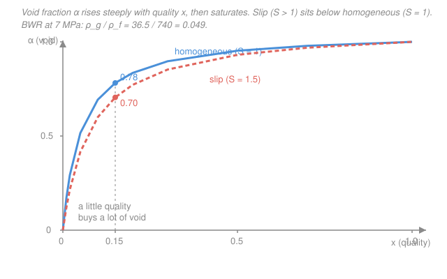

# Reactor Thermal-Hydraulics · Lesson 3.3: Quality, void fraction, and slip

> ⏱ ~15 min · Module 3: Boiling and two-phase flow · Builds on: [3.2 Onset of nucleate boiling](03-02-onset-nucleate-boiling-subcooled.md), [2.1 Coolant energy balance](02-01-coolant-energy-balance-bulk-temperature.md), [`engineering-thermodynamics` 1.2 (phase behavior of a pure substance)](../../engineering-thermodynamics/lessons/01-02-phase-behavior-pure-substance.md) · Unlocks: [3.4 Two-phase flow regimes](03-04-two-phase-flow-regimes.md), [3.5 Two-phase pressure drop](03-05-two-phase-pressure-drop.md)

## Why this matters

Once boiling starts ([3.2](03-02-onset-nucleate-boiling-subcooled.md)), the channel is no longer carrying a single fluid — it's carrying a mixture of liquid water and steam, and suddenly you need to answer two separate questions. *How much* of the coolant mass has become vapor? And *how much of the channel volume* does that vapor occupy? These are **not** the same number, and the gap between them is the single most important fact in two-phase reactor thermal-hydraulics. Vapor is a poor moderator and a poor coolant but takes up enormous room, so the volume answer drives BWR reactivity feedback ([`reactor-physics` 5.2](../../reactor-physics/lessons/05-02-doppler-moderator-void-coefficients.md)), the pressure drop ([3.5](03-05-two-phase-pressure-drop.md)), and how close you are to dryout. This lesson gives you the three numbers — **quality**, **void fraction**, and **slip** — that pin all of it down.

## The idea

Picture a slice of a boiling channel. Weigh everything flowing through it: some of that mass per second is steam, most is still water. The steam's share of the *mass* is the **quality** $x$. Now instead look at a cross-sectional photograph of the same slice: what fraction of the *area* is filled with steam? That's the **void fraction** $\alpha$.

Here's the twist that trips everyone up. Steam at reactor pressure is roughly twenty times less dense than the water it came from. So a kilogram of steam is a *huge* balloon compared to a kilogram of water. Convert just 15% of the mass to vapor and that light, bulky vapor swells to fill nearly 80% of the pipe. **A little quality buys a lot of void.** That single sentence is the whole lesson — the rest is making it quantitative.

One more wrinkle. The steam doesn't just sit there; it's buoyant and rides up the middle of the channel *faster* than the water clinging to the walls. If vapor moves faster, it clears out of any given slice sooner, so at a fixed quality it occupies *less* area than you'd guess. That speed ratio is the **slip** $S$, and accounting for it trims the void back down.

## The formal version

**Thermodynamic (flow) quality.** Define quality from the mixture enthalpy $h$ (units J/kg):

$$x = \frac{h - h_f}{h_{fg}},$$

where $h_f$ is the saturated-liquid enthalpy and $h_{fg} = h_g - h_f$ is the latent heat of vaporization (both J/kg, read from steam tables at the local pressure). *In words: quality is how far the enthalpy has climbed from "all liquid" toward "all vapor," measured in units of the latent heat.* At $x=0$ the fluid is saturated liquid; at $x=1$ it's saturated vapor; in between, $x$ is exactly the **mass fraction that is vapor**, $x = \dot m_g / (\dot m_g + \dot m_f)$.

You rarely read $h$ off a gauge — you *build* it from the axial energy balance of [2.1](02-01-coolant-energy-balance-bulk-temperature.md). Heat added per unit length raises enthalpy:

$$\dot m \, \frac{dh}{dz} = q'(z),$$

with $\dot m$ the channel mass flow rate (kg/s) and $q'(z)$ the linear heat rate (W/m). Integrate from the point where the coolant first reaches saturation and you get $h(z)$, hence $x(z)$. *In words: quality is just the integrated heat load, rebadged.*

**Equilibrium vs. actual quality — the negative-quality subtlety.** The formula above assumes the phases are in thermal equilibrium, so it's the **equilibrium quality** $x_e$. Plug in a subcooled enthalpy ($h < h_f$) and it goes *negative*. That's not a bug: in [3.2](03-02-onset-nucleate-boiling-subcooled.md)'s subcooled boiling, real vapor bubbles cling to the hot wall while the bulk is still below saturation, so the true flowing vapor fraction is small but positive even though $x_e < 0$. Use $x_e$ for the energy bookkeeping; just remember a negative value means "bulk still subcooled, a little wall vapor," not "$-5\%$ steam."

**Void fraction.** The geometric quantity:

$$\alpha = \frac{A_{vapor}}{A_{total}},$$

the fraction of the flow area occupied by vapor. *In words: the area (equivalently, volume) share of steam — what moderation and pressure drop actually feel.*

**The bridge from $x$ to $\alpha$.** Write each phase's mass flow as density × area × velocity: $\dot m_g = \rho_g\,\alpha A\,u_g$ and $\dot m_f = \rho_f\,(1-\alpha)A\,u_f$. Their ratio is $x/(1-x)$:

$$\frac{x}{1-x} = \frac{\dot m_g}{\dot m_f} = \frac{\rho_g}{\rho_f}\,\frac{\alpha}{1-\alpha}\,S, \qquad S \equiv \frac{u_g}{u_f}.$$

Solve for $\alpha$:

$$\boxed{\;\alpha = \dfrac{1}{1 + \dfrac{1-x}{x}\,\dfrac{\rho_g}{\rho_f}\,S\;}}$$

*In words: void depends on quality, on the density ratio, and on how much faster the vapor slips.* The tiny factor $\rho_g/\rho_f$ (about $0.05$ for a BWR) is what makes a small $x$ blow up into a large $\alpha$ — it multiplies the $(1-x)/x$ that would otherwise dominate.

**Slip ratio $S = u_g/u_f$.** Two models live in that boxed formula:

- $S = 1$ — the **homogeneous** (or "no-slip") model: both phases move at one velocity, treat the mixture as a single fluid with averaged density. Simple, and it *over*-predicts void.
- $S > 1$ — the **slip** model: buoyant vapor outruns the liquid ($S \approx 1.5$–$2$ is typical in vertical channels). Faster vapor spends less time in each slice, so at the same $x$ it fills **less** area — $\alpha$ drops.

## Picture

The curve leaps off the origin — by $x = 0.15$ you're already at $\sim 0.78$ void — then flattens as it crawls toward $\alpha = 1$. The slip curve (coral) rides below the homogeneous one (blue): same quality, less void.

## Worked examples

**Example 1 (quality from the energy balance — a BWR channel).** A BWR fuel channel at 7 MPa runs $\dot m = 0.30\ \mathrm{kg/s}$. The coolant reaches saturation partway up; above that point the channel deposits $Q_{boil} = 67.7\ \mathrm{kW}$ of heat into boiling. With $h_{fg} = 1505\ \mathrm{kJ/kg}$ at 7 MPa, find the exit quality.

In the boiling region every joule goes into latent heat (bulk temperature is pinned at $T_{sat}$), so integrating $\dot m\,dh/dz = q'$ from $x=0$ gives $\dot m\, h_{fg}\, x_{exit} = Q_{boil}$:

$$x_{exit} = \frac{Q_{boil}}{\dot m\, h_{fg}} = \frac{67{,}700\ \mathrm{W}}{(0.30\ \mathrm{kg/s})(1{,}505{,}000\ \mathrm{J/kg})} = \frac{67{,}700}{451{,}500} = 0.150.$$

So $x_{exit} = 15\%$ — the mass fraction of steam leaving the channel. Below the saturation point the equilibrium quality was *negative* (subcooled inlet); it climbed through zero and then rose linearly with deposited heat.

*Check.* Units: $\mathrm{W}/[(\mathrm{kg/s})(\mathrm{J/kg})] = \mathrm{W}/(\mathrm{J/s}) = \mathrm{W/W}$ — dimensionless, as a mass fraction must be. ✓ A typical BWR exit quality is $\sim 10$–$15\%$, so this is right in range.

**Example 2 (void fraction — Boss-problem flavor, homogeneous then slip).** Take that exit quality $x = 0.15$ at 7 MPa, where $\rho_f = 740\ \mathrm{kg/m^3}$ and $\rho_g = 36.5\ \mathrm{kg/m^3}$, so $\rho_g/\rho_f = 36.5/740 = 0.0493$.

*Homogeneous ($S = 1$):*

$$\alpha = \frac{1}{1 + \dfrac{1-0.15}{0.15}\,(0.0493)(1)} = \frac{1}{1 + (5.667)(0.0493)} = \frac{1}{1 + 0.280} = \frac{1}{1.280} = 0.78.$$

A $15\%$ quality is a $78\%$ void — steam already dominates the channel volume while five-sixths of the mass is still liquid. This is *the* reason a BWR core is such a strong void-feedback machine.

*Slip ($S = 1.5$):* the vapor outruns the liquid, so it clears each slice faster and fills less area:

$$\alpha = \frac{1}{1 + (5.667)(0.0493)(1.5)} = \frac{1}{1 + 0.419} = \frac{1}{1.419} = 0.70.$$

Accounting for slip drops the void from $0.78$ to $0.70$ — an $8$-point correction. Homogeneous flow always reads high because it forces the fast vapor to crawl along at the liquid's speed, artificially packing more of it into the slice.

*Check.* Both $\alpha$ values sit in $(0,1)$, both exceed $x$ by a wide margin (light phase, big volume), and slip lowers $\alpha$ — every qualitative expectation holds. ✓

## Watch out

- **You might think $x = 15\%$ means steam fills $15\%$ of the pipe.** It fills nearly $80\%$. Quality is a *mass* fraction; void is a *volume* fraction; the factor between them is $\rho_f/\rho_g \approx 20$. Confusing the two is the classic two-phase blunder — always ask "mass or volume?"
- **You might think equilibrium quality can't be negative.** $x_e = (h-h_f)/h_{fg}$ goes negative whenever the bulk is subcooled ($h < h_f$). It's a valid enthalpy coordinate, not an amount of steam. Real (flowing) quality can't dip below zero — but in subcooled boiling it can exceed the negative $x_e$, because bubbles live at the wall before the bulk catches up.
- **You might think slip raises the void.** It *lowers* it. Faster vapor spends less time in each cross-section, so at a fixed quality it occupies less area. The homogeneous ($S=1$) model is the *upper* bound on $\alpha$; real slip pulls the curve down.

## One-liner

> Quality is the vapor's share of the mass, void is its share of the volume; because steam is ~20× lighter than water, a little quality buys a lot of void — and slip (fast vapor) trims that void back down.

## Problems

**P1 (🟢)** A BWR channel at 7 MPa reaches quality $x = 0.05$ (5% steam by mass). Using $\rho_f = 740\ \mathrm{kg/m^3}$, $\rho_g = 36.5\ \mathrm{kg/m^3}$, compute the homogeneous ($S=1$) void fraction. Comment on how it compares to $5\%$.

**P2 (🟡)** For the same 7 MPa densities and the homogeneous model, find the quality $x$ at which the void fraction reaches $\alpha = 0.50$ (half the channel is steam). Is the required quality large or small?

**P3 (🔴)** Void fraction depends strongly on pressure through the density ratio $\rho_g/\rho_f$. Recompute the void at $x = 0.15$, $S = 1$, but for a higher-pressure case where $\rho_g/\rho_f = 0.25$ (steam heavier, closer to the liquid). Compare to the $0.78$ we got at $\rho_g/\rho_f = 0.049$, and explain the limiting behavior as pressure rises toward critical ($\rho_g \to \rho_f$). Tie it to why high-pressure PWRs are far less void-sensitive than BWRs.

Solutions

**P1** With $\rho_g/\rho_f = 36.5/740 = 0.0493$ and $x = 0.05$:

$$\frac{1-x}{x} = \frac{0.95}{0.05} = 19, \qquad \alpha = \frac{1}{1 + (19)(0.0493)} = \frac{1}{1 + 0.937} = \frac{1}{1.937} = 0.52.$$

So $5\%$ quality gives $52\%$ void — the channel is already half steam by volume with only a twentieth of the mass vaporized. This is the "a little quality buys a lot of void" effect in its starkest form: void outruns quality by a factor of ten near the onset of bulk boiling.

*Check.* $\alpha \in (0,1)$ and $\alpha \gg x$, as expected for a light vapor. ✓

**P2** Set $\alpha = 0.50$ in the homogeneous formula and solve for $x$. From $\alpha = 1/(1 + \tfrac{1-x}{x}\tfrac{\rho_g}{\rho_f})$, $\alpha = 0.5$ means the denominator equals $2$, i.e. the added term equals $1$:

$$\frac{1-x}{x}\,\frac{\rho_g}{\rho_f} = 1 \;\Longrightarrow\; \frac{1-x}{x} = \frac{\rho_f}{\rho_g} = \frac{740}{36.5} = 20.3.$$

Then $1/x = 1 + 20.3 = 21.3$, so

$$x = \frac{1}{21.3} = 0.047 \approx 4.7\%.$$

Strikingly small: under $5\%$ quality already fills half the channel with steam. Void reaches parity with liquid while the flow is still overwhelmingly liquid *by mass*.

*Check.* Substituting $x = 0.047$ back: $\frac{0.953}{0.047}(0.0493) = (20.3)(0.0493) = 1.00$, giving $\alpha = 1/2 = 0.50$. ✓

**P3** With $\rho_g/\rho_f = 0.25$ and $x = 0.15$ ($\tfrac{1-x}{x} = 5.667$):

$$\alpha = \frac{1}{1 + (5.667)(0.25)} = \frac{1}{1 + 1.417} = \frac{1}{2.417} = 0.41.$$

Versus $0.78$ at $\rho_g/\rho_f = 0.049$ — the *same* quality gives far less void when the vapor is denser (higher pressure). In the limit $\rho_g \to \rho_f$ (approaching the critical point), the factor $\rho_g/\rho_f \to 1$ and

$$\alpha \to \frac{1}{1 + \frac{1-x}{x}} = \frac{1}{\frac{x + (1-x)}{x}} = x.$$

Void collapses onto quality: when the two phases have the same density, volume share equals mass share. This is exactly why **PWRs** (15.5 MPa, where $\rho_g/\rho_f$ is several times larger than a BWR's) run with almost no bulk void and a weak void coefficient, while **BWRs** (7 MPa, tiny density ratio) live and die by void feedback — the same $x$ produces roughly twice the void. It is the density ratio, set by pressure, that makes void reactivity a BWR control mechanism and a PWR afterthought ([`reactor-physics` 5.2](../../reactor-physics/lessons/05-02-doppler-moderator-void-coefficients.md)).

*Check.* Higher density ratio → lower $\alpha$, and the critical-point limit $\alpha \to x$ is exactly recovered. ✓

## Flashback

**From Lesson 3.2 (Onset of nucleate boiling):** A BWR clad surface ($T_{sat} = 286\ ^\circ\mathrm{C}$ at 7 MPa) carries local heat flux $q'' = 0.60\ \mathrm{MW/m^2}$ with a single-phase film coefficient $h = 40\ \mathrm{kW/(m^2\cdot K)}$. (a) If the local bulk coolant temperature is $T_b = 278\ ^\circ\mathrm{C}$, has subcooled boiling begun? (b) Below what bulk temperature would the surface be too cool to boil? Use the simple onset criterion $T_{surf} = T_{sat}$.

Solution

The surface sits above the bulk by the convective film drop ([2.2](02-02-convective-heat-transfer-film-drop.md)), $\Delta T_{film} = q''/h$:

$$\Delta T_{film} = \frac{q''}{h} = \frac{0.60\times 10^{6}\ \mathrm{W/m^2}}{40{,}000\ \mathrm{W/(m^2\cdot K)}} = 15\ \mathrm{K}.$$

**(a)** Surface temperature $T_{surf} = T_b + \Delta T_{film} = 278 + 15 = 293\ ^\circ\mathrm{C}$. Since $293 > T_{sat} = 286$, the wall is $7\ ^\circ\mathrm{C}$ superheated — **yes, subcooled boiling has begun**, even though the bulk is still $8\ ^\circ\mathrm{C}$ below saturation (this is the negative-equilibrium-quality regime from this lesson: real wall vapor while $x_e < 0$).

**(b)** Onset requires $T_{surf} = T_b + q''/h \ge T_{sat}$, so boiling starts once

$$T_b \ge T_{sat} - \frac{q''}{h} = 286 - 15 = 271\ ^\circ\mathrm{C}.$$

Below $T_b = 271\ ^\circ\mathrm{C}$ the surface stays under saturation and the channel is fully single-phase.

*Check.* Units: $\mathrm{(W/m^2)}/\mathrm{(W/m^2\!\cdot\! K)} = \mathrm{K}$ ✓. The onset bulk temperature ($271\ ^\circ\mathrm{C}$) sits below $T_{sat}$ by exactly the film drop, as subcooled boiling requires. ✓

## Connections

- **Backward:** quality is built straight from the [2.1](02-01-coolant-energy-balance-bulk-temperature.md) energy balance $\dot m\,dh/dz = q'$ — two-phase flow just reroutes that enthalpy into latent heat instead of sensible temperature rise. The $x=0$ starting point is [3.2](03-02-onset-nucleate-boiling-subcooled.md)'s saturation crossing, and the saturated-liquid/vapor states $h_f, h_g, \rho_f, \rho_g$ are the dome coordinates from [`engineering-thermodynamics` 1.2](../../engineering-thermodynamics/lessons/01-02-phase-behavior-pure-substance.md).
- **Forward:** void fraction sets which [3.4 flow regime](03-04-two-phase-flow-regimes.md) you're in (bubbly → slug → churn → annular as $\alpha$ climbs) and it drives the two-phase multiplier in [3.5 pressure drop](03-05-two-phase-pressure-drop.md); the density ratio's grip on void is why dryout and CHF ([3.6](03-06-critical-heat-flux-dnb.md)) are pressure-sensitive.
- **Sideways (neutronics):** void fraction — not quality — is what the neutron sees, because moderation depends on *density* of hydrogen in the channel. The steep $\alpha(x)$ curve is the physical origin of the BWR void coefficient in [`reactor-physics` 5.2](../../reactor-physics/lessons/05-02-doppler-moderator-void-coefficients.md): a small power rise makes a little more quality, which makes a lot more void, which removes a lot of moderator — strong, prompt, negative feedback.
