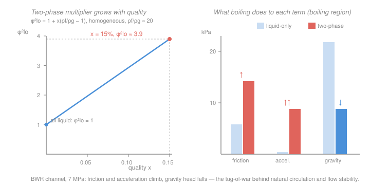

# Reactor Thermal-Hydraulics · Lesson 3.5: Two-phase pressure drop

> ⏱ ~15 min · Module 3: Two-phase flow, boiling, and critical heat flux · Builds on: [2.5 Pressure drop in the core](02-05-pressure-drop-core.md), [3.3 Quality, void fraction, and slip](03-03-quality-void-fraction-slip.md), [3.4 Two-phase flow regimes](03-04-two-phase-flow-regimes.md) · Unlocks: [4.1 Natural circulation and driving head](04-01-natural-circulation-driving-head.md), [4.2 Flow stability](04-02-flow-stability.md), Boss problem 3

## Why this matters

In [2.5](02-05-pressure-drop-core.md) acceleration was a rounding error and the four-term pressure tally was dominated by friction and spacer grids. Then the coolant boils. Vapor is roughly twenty times lighter than the liquid it replaces, so the *same* mass now has to fight its way through a stream that is mostly gas — friction climbs, the stream accelerates hard as it thins, and the column overhead suddenly weighs a fraction of what it did. A BWR runs its core deliberately boiling; even a PWR boils subcooled against the hot cladding. Getting the two-phase pressure drop right is what lets you size a boiling channel, and — because the *gravity* term collapses while the *friction* term climbs — it is the exact ingredient that makes [natural circulation](04-01-natural-circulation-driving-head.md) work and [flow stability](04-02-flow-stability.md) fail.

## The idea

Rerun the same channel from [2.5](02-05-pressure-drop-core.md), but now let it boil partway up. Three of the four contributions change, each in a different direction:

1. **Friction goes up — a lot.** A two-phase stream drags on the wall far harder than pure liquid at the same mass flux, because it moves much faster (it is mostly low-density vapor) and churns. We bookkeep this with one dimensionless fudge factor, the **two-phase multiplier** $\phi_{lo}^2$: compute the friction as if all the mass flowed as *liquid only*, then multiply by $\phi_{lo}^2$. At 15 % quality that multiplier is near 4 — friction quadruples.
2. **Acceleration becomes a real term.** In [2.5](02-05-pressure-drop-core.md) density barely moved and acceleration was ~1 kPa. Now density plummets from ~740 to ~190 kg/m³, so the stream must speed up several-fold — and pushing that momentum change costs pressure. What was negligible is now comparable to friction.
3. **Gravity gives back head.** The static weight of the column depends on its density, and a frothy vapor-liquid mixture is light. The lifted column costs *less* pressure than a liquid one — the gravitational drop *shrinks*.

Net for forced (pumped) flow: friction and acceleration climb, the gravity term relaxes, and the total usually rises. But the real story is the *reshaping* — the pressure budget stops being "friction plus grids" and becomes a tug-of-war between rising friction/acceleration and a collapsing gravity head. That tug-of-war is the whole subject of Module 4.

## The formal version

Write everything in **mass flux** $G=\dot m/A_{flow}$ (kg·m⁻²·s⁻¹) as before — it stays constant up the channel even as density falls. Let $x$ be the thermodynamic quality and $\alpha$ the void fraction (both from [3.3](03-03-quality-void-fraction-slip.md)), with saturated-liquid density $\rho_f$ and saturated-vapor density $\rho_g$ (kg·m⁻³).

**Frictional term — the two-phase multiplier.** Define

$$\Delta p_{2\phi,f} = \phi_{lo}^2\,\Delta p_{f,\text{lo}}, \qquad \Delta p_{f,\text{lo}} = f_{lo}\,\frac{L}{D_h}\,\frac{G^2}{2\rho_f},$$

where $\Delta p_{f,\text{lo}}$ is the friction you would get if the *total* mass flux $G$ flowed as **liquid only** (subscript $lo$), using the liquid friction factor $f_{lo}=0.184\,Re_{lo}^{-0.2}$ at $Re_{lo}=GD_h/\mu_f$. *In words: pretend the whole flow is liquid, then scale up by one factor to account for the vapor.*

The **homogeneous model** — treat the two phases as one well-mixed fluid moving at a single velocity — gives a closed form:

$$\boxed{\;\phi_{lo}^2 = 1 + x\!\left(\frac{\rho_f}{\rho_g}-1\right)\;}$$

*In words: the multiplier starts at 1 in pure liquid ($x=0$) and rises linearly with quality, steeply because $\rho_f/\rho_g$ is large (≈20 in a BWR).* Including the viscosity contrast refines it,

$$\phi_{lo}^2 = \left[1 + x\!\left(\frac{\rho_f}{\rho_g}-1\right)\right]\left[1 + x\!\left(\frac{\mu_f}{\mu_g}-1\right)\right]^{-0.25},$$

which lowers the density-only value by ~10 % at moderate quality (vapor is less viscous). For hand estimates the density form is enough. The homogeneous model over-predicts the drop at high pressure / low quality, where the phases actually slip ([3.3](03-03-quality-void-fraction-slip.md)); the empirical **Martinelli–Nelson** correlation tabulates $\phi_{lo}^2$ (and an integrated form) against pressure and quality to fix this, and is the standard for design.

**Accelerational term.** With $G$ fixed and specific volume rising from inlet to outlet,

$$\Delta p_{2\phi,a} = G^2\!\left[\left(\frac{1}{\rho}\right)_{\!out}-\left(\frac{1}{\rho}\right)_{\!in}\right], \qquad \frac{1}{\rho_m} = \frac{x}{\rho_g}+\frac{1-x}{\rho_f}\;\text{(homogeneous)}.$$

*In words: the momentum-flux jump as the thinning stream speeds up — same form as [2.5](02-05-pressure-drop-core.md), but now the density swing is enormous, so the term is no longer negligible.*

**Gravitational term.** For a vertical boiling channel,

$$\Delta p_{2\phi,g} = \int_0^{L}\bar\rho(z)\,g\,dz, \qquad \bar\rho = \alpha\rho_g + (1-\alpha)\rho_f,$$

with $\bar\rho$ the **two-phase mixture density** (void-weighted). *In words: the static weight of the column — but computed with the light mixture density, so it is much smaller than a liquid column's.* Since $\bar\rho < \rho_f$, this term is **lower** than in single phase: boiling relieves static head. (Upflow: gravity adds to the drop, so a smaller $\bar\rho$ means a smaller drop.)

**The total.** Add the subcooled-entry (single-phase) drop from [2.5](02-05-pressure-drop-core.md) to the boiling-region terms:

$$\Delta p_{tot} = \underbrace{\Delta p_{sub}}_{\text{single-phase entry}} + \underbrace{\phi_{lo}^2\,\Delta p_{f,\text{lo}}}_{\text{friction}\,\uparrow} + \underbrace{G^2\Delta(1/\rho)}_{\text{acceleration}\,\uparrow\uparrow} + \underbrace{\int\bar\rho\,g\,dz}_{\text{gravity}\,\downarrow}.$$

## Picture

## Worked examples

**Example 1 — the frictional drop of a boiling channel (Boss problem 3, friction piece).** A BWR fuel channel at 7 MPa: $G = 1500\ \mathrm{kg\,m^{-2}s^{-1}}$, $D_h = 0.0125\ \mathrm{m}$. Saturated properties $\rho_f = 740$, $\rho_g = 36.5\ \mathrm{kg/m^3}$, $\mu_f \approx 9.1\times10^{-5}\ \mathrm{Pa\,s}$. The flow is subcooled over the first $L_{sub}=0.7\ \mathrm{m}$, then saturated-boiling over $L_b = 3.0\ \mathrm{m}$, reaching exit quality $x_e = 0.15$.

*Density ratio and multiplier.* $\dfrac{\rho_f}{\rho_g} = \dfrac{740}{36.5} = 20.3$, so

$$\phi_{lo}^2(x_e) = 1 + 0.15\,(20.3-1) = 1 + 0.15\times19.3 \approx 3.9.$$

At the exit, boiling has nearly **quadrupled** the friction. But $\phi_{lo}^2$ grows from 1 at the start of boiling to 3.9 at the exit — using the exit value everywhere double-counts. For the homogeneous model $\phi_{lo}^2$ is *linear in $x$*, and $x$ rises roughly linearly up the boiling length, so the length-average is the value at the **mean quality** $\bar x = x_e/2 = 0.075$:

$$\bar\phi_{lo}^2 = 1 + 0.075\times19.3 \approx 2.45.$$

*Liquid-only friction over the boiling length.* $Re_{lo} = \dfrac{GD_h}{\mu_f} = \dfrac{1500\times0.0125}{9.1\times10^{-5}} \approx 2.06\times10^{5}$, so $f_{lo}=0.184\,(2.06\times10^5)^{-0.2}\approx0.0159$. Liquid dynamic head $\dfrac{G^2}{2\rho_f}=\dfrac{1500^2}{2\times740}\approx1.52\ \mathrm{kPa}$, and $L_b/D_h = 3.0/0.0125 = 240$:

$$\Delta p_{f,\text{lo}} = 0.0159\times240\times1.52\ \mathrm{kPa} \approx 5.8\ \mathrm{kPa}.$$

*Two-phase friction* (apply the mean multiplier):

$$\Delta p_{2\phi,f} = \bar\phi_{lo}^2\,\Delta p_{f,\text{lo}} = 2.45\times5.8 \approx 14.2\ \mathrm{kPa}.$$

*Subcooled entry* (single-phase liquid, [2.5](02-05-pressure-drop-core.md), $L_{sub}/D_h=56$): $\Delta p_{sub}=0.0159\times56\times1.52\approx1.4\ \mathrm{kPa}$.

*Total frictional:* $\Delta p_{f,tot} \approx 14.2 + 1.4 \approx 15.6\ \mathrm{kPa}$.

*Check.* Units: $\phi_{lo}^2$ dimensionless, everything else Pa as in [2.5](02-05-pressure-drop-core.md) ✓. Sense: the boiling region alone would be 5.8 kPa if it stayed liquid; boiling drives it to 14.2 kPa — a 2.45× penalty from vapor, exactly the multiplier's job. Use the exit multiplier by mistake and you'd get $3.9\times5.8=22.6$ kPa, ~60 % too high. ✓

**Example 2 — mixture density and the gravity head.** Same channel. At the exit slice the void fraction is $\alpha = 0.78$ (homogeneous, consistent with $x_e=0.15$; see [3.3](03-03-quality-void-fraction-slip.md)). The mixture density there:

$$\bar\rho = \alpha\rho_g + (1-\alpha)\rho_f = 0.78\times36.5 + 0.22\times740 = 28.5 + 162.8 \approx 191\ \mathrm{kg/m^3}.$$

That is **26 %** of the liquid density — the top of the channel is mostly steam and weighs almost nothing. Per meter of column the static drop is $\bar\rho g = 191\times9.81\approx1.88\ \mathrm{kPa/m}$, versus $\rho_f g = 740\times9.81\approx7.26\ \mathrm{kPa/m}$ for liquid.

For the whole boiling length the drop is $\int\bar\rho\,g\,dz$; void climbs fast then saturates, so the length-average density sits near the value at mean quality $\bar x=0.075$ ($\bar\alpha\approx0.62$, $\bar\rho\approx300\ \mathrm{kg/m^3}$). Over $L_b=3.0\ \mathrm{m}$:

$$\Delta p_{2\phi,g} \approx \bar\rho\,gL_b \approx 300\times9.81\times3.0 \approx 8.8\ \mathrm{kPa},$$

against an all-liquid column's $740\times9.81\times3.0 \approx 21.8\ \mathrm{kPa}$. Boiling has cut the gravity head by ~13 kPa.

*Check.* Units: $\mathrm{(kg/m^3)(m/s^2)(m)} = \mathrm{kg\,m^{-1}s^{-2}}=\mathrm{Pa}$ ✓. Sense: friction rose (Ex. 1), acceleration rises too — plug in $\Delta(1/\rho)$: $G^2(\frac{1}{191}-\frac{1}{740})=1500^2(0.00524-0.00135)\approx8.8\ \mathrm{kPa}$, up from ~1 kPa single-phase — yet gravity *dropped* by ~13 kPa. That ~13 kPa of "missing weight" is not lost; in a loop it becomes buoyancy. A hot, light core column beside a cold, heavy downcomer is precisely the driving head of [natural circulation, 4.1](04-01-natural-circulation-driving-head.md). ✓

## Watch out

- **You might think $\phi_{lo}^2$ scales the whole channel pressure drop — but it multiplies only the *frictional* term, and only over the *boiling* length.** The subcooled entry is ordinary single-phase [2.5](02-05-pressure-drop-core.md), and acceleration and gravity have their own two-phase forms. Multiplying the total by $\phi_{lo}^2$ triple-counts.
- **You might think more voids always means more pressure drop — but gravity runs the other way.** Voids lighten the column and *reduce* the gravitational term. The total rises only because friction and acceleration outrun that relief. In [natural circulation](04-01-natural-circulation-driving-head.md) the gravity relief is the *point*, not a loss.
- **You might confuse $\phi_{lo}^2$ (liquid-*only*) with $\phi_f^2$ (liquid-*phase*).** $\phi_{lo}^2$ references the total flow as if all liquid — the convenient one here. Martinelli's $\phi_f^2$ references only the liquid *fraction* actually flowing and pairs with the parameter $X_{tt}$. Different denominators; grabbing the wrong reference is a silent factor-of-several error. State which reference a correlation uses before you trust its number.

## One-liner

> Boiling reshapes the pressure budget: friction climbs by the two-phase multiplier $\phi_{lo}^2=1+x(\rho_f/\rho_g-1)$, acceleration wakes up as density plummets, and the lightened column gives back static head — and that reshaping is what natural circulation runs on and flow stability trips over.

## Problems

**P1 (🟢)** A boiling channel reaches exit quality $x_e = 0.10$ at 7 MPa, with $\rho_f = 740$ and $\rho_g = 36.5\ \mathrm{kg/m^3}$. (a) Find the homogeneous two-phase multiplier $\phi_{lo}^2$ at the exit. (b) Find the length-average multiplier $\bar\phi_{lo}^2$ (mean quality). (c) If the liquid-only frictional drop over the boiling length is $\Delta p_{f,\text{lo}} = 6.0\ \mathrm{kPa}$, what is the two-phase frictional drop?

**P2 (🟡)** For the Example-1 channel ($G=1500\ \mathrm{kg\,m^{-2}s^{-1}}$, $\rho_f=740$, $\rho_g=36.5$), the flow enters the boiling region as saturated liquid ($x=0$) and leaves at $x_e=0.15$. Using the homogeneous mixture specific volume $1/\rho_m = x/\rho_g + (1-x)/\rho_f$, compute the **accelerational** pressure drop $\Delta p_{2\phi,a}=G^2[(1/\rho)_{out}-(1/\rho)_{in}]$. Compare it to the ~1 kPa single-phase acceleration of [2.5](02-05-pressure-drop-core.md) and say in one line why it grew.

**P3 (🔴)** *Bridge to natural circulation.* A loop has a boiling core leg (height $H=3.0\ \mathrm{m}$, length-average mixture density $\bar\rho_{hot}\approx300\ \mathrm{kg/m^3}$) and a cold liquid downcomer of the same height ($\rho_{cold}=740\ \mathrm{kg/m^3}$). The buoyancy *driving* head is $\Delta p_{dr}=(\rho_{cold}-\bar\rho_{hot})\,gH$. Compute it, and compare it to the ~16 kPa of frictional loss from Example 1 — could this loop circulate with the pumps off?

Solutions

**P1** Density ratio $\rho_f/\rho_g = 740/36.5 = 20.3$, so $\rho_f/\rho_g - 1 = 19.3$.

(a) Exit: $\phi_{lo}^2(x_e) = 1 + 0.10\times19.3 = 1 + 1.93 \approx 2.9.$

(b) Mean quality $\bar x = x_e/2 = 0.05$ (homogeneous $\phi_{lo}^2$ is linear in $x$, and $x$ rises ~linearly up the channel):

$$\bar\phi_{lo}^2 = 1 + 0.05\times19.3 = 1 + 0.97 \approx 1.96.$$

(c) $\Delta p_{2\phi,f} = \bar\phi_{lo}^2\,\Delta p_{f,\text{lo}} = 1.96\times6.0 \approx 11.8\ \mathrm{kPa}.$

*Check.* At half the quality of Example 1 the mean multiplier is ~1.96 vs ~2.45 there — lower quality, gentler penalty, as it must be. Using the exit value (2.9) would overstate the boiling-length friction by ~50 %. ✓

**P2** Inlet specific volume (saturated liquid, $x=0$): $1/\rho_{in} = 1/740 = 1.35\times10^{-3}\ \mathrm{m^3/kg}$.

Exit ($x=0.15$): $1/\rho_{out} = \dfrac{0.15}{36.5} + \dfrac{0.85}{740} = 4.11\times10^{-3} + 1.15\times10^{-3} = 5.26\times10^{-3}\ \mathrm{m^3/kg}$ (so $\rho_m\approx190\ \mathrm{kg/m^3}$).

$$\Delta p_{2\phi,a} = G^2\big[(1/\rho)_{out}-(1/\rho)_{in}\big] = 1500^2\,(5.26-1.35)\times10^{-3} = 2.25\times10^6\times3.91\times10^{-3} \approx 8.8\ \mathrm{kPa}.$$

*Why it grew:* single-phase density barely changes, so $\Delta(1/\rho)$ was tiny (~1 kPa); here density falls ~4×, so the specific volume — and the momentum the stream must gain — jumps almost fourfold.

*Check.* Units: $\mathrm{(kg\,m^{-2}s^{-1})^2\,(m^3/kg)} = \mathrm{kg\,m^{-1}s^{-2}}=\mathrm{Pa}$ ✓. At ~8.8 kPa, acceleration is now comparable to the two-phase friction — the "rounding error" of [2.5](02-05-pressure-drop-core.md) has become a leading term. ✓

**P3** Driving head:

$$\Delta p_{dr} = (\rho_{cold}-\bar\rho_{hot})\,gH = (740-300)\times9.81\times3.0 = 440\times29.43 \approx 12.9\ \mathrm{kPa}.$$

Compared to ~16 kPa of core frictional loss, the buoyancy head (~13 kPa) is the same order of magnitude but a bit short — this bare core leg alone is close, and a real loop trims losses (fewer grids, larger downcomer) or accepts a lower flow until $\sum(f\frac{L}{D_h}+K)\frac{G^2}{2\rho}$ drops to meet 13 kPa. So yes, a boiling loop *can* circulate pump-free, and the flow self-adjusts until driving head equals total loss — exactly the balance solved in [4.1](04-01-natural-circulation-driving-head.md).

*Check.* Units: $\mathrm{(kg/m^3)(m/s^2)(m)}=\mathrm{Pa}$ ✓. Sense: the entire driving head is the gravity relief from Example 2 — the 13 kPa the column *stopped* weighing is the 13 kPa now available to push flow. Same physics, opposite sign of usefulness. ✓

## Flashback

**From Lesson 2.5 (Pressure drop in the core):** A single-phase liquid channel runs at $G = 2000\ \mathrm{kg\,m^{-2}s^{-1}}$, $D_h = 0.011\ \mathrm{m}$, $L = 3.5\ \mathrm{m}$, with $\rho = 730\ \mathrm{kg/m^3}$ and $\mu = 9.0\times10^{-5}\ \mathrm{Pa\,s}$. Find $Re$, the Darcy friction factor ($f=0.184\,Re^{-0.2}$), and the frictional pressure drop $\Delta p_f$. (Fresh variant — new $G$ and geometry.)

Solution

$$Re = \frac{GD_h}{\mu} = \frac{2000\times0.011}{9.0\times10^{-5}} = \frac{22}{9.0\times10^{-5}} \approx 2.44\times10^{5}.$$

$$f = 0.184\,(2.44\times10^5)^{-0.2} = 0.184\times0.0837 \approx 0.0154.$$

Dynamic head $\dfrac{G^2}{2\rho} = \dfrac{2000^2}{2\times730} = \dfrac{4.0\times10^6}{1460} \approx 2.74\ \mathrm{kPa}$, and $L/D_h = 3.5/0.011 = 318$:

$$\Delta p_f = f\,\frac{L}{D_h}\,\frac{G^2}{2\rho} = 0.0154\times318\times2.74\ \mathrm{kPa} \approx 13.4\ \mathrm{kPa}.$$

*Check.* Units consistent (dimensionless × dimensionless × Pa) ✓. This is the *liquid-only* baseline — the exact number that a two-phase multiplier $\phi_{lo}^2$ would scale up the moment this channel started to boil. ✓

## Connections

- **Backward:** this reruns the four-term tally of [2.5](02-05-pressure-drop-core.md) with two-phase corrections, and feeds on the **quality, void, and slip** of [3.3](03-03-quality-void-fraction-slip.md) (quality sets the multiplier, void sets the mixture density) and the **regimes** of [3.4](03-04-two-phase-flow-regimes.md), which decide when the homogeneous model is trustworthy versus when slip demands Martinelli–Nelson.
- **Forward:** [4.1 Natural circulation](04-01-natural-circulation-driving-head.md) turns the *lost* gravity head into a *driving* head — the loop flow is set by balancing it against these very loss terms. [4.2 Flow stability](04-02-flow-stability.md) comes straight out of this reshaping: because friction and acceleration climb with boiling while the gravity term falls, the channel's $\Delta p(G)$ curve can bend back on itself (N-shaped), and Boss problem 3 asks you to total a boiling channel's drop and read its stability from that shape.
- **Sideways:** the homogeneous model is just the equilibrium two-phase mixture of [`engineering-thermodynamics` 1.2 (phase behavior)](../../engineering-thermodynamics/lessons/01-02-phase-behavior-pure-substance.md) pressed into a momentum balance — one fluid, void-weighted properties, quality as the mixing variable.
