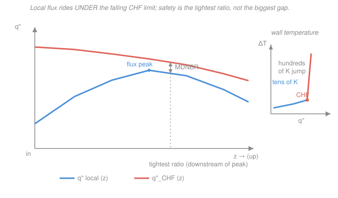

# Reactor Thermal-Hydraulics · Lesson 3.6: Critical heat flux and DNB

> ⏱ ~15 min · Module 3: Two-phase flow, boiling, and critical heat flux · Builds on: [3.1 The boiling curve and pool-boiling regimes](03-01-boiling-curve-pool-boiling-regimes.md), [3.3 Quality, void fraction, and slip](03-03-quality-void-fraction-slip.md), [3.4 Two-phase flow regimes](03-04-two-phase-flow-regimes.md) · Unlocks: [4.6 Loss-of-coolant and thermal margins](04-06-loca-thermal-margins.md), Boss problem 3

## Why this matters

Every number in this course so far has been a comfort: fuel stays 1000 K below melt, clad runs a few tens of K above the coolant, pressure drop is under a percent of system pressure. This lesson is where the comfort ends. There is a single flux — the **critical heat flux (CHF)** — at which the wall stops being wetted by liquid, its heat-transfer coefficient collapses by more than an order of magnitude, and its temperature leaps *hundreds* of kelvin in seconds. The fuel power doesn't care; it keeps arriving. Cross this line and the cladding can fail before an operator can blink. This is why reactors are not licensed on "does the clad melt?" but on a *ratio* — how far the local flux sits below the CHF — and why that ratio, not the peak temperature, is **the course-limiting safety criterion**. It closes [Boss problem 3](../syllabus.md) and feeds straight into the margins of [Module 4](04-06-loca-thermal-margins.md).

## The idea

Recall the [boiling curve](03-01-boiling-curve-pool-boiling-regimes.md): as you push more flux through a wall in nucleate boiling, bubbles form faster, stir the liquid harder, and carry heat away superbly — the wall barely warms. Nucleate boiling is a *stabilizing* feedback: more flux, only a little more wall superheat. But there's a ceiling. Push hard enough and the bubbles merge into a continuous **vapor blanket** that glues itself to the wall. Vapor is a lousy conductor. The liquid that was doing all the cooling can no longer reach the metal. That is the **boiling crisis**, and it happens two ways depending on where you are in the channel:

- **DNB — departure from nucleate boiling** (the PWR failure mode). In **subcooled or low-quality** flow, the wall is hot but the bulk liquid is still below saturation. Bubbles are supposed to collapse back. At CHF they instead coalesce into a vapor film right at the wall before the liquid can rewet it. The wall goes dry under a blanket of its own steam.
- **Dryout** (the BWR failure mode). In **high-quality annular flow** ([3.4](03-04-two-phase-flow-regimes.md)), the wall is already cooled by a thin *liquid film* with a vapor core rushing past. Evaporation and droplet entrainment thin that film until — at some elevation — it simply runs out. The wall dries from lack of liquid, not from a vapor blanket.

Same catastrophe from opposite ends of the quality scale: **DNB at low quality, dryout at high quality.** Either way, once the wall is dry, $h$ collapses and the wall temperature bolts upward to shed the same flux through a far worse path.

## The formal version

The number that guards against this is a margin ratio:

$$\boxed{\ DNBR = \frac{q''_{CHF}}{q''_{local}}\ }$$

with $q''_{local}$ the actual heat flux at a point on the cladding surface (W·m⁻², from the local linear rating $q'$ via $q''=q'/\pi D_{rod}$) and $q''_{CHF}$ the critical heat flux *evaluated at the same local conditions* — same pressure $p$, mass flux $G$, and quality $x$. **In words: how many times the local flux you could crank up before the wall dries.** $DNBR>1$ means you have margin; $DNBR=1$ is the cliff edge.

**Where does $q''_{CHF}$ come from?** Not from first principles — CHF is a messy, geometry-sensitive phenomenon fit to thousands of rod-bundle tests. For PWRs the classic is the **W-3 (Tong) correlation**, which returns

$$q''_{CHF}=f\!\left(p,\ G,\ x,\ D_h\right)$$

— a fitted function that *falls* as quality $x$ rises and as mass flux $G$ drops. You don't memorize its form (it's a page of coefficients); you memorize its *role*: given local $p, G, x, D_h$, it hands back the flux at which that spot would burn out. For BWRs the metric is repackaged as the **critical power ratio (CPR)** — the factor by which the *whole bundle's power* could rise before *any* node reaches dryout — with the minimum over the cycle, **MCPR**, the licensed quantity. DNBR and CPR are the same idea (local flux vs. burnout for a PWR; integral power vs. burnout for a BWR); this lesson works in the DNBR form and names the BWR analog where it matters.

**The design limit.** Regulators don't allow $DNBR=1.01$. The correlation itself scatters, and the plant's operating conditions are uncertain, so the criterion is imposed with **95/95 confidence** — 95% probability, 95% confidence that DNB is *not* occurring — which for W-3 lands the limit near

$$DNBR \ge 1.30 \quad(\text{typical design/safety limit}).$$

**In words: keep the local flux at least ~30% below the correlated burnout flux, everywhere, all the time.** The tightest point up the whole channel — the **minimum DNBR (MDNBR)** — is what gets compared to 1.30. Because $q''_{CHF}$ falls as quality climbs downstream while $q''_{local}$ peaks near the (cosine) flux maximum, the MDNBR sits **downstream of the flux peak** — the two curves pinch where high flux meets already-degraded CHF.

## Picture

The inset is the whole reason DNBR is the limiting criterion: below CHF the wall superheat is *tens* of K; touch CHF and it jumps to *hundreds*. It's a cliff, not a slope.

## Worked examples

**Example 1 — Boss problem 3 close-out: is the channel safe, and by how much?** A BWR channel (7 MPa) reaches an exit quality of $15\%$. At its **highest-power node**, the peak linear rating is $q'=44\ \mathrm{kW/m}$ on a rod of outer diameter $D_{rod}=0.0112\ \mathrm{m}$. A CHF correlation, evaluated at the local $p, G, x$ of that node, returns $q''_{CHF}=1.75\ \mathrm{MW/m^2}$.

*Local surface heat flux* (spread the linear rating over the rod circumference):

$$q''_{local}=\frac{q'}{\pi D_{rod}}=\frac{44{,}000}{\pi\times0.0112}=\frac{44{,}000}{0.03519}\approx1.25\times10^{6}\ \mathrm{W/m^2}=1.25\ \mathrm{MW/m^2}.$$

*Margin ratio:*

$$DNBR=\frac{q''_{CHF}}{q''_{local}}=\frac{1.75}{1.25}\approx1.40.$$

Compare to the limit: $1.40>1.30$, so the channel is **safe**. By how much? Two honest ways to say it:

- It clears the design limit by $1.40-1.30=0.10$, i.e. the ratio has a $0.10$ cushion.
- Holding $q''_{CHF}$ fixed, the local flux could rise by a factor $1.40/1.30\approx1.08$ — about **8% more power** — before the channel violates the 1.30 criterion (and ~40% more before *actual* dryout at $DNBR=1$).

*Check.* Units: $q''=\mathrm{W/m}\div\mathrm{m}=\mathrm{W/m^2}$ ✓; the ratio is dimensionless ✓. Magnitude sense: ~1.25 MW/m² is a realistic BWR peak surface flux, and a burnout flux of ~1.75 MW/m² at 15% quality is in-band — CHF has fallen from its several-MW/m² subcooled value precisely because the flow is now high-quality (near dryout territory, [3.4](03-04-two-phase-flow-regimes.md)). Note this is the *local* CHFR; a BWR is formally licensed on **MCPR** (an integral bundle-power ratio, limited near 1.2–1.3), but the pass/fail verdict here is the same. **Boss 3 verdict: safe, MDNBR ≈ 1.40 vs. a 1.30 limit — a thin but real ~8% overpower margin.**

**Example 2 — why it's a cliff, not a slope.** Take that same node at $q''_{local}=1.25\ \mathrm{MW/m^2}$, sat temperature $T_{sat}\approx286\ ^\circ\mathrm{C}$ at 7 MPa. The wall sheds its flux by $q''=h\,\Delta T_{wall}$, where $\Delta T_{wall}=T_{wall}-T_{sat}$.

*Just below CHF* (nucleate boiling, a superb $h_{nb}\approx50\ \mathrm{kW/(m^2K)}$):

$$\Delta T_{wall}=\frac{q''}{h_{nb}}=\frac{1.25\times10^{6}}{5.0\times10^{4}}=25\ \mathrm{K}\ \Rightarrow\ T_{wall}\approx286+25=311\ ^\circ\mathrm{C}.$$

*Just past CHF* (the wall is now blanketed/dried; film-boiling $h_{fb}\approx1.5\ \mathrm{kW/(m^2K)}$, ~30× worse):

$$\Delta T_{wall}=\frac{q''}{h_{fb}}=\frac{1.25\times10^{6}}{1.5\times10^{3}}\approx830\ \mathrm{K}\ \Rightarrow\ T_{wall}\approx286+830\approx1120\ ^\circ\mathrm{C}.$$

Here's the physics of the cliff: **the flux is set by fission power, not by the wall.** The pellet delivers ~1.25 MW/m² no matter what the surface does. So when $h$ collapses by a factor of ~30, $\Delta T_{wall}$ *must* rise by ~30 to pass the same flux — an almost discontinuous leap of ~800 K. And there's no stable resting point in between: past CHF the boiling curve has *negative* slope (transition boiling — more superheat, *less* flux), so the wall can't settle partway; it shoots all the way to the film-boiling branch. A Zircaloy clad ([`nuclear-materials` 4.1](../../nuclear-materials/lessons/04-01-zirconium-alloys-cladding.md)) that was fine at 311 °C is now near 1120 °C, into the regime where the zirconium–water reaction runs away above ~1200 °C. That is why licensing is written against $DNBR\ge1.30$: the penalty for crossing CHF isn't a gentle degradation you can back out of — it's a step change that can destroy the fuel in seconds.

*Check.* Units: $\Delta T=\mathrm{(W/m^2)}/\mathrm{(W/m^2K)}=\mathrm{K}$ ✓. Sense: tens of K vs. hundreds of K, a >30× jump matching the $h$ collapse — exactly the inset in the figure. ✓

## Watch out

- **You might think a higher wall temperature is what you design against — but you design against the *ratio*, not the temperature.** At normal power the clad is comfortably cool; the danger isn't today's temperature, it's how little headroom stands between today's flux and the burnout flux. A pin can be at a perfectly safe 320 °C and still have a dangerously low DNBR if it's running near its local CHF. Report margin as $q''_{CHF}/q''_{local}$, always.
- **You might expect the minimum DNBR at the flux peak — but it's downstream of it.** $q''_{local}$ peaks near the cosine flux maximum, yet $q''_{CHF}$ keeps *falling* as quality builds up the channel. The tightest ratio is where a still-high flux meets an already-degraded CHF, which is past the midplane. (Same "peaks live at different elevations" lesson as [Boss problem 1](../syllabus.md)'s clad vs. fuel peaks.)
- **You might conflate CHF with fuel melting — they're different limits, and CHF is hit first.** Melting is a fuel-*centerline* pellet limit (~2865 °C for UO₂, [`nuclear-materials` 3.2](../../nuclear-materials/lessons/03-02-fuel-temperature-profile-restructuring.md)). CHF is a *cladding-surface* coolability limit. In a PWR the boiling crisis strikes long before the pellet centerline approaches melt — DNB is the binding constraint, which is exactly why the license is written on DNBR.

## One-liner

> Critical heat flux is the wall-drying cliff — DNB in subcooled PWR flow (a vapor blanket), dryout in high-quality BWR flow (the film runs out) — and safety is a margin ratio $DNBR=q''_{CHF}/q''_{local}\ge1.30$, because crossing it spikes the wall hundreds of K in seconds.

## Problems

**P1 (🟢)** A PWR node runs at a local surface heat flux $q''_{local}=1.60\ \mathrm{MW/m^2}$. The W-3 correlation, at that node's local $p, G, x$, returns $q''_{CHF}=2.30\ \mathrm{MW/m^2}$. Compute the DNBR and state whether the node meets a 1.30 design limit, and by what margin.

**P2 (🟡)** For the P1 node ($DNBR=1.44$), suppose the plant proposes a power uprate that raises every local flux proportionally. Assuming $q''_{CHF}$ stays fixed, what is the maximum fractional overpower before the node hits the 1.30 limit? Then explain in one sentence why the *true* allowable uprate is smaller than this estimate.

**P3 (🔴)** A node carries $q''_{local}=1.10\ \mathrm{MW/m^2}$ at $T_{sat}=286\ ^\circ\mathrm{C}$. In nucleate boiling $h_{nb}=45\ \mathrm{kW/(m^2K)}$; just past CHF the wall enters film boiling with $h_{fb}=1.30\ \mathrm{kW/(m^2K)}$. Find the wall temperature just below and just above CHF. Comment on the cladding, given zirconium's oxidation runs away above ~1200 °C.

Solutions

**P1** Direct ratio:

$$DNBR=\frac{q''_{CHF}}{q''_{local}}=\frac{2.30}{1.60}=1.44.$$

Since $1.44>1.30$, the node **passes**. Margin: it clears the limit by $1.44-1.30=0.14$, or equivalently the flux could rise by $1.44/1.30\approx1.11$ (≈11%) before violating the criterion.

*Check.* Dimensionless ratio ✓; a DNBR in the low 1.4s is a typical, comfortable-but-not-lavish steady-state value. ✓

**P2** With $q''_{CHF}$ held fixed and $q''_{local}$ scaling with power by a factor $\lambda$, the DNBR scales as $1/\lambda$:

$$DNBR(\lambda)=\frac{1.44}{\lambda}.\qquad \text{Set }=1.30:\quad \lambda_{max}=\frac{1.44}{1.30}\approx1.11.$$

So about **11% overpower** by this estimate. The true allowable is smaller because raising power also raises the coolant enthalpy and hence the local **quality**, and $q''_{CHF}$ *falls* with quality — so $q''_{CHF}$ does **not** stay fixed; it drops as you uprate, eroding the ratio from both sides.

*Check.* $DNBR\propto1/\lambda$ gives $\lambda_{max}=DNBR_0/DNBR_{limit}$, dimensionless ✓; the caveat correctly identifies the conservative assumption. ✓

**P3** Below CHF (nucleate):

$$\Delta T_{wall}=\frac{q''}{h_{nb}}=\frac{1.10\times10^{6}}{4.5\times10^{4}}\approx24.4\ \mathrm{K}\ \Rightarrow\ T_{wall}\approx286+24=310\ ^\circ\mathrm{C}.$$

Above CHF (film boiling):

$$\Delta T_{wall}=\frac{q''}{h_{fb}}=\frac{1.10\times10^{6}}{1.30\times10^{3}}\approx846\ \mathrm{K}\ \Rightarrow\ T_{wall}\approx286+846\approx1132\ ^\circ\mathrm{C}.$$

The clad vaults from a safe ~310 °C to ~1132 °C — past the ~1200 °C runaway threshold within the excursion's reach, so the Zircaloy would begin rapid steam oxidation, embrittle, and risk failure. This is precisely the "cliff" the DNBR limit exists to keep the channel away from.

*Check.* Units $\mathrm{(W/m^2)/(W/m^2K)}=\mathrm{K}$ ✓; the ~35× ratio of temperature rises equals the ~35× ratio of the two $h$ values ($45/1.3$) at fixed flux ✓. ✓

## Flashback

**From Lesson 3.3 (Quality, void fraction, and slip):** A BWR channel at 7 MPa reaches a thermodynamic quality $x=0.12$ at some elevation. Using the **homogeneous** (no-slip) model with $\rho_g=36.5\ \mathrm{kg/m^3}$ and $\rho_f=740\ \mathrm{kg/m^3}$, estimate the void fraction $\alpha$ there. (Fresh variant — different quality from the Boss-3 exit value.)

Solution

Homogeneous void fraction:

$$\alpha=\frac{1}{1+\dfrac{1-x}{x}\,\dfrac{\rho_g}{\rho_f}}=\frac{1}{1+\dfrac{0.88}{0.12}\times\dfrac{36.5}{740}}.$$

Evaluate the pieces: $\dfrac{0.88}{0.12}=7.33$ and $\dfrac{36.5}{740}=0.0493$, so the denominator is $1+7.33\times0.0493=1+0.362=1.362$, giving

$$\alpha=\frac{1}{1.362}\approx0.73.$$

*Check.* Dimensionless, and $0<\alpha<1$ ✓. Sense: a mere 12% quality *by mass* already fills ~73% of the cross-section *by volume* — because vapor is ~20× lighter than the liquid, a little mass is a lot of space. That's why the flow is deep into the annular regime and why CHF has degraded toward dryout by the time quality reaches 15% in the Boss problem. A real BWR runs some slip ($S>1$), which would push $\alpha$ a bit lower than this homogeneous estimate. ✓

## Connections

- **Backward:** CHF is the peak of the [boiling curve](03-01-boiling-curve-pool-boiling-regimes.md) from [3.1](03-01-boiling-curve-pool-boiling-regimes.md) — the ceiling of nucleate boiling — now placed inside a *flowing, heated channel* where [quality and void](03-03-quality-void-fraction-slip.md) ([3.3](03-03-quality-void-fraction-slip.md)) climb up the channel and the [flow regime](03-04-two-phase-flow-regimes.md) ([3.4](03-04-two-phase-flow-regimes.md)) sets whether burnout arrives as a DNB vapor blanket (low quality) or annular dryout (high quality). The wall-temperature excursion is the same $q''=h\,\Delta T$ film-drop bookkeeping as single-phase [convection](02-02-convective-heat-transfer-film-drop.md), only with $h$ falling off a cliff — and it draws on the boiling heat transfer of [`heat-transfer` 3.6](../../heat-transfer/lessons/03-06-boiling-condensation.md).
- **Forward:** DNBR is *the* thermal-margin currency of [Module 4](04-06-loca-thermal-margins.md). In [4.6 Loss-of-coolant and thermal margins](04-06-loca-thermal-margins.md), a transient that drops $G$ or raises power collapses the DNBR toward 1, and the whole LOCA/PCT safety case is a fight to keep margin to CHF (and to melt). It also sets the ceiling that [natural circulation](04-01-natural-circulation-driving-head.md) must respect once the pumps are gone.
- **Sideways (the design coupling):** this closes the trade opened in [2.5](02-05-pressure-drop-core.md) — fatter channels or fewer spacer grids cut pump power but lower $G$, and CHF *falls* with $G$, so the same move that saves pumping erodes DNBR. Pressure drop, film temperature, and CHF margin are three faces of one optimization, and [Boss problem 3](../syllabus.md) is where you finally price all three against a hard 1.30 limit.
