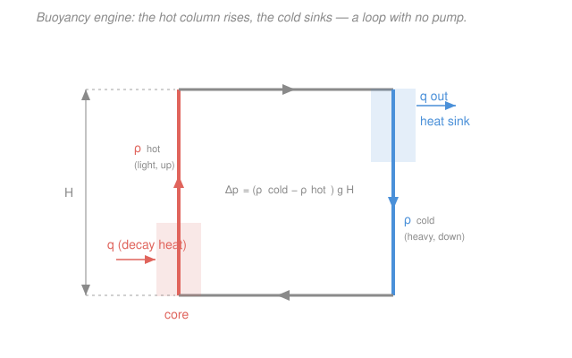

# Reactor Thermal-Hydraulics · Lesson 4.1: Natural circulation and driving head

> ⏱ ~15 min · Module 4: Natural circulation, neutronic coupling, and safety margins · Builds on: [2.1 Coolant energy balance and bulk temperature](02-01-coolant-energy-balance-bulk-temperature.md), [2.5 Pressure drop in the core](02-05-pressure-drop-core.md), [`heat-transfer` 3.5 Natural convection](../../heat-transfer/lessons/03-05-natural-convection.md) · Unlocks: [4.2 Flow stability](04-02-flow-stability.md), [4.6 LOCA thermal margins](04-06-loca-thermal-margins.md), Boss problem 4

## Why this matters

Station blackout: the grid is gone, the diesels won't start, the reactor coolant pumps are dead. The core is still making decay heat — a few percent of full power, tens of megawatts — and it has to go *somewhere* or the fuel melts. What saves you is that you never turned gravity off. Heat the coolant in the core and it gets lighter; cool it at an elevated heat sink and it gets heavier; the heavy column falls and shoves the light column up, and the loop circulates *on its own*, no pump, no AC power. This is **natural circulation**, and it is the beating heart of passive safety in every modern reactor. This lesson builds the buoyancy engine and sizes the flow it can sustain — the direct setup for [flow stability (4.2)](04-02-flow-stability.md) and for [LOCA passive cooling (4.6)](04-06-loca-thermal-margins.md).

## The idea

In [2.5](02-05-pressure-drop-core.md) a pump supplied the pressure to overcome friction, grids, and elevation. Kill the pump and one term you dismissed there comes back as the *hero*: elevation. In a closed loop, the up-leg (core, hot) and the down-leg (downcomer, cold) are the **same height** $H$, so their static heads normally cancel — that's why 2.5 said the pump only net-fights friction. But heat the up-leg and the cancellation breaks: hot coolant is *less dense*, so the hot column weighs less than the cold column beside it. That weight imbalance is a net downward push on the cold side — and around a closed loop, a net push that drives flow.

Picture two water columns of equal height on a see-saw. Cold on both sides: balanced, nothing moves. Now warm one side — it lightens, the cold side outweighs it, the cold side sinks and pushes the warm side up. The fluid can't just tip and stop, because it's a loop: the cold that sinks becomes the hot that rises after it passes through the core. A self-sustaining merry-go-round, powered purely by the temperature difference the core itself creates. The stronger you heat (bigger $\Delta T$), the bigger the density gap, the harder the loop turns.

Two forces set the operating point. The **driving head** (buoyancy) pushes the flow; the **loop losses** (friction + form, exactly the sum from 2.5) resist it. Flow rises until they balance. And there's a feedback: faster flow carries heat away faster, which *shrinks* $\Delta T$, which *weakens* the driving head. So the flow and the temperature rise are locked together — you solve for them as a pair.

## The formal version

**Driving head.** Take a loop of thermal height $H$ (m) — the vertical distance between the mid-height of the heat source (core) and the mid-height of the heat sink. The hot leg has density $\rho_{hot}$ and the cold leg $\rho_{cold}$ (kg·m⁻³). The net buoyant pressure the loop develops is the difference of the two static columns:

$$\Delta p_{dr} = (\rho_{cold} - \rho_{hot})\,g\,H, \qquad g = 9.81\ \mathrm{m/s^2}.$$

*In words: the driving head is the extra weight of the cold column over the hot column, over the loop height.* Now write the density difference in terms of temperature. The **volumetric thermal expansion coefficient** $\beta$ (K⁻¹) is defined by $\beta = -\frac1\rho\frac{\partial\rho}{\partial T}$, so for a temperature difference $\Delta T = T_{hot}-T_{cold}$ (K), $\rho_{cold}-\rho_{hot}\approx \rho\beta\,\Delta T$ to first order (with $\rho$ a mean loop density). Hence

$$\boxed{\ \Delta p_{dr} \approx \rho\,\beta\,\Delta T\,g\,H\ }$$

*In words: the pump has been replaced by a "gravity pump" whose pressure is set by how tall the loop is and how big a temperature difference the core sustains.* This is the same Boussinesq buoyancy that drove the boundary-layer flow in [`heat-transfer` 3.5](../../heat-transfer/lessons/03-05-natural-convection.md) — here organized into a plumbed loop instead of a free plume.

**Loop momentum balance.** At steady state the driving head is spent entirely on the loop's resistance — the friction and form losses from [2.5](02-05-pressure-drop-core.md), summed all the way around the circuit and written on the common mass flux $G=\dot m/A$ (kg·m⁻²·s⁻¹):

$$\Delta p_{dr} = \underbrace{\sum\left(f\frac{L}{D_h}+K\right)}_{\displaystyle \equiv\, R_{loop}}\,\frac{G^2}{2\rho}.$$

*In words: buoyancy in, friction out — whatever the gravity pump produces, the piping eats.* The bracketed sum is the loop's total **resistance coefficient** $R_{loop}$ (dimensionless), evaluated at the flow's Reynolds number ($f\approx0.184\,Re^{-0.2}$, $Re=GD_h/\mu$). Solving for the flux the loop can push:

$$G = \sqrt{\frac{2\rho\,\Delta p_{dr}}{R_{loop}}} = \sqrt{\frac{2\rho^2\beta\,\Delta T\,g\,H}{R_{loop}}}\,,\qquad \dot m = G\,A.$$

**Closing the loop — the energy balance.** But $\Delta T$ isn't free: it's whatever temperature rise the flow $\dot m$ develops carrying the core's heat $q$ (W). That's the [coolant energy balance from 2.1](02-01-coolant-energy-balance-bulk-temperature.md):

$$q = \dot m\,c_p\,\Delta T = G\,A\,c_p\,\Delta T,$$

with $c_p$ the specific heat (J·kg⁻¹·K⁻¹). *In words: the same $\Delta T$ that powers the buoyancy is the one the coolant picks up removing the heat.* Now you have **two equations in two unknowns** ($G$ and $\Delta T$) — momentum and energy, coupled through $\Delta T$. Eliminate $\Delta T$ ($\Delta T = q/(GAc_p)$, sub into the momentum result and square):

$$G^2 = \frac{2\rho^2\beta g H}{R_{loop}}\cdot\frac{q}{G A c_p} \;\Longrightarrow\; \boxed{\ G = \left(\frac{2\rho^2\beta g H\,q}{R_{loop}\,A\,c_p}\right)^{1/3}\ }$$

*In words: natural-circulation flow grows only as the cube root of the power to be removed — double the decay heat and the flow rises just 26%.* That weak $q^{1/3}$ law is the whole story of passive cooling: the loop can't sprint, but it doesn't need to. Natural-circ flow is a small fraction of forced flow (often ~1–5%), yet decay heat is a small fraction of full power, so the modest gravity-driven flow is enough to carry it — with the $\Delta T$ settling wherever the two equations agree.

## Picture

## Worked examples

**Example 1 — the gravity pump, and the flow it pushes.** A decay-heat removal loop has thermal height $H = 10\ \mathrm{m}$ and runs a temperature difference $\Delta T = 30\ \mathrm{K}$ between hot and cold legs. Warm water: $\rho \approx 730\ \mathrm{kg/m^3}$, $\beta \approx 2\times10^{-3}\ \mathrm{K^{-1}}$, $c_p \approx 5.4\ \mathrm{kJ/(kg\,K)}$. The loop's total resistance is $R_{loop}\approx 40$ (evaluated at the expected $Re$) and the core flow area is $A = 0.5\ \mathrm{m^2}$.

*Driving head:*

$$\Delta p_{dr} = \rho\beta\,\Delta T\,gH = 730\times(2\times10^{-3})\times30\times9.81\times10 \approx 4.30\times10^{3}\ \mathrm{Pa} = 4.30\ \mathrm{kPa}.$$

Tiny — about **4 kPa**, a rounding error next to the ~100 kPa a pump supplies (2.5). Buoyancy is a weak pump. *Mass flux* it can drive:

$$G = \sqrt{\frac{2\rho\,\Delta p_{dr}}{R_{loop}}} = \sqrt{\frac{2\times730\times4300}{40}} = \sqrt{1.57\times10^{5}} \approx 396\ \mathrm{kg\,m^{-2}s^{-1}}.$$

So $v = G/\rho \approx 0.54\ \mathrm{m/s}$ and $\dot m = GA = 396\times0.5 \approx 198\ \mathrm{kg/s}$. *Heat this carries*, from the energy balance:

$$q = \dot m\,c_p\,\Delta T = 198\times5400\times30 \approx 3.2\times10^{7}\ \mathrm{W} = 32\ \mathrm{MW}.$$

*Check.* Units: $\Delta p_{dr}$ is $\mathrm{(kg\,m^{-3})(K^{-1})(K)(m\,s^{-2})(m)} = \mathrm{kg\,m^{-1}s^{-2}} = \mathrm{Pa}$ ✓; $G$ recovers $\sqrt{\mathrm{Pa\cdot kg\,m^{-3}}}=\mathrm{kg\,m^{-2}s^{-1}}$ ✓. Sense: ~200 kg/s is about **1%** of a large PWR's ~18,000 kg/s forced flow (2.5) — a trickle — yet it removes 32 MW, right in the decay-heat band (~1% of ~3400 MWth). Small flow, small load, they match. ✓

**Example 2 — Boss problem 4: solve the coupled pair for a given decay heat.** Now flip it: the decay heat to remove is *given* as $q = 25\ \mathrm{MW}$, and we want the flow and temperature rise the loop *settles at*. Same loop ($H=10$, $R_{loop}=40$, $A=0.5$, $\rho=730$, $\beta=2\times10^{-3}$, $c_p=5400$). We can't pick $\Delta T$ this time — it's an output. Use the eliminated form:

$$G = \left(\frac{2\rho^2\beta g H\,q}{R_{loop}\,A\,c_p}\right)^{1/3} = \left(\frac{2\,(730)^2(2\times10^{-3})(9.81)(10)(2.5\times10^{7})}{40\times0.5\times5400}\right)^{1/3}.$$

Numerator $= 2\times5.329\times10^{5}\times2\times10^{-3}\times9.81\times10\times2.5\times10^{7} \approx 5.23\times10^{12}$; denominator $=1.08\times10^{5}$:

$$G = \left(4.84\times10^{7}\right)^{1/3} \approx 365\ \mathrm{kg\,m^{-2}s^{-1}} \;\Rightarrow\; \dot m = GA \approx 182\ \mathrm{kg/s}.$$

Back out $\Delta T$ from the energy balance:

$$\Delta T = \frac{q}{\dot m\,c_p} = \frac{2.5\times10^{7}}{182\times5400} \approx 25.4\ \mathrm{K}.$$

*Verify both equations close.* Driving head at this $\Delta T$: $\rho\beta\Delta T gH = 730(2\times10^{-3})(25.4)(9.81)(10)\approx 3.64\ \mathrm{kPa}$. Loop losses at this $G$: $R_{loop}\,G^2/2\rho = 40\times365^2/(2\times730)\approx 3.65\ \mathrm{kPa}$. They match ✓ — momentum balances. And $\dot m c_p\Delta T = 182\times5400\times25.4\approx 25\ \mathrm{MW}$ ✓ — energy balances.

*One honest wrinkle — the iteration.* $R_{loop}$ actually depends on $Re=GD_h/\mu$ through $f\approx0.184\,Re^{-0.2}$, so it isn't truly constant. The fix is a single back-substitution: solve with a guessed $R_{loop}$ (done above, $G\approx365$), compute $Re$, update $f$ and hence $R_{loop}$, re-solve. Because $f\propto Re^{-0.2}$ is a *very* weak dependence and $G\propto R_{loop}^{-1/3}$ is weaker still, one pass converges — a 20% error in $R_{loop}$ moves $G$ by only ~6%. *Check.* $\Delta T\approx25$ K and $\dot m\approx180$ kg/s are both a hair below the Example-1 values, exactly as they should be for slightly less heat (25 vs 32 MW) — and the cube-root law is visible: $q$ dropped 22% but $G$ dropped only ~8% (365 vs 396). ✓

## Watch out

- **You might think the whole core height sets the driving head — but it's the elevation between the heated and cooled *mid-planes*, $H$.** Buoyancy is generated where the density difference lives: between where you add heat (core) and where you remove it (steam generator / heat exchanger). Raising the heat sink relative to the core — a taller "chimney" above the core, or an elevated tank — increases $H$ and directly buys more flow. This is *why* passive plants put their emergency heat sinks up high.
- **You might expect natural circulation to scale with power like forced flow does — but it barely responds.** $G\propto q^{1/3}$: quadruple the decay heat and the flow only doubles, so the temperature rise $\Delta T = q/(\dot m c_p)\propto q^{2/3}$ climbs *faster* than the flow. Natural circulation copes with rising load mostly by getting *hotter*, not by flowing much faster — which is exactly what threatens margins early after shutdown when decay heat is highest.
- **You might treat the loop losses as the pumped $\Delta p$ from 2.5 — but now the elevation term is on the *other* side of the equation.** In forced flow, $\bar\rho gH$ was a loss the pump paid. In natural circulation the elevation *difference* between hot and cold legs **is the driving head** — it moved from the cost side to the drive side. $R_{loop}$ on the loss side is friction + form only; don't double-count gravity.

## One-liner

> Kill the pump and gravity takes over: a hot light column and a cold heavy column of height $H$ generate $\Delta p_{dr}\approx\rho\beta\Delta T gH$, and balancing that buoyancy against loop friction — coupled to $q=\dot m c_p\Delta T$ — gives a flow that grows only as $q^{1/3}$ but suffices to carry decay heat.

## Problems

**P1 (🟢)** A passive cooling loop has thermal height $H = 8\ \mathrm{m}$ and sustains $\Delta T = 25\ \mathrm{K}$. The coolant has $\rho = 800\ \mathrm{kg/m^3}$ and $\beta = 1.5\times10^{-3}\ \mathrm{K^{-1}}$. The loop resistance is $R_{loop} = 30$. (a) Find the driving head $\Delta p_{dr}$. (b) Find the mass flux $G$ the loop can push.

**P2 (🟡)** Take the loop of Example 2 ($G = 365\ \mathrm{kg\,m^{-2}s^{-1}}$, $\Delta T = 25.4\ \mathrm{K}$ at $q = 25\ \mathrm{MW}$). One hour later the decay heat has fallen to $q = 12.5\ \mathrm{MW}$ — half. Without redoing the full cube-root computation, use the scalings $G\propto q^{1/3}$ and $\Delta T\propto q^{2/3}$ to find the new $G$ and $\Delta T$. Does the loop run hotter or cooler as decay heat decays?

**P3 (🔴)** Passive-safety design lever. Hold the allowable temperature rise fixed at some $\Delta T_{max}$ (set by the margin to boiling). Show that the decay-heat power the loop can remove at that fixed $\Delta T_{max}$ scales as $q \propto H^{1/2}$. If a designer wants to *double* the removable power without exceeding $\Delta T_{max}$, by what factor must the loop height $H$ increase? (Assume $R_{loop}$, $\rho$, $\beta$, $A$, $c_p$ all fixed.)

Solutions

**P1** (a) Driving head:

$$\Delta p_{dr} = \rho\beta\,\Delta T\,gH = 800\times(1.5\times10^{-3})\times25\times9.81\times8 \approx 2.35\times10^{3}\ \mathrm{Pa} = 2.35\ \mathrm{kPa}.$$

(b) Mass flux from the momentum balance $\Delta p_{dr} = R_{loop}\,G^2/2\rho$:

$$G = \sqrt{\frac{2\rho\,\Delta p_{dr}}{R_{loop}}} = \sqrt{\frac{2\times800\times2354}{30}} = \sqrt{1.256\times10^{5}} \approx 354\ \mathrm{kg\,m^{-2}s^{-1}}.$$

*Check.* Units of $\Delta p_{dr}$ reduce to Pa (as in Example 1) ✓; $v = G/\rho = 354/800 \approx 0.44$ m/s, a plausible natural-circ velocity. A weaker gravity pump (2.35 vs 4.30 kPa) than Example 1, from the smaller $\Delta T$, $H$, and $\beta$ — and a correspondingly lower flux. ✓

**P2** Halving $q$ means multiplying by the factor $\tfrac12 = 0.5$:

$$G_{new} = G\,(0.5)^{1/3} = 365\times0.794 \approx 290\ \mathrm{kg\,m^{-2}s^{-1}},$$
$$\Delta T_{new} = \Delta T\,(0.5)^{2/3} = 25.4\times0.630 \approx 16.0\ \mathrm{K}.$$

The loop runs **cooler** — both the flow *and* the temperature rise drop as decay heat decays, with $\Delta T$ falling faster (the $2/3$ power) than $G$ (the $1/3$ power). *Check.* Consistency: $q\propto G\,\Delta T\propto q^{1/3}q^{2/3}=q^1$ ✓, and $q_{new}=\dot m_{new}c_p\Delta T_{new}\propto 290\times16.0$ vs $365\times25.4$ gives ratio $(290\times16.0)/(365\times25.4)=4640/9271\approx0.50$ — half, as required. ✓ This is the reassuring side of passive cooling: as decay heat fades, the loop automatically relaxes to a gentler, cooler state.

**P3** Start from the eliminated flow law and the energy balance, but this time hold $\Delta T = \Delta T_{max}$ fixed and let $q$ be the unknown. With $\Delta T$ fixed, use the *momentum* form directly:

$$G = \sqrt{\frac{2\rho^2\beta\,\Delta T_{max}\,gH}{R_{loop}}} \;\propto\; H^{1/2}\quad(\text{everything else fixed}).$$

Then the removable power from the energy balance:

$$q = G\,A\,c_p\,\Delta T_{max} \;\propto\; G \;\propto\; H^{1/2}.$$

So $q\propto\sqrt{H}$. To double $q$ at fixed $\Delta T_{max}$:

$$\frac{q_2}{q_1} = 2 = \sqrt{\frac{H_2}{H_1}} \;\Longrightarrow\; \frac{H_2}{H_1} = 2^2 = 4.$$

The loop height must **quadruple**. *Check.* Sanity: raising the heat sink helps, but with sharply diminishing returns — the driving head is linear in $H$, yet the flow it buys goes only as $\sqrt{H}$ because losses grow with $G^2$. That $q\propto\sqrt{H}$ is why real passive designs elevate the heat sink as far as the building allows but still cap the decay power any single natural-circ loop is credited with. ✓

## Flashback

**From Lesson 2.5 (Pressure drop in the core):** A single-phase coolant channel runs at mass flux $G = 2500\ \mathrm{kg\,m^{-2}s^{-1}}$ with hydraulic diameter $D_h = 0.011\ \mathrm{m}$ and active length $L = 3.5\ \mathrm{m}$. Water at ~300 °C: $\rho = 730\ \mathrm{kg/m^3}$, $\mu = 9.1\times10^{-5}\ \mathrm{Pa\,s}$. Using $f = 0.184\,Re^{-0.2}$, find the Reynolds number, the Darcy friction factor, and the frictional pressure drop $\Delta p_f$. (Fresh variant — different flux and geometry from the lesson.)

Solution

Reynolds number:

$$Re = \frac{GD_h}{\mu} = \frac{2500\times0.011}{9.1\times10^{-5}} = \frac{27.5}{9.1\times10^{-5}} \approx 3.02\times10^{5}.$$

Friction factor:

$$f = 0.184\,(3.02\times10^{5})^{-0.2} = 0.184\times0.0801 \approx 0.0147.$$

Dynamic head and friction (with $L/D_h = 3.5/0.011 \approx 318$):

$$\frac{G^2}{2\rho} = \frac{2500^2}{2\times730} = \frac{6.25\times10^{6}}{1460} \approx 4.28\times10^{3}\ \mathrm{Pa},$$
$$\Delta p_f = f\,\frac{L}{D_h}\,\frac{G^2}{2\rho} = 0.0147\times318\times4280 \approx 2.0\times10^{4}\ \mathrm{Pa} = 20\ \mathrm{kPa}.$$

*Check.* Units: dimensionless × dimensionless × Pa = Pa ✓. Magnitude ~20 kPa for a single channel is the right order for the friction slice of a core drop (2.5 got ~41 kPa at a higher $G=3800$). This is precisely the kind of loss term that, summed around a whole loop, becomes the $R_{loop}\,G^2/2\rho$ the driving head must overcome in this lesson — natural circulation just reuses 2.5's pressure-drop machinery on the loss side of a buoyancy balance. ✓

## Connections

- **Backward:** the loss side is [2.5](02-05-pressure-drop-core.md) verbatim — friction + form losses on the dynamic head $G^2/2\rho$ — and the elevation term that was a *cost* there is the *driver* here. The closing energy balance $q=\dot m c_p\Delta T$ is straight from [2.1](02-01-coolant-energy-balance-bulk-temperature.md), and the buoyancy $\rho\beta\Delta T g$ is the loop-organized cousin of the free-convection driving force in [`heat-transfer` 3.5](../../heat-transfer/lessons/03-05-natural-convection.md).
- **Forward:** [4.2 Flow stability](04-02-flow-stability.md) asks what happens when this steady balance *isn't* stable — the same $G$–$\Delta T$ coupling can oscillate, since more flow cuts $\Delta T$ which cuts the driving head which cuts flow, a loop that can overshoot. [4.6 LOCA thermal margins](04-06-loca-thermal-margins.md) leans on natural circulation as the passive heat path once forced cooling is lost, and Boss problem 4 is exactly Example 2 scaled up to a full plant.
- **Sideways (decay heat):** the power $q$ this loop must remove isn't constant — it's the decay-heat curve from [4.5](04-05-decay-heat-after-shutdown.md) (~6.5% at shutdown, ~1% at an hour). Because $G\propto q^{1/3}$, the loop needs the *most* flow exactly when decay heat is highest and least time has passed to establish circulation — the tightest moment for passive cooling.
