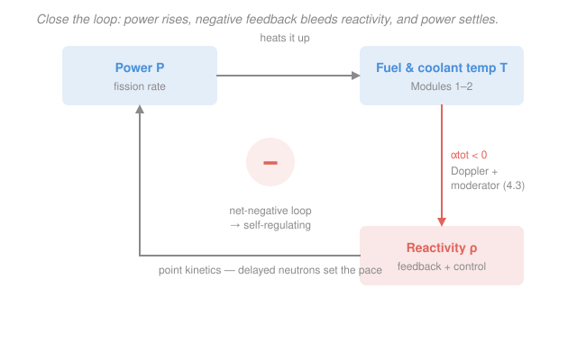

# Reactor Thermal-Hydraulics · Lesson 4.4: Coupled thermal-hydraulic / neutronic feedback

> ⏱ ~15 min · Module 4: Natural circulation, neutronic coupling, and safety margins · Builds on: [4.3 Reactivity feedback coefficients](04-03-reactivity-feedback-coefficients.md), [2.1 Coolant energy balance](02-01-coolant-energy-balance-bulk-temperature.md), [`reactor-physics` 4.1 Delayed neutrons & point kinetics](../../reactor-physics/lessons/04-01-delayed-neutrons-point-kinetics.md) · Unlocks: [4.6 LOCA & thermal margins](04-06-loca-thermal-margins.md)

## Why this matters

Every lesson so far has run heat *one way*: fission makes power, power sets temperatures, temperatures decide whether the fuel survives. But neutronics reads temperature right back — hotter fuel and coolant change the reactivity (that was all of [4.3](04-03-reactivity-feedback-coefficients.md)). Wire those two directions together and you get a **loop**: power heats the core, the hot core bleeds reactivity, and reactivity turns power back down. Close that loop with the right sign and the reactor becomes *self-regulating* — it settles to a steady operating point on its own, and damps disturbances without an operator touching a thing. Close it with the wrong sign and you get Chernobyl. This lesson is the payoff the whole course was built toward: understanding why a well-designed reactor is stable by construction.

## The idea

Picture a thermostat you never set. Nudge the reactor's power up — say a control rod slips out a little. More fissions, more heat, the fuel and coolant warm up (Modules [1](01-04-axial-temperature-profile-channel.md)–[2](02-01-coolant-energy-balance-bulk-temperature.md) tell you exactly how much). Now the [4.3](04-03-reactivity-feedback-coefficients.md) feedbacks kick in: Doppler broadening in the hot fuel and the thinner, hotter moderator both *eat* reactivity. Less reactivity means fewer fissions — so power comes back down. The rise fed a mechanism that opposed the rise. That is **negative feedback**, and a reactor with net-negative feedback is **inherently stable**: it doesn't sit at a knife-edge waiting for the operator to catch it, it slides back toward balance on its own.

The key mental shift: negative feedback does **not** pin power to one magic number. It pins the *reactivity balance*. The reactor will happily run at any power — it just finds the temperature at which the feedback exactly cancels whatever the control system is asking for. Change the demand (pull a rod, or draw more heat out at the steam generator) and the core simply drifts to a **new** temperature and a **new** power where the books balance again. Stability isn't rigidity; it's a ball resting in a bowl instead of balanced on a dome.

## The formal version

Write the reactor's reactivity as two pieces. Recall reactivity $\rho \equiv (k-1)/k$ (dimensionless; measured in **pcm**, "per cent mille," where $1\ \mathrm{pcm} = 10^{-5}$), and $k$ is the multiplication factor. Then

$$\rho_{\text{net}}(t) = \rho_{\text{ext}}(t) + \rho_{\text{fb}}\big(T(t)\big).$$

- $\rho_{\text{ext}}$ — **external** (control) reactivity you impose: rod position, boron concentration. Your hand on the dial.
- $\rho_{\text{fb}}$ — **feedback** reactivity the core supplies in response to its own temperature, from [4.3](04-03-reactivity-feedback-coefficients.md). Linearize it about a reference temperature $T_{\text{ref}}$ with the **total temperature coefficient** $\alpha_{\text{tot}}$ (pcm/K), which bundles Doppler + moderator/coolant:

$$\rho_{\text{fb}} = \alpha_{\text{tot}}\,(T - T_{\text{ref}}), \qquad \alpha_{\text{tot}} = \alpha_{\text{Doppler}} + \alpha_{\text{moderator}}.$$

*In words: how much reactivity the core gives back per degree it heats up.* Here $T$ is a representative core-average temperature; the real machine carries fuel and coolant temperatures separately, but one lumped $T$ captures the physics.

**Quasi-static balance.** The delayed neutrons (below) make the power response slow compared with a prompt jump, so at each moment the neutronics is essentially *critical*: $\rho_{\text{net}} \approx 0$. Steady state is therefore

$$\boxed{\ \rho_{\text{ext}} + \alpha_{\text{tot}}\,(T - T_{\text{ref}}) = 0\ }$$

*In words: at any steady operating point, control and feedback are equal and opposite.* Impose more external reactivity and the core answers by heating until feedback cancels it. Solve for the equilibrium temperature shift:

$$\Delta T = T - T_{\text{ref}} = -\frac{\rho_{\text{ext}}}{\alpha_{\text{tot}}}.$$

Now read the **sign**. If $\alpha_{\text{tot}} < 0$ (negative feedback), a positive $\rho_{\text{ext}}$ gives a *positive, finite* $\Delta T$ — a real, hotter equilibrium the core walks to and stops at. If $\alpha_{\text{tot}} > 0$, the same step gives a *negative* $\Delta T$: there is **no** hot equilibrium; heating adds *more* reactivity, which drives more heating — the perturbation grows without bound. That runaway is the physics behind the RBMK's large positive void coefficient at Chernobyl. **Every power reactor is licensed for net-negative feedback** precisely so the boxed balance has a stable solution.

**Power defect.** Feedback is negative going *up* in power too. Take the reactor from zero power (cold or hot-zero-power) to full power: the fuel and coolant heat through their whole working range, and feedback swallows

$$\rho_{\text{defect}} = \int_{\text{zero power}}^{\text{full power}} \alpha_{\text{tot}}\,dT \ <\ 0,$$

typically a couple thousand pcm. *In words: the reactivity the core hides from you as it warms up to rated conditions.* To hold $k=1$ you must **compensate** it with control — withdraw rods, dilute boron — supplying an equal and opposite positive $\rho_{\text{ext}}$. (Practitioners often tabulate this as a **power coefficient** $\alpha_P = d\rho/dP$ in pcm per % power, and the defect is $\int \alpha_P\,dP$; it's the same idea keyed to power instead of temperature.)

**Delayed neutrons set the clock.** Why is the balance *quasi-static* and not instantaneous? Because the prompt neutron lifetime is $\sim 10^{-4}\,\mathrm{s}$ — far faster than any temperature can move. If the reactor ran on prompt neutrons alone, an excursion would be over before feedback felt it. The delayed neutrons (fraction $\beta \approx 650\ \mathrm{pcm}$, emitted seconds after fission) stretch the power response out to seconds, giving temperature — and therefore feedback — time to act. This is the [`reactor-physics` 4.1](../../reactor-physics/lessons/04-01-delayed-neutrons-point-kinetics.md) point-kinetics result doing structural work: feedback can only stabilize if the excursion is *slow*, which requires staying below **prompt critical**, $\rho_{\text{ext}} < \beta$. Cross $\beta$ and the delayed neutrons no longer gate the pace — no feedback is fast enough to catch it.

## Picture

## Worked examples

**Example 1 (the loop finds a new home, not a runaway).** A reactor sits at steady full power. An operator withdraws a rod worth $\rho_{\text{ext}} = +200\ \mathrm{pcm}$ and leaves it there. The total feedback coefficient is $\alpha_{\text{tot}} = -4\ \mathrm{pcm/K}$. Where does it settle?

Right after the withdrawal, $\rho_{\text{net}} = +200\ \mathrm{pcm} > 0$: the reactor is supercritical, power climbs, fuel and coolant heat up. Feedback grows more negative until it cancels the insertion. The new steady state is the boxed balance:

$$\Delta T = -\frac{\rho_{\text{ext}}}{\alpha_{\text{tot}}} = -\frac{+200\ \mathrm{pcm}}{-4\ \mathrm{pcm/K}} = +50\ \mathrm{K}.$$

The core-average temperature rises 50 K and *stops there* — feedback now supplies $\alpha_{\text{tot}}\,\Delta T = (-4)(50) = -200\ \mathrm{pcm}$, exactly offsetting the rod. No operator action; the loop caught itself.

What power does that correspond to? Heat removal is roughly linear: model it as $P = K\,(T - T_c)$ with $T_c$ the (fixed) coolant reference the secondary side holds and $K$ an effective core conductance, so $T - T_c \propto P$. If at rated power the feedback-average temperature sits $T_0 - T_c = 250\ \mathrm{K}$ above that reference, then

$$\frac{\Delta P}{P_0} = \frac{\Delta T}{T_0 - T_c} = \frac{50}{250} = 20\%.$$

Power climbs about 20% to a new steady value — a bounded step, not a divergence. That's **load-following via feedback**: had the *demand* changed instead (more steam drawn), the same mechanism runs in reverse, cooling the core until power matches the new load.

*Check.* Units: $\mathrm{pcm}/(\mathrm{pcm/K}) = \mathrm{K}$ ✓. Signs: positive insertion, negative coefficient → positive (real, hotter) equilibrium ✓. The power rise is finite and modest — a self-limiting response, exactly what "inherently stable" buys you.

**Example 2 (flip the sign — why it must be negative).** Same $+200\ \mathrm{pcm}$ step, but imagine a badly-designed core with $\alpha_{\text{tot}} = +4\ \mathrm{pcm/K}$ (net *positive* feedback). The boxed balance now returns

$$\Delta T = -\frac{+200}{+4} = -50\ \mathrm{K}.$$

A **negative** equilibrium temperature: the only way to cancel a $+200\ \mathrm{pcm}$ insertion would be to *cool* the core by 50 K. But the insertion makes power *rise*, which makes $T$ *rise*, which — with $\alpha_{\text{tot}} > 0$ — adds *another* dose of positive reactivity. Power climbs, temperature climbs, feedback pushes the same direction: no stable hot operating point exists, and the excursion diverges until some other effect (or the fuel itself) intervenes. This is the structural reason **every power reactor is designed and licensed for $\alpha_{\text{tot}} < 0$**: only then does the reactor have a stable place to sit. The RBMK-1000 at Chernobyl had a large *positive* void coefficient that, at low power with the coolant flashing to steam, made $\alpha_{\text{tot}} > 0$ — the loop amplified instead of damped.

*Check.* The unphysical negative $\Delta T$ is the tell: a stable equilibrium requires $-\rho_{\text{ext}}/\alpha_{\text{tot}} > 0$, i.e. $\rho_{\text{ext}}$ and $\alpha_{\text{tot}}$ opposite in sign. For an insertion ($\rho_{\text{ext}}>0$) that forces $\alpha_{\text{tot}}<0$. ✓

## Watch out

- **You might think negative feedback holds power constant.** It doesn't — it holds the *reactivity balance* $\rho_{\text{ext}} + \rho_{\text{fb}} = 0$. Power and temperature settle wherever that sum hits zero, and a change in control or in heat demand simply moves the operating point. Stability means it *returns to balance*, not that the balance never moves.
- **You might think any positive coefficient guarantees a runaway.** What matters is the *net* $\alpha_{\text{tot}}$ and the operating condition. A positive void coefficient can be tolerated if a strong negative Doppler and other feedbacks keep the sum negative across all states — the RBMK's failure was that its positive term *won* at low power, flipping the total. Add the feedbacks with their signs before you judge stability.
- **You might think feedback acts instantly.** It can't move faster than the temperature it rides on. Delayed neutrons ($\beta \approx 650\ \mathrm{pcm}$) slow the power response so temperature can keep up; that stabilizing lag only holds *below* prompt critical. A reactivity insertion above $\beta$ outruns every thermal feedback — which is why allowed insertions are kept a comfortable margin under $\beta$.

## One-liner

> Wire power → temperature → reactivity → power with a net-negative coefficient and the reactor becomes a ball in a bowl: it settles to whatever operating point makes control-plus-feedback zero, and slides back when disturbed — flip the sign and the bowl becomes a dome.

## Problems

**P1 (🟢)** A reactor at steady state receives a step $\rho_{\text{ext}} = +150\ \mathrm{pcm}$ from a rod withdrawal. The total feedback coefficient is $\alpha_{\text{tot}} = -5\ \mathrm{pcm/K}$. Find the equilibrium core-average temperature rise $\Delta T$, and confirm the reactor reaches a new steady state rather than running away.

**P2 (🟡)** Taking a reactor from hot-zero-power to full power raises its feedback-average temperature by $240\ \mathrm{K}$, with an (assumed constant) $\alpha_{\text{tot}} = -4\ \mathrm{pcm/K}$. Compute the power defect. What must the control system do — and in which direction — to hold the reactor critical at full power?

**P3 (🔴)** A core's feedbacks are Doppler $\alpha_{\text{Doppler}} = -3.0\ \mathrm{pcm/K}$ and a coolant/void term $\alpha_{\text{moderator}}$ that depends on design. (a) For what range of $\alpha_{\text{moderator}}$ is the reactor inherently stable? (b) A revised design pushes $\alpha_{\text{moderator}}$ to $+5\ \mathrm{pcm/K}$. Is the core stable? Explain, using a small $+100\ \mathrm{pcm}$ perturbation, what happens.

Solutions

**P1** Quasi-static balance $\rho_{\text{ext}} + \alpha_{\text{tot}}\Delta T = 0$:

$$\Delta T = -\frac{\rho_{\text{ext}}}{\alpha_{\text{tot}}} = -\frac{+150\ \mathrm{pcm}}{-5\ \mathrm{pcm/K}} = +30\ \mathrm{K}.$$

The core heats 30 K; at that point feedback supplies $(-5)(30) = -150\ \mathrm{pcm}$, exactly cancelling the insertion, so $\rho_{\text{net}} = 0$ and power holds. Because $\alpha_{\text{tot}} < 0$ and $\rho_{\text{ext}} > 0$, $\Delta T > 0$ is a genuine (finite, hotter) equilibrium — the reactor slides to it and stops, not a runaway.

*Check.* Units $\mathrm{pcm}/(\mathrm{pcm/K}) = \mathrm{K}$ ✓; opposite signs give a positive, physical temperature rise ✓.

**P2** Power defect is the feedback integrated over the temperature swing; with constant $\alpha_{\text{tot}}$ it's just the coefficient times the total rise:

$$\rho_{\text{defect}} = \alpha_{\text{tot}}\,\Delta T_{\text{full}} = (-4\ \mathrm{pcm/K})(240\ \mathrm{K}) = -960\ \mathrm{pcm}.$$

The core *loses* 960 pcm of reactivity on the way to full power. To keep $k = 1$, control must supply $+960\ \mathrm{pcm}$ — i.e. **add** positive reactivity by withdrawing rods and/or diluting boron. (Physically: you "spend" control reactivity to pay the temperature tax.)

*Check.* Sign: heating with a negative coefficient removes reactivity, so the defect is negative and control must push positive to offset it ✓. Magnitude $\sim 10^3$ pcm is the right order for a power defect ✓.

**P3** (a) Inherent stability needs net-negative feedback, $\alpha_{\text{tot}} = \alpha_{\text{Doppler}} + \alpha_{\text{moderator}} < 0$:

$$-3.0 + \alpha_{\text{moderator}} < 0 \ \Longrightarrow\ \alpha_{\text{moderator}} < +3.0\ \mathrm{pcm/K}.$$

The coolant term may even be somewhat positive, as long as Doppler outweighs it and the sum stays below zero.

(b) With $\alpha_{\text{moderator}} = +5.0$: $\alpha_{\text{tot}} = -3.0 + 5.0 = +2.0\ \mathrm{pcm/K} > 0$ — **unstable**. Trace a $+100\ \mathrm{pcm}$ nudge: power rises, $T$ rises, and since $\alpha_{\text{tot}} > 0$ the core *adds* $(+2.0)\Delta T$ more reactivity, driving power higher still. The balance $\Delta T = -100/(+2.0) = -50\ \mathrm{K}$ is negative — no hot equilibrium exists — confirming the excursion diverges instead of settling.

*Check.* The stability threshold is exactly $\alpha_{\text{moderator}} = -\alpha_{\text{Doppler}} = +3.0$ pcm/K, and $+5.0$ sits on the wrong side of it ✓; the negative "equilibrium" $\Delta T$ is the signature of positive feedback ✓.

## Flashback

**From Lesson 1.2 (Conduction with a heat source in the fuel pin):** A UO$_2$ fuel pin runs at linear power $q' = 25\ \mathrm{kW/m}$ with conductivity $k \approx 3\ \mathrm{W/(m\cdot K)}$. Find the centerline-to-surface temperature drop. (Then note: *this* is the fuel temperature the Doppler feedback in today's lesson responds to.)

Solution

For a pin with a uniform volumetric source and constant $k$, the centerline-to-surface drop depends only on linear power (the radius cancels):

$$T_0 - T_s = \frac{q'}{4\pi k} = \frac{25{,}000\ \mathrm{W/m}}{4\pi \,(3\ \mathrm{W/(m\cdot K)})} = \frac{25{,}000}{37.7}\ \mathrm{K} \approx 663\ \mathrm{K}.$$

*Check.* Units $\mathrm{(W/m)}/\mathrm{(W/(m\cdot K))} = \mathrm{K}$ ✓; a ~660 K interior rise is the right ballpark for a pin near rated power. This is why Doppler feedback is prompt and strong: raise power and the fuel interior heats by hundreds of kelvin *immediately*, broadening the U-238 resonances and pulling reactivity down — the first, fastest term in $\alpha_{\text{tot}}$.

## Connections

- **Backward:** the two directions of this loop are earlier lessons meeting. Power → temperature is Modules [1](01-04-axial-temperature-profile-channel.md)–[2](02-01-coolant-energy-balance-bulk-temperature.md) (conduction, energy balance, convection); temperature → reactivity is [4.3](04-03-reactivity-feedback-coefficients.md)'s Doppler and moderator coefficients. This lesson just connects the wires.
- **Forward:** [4.5 Decay heat](04-05-decay-heat-after-shutdown.md) asks what happens when you break the loop entirely (scram to zero fission power, but heat keeps coming), and [4.6 LOCA & thermal margins](04-06-loca-thermal-margins.md) assembles feedback, decay heat, and CHF into the full safety picture — inherent negative feedback is the first line of defense in that story.
- **Sideways:** the quasi-static balance $\rho_{\text{ext}} + \alpha_{\text{tot}}\Delta T = 0$ is a fixed point of a negative-feedback loop — mathematically the same "ball in a bowl vs. dome" stability test as a stable equilibrium in [`mechanics-refresher` 2.2](../../mechanics-refresher/lessons/02-02-potential-energy-conservation.md) (potential curving up = stable) and as a self-correcting market clearing to a new price after a demand shock. The point-kinetics timescale that makes it *quasi*-static is the [`reactor-physics` 4.1](../../reactor-physics/lessons/04-01-delayed-neutrons-point-kinetics.md) delayed-neutron result.
