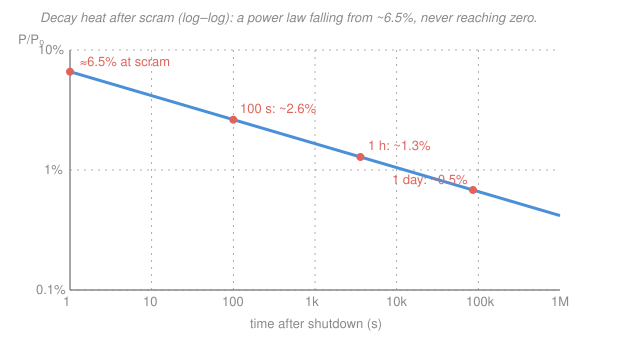

# Reactor Thermal-Hydraulics · Lesson 4.5: Decay heat after shutdown

> ⏱ ~15 min · Module 4: Stability, feedback, and transients · Builds on: [1.1 (core power distribution)](01-01-power-distribution-volumetric-source.md), [`intro-nuclear-engineering` 1.3 (radioactivity and the decay law)](../../intro-nuclear-engineering/lessons/01-03-radioactivity-decay-law.md) · Unlocks: 4.6 (LOCA thermal margins), Boss problem 4

## Why this matters

On 11 March 2011 the reactors at Fukushima Daiichi did exactly what they were supposed to: control rods slammed in, the fission chain reaction stopped, the cores "scrammed" cleanly within seconds. And then, over the next three days, three of them melted anyway. The reason is the single most important fact in reactor safety: **a scrammed core is not a cold core.** Even with fission fully off, the fuel keeps making heat — roughly 6–7% of full power at the instant of shutdown — because the mountain of radioactive fission products built up during operation goes right on decaying. That heat is called **decay heat**, and it is why you can never simply "turn a reactor off." You can stop the fissions in a second; you cannot stop the decay heat, and it will demand active or passive cooling for *days*. Every accident-management strategy, every emergency core cooling system, every spent-fuel-pool design exists to remove this one term. This lesson quantifies it — and feeds straight into the LOCA analysis of [4.6](04-06-loca-thermal-margins.md), where losing that cooling is the whole problem.

## The idea

During operation your ~40 kW/m peak pin (from [1.1](01-01-power-distribution-volumetric-source.md)) is running on two heat sources you never separated because you didn't need to. The big one is **prompt fission power**: the kinetic energy of fresh fission fragments, deposited instantly. The small one is **decay heat**: the beta and gamma energy released as the *previously* created fission products — iodine, cesium, the whole radioactive zoo tracked in [`nuclear-materials` 3.4 (fission-gas release)](../../nuclear-materials/lessons/03-04-fission-gas-release-swelling.md) — decay toward stability. During steady operation these fission products are being made as fast as they decay, so decay heat is a roughly constant few percent of total power, hidden inside the total.

Scram removes the prompt part in a heartbeat. But the fission-product inventory doesn't care that fissions stopped — those nuclei are already made, and they keep decaying on their own half-lives, which run from fractions of a second to years. So at the instant of shutdown you are left with the decay-heat fraction, about 6–7% of the power you were just running at. A 3000 MW reactor is suddenly a **200 MW heater with no off switch.**

The saving grace is that it *falls*. The short-lived isotopes burn out first, so decay heat drops fast at the start — halving in the first minute or two — then more and more slowly as only longer-lived nuclides remain. It follows a gentle power law in time, not an exponential: ~6.5% at shutdown, ~2–3% at a minute or two, ~1% around an hour, a few tenths of a percent after a day. **It never reaches zero.** A few tenths of a percent of 3000 MW is still ~10 MW — which is exactly why spent fuel sits in cooled pools for years, not weeks.

## The formal version

Because decay heat is a sum over thousands of fission-product decay chains, nobody computes it from first principles for hand work. Instead we use an empirical fit. The classic one is the **Wigner–Way correlation** (refined into the ANS decay-heat standards):

$$\frac{P(t)}{P_0} \approx 0.066\left[\,t^{-0.2} - (t+t_0)^{-0.2}\,\right].$$

*In words: the decay power, as a fraction of the pre-shutdown power, is a difference of two slowly-falling power laws.* The symbols, with units stated because they matter here:

- $P(t)$ — thermal power generated by decay at time $t$ after shutdown (W).
- $P_0$ — the steady thermal power the reactor ran at *before* shutdown (W). The ratio $P/P_0$ is dimensionless.
- $t$ — time **since shutdown**, in **seconds**.
- $t_0$ — how long the reactor operated at $P_0$ before shutting down, in **seconds** (the "irradiation time").
- $0.066$ and the exponent $-0.2$ — empirical constants from fitting measured fission-product decay energy.

The subtracted term $(t+t_0)^{-0.2}$ is the **finite-operation correction**: a reactor run for only a short $t_0$ never built up its long-lived fission products to saturation, so it has *less* decay heat. For a reactor that has run a long time (months to years, so $t_0 \gg t$), that second term is tiny and we use the **long-operation shorthand**:

$$\boxed{\;\frac{P(t)}{P_0} \approx 0.066\,t^{-0.2}\quad (t \text{ in s})\;}$$

*In words: after a long run, decay heat is a single power law that falls like $t^{-0.2}$.* Because the exponent is small ($0.2$), it falls *slowly* — a factor of 10 more time buys only a factor $10^{0.2}\approx1.58$ reduction. That sluggishness is the whole safety problem.

**Rough values worth memorizing** (long-operation form): ~6.5% at shutdown, ~2.6% at 100 s, ~1.3% at 1 hour, ~0.7% at 1 day. Treat these as an *envelope* — different correlations (the detailed ANS-5.1 standard, decay-chain summation codes) disagree by tens of percent at short cooling times, and the simple $0.066\,t^{-0.2}$ law runs on the high (conservative) side there. That model spread is itself a lesson: for safety you design to the *upper* estimate.

**Integrated decay heat.** The total energy you must remove between shutdown and time $t$ is the area under the curve:

$$E(t) = \int_0^{t} P(\tau)\,d\tau = 0.066\,P_0\int_0^{t}\tau^{-0.2}\,d\tau = 0.066\,P_0\,\frac{t^{\,0.8}}{0.8}.$$

*In words: sum the decay power over time to get the joules of heat dumped into the coolant so far.* The integral is finite even starting from $\tau=0$ because the exponent $-0.2$ is greater than $-1$. This $E(t)$ is what a passive heat sink (a pool of water, a containment) has to swallow, and it grows without bound — which is why cooling can be reduced over time but never simply removed.

## Picture

On log–log axes the power law $0.066\,t^{-0.2}$ is a **straight line** of slope $-0.2$ — shallow, and heading toward the floor without ever touching it. The coral markers are the numbers to carry in your head.

## Worked examples

**Example 1 (Boss-problem-4 flavor — decay power right after scram).** A 3000 $\mathrm{MW_{th}}$ PWR has been running at full power for a year and scrams. What is the decay power 100 s later?

Long operation ($t_0 = 1\text{ yr} \gg 100$ s), so use the shorthand with $t = 100$ s:

$$t^{-0.2} = 100^{-0.2} = 10^{-0.4} = 0.398,$$
$$\frac{P}{P_0} \approx 0.066 \times 0.398 = 0.0263 = 2.63\%.$$

$$P(100\,\mathrm{s}) = 0.0263 \times 3000\ \mathrm{MW} \approx 79\ \mathrm{MW}.$$

So 100 seconds after a clean shutdown the core is still a **79 MW** heater — about 2.6% of full power.

*Reconcile the model spread.* You will also see the ANS short-form quoted as ~1.4% ($\approx$ 42 MW) at 100 s. Both are "right": the simple Wigner–Way $0.066\,t^{-0.2}$ law over-predicts at short cooling times, while the detailed ANS-5.1 standard, which sums real decay chains and applies the finite-$t_0$ correction, comes in lower. The truth is bracketed somewhere between, and the numbers can differ by ~40% here. For safety analysis you take the higher (conservative) figure; for realistic heat-load estimates you take the standard. Quote which correlation you used — never a bare percentage.

*Check.* Units: $P_0$ in MW times a dimensionless fraction gives MW ✓. Sanity: 2.63% at 100 s sits below the ~6.5% shutdown value and above the ~1.3% one-hour value ✓ — the curve is monotone falling, as it must be.

**Example 2 (total energy to remove in the first hour).** For that same 3000 MW core, how much decay energy must be carried away between shutdown and $t = 1$ hour $= 3600$ s?

Use the integrated form with $P_0 = 3000\ \mathrm{MW} = 3.0\times10^{9}\ \mathrm{W}$:

$$E = 0.066\,P_0\,\frac{t^{\,0.8}}{0.8}, \qquad 3600^{\,0.8} = e^{0.8\ln 3600} = e^{0.8\times 8.189} = e^{6.55} \approx 700.$$

$$E = \frac{0.066}{0.8}\times(3.0\times10^{9})\times 700 = 0.0825 \times 3.0\times10^{9} \times 700 \approx 1.73\times10^{11}\ \mathrm{J}.$$

That is $\approx 1.7\times10^{5}\ \mathrm{MJ}$ — **170 GJ** — dumped into the coolant in the first hour alone.

*Make it concrete.* Vaporizing water takes about $2.26\times10^{6}\ \mathrm{J/kg}$, so 170 GJ would boil off

$$\frac{1.73\times10^{11}}{2.26\times10^{6}} \approx 7.6\times10^{4}\ \mathrm{kg} \approx 76\ \text{tonnes of water}$$

in that first hour. A spent-fuel pool or a passively-cooled containment must have this kind of inventory in hand — and this is *only* the first hour; the integral keeps climbing for days.

*Check.* Units: $(\text{J/s})\times \text{s} = \text{J}$ ✓. Cross-check the average: $E/3600 = 1.73\times10^{11}/3600 \approx 4.8\times10^{7}\ \mathrm{W} = 48\ \mathrm{MW}$, i.e. a time-averaged ~1.6% of $P_0$ over the hour — comfortably between the 6.5% start and 1.3% end, weighted toward the long tail ✓.

## Watch out

- **You might think scram makes the core safe.** It stops the *chain reaction*, not the *heat*. The prompt fission power vanishes in a second, but the decay-heat few-percent stays and must be cooled for days. Shutdown is the *start* of the cooling problem, not the end of it — the exact trap that turned Fukushima's clean scrams into three meltdowns.
- **You might treat decay heat as an exponential that dies quickly.** It is a *power law* ($t^{-0.2}$), not a single exponential, because it's a sum over thousands of half-lives spanning many decades. It falls fast at first (short-lived nuclides) then crawls, and it **never** reaches zero — a few tenths of a percent of a gigawatt core is still megawatts, years later.
- **You might quote one decay-heat percentage as gospel.** Correlations disagree by tens of percent, especially in the first minutes; the value also depends on how long the reactor ran ($t_0$) and its burnup. State your source (Wigner–Way vs. ANS-5.1) and, for safety, bias high.

## One-liner

> Scram kills the fission chain but not the fission products: decay heat starts at ~7% of full power and falls only as $t^{-0.2}$ — slowly, and never to zero — so a shut-down core must be cooled for days.

## Problems

**P1 (🟢)** A 3400 $\mathrm{MW_{th}}$ reactor has operated for a long time and scrams. Using the long-operation shorthand $P/P_0 \approx 0.066\,t^{-0.2}$, find the decay power (in MW) and the fraction of full power at (a) $t = 10$ s and (b) $t = 1$ hour ($3600$ s).

**P2 (🟡)** Take the long-operation form $P/P_0 = 0.066\,t^{-0.2}$. By what factor does the decay-heat *fraction* drop between $t = 100$ s and $t = 10{,}000$ s (a hundredfold increase in time)? Comment on why cooling systems must run for so long.

**P3 (🔴)** A reactor that ran a long time at $P_0 = 3000$ MW scrams. Estimate the total decay energy that must be removed over the first **day** ($t = 86{,}400$ s) using $E(t) = 0.066\,P_0\,t^{0.8}/0.8$. Express the answer in GJ, and convert to an equivalent mass of water boiled off ($2.26\times10^{6}$ J/kg). Compare with the 76 tonnes for the first hour and comment.

Solutions

**P1** (a) At $t = 10$ s: $10^{-0.2} = 0.631$, so $P/P_0 = 0.066\times 0.631 = 0.0416 = 4.16\%$.

$$P = 0.0416 \times 3400 \approx 142\ \mathrm{MW}.$$

(b) At $t = 3600$ s: $3600^{-0.2} = e^{-0.2\times 8.189} = e^{-1.638} = 0.194$, so $P/P_0 = 0.066\times 0.194 = 0.0128 = 1.28\%$.

$$P = 0.0128 \times 3400 \approx 43.6\ \mathrm{MW}.$$

*Check.* Both fractions lie on the falling curve (4.16% at 10 s > 1.28% at 1 h) ✓; units MW × dimensionless = MW ✓. Even an hour after shutdown this core needs ~44 MW of cooling — a substantial industrial heat load.

**P2** The fraction scales as $t^{-0.2}$, so the ratio depends only on the time ratio:

$$\frac{P(10{,}000)}{P(100)} = \left(\frac{10{,}000}{100}\right)^{-0.2} = 100^{-0.2} = 10^{-0.4} = 0.398.$$

So a **hundredfold** increase in time cuts decay heat only to ~40% of its value — a factor of ~2.5 reduction. Because the exponent $0.2$ is so small, the curve is stubbornly flat: you wait 100× longer and still have nearly half the heat. That sluggish decline is exactly why residual-heat-removal systems must operate for hours to days, not minutes, and why loss of *all* cooling (station blackout) is so dangerous even long after shutdown.

*Check.* $100^{-0.2} = (10^2)^{-0.2} = 10^{-0.4}\approx 0.398$ ✓; the result is between 0 and 1 as a decay must be.

**P3** With $P_0 = 3.0\times10^{9}$ W and $t = 86{,}400$ s:

$$t^{0.8} = e^{0.8\ln 86400} = e^{0.8\times 11.367} = e^{9.093} \approx 8.9\times10^{3}.$$

$$E = \frac{0.066}{0.8}\times(3.0\times10^{9})\times 8.9\times10^{3} = 0.0825\times 3.0\times10^{9}\times 8.9\times10^{3} \approx 2.2\times10^{12}\ \mathrm{J} = 2200\ \mathrm{GJ}.$$

Water boiled off:

$$\frac{2.2\times10^{12}}{2.26\times10^{6}} \approx 9.7\times10^{5}\ \mathrm{kg} \approx 970\ \text{tonnes}.$$

Compared with 76 tonnes in the first hour, the first *day* takes ~970 tonnes — about 13× more. Note it is **not** 24× more (as it would be at constant power): the heat is falling, so later hours contribute less, and the $t^{0.8}$ growth (sublinear) captures that. Still, nearly a thousand tonnes of coolant-equivalent in one day is why large water inventories and makeup capability dominate accident management.

*Check.* Units $(\mathrm{J/s})\cdot\mathrm{s} = \mathrm{J}$ ✓. Average power over the day $= 2.2\times10^{12}/86400 \approx 2.5\times10^{7}\ \mathrm{W} = 25\ \mathrm{MW} \approx 0.85\%$ of $P_0$ — below the 1.6% first-hour average, consistent with the still-falling curve ✓.

## Flashback

**From Lesson 1.1 (Power distribution and the volumetric source):** A 3400 $\mathrm{MW_{th}}$ PWR holds 52,000 fuel rods, each with active length 3.66 m. (a) Find the core-average linear power $\bar q'$ in kW/m. (b) With a total peaking factor $F_q = 2.3$, find the peak linear power $q'_{max}$. (Fresh numbers — this is the pre-shutdown power whose 6–7% becomes the decay heat above.)

Solution

(a) Average linear power spreads the total thermal power over every meter of every pin:

$$\bar q' = \frac{P}{N_{pins}\,L} = \frac{3400\times10^{6}}{52{,}000\times 3.66} = \frac{3.4\times10^{9}}{1.903\times10^{5}} \approx 1.79\times10^{4}\ \mathrm{W/m} \approx 17.9\ \mathrm{kW/m}.$$

(b) Peak pin:

$$q'_{max} = F_q\,\bar q' = 2.3\times 17.9 \approx 41\ \mathrm{kW/m}.$$

*Check.* Units $\mathrm{W}/(\text{pins}\cdot\mathrm{m}) = \mathrm{W/m}$ ✓ (pin count dimensionless); the ~41 kW/m peak sits in the realistic PWR band (~40–45 kW/m) ✓. This is the pin that was running at full power the instant before scram — after which its heat drops to ~6.5% of the *core* rating and keeps falling on the decay curve.

## Connections

- **Backward:** decay heat is a fraction of the pre-shutdown core power $P_0$ built in [1.1](01-01-power-distribution-volumetric-source.md), and it is the macroscopic tally of the radioactive-decay law from [`intro-nuclear-engineering` 1.3](../../intro-nuclear-engineering/lessons/01-03-radioactivity-decay-law.md) summed over the fission-product inventory of [`nuclear-materials` 3.4](../../nuclear-materials/lessons/03-04-fission-gas-release-swelling.md). The scram itself — how fast the chain reaction actually stops — is the point-kinetics story of [`reactor-physics` 4.1](../../reactor-physics/lessons/04-01-delayed-neutrons-point-kinetics.md).
- **Forward:** decay heat is the source term that never turns off in [4.6 (LOCA thermal margins)](04-06-loca-thermal-margins.md) — when coolant is lost, this is the power that keeps heating the fuel, and reappears in **Boss problem 4**. It also sets the duty of every residual-heat-removal and emergency-core-cooling system.
- **Sideways:** the same integrated-energy bookkeeping drives spent-fuel-pool and cask cooling for years after discharge, and it is the physical reason natural-circulation and passive cooling paths (Module 4's driving-head analysis) must keep working long after the pumps and the fissions have stopped.
