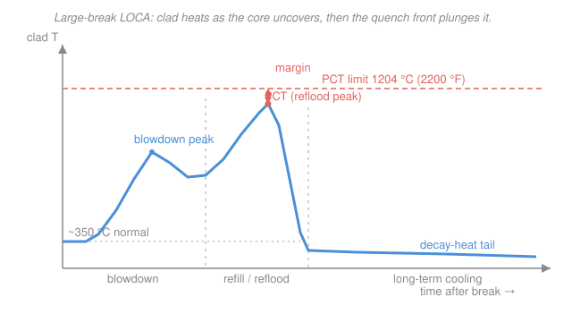

# Reactor Thermal-Hydraulics · Lesson 4.6: Loss-of-coolant and thermal margins

> ⏱ ~15 min · Module 4: Natural circulation, neutronic coupling, and safety margins · Builds on: [2.4 The full radial temperature drop](02-04-full-radial-temperature-drop.md), [3.6 Critical heat flux and DNB](03-06-critical-heat-flux-dnb.md), [4.1 Natural circulation and driving head](04-01-natural-circulation-driving-head.md), [4.5 Decay heat after shutdown](04-05-decay-heat-after-shutdown.md), [`nuclear-materials` 4.1 Zirconium alloys and cladding](../../nuclear-materials/lessons/04-01-zirconium-alloys-cladding.md) · Unlocks: course end — this is the payoff

## Why this matters

This is the question the whole course was built to answer: **a pipe breaks, the reactor scrams, and the coolant that carried the heat away is gone — can the core still cool itself before the fuel is destroyed?** Every earlier lesson computed one number in that safety case. The radial temperature budget ([2.4](02-04-full-radial-temperature-drop.md)) tells you how hot the fuel runs; the critical-heat-flux margin ([3.6](03-06-critical-heat-flux-dnb.md)) tells you when the wall dries out; natural circulation ([4.1](04-01-natural-circulation-driving-head.md)) tells you what buoyancy can move when the pumps die; decay heat ([4.5](04-05-decay-heat-after-shutdown.md)) tells you the core keeps making power even after the chain reaction stops. This lesson staples them into the one story a licensing engineer has to win: the **loss-of-coolant accident (LOCA)**, and the peak temperature the cladding is allowed to reach.

## The idea

Think of a large-break LOCA as a race between two clocks. One clock is **decay heat** ([4.5](04-05-decay-heat-after-shutdown.md)): the fission products keep releasing energy for days, no matter what the neutrons do — a few percent of full power right after scram, falling slowly. The other clock is **coolant**: after a big pipe rupture the hot, high-pressure water in the core **flashes to steam** in seconds, the pressure crashes, and for a moment the core is sitting in steam with almost nothing carrying its heat away. During that moment the decay-heat clock keeps ticking and the cladding heats up. The whole safety design is a promise that the emergency coolant arrives and floods the core back *before* the clad gets hot enough to destroy itself.

Why is there a temperature the clad "can't" exceed? Because the clad is zirconium ([`nuclear-materials` 4.1](../../nuclear-materials/lessons/04-01-zirconium-alloys-cladding.md)), and above roughly 1000 °C zirconium reacts with steam **exothermically** — it tears oxygen out of the water, releasing heat *and* hydrogen. That heat warms the clad, which speeds the reaction, which releases more heat: a **thermal runaway**. On top of that, the oxygen embrittles the surviving metal, and the hydrogen is an explosion hazard. So the limit isn't melting (zirconium melts near 1850 °C) — it's the point where the steam reaction and embrittlement take over. Regulators draw the line at **peak cladding temperature (PCT) $\le 1204$ °C (2200 °F)**, comfortably below melt, and back it with two more caps on how far the reaction is allowed to go.

## The formal version

**The LOCA sequence (large break).** A double-ended guillotine break of a main coolant pipe runs through three phases:

1. **Blowdown** (seconds). The primary system depressurizes; the hot water flashes to steam as pressure drops below saturation (a phase change straight out of [`engineering-thermodynamics` 1.2](../../engineering-thermodynamics/lessons/01-02-phase-behavior-pure-substance.md)). Flow reverses and stagnates, the core briefly **uncovers**, and clad temperature spikes to a first *blowdown peak*.
2. **Refill / reflood** (tens of seconds to minutes). The **emergency core cooling system (ECCS)** injects water; the lower plenum refills and a **quench front** climbs the fuel from the bottom, rewetting the clad. Before the front arrives the clad can reach its highest temperature — the *reflood peak*, usually the true PCT.
3. **Long-term cooling** (hours to days). Once quenched, the core is kept covered and its **decay heat** ([4.5](04-05-decay-heat-after-shutdown.md)) is removed continuously — for days, because that clock never fully stops.

The number that must stay bounded is the **peak cladding temperature**:

$$T_{\text{clad}}^{\max} \le 1204\ ^\circ\mathrm{C}\ (2200\ ^\circ\mathrm{F}).$$

*In words: at no time during the accident may the hottest spot on any fuel rod exceed 1204 °C.* Two companion limits (from the U.S. rule 10 CFR 50.46, the numbers behind [`nuclear-materials` 4.1](../../nuclear-materials/lessons/04-01-zirconium-alloys-cladding.md)) cap the reaction itself: the **equivalent cladding reacted** must stay under 17% of the wall ($\mathrm{ECR}\le 17\%$), and total core-wide **hydrogen generation** under 1% of the hypothetical maximum. The clad limit exists because of the steam-oxidation reaction

$$\mathrm{Zr} + 2\,\mathrm{H_2O} \longrightarrow \mathrm{ZrO_2} + 2\,\mathrm{H_2} + \text{heat},$$

*In words: hot zirconium strips oxygen from steam, making oxide, hydrogen, and its own heat — the self-accelerating reaction that runs away above ~1000 °C.*

**Three margins, one safety case.** The course has been building three different distances-to-a-cliff, each guarding a different failure and each computed in a different lesson:

| Margin | The limit it guards | Where it's computed |
|---|---|---|
| **Margin to CHF** — $\mathrm{DNBR} = q''_{\text{CHF}}/q''_{\text{local}} \ge 1.3$ | wall dryout in *normal* operation (boiling crisis) | [3.6](03-06-critical-heat-flux-dnb.md) |
| **Margin to melt** — $T_0 < T_{\text{melt}}$ (~2865 °C for UO$_2$) | fuel centerline melting in *normal* operation | [2.4](02-04-full-radial-temperature-drop.md) |
| **Margin to PCT** — $T_{\text{clad}}^{\max} < 1204$ °C | clad runaway/embrittlement in an *accident* | this lesson (4.6) |

*In words: DNBR keeps the wall wet day-to-day; the melt margin keeps the pellet solid day-to-day; the PCT limit keeps the clad intact when things go wrong.* The three are layered by **defense in depth** — multiple independent physical barriers (fuel matrix, cladding, primary boundary, containment) so no single failure releases fission products.

## Picture

The blue trace is the clad's whole ordeal: heat-up as the core uncovers, the reflood peak (the PCT) pressed up against the coral limit line, then the quench front slamming it back down to a low decay-heat tail. The *margin* is the coral gap between that peak and the 1204 °C line — the entire safety analysis is a fight to keep that gap positive.

## Worked examples

**Example 1 (Boss problem 4, closed out — can the core cool itself?).** A 3000 MW$_{\text{th}}$ PWR scrams from full power on loss of forced flow. A natural-circulation loop must now carry the decay heat. Does the clad stay below 1204 °C?

*Step 1 — the source (from [4.5](04-05-decay-heat-after-shutdown.md)).* At $t = 100$ s after shutdown the decay-heat curve gives $P_d/P_0 \approx 1.4\%$, so

$$P_d = 0.014 \times 3000\ \mathrm{MW} = 42\ \mathrm{MW}.$$

*Step 2 — the flow (from [4.1](04-01-natural-circulation-driving-head.md)).* With coolant still in the loop, buoyancy drives circulation. The driving head from a hot-to-cold density difference over loop height $H = 8$ m, with $\rho \approx 726\ \mathrm{kg/m^3}$, $\beta \approx 3\times10^{-3}\ \mathrm{K^{-1}}$, and a loop $\Delta T \approx 30$ K, is

$$\Delta p_{\text{dr}} = \rho\,\beta\,\Delta T\,g\,H = 726(3\times10^{-3})(30)(9.81)(8) \approx 5.1\ \mathrm{kPa}.$$

Balancing that against a lumped loop loss coefficient $K_{\text{loop}}\approx 20$ (from [2.5](02-05-pressure-drop-core.md)'s bookkeeping) gives a mass flux $G=\sqrt{2\rho\,\Delta p_{\text{dr}}/K_{\text{loop}}}\approx 610\ \mathrm{kg/(m^2 s)}$; over a core flow area $A\approx 5\ \mathrm{m^2}$ that's $\dot m \approx 500\ \mathrm{kg/s}$ — a few percent of the ~15,000 kg/s rated forced flow, which is all we need at 1.4% power.

*Step 3 — the coolant heat-up.* Energy balance around the loop, $P_d = \dot m\,c_p\,\Delta T_c$ with $c_p \approx 5.4\ \mathrm{kJ/(kg\cdot K)}$:

$$\Delta T_c = \frac{P_d}{\dot m\,c_p} = \frac{42\times10^{6}}{500 \times 5400} \approx 16\ \mathrm{K}.$$

The coolant climbs only ~16 K around the loop.

*Step 4 — the film drop, and the clad.* The clad sits a film drop above the coolant, $\Delta T_{\text{film}}=q''/h$. At decay power the flux is down by ~70×; the natural-circulation $h$ (Dittus–Boelter, $h\propto G^{0.8}$) is down too, so the film drop shrinks roughly as $\Delta T_{\text{film}}\propto q''/G^{0.8}$. Scaling from the full-power ~40 K film drop of [2.4](02-04-full-radial-temperature-drop.md):

$$\Delta T_{\text{film}} \approx \frac{0.014}{(500/15000)^{0.8}}\times 40\ \mathrm{K} \approx \frac{0.014}{0.065}\times 40 \approx 9\ \mathrm{K}.$$

So with a core inlet near 295 °C, the peak clad temperature is

$$T_{\text{clad}}^{\max} \approx 295 + \underbrace{16}_{\Delta T_c} + \underbrace{9}_{\Delta T_{\text{film}}} \approx 320\ ^\circ\mathrm{C}.$$

**Verdict:** margin to the limit is $1204 - 320 \approx 880$ K. As long as the coolant is *present*, natural circulation removes decay heat with enormous margin.

*Which single change buys the most margin?* **Coolant inventory — by an order of magnitude.** The answer is hiding in that 880 K. Loop height only enters the flow as $\dot m\propto\sqrt{H}$, so doubling $H$ raises flow ~41% and trims $\Delta T_c+\Delta T_{\text{film}}$ by a handful of kelvin. Waiting on decay-heat timing helps a little too: at 1 h the source is ~1% vs 1.4% at 100 s, another ~30% cut of a small number. But **losing the coolant doesn't cost tens of kelvin — it deletes the heat-removal path entirely.** With the core uncovered in steam there is no $\dot m$ and no film drop; the clad heats adiabatically toward 1204 °C (the blowdown/reflood peaks of the figure). That's why the entire accident analysis, and the ECCS, are about one thing: *keep the core covered.* Inventory is worth ~880 K; the other knobs are worth tens.

*Units/sanity check.* $\Delta T_c$: $(\mathrm{W})/[(\mathrm{kg/s})(\mathrm{J/kg\cdot K})] = \mathrm{K}$ ✓. A 3000 MW core making 42 MW of decay heat and dumping it into a 500 kg/s stream that only warms 16 K is consistent — that's a small fraction of the rated ~200 K core rise at full power and full flow. ✓

**Example 2 (margin bookkeeping — the whole course on one page).** Name the three margins a reactor must hold, state each limit, and say which lesson computes it.

1. **Margin to CHF (normal operation).** $\mathrm{DNBR}=q''_{\text{CHF}}/q''_{\text{local}}\ge 1.3$. If the peak-node local flux is $q''_{\text{local}}=1.3\ \mathrm{MW/m^2}$ and the W-3 correlation gives $q''_{\text{CHF}}=1.9\ \mathrm{MW/m^2}$, then $\mathrm{DNBR}=1.9/1.3=1.46\ge 1.3$ ✓ — the wall stays in nucleate boiling with margin. **Computed in [3.6](03-06-critical-heat-flux-dnb.md).**
2. **Margin to melt (normal operation).** $T_0<T_{\text{melt}}\approx 2865\ ^\circ\mathrm{C}$ for UO$_2$. From the radial budget a 40 kW/m pin runs $T_0\approx 1721\ ^\circ\mathrm{C}$, a ~1140 K margin. **Computed in [2.4](02-04-full-radial-temperature-drop.md).**
3. **Margin to PCT (accident).** $T_{\text{clad}}^{\max}<1204\ ^\circ\mathrm{C}$, with $\mathrm{ECR}<17\%$ and core hydrogen $<1\%$. A best-estimate LOCA might land the reflood peak near 1100 °C — a ~100 K margin, far tighter than the day-to-day margins. **Computed here (4.6).**

The pattern: the two normal-operation margins are hundreds to a thousand kelvin wide; the accident margin is the narrow one, which is exactly why LOCA analysis gets the most regulatory attention. Every lesson in this course fed one row of this table.

*Sanity check.* Each margin guards a different failure (dryout, melt, runaway) at a different condition (normal, normal, accident), so they are not redundant — they are the layers of defense in depth. ✓

## Watch out

- **You might think the PCT limit exists because the clad would melt.** It doesn't — zirconium melts near 1850 °C, well above 1204 °C. The limit guards against the *exothermic steam reaction and oxygen embrittlement* ([`nuclear-materials` 4.1](../../nuclear-materials/lessons/04-01-zirconium-alloys-cladding.md)), which take over hundreds of degrees below melting. The clad can be destroyed while still solid.
- **You might think scramming the reactor ends the heat problem.** Scram stops *fission* power in seconds, but decay heat ([4.5](04-05-decay-heat-after-shutdown.md)) is ~7% of full power at shutdown and still ~1% an hour later — megawatts that must be removed for days. Fukushima was a decay-heat-removal failure, not a criticality accident.
- **You might think a bigger DNBR margin protects you in a LOCA.** DNBR is a *normal-operation* metric — it assumes a wet, flowing channel and asks whether nucleate boiling holds. In a large-break LOCA the channel is steam, not water; DNBR is off the table and PCT is the governing number. Different regime, different margin.

## One-liner

> A LOCA is a race between decay heat and the coolant clock: keep the core covered and natural circulation wins with ~880 K to spare, but let the inventory flash away and the clad sprints toward the 1204 °C steam-runaway limit — so every margin in this course, DNBR to melt to PCT, is one layer of the same promise to keep the fuel intact.

## Problems

**P1 (🟢)** A 3400 MW$_{\text{th}}$ core scrams. Using the decay-heat shorthand (~1.4% at 100 s, ~1% at 1 h), find the decay power in MW at 100 s and at 1 h. A residual-heat-removal system can reject 30 MW. At which of these two times can it keep up?

**P2 (🟡)** In a best-estimate LOCA the reflood peak clad temperature comes out at 1090 °C. (a) What is the margin to the regulatory limit? (b) A licensing (conservative) analysis of the same plant must add penalties for uncertainty and typically raises the computed PCT by ~150 K. Does the plant still comply? (c) Why does the regulator care about the conservative number, not the best-estimate one?

**P3 (🔴)** During the natural-circulation phase of Example 1, a stuck valve cuts the loop flow $\dot m$ from 500 kg/s to 150 kg/s while decay power holds at 42 MW. (a) What is the new coolant heat-up $\Delta T_c$? (b) The film drop scales as $\Delta T_{\text{film}}\propto \dot m^{-0.8}$; estimate the new film drop from the 9 K baseline. (c) Is the clad still safely below 1204 °C, and what does this tell you about the *robustness* of the margin to flow degradation (as opposed to inventory loss)?

Solutions

**P1** Decay power is the fraction times full power:

$$P_d(100\,\mathrm{s}) = 0.014 \times 3400 = 47.6\ \mathrm{MW}, \qquad P_d(1\,\mathrm{h}) = 0.010 \times 3400 = 34\ \mathrm{MW}.$$

A 30 MW system cannot keep up at either time on its own ($47.6$ and $34$ both exceed 30) — but it is close at 1 h and would suffice a few hours later as the curve keeps falling. At 100 s you still need the larger-capacity injection/ECCS path.

*Check.* Both powers are a small percent of 3400 MW and the later one is smaller, as decay heat must monotonically fall. Units: $(\text{fraction})\times\mathrm{MW}=\mathrm{MW}$ ✓.

**P2** (a) Margin $= 1204 - 1090 = 114$ K. (b) The conservative PCT is $1090 + 150 = 1240\ ^\circ\mathrm{C} > 1204\ ^\circ\mathrm{C}$ — it **does not comply**; the plant would need a fix (lower power peaking, better ECCS, tighter analysis) to demonstrate compliance. (c) Because safety is a promise that must hold *including* what we don't know — measurement error, correlation scatter, worst-case timing. The regulator licenses against the number that bounds reality, not the number that describes the nominal case; a 114 K best-estimate margin that evaporates under realistic uncertainty is not a safe margin.

*Check.* The whole point of the 1204 °C line sitting hundreds of degrees below the 1850 °C melt point is to absorb exactly this kind of uncertainty — yet even so, a 150 K penalty can eat the margin. ✓

**P3** (a) Halving-and-then-some the flow raises the heat-up proportionally, $\Delta T_c = P_d/(\dot m c_p)$:

$$\Delta T_c = \frac{42\times10^6}{150\times 5400} \approx 52\ \mathrm{K}.$$

(b) Film drop scales as $\dot m^{-0.8}$: $\Delta T_{\text{film}} = 9\times(500/150)^{0.8} = 9\times(3.33)^{0.8} \approx 9\times 2.6 \approx 23\ \mathrm{K}$.

$$T_{\text{clad}}^{\max}\approx 295 + 52 + 23 \approx 370\ ^\circ\mathrm{C}.$$

(c) Still ~830 K below the 1204 °C limit. Cutting the flow to less than a third only cost ~50 K — the margin is extremely **robust to flow degradation** as long as coolant is present, because both $\Delta T_c$ and $\Delta T_{\text{film}}$ are modest even when flow is poor. This is the flip side of Example 1's punchline: *degrading the flow costs tens of kelvin; losing the inventory costs the whole ~880 K.* Robustness lives in keeping the core covered, not in the exact flow rate.

*Check.* Units of $\Delta T_c$ reduce to K ✓; the film drop grew by the expected $(10/3)^{0.8}\approx 2.6$ factor ✓; the verdict (safe) is unchanged, confirming inventory — not flow — is the governing lever.

## Flashback

**From Lesson 4.5 (Decay heat after shutdown):** A 3400 MW$_{\text{th}}$ reactor has operated continuously for 500 days and then scrams. Using the Wigner–Way estimate $\dfrac{P_d}{P_0}\approx 0.066\left[t^{-0.2}-(t+t_0)^{-0.2}\right]$ (with $t$ and $t_0$ in seconds after shutdown), find the decay power 1 hour after shutdown, and compare it to the ~1% shorthand.

Solution

Convert times to seconds: $t = 3600$ s, operating time $t_0 = 500\times 86400 = 4.32\times10^{7}$ s. Evaluate each term:

$$t^{-0.2} = 3600^{-0.2} = e^{-0.2\ln 3600} = e^{-1.638} = 0.194,$$
$$(t+t_0)^{-0.2} \approx (4.32\times10^{7})^{-0.2} = e^{-0.2\ln(4.32\times10^{7})} = e^{-3.516} = 0.030.$$

So

$$\frac{P_d}{P_0} \approx 0.066\,(0.194 - 0.030) = 0.066\times 0.164 = 0.0108 = 1.08\%,$$

$$P_d = 0.0108 \times 3400\ \mathrm{MW} \approx 37\ \mathrm{MW}.$$

*Check.* The $t_0$ term is small because the reactor ran a long time, so decay heat is near its "infinite-operation" value; the result, ~1.1%, matches the ~1% one-hour shorthand ✓. And 37 MW off a 3400 MW core is a genuinely large heat load an hour after the neutrons stopped — the reason long-term cooling in a LOCA runs for *days*, not minutes. ✓

## Connections

- **Backward:** this lesson is the whole course cashed in. The clad temperature it bounds is the top of the radial chain from [2.4](02-04-full-radial-temperature-drop.md); the DNBR margin it compares against comes from [3.6](03-06-critical-heat-flux-dnb.md); the natural-circulation flow that saves the day is [4.1](04-01-natural-circulation-driving-head.md); the heat that must be removed for days is [4.5](04-05-decay-heat-after-shutdown.md); and the scram that stops fission power is delayed-neutron kinetics from [`reactor-physics` 4.1](../../reactor-physics/lessons/04-01-delayed-neutrons-point-kinetics.md).
- **Sideways (materials):** the 1204 °C limit is not a thermal-hydraulic number at all — it is set by the zirconium–steam reaction and oxygen embrittlement of [`nuclear-materials` 4.1](../../nuclear-materials/lessons/04-01-zirconium-alloys-cladding.md). Thermal-hydraulics computes the temperature; materials science sets the ceiling. The safety case only closes when the two meet.
- **Forward (beyond this course):** the same margin-and-defense-in-depth logic scales up to full transient and accident analysis (system codes like RELAP/TRACE), probabilistic risk assessment, and severe-accident work — where, if PCT is lost and the core degrades, the story continues into [`nuclear-materials` 4.1](../../nuclear-materials/lessons/04-01-zirconium-alloys-cladding.md)'s runaway oxidation, hydrogen generation, and eventual melt. Every one of those analyses is built on the per-pin numbers you now know how to compute by hand.
