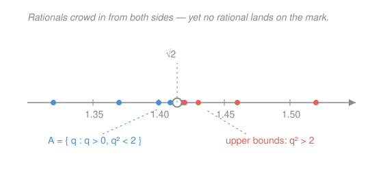

# Real Analysis · Lesson 1.1: The gap in the rationals

> ⏱ ~15 min · Module 1: The real number system · Builds on: proof by contradiction and quantifier-juggling from `proofs-primer` · Unlocks: [1.2 Suprema, infima, and completeness](01-02-suprema-infima-completeness.md)

## Why this matters

Every limit, derivative, and integral in calc-refresher was computed *with* real numbers, but we never said what a real number **is**. That was fine for computing; it's fatal for proving. Analysis is the project of proving those results, and a proof can't rest on an undefined object. So before anything else we have to earn the number line — and the fastest way to see that we don't get it for free is to watch the rationals fail. The rationals $\mathbb{Q}$ (all fractions $a/b$) look like they pack the line solidly. This lesson shows they don't: there is a specific, findable hole. Naming what's missing is the whole agenda of Module 1.

## The idea

Picture the rationals on a line. Between any two of them sits another (average them), so they *feel* gapless — infinitely fine dust with no room to spare. Here's the shock: that dust has holes you can pin down.

Consider the number whose square is $2$. Geometrically it's the diagonal of a unit square — an utterly concrete length you can draw. Yet **no fraction squares to $2$**. So on the rational line, the spot where $\sqrt{2}$ should be is genuinely empty.

Worse, the emptiness isn't just one missing point you could patch. Collect every positive rational whose square is *below* $2$. This set has plenty of rational ceilings — $1.5$, $1.42$, $1.4143$ all sit above it. But it has no **lowest** ceiling: hand me any rational upper bound and I'll hand you back a strictly smaller one that still works, forever, because the true boundary $\sqrt{2}$ that all these ceilings are creeping toward isn't a rational at all. The rationals can approach the edge but never stand on it. That "a bounded set with no least ceiling" defect is the real disease; $\sqrt{2}\notin\mathbb{Q}$ is just the first symptom.

## The formal version

**Theorem 1.** There is no rational number $r$ with $r^2 = 2$. In symbols, $\sqrt{2}\notin\mathbb{Q}$.

*Proof (by contradiction — the `proofs-primer` technique: assume the opposite, derive an absurdity).* Suppose $r^2=2$ for some $r\in\mathbb{Q}$. Write $r=a/b$ in **lowest terms**: $a,b$ are integers with no common factor (every fraction has such a form). Then
$$\frac{a^2}{b^2}=2 \quad\Longrightarrow\quad a^2 = 2b^2.$$
So $a^2$ is even, which forces $a$ even (if $a$ were odd, $a^2$ would be odd). Write $a=2k$. Then $a^2=4k^2$, so $4k^2=2b^2$, i.e. $b^2=2k^2$ — making $b^2$ even, hence $b$ even. But now $a$ and $b$ are *both* even, sharing the factor $2$ — contradicting "lowest terms." The assumption is impossible. $\blacksquare$

In words: if a fraction squared to $2$, you could reduce it forever, which no honest fraction lets you do.

**The deeper defect.** Let
$$A = \{\, q\in\mathbb{Q} : q>0 \text{ and } q^2 < 2 \,\}.$$
In words: $A$ is the set of positive rationals sitting to the *left* of where $\sqrt{2}$ belongs. An **upper bound** of $A$ is any number $\ge$ every element of $A$; a **least upper bound** is an upper bound with no smaller upper bound.

**Theorem 2.** $A$ is nonempty and bounded above (inside $\mathbb{Q}$), but has **no least upper bound in $\mathbb{Q}$**.

*Proof idea.* $A$ is nonempty ($1\in A$) and bounded above ($2$ is an upper bound, since $q^2<2<4$ forces $q<2$). Now take **any** positive rational upper bound $p$ of $A$; necessarily $p^2>2$ (it can't equal $2$ by Theorem 1, and if $p^2<2$ then $p\in A$, but Problem 1 produces an element of $A$ larger than $p$ — so $p$ couldn't be an upper bound). Define
$$q \;=\; \frac{2p+2}{p+2}.$$
A short computation (Problem 3) gives two facts: $q<p$, and $q^2>2$. So $q$ is a *smaller* rational upper bound of $A$. Every rational ceiling has a lower rational ceiling beneath it — so none is least. $\blacksquare$

In words: the ceilings of $A$ march downward toward $\sqrt{2}$ and never reach a lowest one, because the number they're converging to was never in $\mathbb{Q}$.

**What $\mathbb{Q}$ has, and the one thing it lacks.** $\mathbb{Q}$ is an **ordered field**: you can add, subtract, multiply, and divide (by nonzero) with the usual laws — associativity, commutativity, distributivity, a $0$ and a $1$, additive and multiplicative inverses — and there's an order $<$ compatible with those operations ($x<y \Rightarrow x+z<y+z$, and $x,y>0\Rightarrow xy>0$). Theorem 2 shows the *one* property $\mathbb{Q}$ is missing: **completeness** — the guarantee that every nonempty set bounded above has a least upper bound. That single axiom is what $\mathbb{R}$ adds, and it's the subject of [1.2](01-02-suprema-infima-completeness.md).

## Picture

## Worked examples

**Example 1 (mechanical — produce a smaller ceiling).** Start with the ceiling $p=\tfrac32$ (so $p^2=2.25>2$; it's an upper bound of $A$). Feed it to the nudge map:
$$q=\frac{2p+2}{p+2}=\frac{3+2}{\tfrac32+2}=\frac{5}{\;7/2\;}=\frac{10}{7}\approx 1.4286.$$
Check: $q^2=\tfrac{100}{49}\approx 2.041>2$, so $q$ is still an upper bound, and $q=1.4286<1.5=p$. We lowered the ceiling and stayed legal — and we could feed $\tfrac{10}{7}$ back in and drop it again. There is no bottom to this process *inside* $\mathbb{Q}$.

**Example 2 (why you'd care — a rational sequence with nowhere to land).** Take the decimal truncations of $\sqrt2$:
$$x_1=1.4,\quad x_2=1.41,\quad x_3=1.414,\quad x_4=1.4142,\ \dots$$
Every $x_n$ is rational, the sequence is increasing, and it's bounded above by $2$. In calc you'd say "it obviously converges." **To what?** Its only possible limit is $\sqrt2$, which isn't in $\mathbb{Q}$ — so *within the rationals this sequence converges to nothing at all.* An increasing bounded sequence with no limit is exactly the pathology completeness will outlaw: in $\mathbb{R}$, "increasing and bounded above" will guarantee a limit (the Monotone Convergence Theorem of Module 2). That theorem is Theorem 2's defect, fixed.

## Watch out

- You might think "$\mathbb{Q}$ is **dense** — between any two rationals is another — so it can't have gaps." Density and completeness are different properties. Density says there's no *smallest step* between neighbors; completeness says every bounded set has a *least ceiling*. $\mathbb{Q}$ has the first and fails the second. Dense but full of holes is exactly what $\mathbb{Q}$ is.
- You might think Theorem 1 alone proves $\mathbb{Q}$ is defective. It only removes one point. The load-bearing fact is Theorem 2: a *bounded set* with no least upper bound. That's the structural flaw completeness repairs — a single missing point could be shrugged off; a missing least upper bound cannot.
- You might read "$q^2<2$" as "$q<\sqrt2$" and feel you've used $\sqrt2$ before defining it. We haven't — $A$ is defined purely by the rational inequality $q^2<2$, no square root required. That's the point of phrasing it that way: $\sqrt2$ is what we're trying to *construct*, so it can't appear in the construction.

## One-liner

> The rationals are dense but not complete: you can crowd in on $\sqrt2$ from both sides forever, yet no fraction ever stands on it — a bounded set of rationals whose ceilings have no floor.

## Problems

**P1 (🟢)** Show that $A=\{q\in\mathbb{Q}:q>0,\ q^2<2\}$ has **no largest element**: take $q=\tfrac75$ (note $q^2=1.96<2$, so $q\in A$) and produce a strictly *larger* element of $A$ using the map $q'=\frac{2q+2}{q+2}$. Verify both that $q'>q$ and that $q'\in A$.

**P2 (🟡)** Prove $\sqrt3\notin\mathbb{Q}$. Mirror Theorem 1, but you'll need the right divisibility fact: for an integer $a$, if $3\mid a^2$ then $3\mid a$. (Justify that fact by checking the possible remainders of $a$ modulo $3$.)

**P3 (🔴, optional)** Complete the proof of Theorem 2. Let $p$ be a positive rational with $p^2>2$, and set $q=\frac{2p+2}{p+2}$. Prove algebraically that (a) $q<p$ and (b) $q^2>2$. Conclude that $q$ is a rational upper bound of $A$ strictly smaller than $p$, so $A$ has no least upper bound in $\mathbb{Q}$.

Solutions

**P1** With $q=\tfrac75$: $q'=\dfrac{2\cdot\frac75+2}{\frac75+2}=\dfrac{\frac{14}{5}+\frac{10}{5}}{\frac75+\frac{10}{5}}=\dfrac{24/5}{17/5}=\dfrac{24}{17}\approx1.4118.$

*Larger?* $q'-q=\dfrac{2q+2}{q+2}-q=\dfrac{2q+2-q(q+2)}{q+2}=\dfrac{2-q^2}{q+2}$. Since $q^2=1.96<2$ the numerator is positive and $q+2>0$, so $q'>q$. ✓

*Still in $A$?* $q'^2-2=\dfrac{(2q+2)^2-2(q+2)^2}{(q+2)^2}=\dfrac{2q^2-4}{(q+2)^2}=\dfrac{2(q^2-2)}{(q+2)^2}$. With $q^2<2$ the numerator is negative, so $q'^2<2$; and $q'>0$. Hence $q'\in A$. Concretely $q'^2=\tfrac{576}{289}\approx1.993<2$. ✓ (This is the *same* nudge map as Theorem 2 — below $\sqrt2$ it pushes up, above $\sqrt2$ it pushes down, in both cases staying on its own side. It's one Newton step for $x^2=2$.)

**P2** Suppose $\sqrt3=a/b$ in lowest terms, $a,b$ integers with no common factor. Then $a^2=3b^2$, so $3\mid a^2$.

*Fact:* if $3\mid a^2$ then $3\mid a$. Any integer is $a\equiv0,1,$ or $2\pmod 3$; then $a^2\equiv0,1,$ or $1\pmod3$ respectively. So $a^2$ is divisible by $3$ only in the first case, i.e. only when $3\mid a$. ✓

Thus $3\mid a$; write $a=3c$. Then $9c^2=3b^2$, so $b^2=3c^2$, giving $3\mid b^2$ and (same fact) $3\mid b$. Now $3$ divides both $a$ and $b$ — contradicting lowest terms. So no such fraction exists: $\sqrt3\notin\mathbb{Q}$. $\blacksquare$ (Parity — divisibility by $2$ — was the special case that worked for $\sqrt2$; the general engine is "$p$ prime and $p\mid a^2\Rightarrow p\mid a$.")

**P3** Both facts come from clearing the denominator $p+2>0$.

(a) $q-p=\dfrac{2p+2}{p+2}-p=\dfrac{2p+2-p(p+2)}{p+2}=\dfrac{2-p^2}{p+2}$. Since $p^2>2$, the numerator $2-p^2<0$, so $q-p<0$, i.e. $q<p$. ✓

(b) $q^2-2=\dfrac{(2p+2)^2-2(p+2)^2}{(p+2)^2}$. Expand the numerator: $(4p^2+8p+4)-(2p^2+8p+8)=2p^2-4=2(p^2-2)$. So $q^2-2=\dfrac{2(p^2-2)}{(p+2)^2}$. Since $p^2>2$, the numerator is positive, hence $q^2>2$. ✓

*Conclusion.* $q>0$ and $q^2>2$, so for any $r\in A$ we have $r>0$, $r^2<2<q^2$, and squaring is increasing on positives, giving $r<q$: thus $q$ is an upper bound of $A$. By (a) it is strictly below $p$. Since $p$ was an *arbitrary* rational upper bound, no rational upper bound is least — $A$ has no least upper bound in $\mathbb{Q}$. $\blacksquare$

## Connections

- **Backward:** the proof of Theorem 1 is the proof-by-contradiction skeleton from `proofs-primer`, and Example 2 revisits calc-refresher's convergent sequences — but now asking the question calc skipped: convergent *to what, and living where?*
- **Forward:** [1.2](01-02-suprema-infima-completeness.md) turns "least upper bound" into the formal $\sup$ and elevates "every bounded set has one" to the **completeness axiom** that defines $\mathbb{R}$. Example 2's sequence is settled in Module 2 (Monotone Convergence Theorem); lesson 1.3 then proves $\sqrt2$ genuinely *exists* in $\mathbb{R}$ — it is exactly $\sup A$, the least upper bound $\mathbb{Q}$ couldn't supply.
- **Sideways (topology / geometry):** "dense but not complete" is the first crack of a distinction `topology` will make central — density, closure, and completeness are three different ways a set can or can't fill its space; the diagonal-of-a-square construction is the geometry that forced the Greeks to confront irrationals.
