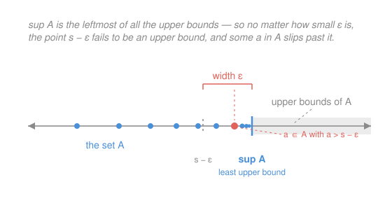

# Real Analysis · Lesson 1.2: Suprema, infima, and completeness

> ⏱ ~15 min · Module 1: The real number system · Builds on: [1.1 The gap in the rationals](01-01-gap-in-the-rationals.md) · Unlocks: [1.3 Consequences of completeness](01-03-consequences-of-completeness.md)

## Why this matters

In [1.1](01-01-gap-in-the-rationals.md) we found a bounded set of rationals — those with square less than $2$ — that *should* have a smallest upper bound but doesn't, because the number that ought to be it ($\sqrt 2$) isn't rational. That hole is the one defect separating $\mathbb{Q}$ from $\mathbb{R}$. This lesson names the missing property, installs it as **the** axiom of the real numbers, and then hands you the single most-used tool in the whole course: the ε-test for a supremum. Every existence theorem downstream — a limit exists, a max is attained, an integral is defined — bottoms out here.

## The idea

You can't always ask for the *biggest* element of a set. The interval of numbers strictly below $1$ has no biggest member: whatever you name, something larger is still below $1$. But there's a next-best object — the smallest ceiling that the whole set fits under. For that interval it's $1$ itself. That ceiling is the **supremum**, and the deep fact about the reals is that this ceiling *always exists* as an actual real number, even when it isn't a member of the set and even when no member ever quite reaches it.

That last clause is the entire point of the axiom. In $\mathbb{Q}$ the ceiling can go missing — the rationals below $\sqrt 2$ have candidate ceilings crowding down toward $\sqrt2$, but the exact least one lives in a hole. Declaring "$\mathbb{R}$ has no such holes" is what we're about to do.

## The formal version

Fix $A \subseteq \mathbb{R}$, nonempty. A number $u \in \mathbb{R}$ is an **upper bound** of $A$ if $a \le u$ for every $a \in A$; a **lower bound** $\ell$ satisfies $\ell \le a$ for every $a \in A$. $A$ is **bounded above** if it has some upper bound.

The **supremum** $\sup A$ is the *least* upper bound: a number $s$ that is an upper bound of $A$ and satisfies $s \le u$ for every upper bound $u$. The **infimum** $\inf A$ is the *greatest* lower bound, defined symmetrically.

> In words: $\sup A$ is the lowest ceiling the set fits under; $\inf A$ is the highest floor it sits on.

Note $\sup A$ need **not** belong to $A$. For $A = \{\,1 - \tfrac1n : n \in \mathbb{N}\,\}$ (with $\mathbb{N} = \{1,2,3,\dots\}$) the values $0, \tfrac12, \tfrac23, \dots$ climb toward $1$ without ever reaching it, yet $\sup A = 1$.

Now the axiom that makes analysis possible.

**Completeness Axiom (Least Upper Bound property).** Every nonempty $A \subseteq \mathbb{R}$ that is bounded above has a supremum $\sup A \in \mathbb{R}$.

> In words: if a set of reals has *any* ceiling, it has a *lowest* one, and that lowest ceiling is itself a real number — no holes. This is the one property $\mathbb{Q}$ lacks and $\mathbb{R}$ is *defined* to have; every theorem in this course is downstream of it.

(The matching statement for infima is free: if $A$ is bounded below, apply the axiom to $-A = \{-a : a\in A\}$ and read off $\inf A = -\sup(-A)$.)

The axiom guarantees $\sup A$ exists, but to *use* it you need a workable test for "this specific number is the sup." Definitions with "least" in them are awkward to check directly. Here is the reformulation you will reach for hundreds of times.

**The ε-characterization of the supremum.** Let $A$ be nonempty and bounded above, $s \in \mathbb{R}$. Then $s = \sup A$ **if and only if**

1. $s$ is an upper bound of $A$, and
2. for every $\varepsilon > 0$ there exists $a \in A$ with $a > s - \varepsilon$.

> In words: $s$ is the sup exactly when nothing in $A$ exceeds it (1), yet the set crowds arbitrarily close to it from below — drop even a hair to $s-\varepsilon$ and you're no longer a ceiling (2).

**Proof of the equivalence.**

($\Rightarrow$) Suppose $s = \sup A$. Then (1) holds because a supremum is by definition an upper bound. For (2), take any $\varepsilon > 0$. The number $s - \varepsilon$ is strictly less than $s$, and $s$ is the *least* upper bound, so $s - \varepsilon$ cannot be an upper bound. Failing to be an upper bound means precisely that some $a \in A$ satisfies $a > s - \varepsilon$.

($\Leftarrow$) Suppose $s$ satisfies (1) and (2). By (1) it is an upper bound; we must show it is the least. Let $u$ be any upper bound of $A$, and suppose for contradiction $u < s$. Put $\varepsilon = s - u > 0$. By (2) there is $a \in A$ with $a > s - \varepsilon = s - (s-u) = u$ — an element of $A$ strictly above the upper bound $u$, which is impossible. So every upper bound $u$ satisfies $u \ge s$; that makes $s$ the least upper bound, i.e. $s = \sup A$. $\blacksquare$

**Uniqueness of the supremum.** Suppose $s$ and $s'$ are both suprema of $A$. Each is an upper bound and each is a *least* upper bound: since $s$ is least and $s'$ is an upper bound, $s \le s'$; symmetrically $s' \le s$. Hence $s = s'$, and "$\sup A$" names one specific number. $\blacksquare$

## Picture

## Worked examples

**Example 1 (mechanical — the ε-test in action).** Let $A = \{\,1 - \tfrac1n : n \in \mathbb{N}\,\}$. Claim: $\sup A = 1$.

*Check (1), upper bound.* For every $n \in \mathbb{N}$ we have $\tfrac1n > 0$, so $1 - \tfrac1n < 1$. Thus $1$ is an upper bound of $A$.

*Check (2), crowding.* Fix $\varepsilon > 0$. We want some $a = 1 - \tfrac1n \in A$ with $1 - \tfrac1n > 1 - \varepsilon$, i.e. $\tfrac1n < \varepsilon$, i.e. $n > \tfrac1\varepsilon$. Such an integer $n$ exists because $\mathbb{N}$ is not bounded above — the **Archimedean property**, which [1.3](01-03-consequences-of-completeness.md) proves from this very axiom. Pick any such $n$; then $1 - \tfrac1n > 1 - \varepsilon$, as required.

Both conditions hold, so by the ε-characterization $\sup A = 1$. Notice $1 \notin A$: the supremum is approached but never attained. That "eventually within $\varepsilon$ of the target" phrasing in (2) is not a coincidence — it is the seed of the ε–N definition of convergence in Module 2, where this same set becomes a sequence tending to $1$.

**Example 2 (why you'd care — a bound that is never reached).** Consider $B = \{\, x \in \mathbb{R} : x^2 < 2,\ x > 0 \,\}$, the positive reals whose square is below $2$. Completeness promises $\sup B$ exists in $\mathbb{R}$; call it $s$. One can show $s^2 = 2$ — so $s = \sqrt2$, an honest real number that $\mathbb{Q}$ could not supply. This is exactly the set from [1.1](01-01-gap-in-the-rationals.md), and the axiom is what fills its hole: the least upper bound the rationals were missing is now guaranteed to be there. [1.3](01-03-consequences-of-completeness.md) carries this out to *construct* $\sqrt2$ from the axiom alone.

## Watch out

- You might think $\sup A$ is just "the largest element of $A$," but the sup need not be attained: $\sup\{1-\tfrac1n\} = 1 \notin A$. When the sup *does* belong to $A$ we call it the **maximum**; every max is a sup, but not conversely. "Does the optimum exist?" is precisely the max-vs-sup question — and later, what compactness is for.
- You might think every set has a sup. Only sets **bounded above** do. $\mathbb{N}$ has no upper bound, so no supremum — people write "$\sup \mathbb{N} = +\infty$," but that is shorthand for "unbounded above," not a real number the axiom hands you. The axiom's hypotheses (nonempty *and* bounded above) are not decoration.
- You might think condition (2) can use "$\ge s - \varepsilon$" or be checked at one fixed small $\varepsilon$. It must be strict-and-for-*all*: $a > s-\varepsilon$ for **every** $\varepsilon > 0$. Weaken it and numbers other than the true least bound sneak through.

## One-liner

> The supremum is the lowest ceiling a set fits under; completeness swears that ceiling is always a real number, and the ε-test — an upper bound you can't lower by any $\varepsilon$ — is how you catch it.

## Problems

**P1 (🟢)** Let $A = \{\,2 - \tfrac3n : n \in \mathbb{N}\,\}$. Find $\sup A$ and $\inf A$. For each, state whether it is attained (i.e. whether it's a max/min), and prove the value of $\sup A$ using the ε-characterization.

**P2 (🟡)** Suppose $A \subseteq B$ are nonempty and $B$ is bounded above. Prove $A$ is bounded above and $\sup A \le \sup B$. (One clean sentence per claim; no ε needed.)

**P3 (🔴, optional)** For nonempty sets $A, B$ bounded above, define $A + B = \{\, a + b : a \in A,\ b \in B \,\}$. Prove $\sup(A+B) = \sup A + \sup B$. (You'll need the ε-characterization for the harder inequality — and splitting a budget of $\varepsilon$ in two is the trick.)

Solutions

**P1** Write $a_n = 2 - \tfrac3n$. As $n$ grows, $\tfrac3n$ shrinks, so $a_n$ **increases**: $a_1 = -1,\ a_2 = \tfrac12,\ a_3 = 1, \dots$, climbing toward $2$.

*Infimum.* Since the sequence increases, its smallest value is the first, $a_1 = 2 - 3 = -1$, and every $a_n \ge -1$. So $-1$ is a lower bound and it lies in $A$: $\inf A = -1$, **attained** (it is the minimum).

*Supremum $= 2$, via the ε-test.* (1) For every $n$, $\tfrac3n > 0$ so $a_n = 2 - \tfrac3n < 2$; thus $2$ is an upper bound. (2) Fix $\varepsilon > 0$. We want $2 - \tfrac3n > 2 - \varepsilon$, i.e. $\tfrac3n < \varepsilon$, i.e. $n > \tfrac3\varepsilon$; such $n \in \mathbb{N}$ exists (Archimedean property). For that $n$, $a_n > 2 - \varepsilon$. Both conditions hold, so $\sup A = 2$. It is **not attained**: no $n$ gives $2 - \tfrac3n = 2$, so there is no maximum.

**P2** *Bounded above:* let $u = \sup B$. For any $a \in A$, since $A \subseteq B$ we have $a \in B$, hence $a \le u$; so $u$ is an upper bound of $A$ and $A$ is bounded above (nonempty by hypothesis, so $\sup A$ exists by completeness). *Inequality:* $\sup B$ is an upper bound of $A$, and $\sup A$ is the *least* upper bound of $A$, so $\sup A \le \sup B$. $\blacksquare$

**P3** Let $s = \sup A$, $t = \sup B$, and note $A+B$ is nonempty. 

*Upper bound ($\le$).* For any $a \in A$, $b \in B$: $a \le s$ and $b \le t$, so $a + b \le s + t$. Thus $s+t$ is an upper bound of $A+B$; since $\sup(A+B)$ is the least upper bound, $\sup(A+B) \le s + t$. (In particular $A+B$ is bounded above, so its sup exists.)

*Lower bound ($\ge$).* Fix $\varepsilon > 0$. By the ε-characterization applied to $A$ (with budget $\tfrac\varepsilon2$), there is $a \in A$ with $a > s - \tfrac\varepsilon2$; likewise $b \in B$ with $b > t - \tfrac\varepsilon2$. Adding, $a + b > s + t - \varepsilon$, and $a+b \in A+B$, so $\sup(A+B) \ge a+b > s + t - \varepsilon$. This holds for *every* $\varepsilon > 0$, which forces $\sup(A+B) \ge s + t$ (if it were smaller, taking $\varepsilon = s+t-\sup(A+B) > 0$ gives a contradiction).

Combining the two inequalities, $\sup(A+B) = s + t = \sup A + \sup B$. $\blacksquare$

## Connections

- **Backward:** this is the repair of the exact defect [1.1](01-01-gap-in-the-rationals.md) exhibited — the rationals-below-$\sqrt2$ set had candidate ceilings with no least one; the Completeness Axiom is the blunt promise that in $\mathbb{R}$ that never happens.
- **Forward:** [1.3](01-03-consequences-of-completeness.md) squeezes the Archimedean property, density of $\mathbb{Q}$, and the existence of $\sqrt2$ out of this single axiom. In Module 2 the ε-clause "some element within $\varepsilon$ below $s$" hardens into the ε–N definition of a limit, and completeness reappears as "every bounded monotone sequence converges."
- **Sideways:** the Riemann integral in Module 7 is *built* from suprema and infima — the lower integral is a $\sup$ of lower Darboux sums, the upper integral an $\inf$ of upper sums, and completeness is what guarantees both exist. In economics, a consumer maximizing utility over a budget set has a *supremum* of achievable utility that may fail to be a *maximum* unless the set is compact — the same max-vs-sup gap, wearing the name "does an optimal choice exist?"
