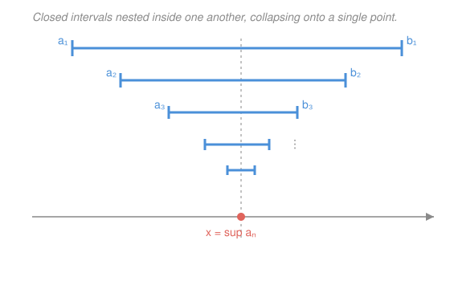

# Real Analysis · Lesson 1.3: Consequences of completeness

> ⏱ ~15 min · Module 1: The real number system · Builds on: [1.1 The gap in the rationals](01-01-gap-in-the-rationals.md), [1.2 Suprema, infima, and completeness](01-02-suprema-infima-completeness.md) · Unlocks: [1.4 Countable and uncountable](01-04-countable-and-uncountable.md)

## Why this matters

You paid for exactly one new axiom in [1.2](01-02-suprema-infima-completeness.md) — every nonempty set bounded above has a least upper bound. It looks modest. This lesson cashes it out: the same axiom forces the integers to be unbounded, the rationals to be everywhere, shrinking intervals to trap a point, and — finally — the hole that [1.1](01-01-gap-in-the-rationals.md) found at $\sqrt2$ to be filled. These four facts are the load-bearing tools for the entire course; every ε–N limit you prove in Module 2 secretly leans on the first one.

## The idea

Completeness says $\mathbb{R}$ has "no gaps." Three intuitions fall straight out.

- **Nothing is infinitely large.** No real number sits above every whole number — if one did, the naturals would have a least upper bound, and you could always squeeze one more natural just below it. So the integers march off to infinity, and their reciprocals $1/n$ get arbitrarily small. That is the **Archimedean property**: no infinite reals, no infinitesimals.
- **The rationals are everywhere.** Once $1/n$ can be made tiny, a ruler with marks $1/n$ apart is fine enough that one of its marks lands strictly inside *any* interval, however short. So between any two reals sits a fraction — the rationals are **dense**.
- **Shrinking clamps trap a point.** Stack closed intervals inside one another, each fitting in the last. The left ends climb, the right ends descend, and completeness supplies exactly the number they close in on — the intersection is never empty.

## The formal version

Throughout, $\mathbb{N}=\{1,2,3,\dots\}$ and "sup" is the least upper bound from [1.2](01-02-suprema-infima-completeness.md).

**Archimedean property.** $\mathbb{N}$ is not bounded above in $\mathbb{R}$. Equivalently: for every $x>0$ there is $n\in\mathbb{N}$ with $\dfrac1n<x$.

> *In words:* you cannot outrun the counting numbers, and you can always find a reciprocal smaller than any positive target.

*Proof.* Suppose $\mathbb{N}$ *were* bounded above. It is nonempty, so completeness hands us $s=\sup\mathbb{N}$. Since $s-1<s$, the number $s-1$ is **not** an upper bound, so some $n\in\mathbb{N}$ satisfies $n>s-1$. But then $n+1\in\mathbb{N}$ and $n+1>s$ — contradicting that $s$ bounds $\mathbb{N}$. So $\mathbb{N}$ is unbounded. For the equivalent form, given $x>0$ the number $1/x$ is not an upper bound, so some $n>1/x$, i.e. $1/n<x$. $\blacksquare$

**Density of $\mathbb{Q}$ in $\mathbb{R}$.** If $x<y$ are real, there is a rational $q$ with $x<q<y$.

> *In words:* no matter how close two distinct reals are, a fraction squeezes between them.

*Proof.* By the Archimedean property pick $n\in\mathbb{N}$ with $\dfrac1n<y-x$, so $ny-nx>1$. An interval of length greater than $1$ must contain an integer: let $m=\lfloor nx\rfloor+1$ (the floor exists because Archimedean bounds $nx$ below some integer). Then $m>nx$, and since $m\le nx+1<ny$, also $m<ny$. Divide by $n>0$: $x<\dfrac{m}{n}<y$. $\blacksquare$

**Nested Interval Theorem.** Let $[a_1,b_1]\supseteq[a_2,b_2]\supseteq\cdots$ be closed bounded intervals, each containing the next. Then $\displaystyle\bigcap_{n=1}^{\infty}[a_n,b_n]\neq\varnothing$.

> *In words:* a decreasing tower of closed intervals always shares at least one common point.

*Proof.* Nesting means the left ends increase ($a_1\le a_2\le\cdots$) and the right ends decrease ($b_1\ge b_2\ge\cdots$), with always $a_n\le b_n$. The set $\{a_n\}$ is nonempty and bounded above — by $b_1$, in fact by *every* $b_m$: for any $n$, if $n\ge m$ then $a_n\le b_n\le b_m$, and if $n<m$ then $a_n\le a_m\le b_m$. So each $b_m$ is an upper bound for $\{a_n\}$. Let $s=\sup\{a_n\}$. Being the *least* upper bound, $s\le b_m$ for every $m$; being an upper bound, $s\ge a_m$ for every $m$. Thus $a_m\le s\le b_m$ for all $m$, i.e. $s\in[a_m,b_m]$ for all $m$, so $s$ lies in the intersection. $\blacksquare$

## Picture

The left endpoints $a_n$ rise, the right endpoints $b_n$ fall, and $\sup\{a_n\}$ is the point they close in on — the one number caught in every interval.

## Worked examples

**Example 1 (mechanical — density in action).** Find a rational strictly between $\sqrt2\approx1.41421$ and $\sqrt3\approx1.73205$. Follow the proof: the gap is $y-x\approx0.318$, and $1/4=0.25<0.318$, so $n=4$ works. Then $nx=4\sqrt2\approx5.657$, so $m=\lfloor5.657\rfloor+1=6$, giving $q=\dfrac64=\dfrac32=1.5$. Check: $1.414<1.5<1.732$. ✓ The construction is not magic — it is a ruler fine enough ($1/4$-spacing) that a mark had to land in the gap.

**Example 2 (why you'd care — $\sqrt2$ finally exists).** [1.1](01-01-gap-in-the-rationals.md) built $A=\{x\in\mathbb{R}:x\ge0,\ x^2<2\}$ and showed it has *no rational* least upper bound. In $\mathbb{R}$ it must have one: $A$ is nonempty ($1\in A$) and bounded above (by $2$, since $x\ge2\Rightarrow x^2\ge4$), so completeness gives $s=\sup A$. Claim: $s^2=2$, which pins down $s=\sqrt2$. Rule out the two other options.

*Not $s^2<2$:* we find a slightly larger number still in $A$, contradicting that $s$ is an upper bound. For $0<h\le1$, using $h^2\le h$,
$$(s+h)^2=s^2+2sh+h^2\le s^2+(2s+1)h.$$
By the Archimedean property choose $h>0$ with $h<\dfrac{2-s^2}{2s+1}$ (and $h\le1$); then $(s+h)^2<s^2+(2-s^2)=2$, so $s+h\in A$ — impossible, as $s$ bounds $A$.

*Not $s^2>2$:* symmetrically, one finds $h>0$ with $(s-h)^2>2$, making $s-h$ a *smaller* upper bound of $A$ and contradicting that $s$ is the least. (Same algebra: for $0<h\le1$, $(s-h)^2\ge s^2-2sh$, so $h<\dfrac{s^2-2}{2s}$ forces $(s-h)^2>2$.)

Only $s^2=2$ survives. The hole [1.1](01-01-gap-in-the-rationals.md) found is exactly what completeness was built to fill.

## Watch out

- You might think the nested-interval theorem is about intervals shrinking, but the real hypotheses are **closed** and **bounded**. Drop *closed*: the open intervals $(0,1/n)$ are nested, nonempty, and bounded, yet $\bigcap_n(0,1/n)=\varnothing$ — any $x>0$ is evicted once $1/n<x$ (Archimedean again), and $0$ was never inside. Drop *bounded*: the closed sets $[n,\infty)$ are nested and nonempty, but no single point lies in all of them.
- You might think "$\mathbb{Q}$ is dense, so it's basically all of $\mathbb{R}$." No — between any two reals there is also an *irrational* (P2), and [1.4](01-04-countable-and-uncountable.md) will show the irrationals vastly outnumber the rationals. Dense means *everywhere*, not *everything*.
- You might think $\sup\{a_n\}$ in the theorem is one of the $a_n$. It usually isn't attained — in the picture no single interval's endpoint equals the limit point. A supremum is a boundary, not necessarily a member.

## One-liner

> One axiom, four tools: the naturals run to infinity, the rationals sit everywhere, closed clamps trap a point, and the hole at $\sqrt2$ is filled — all because $\mathbb{R}$ has no gaps.

## Problems

**P1 (🟢)** Prove that $\inf\left\{\dfrac1n:n\in\mathbb{N}\right\}=0$. Name the property you use at the key step.

**P2 (🟡)** Prove that between any two reals $x<y$ there is an *irrational* number. (Hint: you already have a rational between any two reals — shift the problem by $\sqrt2$.)

**P3 (🔴, optional)** Suppose the nested closed bounded intervals $[a_1,b_1]\supseteq[a_2,b_2]\supseteq\cdots$ additionally satisfy $b_n-a_n\le\dfrac1n$ for every $n$. Prove the intersection is a **single** point, not just nonempty.

Solutions

**P1** *0 is a lower bound:* every $1/n>0$, so $0\le 1/n$ for all $n$. *Nothing larger is a lower bound:* take any $\varepsilon>0$. By the **Archimedean property** there is $n\in\mathbb{N}$ with $1/n<\varepsilon$, so $\varepsilon$ fails to be a lower bound (an element sits below it). Hence $0$ is the *greatest* lower bound, i.e. $\inf\{1/n\}=0$. (Note the inf is not attained — no $1/n$ equals $0$.)

**P2** By density (proved above), there is a rational $q$ with $x-\sqrt2<q<y-\sqrt2$. Add $\sqrt2$: $x<q+\sqrt2<y$. And $q+\sqrt2$ is irrational — if it equaled some rational $r$, then $\sqrt2=r-q$ would be a difference of rationals, hence rational, contradicting [1.1](01-01-gap-in-the-rationals.md). So $q+\sqrt2$ is an irrational in $(x,y)$. $\blacksquare$

**P3** By the Nested Interval Theorem the intersection is nonempty; let $s=\sup\{a_n\}$ and $t=\inf\{b_n\}$. As in the proof, $a_m\le s\le b_m$ and $a_m\le t\le b_m$ for all $m$, and $s\le t$ (since $s\le b_m$ for every $m$ makes $s$ a lower bound of $\{b_m\}$, so $s\le\inf\{b_m\}=t$). The intersection is exactly $[s,t]$: any $x$ in every interval has $x\ge\sup a_n=s$ and $x\le\inf b_n=t$; conversely every $x\in[s,t]$ lies in all $[a_n,b_n]$.

Now bound the length $t-s$. For each $n$, $t\le b_n$ and $s\ge a_n$, so
$$0\le t-s\le b_n-a_n\le\frac1n.$$
Take any $\varepsilon>0$. The Archimedean property gives $n$ with $1/n<\varepsilon$, so $0\le t-s<\varepsilon$. A number that is nonnegative yet smaller than *every* positive $\varepsilon$ must be $0$; hence $t=s$, and the intersection $[s,t]=\{s\}$ is a single point. $\blacksquare$

## Flashback

**From Lesson 1.2 (Suprema, infima, and completeness):** Using the two-part characterization of the supremum — (i) $s$ is an upper bound, and (ii) for every $\varepsilon>0$ there is an element of the set exceeding $s-\varepsilon$ — prove that
$$\sup\left\{\,1-\tfrac1n:n\in\mathbb{N}\,\right\}=1.$$

Solution

*(i) $1$ is an upper bound.* For every $n$, $1/n>0$, so $1-\tfrac1n<1$.

*(ii) Nothing smaller works.* Fix $\varepsilon>0$. We need $n$ with $1-\tfrac1n>1-\varepsilon$, i.e. $\tfrac1n<\varepsilon$ — supplied by the Archimedean property. That element exceeds $1-\varepsilon$, so no number below $1$ can be an upper bound.

Conditions (i) and (ii) hold, so $\sup=1$. (It is never attained: $1-\tfrac1n<1$ always — a clean case where the sup is not a maximum.) $\blacksquare$

## Connections

- **Backward:** every proof here runs on [1.2](01-02-suprema-infima-completeness.md)'s completeness axiom, and the ε-characterization of sup is the recurring engine (Archimedean, √2, and the Flashback all use it). Example 2 closes the loop opened in [1.1](01-01-gap-in-the-rationals.md).
- **Forward:** the Nested Interval Theorem is the skeleton of Bolzano–Weierstrass (2.3) and of the proof that $[a,b]$ is compact (4.2) — boss problem 4 explicitly reconnects nested compact sets to this lesson. The Archimedean property is silently invoked in *every* ε–N limit of Module 2 (to turn "$1/n$ small" into "eventually within ε").
- **Sideways:** density is why decimal and rational approximation converge at all — the backbone of numerical computation and of building the Riemann integral (Module 7) from rational partitions. Compactness, seeded by nested intervals, is the object `topology` will generalize off the real line.
