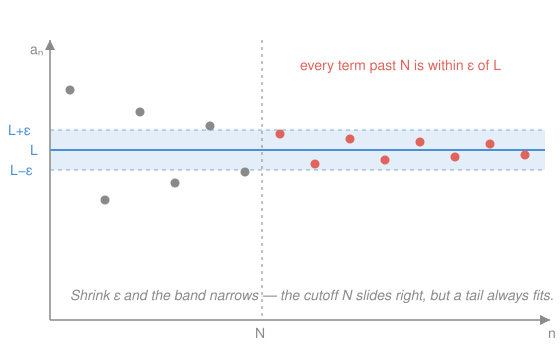

# Real Analysis · Lesson 2.1: Convergence — the ε–N definition

> ⏱ ~15 min · Module 2: Sequences · Builds on: [1.2 Suprema, infima, and completeness](01-02-suprema-infima-completeness.md), Archimedean property (1.3) · Unlocks: [2.2 Limit laws and the squeeze](02-02-limit-laws-and-squeeze.md)

## Why this matters

Every serious idea in analysis is a limit in disguise — the derivative, the integral, the sum of a series, the value a Newton iteration homes in on. Calc let you *compute* limits by feel ("the terms get close to $L$"). But "get close" is a slogan, not a definition: close enough for what, and when? This lesson replaces the slogan with a single sentence of logic precise enough to prove things with. Get this definition into your bones and the whole course runs; miss it and every later proof is a guess.

## The idea

Picture a debate. You claim the sequence $a_n = 1/n$ "goes to $0$." A skeptic tests you: *"Get within $0.01$ of $0$ — and stay there."* You answer: *"From the 101st term on, every $1/n$ is under $0.01$. Done."* She tries harder: *"Within $0.000001$."* You: *"From term one-million-and-one on."* You win the argument only if you have a comeback to **every** challenge she can name, no matter how tiny.

That's convergence. The skeptic's tolerance is the **challenge**; your cutoff index is the **response**. "$a_n \to L$" doesn't mean the terms *touch* $L$ — most never do. It means: name any tolerance, and I can point to a place past which the **entire tail** of the sequence sits inside it, permanently. Closeness on demand, forever.

## The formal version

A **sequence** is a function $a:\mathbb{N}\to\mathbb{R}$; we write its output at $n$ as $a_n$ and the whole thing as $(a_n)$. Let $L\in\mathbb{R}$.

**Definition (convergence).** $a_n \to L$ (read "$a_n$ converges to $L$") means
$$\forall\,\varepsilon>0\ \ \exists\,N\in\mathbb{N}\ \ \forall\,n>N:\quad |a_n - L| < \varepsilon.$$

**In words:** for every tolerance $\varepsilon>0$ (the challenge), there is a cutoff $N$ (the response) such that every term after the cutoff is within $\varepsilon$ of $L$. Here $|a_n-L|$ is the distance from the $n$th term to $L$; $\varepsilon$ (epsilon) is the challenge distance; $N$ is the index from which you keep your promise.

Read the quantifiers left to right as the debate itself: $\varepsilon$ is handed to you **first**, so your $N$ is allowed to depend on it — and it will. If $(a_n)$ converges to some $L$ we call it **convergent**; otherwise **divergent**.

**The negation.** To prove a sequence *doesn't* converge to $L$, you need the logical negation. By the quantifier-negation rule from the `proofs-primer` course — walk the quantifiers left to right, flip each ($\forall\leftrightarrow\exists$), and negate the inner inequality — we get:
$$a_n \not\to L \iff \exists\,\varepsilon>0\ \ \forall\,N\in\mathbb{N}\ \ \exists\,n>N:\quad |a_n - L| \ge \varepsilon.$$

**In words:** there is one stubborn tolerance $\varepsilon$ the sequence keeps violating — no matter how far out you push the cutoff $N$, some later term is still at least $\varepsilon$ away from $L$. The skeptic names *one* challenge you can never answer.

**The negation in action — $(-1)^n$ diverges.** The terms are $-1, 1, -1, 1,\dots$. Fix any candidate limit $L$ and take the stubborn tolerance $\varepsilon = 1$. Given *any* cutoff $N$, look past it: there is an even $n>N$ with $a_n = 1$ and an odd $m>N$ with $a_m = -1$. These two terms are distance $2$ apart, so $L$ cannot be within $1$ of both — if it were, the triangle inequality would give $2 = |1-(-1)| \le |1-L| + |L-(-1)| < 1 + 1 = 2$, impossible. So at least one of them satisfies $|a_n - L| \ge 1$. That is exactly the negation with $\varepsilon=1$, and $L$ was arbitrary, so no limit works: $(-1)^n$ diverges.

**Two theorems the definition forces.**

*Uniqueness of limits.* A sequence has **at most one** limit. Suppose $a_n\to L$ and $a_n\to M$ with $L\ne M$. Let $\varepsilon = |L-M|/2 > 0$ — half the gap. Convergence to $L$ gives $N_1$ with $|a_n-L|<\varepsilon$ for $n>N_1$; convergence to $M$ gives $N_2$ with $|a_n-M|<\varepsilon$ for $n>N_2$. For any $n>\max(N_1,N_2)$ the triangle inequality gives
$$|L-M| \le |L-a_n| + |a_n-M| < \varepsilon + \varepsilon = |L-M|,$$
so $|L-M| < |L-M|$ — a contradiction. Hence $L=M$. **In words:** a single tail can't nestle around two different targets at once; the gap between them would have to swallow itself.

*Convergent $\Rightarrow$ bounded.* If $a_n\to L$ then the sequence is **bounded**: some $M$ has $|a_n|\le M$ for all $n$. Apply the definition with $\varepsilon=1$: there is $N$ with $|a_n-L|<1$ for all $n>N$, and then $|a_n| \le |L| + 1$ for those $n$. Only the finitely many terms $a_1,\dots,a_N$ remain, so set
$$M = \max\{\,|a_1|,\ \dots,\ |a_N|,\ |L|+1\,\}.$$
Then $|a_n|\le M$ for every $n$. **In words:** past the cutoff the terms are trapped in a box around $L$; before it there are only finitely many, and finitely many numbers can't run off to infinity. (The converse fails — $(-1)^n$ is bounded but divergent.)

## Picture

The blue line is $L$ and the shaded strip is the tolerance band $[L-\varepsilon, L+\varepsilon]$. Grey dots (indices up to $N$) may wander anywhere; red dots (all $n>N$) have entered the band and never leave. Shrink $\varepsilon$ and the band narrows — the cutoff $N$ slides rightward, but a whole tail still fits. That "$N$ moves right as $\varepsilon$ shrinks" is the definition's entire content.

## Worked examples

**Example 1 (mechanical — $1/n \to 0$).** First the scratch-work: solve the target inequality for $n$. We want $|a_n - 0| = \left|\tfrac1n\right| = \tfrac1n < \varepsilon$, which rearranges to $n > \tfrac1\varepsilon$. So *any* index past $1/\varepsilon$ should work — we just need such an integer to exist, which is precisely the **Archimedean property** from 1.3: for the real number $1/\varepsilon$ there is a natural number exceeding it.

Now the clean proof. Let $\varepsilon>0$. By the Archimedean property choose $N\in\mathbb{N}$ with $N > \tfrac1\varepsilon$. Then for every $n>N$,
$$\left|\tfrac1n - 0\right| = \tfrac1n < \tfrac1N < \varepsilon.$$
Since $\varepsilon$ was arbitrary, $1/n \to 0$. $\blacksquare$ Notice the structure every ε–N proof shares: *take $\varepsilon$, produce $N$ (here from Archimedes), verify the inequality for all $n>N$.*

**Example 2 (the bounding trick — $\dfrac{n}{n^2+1} \to 0$).** Scratch-work: $\left|\dfrac{n}{n^2+1} - 0\right| = \dfrac{n}{n^2+1}$. Solving $\dfrac{n}{n^2+1} < \varepsilon$ *exactly* means wrestling a quadratic — pointless. Instead **overestimate to something clean**: since $n^2 + 1 > n^2$,
$$\frac{n}{n^2+1} < \frac{n}{n^2} = \frac1n.$$
So it is enough to force $\tfrac1n < \varepsilon$, and we are back in Example 1. This "bound the ugly expression above by a simple one, then beat *that*" move is the workhorse of the whole subject — you almost never solve the inequality exactly.

Clean proof: Let $\varepsilon>0$; by Archimedes choose $N > \tfrac1\varepsilon$. For $n>N$,
$$\frac{n}{n^2+1} < \frac1n < \frac1N < \varepsilon,$$
so $\dfrac{n}{n^2+1}\to 0$. $\blacksquare$

## Watch out

- **$N$ depends on $\varepsilon$ — that's the whole game.** You might think one heroic $N$ handles all tolerances, but $N$ is a *function of* $\varepsilon$: shrink $\varepsilon$ and $N$ generally grows (halve $\varepsilon$ in Example 1 and $N$ doubles). A single fixed $N$ only controls one band; convergence demands a response to *every* band.
- **"$<\varepsilon$" versus "$\le\varepsilon$" makes no difference.** You might think the strict inequality is sacred, but replacing $<\varepsilon$ by $\le\varepsilon$ — or by $<2\varepsilon$, or $<100\varepsilon$ — defines the *same* convergent sequences. Reason: $\varepsilon$ ranges over *all* positive numbers, so if you can beat every $\varepsilon$ you can beat every $\varepsilon/2$ too. Grab whichever form is convenient; a factor of $2$ never matters.
- **A finite prefix is invisible.** You might think editing $a_1,\dots,a_{1000}$ could change the limit, but the definition only ever constrains indices $n>N$, and you're free to take $N$ past your edits. Convergence is a property of the **tail** — change, delete, or reorder finitely many terms and the limit is untouched.

## One-liner

> $a_n\to L$ means: name any tolerance $\varepsilon$, and from some index $N$ on the *entire tail* sits within $\varepsilon$ of $L$ — $\varepsilon$ is the challenge, $N$ is your answer, and $N$ is allowed to grow as $\varepsilon$ shrinks.

## Problems

**P1 (🟢)** Prove directly from the ε–N definition that $\dfrac{2n+3}{n} \to 2$.

**P2 (🟡)** Prove that $\dfrac{\sin n}{n} \to 0$. (You cannot solve $\tfrac{|\sin n|}{n}<\varepsilon$ for $n$ — $\sin n$ has no pattern. What must you do to $|\sin n|$ first?)

**P3 (🔴, optional)** Prove that if $a_n \to L$ then $|a_n| \to |L|$. (Use the *reverse* triangle inequality $\big||x|-|y|\big| \le |x-y|$.) Then give a sequence where $|a_n|$ converges but $a_n$ does not — showing the statement is a one-way street.

Solutions

**P1** Simplify the distance to the limit: $\left|\dfrac{2n+3}{n} - 2\right| = \left|\dfrac{2n+3-2n}{n}\right| = \dfrac{3}{n}$. Scratch-work: $\tfrac3n < \varepsilon \iff n > \tfrac3\varepsilon$.

Clean proof: Let $\varepsilon>0$. By the Archimedean property choose $N\in\mathbb{N}$ with $N > \tfrac3\varepsilon$. For all $n>N$,
$$\left|\dfrac{2n+3}{n} - 2\right| = \dfrac{3}{n} < \dfrac{3}{N} < \varepsilon.$$
Hence $\dfrac{2n+3}{n}\to 2$. $\blacksquare$

**P2** You must **bound the numerator**: $|\sin n|\le 1$ for every $n$, so
$$\left|\dfrac{\sin n}{n} - 0\right| = \dfrac{|\sin n|}{n} \le \dfrac{1}{n}.$$
Now beat the clean upper bound. Let $\varepsilon>0$; by Archimedes choose $N > \tfrac1\varepsilon$. For all $n>N$,
$$\left|\dfrac{\sin n}{n}\right| \le \dfrac1n < \dfrac1N < \varepsilon.$$
So $\dfrac{\sin n}{n}\to 0$. $\blacksquare$ (This is the bounding trick of Example 2 again: never fight the numerator, cap it.)

**P3** Let $\varepsilon>0$. Since $a_n\to L$, there is $N$ with $|a_n - L| < \varepsilon$ for all $n>N$. By the reverse triangle inequality, for those same $n$,
$$\big||a_n| - |L|\big| \le |a_n - L| < \varepsilon.$$
Since $\varepsilon$ was arbitrary, $|a_n|\to|L|$. $\blacksquare$

One-way street: take $a_n = (-1)^n$. Then $|a_n| = 1 \to 1$, but $a_n$ itself diverges (shown above). So $|a_n|\to|L|$ can never *prove* $a_n\to L$ — information about signs is lost when you take absolute values.

## Flashback

**From Lesson 1.2 (the ε-characterization of the supremum):** Let $A\subseteq\mathbb{R}$ be nonempty and bounded above, and let $s=\sup A$. Construct a sequence $(a_n)$ with every $a_n\in A$ and $a_n\to s$. (This is why 1.2 phrased the sup as "for every $\varepsilon>0$ there is an element of $A$ within $\varepsilon$ of $s$" — it was the convergence idea before we had the word.)

Solution

The ε-characterization of $\sup$ says: $s$ is an upper bound of $A$, and for every $\varepsilon>0$ there exists $a\in A$ with $a > s-\varepsilon$. Feed it the shrinking tolerances $\varepsilon = \tfrac1n$.

For each $n\in\mathbb{N}$, apply the characterization with $\varepsilon = \tfrac1n$: there is $a_n\in A$ with $a_n > s - \tfrac1n$. Since $s$ is also an upper bound, $a_n \le s$. Together,
$$s - \tfrac1n < a_n \le s \quad\Longrightarrow\quad |a_n - s| < \tfrac1n.$$
Now show $a_n\to s$. Let $\varepsilon>0$; by the Archimedean property choose $N > \tfrac1\varepsilon$. For all $n>N$,
$$|a_n - s| < \tfrac1n < \tfrac1N < \varepsilon.$$
Hence $a_n\to s$ with every term drawn from $A$. $\blacksquare$

This is the first half of Boss problem 1, and the template for a recurring analysis move: *turn a sup (or inf) into a sequence in the set by plugging $\varepsilon = 1/n$ into its ε-characterization.*

## Connections

- **Backward:** the definition stands on two Module 1 results — the ε-characterization of $\sup$ from [1.2](01-02-suprema-infima-completeness.md) (the "eventually within $\varepsilon$" idea, reused verbatim in the Flashback) and the Archimedean property from 1.3, which is the exact tool that converts a challenge $\varepsilon$ into a response $N$ in every proof above.
- **Forward:** [2.2](02-02-limit-laws-and-squeeze.md) builds the algebra of limits and the squeeze theorem on this foundation — each of those proofs still ends by manufacturing an $N$ from an $\varepsilon$. The "convergent $\Rightarrow$ bounded" theorem proved here becomes a standing hypothesis (e.g. bounded $\times$ null $\to$ null), and boundedness is the entry point to Bolzano–Weierstrass in 2.3.
- **Sideways:** this same ε–N grammar reappears as **ε–δ** for continuity in 5.1 (swap "past index $N$" for "within distance $\delta$ of a point") and underlies the notion of convergence in `topology`. In numerics and physics it is the honest meaning of "the iteration converges" — precisely what Boss problem 2 asks you to certify for Newton's method toward $\sqrt2$.
