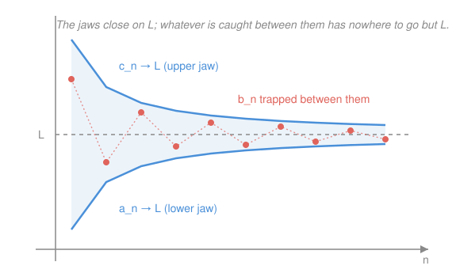

# Real Analysis · Lesson 2.2: Limit laws and the squeeze

> ⏱ ~15 min · Module 2: Sequences · Builds on: [2.1 Convergence: the ε–N definition](02-01-convergence-epsilon-n.md) · Unlocks: [2.3 Subsequences and Bolzano–Weierstrass](02-03-subsequences-bolzano-weierstrass.md)

## Why this matters

The ε–N definition from [2.1](02-01-convergence-epsilon-n.md) is the bedrock, but you do not want to descend to bedrock every time you compute a limit — hunting for an $N$ to prove $\frac{3n^2+2n}{5n^2-1}\to\frac35$ would be brutal and pointless. This lesson builds the toolbox that lets you compute limits *algebraically*, prove things converge *without producing the limit*, and — with the monotone convergence theorem — cash in the completeness axiom for the first time on sequences. That last move is the beating heart of analysis: existence you can prove but not yet compute.

## The idea

Prove the ε–N basics once, then never look back. Three tools carry almost everything:

1. **Limit laws** — limits respect $+$, $\times$, $\div$. If two sequences settle down, so does their sum, product, and quotient, at exactly the settled values. Limits pass *through* arithmetic.
2. **Squeeze** — if a sequence is trapped between two others that both head to the same place, it has no choice but to go there too. You don't need to understand the trapped sequence at all; you just need to pin it.
3. **Monotone convergence** — a sequence that only ever climbs but is held under a ceiling *must* converge. You can prove it arrives somewhere without ever saying where. This is completeness doing work no amount of algebra could.

The first tool is for computing. The last two are for *existence* — proving a limit is there before you know its value.

## The formal version

Throughout, a **sequence** $(a_n)$ is a function $\mathbb{N}\to\mathbb{R}$, and "$a_n\to A$" means: for every $\varepsilon>0$ there is an $N$ with $|a_n-A|<\varepsilon$ for all $n\ge N$ (the [2.1](02-01-convergence-epsilon-n.md) definition). "**Eventually**" means "for all $n$ past some index."

**Algebra of limits.** If $a_n\to A$ and $b_n\to B$, then
$$a_n+b_n\to A+B,\qquad a_nb_n\to AB,\qquad \frac{a_n}{b_n}\to\frac{A}{B}\ \ (\text{if } B\ne 0).$$
In words: if both pieces converge, the sum/product/quotient converges to the sum/product/quotient of the limits — the quotient only when the bottom limit is nonzero.

*Proof of the sum law.* Let $\varepsilon>0$. Since $a_n\to A$, pick $N_1$ with $|a_n-A|<\tfrac\varepsilon2$ for $n\ge N_1$; since $b_n\to B$, pick $N_2$ with $|b_n-B|<\tfrac\varepsilon2$ for $n\ge N_2$. For $n\ge N:=\max(N_1,N_2)$, the triangle inequality gives
$$|(a_n+b_n)-(A+B)|\le|a_n-A|+|b_n-B|<\tfrac\varepsilon2+\tfrac\varepsilon2=\varepsilon.\qquad\blacksquare$$
The $\varepsilon/2$ trick — split your error budget in two, spend half on each piece — is the workhorse of the whole subject. Meet it here; you'll use it forever.

*Proof of the product law.* The obstacle: $a_nb_n-AB$ mixes both errors at once. Fix it by **adding and subtracting** $a_nB$:
$$|a_nb_n-AB|=|a_nb_n-a_nB+a_nB-AB|\le|a_n|\,|b_n-B|+|B|\,|a_n-A|.$$
Now recall from [2.1](02-01-convergence-epsilon-n.md) that **every convergent sequence is bounded**: there is $M>0$ with $|a_n|\le M$ for all $n$. Given $\varepsilon>0$, choose $N_1$ so $|b_n-B|<\tfrac{\varepsilon}{2M}$ and $N_2$ so $|a_n-A|<\tfrac{\varepsilon}{2(|B|+1)}$ (the $+1$ dodges division by zero when $B=0$). For $n\ge\max(N_1,N_2)$,
$$|a_nb_n-AB|< M\cdot\tfrac{\varepsilon}{2M}+|B|\cdot\tfrac{\varepsilon}{2(|B|+1)}<\tfrac\varepsilon2+\tfrac\varepsilon2=\varepsilon.\qquad\blacksquare$$
The quotient law follows from the product law once you know $\tfrac1{b_n}\to\tfrac1B$: since $b_n\to B\ne0$, eventually $|b_n|>\tfrac{|B|}2$, so $\left|\tfrac1{b_n}-\tfrac1B\right|=\tfrac{|B-b_n|}{|b_n||B|}<\tfrac{2}{|B|^2}|b_n-B|\to0$. Then $\tfrac{a_n}{b_n}=a_n\cdot\tfrac1{b_n}\to A\cdot\tfrac1B$ by the product law.

**Squeeze theorem.** If $a_n\le b_n\le c_n$ eventually, and $a_n\to L$ and $c_n\to L$, then $b_n\to L$.

In words: a sequence pinned between two others that converge to the same limit is dragged to that limit too.

*Proof.* Let $\varepsilon>0$. Pick $N_1$ with $|a_n-L|<\varepsilon$ (so $a_n>L-\varepsilon$) for $n\ge N_1$, and $N_2$ with $|c_n-L|<\varepsilon$ (so $c_n<L+\varepsilon$) for $n\ge N_2$; let $N_3$ be an index past which $a_n\le b_n\le c_n$. For $n\ge\max(N_1,N_2,N_3)$,
$$L-\varepsilon<a_n\le b_n\le c_n<L+\varepsilon,$$
so $|b_n-L|<\varepsilon$. $\blacksquare$

**Monotone Convergence Theorem (MCT).** If $(a_n)$ is increasing ($a_{n+1}\ge a_n$ for all $n$) and bounded above, then $(a_n)$ converges, and $\lim a_n=\sup\{a_n:n\in\mathbb{N}\}$. (Mirror image: decreasing and bounded below $\Rightarrow$ converges to the inf.)

In words: a sequence that keeps climbing but never breaks a ceiling must arrive somewhere — precisely at its least upper bound.

*Proof.* The set $\{a_n:n\in\mathbb{N}\}$ is nonempty and bounded above, so by the **completeness axiom** ([1.2](01-02-suprema-infima-completeness.md)) its supremum $S:=\sup\{a_n\}$ exists. Let $\varepsilon>0$. By the ε-characterization of the sup, $S-\varepsilon$ is *not* an upper bound, so some term $a_N>S-\varepsilon$. Since $(a_n)$ is increasing, $a_n\ge a_N>S-\varepsilon$ for every $n\ge N$; and $a_n\le S$ always. Hence for $n\ge N$,
$$S-\varepsilon<a_n\le S<S+\varepsilon\quad\Rightarrow\quad|a_n-S|<\varepsilon.\qquad\blacksquare$$
Read the proof again and notice what it never did: it never named $S$ as a number. Completeness *hands you* the limit's existence; finding its value is a separate job (sometimes impossible in closed form). This is the first place completeness pays a dividend that no algebra could.

## Picture

## Worked examples

**Example 1 (mechanical — squeeze kills an oscillation).** Show $\dfrac{\sin n}{n}\to0$.

The numerator $\sin n$ lurches around forever — no limit, no pattern you can compute. Don't try. Just pin it: $-1\le\sin n\le1$, so
$$-\frac1n\ \le\ \frac{\sin n}{n}\ \le\ \frac1n.$$
Both jaws $-\tfrac1n$ and $\tfrac1n$ converge to $0$ (Archimedean property — for any $\varepsilon$, take $N>1/\varepsilon$). By squeeze, $\dfrac{\sin n}{n}\to0$. We proved it without ever understanding $\sin n$.

**Example 2 (why you'd care — MCT delivers a limit you can then solve for).** Define $a_1=\sqrt2$ and $a_{n+1}=\sqrt{2+a_n}$. Show the sequence converges and find the limit.

This is the "nested radical" $\sqrt{2+\sqrt{2+\sqrt{2+\cdots}}}$. You cannot write a formula for $a_n$, so limit laws alone are helpless. MCT rescues you in two steps.

*Bounded above by 2*, by induction: $a_1=\sqrt2<2$; and if $a_n<2$ then $a_{n+1}=\sqrt{2+a_n}<\sqrt{2+2}=2$.

*Increasing*: $a_{n+1}\ge a_n\iff\sqrt{2+a_n}\ge a_n\iff 2+a_n\ge a_n^2$ (both sides $\ge0$) $\iff a_n^2-a_n-2\le0\iff(a_n-2)(a_n+1)\le0$, which holds for $-1\le a_n\le2$ — true since $0<a_n<2$.

Increasing and bounded above $\Rightarrow$ by MCT the sequence **converges** to some $L$. Now find $L$ *without touching $\sqrt{\ }$-continuity*: square the recursion, $a_{n+1}^2=2+a_n$, and take limits of both sides. The left side $a_{n+1}^2\to L^2$ (product law: $a_{n+1}\to L$ since it's the same sequence shifted, and $L\cdot L=L^2$); the right side $2+a_n\to2+L$ (sum law). Equal limits force
$$L^2=2+L\ \Rightarrow\ L^2-L-2=0\ \Rightarrow\ (L-2)(L+1)=0.$$
Since every $a_n>0$, the limit is $L\ge0$, so $L=2$ (reject $-1$). The nested radical equals exactly $2$.

## Watch out

- **You might think** you can split $\lim(a_n+b_n)$ into $\lim a_n+\lim b_n$ freely — **but** the laws require *both* limits to exist first. Take $a_n=n$, $b_n=-n$: then $a_n+b_n=0\to0$, yet neither piece converges, and "$\lim a_n+\lim b_n=\infty-\infty$" is meaningless. Check convergence of the pieces *before* invoking a law.
- **You might think** MCT needs only monotonicity — **but** it needs *both* monotone **and** bounded. $a_n=n$ climbs forever with no ceiling and diverges to $\infty$. Drop the ceiling and you lose the theorem.
- **You might think** squeeze needs the two jaws to have limits you can find — **but** it only needs them to share *the same* limit. And it genuinely fails if they differ: $-1\le(-1)^n\le1$ traps $(-1)^n$, but the jaws disagree ($-1\ne1$), so nothing is concluded — correctly, since $(-1)^n$ diverges.

## One-liner

> Compute limits with the algebra of limits, corner oscillations with the squeeze, and when you can't name the limit at all, let monotone-plus-bounded prove it exists anyway.

## Problems

**P1 (🟢)** Using the algebra of limits, evaluate $\displaystyle\lim_{n\to\infty}\frac{3n^2+2n}{5n^2-1}$. Name each law as you use it and say why the quotient law is legal here.

**P2 (🟡)** Prove $\displaystyle\lim_{n\to\infty}\frac{n!}{n^n}=0$. (Hint: don't compute it — bound it. Compare the products term by term and squeeze.)

**P3 (🔴, optional)** Take the *same* recursion as Example 2, $a_{n+1}=\sqrt{2+a_n}$, but start at $a_1=4$. Prove the sequence is decreasing and bounded below by $2$, hence converges, and find the limit. Explain in one line why the same rule that made Example 2 *increase* now makes this sequence *decrease*.

Solutions

**P1** Divide numerator and denominator by $n^2$:
$$\frac{3n^2+2n}{5n^2-1}=\frac{3+\tfrac2n}{5-\tfrac1{n^2}}.$$
As $n\to\infty$: $\tfrac2n\to0$ and $\tfrac1{n^2}\to0$ (Archimedean). By the **sum law**, the numerator $\to3+0=3$ and the denominator $\to5-0=5$. Since the denominator's limit $5\ne0$, the **quotient law** applies and the whole expression $\to\tfrac{3}{5}$. The legality hinges entirely on that nonzero bottom limit — without it the quotient law says nothing.

**P2** Write out the ratio and bound it:
$$0\le\frac{n!}{n^n}=\frac{1}{n}\cdot\frac{2}{n}\cdot\frac{3}{n}\cdots\frac{n}{n}=\frac1n\cdot\underbrace{\frac2n\cdots\frac nn}_{\le\,1\text{ each}}\ \le\ \frac1n\cdot1=\frac1n.$$
Each of the factors $\tfrac2n,\dots,\tfrac nn$ is $\le1$, so their product is $\le1$; the first factor is $\tfrac1n$. Thus $0\le\tfrac{n!}{n^n}\le\tfrac1n$. Both jaws $0$ and $\tfrac1n$ converge to $0$, so by **squeeze** $\tfrac{n!}{n^n}\to0$. (We never computed the sequence — only trapped it.)

**P3** *Bounded below by 2*, by induction: $a_1=4>2$; if $a_n>2$ then $a_{n+1}=\sqrt{2+a_n}>\sqrt{2+2}=2$.

*Decreasing*: $a_{n+1}\le a_n\iff\sqrt{2+a_n}\le a_n\iff 2+a_n\le a_n^2$ (both sides $\ge0$) $\iff a_n^2-a_n-2\ge0\iff(a_n-2)(a_n+1)\ge0$, which holds whenever $a_n\ge2$ — exactly our bound. So $(a_n)$ is decreasing.

Decreasing and bounded below $\Rightarrow$ by the mirror MCT it **converges** to some $L$. Squaring the recursion and taking limits as in Example 2: $L^2=2+L$, so $(L-2)(L+1)=0$, and since every $a_n>2$ the limit is $L=2$.

*Why the switch:* the fixed point of the map $x\mapsto\sqrt{2+x}$ is $2$. Start below it (Example 2, $a_1=\sqrt2$) and the iteration pushes *up* toward $2$; start above it ($a_1=4$) and it pulls *down* toward $2$. Same rule, opposite side of the fixed point, opposite monotonicity — both funneling to $L=2$.

## Flashback

**From Lesson 2.1 (Convergence: the ε–N definition):** Prove directly from the ε–N definition that $\displaystyle\frac{2n}{n+3}\to2$.

Solution

Compute the gap:
$$\left|\frac{2n}{n+3}-2\right|=\left|\frac{2n-2(n+3)}{n+3}\right|=\frac{6}{n+3}<\frac{6}{n}.$$
Let $\varepsilon>0$. By the Archimedean property choose $N$ with $N>\tfrac6\varepsilon$, i.e. $\tfrac6N<\varepsilon$. Then for all $n\ge N$,
$$\left|\frac{2n}{n+3}-2\right|<\frac6n\le\frac6N<\varepsilon.$$
Since $\varepsilon>0$ was arbitrary, $\dfrac{2n}{n+3}\to2$. $\blacksquare$

(Contrast the effort: the limit laws would give this in one line — $\frac{2n}{n+3}=\frac{2}{1+3/n}\to\frac{2}{1+0}=2$ — which is exactly why we built the toolbox.)

## Connections

- **Backward:** every proof here rests on [2.1](02-01-convergence-epsilon-n.md) — the ε–N definition, the triangle inequality, and *boundedness of convergent sequences* (the load-bearing fact in the product law). MCT is the first sequence-level payoff of the completeness axiom from [1.2](01-02-suprema-infima-completeness.md).
- **Forward:** MCT is one of the three completeness workhorses; [2.3](02-03-subsequences-bolzano-weierstrass.md) builds Bolzano–Weierstrass on top of it, and Module 3 uses MCT on *partial sums* to define when a series converges. The squeeze reappears constantly in error bounds.
- **Sideways (recursion / fixed points):** Example 2 and P3 are a discrete dynamical system — iterating $x\mapsto\sqrt{2+x}$ toward its fixed point. The same "converges to the solution of $L=g(L)$" logic drives Newton's method (Boss problem 2), equilibrium-finding in the `micro-refresher` and `game-theory-refresher` courses, and numerical solvers everywhere.
